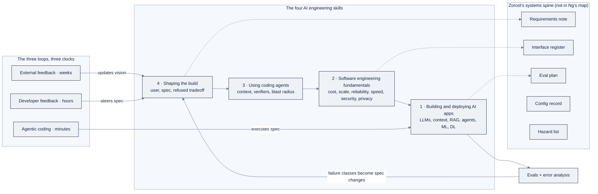

# 01: The AI Engineering Discipline

Purpose: the organizing framework of the whole program, Andrew Ng's four AI engineering skills and three loops, with Zorost's systems-engineering extensions, mapped onto the 24 weeks and the ZoroLogistics case study.

Part of AI Engineering Lab · Developed by Zorost Intelligence AI Lab · zorost.com

---

## Why this file exists

Every week in AI Engineering Lab points back to one question: *what is an AI engineer, and what are you actually becoming?* This file is the answer. It names the discipline, Andrew Ng's AI Engineering Skills Map, and it adds the layer Zorost Intelligence learned the hard way shipping AI into aviation, pharma, freight, and federal work: skills do not ship, systems do.

Read this file first. It is the spine the rest of the knowledge base hangs from.

---

## One sentence that changes everything

Zorost's article on the skills map opens with a sentence that explains most of the 2026 AI job market:

> "Implementation is the part that got cheap. Deciding what to implement is the part that got expensive. Every consequence in this article follows from that one sentence."

Dr. Fereydun Hashemi, *The AI Engineering Skills Map, turned into a training plan*, Zorost Signals, 16 Aug 2026

Hold that sentence while you read everything below. The four skills are four different ways of being valuable once typing code stops being the scarce input.

---

## The source: Ng's AI Engineering Skills Map

On **14 August 2026**, Andrew Ng and DeepLearning.AI published *The AI Engineering Skills Map* (The Batch, issue 366). Ng states two purposes for it: (1) help developers prioritize *what to learn*, and (2) help employers *hire skilled developers*.

### Methodology: and its honest limits

The map was synthesized from:

- **more than 10,000 job postings,**
- dozens of structured interviews with AI experts, hiring managers, and recruiters,
- surveys, and
- other online data.

Ng describes the process as roughly analogous to *clustering* that corpus to surface the skills that matter now and in the near future. He does **not** present it as a peer-reviewed statistical study, and he says he will keep revising it as AI evolves and will publish a more detailed version later.

Zorost's article adds the caveat worth remembering: the underlying dataset, collection window, geographic scope, interview guide, and any numeric ranking among the four areas are all unpublished. Treat the map as *an experienced practitioner's structured judgment supported by data*, not as a measurement you can audit. The release contains four areas of prose, no downloadable diagram, no proficiency levels, no role tracks, no curriculum. Anything tiered or percentage-labelled that you see floating around was drawn by someone else.

### Terminology: skills, not a job title

Ng is careful to write about **AI engineering skills**, not only the "AI Engineer" job title. His analogy: nearly every developer needs cloud skills, yet few hold the title "Cloud Engineer." The same is true here. The map applies to:

- full-stack engineers,
- data engineers,
- DevOps engineers,
- machine learning engineers,
- and people titled AI engineer.

"Should I retrain as an AI engineer?" is usually the wrong question. The skills are arriving inside the job you already have.

---

## The four skills

Read the four areas in order and you can see a movement **outward from the model**: first the AI system itself, then the software around it, then the tooling you use to produce that software, then the judgment about what to produce at all. Each area is further from the model and closer to the decision. That direction *is* the argument.

### 1. Building and deploying AI applications

The defining difference between AI and non-AI software is **unpredictable outputs**. Prompt an LLM and you do not know what you will get back; train a model and you do not know what it will predict on a new example. Traditional software behaves more predictably.

Skilled people know two things:

- the **building blocks**, LLMs, context engineering, retrieval-augmented generation (RAG), agentic workflows, machine learning, deep learning, and
- the **statistical techniques** to *measure, steer, and govern* those systems so they behave predictably enough to depend on.

The core practice is a disciplined **evals + error analysis** loop. This is the skill that separates an AI engineer from a demo builder. (It gets its own file: `07-evals-error-analysis.md`.)

### 2. Software engineering fundamentals

When you understand how software works, you build more effectively, because engineering is a set of **tradeoffs** among cost, scalability, reliability, and speed, with security and privacy adding further complexity.

Fundamentals do two jobs. First, they let you *recognize which tradeoffs exist* and make better stack, architecture, data-store, and testing decisions. Second, and more subtly, they let you *steer a coding agent in the precise language of software engineering*. An inexperienced vibe-coder does not know what tradeoffs the agent is silently making, and cannot give it the context that would have produced good ones.

Zorost's sharper version: when you write code yourself, you meet each tradeoff one at a time, at typing speed. When an agent writes it, a hundred tradeoffs are made in ninety seconds and handed back as a finished diff. **Reviewing that requires more architectural fluency than writing it did, not less.** A useful self-test: read a diff your agent produced and name three tradeoffs it made that it did not mention. If you cannot find three, you are reading it, not reviewing it.

### 3. Using coding agents

Agentic coding is now a key skill for every developer. Using it *effectively* means:

- an accurate mental model of how agents work, their limits, and workarounds;
- **context management**: what goes in the window, what stays out, when to compact;
- the **planning vs. execution** tradeoff;
- giving the agent **verifiers or evals** so it can close its own loop;
- working from a clear **spec** (and knowing when a formal spec is not worth it);
- **multi-agent orchestration** when one agent is not enough;
- **autonomy judgment**: how much to intervene vs. leave alone; and
- a **blast-radius rule** so the agent cannot wreck a production database.

The last item is the most durable: the specific tooling changes fast, so the real skill is a *routine* for trying new tools, judging them on evidence from your own work, and keeping or discarding them deliberately rather than by fashion.

Zorost emphasizes the **verifier** hardest: an agent loop is only as good as the signal that tells it whether it is done. With a test suite, a type checker, a linter, an eval set, or a schema, an agent iterates productively for a long time without you. With none, it produces something confident, plausible, and unchecked, and the checking lands on you at the least convenient moment.

### 4. Shaping the build

Given a clear spec, coding agents are rapidly improving at delivering to it. So the scarce work shifts **upstream**, to deciding what belongs in the spec. Engineers should no longer expect to receive a pixel-perfect design and only implement it; that expectation is precisely what got automated.

This skill means:

- **product sense** and understanding of **business context** and **customer goals**;
- taking **ownership and agency**, identifying worthwhile problems and driving the build;
- judging **when to ship a quick MVP** for user testing versus when to **slow down and build carefully** (when the blast radius is data, money, safety, or a hard-to-reverse architecture).

This is the hardest area to train because, unlike the first three, it has **no verifier except reality**, and reality returns its result slowly. You find out whether you chose the right problem in months, not minutes. Zorost's honest minimum exercise: pick a problem nobody assigned you, write the spec, build it, put it in front of a real user, and write down what you got wrong about the problem. Most people skip the last step, which is why most portfolios contain projects and few contain judgment.

### Cross-cutting: continuous learning

Underneath all four areas sits a mindset of **continuous learning**, not a fifth skill. Tools and practices change fast enough that a static skill set decays. Zorost makes it concrete: it is not a mindset, it is a *calendar entry*, a recurring block where you try something new, judge it against your own work, and write down the verdict.

---

## Software engineering, reborn

The most common misreading of the map is that software engineering is being retired. The letter says the opposite: fundamentals matter *more*, not less, because they are what let you supervise an agent instead of accepting its defaults. Zorost names the one-line version:

> "Writing code was never the job. It was the medium. The job was always deciding what should exist and proving that it does. Agents took the medium and left the job."

But "fundamentals still matter" is not precise enough to act on. The useful move is to sort the traditional craft into three ledgers and see which parts of your own week live where.

**What appreciated** (the parts now priced *upward*):

- **Reading code, at volume and at speed.** For thirty years the profession optimized for writing. The daily reality now is reading far more code than you produce, most of it written minutes ago by a machine with no stake in the outcome. Spotting the wrong abstraction in an unfamiliar file, and holding a system in your head while scanning a diff, are now core throughput skills.
- **Architecture and interface design.** Agents are competent inside a file and weak across a system. Deciding where a boundary goes, what crosses it, and what each side may assume is work an agent will do badly and confidently, and bad boundaries are the most expensive mistake to unwind.
- **Testing and verification design.** A test used to be insurance against your own mistakes. It is now the *specification you hand a machine* and the gate that decides whether its work ships. The engineer who can express "correct" as something executable controls the loop.
- **Debugging from evidence.** Agents are good at producing a fix and bad at establishing a cause. Reading a stack trace, forming a hypothesis, bisecting, instrumenting, and confirming transfers completely, and now applies to code you did not write.
- **Security and privacy thinking.** A system that acts on its own with real credentials fails differently from one that returns a page. Least privilege, input distrust, secret handling, and blast radius become design-time concerns.
- **Performance and cost reasoning.** Alongside algorithmic complexity and query plans sits a second meaning: cost per resolved task and a latency budget per user action. An engineer who cannot reason about those ships systems that work in the demo and cannot be afforded in production.

**What depreciated** (the uncomfortable ledger, honest about it is more useful than reassured):

- **Syntax recall and API memorization**: knowing the exact signature was a real edge for decades; it is now worth approximately nothing.
- **Boilerplate production**: scaffolding, wiring, adapters, standard CRUD; the part agents do best.
- **Framework trivia as identity**: deep familiarity with one framework's conventions was a hiring signal; it now takes an afternoon with an agent.
- **Greenfield implementation from a finished design**: the letter addresses this directly: that expectation is precisely what got automated, and it was the traditional entry-level rung.

The distinction that survives the depreciation: *understanding* why a framework works the way it does still matters; *recalling* its method names does not. Understanding appreciated; recall depreciated.

**What is genuinely new** (no analogue in the old craft):

- **Specification as a deliverable**: writing a spec precise enough for a machine to execute and a reviewer to grade. Harder than it looks, because an agent resolves your ambiguity silently rather than asking.
- **Verifier design**: deciding, before you start, how you will know the result is right, then making that check cheap enough to run continuously.
- **Context management**: what goes in the window, what stays out, when to compact, when to start clean.
- **Working with non-determinism**: correctness becomes a *rate*; a fix becomes a *shift in a distribution*; "it worked when I tried it" stops being a claim.
- **Orchestration and intervention judgment**: running several agents in parallel, and knowing when to let one continue versus stop it and take over.
- **Owning code nobody typed**: who reviews it, to what standard, who is on call, and what happens when it needs to change in a year.

The shape of the whole thing: programming is not disappearing, it is moving up a level of abstraction, the way it did from assembly to compiled languages and again to managed runtimes. What is different this time is that the new abstraction is **probabilistic rather than deterministic**. If the translation layer is unreliable, then *specifying precisely* and *verifying rigorously* stop being professional virtues and become the entire job.

---

## The three loops

Ng frames 0-to-1 product building as **three loops running on different clocks** (*Three Key Loops for Building Great Software*, The Batch, 2026).

| Loop | Cadence | What happens |
|---|---|---|
| **Agentic coding** | minutes | The agent writes code, runs tests, and iterates until the spec (and optionally evals) pass. Since roughly late 2025 an agent can close this loop on its own, even driving a browser to check the build, so it runs much longer without a human in the middle. |
| **Developer feedback** | tens of minutes to hours | The human examines the product and steers: features, UI, user flow. As agents test their own code, the human's time shifts from manual QA to higher-level product decisions. If the same problems repeat, *build evals*. |
| **External feedback** | hours to weeks | Friends, alpha testers, production usage, A/B tests. This data updates the developer's **vision**, which updates the **spec**, which drives the coding agent. |

The key idea: humans retain a **context advantage**, they know more than current AI about the users and the operating context, which is why the developer loop does not fully automate. Ng prefers "context advantage" to "taste," because it gives a concrete path to making the AI better rather than a vague appeal to human intuition.

In this program you will literally run all three loops: the coding-agent harnesses of Weeks 12 to 13 (loop 1), your own weekly use-case reviews (loop 2), and the Week 24 capstone plus portfolio (loop 3).

---

## Zorost's extensions: what the map leaves out

Ng's four areas are a beginning, and he says so. Zorost Intelligence's article adds three things this program is built on. Everything in this section is Zorost's, not Ng's, labelled as such.

### The systems-engineering spine

Skills do not ship. **Systems do.** The discipline that turns four separate skills into one workflow that holds is *systems engineering*, and it appears nowhere in Ng's letter.

The distinction matters: software engineering is about *building the software correctly*; systems engineering is about the *whole*, requirements, the interfaces between parts, verification that each requirement is met, validation that the requirements were the right ones, configuration control over what is actually deployed, and risk/traceability. It long predates AI, and it matters *more* for AI than for conventional software because an agentic application is a **system of systems**: a model you did not build and cannot inspect, a retrieval layer with its own freshness and lineage, tools with real side effects, a human reviewer, and a policy boundary around all of it. The interesting failures are emergent and cross-boundary, exactly the class of problem systems engineering exists to handle.

Applied to non-deterministic AI, the six classic practices translate as follows:

| Systems-engineering practice | What it means for an AI system |
|---|---|
| **Requirements, before the build** | A statistical acceptance criterion, not a wish. "Answers questions about our contracts" is not a requirement; "returns a cited answer for ≥90% of the question set, and declines rather than guesses for the rest" is one. |
| **Interface control** | A register of every boundary and its contract: model API, retrieval service, each tool the agent can call, the human review step, the audit sink. In an agentic system, tool contracts are also the security perimeter. |
| **Verification** (where evals belong) | Every requirement names the evidence that satisfies it, an eval set with a threshold. An eval not tied to a requirement is a number nobody can act on; a requirement with no eval is a hope. |
| **Validation** | Ask whether the requirements were *right*. A system can pass every eval and still be useless because the question set did not resemble what users actually ask. |
| **Configuration management** | A record of exactly what is deployed: model ID and version, system prompt, index build, chunking parameters, tool versions, thresholds. AI systems drift *without a code change* because a provider can update a model underneath you. |
| **Risk & traceability** | A hazard list of what happens when the system is wrong, ranked by consequence, plus a trace from each stated need to its evidence. In regulated sectors this determines whether you deploy at all. |

Zorost keeps five documents, none long, that accumulate across a build: a **one-page requirements note**, an **interface register** (a table), an **evaluation plan** mapping each requirement to its eval and threshold, a **configuration record** (generated, not handwritten), and a **hazard list with mitigations**. The minimum viable version is just two: the requirements note and the evaluation plan that maps to it.

> One caveat: systems engineering applied without judgment becomes documentation theatre. The test is simple, if none of the five documents has ever caused you to change the build, you are writing paperwork, not engineering a system.

### The seven competencies the map assumes but does not teach

Four areas is a good compression, and compression costs something. Zorost identifies **seven competencies the map quietly assumes are already handled**, the layer underneath it, where teams lose weeks. The seventh is systems engineering (above); the other six:

1. **Data engineering.** Area one begins at the model, but retrieval quality is a *data* problem long before it is a model problem, is the right document in the index, is it current, is it chunked so the answer survives the split, are permissions enforced at retrieval rather than in the prompt. Zorost calls this the single most common root cause behind "the AI gives wrong answers."
2. **Evaluation as a standing discipline.** Evals are one item among a dozen inside area one, but in production they are somebody's *job*: datasets to curate, graders to validate, drift to monitor, and a release gate with authority to block a ship.
3. **Unit economics as a design constraint.** Cost per *resolved task*, not cost per token; a *latency budget per user action*, not an average. These two numbers constrain architecture directly, they decide whether you can afford a multi-agent design, how many retrieval passes you get, and whether a verifier runs on every request or a sample.
4. **Trust boundaries in a system that acts.** A non-deterministic component holding real credentials is an attack surface conventional security review is not built for: prompt injection through retrieved content, tool scoping, least privilege for agent identities.
5. **Domain knowledge, especially where there is a regulator.** In aviation, pharma, manufacturing, and federal work the binding constraint is rarely the model, it is the standard, the audit trail, and what you are permitted to do with the data. Zorost's work enforcing Simplified Technical English mechanically exists because that constraint could not be prompted away.
6. **Working on a codebase that agents largely wrote.** Who reviews code nobody typed, to what standard, who is on call for it. Genuinely unsolved; Zorost flags it as arriving whether or not the practice is ready.

### The six-block twelve-week programme (and why our 24 weeks is a superset)

Zorost turned the map into a training plan with a sequence, a duration, and a **gate** at each stage. Its organizing principle: *every block ends in an artifact someone else can inspect*, a thing with a URL and a number attached to it, not a certificate. The six two-week blocks:

| Block | Weeks | What you build | Gate: you can show… |
|---|---|---|---|
| 1 · Ship one thin slice | 1 to 2 | One endpoint, one model call, deployed at a real URL, with request/response logging you can query. | …a stranger can use it, and what it did. |
| 2 · Write the eval before the feature | 3 to 4 | 30+ labelled cases, a grader that runs in one command, a baseline number recorded. | …your current score, plus one change you rejected because the score dropped. |
| 3 · Own the data path | 5 to 6 | Retrieval, ingestion, chunking, freshness, permissions, measured *separately* from generation. | …retrieval recall as a number distinct from answer quality. |
| 4 · An agent with real tools | 7 to 8 | Typed tools with narrow scopes, least-privilege credentials, a verifier, a per-tool blast-radius statement; adversarial testing. | …per tool, what happens when the agent is wrong and who finds out. |
| 5 · Make it affordable | 9 to 10 | Measure cost per resolved task and p95 latency, then halve both without losing eval score. | …a before/after table with cost, latency, and eval score. |
| 6 · Shape a build | 11 to 12 | A problem you chose, a spec you wrote (success + out-of-scope), agents executing it, a real user, and a retrospective. | …a spec document, a working system, and an honest retrospective on the problem choice. |

The **systems-engineering thread runs through all six** whether or not you name it: block 1 establishes a configuration you can point at; block 2 is verification; block 3 is interface control over the data path; block 4 is hazard analysis (a blast-radius statement per tool is exactly that); block 5 gives a non-functional requirement a number; block 6 is validation, discovering the requirements were partly wrong.

**Our 24-week program is a deliberate superset of this twelve-week core.** We keep every gate, but we slow down and go deeper: the twelve-week plan assumes you already know Python and assume the map's seven competencies. We teach them. Weeks 1 to 4 are the prerequisite (Python, data, ML, deep learning); the six blocks' *content* then stretches across Weeks 3 to 16; and we add a full model-engineering pass (9 to 11), a cloud-platform pass (18 to 20), and a governed lakehouse production pass (21 to 24) that the twelve-week plan deliberately leaves out.

---

## The roles that emerged

The map is about *skills*, not titles, but titles are how a budget gets approved and a job ad gets written. Zorost's article names twelve roles, split into the ones already being hired for and the ones currently splitting off from existing jobs. Each is a *recombination of the same four areas, weighted differently*, with the systems-engineering spine holding several of them together. That is the argument for training on the areas and staying indifferent to the title.

**Already advertised:**

- **AI forward deployed engineer**: an engineer embedded inside a client organization to customize and tune agentic workflows for that organization's reality. Areas one, three, and four with a customer in the room; Ng himself described it in June 2026 as one of the buzzy new Silicon Valley roles.
- **Evaluation engineer**: owns datasets, graders, and release gates, and can prove to someone outside the building that the system works.
- **Context engineer**: owns what enters the model's window and why: retrieval, compression, eviction policy, and a token budget treated as a design artifact.
- **Agent operations**: on-call for systems that act.
- **AI product engineer**: area four with implementation attached; the closest thing to the full-stack role of this era.
- **AI assurance & governance**: maps systems to frameworks such as the NIST AI Risk Management Framework and the EU AI Act *with evidence rather than policy documents*; in regulated sectors it becomes a condition of deployment.

**Splitting off now (scarce skill, no salary band yet, an opportunity and a risk):**

- **AI systems engineer**: holds the spine: requirements, interface contracts, the verification plan, and the configuration baseline, and signs that the system meets what was asked. Closest analogue is a systems engineer in aerospace or defense.
- **Agent security engineer**: splits from application security because the threat model changed: prompt injection through retrieved content, tool scoping, agent identity, exfiltration through a summarization step. Conventional appsec training does not cover an attacker who writes English.
- **AI reliability engineer**: site reliability for probabilistic systems: service-level objectives for a system that is up, fast, and *quietly wrong some percentage of the time*.
- **AI cost & capacity analyst**: FinOps pointed at tokens: cost per resolved task by workflow, model-routing policy, cache-hit economics.
- **Data curation & eval set owner**: decides which cases represent the problem, sources them, labels them with domain experts, and maintains them as the world changes. The highest-leverage job in the building that nobody has a title for.
- **Human review operations lead**: designs the escalation loop where a human stays in the loop at volume, and detects a reviewer rubber-stamping.

The through-line across all twelve: **the four areas, weighted differently.** This program deliberately builds all four, so the title you land on later is a choice, not a constraint.

---

## Why prompt engineering was "demoted" into context engineering

Ng's map does not name "prompt engineering" as one of the four areas, and it is not even on the list of named building blocks. That building-blocks list is: LLMs, **context engineering**, RAG, agentic workflows, machine learning, deep learning. Prompt engineering survives only as a small component of building applications.

The question is *why*, and Zorost's answer is worth quoting in full:

> "Not dead, demoted. It is not one of the four areas, and the letter does not list it as a named building block; it survives as a small component of building AI applications. What replaced it at the top of the list is measurement, error analysis and specification writing."

Three things happened at once:

1. **The frontier moved from the prompt to the window.** A single-turn prompt was the unit of work in 2023. By 2026 the unit of work is the *assembled context*, system prompt, retrieved documents, tool outputs, message history, compaction policy, and a token budget, assembled fresh for every call. That assembly is what the map calls **context engineering**, and it absorbed the mechanical half of prompting. Writing a good instruction is now table stakes; deciding *what enters the model's window and why* is the skill.
2. **Prompting became commodity.** Models got dramatically better at following instructions, so the marginal value of a cleverly-phrased prompt collapsed toward zero. The parts that remained hard are the parts a model cannot do for you: deciding what "correct" means, and proving the system meets that bar.
3. **The value moved to measurement and specification.** The skills that displaced prompt engineering, evals, error analysis, and writing specs, are structural, not cosmetic, because they define the *stopping condition*. A model can generate plausible output for any request; it cannot grade its own work against your requirements.

So: prompt engineering was not deleted, it was **generalized and demoted**. Its content split in two: the mechanical half into context engineering (a named building block), the judgment half into evals + error analysis + specification (the new top of the list). In this program you still learn prompting, but as a *small* part of Week 6, inside the larger context-engineering discipline.

---

## How the 24-week AI Engineering Lab program maps to the four skills

The four skills are not four separate courses; they are four lenses applied to every week. The table below shows where each one is *primary* (bold) versus where it runs underneath everything.

| Skill | Primary weeks | How it shows up |
|---|---|---|
| **1 · Building & deploying AI applications** | 3 to 11, 14 to 16 | LLM internals (5), prompt & context engineering (6), RAG & graphs (7), local models (8), quantization & serving (9), fine-tuning (10), evals & error analysis (11), agents & multi-agent (14 to 16). |
| **2 · Software engineering fundamentals** | 1 to 2, 24 (and every week) | Python & environment (1), data & SQL (2), then tradeoffs everywhere: cost/latency in 9 to 10, reliability & governance in 21 to 24, security & privacy in 17. |
| **3 · Using coding agents** | 12 to 13 | Harnesses (Claude Code, Cursor, OpenCode, DeepSeek Harness) and spec-driven agentic loops with verifiers and blast-radius rules. |
| **4 · Shaping the build** | every use case; explicit in 12 to 13, 24 | The Friday use-case exercise is a spec you own; Week 13 is spec-driven development; Week 24's capstone is a problem you chose, specified, and shipped. |

Read down the columns and you see the discipline is *cumulative*: the eval mindset starts in Week 1, the loop-closing starts in Week 12, and the "shape the build" judgment is the capstone.

For the week-by-week view, here is which skill is *primary* each week (skill 2, software fundamentals, runs underneath every week and is listed only where it is the explicit focus):

| Week | Title | Primary skill(s) |
|---|---|---|
| 1 | Python Foundations & the AI Engineering Landscape | 2, environment, git, the eval mindset from day one |
| 2 | Data Engineering & SQL for AI | 2, data model, the ZoroLogistics generator |
| 3 | Machine Learning Fundamentals | 1, first metric, split, and error analysis |
| 4 | Deep Learning with PyTorch | 1, training + evaluation intuitions |
| 5 | How LLMs Work: Tokens to Transformers | 1, building blocks (internals) |
| 6 | Prompt Engineering & the Context Window | 1, context engineering (prompting as a small part) |
| 7 | RAG, Vector Search & Knowledge Graphs | 1, retrieval, measured separately |
| 8 | Open Models & Local Inference | 1, open weights, GPUs, local serving |
| 9 | Quantization & Efficient Inference | 1 + 2, cost/latency tradeoffs |
| 10 | Fine-Tuning: LoRA, SFT & DPO | 1, model engineering after the eval says so |
| 11 | Evals & Error Analysis | 1, the measurement core |
| 12 | Coding-Agent Harnesses | 3, steering Claude Code, Cursor, OpenCode, DSH |
| 13 | Agentic Coding Loops & Spec-Driven Development | 3 + 4, verifiers, loops, the spec you own |
| 14 | Agent Fundamentals: Loop, Tools & Memory | 1, agentic workflows |
| 15 | Agent Frameworks: LangGraph | 1 + 3, controllable agents |
| 16 | Multi-Agent Systems & MCP | 1 + 3, orchestration and protocols |
| 17 | OpenClaw, Hermes & Agent Operations | 1 + 2, agent ops, security, cost |
| 18 | Azure AI Foundry | 1 + 2, one agent, first cloud |
| 19 | Google Vertex AI & Gemini | 1 + 2, one agent, second cloud |
| 20 | AWS Bedrock & SageMaker AI | 1 + 2, one agent, third cloud |
| 21 | Databricks Day Zero: Unity Catalog | 2, governance and lineage |
| 22 | Databricks Data Engineering: PySpark, Streaming | 2, the data path, production-grade |
| 23 | Databricks ML & Mosaic AI | 1 + 2, training, serving, Genie |
| 24 | Databricks Production & the Capstone | 4, a problem you chose, specified, and shipped |

The arc is deliberate: **build (1 to 11) → loop (12 to 13) → act (14 to 17) → scale (18 to 23) → shape (24)**. Skill 1 teaches you to make AI output predictable; skill 2 keeps the systems around it survivable; skill 3 makes you fast; skill 4 is what you are ultimately evaluated on.

---

## Use case connection: ZoroLogistics

Every week ends in an **inspectable artifact** tied to the same fictional company, **ZoroLogistics**, a freight company modeled on the regulated, traceability-first industries Zorost actually serves. That choice is not decorative; it is the systems-engineering spine made tangible.

- **Week 1** you build the synthetic-data generator that produces ZoroLogistics shipments, bills of lading, and support tickets. That data is the *configuration baseline* every later week reuses.
- **Weeks 2 to 11** you add, one layer at a time, the systems that a freight operator actually needs: SQL pipelines (2), shipment-classification and delay-forecasting models (3 to 4), an LLM assistant over the freight knowledge base (5 to 8), a fine-tuned and served model (9 to 10), and, the pivot of the whole program, an **eval harness with an error-analysis note** attached to each one (11).
- **Weeks 12 to 17** you build the agents that act on that data (support triage, document extraction, multi-agent orchestration), each with a verifier and a blast-radius statement per tool.
- **Weeks 18 to 24** you productionize the *same* agent three ways in the cloud and then onto a governed Databricks lakehouse, ending in the **ZoroLogistics Lakehouse Intelligence** capstone.

Because every week ends in something a stranger can inspect, a notebook with a metric, a deployed endpoint, an eval suite with a threshold, you graduate with the one thing the map says the market is pricing: **evidence of judgment, not evidence of typing.** In ZoroLogistics, as in Zorost's real work, a bill-of-lading field is extracted correctly *this often*, a RAG answer is grounded *this often*, and the artifact is the number plus the sample that establishes it.

---

## Where to start: the minimum viable discipline

The whole framework can feel like a lot. It collapses to two documents and one exercise, the "minimum viable version" Zorost recommends:

1. **A one-page requirements note**: written before the first line of code, stating what must be true for the system to be worth deploying, *as a statistical criterion* ("returns a cited answer for ≥90% of the question set, and declines rather than guesses for the rest"), not a wish.
2. **An evaluation plan that maps to it**: a table with one column naming which requirement each eval verifies, and the threshold that gates release. These two carry most of the value; the interface register, configuration record, and hazard list tend to write themselves once they exist.
3. **The one exercise, run on anything you already operate**: fifty real interactions, read by hand, categorized, counted, largest class fixed and added to the eval set. It costs an afternoon and reliably finds something an aggregate score cannot see.

If you do nothing else from this file, do those three. The first two turn "four skills" into a system somebody can take responsibility for; the third turns an enthusiast into an engineer.

---

## The three ledgers, as a table

The "software engineering, reborn" section above sorts the traditional craft into three
ledgers. Compressed into a table, it is a self-audit you can run in ten minutes:

| Ledger | What lives there | The test question | ZoroLogistics instance |
|---|---|---|---|
| **Appreciated** (priced upward) | Reading code at volume; architecture and interface design; verification design; debugging from evidence; security/privacy thinking; performance/cost reasoning | "Did I spend my week doing work an agent *can't* do well?" | Deciding where the retrieval boundary goes; writing the precision verifier; reading the agent's diff for silent tradeoffs |
| **Depreciated** (≈ worth zero) | Syntax recall; boilerplate production; framework trivia as identity; greenfield implementation from a finished design | "Am I being paid for recall instead of understanding?" | Memorizing the exact scikit-learn signature; hand-writing the fiftieth CRUD endpoint |
| **Genuinely new** (no analogue) | Specification as a deliverable; verifier design; context management; working with non-determinism; orchestration judgment; owning code nobody typed | "Is this skill even in the old job description?" | Writing the statistical acceptance criterion; deciding the eviction policy for the token budget |

The distinction that survives the depreciation is **understanding vs. recall**:
knowing *why* a framework works the way it does still matters; knowing its method names
does not. The uncomfortable but useful move is to split last week's hours across the
three rows and look at where they actually landed. A large number in the middle row is
not a judgment on you, it is a description of a job that is about to change, and the
table is the specific list of what to move toward.

---

## The whole framework on one diagram

Read it clockwise from the top-left: skill 4 decides the spec, skill 3 has agents execute
it, skill 2 keeps the surrounding system survivable, skill 1 makes the AI output
predictable, and the evals + error-analysis loop feeds what it learned back into the spec.
The three loops sit outside the four skills because they run on *clocks*, not on skills,
they are how the four skills get exercised over time. The systems spine sits underneath
because it is the layer that turns four separate skills into one workflow that holds.

The single most important edge on the diagram is the return arrow from evals + error
analysis back to shaping the build. Most people read the map left-to-right as "spec →
code → measure" and stop. The loop only works when the measurement *changes the spec*:
error analysis surfaces a failure class, and that failure class becomes a new spec line,
a new eval, or a new out-of-scope decision. A team that measures but never updates the
spec is running a scoreboard, not a loop.

---

## Deepening the roles: which skill each role actually leans on

The earlier roles section lists twelve roles and notes they are "the four areas, weighted
differently." Here is the actual weighting, plus the systems-spine artifact each role owns
and the ZoroLogistics instance of it. The weights are Zorost's judgment, not Ng's, and are
meant to be read as "where this role spends its scarcest hours," not a precise measurement.

| Role | Skill 1 | Skill 2 | Skill 3 | Skill 4 | Spine artifact it owns | ZoroLogistics instance |
|---|---|---|---|---|---|---|
| AI forward deployed engineer | ████ | ███ | ████ | ████ | Requirements note | Writes the "delay-notification assistant" spec with the freight operator in the room |
| Evaluation engineer | ████ | ██ | ██ | ██ | Eval plan | Owns the 200-case bill-of-lading field-F1 gate |
| Context engineer | ████ | ███ | ███ | ██ | Interface register (data path) | Owns the token budget and eviction policy for the RAG bot |
| Agent operations | ███ | ████ | ███ | █ | Hazard list | On call for the support-triage agent's tool failures |
| AI product engineer | ███ | ███ | ███ | ████ | Requirements note + eval plan | Owns "which ZoroLogistics problem is worth a build" |
| AI assurance & governance | ██ | ███ | █ | ██ | Hazard list + config record | Maps the RAG bot to NIST AI RMF with the eval numbers as evidence |
| AI systems engineer | ██ | ████ | ██ | ███ | All five | Signs that the lakehouse agent meets its stated requirements |
| Agent security engineer | ███ | ████ | ██ | █ | Hazard list (trust boundary) | Red-teams the bill-of-lading extractor with injected instructions |
| AI reliability engineer | ██ | ████ | ██ | █ | Config record | Watches p95 latency and eval drift on the triage model |
| AI cost & capacity analyst | ██ | ████ | █ | █ | Config record (cost column) | Owns cost-per-resolved-task by workflow |
| Data curation & eval set owner | ████ | ██ | █ | █ | Eval plan | Curates the 50-question RAG golden set and keeps it current |
| Human review operations lead | ██ | ███ | █ | ███ | Hazard list (escalation) | Designs the escalation loop that catches a rubber-stamping reviewer |

Reading down the "spine artifact" column: the systems spine is not one person's job, it
is distributed across the roles, which is exactly why the interface register and the
evaluation plan have to be *documents* rather than private mental models. When each role
owns one artifact and the artifacts cross-reference each other, the "system" survives a
person leaving. When the artifacts live in people's heads, the system leaves with them.

---

## Deepening the 24-week mapping: the cumulative skill ledger

The earlier mapping table shows which skill is *primary* each week. A second, more useful
view is **cumulative**: for each phase, what concrete *evidence of each skill* has
accumulated by the end of it. This is the ledger you can point a hiring manager at.

| By end of phase | Skill 1 evidence | Skill 2 evidence | Skill 3 evidence | Skill 4 evidence |
|---|---|---|---|---|
| 1 · Foundations (1 to 4) | First metric, split, and error-analysis note on the ETA model | Time-aware split; the synthetic-data generator as a config baseline | None yet (agents arrive at 12) | The use-case exercise is a problem you chose and specified |
| 2 · LLM Core (5 to 8) | Tokens/attention mental model; RAG recall@5 vs groundedness, measured separately | Token-cost and KV-cache reasoning | None yet | Context budget for the BoL extractor |
| 3 · Model Engineering (9 to 11) | Quantization sweep + fine-tune before/after table + eval harness | Cost-per-resolved-task and p95 latency | None yet | The eval says *what* to optimize, not instinct |
| 4 · Harnesses & Loops (12 to 13) | n/a | Verifier design (a test suite the agent closes against) | Steering Claude Code/Cursor/OpenCode/DSH; a blast-radius rule | A spec you wrote that the agent executed |
| 5 · Agents (14 to 17) | Working agent loops, tools, memory | Least-privilege tool scoping; agent ops | Multi-agent orchestration | Per-tool "what happens when it's wrong" statements |
| 6 · Cloud Platforms (18 to 20) | Same agent, three clouds | Governance, IAM, cost across platforms | n/a | Deciding which platform fits which constraint |
| 7 · Databricks (21 to 24) | Training, serving, Genie on a governed lakehouse | Lineage, governance, FinOps | n/a | The capstone: a problem you chose, specified, and shipped |

The through-line: **skill 1 and skill 2 accumulate evidence every single phase, while
skill 3 arrives late and skill 4 is exercised in every phase but only *scored* at the
end.** That asymmetry is deliberate and matches the market: implementation (1) and
survival (2) are table stakes you can show at any point; judgment (4) is the capstone
because it has no verifier except reality, and reality returns its result slowly.

---

## Spec-shaping worked example: the delay-notification assistant

Skill 4 (shaping the build) is the hardest to train, so here is the whole move worked on
a concrete ZoroLogistics problem. It is the Week 13 and Week 24 exercise in miniature.

### Step 1: name the user, the job, and the constraint

- **User:** a ZoroLogistics operations lead whose team manually watches the "severe
  weather" report and emails customers when a lane is likely to slip its SLA.
- **Job to be done:** *before* a shipment breaches its SLA, tell the customer it will be
  late and by roughly how much, so the customer can replan instead of calling support.
- **Constraint:** this is a *proactive customer communication* system. A wrong "your
  shipment is late" email erodes trust faster than silence, so the failure mode that
  matters is a **false alarm to a customer**, not a missed alert.

That constraint immediately shapes the metric (optimize precision, not recall) and the
blast radius (emailing customers is a write to the outside world, gated).

### Step 2: write the one-page requirements note (the spec, first draft)

| Spec element | What you write |
|---|---|
| User | Operations lead, ZoroLogistics |
| Job | Proactive delay notification before SLA breach |
| In scope | Shipments on domestic lanes, severe/moderate weather, delay forecast ≥ 6 hours |
| Out of scope | International/customs lanes; refunds; rebooking; anything under 6h forecast |
| Success (statistical) | Precision of "will be late" alerts ≥ 0.90 on the last 3 months of shipments; recall ≥ 0.70 (we accept missing some, we do not accept alarming customers) |
| Refused tradeoff | We will **not** auto-send: every email holds for human approval until precision is proven over a full month |
| MVP vs careful | MVP: nightly batch over yesterday's dispatches, no real-time, no customer preferences. Careful: the send action, the opt-out list, and the audit log |

Notice the two lines that do the real work: **success is statistical** (a threshold on
precision/recall, not "it works"), and **one refused tradeoff is named** (no auto-send).
Those two lines are the difference between a spec an agent can execute and a wish list.

### Step 3: hand it to the agent, with a verifier

The coding agent gets the requirements note plus a verifier: a Python test that replays
the last 3 months of shipment data and computes precision/recall against the *actual*
outcomes (which we know, because the data is historical). The agent iterates until the
verifier passes the threshold. Because "correct" is executable, the agent can close its
own loop for minutes at a time, this is loop 1 (agentic coding) at work.

### Step 4: the developer-feedback loop (minutes to hours)

You look at the agent's first pass and find it flags every severe-weather shipment,
including ones the carrier has historically absorbed. You tighten the spec: "a delay
forecast only counts if the carrier's own on-time rate for that lane is below 0.85."
The agent re-runs. This is loop 2: the human steers with the context advantage (you know
carrier behavior, the agent does not).

### Step 5: the external-feedback loop (days to weeks)

A pilot group of 50 customers gets the alerts. Three of them reply "why are you telling
me this, my shipment arrived fine", false alarms. Error analysis reads those three
traces, finds a common cause (the forecast ignored the carrier's *buffer* on that lane),
and the fix becomes a new spec line and a new eval case. This is loop 3: external
feedback updated the vision, which updated the spec, which the agent re-executed.

### Step 6: the retrospective (the part everyone skips)

Write down what you got wrong about the *problem*, not the code: "I assumed operations
wanted to notify every at-risk customer; actually they wanted to notify only the
high-value ones, because a false alarm on a $50 shipment costs the account manager a
phone call." That sentence, not the shipped code, is the evidence of judgment the
2026 market prices. This is the block-6 gate: a spec, a working system, and an honest
retrospective.

The same five artifacts a hiring manager can inspect: the requirements note, the verifier,
the spec diff from step 4, the three error-analysis traces, and the retrospective.

### The MVP-vs-careful decision, made explicit

Skill 4 is partly the judgment of *pace*: ship a quick MVP when learning is the
bottleneck, slow down when the blast radius is data, money, safety, or a hard-to-reverse
architecture. That judgment can be written as decision rules rather than left to feel:

| Signal | Lean toward MVP | Lean toward careful build |
|---|---|---|
| What you are learning | The *problem* (is this even what users want?) | The *solution's* correctness under load |
| Blast radius of a wrong output | A mis-ranked suggestion; a draft the user edits | An email to a customer; a payment; a compliance filing |
| Reversibility | Throwaway code; a new endpoint you can delete | A schema migration; a data store choice; an API contract |
| Domain familiarity | Unfamiliar, an inferior spec plus a cheap prototype is legal (Ng's 0-to-1 exception) | Mature, the architecture decisions should precede the code |
| Who sees the failure | You, in a sandbox | A regulated auditor, a customer, a production database |

ZoroLogistics makes the two poles concrete with the same assistant: the **MVP** is a
nightly batch over *yesterday's* dispatches that writes a *draft* email to a shared
queue, throwaway, no send path, learning whether anyone even wants the alert. The
**careful build** is the real-time, human-gated, audited send path, because by then the
blast radius is a customer's inbox and the trust of the account, which is not reversible.
The mistake is collapsing the two: building the careful version before you know the
problem is worth solving, or shipping the throwaway version as if it were the careful one.

### The three loops, mapped onto the ZoroLogistics timeline

The loops are not abstract; in this program they are *the same work* at three zoom levels:

| Loop | Cadence | ZoroLogistics instance | What it produces |
|---|---|---|---|
| Agentic coding | minutes | The Week 12 to 13 harness iterates the delay-notification code until the precision verifier passes | A passing diff |
| Developer feedback | tens of minutes to hours | Your Friday use-case review: "the agent flagged too many severe-weather shipments, tighten the spec to carrier on-time < 0.85" | A spec change |
| External feedback | hours to weeks | The Week 24 capstone pilot: three customers reply "it arrived fine" | A vision change, then a spec change |

The reason to run all three *on one problem* rather than three toy problems is that the
loops feed each other: a spec change from loop 2 is only as good as the loop-1 verifier
that enforces it, and the loop-3 pilot is only worth running once loop 1 can turn its
lessons into code in minutes. Run the three loops on disconnected demos and you get three
separate lessons; run them on the ZoroLogistics case and they compound into a system.

---

## How it breaks / common mistakes

The four skills fail in characteristic ways, and the failures are *different per skill*:

| Skill | The failure mode | What it looks like | The fix |
|---|---|---|---|
| 1 · Building AI apps | Measuring end-to-end only | "The bot is 88% accurate" with no idea that retrieval is the broken layer | Measure retrieval, generation, and tools separately |
| 1 · Building AI apps | Shipping on vibes | "It looks better now" with no before/after number | Name the metric and the threshold before the change |
| 2 · Software fundamentals | Accepting the agent's silent tradeoffs | A diff that compiles but chose the wrong data store, an N+1 query, no idempotency | Name three tradeoffs the agent made that it did not mention |
| 2 · Software fundamentals | Vibe-coding without the vocabulary | "Make it faster" instead of "batch the N+1 and add a covering index" | Learn the precise engineering language; it is the control interface |
| 3 · Using coding agents | No verifier | The agent produces confident, plausible, unchecked output and you QA it at midnight | Give it a test suite, a type checker, a linter, an eval, a schema |
| 3 · Using coding agents | No blast-radius rule | The agent can write to the production database on a bad day | Read-only by default; writes gated behind approval |
| 4 · Shaping the build | Spec as a wish list | "Answers questions about our contracts" with no threshold and no out-of-scope | Statistical acceptance criterion + one refused tradeoff |
| 4 · Shaping the build | Skipping the retrospective | A portfolio of projects and no judgment | Write down what you got wrong about the *problem* |

Two of these deserve extra emphasis because they compound silently. **No verifier** turns
every agent session into an unbounded QA task that lands on you; the fix is not "watch the
agent more" but "give it something executable to close against." **Measuring end-to-end
only** hides the layer that is actually broken; the fix is not "a bigger model" but
"measure the pipeline in layers." Both are cheap to fix and expensive to skip.

The through-line under all eight: the failure is almost never "the model was too weak."
It is a *discipline* gap, a missing verifier, an unnamed tradeoff, an unmeasured layer,
a wish-list spec. That is the quiet argument of the whole map: in 2026 the scarce input
is not model capability, it is engineering judgment, and judgment fails by omission.

---

## Self-check questions

1. **What are Ng's four AI engineering skills, in order, and what direction does the order describe?**
   *Answer:* Building and deploying AI applications (1), software engineering
   fundamentals (2), using coding agents (3), shaping the build (4). Read in order they
   move outward from the model, from the AI system itself, to the software around it, to
   the tooling that produces the software, to the judgment about what to produce at all.

2. **Why did "prompt engineering" get demoted, and what replaced it?**
   *Answer:* It was not deleted but generalized: the mechanical half (assembling the
   window) became **context engineering**, a named building block, and the judgment half
   (deciding what "correct" means) became **evals + error analysis + specification**.
   Phrasing became table stakes; measurement and specification became the scarce skill.

3. **What are the three loops and their clocks, and how does each feed the next?**
   *Answer:* Agentic coding (minutes) executes the spec; developer feedback (tens of
   minutes to hours) steers the spec from human context; external feedback (hours to
   weeks) updates the *vision*, which updates the spec, which the agent re-executes. The
   human stays in the developer loop because of a **context advantage**, not "taste."

4. **What is the minimum viable version of Zorost's systems-engineering spine?**
   *Answer:* Two documents, a **one-page requirements note** (statistical acceptance
   criteria, not a wish) and an **evaluation plan** that maps each requirement to the eval
   and threshold that verifies it. The interface register, configuration record, and
   hazard list tend to write themselves once those two exist.

5. **In the spec-shaping worked example, what single spec line did the most work, and why?**
   *Answer:* The **refused tradeoff**, "we will not auto-send; every email holds for
   human approval until precision is proven." It names the blast radius (emailing
   customers is a write to the outside world) and converts a vague risk into a concrete
   gate, which is precisely the judgment a coding agent cannot supply on your behalf.

**Where to go next from this file.** Skill 1's measurement core is expanded in
`07-evals-error-analysis.md`; the software-fundamentals tradeoffs run underneath
`02-ml-dl-fundamentals.md` through `06-model-engineering.md`; skill 3's verifiers and
blast-radius rules are the daily practice of the harnesses in Weeks 12 to 13; and skill 4's
spec-writing is the Friday use-case exercise every single week. Read this file once for
the map, then come back to it at Week 24, the capstone is where you discover which of
the four skills you actually built, and which you only read about.

---

## Sources

- Ng, *The AI Engineering Skills Map*, The Batch issue 366, 2026-08-14: https://www.deeplearning.ai/the-batch/issue-366 · https://x.com/AndrewYNg/status/2088302050706686198
- Ng, *Three Key Loops for Building Great Software*, The Batch, 2026: https://www.deeplearning.ai/the-batch/three-key-loops-for-building-great-software
- Ng, *Make All Your Tokens (and Your Brainwork) Count*, The Batch: https://www.deeplearning.ai/the-batch/make-all-your-tokens-and-your-brainwork-count
- Ng, *Coding Agents Accelerate Some Software Tasks More Than Others*, The Batch: https://www.deeplearning.ai/the-batch/coding-agents-accelerate-some-software-tasks-more-than-others
- Ng, *Improve Agentic Performance with Evals and Error Analysis, Part 1 & 2*, The Batch: https://www.deeplearning.ai/the-batch/improve-agentic-performance-with-evals-and-error-analysis-part-1 · https://www.deeplearning.ai/the-batch/improve-agentic-performance-with-evals-and-error-analysis-part-2
- Hashemi, Fereydun (Zorost Intelligence), *The AI Engineering Skills Map, turned into a training plan*, 2026-08-16: https://zorost.com/ai-engineering-skills-map-training-guide
- Zorost Intelligence: https://zorost.com
