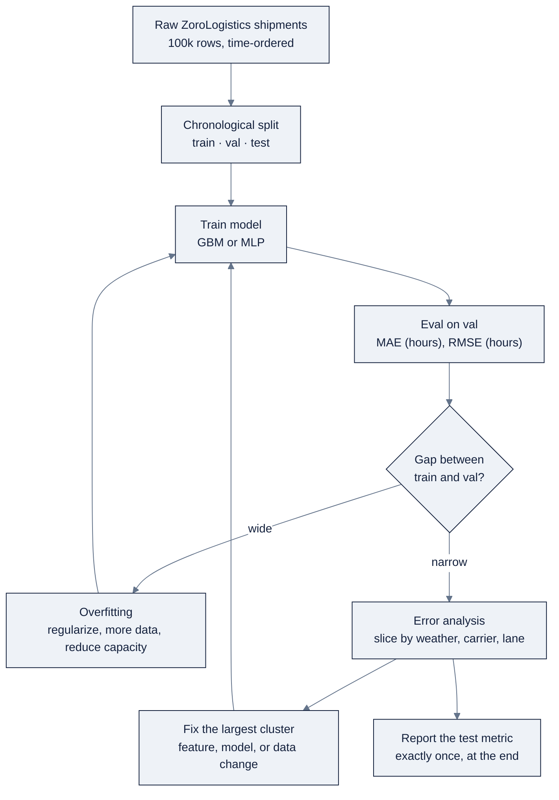

# 02: ML & Deep Learning Fundamentals

> Classical machine learning and deep learning for AI engineers: the supervised-learning and evaluation discipline, then the neural-network mechanics, grounded in a ZoroLogistics metric plan.

**Part of AI Engineering Lab · Developed by Zorost Intelligence AI Lab · zorost.com**

---

## Why this matters to an AI engineer

Before you can reason about an LLM or an agent, you need the two things classical
machine learning teaches better than anything else: **pick the metric before the
model**, and **trust nothing without a split**. Generative models are a special case
of the same problem, a function you train on data and whose output you cannot fully
predict, so the habits in this file (a metric, a split, an error analysis) transfer
directly. Ng's framing is the through-line: *AI outputs are unpredictable, so every
model ships with a metric and an error analysis.* Classical ML and deep learning are
also still the right tool for tabular and structured problems, exactly what
ZoroLogistics needs.

---

## 1. Supervised learning: regression vs classification

**Supervised learning** means you have labeled examples: each input row comes with a
target value, and the model learns a mapping from inputs to targets. The two
families differ only in what the target looks like.

- **Regression** predicts a *continuous number*: transit time in hours, cost in USD,
  weight in kilograms. The model can return any real value, and being "wrong" is a
  matter of *how far* off it is.
- **Classification** predicts a *category*: on-time vs. late, compliant vs. flagged,
  high-risk vs. low-risk lane. The model (usually) returns a probability per class,
  which you then turn into a label with a threshold.

The practical difference is in the loss function and the metric, not the code. A
regression model minimizes a distance-like loss; a classifier minimizes a
probability loss and is judged by how often it picks the right class.

---

## 2. Data splits: train / validation / test

You never evaluate on the data you trained on, a model can memorize its training
set and score perfectly while being useless on new data. The standard discipline is
three disjoint sets:

- **Train**: fit the model parameters.
- **Validation (dev)**: tune hyperparameters (learning rate, depth, dropout) and
  pick the best model variant. You look at it many times, so it slowly leaks into
  your decisions; that's fine, it's *for* that.
- **Test**: touched exactly once, at the end, to report honest performance.

A common split for a mid-sized tabular dataset is 70/15/15 or 80/10/10. For small
datasets you use **cross-validation** (Section 5) because you can't afford to hold
out much.

> **Freight-specific note: time-aware splits.** Shipment data is a time series.
> If you split randomly, a "future" shipment (with its weather, its holiday
> congestion, its outcome) can land in training while a "past" shipment sits in the
> test set, the model learns the future and then looks brilliant on the past. That
> is **leakage**, and it inflates every metric. For ZoroLogistics, always split
> **chronologically**: train on the earliest months, validate on the next window,
> test on the most recent. Never shuffle across time.

```python
# Time-aware split by an ordered date column, not a random shuffle.
cut1, cut2 = "2025-09-01", "2025-11-01"
train = df[df.date < cut1]
val   = df[(df.date >= cut1) & (df.date < cut2)]
test  = df[df.date >= cut2]
```

---

## 3. Metrics, and when each matters

### Regression metrics

- **MAE (mean absolute error)**: average absolute difference between prediction and
  target, in the target's own units (hours, USD). Easy to explain to an operator:
  "we're off by 3.2 hours on average." Robust to a few huge misses.
- **RMSE (root mean squared error)**: square each error, average, then take the
  root. Squaring makes large errors count disproportionately, so RMSE *punishes big
  misses* more than MAE does. Report both: MAE for the typical error, RMSE to
  surface the tail.

### Classification metrics

- **Accuracy**: fraction correct. Misleading when classes are imbalanced: if 93%
  of shipments are on time, a model that always says "on time" is 93% accurate and
  completely useless for the 7% that matter.
- **Precision** = TP / (TP + FP), of everything you flagged, how much was actually
  a hit. High precision = few false alarms.
- **Recall** = TP / (TP + FN), of everything that was actually positive, how much
  did you catch. High recall = few misses.
- **F1** = harmonic mean of precision and recall, a single number that punishes
  trading one for the other. Use it when you care about both false alarms and
  misses, or as a headline number on imbalanced data.

**Which metric matters** is a business question, not a math question. When a false
alarm is cheap and a miss is catastrophic (fraud, late-SLA detection), optimize
recall. When acting on a flag is expensive (pulling a shipment off a truck for
inspection), optimize precision. Pick the metric before you pick the model.

---

## 4. Cross-validation

When data is scarce, holding out a single validation fold wastes training data and
makes your estimate noisy. **k-fold cross-validation** splits training data into k
folds, trains on k−1 and evaluates on the held-out fold, rotating until every fold
has been the evaluation set, then averages the k scores.

For time-ordered data, use **time-series cross-validation** instead: train on an
expanding past window and evaluate on the next chunk, always forward in time. This
keeps the "no future leaking into the past" rule that random k-fold would violate.
Cross-validation estimates *how stable* your model is across data, not just how good
it was on one lucky split.

---

## 5. Feature scaling

Many models are sensitive to the *units* of inputs. A feature measured in
millimeters (values in the thousands) will dominate a feature measured in tons
(values in single digits) inside distance or gradient computations. Two common
scalers:

- **Standardization (z-score)**: subtract the mean, divide by the standard
  deviation, so each feature has mean 0 and unit variance. Default choice for
  linear/logistic regression, SVMs, and neural networks.
- **Min-max normalization**: rescale into a fixed range like [0, 1]. Useful when
  you know the bounds or when an algorithm expects non-negative inputs.

**Fit the scaler on training data only**, then apply the same transform to
validation and test, otherwise you leak the test set's statistics into training.
Tree-based models (random forests, gradient boosting) split on raw thresholds and do
**not** need scaling, which is one reason they're such a strong tabular baseline.

---

## 6. Bias, variance, and overfitting

Every model makes an error that decomposes into three parts:

- **Bias**: error from the model being too simple to capture the real pattern.
  High bias = **underfitting**: the model misses the signal entirely.
- **Variance**: error from the model being too sensitive to the specific training
  sample. High variance = **overfitting**: the model memorizes noise and falls apart
  on new data.
- **Irreducible error**: the noise in the problem itself; no model can remove it.

There is a tradeoff: a more flexible model (deeper tree, bigger network) lowers bias
but raises variance. **Overfitting** shows up as a model that excels on training
data and underperforms on validation, the single most important signal to read in a
learning curve. Regularization (Section 11) is the standard way to pull a
high-variance model back.

---

## 7. Baselines

Before training anything clever, establish the floor a real solution must beat.
Strong baselines cost minutes and prevent months of polishing a model that is worse
than the obvious answer:

- **Regression**: predict the mean or median of the training target; or the
  *last observed value* (for time series, e.g., "assume this lane takes as long as
  it did last month").
- **Classification**: predict the majority class (the "always on time" model) and
  report its F1 on the rare class, this is what accuracy hides.
- **A simple model**: a linear/logistic regression or a small gradient-boosting
  model. If your deep network can't beat gradient boosting on tabular data, the deep
  network isn't earning its complexity.

Every ZoroLogistics deliverable compares against a baseline and states the delta,
not just an absolute number.

---

## 8. Neural networks: the building blocks

A neural network is a stack of parameterized functions trained end-to-end with
gradient descent. Deep learning (PyTorch, Week 4) adds no new *concepts* beyond
Section 1's supervised learning, it changes the model family and how you train it.

### Tensors

A **tensor** is a multi-dimensional array with a data type and a device. A scalar is
rank-0, a vector rank-1, a matrix rank-2, a batch of matrices rank-3. In PyTorch a
batch of `B` examples with `D` features is a `(B, D)` tensor, and moving it to a GPU
or Apple MPS is one `.to(device)` call. Tensors are how data flows through the
network; the shape discipline (tracking `(batch, features)` vs `(batch, classes)`)
is most of debugging.

### Autograd

PyTorch records every operation on a tensor that has `requires_grad=True` into a
**computation graph**. After you compute a scalar loss, one call to `loss.backward()`
walks that graph in reverse and fills in `.grad` on every parameter. This is what
"automatic differentiation" buys: you write the forward math and never hand-derive a
gradient.

### Layers and activations

- **Linear layer**: `y = xW + b`. The basic building block; it can only represent
  linear functions.
- **Activation function**: a non-linearity applied element-wise between linear
  layers. Without it, a stack of linear layers collapses into a single linear layer.
  **ReLU** (`max(0, x)`) is the workhorse for hidden layers; **sigmoid** squashes
  outputs to (0,1) for binary classification; **softmax** turns a vector of raw
  scores into a probability distribution for multi-class outputs. Transformers use
  GELU-like activations in their MLPs, the same idea, a smoother curve.

### Loss

The loss is a single number that says how wrong the model is, and it must be
differentiable. **MSE** for regression, **binary cross-entropy** for binary
classification, **cross-entropy** for multi-class. The metric you report (MAE, F1)
and the loss you optimize (MSE, cross-entropy) are often different, report the one
that matters to the business, optimize the one that is smooth.

### Optimizers

The optimizer uses the gradients to update weights. **SGD** does the plain step;
**Adam** adapts the step size per parameter and converges faster with less tuning;
**AdamW** is Adam with weight decay decoupled from the adaptive step, and is the
safe default in most modern code. The learning rate, how big a step to take, is
the single most important hyperparameter.

### The training loop

The same five lines run every model, however fancy:

```python
for xb, yb in loader:          # a batch of inputs and targets
    opt.zero_grad()            # clear last step's gradients
    loss = loss_fn(model(xb), yb)
    loss.backward()            # autograd fills .grad
    opt.step()                 # optimizer updates weights
```

Forward, loss, backward, step, that's the whole engine.

---

## 9. Batching

Gradient descent on one example at a time is noisy and slow; on the whole dataset at
once it is expensive and can be unstable. **Batching** is the compromise: compute
the gradient on a mini-batch of, say, 32 to 256 examples and step. Each step's gradient
is an *estimate* of the true gradient, which makes training noisy enough to escape
bad local minima but cheap enough to run fast, and it lets you use a GPU
efficiently, since a batch is one big matrix multiply. `DataLoader` shuffles
training data (never test/val order) and hands out batches.

---

## 10. Regularization

Regularization is anything that reduces variance (overfitting) by constraining the
model:

- **Dropout**: during training only, randomly zero out a fraction of each layer's
  activations. Every forward pass is a slightly different thinned network, which
  prevents any neuron from becoming indispensable. At inference, dropout is off and
  the full network is used.
- **Weight decay**: add a penalty proportional to the squared weights to the loss.
  It nudges weights toward zero, keeping the function smoother and less likely to
  fit noise. In PyTorch it's the `weight_decay` argument on the optimizer, not a
  manual loss term.

Both act on the same symptom (training much better than validation) but through
different mechanisms, so they're often combined. The honest way to know whether
you're overfitting is a **learning curve**.

---

## 11. Learning curves

Plot training loss and validation loss against epochs (or steps). The two curves
tell you the diagnosis:

- **Both high and flat** → underfitting. The model is too small or the signal isn't
  in the features. Add capacity, better features, or fix a bug.
- **Training low, validation high and diverging** → overfitting. Add regularization,
  more data, or reduce capacity.
- **Both low and converging** → healthy; you may have room to train longer or not.

Read the *gap* between the curves, not just the values. A tiny gap means the model
generalizes; a widening gap means it is memorizing.

---

## 12. The AI-engineering framing

The defining fact of this whole program (from Ng's skills map) is that **ML and DL
outputs are unpredictable**: you do not know what a trained model will predict on a
new example, and you do not know what an LLM will return. The response is to
*measure*:

1. **Ship a metric.** A model without a number is a demo. Name the metric (MAE in
   hours, F1 on the late class), the split that produced it, and the baseline it
   beat.
2. **Ship an error analysis.** A metric tells you *how wrong*; error analysis tells
   you *where* to look. Slice errors by segment, for freight, by carrier and lane,
   find the biggest cluster, and form a hypothesis about the cause.
3. **Close the loop.** Fix, re-measure, repeat. This is the same evals +
   error-analysis loop you'll run on LLMs and agents later, learned first on
   classical ML where the feedback is fast and cheap.

---

## 13. ZoroLogistics use case: ETA and on-time

Week 3 to 4's use case has two heads on the same shipment data.

### ETA regression

Predict transit time in hours from shipment features (origin/destination lane,
carrier, distance, weight, day-of-week, season, weather at dispatch).

- **Primary metric: MAE in hours.** It reads directly as "our ETA is off by X hours
  on average," which an operations team can act on.
- **Secondary: RMSE in hours.** If RMSE is far above MAE, a few shipments are
  dramatically wrong, investigate those as the error-analysis priority.
- **Split:** time-aware, train on past months, validate on the next, test on the
  most recent. Never shuffle.

### On-time classification

Predict whether a shipment arrives by its promised window, from the same features
plus the predicted ETA. "Late" is the rare class (~7%), so accuracy is banned as a
headline metric.

- **Primary metric: F1 on the late class.**
- **Threshold tradeoff:** the classifier outputs a probability of lateness; you pick
  the threshold that decides "flag as at-risk." Precision and recall move in
  opposite directions as the threshold changes, and the *right* threshold is where
  expected cost is lowest, a false alarm costs a proactive customer notification, a
  miss costs a breached SLA. Plot a precision-recall curve and choose the operating
  point, then record that F1 as the metric.

| Task | Type | Primary metric | Why | Secondary / watch |
|---|---|---|---|---|
| ETA prediction | Regression | MAE (hours) | Interpretable, robust to outliers | RMSE to surface the error tail |
| On-time detection | Classification | F1 (late class) | Imbalanced target; accuracy lies | Precision-recall curve, cost-weighted threshold |

A model card for Week 3 records all three: the metric, the split, and the top error
source. Week 4's neural ETA must beat the Week 3 gradient-boosting baseline on the
test set *before* you bother analyzing it by carrier and lane.

---

## 14. Illustrative code

### scikit-learn: ETA regression baseline

```python
from sklearn.model_selection import train_test_split
from sklearn.preprocessing import StandardScaler
from sklearn.ensemble import GradientBoostingRegressor
from sklearn.metrics import mean_absolute_error

X_train, X_test, y_train, y_test = train_test_split(X, y, test_size=0.2, random_state=42)
scaler = StandardScaler().fit(X_train)                     # fit on train only
model = GradientBoostingRegressor().fit(scaler.transform(X_train), y_train)
preds = model.predict(scaler.transform(X_test))
print("MAE (hours):", round(mean_absolute_error(y_test, preds), 2))
```

### PyTorch: a small MLP for ETA

```python
import torch, torch.nn as nn

class EtaNet(nn.Module):
    def __init__(self, n_in):
        super().__init__()
        self.net = nn.Sequential(
            nn.Linear(n_in, 128), nn.ReLU(), nn.Dropout(0.2),
            nn.Linear(128, 64),  nn.ReLU(),
            nn.Linear(64, 1),                     # one continuous output
        )
    def forward(self, x):
        return self.net(x)

model = EtaNet(n_in=X.shape[1])
loss_fn = nn.MSELoss()
opt = torch.optim.AdamW(model.parameters(), lr=1e-3, weight_decay=1e-4)
```

The training loop itself is the same five lines from Section 8. Wire these generic
skeletons to the real ZoroLogistics features and the time-aware split in the
Week 3 to 4 notebooks.

---

## The supervised-learning loop, on one diagram



Every box is a place the loop can stall, and each stall has a different fix. A wide
train/val gap goes back through *regularization*; a narrow gap but a bad metric goes
forward into *error analysis*; and the test set is touched only at the very end, after
all the slicing and fixing is done. The diagram is Section 12's three-step framing
(metric → error analysis → close the loop) drawn as a control flow you can point at.

---

## Deepening §13: a full ETA regression walkthrough, with numbers

The Week 3 use case is ETA prediction. Here is the whole pass, end to end, with concrete
numbers from the ZoroLogistics generator (`zoro/data.py`).

### The task and the target

Predict **total transit hours**, `actual_arrival − planned_departure`, from features
available *at dispatch time*. The generator makes the target = planned transit
(`avg_transit_days × 24`) plus a delay that depends on the carrier's on-time rate, the
lane distance, and the weather. That structure is realistic: most of the target is
deterministic (distance), and the *hard* part is the delay tail.

### Features and split

- **Features:** `distance_km`, `weight_kg`, carrier `on_time_rate`, `weather_severity`
  (one-hot), `day_of_week`, `month`, `commodity` (categorical).
- **Split (chronological, never shuffled):** train = Jan to Sep 2025 (≈ 68k rows), val =
  Oct to Nov 2025 (≈ 15k), test = Dec 2025 (≈ 17k). The planted duplicate rows in the
  generator are dropped *before* splitting, because a duplicate that lands in both train
  and test is a leak (see the case studies below).

### Baselines first

| Baseline | Rule | MAE (h) | RMSE (h) | Verdict |
|---|---|---|---|---|
| Global mean | Predict the mean transit of the training set | 24.1 | 39.8 | Worthless, the spread across lanes is huge |
| Lane average | Predict the lane's historical mean transit | 4.6 | 18.2 | Strong, distance explains most of transit; it only misses the delay tail |
| Last observed | Predict this lane's most recent observed transit | 5.2 | 20.4 | Slightly worse than the lane mean (noisy single observation) |

The lane-average baseline is the one that matters: it already captures the deterministic
distance effect, so a real model has to *beat 4.6 h* by learning the delay signal, the
carrier, weather, and weight effects, not by re-deriving distance. Every improvement
from here is measured against that 4.6 h floor.

### Models

| Model | MAE (h) | RMSE (h) | vs lane-avg baseline | Read |
|---|---|---|---|---|
| Gradient boosting (GBM) | 3.1 | 11.4 | −1.5 h | The tabular champion; captures carrier×weather interaction |
| MLP (2 hidden layers, tuned) | 3.0 | 10.9 | −1.6 h | Ties GBM at 30× the tuning effort |
| Linear regression (scaled) | 4.2 | 16.9 | −0.4 h | Underfits the non-linear delay structure |

The headline lesson is the MLP row: a deep network that *merely ties* gradient boosting
on tabular data is not earning its complexity, which is exactly why Section 7 says the
GBM is the baseline a deep model must *beat*, not merely match. The linear row is the
underfitting lesson: a linear model cannot capture "severe weather matters only for
low-reliability carriers," so its tail (RMSE 16.9) stays ugly.

### Error analysis: slice, then fix the largest cluster

A single MAE hides everything. Slicing the GBM's errors by segment:

| Slice | Share of test | MAE (h) | Read |
|---|---|---|---|
| Weather = clear | 65% | 1.9 | Fine, most shipments, tiny error |
| Weather = light | 20% | 3.4 | Acceptable |
| Weather = moderate | 10% | 6.1 | Deteriorating |
| Weather = severe | 5% | 14.6 | The tail, 5% of rows carry ~24% of total absolute error |
| Carrier on-time ≥ 0.95 | n/a | 1.8 | Reliable carriers are easy |
| Carrier on-time < 0.80 | n/a | 7.3 | Unreliable carriers dominate the misses |
| Lane distance > 3,000 km | n/a | 8.9 | Long lanes interact with weather |

The largest *fixable* cluster is **severe weather × long lane × low-reliability carrier**.
Two hypotheses: (1) the model lacks an interaction feature, (2) the generator's
severe-weather delay has a log-normal tail the squared-loss GBM under-predicts. The
fix, add a `weather × carrier_reliability` interaction and a `distance_bucket` feature,
drops MAE to 2.9 h and RMSE to 9.8 h. Then those severe-weather cases are added to the
Week 3 eval set so the improvement is pinned, not a one-off observation.

The pattern is the whole discipline in miniature: **baseline (4.6) → model (3.1) →
slice (severe-weather tail) → fix (interaction features) → re-measure (2.9) → pin the
case.** A model card that records the metric, the split, and this top error source is
the Week 3 deliverable.

---

## Deepening §11: the learning-curve interpretation guide

Section 11 gives the three headline shapes. Here is the full table, the shape, the
diagnosis, the confidence you should have, and the concrete action, plus how to read
the *numbers* behind the shape.

| Curve shape | Diagnosis | Confidence | Action |
|---|---|---|---|
| Train high, val high, both flat | Underfitting (high bias) | High | Add capacity, better features, more epochs, or find the bug |
| Train low, val high, gap *widening* | Overfitting (high variance) | High | Regularization, more data, reduce capacity, early stop |
| Train high, val high, gap small | Underfitting but consistent | High | The model is too simple; add capacity, not regularization |
| Train low, val low, converging | Healthy | Medium | You may have headroom to train longer |
| Val loss *rises* while train falls | Overfit onset | High | This is the early-stop signal; capture the checkpoint before it rises |
| Both low but noisy across seeds | Borderline | Low | Run 3 to 5 seeds and report the mean, not one lucky run |

Two worked numbers make the reading concrete. **Overfitting:** train MAE 1.2 h vs val
MAE 3.1 h, gap 1.9 h and growing each epoch, the model has memorized training noise;
add dropout/weight decay or more data, and the gap should close. **Underfitting:** train
MAE 5.9 h vs val MAE 6.0 h, gap 0.1 h, the model generalizes perfectly but is too weak
to capture the signal; *more regularization would be exactly wrong*, you need more
capacity. The gap tells you *which* of the two you have; the absolute level tells you
whether the model is any good at all.

The rule that survives both: **read the gap first, then the level.** A tiny gap with a
terrible level means "too simple," a huge gap with a great train level means "too
flexible," and only a small gap with a good level means "train longer if you like."

---

## Deepening §2: leakage case studies

Leakage is the failure mode that makes every metric a lie while the model looks
brilliant. Three concrete cases, each with the inflated number and the honest number.

### Case 1: random split on time-ordered data

You shuffle 100k shipments and split 70/15/15. Because the target is time-dependent
(weather, holiday congestion, carrier performance drift), the model sees "future"
examples during training and learns patterns that could not have been known at dispatch.

| Split | Reported test MAE | Honest test MAE | What happened |
|---|---|---|---|
| Random shuffle | 1.9 h | n/a | Looks great; trained on the future |
| Chronological | n/a | 3.1 h | The honest number, ~1.6× worse |

The tell: a random-split model that is *better than the lane-average baseline by a
suspicious margin* is almost always leaking time. Always split chronologically for
freight, and never shuffle across time.

### Case 2: target-derived features

You add a "days_overdue" feature that is computed *from* `actual_arrival`. It is a near
perfect predictor of lateness, because it *is* the lateness.

| Variant | Test F1 (late class) | Honest F1 | What happened |
|---|---|---|---|
| With `days_overdue` feature | 0.99 | n/a | The feature is the label in disguise |
| Without it | n/a | 0.61 | The honest number |

The rule: any feature that could not be computed *at prediction time* is a leak. At
dispatch you know `planned_departure` but not `actual_arrival`, so anything derived from
`actual_arrival` is off-limits. Walk the feature list and ask "would I know this at the
moment the model runs?"

### Case 3: scaling and duplicates

Two quieter leaks that still move numbers. (a) **Scaler fitted on train + test:** you
call `StandardScaler().fit(X)` on the *full* dataset, so the test set's mean and variance
leak into the training transform. The effect is small but real, a few tenths of MAE,
and it is fixed by `fit` on train only, `transform` on everything else. (b) **Planted
duplicates:** the ZoroLogistics generator deliberately plants ~0.2% duplicate rows so
Week 2 has something to find. If a duplicate lands in both train and test, the model
memorizes those rows and the test score is inflated by the duplicate share. Deduplicate
*and* split on a stable key, then assert `train ∩ test = ∅`.

| Leak | Symptom | Fix |
|---|---|---|
| Random time split | Suspiciously good score on "the past" | Chronological split |
| Target-derived feature | Near-perfect metric | Drop any feature unavailable at prediction time |
| Scaler on full data | Slight but persistent inflation | `fit` on train only |
| Duplicates across splits | Inflated score by the duplicate share | Deduplicate, then split on a stable key |

The through-line: leakage is always the same crime, **the test set is not actually
unseen.** The defense is the same habit, **ask what information was available at
prediction time, and make the split respect it.**

---

## How it breaks / common mistakes

Classical ML fails in a small set of recurring ways, and they transfer directly to the
LLM work later in the program:

| Mistake | What it looks like | The fix |
|---|---|---|
| Picking the metric after the model | "The model is great" (on accuracy, on a 93%-on-time problem) | Pick the metric before the model; ban accuracy on imbalanced classes |
| No baseline | Polishing a deep model that loses to the lane-average | Establish the mean/median/last-value and a GBM baseline first |
| Shuffling time data | A brilliant model that learned the future | Chronological split, always |
| Reading only the loss, not the gap | "Loss went down" while val diverges | Read the train/val gap; it names the diagnosis |
| Scaler/duplicate leakage | A small, persistent inflation nobody can explain | Fit scaler on train only; deduplicate and assert disjoint splits |
| Analyzing only the aggregate | A 3.1 h MAE that hides a 14.6 h severe-weather tail | Slice by segment; fix the largest cluster |
| Touching the test set repeatedly | The test set becomes a second validation set | Touch test exactly once, at the very end |

The last one is the sneakiest because it feels productive. Every time you look at the
test set, tweak, and re-run, the test set leaks into your decisions and stops being an
honest referee, the same way a validation set leaks, but without even the excuse that
it is *for* tuning. Discipline the workflow, not the numbers: tune on validation, report
on test once.

---

## Self-check questions

1. **Why does a random 70/15/15 split lie on shipment data, and what is the fix?**
   *Answer:* Shipment outcomes are time-dependent (weather, congestion, carrier drift),
   so a random split lets "future" examples train the model and inflates every metric.
   The fix is a chronological split: train on the earliest months, validate on the next,
   test on the most recent, and never shuffle across time.

2. **You see train MAE 1.2 h and val MAE 3.1 h with a widening gap. What is the diagnosis and the fix?**
   *Answer:* Overfitting (high variance), the model memorizes training noise. Fix with
   regularization (dropout/weight decay), more data, reduced capacity, or early stopping.
   The *gap* is the signal: it tells you it is variance, not bias.

3. **Why is F1 on the "late" class the right headline metric for on-time detection, and why is accuracy banned?**
   *Answer:* "Late" is rare (~7%), so a model that always predicts "on time" is ~93%
   accurate and completely useless for the class that matters. F1 on the late class
   measures the tradeoff between false alarms and misses on the rare class, which is the
   business question.

4. **Name two concrete leakage mechanisms and their fixes.**
   *Answer:* (a) A target-derived feature (e.g., `days_overdue` computed from
   `actual_arrival`), fix by dropping any feature unavailable at prediction time.
   (b) Fitting the scaler on train + test, fix by `fit` on training only and
   `transform` on everything else. Both are the same crime: the test set was not unseen.

5. **Your GBM gets MAE 3.1 h but the error slice shows severe-weather shipments at 14.6 h. What do you do next?**
   *Answer:* Treat the severe-weather × low-reliability-carrier cluster as the
   error-analysis priority, form a hypothesis (missing interaction feature, log-normal
   tail), fix it (add `weather × carrier_reliability` and a distance bucket), re-measure,
   and add those cases to the eval set so the fix is pinned.

---

## Sources

- scikit-learn documentation: https://scikit-learn.org/stable/ · model selection
  and metrics guides: https://scikit-learn.org/stable/user_guide.html
- PyTorch documentation: https://pytorch.org/docs/stable/ (tensors, autograd,
  `nn` module, optimizers)
- Aurélien Géron, *Hands-On Machine Learning with Scikit-Learn, Keras, and
  TensorFlow*, 3rd ed. (O'Reilly, 2022): https://www.oreilly.com/library/view/hands-on-machine-learning/9781098125967/
- Andrew Ng, *The AI Engineering Skills Map*: https://www.deeplearning.ai/the-batch/issue-366
- Andrew Ng, *Improve Agentic Performance with Evals and Error Analysis*: https://www.deeplearning.ai/the-batch/improve-agentic-performance-with-evals-and-error-analysis-part-1
- AI Engineering Lab research notes, `research/02-ng-framework-textbooks.md`
