# 03: LLM Core Concepts

> How large language models actually work, tokens, embeddings, attention, transformer blocks, KV cache, MoE, and generation, the mental model every AI engineer needs.

**Part of AI Engineering Lab · Developed by Zorost Intelligence AI Lab · zorost.com**

---

## The one-sentence mental model

An LLM is a function that, given a sequence of tokens, predicts the next token,
repeatedly. Every practical consequence in this file (cost, latency, memory, the
context window, why outputs are unpredictable) falls out of that single fact: the
model is not "answering" in some reasoning substrate, it is sampling next tokens
from a learned probability distribution, one at a time. Your job as an AI engineer
is to reason about tokens and probabilities, not to anthropomorphize the model.

---

## 1. Tokenization

Models don't read characters or words directly; they read **tokens**, the pieces a
**tokenizer** cuts text into, each mapped to an integer ID.

### BPE (byte-pair encoding)

BPE builds a vocabulary by starting from single characters and repeatedly merging
the most frequent adjacent pair into a new token, until the vocabulary reaches a
target size (tens of thousands to ~150k). The result: common words and subwords
("ship", "ment") become single tokens, rare words split into subword pieces
("Zoro", "Log", "istics"). This is why the same word can be one token in one context
and two in another, and why a model can "read" a typo it has never seen as a whole
word, it falls back to subwords.

### Token-count math

A useful rule of thumb for English text is roughly **4 characters per token**
(≈0.75 words per token), but *always measure with the actual tokenizer*, vocab and
tokenization differ per model. Token counts drive cost directly:

```
cost = (input_tokens × $/input_token) + (output_tokens × $/output_token)
```

Providers price per *million* tokens ("$/Mtok"), often with output priced several
times higher than input because output is generated one token at a time. Two models
can read the "same" 1,000 words as very different token counts, so never estimate
cost without tokenizing.

---

## 2. Embeddings

A tokenizer gives each token an ID; an **embedding** gives it a vector. The
embedding layer maps each token ID to a dense vector of dimension `d` (hundreds to
thousands), and these vectors are learned during training so that similar meanings
land near each other in vector space.

Two levels matter:

- **Word (static) embeddings**: a single vector per word, learned once. "bank" gets
  one vector whether it means a riverbank or a financial bank.
- **Contextual embeddings**: what transformers produce. The same word gets a
  *different* vector depending on the surrounding tokens: "bank" in "river bank" vs.
  "bank transfer" moves through the model and comes out pointing in different
  directions. Contextual embeddings are why LLMs handle polysemy, and they are the
  vectors you index for retrieval (RAG) and compare for similarity search.

Embedding vectors live in a shared geometric space, so **cosine similarity** between
two vectors measures semantic closeness, the primitive behind search, clustering,
and "which commodity description is most like this one."

---

## 3. Self-attention

Attention is how a token gathers information from other tokens. **Self-attention**
means every token attends to every other token in the same sequence.

### Q / K / V

Each token's embedding is projected into three vectors with learned weight matrices:

- **Query (Q)**: "what am I looking for?"
- **Key (K)**: "what do I contain?"
- **Value (V)**: "what do I contribute if you attend to me?"

### Scaled dot-product attention

For each token, compute a score against every other token's key, scale it, and use
the resulting weights to blend values:

```
Attention(Q, K, V) = softmax(Q·Kᵀ / √d_k) · V
```

`Q·Kᵀ` gives a matrix of raw alignment scores; dividing by `√d_k` keeps the softmax
from saturating as the dimension grows; softmax turns scores into weights that sum
to 1; multiplying by `V` produces each token's output as a weighted mix of every
token's values. "Multi-head" attention runs several of these in parallel with
different projections, so different heads can specialize (one tracks syntax, one
tracks the shipment ID, one tracks dates).

### Causal masking

During generation you must not let a token peek at the *future*. A **causal mask**
zeroes out (sets to −∞, so softmax → 0) every position after the current one. Each
token attends only to itself and what came before, which is also why the model can
be run incrementally, one token at a time (Section 6).

---

## 4. Transformer blocks

A transformer is a stack of identical **blocks**, each doing the same two-step
dance, wrapped in **residual connections** and **layer norm**:

```
x ← x + MultiHeadAttention(LayerNorm(x))
x ← x + MLP(LayerNorm(x))
```

- **Residual connection (`x + …`)**: the block's output is *added to* its input, so
  the network learns a *change* to the signal rather than a full re-derivation. This
  lets gradients flow straight through deep stacks without vanishing, which is what
  makes training 30 to 100+ layers feasible.
- **Layer norm**: normalizes each token's vector to a stable scale, keeping
  activations well-behaved deep in the network.
- **MLP (feed-forward network)**: a small two-layer network applied to every token
  *independently*. Attention moves information *between* tokens; the MLP transforms
  each token's representation *in place*. This is where a large share of the model's
  "knowledge" lives, and where mixture-of-experts (Section 7) replaces one MLP with
  many.

Repeat this block dozens of times, and each layer refines the representation with
more context, until the final layer's vector for the last token is mapped to a
probability distribution over the whole vocabulary.

---

## 5. Position encoding

Attention as written treats tokens as a set, it has no notion of order. The model
needs to know *which position* a token occupies, so a **position encoding** is added
to (or folded into) the token embeddings. Early transformers used fixed **sinusoidal**
patterns or **learned** position embeddings; modern models (Llama, Mistral, Qwen,
DeepSeek, and most open weights) often use **RoPE** (rotary position embeddings),
which encode *relative* position by rotating query/key vectors. The practical point
for an engineer: position is baked in at the embedding/attention level, which is one
reason "context length" is an architectural property, not just a bigger buffer.

---

## 6. The KV cache

Recall causal masking: to predict token *n+1*, the model attends over tokens
*1…n*. Naively, you'd recompute attention for the whole prefix on every new token,
quadratic work, hopelessly slow. The **KV cache** fixes this by *storing* each past
token's Key and Value vectors. When generating token *n+1*, you only compute Q/K/V
for the single new token and attend it against the cached K/V of everything before.

### Why it matters for cost and latency

- **Compute per step drops** from O(n²) to O(n) for the new token, generation
  becomes memory-bound, not compute-bound.
- **Memory grows linearly** with sequence length. The cache size is roughly
  `2 × layers × heads × head_dim × seq_len × bytes_per_param`. A long document plus
  a long answer means a *large* KV cache, which is the dominant memory cost of
  serving long-context requests and a hard limit on **batch size** (you can fit
  fewer concurrent requests in VRAM).
- **Long documents are expensive even if the answer is short**: the prefill step
  still processes the whole document once to build the cache, and the cache stays
  resident for the rest of the request. This is the lever behind prompt caching and
  context-budget discipline (Week 6).

---

## 7. Mixture-of-experts (MoE)

A dense transformer routes every token through the *same* big MLP. A
**mixture-of-experts** model keeps *many* smaller MLPs ("experts") and a **router**
that sends each token to the top-1 or top-2 experts. The result:

- **Total parameters are huge** (e.g., hundreds of billions), but only a small
  fraction is active per token, so **compute per token stays modest**.
- **Memory cost stays high**: all experts must be resident, so MoE models are
  memory-hungry even though they're compute-cheap.
- Strong reasoning per FLOP is why MoE families (Mixtral, Qwen MoE, DeepSeek V3/R1)
  are popular for cheap, capable serving, but you pay for it in VRAM and in more
  complex serving (expert placement, load balancing).

For an AI engineer, the MoE vs. dense choice is a *cost/latency vs. memory* tradeoff
you make at serving time, not a magic quality upgrade.

---

## 8. Pretraining vs. fine-tuning vs. in-context learning

Three ways a model "knows" something, ordered by when the knowledge enters:

- **Pretraining**: train from scratch on trillions of tokens to predict the next
  token. This is where language itself, world knowledge, and reasoning patterns come
  from. It costs millions and is done once, by labs.
- **Fine-tuning**: continue training a pretrained model on a smaller, task-specific
  dataset (SFT for instruction following, DPO for preferences, LoRA to do it
  cheaply). This *changes the weights* to steer style, format, and behavior. Do it
  only when prompt + retrieval aren't enough (Week 10).
- **In-context learning (ICL)**: no weight change at all. You put examples or
  instructions *in the prompt* (zero-shot = none, few-shot = a handful), and the
  model conditions on them for that request. This is the cheapest lever and the
  first one you should always pull.

The engineer's default order is **ICL first, then retrieval, then fine-tuning**,
each later stage costs more and is harder to reverse.

---

## 9. The context window

The **context window** is the maximum number of tokens the model can attend to in a
single request. What it actually limits:

- **How much fits at once**: a system prompt, a document, a conversation history,
  and the answer all compete for the same budget. Exceed it and you must *truncate*,
  *chunk*, *summarize*, or *compact* older turns.
- **Not memory**: the model forgets everything outside the window; there is no
  hidden persistent state between calls. "Long-term memory" is an *application*
  feature (a database you query), never a model feature.
- **Cost and latency**: tokens near the window's far end still cost money and KV
  cache memory, even if the model attends to them weakly. A bigger window is a
  *capability* and a *bill* at the same time.

Windows have grown from ~2k to 128k, 1M, and beyond, but the engineering habit is
constant: **budget the window**, know how many tokens each part of the prompt
consumes, and what you'll cut first when you're over.

---

## 10. Generation: greedy vs. sampling

Given the final probability distribution over the vocabulary, how do you pick the
next token?

- **Greedy**: always take the highest-probability token. Deterministic, fast, and
  often boring/repetitive; fine for extraction where you want consistency.
- **Sampling**: draw a token according to the distribution, so a token with 40%
  probability is chosen 40% of the time. Adds variety; without tuning it can wander.

Three dials shape sampling:

- **Temperature (T)**: divide the logits by T before softmax. T < 1 sharpens the
  distribution (more deterministic), T > 1 flattens it (more random). T = 0 is
  effectively greedy.
- **Top-k**: restrict sampling to the k most probable tokens, dropping the long
  tail of junk.
- **Top-p (nucleus)**: keep the *smallest* set of tokens whose cumulative
  probability reaches p, so the cutoff adapts to how peaked the distribution is.
  Top-p ≈ "sample from the core of the distribution," and it's the common default.

**Stopping** is its own control: the model can emit an end-of-sequence (EOS) token,
or you cap `max_tokens`. Structured-output and tool-calling features work by
constraining which tokens are *legal* at each step (forcing valid JSON, or a
function-call schema), which is generation-time control, not post-processing.

| Dial | What it does | Use it for |
|---|---|---|
| Temperature | Sharpens/flattens the whole distribution | Deterministic extraction vs. creative drafting |
| Top-k | Cuts to the k most likely tokens | Removing the junk tail cheaply |
| Top-p | Cuts to the smallest mass-p core | Adaptive cutoff, general-purpose default |
| max_tokens / EOS | Bounds length and allows stopping | Cost caps, preventing runaway output |

---

## 11. Worked ZoroLogistics example: shipment-notes summarizer

You want an LLM to read a shipment's notes (carrier updates, exception logs, driver
messages) and produce a 4-sentence ops summary. Budget it in tokens.

**Step 1: estimate the token counts.** With a ~4 chars/token heuristic, a 6,000-
character notes field is ≈1,500 tokens; the system prompt (instructions + output
format) ≈150 tokens; the summary ≈300 tokens. But **measure with the real
tokenizer**, subword splits on carrier codes and IDs can add 10 to 20%.

**Step 2: price the call.** At a notional $1/Mtok input and $3/Mtok output:

```
input  = 1,650 tokens → 0.00165 M → 0.00165 × $1.00 = $0.001650
output =   300 tokens → 0.00030 M → 0.00030 × $3.00 = $0.000900
per-call cost ≈ $0.00255
```

**Step 3: scale it.** At 100,000 shipment notes per day:

```
$0.00255 × 100,000 ≈ $255/day ≈ $7,650/month
```

That single number is the difference between "cool demo" and "this doesn't fit the
ops budget." Notice the levers it exposes: shave the system prompt, cap the summary
at 200 tokens, batch requests to reuse a shared prefix (prompt caching), or
summarize only *flagged* shipments instead of all of them.

**Step 4: the KV-cache implication.** Each call prefills ~1,650 tokens to build the
KV cache, then generates 300. The *resident* cache for a request is ~1,950 tokens'
worth of K/V, call it ~2,000. Serving 100 concurrent long-doc summarizers means
~200k tokens of KV cache held in VRAM at once, plus the model weights. Long docs
therefore constrain **batch size and VRAM far more than they inflate compute**, the
practical reason you chunk, truncate, or summarize *before* the model, and why
"just use a bigger window" is rarely free.

---

## 12. Representative model families

Sizes and licenses change frequently, **verify each model against its live model
card on Hugging Face before relying on it** (Week 8 does this in the model picker).

| Family | Representative sizes | Typical license | Strengths |
|---|---|---|---|
| **Llama** (Meta) | 1B to 405B | Llama Community License (research/commercial with conditions) | Balanced generalist, enormous ecosystem and tooling |
| **Mistral** (Mistral AI) | 7B to 24B; Mixtral MoE | Apache-2.0 (many) | Efficient, strong multilingual and code |
| **Qwen** (Alibaba) | 0.5B to 72B; MoE variants | Apache-2.0 (many) / Qwen license | Very strong multilingual and long context |
| **Gemma** (Google) | 2B to 27B | Gemma Terms of Use | Polished instruction tuning at small sizes |
| **Phi** (Microsoft) | 1.5B to 14B (Phi-3/4) | MIT | Impressive reasoning per parameter at tiny sizes |
| **DeepSeek** (DeepSeek AI) | 7B to 671B MoE (V3/R1) | MIT (DeepSeek) | Strong reasoning, efficient MoE cost profile |

Reading the table like an engineer: license decides *where* you may deploy (air-
gapped federal work vs. a SaaS product), size decides *what fits on your hardware*
(VRAM math, Week 8), and the strength column tells you *which to try first* for a
given job, a 7 to 14B dense model for local triage, an MoE for cheap high-throughput
serving, a big reasoning model for the hard cases you'll hand off to.

---

## How the pieces fit together

Trace one request end to end and the mental model locks in: the prompt is
**tokenized** into IDs → each ID becomes an **embedding vector** (plus a **position
encoding**) → the vectors flow through a stack of **transformer blocks**, where
**self-attention** lets each token gather context from earlier tokens and an **MLP**
transforms it in place (in an **MoE** model, a router picks a few experts for that
MLP) → the final vector for the last token is projected into a distribution over the
vocabulary → **generation** samples (or greedily picks) the next token → it is
appended, and its K/V join the **KV cache** for the next step, until EOS or
`max_tokens` stops the loop. Every decision an AI engineer makes, how much to
prompt, what fits in the **context window**, what sampling dials to set, what it
costs and how long it takes, is a decision about some stage of that pipeline.

---

## The pipeline, on one diagram

```mermaid
%%{init:{"theme":"base","fontFamily":"Helvetica Neue,Helvetica,Arial,sans-serif","flowchart":{"curve":"basis","padding":14,"nodeSpacing":45,"rankSpacing":55},"themeVariables":{"fontSize":"15px","background":"#FFFFFF","primaryColor":"#EEF2F7","primaryTextColor":"#14213D","primaryBorderColor":"#14213D","secondaryColor":"#FFF1E3","secondaryTextColor":"#14213D","tertiaryColor":"#E7F4F1","tertiaryTextColor":"#14213D","lineColor":"#64748B","textColor":"#14213D","edgeLabelBackground":"#FFFFFF","clusterBkg":"#F5F8FC","clusterBorder":"#94A3B8","nodeBorder":"#14213D","mainBkg":"#EEF2F7","titleColor":"#14213D"}}}%%
flowchart LR
    A["Prompt text"] --> B["Tokenizer<br/>text → token IDs"]
    B --> C["Embedding<br/>ID → vector + position"]
    C --> D["Transformer block × N<br/>attention → MLP"]
    D --> E["Final hidden state<br/>(last token)"]
    E --> F["LM head<br/>logits over vocab"]
    F --> G["Sampling<br/>greedy / top-p / temp"]
    G -->|"new token"| B
    G -->|"K, V"| H["KV cache"]
    H --> D
    G --> I["Stop? EOS / max_tokens"]
    I -->|"no"| G
    I -->|"yes"| J["Response"]
```



Two feedback edges carry most of the engineering. The token-to-B edge (the appended token
is re-embedded and re-processed on the next step) is why generation is sequential and why
output is billed at a higher rate. The KV-cache edge is why long context costs memory even
when the answer is short. Everything an AI engineer tunes, the prompt, the budget, the
sampling dials, is a decision about one of these boxes or one of these two edges.

---

## Attention math walkthrough (worked)

The formula `Attention(Q,K,V) = softmax(Q·Kᵀ / √d_k)·V` is abstract until you push two
real vectors through it. Do it once by hand and the whole mechanism locks in.

Worked example with `d_k = 4` and a two-token sequence (token A = "ship", token B =
"delayed"). To keep it readable, the numbers are small; real models do exactly this with
`d_k = 64-128` and thousands of tokens.

**Step 1: the inputs (one row per token).**

| Token | Q (query) | K (key) | V (value) |
|---|---|---|---|
| A "ship" | [1, 0, 1, 0] | [1, 0, 1, 0] | [2, 0] |
| B "delayed" | [0, 1, 0, 1] | [0, 1, 0, 1] | [0, 2] |

**Step 2: scores.** Compute `Q_A · K_j` for token A against every key, then divide by
`√d_k = √4 = 2`.

| Query | Against | Raw dot product | ÷ √4 | After softmax (weight) |
|---|---|---|---|---|
| A | K_A | 1+0+1+0 = 2 | 1.0 | e^1.0 / (e^1.0 + e^0) = 0.731 |
| A | K_B | 0+0+0+0 = 0 | 0.0 | e^0 / (e^1.0 + e^0) = 0.269 |

The softmax turns the two raw scores into weights that sum to 1: token A attends mostly
to itself (0.731) and a little to B (0.269).

**Step 3: the output.** Blend the values by those weights:

```
output_A = 0.731 × V_A + 0.269 × V_B
         = 0.731 × [2, 0] + 0.269 × [0, 2]
         = [1.462, 0.538]
```

Read the result as a statement: "ship" looks at itself (0.731) and at "delayed" (0.269),
and its new representation `[1.462, 0.538]` is now slightly "delayed-aware." Run the same
three steps for token B, and B becomes slightly "ship-aware." Multi-head attention runs
several of these in parallel with different Q/K/V projections, so different heads can
track different relationships (syntax in one, the shipment ID in another, dates in a
third). The `√d_k` division is the quiet hero: without it, a larger `d_k` produces larger
dot products, the softmax saturates to a one-hot, and gradients vanish.

---

## The KV-cache memory calculator

The KV cache is the dominant memory cost of serving long-context requests. You can
compute it from four numbers every model card lists.

```
KV bytes per token (FP16) = 2 × n_layers × n_kv_heads × head_dim × 2 bytes
total KV for one request   = bytes_per_token × sequence_length
```

The `2` at the front is because you store **K and V**; the `× 2 bytes` is FP16. With
GQA (grouped-query attention), many models use *fewer KV heads than query heads*, that
is exactly what makes the KV cache small relative to the weights.

**Worked table** (FP16, no KV-cache quantization):

| Model (approx) | Layers | KV heads | head_dim | KV/token | KV @ 4k ctx | KV @ 128k ctx |
|---|---|---|---|---|---|---|
| 7B dense | 32 | 32 | 128 | 0.50 MB | 2.0 GB | 64 GB |
| 70B (GQA, 8 KV heads) | 80 | 8 | 128 | 0.31 MB | 1.25 GB | 40 GB |
| 671B MoE (DeepSeek-class) | 61 | 8 | 128 | 0.24 MB | ~1.0 GB | ~30 GB |

Three things fall out of the table:

1. **KV grows linearly with sequence.** Double the context and KV doubles, while the
   weights stay fixed. A 4k-context 7B request holds 2 GB of KV next to ~4 GB of Q4
   weights, at 128k, the KV (64 GB) dwarfs the weights entirely.
2. **Long context caps batch size.** If your GPU has 80 GB, a single 128k-context 7B
   request eats 64 GB of KV before the weights are even counted, so concurrency
   collapses. "Just use a bigger window" is a memory decision, not a free upgrade.
3. **The calculator exposes the levers.** To shrink KV you can quantize it (FP8 halves
   the bytes), cap `max_model_len` to what the workload needs, or use prefix caching so
   a shared prompt's KV is computed once and reused.

**Plug your own model** worksheet, fill the right column from the model card, then
multiply:

| Quantity | Your value |
|---|---|
| n_layers | ___ |
| n_kv_heads | ___ |
| head_dim | ___ |
| bytes per element (FP16=2, FP8=1) | ___ |
| **KV bytes/token** = 2 × layers × kv_heads × head_dim × bytes | ___ |
| typical sequence length | ___ |
| **KV per request** = bytes/token × seq_len | ___ |
| concurrent requests at peak | ___ |
| **resident KV** = per-request × concurrency | ___ |

The last row is the number that decides whether a batch fits in VRAM, it is the answer
to "why did the server OOM on long documents even though the model weights fit."

---

## Tokenization edge cases

Tokenization is deterministic but full of surprises; cost and prompt-size estimates that
ignore the edge cases are systematically wrong. The rule, *always measure with the real
tokenizer*, exists because of these:

| Input | What actually happens | Why it matters |
|---|---|---|
| Plain English prose | ~4 chars / ~0.75 words per token | The only case the rule of thumb covers |
| Long numbers ("20260214", "S-00014412") | Often split into digit groups; a shipment ID can be 3 to 5 tokens | Freight IDs and dates inflate token counts 10 to 20% over the heuristic |
| Leading whitespace / case | "ship" ≠ " ship" ≠ "Ship", different tokens | Prompt-caching and few-shot examples are byte-sensitive |
| Rare or compound words ("ZoroLogistics", "subword") | Split into subword pieces ("Zoro", "Log", "istics") | A made-up company name costs several tokens |
| Typos and OCR noise | Fall back to subword pieces or single characters | Noisy scans tokenize *longer*, so dirty input costs more |
| Multilingual text | Chinese/Japanese ~1 to 1.5 tokens per *character*; code ~1 token per operator/name | A bilingual policy doc is far larger in tokens than in words |
| Code and structured data | JSON keys, brackets, and commas each consume tokens | A tool schema or a JSON body is token-expensive, not just verbose |

The practical consequences are direct. Two models can read the "same" 1,000 words as very
different token counts, so never estimate cost without tokenizing. A prompt-cache hit
requires a **byte-identical prefix**, and a stray leading space or a timestamp in the
prefix turns a hit into a miss. And a context budget that counts *words* instead of
*tokens* will silently overflow the moment a shipment ID or a table of digits enters the
prompt, which is exactly the freight case.

---

## Mixture-of-experts, worked with concrete numbers

A dense transformer sends every token through the *same* MLP. An MoE model keeps many
smaller MLPs ("experts") and a **router** that picks a few per token. The numbers below
make the "huge total, small active" claim concrete.

**The router step, on one token.** Suppose a layer has 8 experts. The router (a small
linear layer) takes the token's hidden state and emits a score per expert, then softmax
and top-2:

| Expert | Router score | After softmax | Selected? | Weight |
|---|---|---|---|---|
| E0 | 0.10 | 0.06 | no | n/a |
| E1 | 0.20 | 0.07 | no | n/a |
| E2 | 0.05 | 0.05 | no | n/a |
| E3 | 1.80 | 0.33 | **yes** | 0.33 |
| E4 | 0.30 | 0.08 | no | n/a |
| E5 | 0.15 | 0.06 | no | n/a |
| E6 | 0.40 | 0.08 | no | n/a |
| E7 | 2.10 | 0.37 | **yes** | 0.37 |

The token's output for this layer is `0.33 · E3(x) + 0.37 · E7(x)`, experts E0, E1, E2,
E4, E5, E6 are never even computed for this token. (Many models add a shared expert that
runs for *every* token, which the router does not choose; the blend is then
`router_output + shared_expert(x)`.)

**The scale math.** A dense 70B model activates all ~70B parameters on every token. A
MoE model like DeepSeek-V3 keeps ~671B total parameters but activates only ~37B per
token (≈5.5%). The result: per-token *compute* is that of a ~37B model (fast and cheap),
while the *memory* must hold all ~671B parameters (huge, several GPUs at FP8/FP4). That
is the tradeoff from Section 7 stated as arithmetic:

| | Dense 70B | MoE (DeepSeek-V3-class) |
|---|---|---|
| Total parameters | 70B | 671B |
| Active parameters per token | 70B | ~37B |
| Compute per token | high | ~half of dense-70B-equivalent |
| Memory to serve | 70B × bytes | 671B × bytes (many GPUs) |
| Best at | Single-GPU or small-batch serving | Cheap high-throughput serving at scale |

The engineering read: MoE buys you **more reasoning per FLOP**, not less memory. You
choose MoE when throughput and cost-per-token dominate and you can afford the VRAM; you
choose dense when you need a model that fits on one modest GPU. "MoE = better" is a
category error, it is a *serving tradeoff*, exactly as Section 7 says.

---

## Reading a model card like an engineer

Section 12 lists families; the deeper skill is reading a single model's card for the six
numbers that drive every downstream decision. Here they are, with the ZoroLogistics
consequence of each:

| Number on the card | What it decides | ZoroLogistics consequence |
|---|---|---|
| Parameter count (and MoE active count) | What fits in VRAM; dense vs MoE tradeoff | A 671B MoE needs many GPUs; a 7B dense fits one |
| Context length | How much fits in one request | Can the whole claims policy + a ticket history fit? |
| Vocabulary size and tokenizer | Real token counts and cost | Shipment IDs and dates inflate counts vs. prose |
| License | Where you may deploy | Air-gapped federal work vs. a SaaS product |
| Quantization support (GGUF/AWQ/GPTQ/FP8) | Whether it shrinks to your hardware | The 7B triage model at Q4_K_M = ~4 GB |
| Attention type (GQA/MQA) and KV heads | KV-cache memory at long context | GQA is why the 70B's KV is smaller than you feared |

The habit is to read the card *before* writing the prompt, because the card answers the
two questions that the prompt cannot: **what fits** and **what it costs**. A model that
"works great" in a demo but needs 128 GB of VRAM is not a model choice, it is an
architecture mistake wearing a benchmark score.

---

## The context window, budgeted like a container

A 128k window sounds enormous until you put the seven claimants of a real support call
inside it. The number that matters is not the window size but the *allocation*:

| Claimant | Tokens | Notes |
|---|---|---|
| System prompt + output schema | 800 | Stable; put first for prompt-cache hits |
| Tool schemas | 1,200 | Every tool's JSON schema, re-sent each call |
| Durable memory | 1,500 | Customer profile, prior commitments |
| Conversation history | 6,000 | Compacted turns, not verbatim |
| Retrieved passages | 4,500 | Top reranked chunks with source ids |
| Scratchpad / plan state | 2,000 | CoT and intermediate reasoning |
| Output reservation | 2,000 | Never spent on input |
| **Total** | **18,000** | Comfortably inside 128k, *this* call |

The lesson is that 128k is not "basically infinite", it is room for a *few* such calls
before you must compact. A loop that appends every tool result verbatim burns through
128k in a handful of steps, and the failure is silent: truncation deletes a constraint
rather than raising an error. Budgeting the window as a container (fixed allocation,
named claimants, a decided eviction order) is what Section 9's "budget the window" means
in practice, and it is the bridge to the full context-engineering discipline in
`04-prompt-context-engineering.md`.

---

## How it breaks / common mistakes

The token-and-attention mental model fails in specific, diagnosable ways, and most of
them show up as a surprise bill, a silent overflow, or a wrong "obvious" assumption:

| Mistake | What it looks like | The fix |
|---|---|---|
| Estimating cost in words | A 1,000-word doc budgeted at 750 tokens that is actually 1,200 | Tokenize with the real tokenizer; never use the 4-char heuristic for IDs/code |
| Ignoring KV memory | The server OOMs on long documents even though weights fit | Use the KV calculator; cap `max_model_len`; quantize KV |
| "A bigger window is free" | 128k context silently collapses batch size and inflates cost | Treat window size as a memory + bill decision |
| Assuming the model "remembers" | Long-term memory expected from a stateless model | Long-term memory is an application feature (a DB), never a model feature |
| Sampling dials on extraction | Temperature 1.0 + top-p on a JSON field that must be exact | Greedy/temperature 0 for extraction; sampling only for creative tasks |
| Anthropomorphizing | "The model reasoned about X" instead of "it sampled next tokens" | Reason in tokens and probabilities, not intent |
| MoE as a free upgrade | A 671B MoE deployed on a single small GPU | MoE is compute-cheap but memory-heavy; check VRAM before choosing |

Two deserve emphasis because they are invisible until the bill or the crash. **KV memory**
grows with context even when the *answer* is short, the prefill builds the whole cache
and it stays resident, so a "summarize this 128k document into 200 tokens" call is
billed and cached as a 128k request. **Word-based token estimates** under-count exactly
the content that dominates freight prompts, shipment IDs, dates, tables, and JSON, so
the error compounds on the inputs that matter most. Both are fixed by *measuring* rather
than assuming.

---

## Self-check questions

1. **Why is an LLM's output unpredictable, and what mental model does that force on an engineer?**
   *Answer:* The model samples the next token from a learned probability distribution,
   one token at a time, it is not "answering" in a deterministic substrate. The engineer
   must reason about tokens, probabilities, sampling dials, and budgets rather than
   anthropomorphizing the model.

2. **In the attention walkthrough, what does the √d_k division do, and what happens without it?**
   *Answer:* It scales the dot products before softmax so they do not grow with the
   dimension. Without it, larger d_k produces larger dot products, the softmax saturates
   toward a one-hot distribution, and gradients vanish, attention stops learning.

3. **A 7B model (32 layers, 32 KV heads, head_dim 128) serves a 4,096-token request in FP16. How much KV cache does one request hold?**
   *Answer:* `2 × 32 × 32 × 128 × 2 = 524,288 bytes ≈ 0.5 MB/token`; times 4,096 tokens
   ≈ **2 GB** of KV cache for one request, on top of the model weights.

4. **Why is "moE = better" wrong, and what is the real tradeoff?**
   *Answer:* MoE gives more reasoning per FLOP (huge total parameters, small active set
   per token), but all experts must be resident, so it is memory-heavy and needs many
   GPUs. It is a cost/latency vs. memory *serving* decision, not a free quality upgrade.

5. **Name two tokenization edge cases that break a word-based cost estimate, and why they matter in freight.**
   *Answer:* Shipment IDs and long numbers split into multiple digit groups, and
   rare/compound words (or typos/OCR noise) fall back to subword pieces, both inflate
   token counts 10 to 20% or more. Freight prompts are full of IDs, dates, and tables, so a
   word-based budget silently overflows exactly where it matters most.

---

## Sources

- Jay Alammar, *The Illustrated Transformer*: https://jalammar.github.io/illustrated-transformer/
- Jay Alammar & Maarten Grootendorst, *How Transformer LLMs Work* (DeepLearning.AI short course): https://www.deeplearning.ai/short-courses/how-transformer-llms-work/
- Hugging Face documentation, tokenizers and transformers: https://huggingface.co/docs/transformers/ · https://huggingface.co/docs/tokenizers/
- Alammar & Grootendorst, *Hands-On Large Language Models* (O'Reilly, 2024): https://www.oreilly.com/library/view/hands-on-large-language/9781098150952/
- Andrew Ng, *The AI Engineering Skills Map*: https://www.deeplearning.ai/the-batch/issue-366
- AI Engineering Lab research notes, `research/02-ng-framework-textbooks.md`
