# 05: RAG & Graph Engineering

> One-line purpose: Learn retrieval-augmented generation and knowledge-graph engineering, grounding model answers in a corpus and in structure, with retrieval quality measured separately from generation.

Part of AI Engineering Lab · Developed by Zorost Intelligence AI Lab · zorost.com

---

## 1. Why RAG

A foundation model knows what it was trained on, not your data. Retrieval-augmented
generation (RAG) closes that gap by fetching relevant passages from *your* corpus and
giving the model those passages to answer from. Three concrete reasons, in the order they
matter in production:

- **Grounding.** The answer is anchored to retrieved text the system can cite. Instead of
  trusting a model's memory, you hand it the evidence and ask it to answer *from that
  evidence*, and to say so when the evidence is absent.
- **Freshness.** You re-index the corpus instead of retraining the model. A shipping-policy
  change is live the moment the new policy chunk is embedded and indexed, not after a
  fine-tune.
- **Permissions.** You filter the index by who is asking *before* retrieval, so a user only
  ever sees passages they are authorized to read, a property a model's weights cannot
  encode.

RAG is not one algorithm; it is a pipeline with many moving parts, and its quality is a
**data problem before it is a model problem**. Whether the right document is in the index,
whether it is current, whether it survived the chunk split, and whether permissions are
enforced at retrieval rather than in the prompt, none of that is fixed by a better model,
and all of it decides the answer.

## 2. The pipeline

Seven stages, each a place the system can go wrong:

```
ingest → chunk → embed → index → retrieve → rerank → generate (with citations)
```

1. **Ingest.** Pull documents from their sources (PDFs, HTML, tickets, policies) and extract
   clean text. RAG quality is bounded by ingestion quality, the "garbage in" guardrail.
2. **Chunk.** Split text into retrievable units (see §3).
3. **Embed.** Turn each chunk into a dense vector with an embedding model.
4. **Index.** Store the vectors (and the chunk text + metadata) in a vector store (§4).
5. **Retrieve.** Embed the query, run a similarity search, return the top-*k* candidates,
   and, in hybrid search, also run a keyword match (§5).
6. **Rerank.** Re-score the candidates with a stronger model so the best chunk is first (§6).
7. **Generate.** Feed the top chunks to the model with an instruction to answer only from
   them and to cite which chunk each claim came from.

Two design rules from experience: the retrieval stage and the generation stage are
**measured separately** (§7), and every chunk that reaches the model should carry its
**source metadata** so a citation is a pointer, not a paraphrase.

### Query-side techniques

Retrieval quality depends on the query as much as on the index. Three cheap transformations
before the search can recover recall without touching the corpus:

- **Query rewriting**: reformulate the user's terse or vague question into a
  retrieval-friendly form (expand pronouns, add domain terms), often with a small model call.
- **Multi-query**: expand one question into several paraphrases, retrieve for each, and
  fuse the results, so the right chunk has more chances to surface.
- **HyDE (Hypothetical Document Embeddings)**: have the model write a short *hypothetical*
  answer to the question, then embed *that* and search on it. A hypothetical answer sits
  closer in embedding space to a real relevant passage than the raw question does, which
  helps "find the passage that says X" lookups.

Each adds a model call, so each is a budget decision: worth it when recall@k is the binding
constraint, wasted when the index itself is the problem.

## 3. Chunking strategies and tradeoffs

The chunk is the unit of retrieval: too big and the answer's paragraph is diluted by
neighbors; too small and the chunk loses the context that made it meaningful. There is no
one right size, it is a tunable, measured per corpus.

| Strategy | How it splits | Tradeoff |
|---|---|---|
| Fixed-size | Every N tokens/characters | Simple, predictable; cuts sentences mid-thought; semantics straddle the boundary. |
| Sentence / paragraph | On sentence or paragraph boundaries | Cleaner units; a multi-sentence fact can still be split. |
| Recursive / structural | By headings and sections, then sub-splitting | Respects document structure; needs well-structured source. |
| Semantic | Split when embedding similarity drops | Tries to keep related text together; slower to build, tuning-sensitive. |
| Overlapping / sliding window | Fixed size with token overlap | Recovers context lost at edges; duplicates tokens and raises index size. |

Two techniques beyond the split itself:

- **Sentence-window retrieval**: retrieve on a small embedded sentence but feed the model
  a *wider window* around it at generation time, so you get tight matching and generous
  context.
- **Auto-merging**: retrieve small child chunks, then merge sibling chunks under the same
  parent section before answering.

Choose chunking by measuring, not by habit: run the same eval set across a few
(chunk size, overlap) combinations and keep the one that lifts retrieval recall. The
chunking parameters are part of the configuration record that must ship with the index.

## 4. Vector databases

A vector store is a specialized index that finds the vectors nearest to a query vector,
usually with approximate nearest-neighbor (ANN) search for speed. The choice is a
manageability vs. scale tradeoff, not a correctness one.

| Store | Type | Strengths | Watch out for |
|---|---|---|---|
| **Chroma** | Embedded library / small server | Zero-ops local prototyping; Python-native; good default for notebooks | Not a distributed system; outgrow it before production scale |
| **FAISS** | In-memory library (Meta) | Fastest brute/ANN search; great CPU/GPU; a component, not a service | You build persistence, filtering, and serving yourself |
| **pgvector** | Postgres extension | Vectors live next to your relational data; SQL filters and joins; one DB to operate | ANN quality/index tuning is manual; large-scale recall needs care |
| **Weaviate** | Dedicated server (OSS) | First-class hybrid search, filtering, and modules; local UI for prototyping | Operate another service; schema/class design upfront |
| **Pinecone / Qdrant / Milvus (Zilliz)** | Managed cloud | Horizontal scale, high QPS, managed indexing and hosting | Cost and vendor lock-in; data leaves your VPC unless configured otherwise |
| **Cloud-native (OpenSearch, Vertex, Bedrock KB, Azure AI Search, Databricks Vector Search)** | Managed inside a platform | Governance, IAM, and audit unified with the rest of your stack | Tied to that platform's model/runtime choices |

**How to choose:** prototype in Chroma or FAISS; if you already run Postgres, pgvector
removes a whole service; when hybrid search and filtering dominate, Weaviate; when scale,
SLA, and managed ops dominate, a managed cloud store; and in a governed lakehouse or
multi-cloud program, the platform-native store wins because permissions, lineage, and
audit come along for free. The pattern that matters more than the product: **store the
vector, the chunk text, and the source metadata in the same record**, so retrieval returns
a citable, filterable unit rather than a bare vector id.

One operational detail that bites later: **the embedding model is part of the index's
schema.** If you change embedding models, you must re-embed the whole corpus, mixing
vectors from two models in one index silently destroys similarity. Record the embedding
model (name and version) in the index metadata the same way you record a database schema
version.

## 5. Hybrid search

Dense vectors are good at *meaning* ("air freight surcharge" vs. "fuel surcharge for cargo
planes") and weak at exact terms (a part number, a policy id, an Incoterm code). Keyword
search (BM25) is the mirror image. **Hybrid search runs both and fuses the results**, so a
query that hinges on a code or an exact phrase still lands.

Fusion is typically **Reciprocal Rank Fusion (RRF)**: rank candidates by their position in
each result list and sum the reciprocal ranks, no score normalization required, and it
works across very different score scales. Many dedicated stores (Weaviate, and the cloud
platforms) expose hybrid as a first-class query; elsewhere you run BM25 and vector search
side by side and fuse in application code.

## 6. Reranking

Retrieval is fast and approximate, so its top-*k* is usually *roughly* right but often
badly *ordered*. A reranker is a stronger model, commonly a cross-encoder that reads the
query and a candidate passage *together* and scores their relevance directly, rather than
comparing embeddings. The standard pattern:

1. Retrieve a generous candidate set (say 50 to 100) with cheap vector/hybrid search.
2. Rerank to the top 3 to 8 with a cross-encoder or a hosted rerank model.
3. Generate from only the reranked few.

Reranking is the single highest-leverage retrieval upgrade for answer quality, and it is
cheap relative to generation, but it adds a model call and latency, so it is itself a
budget decision (retrieve wide, rerank narrow).

## 7. Retrieval evals: measured separately from generation

The most common RAG mistake is measuring only the final answer. Zorost's training plan
makes "own the data path" its **block-3 gate**, and the gate is explicit: *measure
retrieval separately from generation*, because most quality problems attributed to models
live in the data path, and you cannot see them if you only measure end to end. The gate is
not "the bot works", it is "you can report retrieval recall as a number distinct from
answer quality."

The retrieval metrics, on a golden set of (query → relevant-document) pairs:

- **Recall@k**: the fraction of queries where the relevant chunk is in the top-*k* returned.
  The headline number; answers "did we even fetch the right text."
- **MRR (Mean Reciprocal Rank)**: the average of 1/rank of the first correct chunk. Rewards
  getting the answer *early*; answers "is the right chunk near the top."
- **nDCG (normalized Discounted Cumulative Gain)**: graded relevance with a position discount;
  answers "are the most-relevant chunks ordered best," when chunks have relevance *grades*.
- **Precision@k**: how much of what you returned is actually relevant; matters when you pay
  tokens for every chunk that reaches the model.

Then, at the generation layer, the RAG "triad" grades the *answer* separately:

- **Context relevance**: is the retrieved context actually on-topic for the query?
- **Groundedness**: is every claim in the answer supported by the retrieved context?
- **Answer relevance**: does the answer address the query?

The split is what makes diagnosis possible: low recall@k is an indexing/chunking problem,
low groundedness with high recall is a prompt/generation problem, and you fix them in
different places.

## 8. Freshness and permissions: owning the data path

A vector index is a snapshot, and a snapshot goes stale. Owning the data path means three
things beyond building the index once:

- **Freshness.** Know *when* the index was built, detect when a source changed, and
  re-ingest/re-embed on a schedule or a trigger. A policy that changed "last Tuesday" must
  not answer as the policy of last year.
- **Permissions.** Filter at retrieval time, not in the prompt. "Don't show the user things
  they can't see" written as an instruction is a wish; a metadata filter (`tenant_id`,
  `clearance`) applied *before* the search is a control. Prompts can be argued with; a
  filtered index cannot return what it never retrieved.
- **Lineage.** Record which document, which chunk, and which version produced the answer,
  so a claim can be traced to a source and a bad answer to a root cause.

The phrase to keep: retrieval is a serving layer over a data product, freshness, lineage,
schema, and access control are the same discipline data engineering already has, pointed at
a new consumer.

## 9. Knowledge-graph engineering

Vectors capture similarity; graphs capture *relationship*. When the question is not "which
document is like this" but "how are these things connected, and what can I infer along the
path," you want a graph.

### 9.1 Nodes, edges, properties

A **property graph** stores entities as **nodes** and relationships as **edges**, with
key-value **properties** on both, plus a **label/type** on each. A node might be
`(:Carrier {name: "Atlas Freight"})`; an edge `(:Carrier)-[:SERVES {cost_per_kg: 0.42}]->
(:Lane)`. The same world the vector store sees as a flat list of chunks, the graph sees as a
structure you can walk.

### 9.2 When graphs beat vectors

- **Multi-hop questions.** "Which carriers serve both Rotterdam and Shanghai?" is a two-hop
  path query, trivial in a graph, awkward as chunk retrieval.
- **Explicit relationships.** When the answer is the *connection itself* (who is the parent
  company, which lane touches which port), the graph encodes it directly.
- **Constraints and shortest paths.** "Cheapest route avoiding port X" is graph
  shortest-path with a filter, the classic graph workload.
- **Precise, symbolic answers.** Vectors give you *similar* text; graphs give you *exact*
  neighbors and counts, which is what regulators and auditors ask for.

### 9.3 GraphRAG

GraphRAG builds a knowledge graph *from* the corpus and uses it for retrieval, typically
entity/relationship extraction → graph construction → community detection → community
summaries, then answering by walking the graph and pulling relevant communities. The gain
over vector-only RAG is on **global, summarizing** questions ("what are the main themes
across all carrier contracts?") that no single chunk can answer. The cost is a heavier,
slower ingestion pipeline. Use it when questions are cross-document and relational; keep
vector RAG when questions are local and lookup-like.

### 9.4 Neo4j and Cypher basics

Neo4j is the most common property-graph database; Cypher is its declarative query language.
The tiny carrier→lane→port example from the ZoroLogistics case:

```cypher
CREATE (c:Carrier {name: "Atlas Freight"})
CREATE (la:Lane {id: "LA-1", mode: "sea"})
CREATE (p:Port {name: "Rotterdam", code: "RTM"})
CREATE (c)-[:SERVES {cost: 4200, days: 12}]->(la)
CREATE (la)-[:ARRIVES_AT]->(p)
```

```cypher
// Which carriers reach a given port, and at what cost?
MATCH (c:Carrier)-[s:SERVES]->(la:Lane)-[:ARRIVES_AT]->(p:Port {code: "RTM"})
RETURN c.name, s.cost, s.days
ORDER BY s.cost
```

The `MATCH`-`WHERE`-`RETURN` shape is the whole language in miniature: describe a pattern,
filter it, return what you want. A second example shows the multi-hop strength that a
vector search can only approximate by luck:

```cypher
// Multi-hop: which carriers reach BOTH Shanghai and Rotterdam?
MATCH (c:Carrier)-[:SERVES]->(la1:Lane)-[:ARRIVES_AT]->(p1:Port {code: "SHA"}),
      (c)-[:SERVES]->(la2:Lane)-[:ARRIVES_AT]->(p2:Port {code: "RTM"})
RETURN c.name, la1.cost + la2.cost AS combined_cost
ORDER BY combined_cost
```

Two hops, one shared carrier, and a combined-cost ordering, expressible in three lines
because the relationship is stored explicitly rather than implied by text similarity.

### 9.5 Graph + vector hybrid

Graphs and vectors are complements, not rivals. A strong design keeps both: vector search
for *find the passage that answers this*, and a graph for *walk the structure the passage
lives in*. A common hybrid is to store vector embeddings on graph nodes so a query can enter
by *similarity* and then traverse by *relationship*, retrieve the right node semantically,
then follow its edges to the entities and constraints that make the answer precise.

## 10. ZoroLogistics use case

Week 7 builds two artifacts over the same freight world: a policy RAG bot and a
carrier-lane-port graph.

### 10.1 Shipping-policy RAG with per-chunk sources

The corpus is ZoroLogistics' shipping-policy library (hazardous-materials rules, surcharge
schedules, claims procedures). Each chunk is stored with its source metadata, and the
generation instruction requires a citation per claim:

```
Answer only from the passages below. For each claim, cite the passage id in brackets.
If the passages do not contain the answer, say "not covered" and do not guess.

[P-1042 | policy/hazmat-2026.md | §4.2 | "Class 9 materials may ship ..."]
[P-1103 | policy/surcharges-2026.md | §2.1 | "A peak-season surcharge of ..."]
```

The eval is two numbers, reported separately (the block-3 gate): **recall@5** on a golden
set of 40 policy questions (did the right passage come back?), and **groundedness** on the
answers (was each claim supported by a cited passage?). A run that shows recall@5 = 0.91 but
groundedness = 0.78 points at the *prompt or the reranker*, not the index, which is exactly
the diagnosis you cannot make from a single end-to-end score.

### 10.2 A carrier-lane-port graph answering "cheapest route avoiding port X"

The graph has `Carrier`, `Lane`, and `Port` nodes; `SERVES` edges carry `cost` and `days`;
`ARRIVES_AT` edges connect lanes to ports. The running question: **"What is the cheapest
route from Shanghai to Rotterdam that avoids Singapore?"**

```cypher
MATCH (origin:Port {code: "SHA"}), (dest:Port {code: "RTM"})
MATCH path = (origin)-[:DEPARTS_FROM]-(la:Lane)-[:ARRIVES_AT]->(port:Port)
WHERE port.code <> "SIN"
RETURN la.id, port.code, la.cost, la.days
ORDER BY la.cost
LIMIT 3
```

The point is what the graph makes *easy* that vector search makes *hard*: a hard constraint
("not through Singapore") expressed as a filter on the traversal, and an exact, cheapest
answer produced by ordering a relationship property, with the option to add more hops
("avoid Singapore **and** any lane over 14 days") as more `WHERE` clauses, and to store an
embedding on each `Port` node so a natural-language question can *enter* the graph by
similarity and then walk it by structure. That last move, vector for entry, graph for the
walk, is the hybrid pattern in one sentence.

---

## The RAG pipeline, on one diagram

```mermaid
%%{init:{"theme":"base","fontFamily":"Helvetica Neue,Helvetica,Arial,sans-serif","flowchart":{"curve":"basis","padding":14,"nodeSpacing":45,"rankSpacing":55},"themeVariables":{"fontSize":"15px","background":"#FFFFFF","primaryColor":"#EEF2F7","primaryTextColor":"#14213D","primaryBorderColor":"#14213D","secondaryColor":"#FFF1E3","secondaryTextColor":"#14213D","tertiaryColor":"#E7F4F1","tertiaryTextColor":"#14213D","lineColor":"#64748B","textColor":"#14213D","edgeLabelBackground":"#FFFFFF","clusterBkg":"#F5F8FC","clusterBorder":"#94A3B8","nodeBorder":"#14213D","mainBkg":"#EEF2F7","titleColor":"#14213D"}}}%%
flowchart LR
    A["Ingest<br/>PDF · HTML · tickets"] --> B["Chunk"]
    B --> C["Embed"]
    C --> D["Index<br/>vector + text + metadata"]
    Q["Query"] --> QR["Rewrite / expand<br/>(multi-query, HyDE)"]
    QR --> D
    D --> E["Retrieve top-k<br/>hybrid (dense + BM25)"]
    E --> F["Rerank<br/>cross-encoder"]
    F --> G["Generate with citations"]
    G --> H["Answer + source ids"]
    E -.->|"recall@k (measured separately)"| M["Retrieval eval"]
    G -.->|"groundedness (measured separately)"| M
```



The diagram makes two of the file's rules visible at once. First, the retrieval and
generation stages each have their *own* eval edge (recall@k vs groundedness), the
block-3 gate that says measure them separately. Second, the query is transformed *before*
it reaches the index, because retrieval quality depends on the query as much as on the
corpus. Most "RAG is broken" diagnoses come from reading a bad final answer and fixing
the wrong box; the diagram is the map for reading the trace instead.

---

## Chunking decision guide

§3 lists the strategies; here is the *sizing* decision, which is what most people actually
need. The unit of retrieval is the chunk, and the question is how big to make it.

| Corpus / question shape | Chunk size (tokens) | Strategy | Why |
|---|---|---|---|
| Short policies, single-fact answers | 200 to 400 | Sentence / paragraph | Tight matching; the answer fits one chunk |
| Long technical manuals | 500 to 800, split on headings | Recursive / structural | Preserve section context |
| Mixed formats (HTML, tickets, tables) | 256 to 512 + 10 to 15% overlap | Sliding window | Recover context lost at the edges |
| Multi-hop / cross-document questions | Small child chunks + auto-merge | Parent-child | Retrieve small, answer with the merged parent |

**Decision rules, in order:**

1. **Start at 256 to 512 tokens with ~10% overlap**: the community default: and *measure*
   recall@k on your golden set before believing any size is right.
2. **Sweep (size, overlap) on the same eval set**, not on vibes. The chunking parameters
   are part of the configuration record that ships with the index.
3. **Shrink when** the answer's paragraph is being diluted by neighbors (recall@k high but
   groundedness low, the model is answering from the wrong part of a big chunk).
4. **Grow when** the split cuts a multi-sentence fact in half (recall@k low but the
   relevant text exists in the corpus, the embedding of the fragment drifted).
5. **Prefer sentence-window / auto-merge over brute-force overlap** when you need tight
   matching *and* generous context, retrieve on the small unit, feed the wide window.

The freight-specific tell: policy documents mix short rules (">$48h late = 10% refund")
with long procedures. A single chunk size serves neither, that is a signal to *structure*
the corpus (split rules and procedures separately) rather than to keep tuning one number.

---

## Retrieval metric math, worked

§7 names recall@k, MRR, and nDCG; here is the arithmetic on a five-query golden set, so
the numbers stop being abstract. Gold = the known relevant chunk; retrieval returns top-5.

| Query | Gold rank in top-5 | recall@5 hit? | Reciprocal rank (1/rank) |
|---|---|---|---|
| q1 "late-delivery refund percentage" | 2 | 1 | 1/2 = 0.50 |
| q2 "dangerous-goods documentation" | 1 | 1 | 1/1 = 1.00 |
| q3 "customs hold daily fee" | not in top-5 | 0 | 0 |
| q4 "severe-weather SLA extension" | 4 | 1 | 1/4 = 0.25 |
| q5 "address-change fee" | 1 | 1 | 1/1 = 1.00 |

```
recall@5 = 4/5 = 0.80        # did we fetch the right text at all?
MRR      = (0.50 + 1.00 + 0 + 0.25 + 1.00) / 5 = 2.75 / 5 = 0.55
```

**nDCG** adds a *position discount* and graded relevance. For q1, suppose the ideal order
of the top-3 is gains `[3, 2, 1]` (rel 3, rel 2, rel 1) and the system returned `[2, 3, 1]`
(rel 2 first). With `DCG = Σ gainᵢ / log₂(i+1)`:

```
IDCG = 3/1 + 2/1.585 + 1/2 = 3.000 + 1.262 + 0.500 = 4.762
DCG  = 2/1 + 3/1.585 + 1/2 = 2.000 + 1.893 + 0.500 = 4.393
nDCG = 4.393 / 4.762 = 0.92
```

Reading the three numbers together tells you *where* retrieval is broken: **recall@5 = 0.80**
says one query (q3) never fetched the right chunk, an indexing/chunking problem; **MRR =
0.55** says even when the right chunk is found it is often ranked third or fourth, a
reranking problem; **nDCG = 0.92 on q1** says the ordering of *that* query's results was
nearly ideal. High recall + low MRR → you have the text, you just order it badly (add a
reranker). Low recall → you never had it (fix chunking/embedding/query expansion). That is
the diagnosis you cannot make from a single end-to-end answer score.

---

## Reranking tradeoffs

Reranking is the highest-leverage retrieval upgrade, but it is not free. The tradeoff, in
table form:

| Dimension | Retriever (vector/hybrid) | Reranker (cross-encoder) | Net |
|---|---|---|---|
| Speed | ANN, very fast | Slower per candidate pair | Adds a model call |
| Cost | Cheap | More compute per candidate | Manageable if you rerank few |
| Ordering quality | Roughly right | Precise | The reason to do it |
| Failure mode | Misses exact terms, misorders | Adds latency and cost | Trade one for the other |

**The pattern that makes it pay: retrieve wide, rerank narrow.** Retrieve a generous
candidate set (50 to 100) with cheap vector/hybrid search, rerank to the top 3 to 8, and
generate from only those. The math of why this wins: the cheap retriever's top-5 is
*roughly* right but often badly ordered, so you widen it to catch the right chunk (raising
recall@k) and use the expensive model to fix the order (raising MRR/nDCG). The budget
decision is how wide to retrieve and how narrow to rerank, both are knobs you tune
against the same recall@k and MRR numbers, not a fixed recipe.

**When to skip it:** when recall@k is already the binding constraint (a reranker cannot
rescue a chunk you never retrieved) or when latency is the constraint (the reranker's
call is the tax on every query). Rerank *after* you have confirmed the retriever is
fetching the right text at all.

---

## Graph vs vector: the decision framework

The single most useful question is *which one to reach for first*, and the answer is a
property of the *question*, not the tool.

| Question shape | Use | Why | ZoroLogistics instance |
|---|---|---|---|
| "Which passage answers this?" | Vector RAG | Similarity finds the right text | "What is the late-delivery refund policy?" |
| "How are these things connected?" (multi-hop) | Graph | The relationship is stored, not implied | "Which carriers serve both Shanghai and Rotterdam?" |
| "Exact counts / constraints / shortest path" | Graph | Symbolic, precise, auditable | "Cheapest route avoiding Singapore, under 14 days" |
| "Global themes across the whole corpus" | GraphRAG | Community summaries span documents | "What do all carrier contracts have in common?" |
| "Find the passage, then walk its structure" | Vector + graph hybrid | Similarity to enter, structure to traverse | "Find the port's surcharge rule, then every lane it affects" |

**Decision rules:**

1. **Similarity → vector; relationship → graph; both → hybrid.** If the answer is *in a
   document*, retrieve it; if the answer is *a connection*, walk it.
2. **Precise/symbolic/auditable → graph.** Regulators and auditors ask for exact neighbors,
   counts, and paths, vectors give you *similar* text, which is not the same answer.
3. **Global/summarizing → GraphRAG**, and accept the heavier ingestion. Local/lookup →
   vector RAG, and keep it light.
4. **Default to the hybrid** for a real product: store embeddings on graph nodes so a
   natural-language question enters by similarity and then traverses by relationship.

The framework in one line: **vectors tell you what is *like* the query; graphs tell you
what is *related* to the thing the query names, and the second is the one vectors only
approximate by luck.**

---

## Full Cypher example set

§9.4 and §10.2 give three queries. Here is the rest of the working set, on the
`Carrier` → `Lane` → `Port` schema (`SERVES` with `cost`/`days`, `ARRIVES_AT`,
`DEPARTS_FROM`), each chosen to show one thing Cypher makes easy that vector search makes
awkward.

**1 · Which carriers reach a port under a cost ceiling?**

```cypher
MATCH (c:Carrier)-[s:SERVES]->(:Lane)-[:ARRIVES_AT]->(p:Port {code: "RTM"})
WHERE s.cost < 5000
RETURN c.name, s.cost, s.days
ORDER BY s.cost
```

A property filter on a relationship, ordered, the exact, auditable kind of answer a
vector store cannot return.

**2 · How many lanes does each carrier serve?**

```cypher
MATCH (c:Carrier)-[:SERVES]->(la:Lane)
RETURN c.name, count(la) AS lane_count
ORDER BY lane_count DESC
```

Aggregation over a structure. Vectors answer "which documents are similar"; graphs answer
"how many edges."

**3 · Which ports have no direct carrier at all (coverage gaps)?**

```cypher
MATCH (p:Port)
WHERE NOT EXISTS { (p)<-[:ARRIVES_AT]-(:Lane) }
RETURN p.name
```

The `EXISTS` subquery expresses a *negative* structural condition, "ports nothing
arrives at", which has no vector analogue.

**4 · Find the shortest route (fewest hops) between two ports.**

```cypher
MATCH (a:Port {code: "SHA"}), (b:Port {code: "RTM"})
MATCH path = shortestPath((a)-[:DEPARTS_FROM|ARRIVES_AT*..6]-(b))
RETURN [n IN nodes(path) | n.name] AS stops, length(path) AS hops
```

Variable-length traversal with a bound (`*..6`) and a `shortestPath` call, the classic
graph workload, one line each.

**5 · Carriers that serve a port but whose lanes all exceed a day budget.**

```cypher
MATCH (c:Carrier)-[s:SERVES]->(:Lane)-[:ARRIVES_AT]->(p:Port {code: "MIA"})
WITH c, collect(s.days) AS days
WHERE all(d IN days WHERE d > 10)
RETURN c.name, days
```

`collect` + `all` is a *structural predicate over a set of edges*, "every lane this
carrier runs to Miami is slow." Expressible in three lines; essentially inexpressible as
chunk retrieval.

**6 · Enter by similarity, then walk (the hybrid, in Cypher shape).**

```cypher
// Step 1: find the port whose embedded description matches the query
// (run vector search over port.embedding, provider-specific)
// Step 2: walk its structure
MATCH (p:Port {code: "SHA"})-[:DEPARTS_FROM]-(la:Lane)-[:ARRIVES_AT]->(dest:Port)
RETURN la.id, dest.name, la.cost, la.days
ORDER BY la.cost
```

The comment marks where the vector call hands off to the graph walk. The point is that the
*graph* query is unchanged, the embedding is just another property on the node, which is
why the hybrid is a schema decision, not a new system.

The through-line of the whole set: each query answers a *relationship, constraint, count,
or path* question that a flat list of chunks cannot, and each is a handful of lines
because the structure is stored explicitly rather than inferred from text.

---

## How it breaks / common mistakes

RAG and graph systems fail in a few recurring, mostly *data-path* ways, and the failure
usually shows up as a wrong answer blamed on the model:

| Mistake | What it looks like | The fix |
|---|---|---|
| Measuring end-to-end only | "The bot is 88% accurate" with no idea retrieval is the broken layer | Report recall@k separately from groundedness |
| Changing embedding models in place | Similarity silently degrades as vectors from two models mix | Embedding model is part of the index schema; re-embed on change |
| Chunking by habit | One size for rules and procedures; recall@k mediocre everywhere | Sweep (size, overlap) on the eval set; structure the corpus |
| No source metadata | Answers that cannot be cited or traced | Store text + metadata with every vector; require a citation per claim |
| Permissions in the prompt | "Don't show users what they can't see" written as an instruction | Filter at retrieval time (metadata filter before search) |
| Stale index | The policy of last year answers as the policy of today | Record index build time; re-ingest on change/trigger |
| Vector-only for multi-hop | "Which carriers serve both ports" answered by lucky chunk overlap | Use a graph for relationship/path questions |
| Reranker without a retriever fix | Reranking a top-k that never contained the right chunk | Fix recall first; rerank only after the right text is fetched |

The first and last are the two halves of the same trap. **Measuring end-to-end only** hides
which layer is broken; **reranking before fixing recall** spends the expensive model on a
candidate set that already lost the answer. Both are fixed by the same discipline: measure
retrieval and generation as separate numbers, and only then decide which box to touch.

---

## Self-check questions

1. **Why must retrieval and generation be measured separately, and what does each number tell you?**
   *Answer:* Because they fail in different places with different fixes. Recall@k says
   whether the right text was fetched (an indexing/chunking problem); groundedness says
   whether the answer is supported by what was fetched (a prompt/generation problem). A
   single end-to-end score cannot distinguish them.

2. **Compute recall@5 and MRR for four queries whose gold chunks land at ranks 2, 1, "absent," and 4.**
   *Answer:* recall@5 = 3/4 = 0.75 (three hits out of four). MRR = (1/2 + 1/1 + 0 + 1/4) / 4
   = (0.50 + 1.00 + 0 + 0.25) / 4 = 1.75 / 4 = **0.4375**.

3. **High recall@k but low MRR: where is the problem, and what is the fix?**
   *Answer:* The right chunk is being retrieved but ranked badly (third or fourth). That is
   an *ordering* problem, fixed with a reranker, retrieve wide, rerank narrow, not by
   changing chunking or embeddings.

4. **What is the graph-vs-vector decision in one line, and when do you reach for a graph?**
   *Answer:* Vectors tell you what is *like* the query; graphs tell you what is *related* to
   the thing the query names. Reach for a graph on multi-hop relationships, exact
   counts/constraints/shortest paths, and any answer that must be precise and auditable.

5. **Why is the embedding model part of the index's schema, and what happens if you ignore that?**
   *Answer:* Vectors from different models do not live in the same geometric space, so
   mixing them silently destroys similarity, a query still "works" but returns the wrong
   neighbors. Record the embedding model (name and version) in the index metadata, and
   re-embed the whole corpus if you change it.

**Where to go next.** The context budget that retrieval feeds into is
`04-prompt-context-engineering.md`; the token/embedding mechanics behind the index are
`03-llm-core-concepts.md`; and the evals that grade recall@k and groundedness are
`07-evals-error-analysis.md`.

---

## Sources

**Vendor & tool documentation**

- Chroma: https://docs.trychroma.com/
- FAISS (Meta): https://github.com/facebookresearch/faiss
- pgvector: https://github.com/pgvector/pgvector
- Weaviate: https://weaviate.io/developers/weaviate
- Neo4j, *Cypher Manual*: https://neo4j.com/docs/cypher-manual/current/
- Microsoft, *GraphRAG*: https://microsoft.github.io/graphrag/
- Cohere, *Rerank*: https://docs.cohere.com/docs/rerank-overview
- LlamaIndex, *RAG & evaluation guides*: https://docs.llamaindex.ai/
- LangChain, *RAG & retrieval docs*: https://python.langchain.com/

**Zorost Signals (zorost.com)**

- *Context engineering: treat the window as a budget you spend* (the evidence-ordering and "best chunk last" rule): https://zorost.com/context-engineering-budget
- *The AI Engineering Skills Map, turned into a training plan* (the block-3 "own the data path" gate: measure retrieval separately from generation): https://zorost.com/ai-engineering-skills-map-training-guide
- *Prompt injection: securing an LLM system that reads untrusted text* (retrieved content is untrusted input; partition retrieval per tenant): https://zorost.com/llm-security-prompt-injection

**Program research files (this repo)**

- `reference/knowledge-base/research/02-ng-framework-textbooks.md`: the RAG/vector-database/knowledge-graph course canon and evaluation references
- `reference/knowledge-base/research/07-zorost-skills-map-guide.md`: the data-path ownership argument and the retrieval-measured-separately gate
