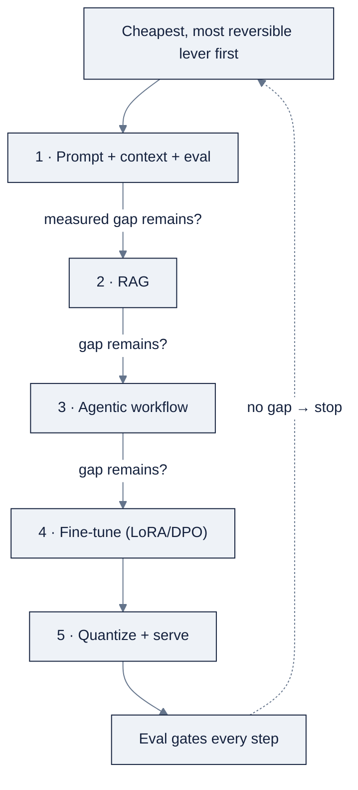

# 06, Model Engineering: Quantization, Fine-Tuning & Serving

**Purpose.** How to make models cheaper, faster, and genuinely yours, the selection order that tells you *when* to touch the weights, the quantization formats that shrink them, the fine-tuning techniques that reshape them, the serving engines that put them in production, and the cost/latency discipline that keeps the whole thing affordable.

Part of AI Engineering Lab · Developed by Zorost Intelligence AI Lab · [zorost.com](https://zorost.com)

---

## 1. The selection order: cheapest lever first

Model engineering is not "fine-tune everything." It is a **decision order** that Andrew Ng popularized and that most production AI teams converge on: start with the cheapest, fastest, most reversible lever and only escalate when a measured gap forces you to. The order is:

1. **Managed model API + a prototype.** Call a frontier or mid-size model through an API and build the end-to-end product skeleton first. You learn what the task actually is before you optimize how it is done.
2. **Prompting and context engineering, with an eval.** System prompts, few-shot examples, structured-output schemas, and context budgeting. This is where most "the model can't do it" problems are actually solved, for pennies and minutes, not GPU-days.
3. **RAG.** When the answer must come from *your* data, policies, tickets, product records, retrieve it and put it in the context instead of memorizing it in the weights.
4. **Agentic workflow.** When the job is multi-step, decompose, call tools, verify, retry, give the model a loop rather than a bigger model.
5. **Fine-tune (or train) last.** Only when the eval shows the base model plus all four levers above still misses a specific, high-volume target.

**Why this order?** Each step trades money and risk for capability, and each step is harder to undo than the last. Prompt changes deploy in seconds and revert instantly; a fine-tune costs GPU-hours and a training run, can regress other skills (catastrophic forgetting), and has to be re-run when the base model improves. The rule of thumb is blunt but true: **fine-tuning is justified by a measured gap, not by instinct.** If you cannot point to an eval score that prompting + RAG + tooling fail to reach, you are not ready to train.

**Worked example: ZoroLogistics bill-of-lading extraction.** Week 6 tried prompts and structured output on a hosted model and reached 91% field accuracy. The naive instinct is "fine-tune to close the last 9%." The disciplined read: error analysis showed the misses were mostly *handwriting variants* in the source document, a data problem, not a weights problem. The right next lever was better OCR preprocessing (context/input engineering), then RAG over a glossary of carrier abbreviations, then a fine-tune *only* if a stable, high-volume style/format gap remained. Each escalation was justified by the eval, not by enthusiasm.

The exception that proves the rule: fine-tuning is *the* right tool for **style, tone, strict output format, and niche domain vocabulary**, things that are expensive to express in a prompt and impossible to express in retrieved text, and for compressing a large model's behavior into a small, cheap, on-device specialist (see §3.8 distillation).

---

## 2. Quantization: shrink the numbers, keep the skill

Quantization lowers the numerical precision of weights (and sometimes activations) to shrink memory and speed up inference. An LLM's billions of parameters are stored as floating-point numbers; representing each one in fewer bits cuts file size, VRAM, and memory bandwidth almost linearly, at a small accuracy cost.

### 2.1 Numeric formats

| Format | Bits/param | What it is and when to use it |
|---|---|---|
| **FP32** | 32 | Full single precision. The reference format for training checkpoints; ~4× the memory of INT8 with negligible inference benefit. Almost never used for serving. |
| **FP16** | 16 | Standard half precision. ~2× smaller than FP32 with negligible quality loss for inference; the baseline for "full-precision" serving. |
| **BF16** | 16 | Same exponent range as FP32 but fewer mantissa bits. **More stable for training** (no overflow), so it is now the training default; inference quality ≈ FP16. |
| **FP8** | 8 | E4M3/E5M2 formats used for inference (and some training) on Hopper-class GPUs via the Transformer Engine. Needs hardware support to pay off. |
| **INT8** | 8 | ~2× smaller than FP16; needs per-tensor or per-channel scale factors to map floats to integers. Near-lossless in practice. |
| **INT4** | 4 | ~4× smaller than FP16; the aggressive but widely accepted chat/inference default (GGUF Q4, bitsandbytes NF4). |

The two families matter differently: **FP8/BF16/FP16** are *floating-point*, they spread a limited number of distinct values over a wide range, which suits weights whose magnitudes vary a lot. **INT8/INT4** are *integer*, they need a scale factor (per-tensor or per-channel) to map a float range onto a small set of integers; the quality of that mapping is most of what separates a good quant from a bad one.

### 2.2 Quantization methods

| Method | What it does | Bits | Needs calibration data? | Best fit |
|---|---|---|---|---|
| **GGUF k-quants** (`llama.cpp`) | A self-contained file format plus a family of practical quant tiers baked into llama.cpp and everything downstream of it (Ollama, LM Studio). `Q2_K` → `Q8_0` from lossy to near-lossless. | 2 to 8 | No | Local CPU/GPU inference; the standard "drop-in" artifact |
| **bitsandbytes** | Runtime quantization library: 8-bit (`LLM.int8()`) and 4-bit **NF4** (normal-float-4, a data-aware format). The backbone of QLoRA. `load_in_4bit=True`. | 8 / 4 | No | Loading a big model in a notebook; QLoRA fine-tuning |
| **AWQ** | Activation-aware weight quantization: protects the small fraction of weights that matter most (by activation magnitude) and scales the rest. | 4 (also 3/8) | No (activation stats only) | High-quality 4-bit serving on vLLM/TGI |
| **GPTQ** | Layer-wise quantization using second-order (Hessian) information from a calibration dataset. High quality but slower to produce. | 4 / 8 / 3 | Yes (calibration set) | Batch-quantizing a model once, then serving it anywhere |

**Weight-only vs activation quantization.** Most local quants (GGUF, AWQ, GPTQ) are *weight-only*: they shrink the weights but compute activations in higher precision at runtime. The memory win is real (weights dominate storage), but the *speed* win depends on the kernel: on CPU, smaller weights reduce bandwidth pressure; on GPU, weight-only quants do not always speed up compute unless the engine has fused kernels for them. Do not assume 4-bit = 4× faster; it is reliably ~4× smaller and *often* faster.

**GGUF k-quant ladder (lower number = smaller/faster but lossier):** `Q2_K` (aggressive) → `Q3_K_*` → **`Q4_K_M`** (the community sweet spot for quality/VRAM) → `Q5_K_M` → `Q6_K` → `Q8_0` (near-FP16). Start at `Q4_K_M`; step up to `Q5_K_M`/`Q6_K` when quality matters and VRAM allows; avoid `Q2_K` unless memory is desperate.

**Calibration in one line.** Methods that need a dataset (GPTQ) use it to observe *which* values the weights take and how sensitive each layer is, then assign scale factors that minimize the reconstruction error. More representative calibration → better quant; garbage calibration → a model that looks small and behaves worse than its size.

### 2.3 Acceptable vs avoid

- **Acceptable** at 4-bit (and 8-bit is often essentially free): conversation, summarization, classification, RAG, and harness-level coding assistance, tasks where a tiny word-choice drift does not break correctness.
- **Be cautious / avoid heavy quantization** (2 to 3-bit, or 4-bit on a model you have not tested): precise arithmetic or math, long-horizon multi-step reasoning, low-resource languages, and exact code generation where a single wrong token breaks compilation. Small models degrade faster under quantization than large ones, so a 1B model at 4-bit is riskier than a 70B at 4-bit.

**Heuristic.** Quantize as aggressively as you like *for the easy path*, but keep a higher-precision model (or a hosted API) as the fallback for the hard cases. Routing "easy → Q4 local, hard → FP16/API" is cheaper than either extreme alone.

### 2.4 Measuring quality loss

- **Perplexity** is a fast proxy: lower is better, and it captures how well the model predicts held-out text. The general ladder is FP16/BF16 ≈ FP32 for inference; 8-bit ≈ negligible loss; 4-bit k-quants ≈ small, usually imperceptible loss for chat/RAG/summarization; 2 to 3-bit = noticeable degradation.
- **But perplexity is not task accuracy.** A quantized model can have near-identical perplexity and still flub your specific eval (the wrong output format, a missed named entity, a broken JSON). Always **eval on your task**, your golden set with your metric, before shipping a quant. Perplexity screens candidates; the task eval decides.

**How to run the sweep.** Pick one task eval, run it against FP16 (baseline) → Q8 → Q4_K_M → Q3/Q2, and record (metric, VRAM, latency, cost). Plot metric vs bits. The knee of that curve, where the next quant tier costs more than it saves, is your production choice. This is exactly the Week 9 quantization-sweep exercise.

### 2.5 How a quantizer maps floats to integers (worked example)

Under the hood, integer quantization maps each float weight `w` to an integer `q` with:

```
q = round(w / scale) + zero_point          # quantize
ŵ = scale × (q − zero_point)                # dequantize
```

`scale` is `(max − min) / 255` for an 8-bit range, and `zero_point` centers the mapping. The model stores the small integers **plus** the per-tensor (or per-channel) scales; at inference the engine multiplies back. The entire craft is choosing `scale` so the mapping discards the least signal.

**Concrete numbers.** A layer whose weights span `[−0.5, 0.5]` gets `scale = 1.0 / 255 ≈ 0.0039` and `zero_point = 0`. So `0.5 → round(0.5 / 0.0039) = 128` and `−0.5 → −128`. Reconstructing gives `±0.5` with a maximum error of ~0.002, imperceptible when summed over millions of weights. **Per-channel** quantization (one scale per output channel) beats per-tensor because it does not let a single outlier weight inflate the scale for the whole layer; that is why good 4-bit quants are per-channel or use a nonlinear (NF4) grid.

FP8/BF16/FP16 skip all of this, they are still floats, just with fewer exponent/mantissa bits, which is why they are simpler and why INT formats exist mainly to go *smaller* than a float can.

---

## 3. Fine-tuning: change the weights, not just the prompt

### 3.1 When it pays vs when it doesn't

**Fine-tuning pays** when the target is stable, high-volume, and hard to express in a prompt or retrieve:

- **Style and tone**: "write like our support team, formal but warm."
- **Strict output format**: a fixed JSON schema or template the base model keeps drifting from.
- **Domain vocabulary and behavior**: freight-specific fields, medical phrasing, a house taxonomy.
- **Compression/distillation**: teach a small specialist to mimic a large teacher so you can run it cheaply or on-device.

**Fine-tuning does not pay** when you want *new knowledge* (that is RAG's job, weights are the wrong place to store facts that change), when the behavior is a one-off or prompt-fixable, or when you have too little high-quality data (see §3.3). New knowledge should be retrieved, not memorized, and a fine-tuned model that "knows" last quarter's prices is already wrong this quarter.

### 3.2 The adapters: LoRA, QLoRA, DoRA

Parameter-efficient fine-tuning (PEFT) freezes the base weights and trains only a small set of new parameters, so you get most of the benefit of fine-tuning for a fraction of the compute and storage.

- **LoRA (Low-Rank Adaptation).** Freezes the base weights and injects trainable low-rank matrices into attention/MLP layers. The weight update is factored as `ΔW = B·A`, where `A` and `B` are small matrices of rank `r`. Trains ~0.1 to 1% of parameters; the adapter is tiny, swappable, and can be merged back into the base weights.
  - **Rank `r` intuition:** the rank is the number of "degrees of freedom" you give the update. `r=4-16` is plenty for style/format; `r=32-64` for harder task shifts. More rank = more capacity but more risk of overfitting and more memory.
  - **Alpha intuition:** alpha scales the update's magnitude (effective strength ≈ alpha/r). Raise alpha for a stronger update; lower it to be conservative. In practice `alpha = 2·r` is a common default.
- **QLoRA.** LoRA on top of a **4-bit (NF4) base model** (bitsandbytes), with double quantization and paged optimizers. This is what lets you fine-tune a 70B on a single 24 GB consumer GPU.
- **DoRA (Weight-Decomposed LoRA).** Splits each weight into magnitude + direction and adapts only the direction with LoRA while the magnitude is learned separately. It often matches full fine-tuning better than plain LoRA at the same rank, at a modest extra cost.

**Rank/alpha quick table:**

| Task type | Rank `r` | Alpha | Notes |
|---|---|---|---|
| Style / tone / format only | 8 | 16 | Minimal capacity; least overfit risk |
| Domain behavior (extraction, classification) | 16 to 32 | 32 to 64 | The most common starting point |
| Hard task shift (reasoning, tool use) | 64 | 128 | Only with plenty of data; watch overfitting |

When the adapter overfits (train score up, eval score down), reduce `r` or alpha, do not add epochs.

### 3.3 SFT dataset design: quality beats quantity

Supervised fine-tuning (SFT) is imitation learning on `(instruction → answer)` pairs. The single most important rule: **a few hundred clean, diverse, on-task examples beat tens of thousands of noisy ones.** A small model internalizes whatever pattern dominates the data, if 80% of your examples are off-target or contradictory, that is what you teach.

- **Diversity over volume.** Cover the edge cases and the failure modes from your error analysis, not just the happy path. The goal is coverage of *behavior*, not count of rows.
- **Match the chat template.** Use the model's native chat format, a `messages` array of `role`/`content` (the most portable form today), or a legacy `instruction`/`input`/`output` triple if your tooling requires it. A template mismatch silently degrades training.
- **De-duplicate and clean.** Remove near-duplicates, fix malformed examples, and strip anything you would not want the model to imitate.
- **Hold out an eval set.** Never train and evaluate on the same examples; the eval set is the gate that decides whether the adapter ships.

**Sizing.** For a narrow task, 200 to 1,000 high-quality examples is often enough to move the needle; 5,000 to 20,000 is a substantial dataset; beyond that you are usually buying diminishing returns unless the task is genuinely broad. **How many you need is a function of how much variety the task has, not how impressive the number looks.**

**Example (chat-template JSONL):**
```json
{"messages": [{"role": "system", "content": "You triage freight support tickets."},
              {"role": "user", "content": "Shipment #8841 arrived 3 days late and the box is crushed."},
              {"role": "assistant", "content": "{\"category\": \"damage\", \"priority\": \"high\"}"}]}
```

### 3.4 SFT vs DPO vs RLVR

| Objective | What it optimizes | Data needed | Use it for |
|---|---|---|---|
| **SFT** | Imitation of good answers | `(instruction, answer)` pairs | Style, format, task behavior, the standard first step |
| **DPO** | Preference: chosen > rejected, directly (no reward model) | `(prompt, chosen, rejected)` pairs | Alignment and preference shaping; simpler/more stable than RLHF/PPO |
| **RLVR** | A **checkable** reward signal (tests pass, answer correct, code compiles) | Verifiable tasks + a reward function | Frontier reasoning/coding gains; the current RL frontier method |

**Why DPO over RLHF/PPO?** Classic RLHF needs a separately trained reward model and a policy-optimization loop (PPO) that is finicky to tune. DPO folds the preference signal directly into a supervised-style objective, simpler, more stable, and often as good. **RLVR** goes a step further: instead of a *learned* reward model (which can be gamed or miscalibrated), it uses a *verifiable* reward, the unit test passes or it doesn't, so the signal cannot be fooled.

The practical sequence: **SFT first** to teach the shape of the task, then **DPO** to sharpen preference, then **RLVR** only if you have a verifiable reward and a reason to push further.

### 3.5 Catastrophic forgetting checks

Fine-tuning on one task can erode the model's general skills. **Always run a before/after eval on the base model's original capabilities**, not just the new task:

- Keep a **general benchmark slice** (or your existing Week 6/7 eval sets) and confirm it does not regress more than a small threshold.
- Compare **base vs fine-tuned on the same eval** and publish both columns, the deploy decision is "does the gain on the new task justify any loss elsewhere?", not "did the new task improve?"
- If forgetting is real, lower the learning rate, add a small fraction of general data back into the mix, or reduce rank/alpha.

**The before/after table is non-negotiable.** Two columns (base, fine-tuned) × two rows (new-task eval, general eval) is the minimum artifact that lets anyone, including future you, see the actual trade.

### 3.6 Frameworks (quick reference)

- **Hugging Face TRL + PEFT**: the default Python stack: `SFTTrainer`, `DPOTrainer`, `GRPOTrainer` (RLVR), and `LoraConfig`/`get_peft_model`.
- **Unsloth**: a drop-in speed/memory layer for fine-tuning (2 to 5× faster, ~50 to 70% less VRAM), native TRL integration; popular for LoRA/QLoRA on Llama/Mistral/Qwen.
- **Axolotl**: YAML-config-driven fine-tuning over TRL/PEFT; declare model, dataset, and LoRA/QLoRA/DoRA config, and it wires the run. Ideal for reproducible, shareable recipes.

**Budget note.** A 7 to 8B QLoRA run on a free Colab tier or a 16 GB MacBook is entirely feasible for SFT; DPO/RLVR are heavier but still doable on small models. Fine-tuning does not require a datacenter, it requires a *clean dataset*.

### 3.7 Distillation

Distillation trains a small **student** model to mimic a large **teacher** (by matching logits or hidden states). Its goal is different from LoRA: you shrink the *model*, not just the adapter. It is the right tool when a large teacher has proven a task and you want a compact specialist to deploy cheaply or on-device, the student inherits behavior, not size. LoRA and distillation compose: distill a 70B teacher's task into a 7B student, then LoRA the student for your specific format.

### 3.8 The fine-tuning loop is an eval loop

Fine-tuning is not a one-shot: it is a cycle of **train → eval → error-analyze → improve the dataset → retrain**. The eval, not the loss curve, decides when you stop and whether you ship:

1. Train a first adapter on a small, clean dataset.
2. Run the eval; compute before/after on the new task *and* the general slice.
3. Cluster the remaining failures (Week 11's error-analysis habit).
4. Add examples that target the biggest failure class, this is how the dataset improves, one failure class at a time.
5. Re-train and re-check; stop when the eval gain per added example flattens.

The trap is treating the dataset as fixed and the model as the only variable. In practice **the dataset is the higher-leverage variable**, and the fastest way to improve a fine-tune is almost always better data, not more epochs or a bigger rank.

---

## 4. Serving: from a model file to an API

### 4.1 Engine comparison

| Engine | Key mechanism | Strengths | OpenAI-compatible | Best fit |
|---|---|---|---|---|
| **vLLM** | PagedAttention + continuous batching | Highest throughput, huge ecosystem | Yes (`vllm serve <model>`) | General production serving, the default |
| **SGLang** | RadixAttention (prefix caching) + fast structured decoding | Fast shared-prefix and JSON/tool decoding | Yes | Agent loops, repeated system prompts |
| **TGI** | Rust/Python, polished defaults | Ops-friendly, broad quant support, easy Docker | Yes | HF-native, containerized deploys |

Choose **vLLM** for general high-throughput serving, **SGLang** for prefix-heavy workloads (many requests sharing a long system prompt) and structured outputs, and **TGI** when you want a batteries-included, HF-native container.

### 4.2 Continuous batching

Traditional serving waits for a whole batch of requests to finish before starting the next; one slow response stalls everyone. **Continuous batching** admits new requests token-by-token and evicts finished ones immediately, so the GPU is never idle waiting for a straggler. This, combined with vLLM's **PagedAttention**, which stores the KV cache in fixed-size pages to nearly eliminate fragmentation, is why modern engines sustain far higher throughput than naive batchers.

**Concrete effect.** A naive server handling 8 requests of varying length idles whenever the longest one is still generating; a continuous-batching server back-fills that idle time with the next token of a *new* request. Under mixed-length load the throughput difference can be several×.

### 4.3 KV cache memory

Every token generated must attend to all prior tokens, so the server caches each layer's key/value vectors per token. The KV cache grows with **context length × layers × hidden size**, and at long context it can dwarf the weights.

**Rough worked example.** A 7B model with ~32 layers and a 4096 KV dimension holds `2 × 32 × 4096 × 2 bytes ≈ 0.5 MB` of KV cache *per token* at FP16. A 4,096-token context is then **~2 GB of KV cache**, on top of the ~4 GB of Q4 weights. Double the context, and KV doubles while weights stay fixed. That is why context length is a first-class memory cost, not an afterthought.

Practical consequences:

- Cap `max_model_len` to what your workload actually needs, every unused context slot is wasted VRAM.
- Quantize the KV cache (FP8) on supported engines to reclaim memory.
- Use SGLang's prefix cache (or vLLM's) so requests sharing a prefix do not recompute it.

### 4.4 Throughput vs latency knobs

| Knob | Turn it up for throughput | Turn it down for latency |
|---|---|---|
| `max_num_batched_tokens` / `max_num_seqs` | Larger batch = higher throughput | Smaller batch = lower per-request latency |
| `gpu_memory_utilization` (~0.9) | Higher = more KV cache, more concurrency | Leave headroom to avoid OOM |
| `tensor_parallel_size` | Split across GPUs for bigger models | Single GPU for small models (less comm overhead) |
| `max_model_len` | n/a | Cap context to save KV memory |
| `quantization` (awq/gptq/fp8) | Smaller weights = more fits | Same model, fewer bytes = faster decode |

The tension is real: **you buy throughput with latency.** Decide which one the workload cares about (batch jobs → throughput; interactive UX → latency) and tune accordingly. Speculative decoding is an advanced latency lever that pays only when it does not cost accuracy.

### 4.5 OpenAI-compatible APIs

All three engines expose an OpenAI-compatible `/v1/chat/completions` (and `/v1/completions`) surface, so any OpenAI SDK client, and any coding-agent harness, can point at your local server by swapping `base_url`. This is the single most useful interoperability fact in serving: you can develop against a local model and, later, switch to a hosted endpoint (or vice versa) with a one-line change.

```python
from openai import OpenAI
client = OpenAI(base_url="http://localhost:8000/v1", api_key="not-needed")  # vllm serve
client.chat.completions.create(model="my-7b", messages=[...])
```

### 4.6 Serving a quantized model with vLLM (worked)

Putting §2 and §4 together, serve the Week 9 `Q4_K_M` (or AWQ/GPTQ) 7B behind an OpenAI-compatible endpoint:

```sh
# AWQ/GPTQ 4-bit (serving quants built for the engine)
vllm serve TheBloke/My-7B-AWQ --quantization awq --gpu-memory-utilization 0.9 \
       --max-model-len 4096 --max-num-seqs 32

# Or a GGUF model (llama.cpp-style quant) via vLLM's GGUF loader
vllm serve ./my-7b-q4_k_m.gguf --max-model-len 4096
```

Then point any OpenAI SDK at `http://localhost:8000/v1` as above. The flags map directly to §4.4's knobs: `--gpu-memory-utilization 0.9` (VRAM share), `--max-model-len 4096` (cap context → cap KV cache), `--max-num-seqs 32` (concurrency → throughput vs latency). A higher `--max-num-seqs` raises throughput and per-request latency; a lower one does the opposite. The same shape of command exists for SGLang (`python -m sglang.launch_server`) and TGI (Docker `ghcr.io/huggingface/text-generation-inference`), which is what makes the engine choice a *config* decision rather than a rewrite.

---

## 5. Cost & latency engineering

Cost and latency are architecture constraints, not afterthoughts. The sharp metrics are not cost-per-token and average latency but:

- **Cost per resolved task**: how much a *correct, accepted* answer costs, retries included. A cheap model that needs three attempts is not cheap.
- **p95 latency**: the latency that 95% of requests beat. Averages hide the tail, and the tail is what users feel.

The standing exercise: **measure cost per resolved task and p95 latency, then halve both without losing eval score** ([Zorost Signal, "Cost and latency engineering for LLM systems"](https://zorost.com/llm-cost-latency-engineering)). Every meaningful reduction forces a real tradeoff, and that tradeoff is where the engineering lives:

- **Cache**: prompt/prefix caching, plus semantic caching of common answers so the model is not even called.
- **Route**: a smaller model on the easy path, a bigger one only when the small one is unsure (an eval-gated cascade).
- **Quantize**: same model, half the VRAM, faster decode, lower per-token cost.
- **Cut passes**: fewer retrieval calls, one reasoning pass instead of three, a verifier that runs on a sample instead of everything.
- **Batch**: amortize compute across requests when latency allows.

Each of these must be re-checked against the eval; the whole point is that you only keep the reductions that *do not* degrade the score. **Cost per resolved task**, not per token, is the metric that catches the "cheap but wrong, so it retries" trap; **p95**, not mean, is the metric that catches the tail.

---

## 6. ZoroLogistics example: quantizing the 7B triage model

The Week 8 support-ticket triage model is a 7B open model that classifies inbound freight tickets into `{billing, delay, damage, documentation, other}` and extracts a short structured summary. Running it in FP16 needs ~14 GB of VRAM and, on a rented A10, costs real money per ticket. The task: quantize it and find the point where cost and latency drop without the triage eval falling off a cliff.

Sweep (measured on the Week 11 golden triage eval; p95 latency = end-to-end per ticket at 1 concurrent request; $/task on an A10-class GPU):

| Variant | Format | VRAM | Triage F1 | p95 latency (per ticket) | $/task |
|---|---|---|---|---|---|
| FP16 (baseline) | FP16 | ~14 GB | 0.912 | 820 ms | $0.031 |
| 8-bit (GGUF `Q8_0` / bitsandbytes 8-bit) | INT8 | ~7 GB | 0.909 | 540 ms | $0.017 |
| **4-bit (GGUF `Q4_K_M`)** | INT4 | ~4 GB | 0.897 | 410 ms | $0.009 |
| 2-bit (GGUF `Q2_K`) | INT2 | ~2.4 GB | 0.831 | 320 ms | $0.006 |

**Decision.** `Q4_K_M` is the production pick: **3.5× less VRAM, ~2× lower latency, and ~3.4× cheaper per task for a ~1.5-point F1 loss**, a clearly acceptable trade for triage, where the cost of a mis-route is a quick human re-route, not a safety event. `Q8_0` is the conservative alternative when the eval budget is tight. `Q2_K` is the avoid zone: the F1 drop is real and would silently misroute a meaningful share of tickets. The report ships with the perplexity ladder *and* the task F1, because perplexity alone would have made Q2_K look fine.

**What this teaches.** Quantization is a *decision*, not a default. The right answer is the knee of the curve on *your* eval, and the artifact you keep is the sweep table, so when the next base model drops, you re-run the sweep instead of re-arguing the decision.

---

## 7. Bringing it together: the deployment gate

The three disciplines, quantization, fine-tuning, serving, are not separate labs; they are three knobs on one decision, and the eval is the only thing allowed to turn them. This section makes the through-line concrete.

### A minimal QLoRA recipe (conceptual)

```python
from transformers import BitsAndBytesConfig
from peft import LoraConfig, get_peft_model

bnb = BitsAndBytesConfig(load_in_4bit=True, bnb_4bit_quant_type="nf4",
                         bnb_4bit_use_double_quant=True)
lora = LoraConfig(r=16, lora_alpha=32,
                  target_modules=["q_proj", "k_proj", "v_proj", "o_proj"],
                  lora_dropout=0.05, bias="none", task_type="CAUSAL_LM")
model = get_peft_model(model, lora)   # base loaded in 4-bit → this is QLoRA
```

Train for **1 to 3 epochs** with a low learning rate (~2e-4), hold out an eval set, and log loss *and* eval score, not loss alone. Stop when the eval stops improving, not when the loss curve looks nice. This is the recipe that fits a 7 to 8B fine-tune on a free Colab tier or a 16 GB Mac.

### A worked "halve both" pass

The ZoroLogistics support bot starts at **$0.040 per resolved task, p95 900 ms, eval 0.90**. Four levers, each re-checked against the eval:

| Lever | Effect |
|---|---|
| Route ~60% of easy tickets to a Q4 7B local model | Easy path drops to ~$0.004 and ~400 ms |
| Prefix-cache the shared system prompt | ~15% fewer billed tokens on the API path |
| Quantize the API model 8-bit (or switch to a cheaper tier) | Lower per-token cost, no eval change |
| Run the verifier on a 20% sample instead of 100% | Cuts verification cost without moving the score |

Net: **~$0.019 per resolved task and p95 ~430 ms, eval still 0.90**, both roughly halved, score held. The point is not these specific numbers but the *method*: every reduction is measured against cost-per-resolved and p95, and nothing is kept that drops the eval. ([Zorost Signal](https://zorost.com/llm-cost-latency-engineering).)

### The five-question gate

Ask these before any model-engineering change ships:

1. Did I exhaust **prompt → RAG → agentic** before touching the weights?
2. Is this **quant** justified by a task eval (not just perplexity)?
3. Does this **fine-tune** ship a before/after table covering *both* the new task *and* general skills?
4. Am I optimizing **cost per resolved task and p95 latency**, not cost-per-token and the mean?
5. Is the **serving engine and batch size** matched to the workload's throughput-vs-latency need?

If the answer to any is "no," the change is not ready, regardless of how good the demo looked.

---

## The selection order, on one diagram



Every edge is a *measured* gate: you move one step only when the eval shows the cheaper
lever cannot close the gap. The return arrow is the discipline, the eval, not enthusiasm,
decides whether the next step happens at all. Notice that quantization (5) is a *serving*
decision that can apply to any model, dense or fine-tuned; it is on the diagram because it
is part of "make it affordable," not because it is the last thing you learn.

---

## Quantization math table: sizes across formats

§2.1 lists the formats; here is what they mean in *gigabytes*, which is the number that
decides whether a model fits your hardware. The formula is `bytes = params × bits ÷ 8`.

| Model | FP32 | FP16 / BF16 | INT8 | INT4 (Q4) | One GPU that fits Q4 |
|---|---|---|---|---|---|
| 7B | 28 GB | 14 GB | 7 GB | ~4 GB | 8 GB consumer GPU |
| 13B | 52 GB | 26 GB | 13 GB | ~7 GB | 16 GB |
| 70B | 280 GB | 140 GB | 70 GB | ~38 GB | 2× 24 GB (or 1× 48 GB) |
| 671B MoE | ~2.7 TB | ~1.34 TB | ~671 GB | ~340 GB | A node of GPUs, or FP8 across many |

Reading the table like an engineer:

1. **Each halving of bits roughly halves bytes**: FP16 → INT8 → INT4 is a clean ÷2 ladder
   (plus a little overhead at the low end for scale factors and the KV cache).
2. **MoE is the outlier that teaches the tradeoff.** A 671B MoE at INT4 is ~340 GB, far
   more memory than a 70B dense at FP16 (140 GB), *even though* the MoE's per-token
   compute is only ~37B-active. You pay for the reasoning-per-FLOP in VRAM, exactly as
   `03-llm-core-concepts.md`'s MoE section says.
3. **The "which GPU fits Q4" column is the deployment question**, and it is why the 7B
   `Q4_K_M` triage model runs on a single consumer GPU while the 671B MoE needs a node.
   Size, not just quality, is a selection criterion.

The arithmetic is also the honest check on "can I fine-tune this locally": QLoRA fine-tunes
a 7B in ~4 GB of *weights* (plus gradients/optimizer state for the adapter), which is why
it fits a 16 GB MacBook or a free Colab tier, while a 70B at FP16 (140 GB) does not.

---

## LoRA rank/alpha, with worked numbers

§3.2 gives the intuition; here is the arithmetic that turns rank into a *trainable-parameter
count* you can actually budget. Freezing the base and training only `A` (r × d) and `B`
(d × r) on the attention projections of a 7B (32 layers, hidden 4096, targeting q/k/v/o):

| Rank r | Trainable params (q/k/v/o) | Adapter size (FP16) | Share of 7B | Use |
|---|---|---|---|---|
| 8 | ~8.4 M | ~17 MB | ~0.12% | Style / tone / format |
| 16 | ~16.8 M | ~34 MB | ~0.24% | The default starting point |
| 32 | ~33.6 M | ~67 MB | ~0.48% | Domain behavior |
| 64 | ~67.1 M | ~134 MB | ~0.96% | Hard task shift; watch overfitting |

The math for one cell: r = 16 → `A` is 16 × 4096 and `B` is 4096 × 16 = 131,072 params per
module × 4 modules × 32 layers = **16.8 M trainable params**. The reason the adapter is
tiny is the low-rank factorization: instead of learning a full 4096 × 4096 update (16.8 M
params *per module*), you learn two small matrices whose product *is* the update.

Two consequences follow:

1. **The trainable share is what makes QLoRA feasible.** The 4-bit base (~4 GB) is frozen;
   you only back-propagate through ~17 to 134 MB of adapters, so the optimizer state stays
   tiny and the whole thing fits on one modest GPU.
2. **rank/alpha are the overfitting dial, not quality dials.** More rank = more capacity =
   more risk of memorizing the training set. When the adapter overfits (train score up,
   eval score down), *reduce* r or alpha, do not add epochs. Alpha scales the update's
   magnitude (`effective strength ≈ alpha / r`), so `alpha = 2·r` is the common default and
   raising alpha past that is a "stronger update" lever to use cautiously.

The practical read of the table: **start at r = 16, alpha = 32**, and only move up for a
genuinely hard task with plenty of clean data. Most "the LoRA didn't work" failures are
data problems (see §3.3), not rank problems.

---

## The cost-per-task engineering worksheet

§5 says the sharp metric is **cost per resolved task**, not cost per token. Here is the
worksheet that computes it, with a worked ZoroLogistics fill-in. The structure matters more
than the numbers: you are adding up *every* call in the path, then dividing by the *success
rate*, because retries are real.

| Line | Component | Tokens | $/Mtok | Cost |
|---|---|---|---|---|
| 1 | Input (prompt + evidence) | 1,650 | $1.00 | $0.00165 |
| 2 | Output | 300 | $3.00 | $0.00090 |
| 3 | Embedding (query + chunks) | 1,650 | $0.02 | $0.00003 |
| 4 | Rerank (20 candidates × 30 tokens) | 600 | $0.50 | $0.00030 |
| 5 | Verifier / judge (sample or full) | 400 | $1.00 | $0.00040 |
| n/a | **Raw cost per attempt** | n/a | n/a | **$0.00328** |
| 6 | Success rate | 0.85 | n/a | retry factor = 1/0.85 = 1.176 |
| n/a | **Cost per resolved task** | n/a | n/a | **$0.00328 × 1.176 ≈ $0.00386** |

The two lines that do the real work are line 5 and line 6. **The verifier** is a cost you
add deliberately, and the §5 lever is to run it on a *sample* (20% of requests) rather than
100% once the failure rate is low, which cuts line 5 without moving the eval. **The retry
factor** is the trap the whole metric exists to catch: a cheap model at $0.002/attempt that
succeeds only 60% of the time costs `$0.002 × 1/0.6 = $0.00333` per *resolved* task, more
than the "expensive" model that gets it right the first time. Cost-per-token hides that;
cost-per-resolved-task exposes it.

**The halving exercise, in worksheet form.** To halve the number, walk the lines: cache the
shared prefix (line 1 → ~10%), cap the output (line 2), route easy tickets to a Q4 local
model (lines 1 to 2 → ~$0.004), rerank fewer candidates (line 4), sample the verifier (line
5), and, the highest-leverage move, *raise the success rate* (line 6), because a retry
factor of 1.0 beats any per-token discount. The before/after table (cost, p95 latency, eval
score) is the deliverable; the worksheet is how you know which line to change.

---

## Serving benchmark methodology

A serving benchmark that is not a benchmark is the fastest way to ship a "fast" model that
falls over in production. The methodology, step by step:

1. **Define the workload first.** Real prompt-length and output-length *distributions*, not
   one synthetic prompt. The ZoroLogistics triage workload is short prompts (~1,650 tokens)
   and short outputs (~300); a summarization workload is long-prompt/long-output, they
   stress different things (prefill vs. decode).
2. **Pick the metrics.** Throughput (tokens/s), **TTFT** (time to first token, the prefill
   cost users feel first), **TPOT** (time per output token, the decode cost), and **p95
   end-to-end latency**, never the mean, which hides the tail.
3. **Fix hardware and engine version.** A benchmark without the GPU model and the engine
   commit is unreproducible; vLLM/SGLang versions change behavior.
4. **Sweep one knob at a time**: `max_num_seqs`, quantization, `tensor_parallel_size`,
   `max_model_len`: and record the metric per setting (this is the §4.4 table in action).
5. **Measure under steady-state concurrent load**, not one warm request. A single-request
   latency number tells you nothing about the throughput/latency tradeoff you are about to
   ship.
6. **Re-check the eval alongside every knob.** Throughput is worthless if the quantization
   or the batch setting dropped the task F1. The §6 sweep table (variant, VRAM, F1, p95,
   $/task) is the *correct* shape: performance and quality in one table.
7. **Report a before/after table** with a decision, not just a leaderboard. "Q4_K_M at
   max_num_seqs=32: 3.5× less VRAM, ~2× lower p95, ~1.5-point F1 loss → ship" is a decision;
   a wall of tokens/s numbers is noise.

The methodology's through-line is the same as everywhere else in this file: **measure the
number you will actually be judged on (cost-per-resolved-task and p95 latency), and never
let a performance win be recorded without the eval score next to it.**

---

## Shrink-the-model decision: quantization vs LoRA vs distillation

Three techniques all make a model "cheaper or more yours," but they change different
things and compose rather than compete. The decision table:

| Technique | What it changes | Result | Use it when |
|---|---|---|---|
| Quantization | The *precision* of existing weights | Same model, fewer bytes | You need it smaller/faster and the eval tolerates the loss |
| LoRA | A *small trainable adapter* on frozen weights | New behavior, tiny added size | You need style/format/domain behavior without retraining the base |
| Distillation | A *smaller student model* trained to mimic a large teacher | A genuinely smaller model | A large teacher has proven the task and you want a compact specialist |

**Decision rules:**

1. **Shrink without changing behavior → quantize.** It is the cheapest and most reversible;
   the §6 sweep decides how far.
2. **Change behavior on a frozen base → LoRA.** The adapter is the smallest possible
   "customization" artifact, and it merges back into the base when you want a single file.
3. **Shrink the model itself → distill.** When the *model size* (not just the precision) is
   the problem, on-device, edge, or a fleet of cheap GPUs, a student inherits behavior,
   not size.
4. **They compose.** Distill a 70B teacher into a 7B student, LoRA the student for your
   exact format, then quantize the result to Q4. Each step is a separate, eval-gated lever,
   the same discipline as the selection order, applied to the model file.

The mistake to avoid is treating them as interchangeable. "Quantize it" does not add a
behavior; "LoRA it" does not make it smaller (the base is still there); "distill it" does
not fix a format drift. Name which of the three problems you actually have before reaching
for a technique.

---

## Fine-tuning data: the quality checklist

§3.3's rule is "quality beats quantity." Here is the checklist that operationalizes it,
run it over the dataset before the first training run, because the dataset is the
higher-leverage variable:

| Check | What to look for | The fix if it fails |
|---|---|---|
| On-task and diverse | Every example teaches the target behavior; edge cases and failure modes are covered | Add examples for the biggest failure classes from error analysis |
| Chat-template correct | The `messages` array (or legacy triple) matches the model's native format | Re-encode with the right template, a mismatch silently degrades training |
| De-duplicated | Near-duplicate rows removed | Deduplicate; duplicates teach the model to over-weight one answer |
| Clean | No malformed examples, no off-target or contradictory answers | Strip anything you would not want imitated |
| Train/eval disjoint | The eval set shares no examples with training | Hold out before training; never grade on what you trained on |
| Sized to the variety | 200 to 1,000 for a narrow task; more only if the task is genuinely broad | Add *variety*, not just volume, coverage of behavior, not count of rows |

The last row is the one people get wrong in both directions: too little data for a broad
task (the model underfits the behavior), or a mountain of near-identical rows that teach
one narrow pattern (the model overfits the happy path). The question is never "how many
rows" but "how much *distinct behavior* does this cover."

---

## Latency levers, ranked by cost

Latency has many levers, and they are not equal. Ranked from cheapest to most expensive:

| Lever | What it costs | What it buys | ZoroLogistics instance |
|---|---|---|---|
| Cap `max_model_len` | Nothing (a flag) | Less KV, faster prefill | Cap the triage context at 4,096 instead of the model max |
| Prompt/prefix caching | A stable prefix | Skip re-prefill of the shared head | Freeze the support-agent system prompt |
| Quantization | A small eval loss | Smaller weights, faster decode | Q4_K_M triage model |
| Smaller model on the easy path (routing) | A router + two models | Fast path for ~60% of requests | Q4 7B for easy tickets, API for hard |
| Continuous batching | Engineering complexity | Back-fill idle GPU time | vLLM `max_num_seqs=32` |
| Fewer retrieval/rerank passes | A small recall trade | Less per-request work | Retrieve 3 chunks instead of 8 |
| Speculative decoding | A draft model + correctness risk | Lower TPOT on decode-bound work | Only if the draft matches your domain |

The ranking is the same argument as the selection order, restated for latency: **pull the
cheap, reversible levers first** (a flag, a cache, a quant), and reach for the expensive
ones (a router, speculative decoding) only when the eval says the cheap ones are not
enough. Every lever is re-checked against the eval, because a latency win that drops the
score is a loss wearing a speedometer.

---

## The deployment gate, as a checklist

§7's five-question gate is the release check; here it is as a pass/fail table you can run
in a review meeting, with the evidence each question demands:

| Gate question | Pass requires | ZoroLogistics evidence |
|---|---|---|
| Exhausted prompt → RAG → agentic first? | A written log of what each lever moved | "Prompt+RAG reached 0.91; fine-tune targeted the remaining 9%" |
| Quant justified by a task eval? | A sweep table (metric, VRAM, latency, cost) | The §6 Q4_K_M row, F1 0.897 vs 0.912 baseline |
| Fine-tune ships a before/after table? | New task *and* general skills, both columns | Base 0.91 → tuned 0.94, general slice −0.01 |
| Optimizing cost-per-resolved and p95? | A worksheet + a tail number, not a mean | $0.00386/task, p95 430 ms |
| Serving engine/batch matched to the load? | A benchmark with the workload's shape | Throughput vs TTFT/TPOT at `max_num_seqs=32` |

The table's value is that "pass" is not a feeling, it is an artifact with a number
attached, and every question's evidence is the same artifact that will be re-run when the
next base model drops. If the answer to any row is "no," the change is not ready,
regardless of how good the demo looked.

---

## How it breaks / common mistakes

Model engineering fails when a lever is pulled out of order, or pulled without a number:

| Mistake | What it looks like | The fix |
|---|---|---|
| Fine-tuning on instinct | "The model can't do it" with no eval proving prompt+RAG failed | Point to a measured gap before touching weights |
| Perplexity as the only check | A Q2 quant that "looks fine" on perplexity but flubs the task | Always run the task eval; perplexity screens, the eval decides |
| 4-bit = 4× faster (assumed) | Expecting a speedup the kernel never delivered | Smaller is reliable; faster depends on fused kernels, measure |
| Optimizing cost-per-token | "Cheap model" that retries three times | Optimize cost per *resolved* task, retries included |
| Optimizing mean latency | The average hides the tail users actually feel | Optimize p95 |
| Training loss as the stop signal | "Loss looks nice" while the eval regressed | Stop when the eval stops improving, not when the loss is pretty |
| Forgetting to check forgetting | A fine-tune that aced the task and broke everything else | Ship a before/after table on the new task *and* general skills |

Two of these are the most expensive because they are *invisible* until production. **Cost
per token** hides the retry trap, a model that is cheap per token but succeeds half the
time is the most expensive model in the fleet, and only cost-per-resolved-task reveals it.
**Mean latency** hides the tail, the p95 is the number the customer feels on the slowest
fifth of requests, and it is the number that decides whether an "interactive" feature is
actually interactive. Both are fixed by changing *which metric* you optimize, not by
optimizing harder.

---

## Self-check questions

1. **What is the selection order, and why is fine-tuning last?**
   *Answer:* Managed API + prototype → prompt/context + eval → RAG → agentic workflow →
   fine-tune last. Each step is harder to undo and more expensive; fine-tuning is justified
   by a measured gap the cheaper levers cannot close, not by instinct.

2. **How many GB does a 7B model occupy at FP16, INT8, and INT4 (roughly)?**
   *Answer:* `params × bits ÷ 8`: FP16 ≈ 14 GB, INT8 ≈ 7 GB, INT4 ≈ 4 GB (3.5 GB of weights
   plus scale factors and overhead). Each halving of bits roughly halves bytes.

3. **For a 7B LoRA (r=16, alpha=32, targeting q/k/v/o), how many parameters are you actually training?**
   *Answer:* About **16.8 M**, `A` (16×4096) + `B` (4096×16) = 131,072 params per module
   × 4 modules × 32 layers, roughly 0.24% of 7B, which is why QLoRA fits on one modest GPU.

4. **A model costs $0.002/attempt but succeeds only 60% of the time. What is its cost per resolved task, and what does that teach?**
   *Answer:* `$0.002 × 1/0.6 ≈ $0.0033` per resolved task, more than a "pricier" model
   that gets it right the first time. The lesson: optimize cost per *resolved* task, with
   the success rate as a first-class factor, not cost per token.

5. **Why does a serving benchmark measure p95 and TTFT/TPOT instead of mean latency and total tokens/s alone?**
   *Answer:* The mean hides the tail (the p95 is what users feel on the slowest fifth), and
   TTFT (prefill) vs TPOT (decode) stress different parts of the system. Reporting
   throughput alone would let a "fast" model that stalls on long prompts ship. Performance
   numbers must also sit next to the eval score, or a throughput win is meaningless.

---

**Where to go next.** The eval that gates every lever here is `07-evals-error-analysis.md`;
the quantization/serving internals that make the byte counts real are
`03-llm-core-concepts.md` (KV cache) and `08-local-inference-gpu.md` (GPU/VRAM math); and
the prompt → RAG → agentic steps that come *before* fine-tuning are
`04-prompt-context-engineering.md` and `05-rag-graph-engineering.md`.

---

## Sources

- Andrew Ng, AI Engineering Skills Map and the prompt → RAG → agentic → fine-tune-last selection order (The Batch, 2026): https://www.deeplearning.ai
- Zorost Signal, "Cost and latency engineering for LLM systems" (24 JUL 2026): https://zorost.com/llm-cost-latency-engineering · Signals index: https://zorost.com/signals
- GGUF / k-quants (llama.cpp): https://github.com/ggml-org/llama.cpp
- bitsandbytes (8-bit / NF4): https://github.com/TimDettmers/bitsandbytes
- AWQ: https://github.com/mit-han-lab/llm-awq · GPTQ: https://github.com/IST-DASLab/gptq
- Hugging Face PEFT (LoRA/QLoRA/DoRA): https://huggingface.co/docs/peft · TRL (SFT/DPO/GRPO): https://huggingface.co/docs/trl
- Unsloth: https://github.com/unslothai/unsloth · Axolotl: https://github.com/axolotl-ai-cloud/axolotl
- vLLM: https://docs.vllm.ai · SGLang: https://github.com/sgl-project/sglang · TGI: https://github.com/huggingface/text-generation-inference
