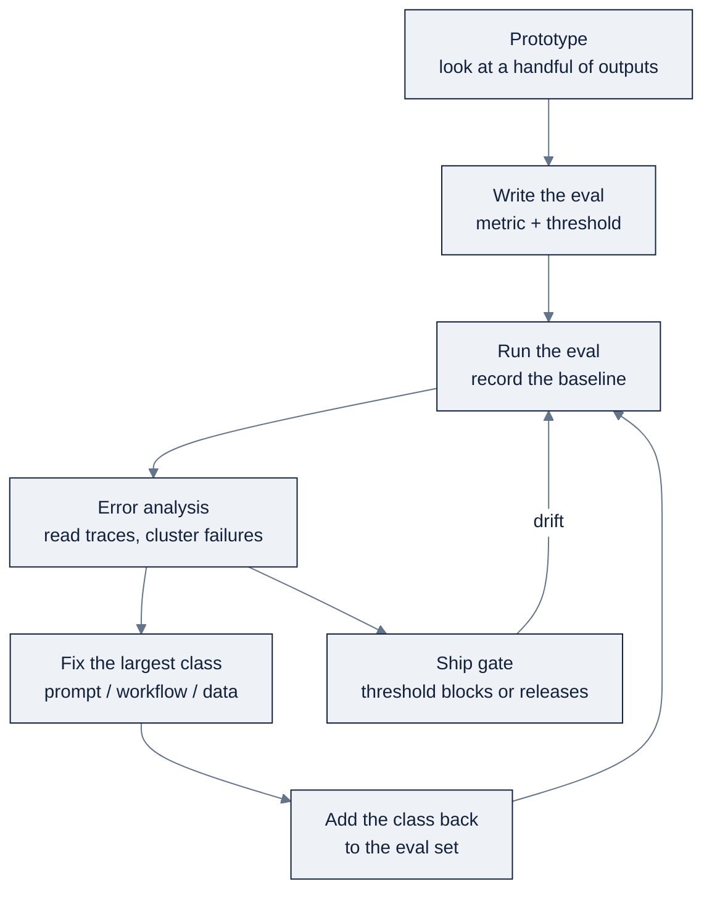

# 07: Evals & Error Analysis

Purpose: the measurement discipline that turns unpredictable AI output into something you can ship, eval design, LLM-as-judge, traces, human-level parity, the error-analysis workflow, regression suites, drift monitoring, and a worked ZoroLogistics example.

Part of AI Engineering Lab · Developed by Zorost Intelligence AI Lab · zorost.com

---

## Why this file matters

Ng calls a disciplined evals + error-analysis process **the single biggest predictor of how rapidly a team makes progress building an AI agent**. That is not a soft claim about being "data-driven." It is a claim about *velocity*: the teams that can measure failure ship faster, because every change they make either moves a number or it does not.

This file is the how. It is Week 11's core reading, but it is the habit every other week leans on, from Week 1's first train/test split to Week 24's production eval gate.

---

## Why AI outputs are unpredictable

Conventional software has a binary correctness notion: the test passes or it does not. An AI feature has a **distribution of behaviors**. Prompt an LLM and you do not know what you will get back; train a model and you do not know what it predicts on a new example.

That one change cascades through the whole engineering practice:

- If quality is a **distribution**, you need a **dataset** to measure it against, so eval design becomes an engineering task with its own version control and review.
- If quality is a distribution, a **release gate is a threshold on a number**, not a green checkmark.
- If quality is a distribution, **"it looks better" is not evidence**. A team that ships on vibes regresses silently and finds out from a customer.

The honest statement about an AI system is statistical: *it answers this class of question correctly about this often, and here is the sample that establishes it.* Everything below is the machinery for making that statement honestly.

---

## Eval design: golden sets and task-specific metrics

An **eval** is a number that measures the failure modes you actually care about. The first rule is *do not invent the metric in the abstract*. Build a prototype, look at a handful of outputs by hand, and only then write the metric, otherwise you will grade dimensions nobody needed and miss the one that breaks.

### Golden sets

A **golden set** (a "gold set" or "reference set") is a labelled collection of inputs paired with their correct outputs or acceptable-output criteria. It is the eval's dataset. Properties of a good golden set:

- **Drawn from real or realistic inputs**, not invented. Invented cases encode your *beliefs* about the problem; real cases encode the problem. This is why Zorost's founding advice for a company is "write fifty real cases, sourced from the domain, not imagined."
- **Covers the long tail.** Generative output spaces are large: an invoice extractor can fail on date, amount, address, currency, *or* the API call. Your set must sample each failure dimension, not just the happy path.
- **Versioned and reviewed.** A golden set changes the same way code does, it gets its own version control, its own reviewers, and its own changelog. A label that was right last quarter may be wrong now (a regulation changed, a field gained a new format).
- **Split from anything used for tuning.** If you tune a prompt or fine-tune a model on the same examples you grade with, the number is a measure of memorization, not capability.

The practical size rule of thumb from Zorost's twelve-week programme: **thirty labelled cases minimum** to start, fifty to be credible, and it grows every time error analysis finds a new failure class.

### Task-specific metrics

The metric must fit the task. Reusing the wrong metric is how teams convince themselves a broken system is fine:

| Task shape | Metric family | Example |
|---|---|---|
| Classification / extraction with a single right answer | **Accuracy, precision, recall, F1, exact-match** | "Did the field equal the gold value?" |
| Retrieval | **Recall@k, precision@k, MRR, NDCG** | "Was the right document in the top 5?" |
| Generation with a correct-but-variable answer | **LLM-as-judge with a rubric**, often paired with a similarity score | "Is the answer grounded and complete?" |
| Structured output | **Schema conformance + field-level exact match** | "Did it return valid JSON, and is each field right?" |

A metric is a number; the **threshold** is the release gate. "≥90% on the question set" is a requirement; "the number went up a bit" is not.

---

## LLM-as-judge

When the correct answer can be phrased many ways, is this summary faithful? is this response polite? you cannot grade with string matching. The standard technique is **LLM-as-judge**: use a (usually stronger, usually different) model to grade the output against the reference and a rubric.

### Rubrics

An LLM judge needs a **rubric**, an explicit definition of what each score means. "Rate the answer 1 to 5" produces noisy numbers. "5 = correct and fully grounded in the cited passage; 3 = correct but cites nothing; 1 = hallucinates a number not in the passage" produces a grade you can defend and calibrate.

A good rubric is:

- **task-specific** (written for the failure modes you saw),
- **anchored** (each level has a concrete example, not just an adjective),
- **dimension-separated** (groundedness is a different question from helpfulness; score them separately).

### Judge bias and calibration

LLM judges are themselves models, with their own biases. The known failure modes:

- **Position bias**: a judge may prefer whichever answer appears first; shuffle order or judge pairwise.
- **Verbosity/self-preference bias**: a judge may reward longer answers, or answers that sound like itself.
- **Drift**: a judge's grading standard can shift with a model update or prompt tweak.

The fix is **calibration**: hold out a labelled set where *you* know the right grade (a human scored it), run the judge over it, and measure how often the judge agrees with you. Only trust the judge on dimensions where its agreement with human labels is high; for everything else, fall back to human review or a code metric. This is the "graders that themselves need validating" from Zorost's list of assumed competencies. A judge you have not calibrated is a second unverified model, not a source of truth.

A concrete example, for the groundedness dimension of a ZoroLogistics RAG answer (the same rubric appears in the worked example below):

```text
Score the ANSWER for GROUNDEDNESS only, not helpfulness, not tone.

5, Every factual claim in the ANSWER is directly supported by the
    RETRIEVED PASSAGE, and the ANSWER cites the passage that supports it.
3, The core answer is supported, but it includes at least one claim
    (a number, date, or policy detail) not present in the passage.
1, The ANSWER states a fact that contradicts the passage, or invents
    a rate, date, or contract term the passage does not contain.
```

Two things make this rubric usable: it scores *one dimension* (not a blended "how good is this"), and each level names the *concrete failure* it is meant to catch (a hallucinated rate, an unsupported date). That is what makes the judge's output defensible in a release review, and what makes a "3 vs 1" disagreement worth investigating rather than shrugging off.

Other judge hygiene, briefly: prefer **pairwise** comparison (which of two outputs is better) when ranking candidate changes, since it is more stable than absolute scoring; give the judge the *rubric and a few labelled examples* in its prompt rather than asking it to infer the standard; and be aware that a judge can be **gamed** by an output that mentions the rubric's keywords without satisfying them, which is why calibration samples should include adversarial cases.

---

## Code metrics vs. model metrics

Two different kinds of number are both called "evals," and confusing them is a classic mistake:

| | **Code metrics** | **Model metrics** |
|---|---|---|
| What it measures | The deterministic plumbing around the model | The probabilistic output of the model itself |
| Example | Did the endpoint return in under 2s? Did the JSON parse? Did the tool call hit the right schema? Did retrieval return the expected doc IDs? | Did the answer contain the correct shipment date? Was the ticket routed to the right queue? |
| Character | Binary, fast, cheap, run on every commit | Statistical, slower, often needs a judge or a golden set |
| Where it runs | Unit/CI tests | Eval suite, usually on a schedule or at release |

Ng's guidance: use **deterministic code metrics when possible**, and reserve LLM-as-judge for the subjective dimensions. A good system maximizes the fraction of its behavior that is covered by cheap code metrics and reserves the expensive judge for the genuinely open-ended parts. If a failure can be caught by a code check (schema, retry policy, a regex on a date), do not spend a judge on it.

One more consequence worth naming: **evals for agentic workflows are more iterative than for supervised learning.** A classifier has a stable target distribution, you label once and grade for months. An agent's failure modes change as you add tools, change the workflow shape, or swap a model, so the eval set *grows with the system*. This is why the error-analysis step ("add the failure class back to the eval set") is not a cleanup chore, it is how the eval set stays current. Expect to be *editing* your eval set every week a system is under active development, and treat that editing as a first-class engineering activity with its own review, not a side task.

---

## Traces and spans

An **agentic** system is a sequence of steps, retrieve, read, plan, call a tool, reflect, answer. The unit of debugging is not the final output; it is the **trace**: the full record of what the system did on one input.

- A **span** is one step inside the trace (one model call, one tool invocation, one retrieval query), with its inputs, outputs, latency, and cost.
- A **trace** is the tree or sequence of spans for a single end-to-end run, tagged with the input and the final output.

Traces are what make error analysis *possible*, because they let you see *where* a bad output came from instead of guessing. Instrumentation (what you log, with what tags) is therefore an eval-adjacent engineering decision: if you cannot reconstruct which retrieval step or which tool call produced a wrong answer, you cannot fix it except by trial and error.

A minimal trace for a ZoroLogistics support question might look like this (one line per span):

```text
trace_id=abc123  input="Where is shipment S-4412 and is it on time?"
  span 1  retrieve(query="shipment S-4412 location status")  → 3 docs, top=generic tracking FAQ  (120ms)
  span 2  generate(context=[FAQ], question)                   → "Track it on the portal…"        (830ms)
  span 3  tool:lookup_shipment(id="S-4412")                   → NOT CALLED
  output: "You can track your shipment on the portal."
  verdict: WRONG, the user asked about a specific shipment, not how to track generally.
```

Reading *that* trace tells you the real problem instantly: the answer is wrong because **the retrieval step returned a generic FAQ and the shipment-lookup tool was never called**, not because the language model is weak. The fix is workflow-shaped (force a tool call when the question names a shipment ID, or fix retrieval so the ID triggers a lookup), and you only see it because the spans are there. A system where you log only the final output shows you "wrong answer" and nothing else, which is why teams that skip tracing stay stuck.

What to log per span, at minimum: the step type, its inputs and outputs (trimmed), the model/version, latency, token cost, and the trace + span IDs that connect them. That is the difference between "it broke" and "here is the exact call that broke it."

---

## Human-level parity (HLP)

**Human-level parity** is the comparison Ng uses to decide *which* step of a system to improve: for each step, ask **what a competent human would have produced**, and compare.

The idea: if a human, given the same information, would have gotten a step right and the system did not, that step is a real weakness worth fixing. If a human would *also* have failed, the step is not the bottleneck, no amount of model improvement recovers information that was never there, and the fix is upstream (better retrieval, better tools, better data).

HLP is a *diagnostic* heuristic, not a target. You are not trying to match a human on every step; you are using "what would a human do here" to localize the failure to the step that most often produces something materially worse than a human would.

---

## The error-analysis workflow

An eval gives you a *score*; error analysis tells you *which cluster to fix*. Teams that only have the first can watch a number without being able to move it. The workflow:

1. **Read traces.** Sample the bad outputs, and some good ones, for contrast, and read the full trace of each by hand. Do not summarize from memory; look at what the system actually did, step by step.
2. **Cluster failures.** Write down what specifically went wrong in each case, then group the failures into classes. Retrieval returning the right document ranked fourth. A date format that silently changed meaning. One customer segment phrasing questions a way the system was never tested against.
3. **Prioritize.** Count the classes. Fix the **largest** one first, not the most interesting one. Frequency matters more than cleverness.
4. **Fix.** Make the change, a prompt edit, a workflow change, a retrieval change, a data fix.
5. **Add to the eval set.** Put the failing cases (and the fix's behavior) into the eval set so that class can never silently regress. This is what turns error analysis from a one-off into a ratchet.

**The key distinction to hold:** evaluation tells you the current level; error analysis tells you what to do next.

### Zorost's "the one exercise"

Zorost's article ends with the cheapest, most reliable exercise on the whole topic, worth quoting:

> "Fifty real interactions. Read by hand. Categorised. Counted. Largest class fixed and added to an eval set."

The full version: sample fifty real interactions from a live system, read them by hand *without summarizing*, write down what specifically went wrong in each, group failures into classes, count the classes, fix the largest, and add that class to the eval set so it can never come back. It costs an afternoon and needs no new tooling. Zorost reports they have **never** run this loop on a live system and failed to find something surprising in the first hour, and that none of those surprises were model problems, and none showed up in an aggregate score.

---

## Regression eval suites in CI

An eval that runs once is a curiosity; an eval that runs on every change is a **gate**. The discipline is to put the eval suite where it can block a merge or a release:

- **Code metrics run in CI on every commit**: schema checks, latency budgets, deterministic assertions.
- **Model-metric suites run on a schedule or at release**: nightly, or as a required check before a deploy, because they are slower and cost tokens.
- The gate has **authority**: a threshold that, when crossed, *blocks the ship*. A number nobody is willing to block on is a number nobody will trust.

This is exactly the "make correctness executable" step from Zorost's path to becoming a software engineer: tests, continuous integration, and a gate that can block a merge, then the same instinct extended to the non-deterministic parts via an eval set with a threshold.

---

## Drift monitoring

AI systems drift **without a code change**. A model provider can update a model underneath you; your data can go stale; the world (regulations, customer phrasing, document formats) can move. So eval is not a one-time event, it is a standing discipline:

- **Production sampling**: grade a sample of live traffic against the golden set on a cadence, and watch the score over time.
- **Distribution checks**: monitor the *inputs* too: are question topics, lengths, or languages shifting away from what the eval set covers?
- **Configuration records**: capture model ID/version, prompt, index build, and thresholds for every release, so that when the score moves you can answer "which configuration produced last quarter's results?" Without that record you cannot investigate a regression or defend the system to an auditor.

Drift monitoring is why Zorost lists "evaluation as a standing discipline, not a bullet point" among the seven competencies the skills map assumes: in a system that is actually in production, evaluation is somebody's job, not a task.

---

## When workflow shape is cheaper to change than the model

A non-obvious consequence of LLMs: **workflow shape iterates fast**. Changing the *structure* of your pipeline, which steps exist, in what order, who calls whom, is often cheaper and higher-leverage than changing or fine-tuning the model.

Ng's concrete move: if a chain of steps collectively underperforms a human even though each individual step looks fine, the chain is too rigid. Rip out scaffolding and let a stronger model absorb a step, for example, drop a separate HTML-cleaning call if a stronger model handles messy HTML directly. The signal to look for: error analysis shows the *step boundary itself* is the failure source, not any single step's logic.

The same instinct applies to cost (Zorost's block five): a verifier that runs on a sample instead of every request, a smaller model on the easy path, caching, fewer retrieval passes, every meaningful reduction is a *workflow* decision, not a model decision. Change the shape before you reach for a bigger model; a smarter model is the most expensive lever, and it should be the last one you pull.

---

## Common eval mistakes

Each of these is a real way competent teams fool themselves:

- **Measuring end-to-end only.** If you score only the final answer, you cannot see that retrieval is the broken layer. Measure retrieval, generation, and tool use separately.
- **A blended "quality" score.** Averaging groundedness, helpfulness, and tone into one number hides which dimension regressed. Score dimensions separately, then gate on the one that matters most.
- **An invented golden set.** Cases you imagined encode your assumptions; cases from real traffic encode the problem. One real customer ticket can be worth ten invented ones.
- **A judge nobody calibrated.** Trusting an LLM judge you have never checked against human labels is trusting a second unverified model.
- **A metric with no threshold.** A number nobody is willing to block on is a number nobody trusts. Name the number *and* the ship/no-ship line.
- **No path to the traces.** If you cannot reconstruct *which step* produced a bad output, error analysis is guessing. Instrumentation is part of eval design.
- **Shipping on vibes.** "It looks better" is not evidence. Without a before/after number, a change is a coin flip you felt good about.

---

## Worked example: ZoroLogistics

Three evals from the running case study, one per archetype, extraction, RAG, classification. Each shows the golden set, the metrics, the judge, HLP, and what error analysis would find.

### (a) Bill-of-lading field extraction

**Task.** From a scanned bill of lading, extract the structured fields: shipper, consignee, origin, destination, shipment date, weight, and freight class.

- **Golden set.** 200 real (or realistic, seeded from the Week-1 generator) bills of lading with hand-verified field values, deliberately varied in layout, handwriting/OCR quality, date formats, and currencies. Split: 150 for development, 50 held out.
- **Metrics.** *Code metric:* schema conformance, did it return valid JSON with all required keys? *Model metric:* **field-level exact match** (F1 per field, then a weighted mean), because a correct date but wrong weight is a real failure and a single "overall accuracy" would hide it.
- **HLP.** A freight clerk extracts all fields correctly on ~98% of clean bills and ~85% of damaged ones. If your system is at 80% on clean bills, the gap is the model, not the data. If the system and a clerk both fail on the same illegible scans, the fix is better OCR or human escalation, not a better LLM.
- **Error analysis.** Read the traces of 50 misses. You will likely find one dominant cluster, e.g., "date format silently changed meaning" (MM/DD vs DD/MM) or "freight class read from the wrong table." Fix it, then add those cases to the golden set.
- **Gate.** Field-level F1 ≥ 0.95 on the held-out set, with the extraction declining (returning a confidence `null`) rather than guessing below a per-field confidence threshold.

### (b) RAG answer groundedness

**Task.** Answer questions about ZoroLogistics' contracts and tariffs from a retrieved knowledge base, with citations.

- **Golden set.** 50 real business questions, each with the correct answer *and* the source passage(s) that justify it. Written by someone who knows the domain, the hardest part to produce and the most valuable asset in the building.
- **Metrics.** The RAG "triad," measured separately:
  - **Retrieval**: recall@5 (was the right document retrieved?);
  - **Groundedness**: is every claim in the answer supported by the retrieved text (an LLM judge with a rubric, or a citation-span check);
  - **Answer relevance**: does the answer actually address the question?
  Measuring retrieval *separately from generation* is Zorost's block-three gate, because most quality problems live in the data path and are invisible if you only score end-to-end.
- **Judge calibration.** Calibrate the groundedness judge against ~30 human labels first; if it disagrees with you more than ~10% of the time, use human review on that dimension.
- **Error analysis.** Read 50 traces. The classic finding: *retrieval returns the right document ranked fourth*, so the generator answers from the wrong document. That is not a model problem, it is a retrieval problem (chunking, embedding, or reranking), fixed upstream and confirmed by recall@5 moving, not by prompt tweaks.
- **Gate.** Groundedness ≥ 0.95 (essentially no unsupported claims) because this is a regulated freight context where a hallucinated rate is a real liability; retrieval recall@5 ≥ 0.9; and the answer *declines* rather than guesses when confidence is low.

### (c) Ticket triage accuracy

**Task.** Route an inbound support ticket to the correct queue and priority: billing, delay/disruption, claims, documentation, or carrier onboarding.

- **Golden set.** 150 real tickets labelled by a human ops lead with queue + priority + the reasoning. Includes the long tail: a customer phrasing a claim as a question, a delay reported with a date format you have not seen, an emoji-only urgency signal.
- **Metrics.** *Code metric:* did the system return exactly one queue and one priority from the allowed enums (schema check)? *Model metric:* **accuracy** on queue, and a **cost-weighted error** on priority, routing a billing issue to claims is worse than mis-prioritizing it, so weight queue errors higher.
- **HLP.** A human dispatcher routes ~95% correctly in under 20 seconds. Use HLP to find whether the system's failures are on tickets a human would also miss (ambiguous, no info, fix the intake form, not the model) or on tickets a human nails (fix the system).
- **Error analysis.** The cluster you will find: one customer segment phrasing questions in a way the system was never tested against. Fix by adding those cases and, if the failure is systemic, by changing the *workflow shape* (a routing classifier before generation, or an escalation path) rather than prompting harder.
- **Gate.** Queue accuracy ≥ 0.9 on the held-out set, with a mandatory human-review path for anything below the confidence threshold, and the escalation decisions fed *back* into the golden set.

Across all three, notice the pattern: **eval first (a number), error analysis second (a cluster), fix, and add the failure back to the set.** That loop is the whole discipline, and it is what makes ZoroLogistics a portfolio of *proven* systems instead of 24 demos.

Two closing framings, both from the same root:

- **The eval is your specification, your sales argument, and your development loop in one document.** Zorost's advice to anyone turning skills into a company: *write the eval before you build the app*, fifty real cases with correct answers, sourced from the domain rather than imagined. That document tells you honestly whether the problem is tractable before you spend six months finding out, and it is what you show a customer who asks "why should I trust this."
- **In ZoroLogistics, the Week-11 artifact is exactly these three evals, wired into CI.** The bill-of-lading extractor, the RAG groundedness check, and the ticket-triage classifier become regression suites with thresholds, the thing that separates an AI engineer from a demo builder. Later weeks never throw them away; they add new tools and new failure classes *on top of* the same harness, which is how the case study compounds into a governed system by Week 24.

---

## The evals + error-analysis loop, on one diagram



The diagram is the discipline as a control flow. The two edges that matter most: **the
ratchet** (D → E → F → back to C), every failure class you fix becomes a permanent test,
so the eval set only ever grows, and **the drift edge** (G → C), a shipped system is
re-sampled from production traffic on a cadence, and a score that moves triggers the same
loop again. An eval without error analysis is a scoreboard (C, forever); error analysis
without the ratchet is a fix that can silently regress (E, once). The loop only holds when
all the edges are wired.

---

## Full rubric design example

The LLM-as-judge section shows a one-dimensional groundedness rubric. A real judge usually
scores **several dimensions separately**, each with its own anchors. Here is the complete
rubric for a ZoroLogistics RAG answer, three dimensions, each anchored to a concrete
failure mode.

**Dimension 1: Groundedness (is every claim supported by the retrieved passage?)**

| Score | Anchor |
|---|---|
| 5 | Every factual claim is supported by a cited passage; no invented numbers |
| 3 | The core answer is supported, but one claim (a number, date, or policy detail) is not in the passage |
| 1 | The answer states a fact that contradicts the passage, or invents a rate/date/term |

**Dimension 2: Completeness (does it answer *all* of what was asked?)**

| Score | Anchor |
|---|---|
| 5 | Addresses every part of the question, including the implicit sub-questions |
| 3 | Addresses the main question but drops a sub-part (e.g., gives the refund % but not the deadline) |
| 1 | Answers a different question, or stops after the first clause |

**Dimension 3: Honesty (does it decline when the passage lacks the answer?)**

| Score | Anchor |
|---|---|
| 5 | Correctly says "not covered" when the passage lacks the answer |
| 3 | Hedges correctly but still guesses once |
| 1 | Confidently answers from nothing, or invents a citation |

Three design choices make this rubric usable rather than decoration:

1. **Dimensions are separated.** Groundedness, completeness, and honesty fail for different
   reasons and get fixed in different places, a blended "answer quality 1 to 5" would hide
   which one regressed.
2. **Every level names the concrete failure it catches.** "Invents a rate" is checkable;
   "somewhat helpful" is not. The anchors are what make a "3 vs 1" disagreement worth
   investigating instead of shrugging off.
3. **One dimension is the release gate.** For a regulated freight context, groundedness is
   the gate (≥ 0.95); completeness and honesty are *monitored* but do not block on their
   own. Gate on the dimension that is a liability, watch the rest.

The rubric lives in version control next to the golden set, because it *is* part of the
definition of "correct", and when a new failure mode appears, you add an anchor, not just
a note.

---

## Judge calibration procedure

A judge is a second unverified model until you calibrate it. The procedure, step by step,
with a worked number:

1. **Hold out a labelled set.** ~100 cases where a *human* has already assigned the grade
   (for groundedness, pass/fail). This is the ground truth the judge is measured against.
2. **Run the judge over the same set** and record its verdicts next to the human's.
3. **Build the confusion matrix** and compute agreement. Worked example (100 cases):

| | Human: pass | Human: fail |
|---|---|---|
| **Judge: pass** | 60 | 4 (judge missed a hallucination) |
| **Judge: fail** | 8 (judge too strict) | 28 |

```
agreement  = (60 + 28) / 100 = 0.88
recall     = 28 / (28 + 4)   = 0.875   # did the judge catch real failures?
precision  = 28 / (28 + 8)   = 0.778   # when it says "fail," is it right?
```

4. **Set the trust threshold.** Trust the judge on a dimension only when its agreement with
   human labels is high, Zorost's rule of thumb is ~90% agreement, or fall back to human
   review on that dimension. At 88% this judge is *borderline*: it catches most
   hallucinations (recall 0.875) but over-flags some good answers (8 false fails).
5. **Decide what the disagreement direction costs.** A judge that over-flags (false fails)
   costs human review time; a judge that under-flags (missed hallucinations) costs a
   liability. In freight, prefer over-flagging, a false fail is a cheap re-read, a missed
   hallucinated rate is a real claim.
6. **Re-calibrate when the judge changes.** A model update or a rubric tweak can shift the
   grading standard (drift, below). Re-run the calibration set on any judge change, the
   same way you re-run tests on a code change.

The discipline in one line: **a judge you have not calibrated is a second unverified
model, not a source of truth**, and the confusion matrix is the artifact that proves (or
refuses) the judge's right to grade.

---

## The trace-reading checklist

Traces make error analysis possible; a checklist makes trace-reading *repeatable*. Read a
bad trace top to bottom, one span at a time, asking one question per layer:

| Layer | The question | Red flag | ZoroLogistics example |
|---|---|---|---|
| Retrieval | Did the right doc come back, and at what rank? | Right doc ranked 4th, or a generic FAQ | "Where is S-4412" → returns the tracking FAQ |
| Planning/routing | Did the model plan the right steps? | Skipped a step it needed | No "lookup the shipment" step before answering |
| Tool call | Did the right tool fire, with the right args? | A needed tool never called; wrong ID passed | `lookup_shipment` NOT CALLED |
| Tool output | Was the output well-formed and on-topic? | Truncated, error, or irrelevant result | Tool returned an empty/error object |
| Generation | Did the answer cite its source? | Unsupported claim, invented number | "Your refund is 50%" with no cited passage |
| Loop control | Did it stop correctly, or repeat/loop? | Repeats work it already did | Re-fetches the same doc three times |
| Cost/latency | Which span dominates time and tokens? | One span eats 90% of the budget | A 128k-token retrieval on a 200-token question |

The checklist's purpose is to *localize* the failure to the span that caused it, not to
summarize "the answer was wrong." The earlier worked trace ("the shipment-lookup tool was
never called") is what you find when you run the checklist honestly: the retrieval row is
red, the tool row is red, and the fix is workflow-shaped (force a lookup when a shipment
ID appears), not "use a better model." A system where you log only the final output shows
you "wrong answer" and nothing else, which is why teams that skip tracing stay stuck.

---

## Drift monitoring setup

AI systems drift without a code change, so eval is a standing discipline. The setup, step
by step:

1. **Pick the signals to watch.** Four families, each with a number:
   - **Quality**: the eval score on a sample of live traffic (the headline).
   - **Input distribution**: topic mix, length, language, new-phrasing share.
   - **Output distribution**: refusal rate, average length, schema-conformance rate.
   - **Operational**: p95 latency, cost per task, error/retry rate.
2. **Set the cadence and sample.** A nightly sample of ~100 graded interactions, plus a
   fuller weekly run. Sample *randomly*, not the easy cases, a cherry-picked sample is a
   flattering mirror, not a monitor.
3. **Define thresholds that page.** A threshold is only real if it triggers an alert:

| Signal | Watch for | Alert when | ZoroLogistics read |
|---|---|---|---|
| Eval score (groundedness) | Silent regression | Drops > 2 points vs. the release baseline | A model provider update shipped under you |
| Refusal rate | Over/under-refusal | Spikes or collapses outside the band | The model got bolder or more timid |
| New-topic share | Distribution shift | New topics exceed ~15% of the sample | Customers are asking things the golden set never covered |
| p95 latency / cost | Silent cost drift | p95 or cost/task rises > 25% | A longer context or a heavier path crept in |

4. **Keep the configuration record current.** Model ID/version, prompt, index build, and
   thresholds for *every* release, so that when the score moves you can answer "which
   configuration produced last quarter's results?" Without it you cannot investigate a
   regression or defend the system to an auditor.
5. **Close the loop.** A drift alert is the *start* of the same error-analysis loop, not
   the end of it: sample the drifted traffic, read the traces, cluster, fix, and add the
   new failure class to the golden set, so the monitor feeds the ratchet.

The through-line: drift monitoring is "evaluation as a standing discipline" made concrete,
in a system that is actually in production, evaluation is somebody's *job*, with a cadence,
a sample, thresholds that page, and a configuration record that makes every number
traceable to a release.

---

## Zorost's "one exercise" runbook

The cheapest, most reliable exercise on the whole topic, expanded from the one-line version
into a runbook you can execute in an afternoon on any live system:

| Step | Do this | Time | Output |
|---|---|---|---|
| 0 | Pick a live system and pull **50 real interactions** (log export, not cherry-picked) | 10 min | 50 raw rows |
| 1 | **Read each by hand, without summarizing**, the whole trace, not the score | 45 min | A pile of notes |
| 2 | For each, write **what specifically went wrong** (one line, concrete) | 30 min | 50 one-line failures |
| 3 | **Group the failures into classes** and **count** them | 20 min | A ranked class list |
| 4 | **Fix the largest class**, the most frequent, not the most interesting | 1 to 2 h | One change |
| 5 | **Add that class to the eval set** so it can never silently come back | 20 min | New eval cases |
| 6 | Write down the one thing that surprised you | 5 min | The actual lesson |

The rules that make the runbook work: **read by hand, not by aggregate** (the score hides
the class you are about to find); **concrete, not summarized** ("the date format silently
changed meaning," not "extraction was bad"); **largest first, not cleverest** (frequency
beats interest); and **pin the class** (step 5 is the ratchet). Zorost reports they have
*never* run this loop on a live system and failed to find something surprising in the
first hour, and that none of the surprises were model problems, and none showed up in an
aggregate score. The runbook is the same loop as the diagram, stripped to a Saturday
afternoon: prototype → read → cluster → fix → pin.

---

## Golden set construction, worked

The golden set is the eval's dataset, and "properties" are only useful when they turn into
sizing and sourcing decisions. For the three ZoroLogistics evals, that looks like:

| Eval | Size (start) | Sourcing | Split | Growth rule |
|---|---|---|---|---|
| BoL field extraction | 200 | Seeded from `zoro/data.py` `bol_samples()`, varied by layout/OCR quality/date format | 150 dev / 50 held-out | +1 case per new failure class |
| RAG groundedness | 50 | Written by a domain expert (the hardest to produce, the most valuable asset) | 40 dev / 10 held-out | +1 per unsupported-claim class |
| Ticket triage | 150 | Real tickets labelled by an ops lead (queue + priority + reasoning) | 120 dev / 30 held-out | +1 per phrasing pattern found in error analysis |

Three sizing rules that generalize:

1. **Start at the Zorost minimum (30) and be credible by 50**: then let the ratchet grow
   it one failure class at a time. A golden set is never "done"; it is a living dataset.
2. **Source from the domain, not imagination.** Invented cases encode your *beliefs* about
   the problem; real cases encode the problem. One real customer ticket can be worth ten
   invented ones, which is why the RAG set is written by someone who knows freight, not by
   the model's author.
3. **Split dev from held-out and never cross them.** Tune on the dev split; report the
   held-out split once. If you tune on the examples you grade with, the number measures
   memorization, not capability, the same leak as `02-ml-dl-fundamentals.md`'s test-set
   discipline, applied to labels.

The BoL set's sourcing note is the freight-specific one: the generator's synthetic bills of
lading are *deliberately varied* in layout and date format precisely so the golden set
samples the failure dimensions (MM/DD vs DD/MM, freight-class tables, OCR noise) rather
than only the happy path.

---

## Choosing a judge: the decision table

"Use an LLM judge" is not one decision, it is three, and each has a cheaper alternative:

| Choice | Options | When to prefer | Cost/risk |
|---|---|---|---|
| Absolute vs pairwise | Absolute 1 to 5; or "which of A/B is better" | Pairwise for *ranking candidate changes* (more stable); absolute for a release gate number | Pairwise is more stable but yields no standalone threshold |
| Single vs rubric | One blended score; or per-dimension rubrics | Per-dimension when different failures fix in different places | A blended score hides which dimension regressed |
| Judge vs code vs human | LLM judge, deterministic code, or a human | Code metric whenever the check is deterministic; judge only for the subjective; human as the calibration gold | Judge is cheap but unverified; human is gold but slow/expensive |

The ordering rule echoes Ng's: **use a deterministic code metric when possible, reserve the
judge for the subjective, and use humans as the calibration gold, not the daily grader.**
The economics make the point concrete: a code metric costs microseconds and runs on every
commit; a judge costs tokens and runs at release; a human costs real minutes and runs only
to *validate the judge*. The system's cost profile is set by how much behavior you can push
down the code-metric column before the judge (or the human) has to look at it.

---

## HLP, worked on one step

Human-level parity localizes *which step* is the bottleneck. Worked on the ticket-triage
system's routing step:

| Case type | Human would route correctly? | System routes correctly? | Read |
|---|---|---|---|
| Clear, unambiguous ticket | yes (≈99%) | no (≈85%) | **Real gap: fix the system** |
| Ambiguous, no shipment ID | no (≈50%, guesses) | no (≈50%) | Not a model gap, fix the intake form, not the model |
| New phrasing, human infers | yes (≈92%) | no (≈60%) | Real gap, but a *data* gap, add the phrasing to the set |

The rule HLP encodes: **if a human would also have failed, the step is not the bottleneck**
no amount of model improvement recovers information that was never there, and the fix is
upstream (better intake, better retrieval, better data). If a human would have nailed it
and the system did not, *that* is the step worth improving. The table's three rows are the
three possible answers, and the fix is different in each row, which is exactly why HLP is
a diagnostic heuristic, not a target to match.

---

## What to log per span

Traces are only as good as the instrumentation, and instrumentation is an eval-adjacent
engineering decision. The minimum per span:

| Field | Why it matters |
|---|---|
| Trace + span ID | Reconstruct the tree of steps for one run |
| Step type (retrieve / generate / tool / plan) | Localize the failure to a *kind* of step |
| Inputs and outputs (trimmed) | See what the step actually saw and returned |
| Model + version | Know whether a provider update changed behavior |
| Latency | Find the span that dominates time |
| Token count + cost | Find the span that dominates the bill |
| Source/retrieval IDs | Trace a claim to the passage that produced it |

The rule of thumb: log enough that, given a bad final output, you can answer "which exact
call produced it" without re-running anything. A system where you log only the final output
shows you "wrong answer" and nothing else, which is why teams that skip tracing stay
stuck. Instrumentation is not observability theater; it is the difference between
"it broke" and "here is the exact call that broke it."

---

## The eval is the spec

The closing framing from the worked example deserves its own section, because it is the
single most useful reframe in this file: **the eval is your specification, your sales
argument, and your development loop in one document.**

- **As specification:** an eval set with a threshold is a statistical definition of "done"
  more precise than prose, and executable by a coding agent or a release gate.
- **As sales argument:** "we answer 94% of field extractions correctly, and here is the
  sample that establishes it" is the answer to "why should I trust this." A demo says
  "watch this work"; an eval says "here is how often it works, and where it fails."
- **As development loop:** the eval is the verifier that tells the agent (and you) whether
  a change moved the number. Write it *before* you build the app, and the whole build
  becomes a measured loop instead of a vibe.

Zorost's advice to anyone turning skills into a company is the practical version: **write
the eval before you build the app**, fifty real cases with correct answers, sourced from
the domain rather than imagined. That document tells you honestly whether the problem is
tractable *before* you spend six months finding out, and it is the artifact that separates
an AI engineer from a demo builder. In ZoroLogistics, the Week-11 artifact is exactly this:
three evals wired into CI, thresholds that block, and a golden set that grows with every
failure class, the harness every later week adds to rather than replaces.

---

## How it breaks: a failure-mode taxonomy

The "common eval mistakes" section above lists the mistakes; here is the *taxonomy* of how
an eval program fails, sorted by which part of the loop the failure lives in:

| Where it breaks | Failure mode | Symptom | The fix |
|---|---|---|---|
| The golden set | Invented, not real | Scores that encode your beliefs, not the problem | Source cases from real traffic; one real ticket > ten imagined |
| The golden set | Never grows | Old failure classes regress silently | The ratchet: every fix adds its class back |
| The metric | Wrong family for the task | A broken system that "scores 93%" | Match metric to task (accuracy banned on imbalanced classes) |
| The metric | Blended dimensions | One dimension regresses invisibly | Score dimensions separately; gate on the one that matters |
| The judge | Uncalibrated | A second unverified model wearing authority | Calibrate against human labels; fall back on low agreement |
| The traces | Not instrumented | "It broke" with no path to *where* | Log spans; reconstruct which step produced the bad output |
| The gate | No threshold | A number nobody blocks on, so nobody trusts | Name the number *and* the ship/no-ship line |
| The loop | Ship on vibes | "It looks better" with no before/after | Record a baseline; only a moving number is evidence |

The taxonomy's value is diagnosis: when an eval program "isn't working," the question is
not "are we measuring enough" but *which row of the table are we living in.* A team stuck
on "the score doesn't move" is usually in the golden-set row (the cases do not resemble
traffic); a team that "has a great score but a broken product" is in the metric row (wrong
family or blended dimensions). Fix the row, not the effort.

---

## Self-check questions

1. **What is the difference between evaluation and error analysis, and why do you need both?**
   *Answer:* Evaluation gives the current *level* (a number); error analysis tells you
   *which cluster to fix* (what to do next). Teams with only the first can watch a number
   without being able to move it.

2. **What are the three properties of a good LLM-judge rubric?**
   *Answer:* Task-specific (written for the failure modes you saw), anchored (each level
   names a concrete failure, not an adjective), and dimension-separated (groundedness,
   completeness, and honesty are scored separately).

3. **A judge and a human agree on 88 of 100 groundedness labels. What is the agreement, and what does an 88% figure imply?**
   *Answer:* 88% agreement, borderline. It catches most failures but over-flags some good
   answers, so you either tune it, or fall back to human review on that dimension until it
   clears ~90% (Zorost's rule of thumb).

4. **What four signal families does drift monitoring watch, and what is the point of the configuration record?**
   *Answer:* Quality (eval score on sampled traffic), input distribution, output
   distribution, and operational (latency/cost/errors). The configuration record (model ID,
   prompt, index, thresholds) lets you answer "which configuration produced last quarter's
   results" when a score moves, without it you cannot investigate a regression.

5. **Run the "one exercise" in one sentence, including the step most people skip.**
   *Answer:* Fifty real interactions, read by hand, categorized, counted, the largest class
   fixed and added to the eval set, and the step most people skip is *writing down what
   you got wrong about the problem*, which is the actual lesson.

---

## Sources

- Ng, *Improve Agentic Performance with Evals and Error Analysis, Part 1 & 2*, The Batch: https://www.deeplearning.ai/the-batch/improve-agentic-performance-with-evals-and-error-analysis-part-1 · https://www.deeplearning.ai/the-batch/improve-agentic-performance-with-evals-and-error-analysis-part-2
- Ng, *The AI Engineering Skills Map*, The Batch issue 366, 2026-08-14: https://www.deeplearning.ai/the-batch/issue-366
- Hashemi, Fereydun (Zorost Intelligence), *The AI Engineering Skills Map, turned into a training plan*, 2026-08-16: https://zorost.com/ai-engineering-skills-map-training-guide
- Husain, Hamel, *Your AI Product Needs Evals*, 2024: https://hamel.dev/blog/posts/evals/
- DeepLearning.AI, *Evaluating and Debugging Generative AI* (Ng & Phelps, Weights & Biases): https://learn.deeplearning.ai/courses/evaluating-debugging-generative-ai/
- DeepLearning.AI, *Building and Evaluating Advanced RAG* (Liu & Datta): https://www.deeplearning.ai/courses/building-evaluating-advanced-rag
