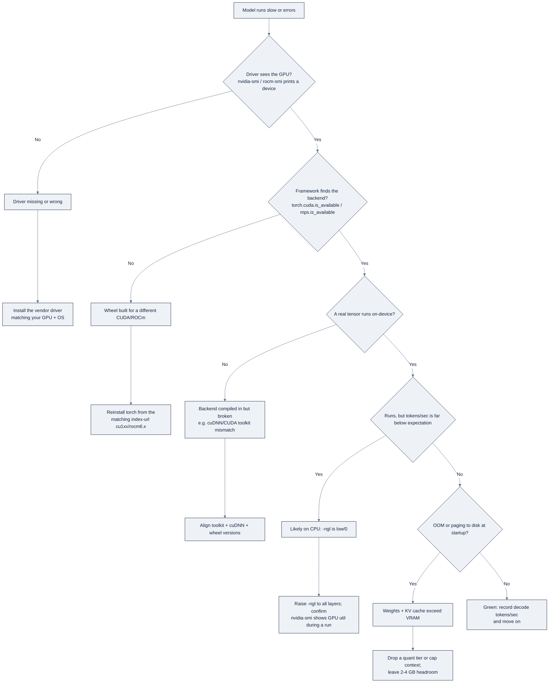

# 08, Local Inference & GPUs: Running Models on Your Own Hardware

**Purpose.** Run open models on a laptop with confidence, pick them by license and VRAM, operate the local stack (Ollama, llama.cpp, LM Studio, MLX), verify your GPU actually works, and do it all offline when privacy demands it.

Part of AI Engineering Lab · Developed by Zorost Intelligence AI Lab · [zorost.com](https://zorost.com)

---

## 1. Open vs closed models: and what "open" actually means

- **Closed models** (e.g. the flagship GPT, Claude, Gemini tiers) are served through an API only. You never see the weights; you rent access. They are often the strongest out of the box, but you cannot self-host, inspect, modify, or guarantee where your data goes.
- **Open-weight models** publish the trained weights (and usually the architecture and tokenizer) so you can download, run, quantize, and fine-tune them yourself. The catch: **open weights are not automatically "open source" in the OSI sense**, the license, not the download button, decides what you may legally do.

The practical decision is three questions, in order:

1. **Do I need to self-host** (privacy, air-gap, cost, latency, offline)? If yes, you need an open-weight model.
2. **Is the license compatible** with my use (commercial product? redistribution? fine-tuning?)? Read it, see the table below.
3. **Does a small-enough model do the task** on my hardware? If a 70B is required and I have an 8 GB GPU, the open model is moot.

### Licenses that matter

| License | Type | Commercial use? | What to watch |
|---|---|---|---|
| **Apache-2.0** | Permissive | Yes | Requires attribution, patent grant, and preservation of notices. Qwen and several Mistral releases use it. |
| **MIT** | Permissive | Yes | Very short; attribution + no-liability. DeepSeek's open models and Phi-3 use it. |
| **Llama Community License** | Custom (Meta) | Yes, up to a scale cap | ~700M monthly active users threshold (varies by model); attribution required; restricts using outputs to improve other models at scale. |
| **Gemma Terms of Use** | Custom (Google) | Yes, with restrictions | Prohibited-use list; attribution required; not OSI-approved. |
| **Research-only / non-commercial** | Custom | No | Some academic releases; fine for learning, not for a product. |

**Rule:** read the license *before* you ship. For the ZoroLogistics labs, Apache-2.0 and MIT models are the safest default; Llama and Gemma are usable commercially but carry terms you must record. "Open weights" is a distribution fact; "open license" is a legal fact, do not conflate them.

---

## 2. Model families and the Hugging Face Hub workflow

### The families you will reach for locally

| Family | Maker | Notes |
|---|---|---|
| **Llama** | Meta | The general-purpose default; largest ecosystem and tooling support. Llama Community License. |
| **Mistral / Mixtral** | Mistral AI | Strong quality-per-parameter; Mixtral is mixture-of-experts (MoE), most params "off" per token. |
| **Qwen** | Alibaba | Apache-2.0; excellent multilingual and coding; the safe license pick. |
| **Gemma** | Google | Small, dense, good on constrained hardware; Gemma Terms of Use. |
| **Phi** | Microsoft | Tiny models that punch above their weight for reasoning/code; MIT. |
| **DeepSeek** | DeepSeek AI | MIT; strong reasoning/coding; MoE variants are cheap to serve per token. |

Pick by **license → size → task**. For an offline commercial tool, Apache-2.0/MIT families (Qwen, Phi, DeepSeek, some Mistral) avoid licensing friction; for maximum ecosystem compatibility, Llama wins despite its custom terms.

### Hugging Face Hub workflow

The Hub is the distribution layer. The artifacts you will actually download:

- **Model card** (`README.md` on the repo), the model's spec sheet: what it is, license, benchmarks, intended use, and how to run it. Read it first; it often tells you the quantization and VRAM story before you download 15 GB.
- **safetensors**: the safe weight format (no `pickle` code-execution risk). This is what Transformers loads for FP16/BF16 models.
- **GGUF repos**: community-converted single-file quants (e.g. `TheBloke/...-GGUF` or the official `*-GGUF` mirrors) with tags like `Q4_K_M` in the filename. These are the "just run it" artifacts for llama.cpp/Ollama/LM Studio.

**Typical flow:**

1. Pick a family and a base model (e.g. Qwen 2.5 7B Instruct).
2. Open its model card; confirm license and the recommended serving path.
3. Find the GGUF mirror and choose the quant tag that fits your VRAM (§5, §6).
4. Download the single `.gguf` file (or `ollama pull` the equivalent tag).
5. Run it, then **verify on your own eval set**, never trust the card's benchmark as your number.

The Hub also hosts **LoRA adapters**, **datasets**, and **spaces**, but for local inference, the model card + GGUF file are the two artifacts that matter.

---

## 3. The local stack: four runtimes

### 3.1 Ollama (simplest)

A friendly wrapper around llama.cpp that packages models and exposes a CLI, a REST API, and an OpenAI-compatible endpoint.

```sh
# Install (macOS/Linux); Windows uses the installer from ollama.com
curl -fsSL https://ollama.com/install.sh | sh

ollama pull llama3.2            # or a sized/quantized tag: llama3.2:7b-q4_K_M
ollama run llama3.2             # interactive chat
ollama list                     # installed models
```

- **Modelfile**: a declarative recipe: `FROM <base>`, `SYSTEM` prompt, `PARAMETER` (temperature, `num_ctx`, `top_p`, `stop`), `TEMPLATE` (chat template), `ADAPTER` (LoRA). Build with `ollama create mymodel -f Modelfile`.
- **REST API**: served at `http://localhost:11434` (`/api/generate`, `/api/chat`, `/api/pull`, `/api/tags`, …). Set `OLLAMA_HOST` to rebind and `OLLAMA_MODELS` to relocate storage.
- **OpenAI compatibility**: `http://localhost:11434/v1` speaks `/chat/completions`, so any OpenAI SDK points straight at it.

**When to use it:** the fastest path from zero to a working local model; the right first stop for every learner. Graduate to llama.cpp or a serving engine when you need CLI-level flags, grammars, or high throughput.

### 3.2 llama.cpp (the substrate)

The original C/C++ engine (`ggml-org` org) that runs **GGUF** models on CPU and GPU with no Python dependency, the engine under Ollama, LM Studio, and much else.

- **GGUF** is a self-contained, single-file format bundling weights + metadata (tokenizer, chat template, quant info). Convert from Hugging Face with `convert_hf_to_gguf.py`; quantize with `llama-quantize`.
- **Key binaries:** `llama-cli` (one-shot/interactive), `llama-server` (OpenAI-compatible HTTP server), `llama-quantize` (make a smaller k-quant), `llama-perplexity` (eval), `llama-bench` (benchmark).
- **Common flags:** `-ngl N` (layers offloaded to GPU, set high/all for full GPU), `-c`/`--ctx-size`, `-n` (max tokens), `-t` (threads), `--temp`, `-fa`/`--flash-attn`, `--jinja` (chat templates).

```sh
# Example: run a GGUF on GPU, full offload, 4K context
llama-server -m model-q4_k_m.gguf -ngl 99 -c 4096 --port 8080
```

- **Backends:** CUDA, Metal (Apple), ROCm/HIP (AMD), Vulkan, SYCL, selected at build time (cmake flags like `-DGGML_CUDA=ON`, `-DGGML_METAL=ON`). Build with your GPU backend enabled or you silently fall back to CPU.

**When to use it:** when you want maximum control, grammar-constrained outputs, precise offload tuning, or a dependency-free binary.

### 3.3 LM Studio (GUI)

A desktop app for discovering, downloading, and running local models with a built-in chat and a local OpenAI-compatible server at `http://localhost:1234/v1`.

- Browse/search the Hub and one-click download GGUF models; pick a runtime (MLX on Apple Silicon, CUDA, or Vulkan).
- Best for *interactive* experimentation and for quickly serving a model to a coding agent without a CLI. Watch the "loaded into memory" indicator, it makes VRAM pressure visible.

**When to use it:** the discovery and "does this model feel right?" layer; graduate to llama.cpp/vLLM for scripted, repeatable serving.

### 3.4 Apple MLX (Apple Silicon)

Apple's ML framework for M-series chips: a NumPy-like API over **unified memory** (model, KV cache, and app share one pool, no host↔device copies).

- `mlx-lm` toolkit: `mlx_lm.generate`, `mlx_lm.convert` (import HF models), `mlx_lm.server` (OpenAI-compatible server), `mlx_lm.lora` (LoRA/QLoRA fine-tuning), `mlx_lm.fuse`.
- Often the fastest local path on Macs, unified-memory bandwidth can beat a comparable discrete GPU for large quants. Prefer 8-bit/4-bit (`-q --q-bits 4`) to fit big models.

```sh
pip install mlx-lm
mlx_lm.server --model mlx-community/Meta-Llama-3-8B-Instruct-4bit   # OpenAI-compatible server
```

**When to use it:** the best choice on Apple Silicon for both inference and small fine-tunes; research/single-node oriented, so use vLLM/SGLang for multi-GPU serving.

**Choosing a runtime (short version):** Apple Silicon → MLX (speed) or Ollama (simplicity); NVIDIA Linux server → vLLM/SGLang for throughput, llama.cpp for single-box control; interactive discovery → LM Studio.

---

## 4. GPU setup: is my GPU actually working?

### 4.1 NVIDIA (CUDA)

You need a **driver**, the **CUDA toolkit**, and **cuDNN** (for training frameworks). For PyTorch, install a CUDA-matched wheel:

```sh
pip install torch --index-url https://download.pytorch.org/whl/cu124   # pick the CUDA build matching your driver
```

```python
import torch
torch.cuda.is_available()      # True when the build finds the driver
torch.cuda.get_device_name(0)  # e.g. "NVIDIA RTX 4090"
```

Rule of thumb: **driver version ≥ CUDA toolkit version** (the driver is backward-compatible). Check hardware with `nvidia-smi` (GPU, driver, CUDA version, VRAM).

### 4.2 Apple Silicon (Metal/MPS)

No driver install. PyTorch uses the Metal Performance Shaders backend:

```python
torch.backends.mps.is_available()   # True on M-series
device = torch.device("mps")
```

MPS is great for inference and modest fine-tuning; some ops fall back to CPU. **MLX is usually faster** on Apple hardware.

### 4.3 AMD (ROCm)

AMD's CUDA-equivalent stack for Instinct/Radeon GPUs. PyTorch ships ROCm wheels (`pip install torch --index-url https://download.pytorch.org/whl/rocm6.x`). Check with `rocm-smi` and `torch.cuda.is_available()` (ROCm presents as the CUDA device abstraction via HIP). Historically less smooth than CUDA on consumer cards, **verify your exact GPU is supported before buying.**

### 4.4 The "is my GPU working" checklist

1. **Driver seen by the OS**: `nvidia-smi` (NVIDIA) or `rocm-smi` (AMD) prints a device; on Apple, "About This Mac" shows the chip.
2. **Framework finds the backend**: `torch.cuda.is_available()` / `torch.backends.mps.is_available()` is `True`.
3. **A real tensor runs on it**: create a tensor on the device and do an op; an exception here (not a `False`) is the true failure signal.
4. **A model runs end-to-end**: `ollama run llama3.2` or a `llama-cli` call completes and reports tokens/sec. If `-ngl` is low, you are on CPU without realizing it.
5. **VRAM is not exhausted**: watch `nvidia-smi` memory during a run; an OOM or a slowdown to CPU offload means the model does not fit.

**Symptom → cause map:**

| Symptom | Likely cause |
|---|---|
| `torch.cuda.is_available()` is `False` | Driver missing, or torch wheel built for a different CUDA |
| `nvidia-smi` works but PyTorch errors | Toolkit/driver mismatch, match the wheel to the driver |
| Runs, but very slow | Low `-ngl` / running on CPU; or MPS op fallback |
| OOM at startup | Model + KV cache exceed VRAM, drop a quant tier or cap context |

The checklist exists because "I installed CUDA" and "my GPU is actually doing the work" are different claims, verify the second, always.

---

## 5. VRAM math: how much memory does a model need?

**Weights = bytes-per-parameter × parameter count.** Format determines bytes/param:

| Format | Bytes/param | ~Memory per 1B params |
|---|---|---|
| FP32 | 4 | ~4 GB |
| FP16 / BF16 | 2 | ~2 GB |
| INT8 | 1 | ~1 GB |
| INT4 / GGUF Q4 | 0.5 | ~0.5 GB |

Weights are only the start. Add **activations** and the **KV cache** (which grows with context length), plus room for the OS and other processes, a practical budget is **~10 to 20% extra, and more at long context**.

### Sizing table (weights only, before the overhead above)

| Model size | FP16 | 8-bit (INT8) | 4-bit (INT4/GGUF Q4) | Typical GPU to fit |
|---|---|---|---|---|
| 7B | ~14 GB | ~7 GB | ~4 GB | 8 GB card (4-bit) or 16 GB (FP16) |
| 8B | ~16 GB | ~8 GB | ~4.5 GB | 8 GB (4-bit) / 16 GB (FP16) |
| 13B | ~26 GB | ~13 GB | ~7 GB | 12 to 16 GB (4-bit) / 24 GB (FP16) |
| 34B | ~68 GB | ~34 GB | ~17 GB | 24 GB (4-bit) |
| 70B | ~140 GB | ~70 GB | ~35 GB | 2×24 GB (4-bit) or 48 to 80 GB |
| 405B+ | ~810 GB | ~405 GB | ~200 GB | Multi-GPU datacenter only |

(8-bit here ≈ GGUF `Q8_0` / bitsandbytes 8-bit; 4-bit ≈ GGUF `Q4_K_M` / bitsandbytes NF4. Apple unified memory follows the same table, a 128 GB M-series Mac runs a 70B at 4-bit comfortably.)

**Worked example: 7B at Q4.** 7B params × 0.5 bytes/param ≈ **3.5 GB of weights**. Add KV cache for a 4K context (~2 GB at FP16, less if quantized) and activations/overhead (~1 to 2 GB) → **~5 to 6 GB total**. That fits an 8 GB card or a 16 GB MacBook with room to spare, which is exactly why 7 to 8B at Q4 is the sweet spot for local work.

**Rule of thumb for headroom:** budget **≥2 GB per 1B params at FP16** (weights alone), falling to **~0.5 GB per 1B at Q4**; plan on **~1 GB per 1B at Q4** once you add KV cache and activations, and always leave 2 to 4 GB free for the OS. When in doubt, drop a quant tier before you assume a model "fits", a model that technically loads but pages to disk is slower than a smaller model that stays in memory.

---

## 6. Picking a model by hardware

| Hardware | Comfortable | Stretch (slow, quantized) |
|---|---|---|
| 8 GB GPU (e.g. 3060/4060) | 7 to 8B at Q4_K_M | 13B at Q4 (tight) |
| 12 to 16 GB GPU | 13B at Q4, 7 to 8B at Q8/FP16 | 34B at Q4 (tight on 16 GB) |
| 24 GB GPU (3090/4090) | 34B at Q4, 13B at Q8 | 70B at Q4 (very tight) |
| 16 GB M-series MacBook | 7 to 8B at Q4/Q8 | 13B at Q4 (slow but works) |
| 32 to 64 GB M-series Mac | 13 to 34B at Q4 | 70B at Q4 (on 64 GB) |
| CPU only (32 GB RAM) | 3 to 8B at Q4 | 13B at Q4 (slow) |

**Decision flow:**

1. **Set the task**: triage needs less model than long-form reasoning; match capability, not just size.
2. **Compute your memory budget**: total RAM/VRAM minus OS and other apps.
3. **Choose the largest family that fits at a quality quant**: `Q4_K_M` first, `Q5_K_M`/`Q6_K` when quality matters, `Q8_0` when you have VRAM to spare.
4. **Verify on your eval**: if the chosen quant clears the bar, ship it; if not, the model is too small for the task and you need bigger hardware or a hosted API.

The pattern: **start from the model size you want, then choose the largest quant that fits with headroom.** Do not start from "the biggest model that will physically load", headroom is what keeps it responsive.

---

## 7. Local structured outputs

You do not give up JSON just because the model is local. All four runtimes can enforce structure:

- **Ollama** exposes `format: "json"` (and newer structured-output modes) on `/api/chat`.
- **llama.cpp** supports **grammar-constrained decoding** (GBNF grammars) so output is *provably* valid, the strongest guarantee, not a prompt request.
- **LM Studio** and **MLX** both serve OpenAI-compatible endpoints, so the same JSON-schema tooling you use against a hosted API works unchanged.

For the ticket-triage task, a grammar or JSON schema that emits `{"category": ..., "summary": ...}` eliminates the "valid JSON but wrong shape" failure class entirely, a real reliability win for offline pipelines. **Prefer a grammar/schema over a prompt plea**: "please output JSON" is a suggestion; a GBNF grammar is a guarantee.

```text
root ::= "{" "\"category\":" category "," "\"summary\":" string "}"
category ::= "\"billing\"" | "\"delay\"" | "\"damage\"" | "\"documentation\"" | "\"other\""
```

---

## 8. Privacy & air-gapped use cases

Local inference is the answer when the data cannot leave the building: no API call, no token billing, no third party sees the text. That matters for regulated freight, pharma, aviation, and government work where **accuracy, traceability, and compliance are non-negotiable**.

Zorost Intelligence serves exactly these environments. Its federal practice includes **Air-Gapped & Sovereign AI Deployments**, framed as *"calibration-first AI for federal missions, deployable in sovereign environments, engineered with governance and auditability from day one"*, and its lab ships products like **SPCio**, described as *"quality intelligence from the factory line, even fully offline"* ([Zorost Intelligence](https://zorost.com)). The pattern transfers directly to ZoroLogistics: customer shipment notes, contracts, and personally identifiable consignee data stay on the laptop or on-prem box, and the model runs with no network egress.

**Air-gapped workflow, step by step:**

1. On a connected machine: download the GGUF (or safetensors) file + its model card + license.
2. Scan and record the license/terms for the compliance file.
3. Move the file across on media (or an approved one-way transfer) to the offline machine.
4. Install the runtime *from an offline package* (Ollama/llama.cpp are distributable; pre-download the installer).
5. Run with network disabled, the model never phones home because there is nothing to phone home *to*.
6. Validate with a local eval set before production; keep the eval and the model in the same controlled environment.

**When to choose local over API:** data that cannot leave (PII, PHI, CUI), hard latency ceilings, zero-marginal-cost high volume, and regulatory/jurisdictional requirements. **When not to:** when the task genuinely needs a frontier model, or when you need elastic scale you cannot provision locally. The two are not mutually exclusive, most production systems route easy/privacy-sensitive work local and hard work to an API.

---

## 9. ZoroLogistics example: offline ticket triage on a 16 GB MacBook

The ops team needs to triage support tickets on a 16 GB Apple Silicon MacBook **with no internet** (a client-site audit room). Constraints: ~16 GB unified memory (≈12 GB usable for the model after the OS), offline, and a classification + short-summary task that does not need frontier reasoning.

1. **Task fit**: triage is a mid-complexity classification/extraction task; a 7 to 8B model at Q4 is ample. (VRAM check: 8B × 0.5 bytes ≈ 4 GB weights + ~2 GB KV/activations ≈ 6 GB, fits with headroom.)
2. **License**: pick an Apache-2.0/MIT family so the tool can ship commercially: **Qwen 2.5 7B Instruct** (Apache-2.0) or **Llama 3.1 8B** (Llama license, note the terms in the compliance file).
3. **Quant**: `Q4_K_M` → ~4 to 4.5 GB weights, leaving comfortable headroom for KV cache and a browser. `Q8_0` (~8 GB) would fit but leave little margin for long ticket histories.
4. **Runtime**: **MLX** on Apple Silicon (fastest, unified memory) for day-to-day use; **Ollama** if the team wants the simplest API and a Modelfile with the triage system prompt and a JSON template baked in.
5. **Structure**: enforce `{"category", "summary", "priority"}` via a JSON schema/grammar so downstream routing never sees malformed output.
6. **Verify**: run the Week 11 golden triage eval locally; confirm the offline model clears the same F1 gate as the hosted baseline before it ships to the audit room.

The result: a private, zero-marginal-cost, air-gapped triage assistant that fits in a laptop's unified memory, the same pattern Zorost's sovereign-AI work uses in production.

---

## 10. Benchmarking and the pitfalls that bite

### Measuring tokens/sec (the only speed number that matters)

"Fast" is meaningless until you measure it on *your* hardware. Two numbers matter and they differ sharply:

- **Prefill speed (prompt evaluation)**: how fast the model ingests your prompt, in tokens/sec. Long prompts are prefill-bound.
- **Decode speed (generation)**: how fast it produces new tokens, one at a time. Long answers are decode-bound.

Use `llama-bench` (llama.cpp) or read Ollama's per-request timing; a quick Python loop timing `generate()` end-to-end also works. Ballpark for a 7 to 8B Q4 on Apple Silicon via MLX: **~20 to 40 tokens/sec decode**; the same model on CPU-only might manage ~5 to 10; a 24 GB GPU does far more. Report *decode* tokens/sec when someone asks "how fast is it", that is what the user feels.

### Common pitfalls

| Pitfall | Symptom | Fix |
|---|---|---|
| Forgot the GPU backend | Works but slow; `-ngl` is 0 | Build/run with CUDA/Metal enabled; raise `-ngl` |
| Context too small | Truncated input, wrong answers | Raise `-c`/`num_ctx`, and account for the extra KV memory |
| Quant too big for the box | OOM, or paging to disk | Drop a quant tier (Q8 → Q4_K_M) |
| Trusted the model card | Disappointing real-task quality | Run your own eval before shipping |
| Ignored the license | Surprise at compliance review | Record license + terms up front |
| No structured output | Downstream parse failures | Add a JSON schema or GBNF grammar |

The through-line: **local inference is easy to start and easy to get subtly wrong**, the model *runs* while silently on CPU, truncated, or two quant tiers heavier than it should be. The checklist (§4.4) plus a tokens/sec measurement is what turns "it runs" into "it works."

---

## 11. Command cookbook: Ollama · llama.cpp · MLX

The three runtimes share one mental model, *pull a model, serve it, constrain it, measure
it*, but the incantations differ. This is the copy-paste reference for the Week 8 notebooks,
grouped so you can go from "installed" to "serving a ZoroLogistics triage model" without
re-discovering flags.

### 11.1 Ollama

| Command | What it does |
|---|---|
| `curl -fsSL https://ollama.com/install.sh \| sh` | Install (macOS/Linux); Windows uses the `.exe` from ollama.com |
| `ollama pull qwen2.5:7b-instruct-q4_K_M` | Pull a specific model **and quant**, pin the tag, never bare `qwen2.5` |
| `ollama run qwen2.5:7b-instruct-q4_K_M` | Interactive chat (drop a prompt as an argument for one-shot: `ollama run qwen2.5 "…"`) |
| `ollama list` / `ollama rm <model>` | List installed models / delete one to reclaim disk |
| `ollama show <model> --modelfile` | Print a model's effective Modelfile (its system prompt, params, template) |
| `ollama create zoro-triage -f Modelfile` | Build a custom model from a Modelfile |
| `ollama cp <src> <dst>` | Copy (rename) a model |
| `ollama serve` | Run the daemon explicitly (usually auto-started); serves `:11434` |

**The Modelfile for the offline triage model** (§9), bake the system prompt and JSON
template in so every caller gets the same behavior:

```dockerfile
FROM qwen2.5:7b-instruct-q4_K_M
SYSTEM """
You are the ZoroLogistics offline ticket triage assistant. Classify each
support message into exactly one category (tracking, damage, refund,
documents, customs, billing) and summarize it in one sentence. Reply only
with valid JSON: {"category": "...", "summary": "...", "priority": "..."}.
"""
PARAMETER temperature 0.2
PARAMETER num_ctx 4096
PARAMETER top_p 0.9
```

```sh
# Chat-completions call against the OpenAI-compatible endpoint (any OpenAI SDK works):
curl http://localhost:11434/v1/chat/completions \
  -H "Content-Type: application/json" \
  -d '{"model":"zoro-triage","messages":[{"role":"user","content":"Where is shipment S0004821?"}],"format":"json"}'

# Native /api/chat (OpenClaw uses this one, NOT /v1, see knowledge-base/10):
curl http://localhost:11434/api/chat -d '{"model":"zoro-triage","messages":[{"role":"user","content":"Pallet arrived crushed."}],"stream":false}'
```

Environment knobs that matter once you have more than one model loaded:

| Variable | Default | What it changes |
|---|---|---|
| `OLLAMA_HOST` | `127.0.0.1:11434` | Bind address (set `0.0.0.0:11434` to expose on a LAN, do **not** do this for air-gapped PII boxes) |
| `OLLAMA_MODELS` | `~/.ollama/models` | Where weights live (point it at a big external disk) |
| `OLLAMA_NUM_PARALLEL` | `1` (or auto) | Concurrent requests, each parallel request holds its own KV cache, so this is a memory multiplier |
| `OLLAMA_MAX_LOADED_MODELS` | `3` | How many models stay resident; lower it to free VRAM on an 8 GB card |
| `OLLAMA_KEEP_ALIVE` | `5m` | Unload idle models after this (set `0` to unload immediately, `-1` to pin) |

### 11.2 llama.cpp

| Command | What it does |
|---|---|
| `cmake -B build -DGGML_CUDA=ON` (or `-DGGML_METAL=ON`, `-DGGML_HIPBLAS=ON`, `-DGGML_VULKAN=ON`) | Build with a **GPU backend**, the #1 "why is it slow" root cause is building CPU-only |
| `python convert_hf_to_gguf.py <hf-dir> --outfile model.gguf` | Convert Hugging Face safetensors → GGUF |
| `llama-quantize model-f16.gguf model-q4_K_M.gguf Q4_K_M` | Make a smaller k-quant |
| `llama-cli -m model.gguf -p "Prompt here"` | One-shot completion |
| `llama-server -m model.gguf -ngl 99 -c 4096 --port 8080` | OpenAI-compatible server (what a harness points at) |
| `llama-bench -m model.gguf -ngl 99` | Benchmark prefill/decode tokens/sec on *your* hardware |
| `llama-perplexity -m model.gguf -f eval.txt` | Measure perplexity on an eval corpus (a sanity check before shipping a quant) |

The flags you actually reach for, with the values that matter for a 7 to 8B on modest GPUs:

| Flag | Meaning | Rule of thumb |
|---|---|---|
| `-ngl N` | Layers offloaded to GPU | Set to `99` (all) for full-GPU; lower it only to deliberately split CPU/GPU |
| `-c / --ctx-size` | Context window | `4096` default for triage; raise to `8192` for long ticket histories and *watch KV memory* |
| `-n` | Max tokens to generate | `-1` = until EOS; cap it (`-n 256`) for classification so a bad run can't ramble |
| `-t` | Threads | ≈ physical cores for CPU-only; irrelevant when fully GPU-offloaded |
| `--temp` | Sampling temperature | `0.2` for extraction/classification; `0.7-0.8` for chat |
| `-fa / --flash-attn` | Flash attention | On when supported, less KV memory at long context |
| `--jinja` | Use the model's chat template | On for chat; off for raw completion |
| `--grammar-file g.gbnf` | Constrain output to a GBNF grammar | The **strongest** structure guarantee (§7) |

**Grammar for the triage JSON**: save as `triage.gbnf` and pass `--grammar-file`:

```text
root ::= "{" ws "\"category\":" ws category "," ws "\"summary\":" ws string "," ws "\"priority\":" ws priority ws "}"
category ::= "\"tracking\"" | "\"damage\"" | "\"refund\"" | "\"documents\"" | "\"customs\"" | "\"billing\""
priority ::= "\"low\"" | "\"medium\"" | "\"high\"" | "\"critical\""
string ::= "\"" ([^"\\] | "\\" .)* "\""
ws ::= [ \t\n]*
```

### 11.3 Apple MLX

| Command | What it does |
|---|---|
| `pip install mlx-lm` | Install the toolkit |
| `mlx_lm.convert --hf-path <hf-dir> -q --q-bits 4 -o ./out` | Import a HF model and quantize to 4-bit |
| `python -m mlx_lm.generate --model <dir> --prompt "…" --max-tokens 256` | One-shot generation |
| `python -m mlx_lm.server --model <dir> --port 8080` | OpenAI-compatible server (MLX is usually the fastest path on Apple Silicon) |
| `python -m mlx_lm.lora --model <base> --train --data <jsonl> --iters 200` | LoRA/QLoRA fine-tune on Apple Silicon |
| `python -m mlx_lm.fuse --model <base> --adapter-path <lora> --save-path <out>` | Merge a LoRA adapter back into the base |

```python
# Python API, unified memory means you load once and generate without host↔device copies:
from mlx_lm import load, generate
model, tokenizer = load("mlx-community/Qwen2.5-7B-Instruct-4bit")
out = generate(model, tokenizer, prompt="Classify: pallet arrived crushed", max_tokens=64)
print(out)
```

**Which runtime for the Week 8 deliverable?** Apple Silicon → `mlx_lm.server` (speed) or
Ollama (simplest, Modelfile-built). Linux/NVIDIA → `llama-server` with `-ngl 99` (control)
or `vllm serve` for high concurrency. Interactive "does this model feel right?" → LM Studio.
The three cookbooks above collapse to one sequence: **pull/convert → quantize if needed →
serve → constrain (schema/grammar) → measure tokens/sec.**

### 11.4 When to graduate to a serving engine

Ollama/llama.cpp/MLX are *single-node* runtimes; production multi-user serving needs a batch
engine. The three worth knowing (details live in the research notes §B.7):

| Engine | Key mechanism | Best when |
|---|---|---|
| **vLLM** | PagedAttention + continuous batching | High-QPS, many concurrent requests (`vllm serve <model>`) |
| **SGLang** | RadixAttention prefix caching + fast structured decoding | Agent loops, repeated system prompts, strict JSON |
| **TGI** | Rust/Python, polished HF defaults | HF-native, containerized, ops-friendly deploys |

For ZoroLogistics offline triage you stay on MLX/Ollama, a single analyst, no concurrency, and
the whole point is *no server*. You reach for vLLM/SGLang the moment the model moves to a shared
endpoint serving many lanes/analysts at once (§10's benchmark instinct still applies: measure
decode tok/s per stream *after* batching, not before).

---

## 12. GPU troubleshooting decision tree

"Did I actually get my GPU working?" is the single most common local-inference question. Run
the tree top-to-bottom; it lands you on a concrete fix instead of a vibe.



**Reading the four failure points as they happen in the wild:**

| Node | The tell-tale sign | One-line fix |
|---|---|---|
| B → No | `nvidia-smi` errors ("couldn't communicate with driver") | Reinstall/rebuild the kernel driver; a reboot after driver updates fixes most cases |
| D → No | `torch.cuda.is_available()` returns `False` but `nvidia-smi` works | The torch wheel was built for a *different* CUDA, reinstall from `download.pytorch.org/whl/cu121` (or whichever matches) |
| H → Yes | The model answers correctly but at 5 to 10 tok/s when your card should do 40+ | `-ngl` is low; in Ollama confirm the model loaded "100% GPU" via `ollama ps` |
| J → Yes | Load succeeds then OOM on the first token, or the box starts swapping | Model + KV exceed the budget; drop Q8→Q4_K_M or `num_ctx` 8192→4096 |

Two commands that turn "it feels slow" into a number: `ollama ps` (shows each model's
processor split and context size) and `nvidia-smi dmon -s u` (live GPU utilization, 0% while
generating means you are on CPU).

---

## 13. VRAM planning workbook: six hardware profiles

Same arithmetic as §5, now turned into a fill-in workbook. For each profile: compute the
**usable budget** (total minus OS/other apps), pick the **largest model that fits at a quality
quant**, and sanity-check the **KV cache** at your context length.

**The fit formula** (repeat it until it's reflex):

```
total_budget = VRAM/RAM − OS_and_apps          # e.g. 16 GB Mac → ~12 GB usable
weights      = params × bytes_per_param         # Q4 ≈ 0.5 GB/B, Q8 ≈ 1 GB/B, FP16 ≈ 2 GB/B
kv_cache ≈ 0.1 to 0.5 GB per 1K context at FP16 (model-dependent; long context = the killer)
overhead = activations + runtime ≈ 0.5 to 2 GB
fits ⇔ weights + kv_cache + overhead ≤ total_budget (leave 2 to 4 GB headroom)
```

| Profile | Usable budget (approx) | Sweet-spot model | Comfortable quant | Decode tok/s (ballpark) | Fits? |
|---|---|---|---|---|---|
| 8 GB NVIDIA (3060/4060) | ~7 GB | 7 to 8B | Q4_K_M (~4.5 GB weights) | 30 to 50 | Yes, with 4K context; 13B at Q4 **does not** leave KV headroom |
| 12 to 16 GB NVIDIA (4070 Ti Super/A4000) | ~13 GB | 13B | Q4_K_M (~7 GB) or 7 to 8B at Q8_0 | 40 to 70 | Yes; 34B at Q4 is the tight stretch |
| 24 GB NVIDIA (3090/4090) | ~21 GB | 34B | Q4_K_M (~17 GB) | 25 to 45 | Yes; 70B at Q4 spills to CPU unless you drop context aggressively |
| 16 GB Apple Silicon (M-series MacBook) | ~12 GB | 7 to 8B | Q4_K_M or Q8_0 | 20 to 40 (MLX) | Yes; 13B at Q4 runs but slowly |
| 32 to 64 GB Apple Silicon (Mac Studio/Pro) | ~28 to 60 GB | 13 to 34B | Q4_K_M to Q6_K | 15 to 35 (MLX) | Yes; 70B at Q4 fits on 64 GB |
| CPU only, 32 GB RAM | ~24 GB (no GPU) | 3 to 8B | Q4_K_M | 5 to 10 | Yes for 7 to 8B; 13B at Q4 is a slow "works but don't plan a demo around it" |

**Worked example: the 16 GB MacBook triage box (§9), by the numbers:**

- Total 16 GB unified; OS + browser ≈ 4 GB → **usable ≈ 12 GB**.
- Qwen 2.5 7B at Q4_K_M → 7.0B × 0.5 ≈ **3.5 GB weights**.
- KV cache at 4096 context (FP16) ≈ **~2 GB**; activations/runtime ≈ **1.5 GB**.
- Sum ≈ **7 GB**, leaving ~5 GB headroom: comfortable, so we can afford `OLLAMA_NUM_PARALLEL=2`
  for two concurrent analysts *or* raise context to 8192 for long ticket threads. Q8_0 (≈7 GB
  weights) would also fit but leaves <3 GB margin, pick Q4_K_M for safety.
- Sanity check on the other end: a **70B at Q4 (≈35 GB weights)** has *no* chance on 12 GB,
  and even a 13B at Q4 (≈7 GB) leaves ~2 GB for KV, a 4096 context would page. Hence "7 to 8B at
  Q4" is the honest answer for this box, and the numbers say so before any download.

**Second worked example: trying a 70B at Q4 on 24 GB (and why it usually loses).**

- 70B × 0.5 ≈ **35 GB of weights** on a 24 GB card → the weights *alone* already overflow.
- Even splitting across **2×24 GB (48 GB)**, a 4096-context KV cache at FP16 can add ~4 to 6 GB
  per card plus overhead → ~40 GB, which *does* fit, but with almost no room for batching.
- The honest comparison: a **34B at Q4_K_M (≈17 GB)** on one 24 GB card runs at ~25 to 45 tok/s
  with headroom, while the 70B split across two cards often yields *worse* tokens/sec for a
  single stream because tensor-parallel communication eats the gain.

**Rule:** a model that fits on *one* device with headroom beats a bigger model split across
two devices for single-stream, interactive work. Multi-GPU only pays when you need the larger
model's quality *and* you have concurrency or batching to amortize the split.

The workbook's lesson: **the largest model that physically loads is usually the wrong choice.**
The right choice is the largest model that fits *with headroom at your context length*, headroom
is what keeps generation responsive, not just non-crashing.

---

## 14. How it breaks / common mistakes

| Mistake | Symptom | Fix |
|---|---|---|
| Built llama.cpp without a GPU backend | Works, but 5 to 10 tok/s on a card that should do 50 | Rebuild with `-DGGML_CUDA=ON` / `-DGGML_METAL=ON`; confirm with `ollama ps`/`-ngl` |
| Pulled the bare tag (`qwen2.5`) instead of a pinned quant | Surprise VRAM usage, or silently a different model | Pin tags like `:7b-instruct-q4_K_M`; `ollama list` shows what you actually have |
| Trusted the model card's benchmark | Disappointing real-task quality | Run your own eval set (Week 11), perplexity and leaderboards are not your task |
| Ignored the license | Compliance surprise at ship time | Record license + terms in the compliance file (§1) before the model goes anywhere |
| Cranked `num_ctx` to 32K "for safety" | OOM or CPU spill at runtime | Context is a *budget*, set it to what the task needs, then add 20% |
| Set temperature to 0 "for determinism" on a classifier | Still nondeterministic; wasted the knob | Use a low temp **plus** a JSON schema/GBNF grammar; determinism comes from structure, not sampling |
| Ran the server on `0.0.0.0` on an air-gapped PII box | Data egress risk the moment the box touches a network | Keep `OLLAMA_HOST` on loopback; the whole point of §8 is no egress |
| Judged "fast" without measuring | "Fast enough" that isn't | `llama-bench` / `ollama ps`; report **decode** tok/s, not prefill |
| Over-parallelized Ollama on a small card | Latency spikes / OOM under load | `OLLAMA_NUM_PARALLEL=1` and lower `OLLAMA_MAX_LOADED_MODELS`, each concurrent request holds its own KV cache |

The meta-pattern: local inference **fails quiet**, the model runs while on CPU, truncated, or
two quant tiers too heavy. The fix is always the same three measurements: *where does it run*
(device/`-ngl`), *how big is context*, *how fast is decode*.

---

## 15. Self-check questions

1. **A 7B model at Q4_K_M loads on an 8 GB card but OOMs when you raise `num_ctx` from 4096 to 16384. Why?**
   *A:* Weights (≈3.5 GB) are constant, but the KV cache grows with context, at 16K it can add several GB, pushing the total past the card. Cap context to the task's need (or use a smaller quant/Flash Attention).

2. **`torch.cuda.is_available()` is `False` but `nvidia-smi` prints your GPU. What's the most likely cause?**
   *A:* The installed torch wheel was built for a different CUDA version than your driver. Reinstall from the matching PyTorch index-url; the driver is backward-compatible, but a mismatched wheel won't bind.

3. **You need guaranteed-valid JSON from a local model. Rank prompt-pleading, a JSON mode flag, and a GBNF grammar by strength.**
   *A:* GBNF grammar (provably valid) > JSON schema/`format:"json"` > a "please output JSON" prompt (a suggestion, not a guarantee).

4. **On Apple Silicon, when is MLX a better choice than Ollama?**
   *A:* When speed and unified-memory efficiency matter (large quants) or you're doing a small LoRA fine-tune; Ollama wins for zero-config simplicity and a baked Modelfile/system prompt.

5. **Why does ZoroLogistics triage choose a 7 to 8B at Q4 over "the biggest model that loads"?**
   *A:* Headroom: 7 to 8B at Q4 leaves ~5 GB free on a 12 GB budget for KV cache and concurrency, staying responsive; the biggest model that loads would page to disk and run slower than the smaller one.

**Passing bar:** 5/5. These five answers, the fit formula, the driver-vs-wheel distinction,
the structure-over-pleading rule, the MLX-vs-Ollama split, and the headroom argument, are the
numbers and rules you should be able to reproduce on *your own* hardware by the end of Week 8.

---

## Sources

- Ollama: https://ollama.com · https://github.com/ollama/ollama
- llama.cpp (GGUF): https://github.com/ggml-org/llama.cpp
- LM Studio: https://lmstudio.ai
- Apple MLX: https://github.com/ml-explore/mlx
- vLLM: https://docs.vllm.ai · SGLang: https://github.com/sgl-project/sglang · TGI: https://github.com/huggingface/text-generation-inference
- PyTorch installs (CUDA/ROCm): https://pytorch.org/get-started/locally/
- Hugging Face Hub: https://huggingface.co · safetensors: https://github.com/huggingface/safetensors
- Zorost Intelligence, federal & sovereign AI, air-gapped deployments: https://zorost.com
- Open Source Models with Hugging Face (DeepLearning.AI short course): https://www.deeplearning.ai/courses/open-source-models-hugging-face
