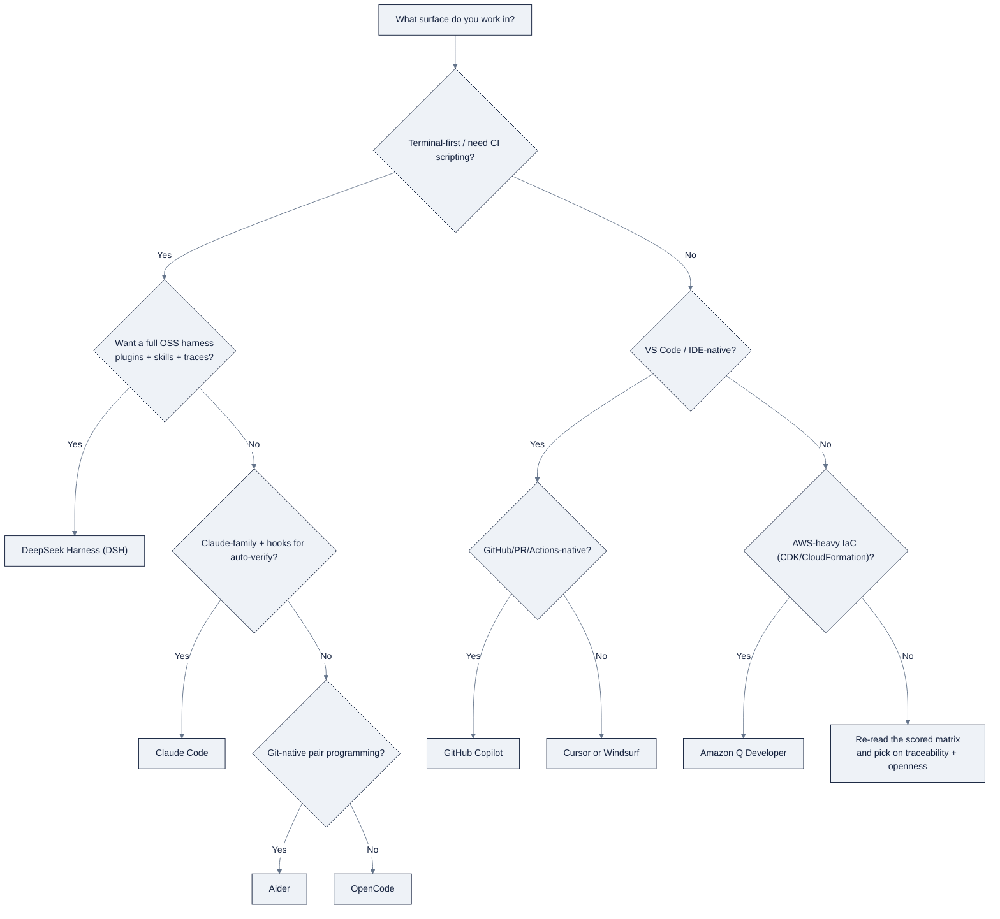

# 09: Coding-Agent Harnesses & LLM Routers

> Part of AI Engineering Lab · Developed by Zorost Intelligence AI Lab · zorost.com

This file is the conceptual backbone for Weeks 12 to 13. It explains what a coding-agent
**harness** actually is, surveys the landscape, and gives you the decision framework for
choosing one. It then covers the two things that make a harness *safe and cheap* to run:
**rules files** and **cost control**, plus **OpenRouter** as the model-routing layer that
sits behind almost any harness. It closes with the Week 12 ZoroLogistics build.

Everything here is synthesized from official vendor documentation; raw notes are in
`reference/knowledge-base/research/03-harnesses-local-stacks.md`.

---

## 1. What a harness is

A model is not an agent. A model takes tokens in and returns tokens out. A **harness** is
the software between the model and your machine that turns it into something that can
actually *do work*. It supplies four things:

| Component | What it does |
|---|---|
| **The loop** | Plan → act → observe → verify → repeat, until the task is done or a stopping condition fires. |
| **Tools** | Shell execution, file read/edit/write, search, and any MCP servers you attach. Tools are how the model affects the world. |
| **Context management** | Deciding what goes into the prompt each turn, the task, relevant files, rules, and conversation history, and compacting it when it grows too large. |
| **Verifiers** | The checks that close the loop: unit tests, type checks, linters, and evals that tell the model "still broken, try again." |

The division of labor is worth memorizing: **the model supplies reasoning; the harness
supplies agency.** A harness doesn't make the model smarter, it gives the model hands,
memory, and a feedback signal. That is why two harnesses pointing at the *same* model can
produce very different results: they differ in which tools exist, how context is managed,
and how hard they push on the verify step.

---

## 2. The landscape

The tools below fall into three families: **terminal/CLI harnesses** (run in the shell),
**AI-native IDEs** (a full editor with an agent built in), and **IDE extensions**
(assistants layered on an editor you already use). Pricing was captured Aug 2026 from
vendor pricing pages and **must be re-verified** before you quote it anywhere.

| Tool | Builder | Interface | Strengths | Pricing (Aug 2026, re-verify) |
|---|---|---|---|---|
| **DeepSeek Harness (DSH)** | DeepSeek | Web GUI + CLI + headless | Plugin-everything architecture; skills, goals, subagents, workflows; append-only trace of every run | Free, open source (MIT); you pay only your model |
| **OpenCode** | SST | TUI + desktop/web/IDE | Terminal-native, model- and provider-agnostic; `AGENTS.md` + `opencode.json`; client/server split | Free, open source (MIT); pay your provider |
| **Cursor** | Anysphere | IDE (VS Code fork) | Tab completion + multi-file Agent; Rules; MCP; Cursor Router with Cost/Balance/Intelligence modes | Free tier; Pro $20/mo, Pro+ $60/mo, Ultra $200/mo; Teams $40 to 120/user/mo |
| **Claude Code** | Anthropic | Terminal CLI (+ headless) | `CLAUDE.md`, subagents, hooks, MCP, permission sandbox, `claude -p` for CI | Claude Pro/Max subscription or pay-per-token API |
| **Windsurf** | Windsurf team | IDE | Cascade agent with repo-wide context; Previews; lighter than a full fork | Freemium; paid tiers buy more agent "flow action" credits |
| **GitHub Copilot** | GitHub/Microsoft | VS Code / CLI / web | Agent mode for multi-file tasks; deep GitHub/PR/Actions integration | Free tier; Pro ~$10/mo; Business/Enterprise |
| **Aider** | Open source | Terminal CLI | Git-native pair programmer; huge model list incl. local; architect/editor split | Free; you pay the API |
| **Amazon Q Developer** | AWS | IDE extension + CLI | Agent mode with AWS-native knowledge (CDK, IaC, AWS APIs) | Free tier; Pro ~$19/mo |

A few neighbors worth naming even though they sit slightly outside the coding-agent box:
**Warp** (a terminal whose built-in AI can act on your shell context) and **Aider**'s
relatives in the git-native CLI space. They matter because "harness" is a spectrum, not a
category with hard edges.

### DeepSeek Harness (DSH)

An **open-source agent harness**, explicitly *not* an editor and *not* a model. Its
design claim is **"everything is a plugin":** models, tools, skills, sessions, sandboxes,
storage, loops, scheduling, and even the UI are plugin bundles composed on a kernel called
**Cordis**. Per-session **runtime modes** change the toolset: *Standard* (full toolset),
*Code* (a code-mode SDK), *Minimal* (bare two-tool agent for benchmarking), and *Creator*
(runtime inspection). It adds **skills** (on-demand instruction packs), **goals**
(persisted multi-round objectives), **subagents & forks**, **Ralph loops** (fresh-agent
iterations), **workflows** (scripted fan-out), and an append-only session log with a
**Trajectory** view. Free (MIT); you bring your own model key.

### OpenCode (SST)

A **terminal-first, provider-agnostic** agent with a full TUI and optional desktop/web/IDE
surfaces. Its memory convention is `AGENTS.md`; its config is per-project `opencode.json`.
Because it speaks to any OpenAI-compatible endpoint, it is the easiest place to test local
(Ollama/LM Studio) or routed (OpenRouter) models. Free (MIT).

### Cursor (Anysphere)

An **AI-native editor** (a VS Code fork) whose headline is the multi-file **Agent**. It
adds **Tab** completion, **Rules** (`.cursor/rules`), **MCP**, and the **Cursor Router**,
whose "Auto" modes (Cost / Balance / Intelligence) route each request to a model that
trades cost against quality. Pricing tiers run Free → Pro → Pro+ → Ultra for individuals
and Standard/Premium for teams.

### Claude Code (Anthropic)

Anthropic's **CLI coding agent**, designed to run interactively in a repo or headless in
CI. Its memory files are `CLAUDE.md`; it has **subagents**, **hooks** (run linters or
block dangerous commands automatically), **MCP**, a permission/sandbox system, and
headless mode (`claude -p`). Auth is a Claude account (Pro/Max) or an API key.

---

## 3. Choosing a harness: Ng's skill 3

"Using coding agents" is the third of Andrew Ng's four AI-engineering skills. It is not
"typing into an agent"; it is *steering* one. The five dimensions below are the decision
surface you evaluate a harness against, and the levers you pull while working in it.

1. **Mental model.** Know what the harness is doing under the hood, its loop, its tools,
   and *why* it did what it did (read the trace). You can only intervene effectively if
   you can predict the next move. A harness with a visible, append-only trace makes this
   far easier than a black box.
2. **Intervention vs. leave-alone.** Deciding *when to watch closely* and *when to let it
   run*. For one-file edits, stay in the loop and review every diff. For a mechanical
   multi-file refactor under a green test suite, give it a narrow task and let it run,
   then review the whole diff at once. The failure mode is over-intervening (burning your
   time) or under-intervening (it wanders for an hour).
3. **Context management.** The single highest-leverage habit. Feed the harness exactly
   what it needs, rules files, the relevant source, a short spec, and keep everything
   else out. Garbage in context produces garbage edits, and oversized context raises cost
   and latency. Prefer small files, point at specific paths, and let the harness open the
   rest itself.
4. **Planning vs. execution.** Split the work into a *plan* (the spec, user, constraints,
   refused tradeoffs) and an *execution* (the edits). Run the harness in a plan-only mode
   first, read the plan, then authorize execution. Mixing the two is how agents silently
   implement a different product than you asked for.
5. **Verifiers.** Never trust "done" from the model's mouth. Close every loop with an
   automated check, tests, type checks, linters, or an eval. A harness that makes the
   verifier easy to run (or runs it automatically via hooks) is worth more than a
   marginally better model.

**Decision rule of thumb.** You live in GitHub/VS Code and want tab-completion plus an
agent → **Cursor** or **Copilot**. You want a terminal-native, model-agnostic, scriptable
agent → **OpenCode** or **Claude Code**. You want a full open-source harness you can
extend and inspect (plugins, skills, workflows, traces) → **DeepSeek Harness**. You work
in AWS-heavy IaC → **Amazon Q Developer**. Regardless of choice, the skills transfer: the
loop, the rules file, and the verifier are the same everywhere.

---

## 4. Rules files: CLAUDE.md / AGENTS.md

Every harness reads a **project memory file** at the start of each session so it doesn't
have to rediscover your conventions. Claude Code reads `CLAUDE.md`; OpenCode (and several
others) read `AGENTS.md`; Cursor uses `.cursor/rules`; Copilot uses
`copilot-instructions.md`. They all do the same job: **persistent instructions that
compound across every session.**

Keep them short (a few dozen lines, not an essay), specific, and written as commands. The
four sections every rules file should have:

- **What this repo is**: one or two sentences so a fresh session starts oriented.
- **Commands**: the exact install/test/lint/build lines, so the agent verifies instead of guessing.
- **Conventions**: style, language versions, where data lives, commit norms.
- **Never touch / guardrails**: the blast-radius list: generated files, secrets, `data/raw/`.

### Template (ZoroLogistics repo)

````markdown
# CLAUDE.md  (rename to AGENTS.md for OpenCode)

## What this repo is
ZoroLogistics AI tooling, freight data, ETA models, and the support
agents built across the AI Engineering Lab program. Read README.md first.

## Commands
- Install:      pip install -e .
- Run tests:    pytest -q
- Lint:         ruff check src
- Type check:   mypy src
- CLI smoke:    zoro-eta --help

## Conventions
- Python 3.11+, type hints on all public functions.
- Data lives in `data/`; commit only small CSVs (< 10 MB), Parquet preferred.
- Every model ships with a metric and an error-analysis note (see knowledge-base/07).

## Never touch without asking
- `data/raw/`, generated input; edit the generator, not the output.
- `secrets/`, `.env`, `*.key`, `*.pem`, never read these into context.
- `scripts/build_tracker.py`, generated tracker tooling.
````

> The **"never read secrets into context"** line is the single most important one:
> anything pasted into the prompt is at risk of being logged, summarized, or repeated.

---

## 5. Subagents

A **subagent** is a child agent the harness spawns to do a bounded piece of work in its own
context, then report back a result. This matters for two reasons:

1. **Context isolation.** A specialist reads a large file, researches, or audits, and
   returns only a summary, so your main agent's context stays small and focused.
2. **Parallelism.** Independent tasks (research three options; audit five files) run
   concurrently instead of serially.

Claude Code defines subagents under `.claude/agents/`; DSH exposes subagents and **forks**
(children that inherit or start fresh from the conversation); workflow-style fan-out exists
in DSH and other harnesses. Use subagents for *independent, clearly-scoped* work, not for
anything that needs the main conversation's full reasoning, and not as a way to hide
complexity you haven't understood yourself.

---

## 6. Cost control

Coding agents bill per token, and a long autonomous loop can burn surprising amounts. The
levers, in order of impact:

| Lever | How |
|---|---|
| **Narrow the task** | A one-file change costs a fraction of a vague "improve the repo." |
| **Trim context** | Point at specific files; keep rules files short; let the agent open the rest itself. |
| **Pick the right model** | A small/fast model for mechanical edits; a strong model for hard reasoning. Switch per task. |
| **Use free or local models for plumbing** | OpenRouter `:free` variants or an Ollama model verify wiring before you spend. |
| **Cap the run** | Use max-turn/step limits, budget alerts, and the harness's token metering. |
| **Cache & reuse** | Prompt caching cuts repeat cost; keep a stable system prompt so cache hits stay high. |

**Habit:** log tokens + cost per session (the harness usually exposes this), and treat a
spike as a signal to re-scope, the same instinct as watching a slow SQL query.

---

## 7. OpenRouter: one API, many models

**OpenRouter** is a **unified API and router** over hundreds of models from many providers.
Instead of one key per vendor, you hold **one key** and call one OpenAI-compatible endpoint
(`https://openrouter.ai/api/v1/chat/completions`); OpenRouter routes the request and adds
**automatic failover** if a provider errors or times out.

- **Model addressing.** Models are slugs: `anthropic/claude-sonnet-4`,
  `deepseek/deepseek-chat`, `meta-llama/llama-3.3-70b-instruct`.
- **Variants.** Suffixes change behavior: `:free` (rate-limited free access), `:thinking`,
  `:online`, `:nitro`, `:extended`, `:exacto`.
- **`:free` models.** Append `:free` (e.g. `meta-llama/llama-3.2-3b-instruct:free`) for
  zero-cost access with **stricter rate limits and availability** than paid versions.
  Perfect for testing plumbing; not for production throughput.
- **Routers.** Higher-level helpers, the *Auto Router* (pick a model for your prompt),
  *Pareto Router* (pick by coding score), *Fusion Router* (multi-model deliberation), and
  the *Free Models Router*.
- **Credits & keys.** Pay-per-token against a prepaid **credit** balance; create a key at
  `openrouter.ai/keys` and send `Authorization: Bearer <KEY>`. **BYOK** (bring your own
  key) lets you pay Anthropic/OpenAI directly and skip OpenRouter's token markup.
- **Using it from a harness.** Point OpenCode's `opencode.json`, Claude Code, or DSH at the
  OpenRouter base URL with your key, and swap models by changing the slug.

### A note on "9Router"

We found **no legitimate LLM-routing product named "9Router"** as of research time. npm
surfaces only a few `9router*`-suffixed packages that look like typosquatting, not a real
tool to adopt. The phrase is almost certainly a **mishearing of "OpenRouter,"** covered
above. Unless someone names a specific, citable product, treat "9Router" = **OpenRouter**.

---

## 8. Security hygiene

An agent with shell + write access is a remote-controlled dev, so bound it like one.

1. **Secrets stay out of context.** Never paste keys, tokens, or `.env` values into a
   prompt. Keep them in the environment / a secrets manager, and let the tool read them at
   runtime. Add a "never read secrets into context" line to your rules file.
2. **Blast radius.** Run agents on a disposable branch, in a container, or in a sandboxed
   working directory, not against production data or an unreviewed repo. For irreversible
   commands (drops, force-pushes, deletions), require explicit approval.
3. **Approvals & permissions.** Use the harness's permission system: allow-listed tools,
   prompt-on-write, and block lists for dangerous commands. Cursor/Claude Code both gate
   edits behind review; DSH and OpenCode expose permission policies.
4. **Review every diff before merge.** The agent is fast; the human owns the commit. No
   agent-authored change should merge without a human reading it.
5. **Least privilege for MCP.** Only attach MCP servers you trust, and give them the
   narrowest scope they need.

---

## 9. ZoroLogistics connection: the Week 12 ETA CLI

Week 12 puts all of this to work. By now you have a freight dataset (Week 1), an **ETA
(estimated-time-of-arrival) regression model** (Weeks 3 to 4), and an eval habit (Week 11).
The Week 12 use case is to **build the ZoroLogistics ETA CLI**, a command-line query tool
that lets an operations analyst ask "what's the predicted ETA and confidence for shipment
`SH-4821`?" and get an answer from the trained model, **entirely with a coding agent,
driven from a written spec.**

The discipline maps directly to this file:

- **Spec first** (`SPEC.md`: user, constraints, one refused tradeoff, test plan) → *Ng dimensions 4 & 5.*
- **Rules file** in the repo so the agent uses your test/lint commands → *§4.*
- **A verifier** (unit tests on the CLI + a smoke check against the model) that the agent
  loops on until green → *§1 & Ng dimension 5.*
- **Blast radius:** the agent works on a branch, never touches `data/raw/`, never reads `.env` → *§8.*
- **Compare two harnesses** on the same spec and write up plan, cost, and code quality → *§2 & §3.*

The artifact you ship is not just a CLI, it is evidence you can *steer* an agent, which is
the actual Week 12 learning objective.

---

## 10. Harness comparison matrix: scored criteria

"Which harness" is a decision, not a taste test. Score each candidate against the six
dimensions that actually change how you work (our own 1 to 5 rubric, worst→best):

| Criterion | What "5" looks like |
|---|---|
| **Traceability** | An append-only, inspectable log of every prompt, tool call, and decision, you can answer "why did it do that?" |
| **Context control** | First-class rules files, compaction, and context editing, you decide what the model sees |
| **Verifier loop** | Auto-runs tests/lints/type-checks (hooks) and pushes "still broken, try again" |
| **Openness / extensibility** | Open source, plugins, bring-your-own-model, no lock-in |
| **Scriptability / CI** | Headless mode, stream-JSON output, can run in a pipeline |
| **Cost transparency** | Real token/cost metering, budget caps, model routing |

| Tool | Trace | Context | Verifier | Open | Script | Cost | Σ/30 | Best when |
|---|---|---|---|---|---|---|---|---|
| **DeepSeek Harness (DSH)** | 5 | 4 | 4 | 5 | 4 | 4 | **26** | You want a full OSS harness to extend and inspect (plugins, skills, workflows, traces) |
| **Claude Code** | 4 | 5 | 5 | 3 | 5 | 4 | **26** | Claude-family models; hooks for auto-verify; heavy CI use (`claude -p`) |
| **OpenCode** | 4 | 4 | 3 | 5 | 5 | 4 | **25** | Terminal-native, model/provider-agnostic, local/Ollama experiments |
| **Aider** | 4 | 3 | 4 | 5 | 5 | 4 | **25** | Git-native pair programming, architect/editor split, huge model list |
| **Cursor** | 3 | 4 | 3 | 2 | 3 | 3 | **18** | IDE-native multi-file Agent + Tab completion, Cursor Router |
| **GitHub Copilot** | 3 | 3 | 3 | 2 | 3 | 3 | **17** | You live in GitHub/VS Code; PR/Actions integration |
| **Windsurf** | 3 | 4 | 2 | 2 | 2 | 2 | **15** | Agentic editing with a lighter IDE feel than a full fork |
| **Amazon Q Developer** | 3 | 3 | 2 | 2 | 2 | 3 | **15** | AWS-heavy IaC (CDK, AWS APIs) |

Reading the matrix: the **top four** (DSH, Claude Code, OpenCode, Aider) are all *transparent
and scriptable*, they compound with your rules file and verifier. The **IDE-native** tools
(Cursor, Copilot, Windsurf, Q) trade openness/scriptability for a managed UX and are the right
call when the whole team is already in that editor. The two dimensions that most predict *long-run*
value are **traceability** and **openness**: a harness you can read and extend is one you can
steer; a black box you can only nudge.

**The scorecard is a starting point, not a verdict.** Score your *own* criteria (e.g., if you're
an AWS shop, "AWS knowledge" jumps Q Developer two tiers). The Week 12 to 13 deliverable literally
asks you to run two harnesses on the *same* `SPEC.md` and write up plan quality, cost, and diff
quality, that A/B is worth more than any static score.

---

## 11. The full rules-file template (CLAUDE.md / AGENTS.md)

§4 gives the four-section skeleton; here is the fuller template Zorost actually recommends for
the ZoroLogistics repo, with the *why* per section. It is deliberately short, a rules file that
is a novel gets skimmed and ignored.

| Harness | File(s) | Scope/notes |
|---|---|---|
| Claude Code | `CLAUDE.md` (repo) + `~/.claude/CLAUDE.md` (user) | Repo file wins per-project; user file sets cross-project defaults |
| OpenCode | `AGENTS.md` (repo) + `~/.config/opencode/AGENTS.md` (global) | Same repo/global split |
| Cursor | `.cursor/rules/*.mdc` | Per-rule files, can be scoped by glob/agent |
| GitHub Copilot | `.github/copilot-instructions.md` | Single repo-level file |
| DeepSeek Harness | skills + `cordis.patch.yml` presets | Instructions live in skill packs, not one file |

````markdown
# CLAUDE.md, ZoroLogistics AI tooling
# (rename to AGENTS.md for OpenCode; this file is read EVERY session, keep it tight)

## What this repo is
Freight data, ETA models, and the support agents built across AI Engineering Lab.
Read README.md and curriculum/README.md first. The data toolkit is in zoro/;
every model ships with a metric + error-analysis note (knowledge-base/07).

## Build / test / lint (run these, never guess)
- Install:      pip install -e .
- Tests:        pytest -q                      # must be green before "done"
- Lint:         ruff check src
- Type check:   mypy src
- Smoke:        zoro-eta --help                # the Week 12 CLI entrypoint
- Data gen:     python -m zoro.data            # writes data/*.csv (seeded, idempotent)

## Conventions
- Python 3.11+; type hints on all public functions.
- Data in data/; commit small CSVs only (< 10 MB); prefer Parquet.
- Freight domain: shipment_id=S#######, lane_id=L###, carrier_id=C###, ticket_id=T######.
- Commits: imperative mood, one logical change, no generated files.

## The verifier contract (non-negotiable)
- A task is "done" only when pytest + ruff + mypy pass AND the smoke command runs.
- If you change model code, re-run the eval set and report the metric delta.

## Never touch without asking
- data/raw/, data/*.csv, generated output; edit zoro/data.py, not the CSVs.
- secrets/,.env, *.key, *.pem, *.p12, NEVER read these into context.
- scripts/build_tracker.py, curriculum/tracking/*.xlsx, generated tracker tooling.
-.github/, CI workflow changes need explicit approval.

## Blast radius
- Work on a branch; never force-push; never run destructive SQL/migrations.
- For any write outside this repo (APIs, DBs), stop and ask first.
````

Three habits make this file *earn* its place:

1. **It encodes the verifier**: the "done only when tests pass" line is what turns a chatty
   agent into a loop that closes (§1's verifier component).
2. **It names the blast radius explicitly**: "never read secrets into context" and "never touch
   `data/raw/`" are the two lines that prevent the most expensive failures (§8).
3. **It is dated by your conventions, not generic**: "shipment_id=S#######" is the kind of
   domain detail that prevents an agent from inventing a wrong schema.

---

## 12. Context-management playbook

Context is the single highest-leverage lever (Ng dimension 3). The playbook, in order of impact:

| Move | What to do | Why it works |
|---|---|---|
| **Point, don't dump** | Reference specific paths (`src/eta/cli.py`) instead of pasting whole files | The agent opens only what it needs; the window stays small |
| **Keep the rules file short** | A few dozen lines, commands + guardrails | It is read every turn; bloat dilutes every instruction |
| **One task, one spec** | A `SPEC.md` with user + constraints + one refused tradeoff | The plan phase (§3.4) reads the spec, not your whole brain |
| **Subagents for the bulk reads** | Send "audit these 5 files" to a subagent, get a summary back | Context isolation keeps the main window focused (§5) |
| **Compact before you must** | Summarize old turns *proactively*, keep recent tool results intact | Avoids the mid-task quality collapse of a full window |
| **Surgical edits over full rewrites** | Replace a stale file read / outdated instruction | Context editing beats wholesale summarize-and-lose |

**The working loop for a ZoroLogistics change:**

1. Write a 10-line `SPEC.md`: the user, the change, the constraint ("don't change the ETA model's
   feature set"), the refused tradeoff ("no new runtime deps"), and the test plan.
2. Start the harness **plan-only**: it reads the spec + the relevant two files, returns a plan.
3. Read the plan, trim context (delete superseded file reads), then authorize execution.
4. Let the verifier (pytest/ruff/mypy) close the loop; review only the final diff.

This is the "small, curated context in → small, reviewable diff out" pattern. Every byte you keep
out of the window is a byte the agent can't be confused by, and a token you don't pay for.

---

## 13. Cost-control strategies (with worked numbers)

§6 lists the levers; here they are ranked by *measurable* impact on a realistic Week 12 session.
Worked example, **"add a `--confidence` flag to the ETA CLI"** (a mechanical, well-scoped edit):

| Lever | Applied | Rough cost (illustrative, re-verify rates) |
|---|---|---|
| Frontier model, un-scoped | "improve the CLI" on a frontier model, whole repo in context | 500K input + 60K output → **$4 to $9** |
| Narrow the task | One flag, two files named in the prompt | 60K input + 8K output → **$0.40 to $0.80** |
| Small/fast model | Same task on a cheap tier or OpenRouter `:free` | **$0** (plumbing is free) |
| Frontier model, plan-only first | Plan on frontier, execute on cheap model | ~**$0.60** total |

The 10× swing between rows 1 and 2 is the entire lesson: **scoping, not model choice, is the
biggest cost lever.** A vague one-line ask on the strongest model burns an order of magnitude
more than a precise ask on a cheap model.

**The four habits that make cost predictable:**

1. **Log tokens + $ per session**: the harness exposes it; a spike is a re-scope signal (like a
   slow SQL query, §6).
2. **Route by task class**: mechanical edits → cheap/free/local; hard reasoning → frontier.
   The Cursor Router's Cost/Balance/Intelligence modes and OpenRouter slugs make this a one-line
   switch.
3. **Budget the loop**: max steps/turns, a token cap, and stop-on-no-progress. An agent that
   "wanders for an hour" is an unbounded bill, not a feature.
4. **Cache-friendly setup**: a stable system prompt and rules file keep prompt-cache hit rates
   high; cache reads are a fraction of full input cost.

**Habit of the week:** at the end of every agent session, record `tokens → $ → diff quality` in
one line. After five sessions you'll have a per-task cost model, which is exactly the evidence
you need to justify "frontier model only when the eval says the cheap model can't do it."

---

## 14. Choose-your-harness decision tree



Three tie-breakers the tree can't encode:

- **Model freedom matters** → OpenCode / DSH / Aider (bring any OpenAI-compatible or local model).
- **The team is already somewhere** → the harness with the least onboarding friction wins.
- **You need to *prove* what the agent did** (compliance, review) → pick the highest-traceability
  option, DSH's append-only Trajectory or Claude Code's stream-JSON headless log.

And the meta-rule from §3: **the loop, the rules file, and the verifier transfer across every
harness.** Spend your learning budget on those three, not on memorizing one vendor's keybinds.

---

## 15. How it breaks / common mistakes

| Mistake | Symptom | Fix |
|---|---|---|
| No verifier, trust "done" | Agent says done; tests fail on your machine | Encode "done = pytest+ruff+mypy green" in the rules file; run it yourself before merging |
| Over-intervening | You review every keystroke; nothing ships | Let mechanical multi-file work run under a green suite; review the whole diff at once |
| Under-intervening | It wanders for an hour on a vague ask | Narrow the task, plan-only first, cap steps/tokens |
| Rules file is a novel | Instructions get ignored mid-task | Trim to a few dozen lines of commands + guardrails |
| Secrets pasted into the prompt | Keys leak into logs/summaries | "Never read secrets into context" line + env-var injection (§8) |
| One model for everything | Mechanical edits cost frontier-model money | Route by task class (§13); cheap/free for plumbing |
| Skipping the A/B | You pick a harness on marketing, not evidence | Run two harnesses on the same `SPEC.md`; compare plan, cost, diff quality |

The through-line: **every failure above is a failure to close the loop.** The verifier, the
scoped task, and the reviewable diff are the three things that keep an agent "hands you control"
instead of "hands you a surprise."

---

## 16. Self-check questions

1. **A model and a harness differ how?**
   *A:* The model turns tokens into tokens; the harness supplies the loop, tools, context management, and verifiers that turn those tokens into *work*. Two harnesses on the same model differ in those four things.

2. **What is the single highest-leverage line in a rules file, and why?**
   *A:* "Never read secrets into context", anything pasted into the prompt risks being logged, summarized, or repeated, and a leaked key is the most expensive failure class.

3. **You have a mechanical 40-file rename. Which two levers most cut its cost?**
   *A:* Narrow the task (name the files) and route to a cheap/free model, scoping and model choice together, not a frontier model on a vague ask.

4. **Why run a harness "plan-only" before authorizing execution?**
   *A:* It separates planning from execution (Ng dimension 4) so you can read and correct the plan before edits, preventing the agent from silently building a different product than you specified.

5. **What does the Week 12 A/B actually measure, and why is it more valuable than a static comparison table?**
   *A:* It runs two harnesses on the *same* spec and compares plan quality, token/cost, and diff quality, evidence on *your* repo and *your* task, which beats any generic scorecard.

**Passing bar:** 5/5, these five are the steering instincts (model-vs-harness, secrets, scoping,
plan/execute split, and evidence-over-opinion) that Week 12's learning objective is built on.

---

## 17. Worked example: the Week 13 loop, end to end

Week 13 turns the ETA CLI into a **spec-driven loop with a verifier**. Here is the whole cycle
with concrete numbers so you can see where the cost, context, and quality land.

**The spec (`SPEC.md`, 12 lines):**

```text
User: the ops analyst on the ZoroLogistics desk.
Task: add `--confidence` to `zoro-eta`, print the model's predicted ETA plus a
      90% prediction interval, e.g. "ETA 3.2d [2.1d, 4.9d]".
Constraint: do NOT change the feature set of the trained ETA model.
Refused tradeoff: no new runtime dependency (use numpy, already present).
Test plan: 3 unit tests on interval formatting + 1 smoke run on shipment S0004821.
```

**The cycle, measured:**

| Step | What happens | Context | Cost (illustrative) |
|---|---|---|---|
| 1 · Plan | Harness reads `SPEC.md` + `src/eta/cli.py` (84 lines), returns a 40-line plan | ~4K tokens | ~$0.01 |
| 2 · Review | You delete one superseded file read, approve the plan | n/a | $0 (your time) |
| 3 · Execute | Agent edits 2 files, adds `numpy.percentile` interval + 3 tests | ~20K tokens | ~$0.15 |
| 4 · Verify | `pytest -q` → 1 test fails (interval reversed); agent reads the trace, fixes | ~8K tokens | ~$0.06 |
| 5 · Verify again | `pytest -q` green, `ruff` + `mypy` clean, smoke prints the interval | ~4K tokens | ~$0.03 |
| 6 · Diff | You review a 31-line diff across 2 files | n/a | $0 |

Total ≈ **$0.25 and 36K tokens** for a reviewed, tested feature. The same ask as a vague
"add confidence to the CLI, whatever you think is best" would have: (a) re-derived the model's
feature set it was told not to touch, (b) pulled in `scipy` for a fancier interval, and (c)
produced a 200-line diff you'd have to audit line by line, several dollars and several review
hours later.

**What makes it cheap and safe is not the model, it's the loop:**

- The **refused tradeoff** ("no new dep") is a *constraint the agent can verify*, not a wish.
- The **test plan names the exact behavior**, so "done" is a boolean the harness can check.
- The **verifier ran twice** (fail → fix → pass); that retry is the loop doing its job, and it
  cost $0.06, the cheapest bug you will ever fix.

This is Ng's "shaping the build" made concrete: the human did the expensive 0→1 work (what to
build, what not to break), and the agent did the cheap 1→n work (the edits), with a verifier
standing between "agent says done" and "actually done."

**Where the second loop comes in.** Ng's "external feedback" loop is the analyst actually using
`zoro-eta --confidence` on live shipments and reporting "the interval is always too wide on
short lanes." That feedback is a *new spec*, not a bug: you add a lane-aware interval width to
`SPEC.md`, and the cycle above runs again. The harness turns feedback into iterations; the human
turns iterations into a product. That is the whole of Phase 4 in one paragraph.

> **The takeaway to carry into Week 14+:** everything you learned steering a *coding* agent,
> the loop, the rules file, the verifier, the blast radius, is the exact same muscle you use to
> steer the *agentic* agents in [`10-agents-multiagent.md`](10-agents-multiagent.md). The tool
> changes; the discipline does not.

---

## Sources

- DeepSeek Harness, site: https://deepseek.com/harness/en/ · GitHub: https://github.com/deepseek-ai/deepseek-harness
- OpenCode, docs: https://opencode.ai/docs/ · site: https://opencode.ai
- Cursor, pricing: https://cursor.com/help/account-and-billing/pricing.md · site: https://cursor.com
- Claude Code, docs: https://docs.claude.com/en/docs/claude-code/overview
- Windsurf: https://windsurf.com · GitHub Copilot: https://github.com/features/copilot · Aider: https://aider.chat
- Amazon Q Developer: https://aws.amazon.com/q/developer/
- OpenRouter, docs: https://openrouter.ai/docs/llms.txt · quickstart: https://openrouter.ai/docs/quickstart.md
- OpenRouter `:free` variant: https://openrouter.ai/docs/guides/routing/model-variants/free.md · models: https://openrouter.ai/models
- Andrew Ng, *AI Engineering Skills Map*, The Batch (2026-08-14): https://www.deeplearning.ai

> Note on recency: pricing and feature tiers change frequently and were captured Aug 2026
> from the linked official pages; re-check the vendor's pricing page before quoting.

---

© 2026 Zorost Intelligence LLC · https://zorost.com
