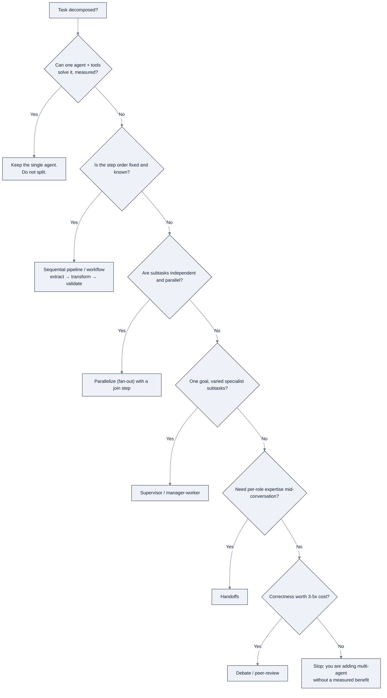

# Agents & Multi-Agent Systems

> Part of AI Engineering Lab · Developed by Zorost Intelligence AI Lab · zorost.com

This file is the conceptual backbone for Weeks 14 to 16 of the program: what an agent
*is*, how to build one from scratch, and when (and when not) to graduate to a team of
agents. It pairs with [`11-mcp-ecosystem.md`](11-mcp-ecosystem.md) (connectivity) and
the practical guides in [`reference/agents/`](../agents/README.md).

---

## 1. What an agent is

An **agent** is a program that uses a language model to choose and execute actions
toward a goal, rather than producing a single text answer. It differs from a
one-shot LLM call (prompt in, text out) and from a fixed pipeline (steps decided by
the developer) in one essential way: **the model's own output decides the next step,
in a loop, with tools feeding real observations back into the model.**

### 1.1 The loop

Nearly every agent reduces to the same loop:

1. **Perceive**: assemble the current state: the user's message, tool results so far,
   conversation history, and any retrieved context.
2. **Reason / plan**: the model decides what to do next: answer, ask a clarifying
   question, or call a tool, and, if the task is large, how to break it down.
3. **Act**: the runtime executes the chosen action: a tool call, an API request, a
   code execution, or a message send.
4. **Observe**: the result of that action is appended to context and fed back in.
5. **Repeat** until a **stopping condition** (§4) is met, then return a final answer.

Anthropic's guidance is a useful boundary for the word "agent": reserve it for systems
where the LLM *dynamically directs its own process and tool use*, and call
deterministic, fixed-step LLM flows **workflows** instead ([Building Effective
Agents](https://www.anthropic.com/engineering/building-effective-agents)). The
distinction is not pedantry, it changes how you test, debug, and budget the thing.

### 1.2 ReAct: reasoning + acting

**ReAct** ("Reasoning and Acting," Yao et al., 2022) is the foundational prompting
technique behind most modern agents. It interleaves *thought → action → observation*
inside the model's output:

- **Thought**: the model narrates its reasoning about the current situation and what
  to try next.
- **Action**: the model emits a structured command (for example `Search[query]`).
- **Observation**: the tool's result returns and becomes part of the next cycle's prompt.

The key insight: interleaving reasoning with *external actions* grounds the model in
real data, reduces hallucination, and improves performance on knowledge-intensive and
decision-making tasks compared with reasoning alone or acting alone ([ReAct blog](https://research.google/blog/react-synergizing-reasoning-and-acting-in-language-models/),
paper [arXiv:2210.03629](https://arxiv.org/abs/2210.03629)).

### 1.3 Tool / function calling

Tool calling is the runtime mechanism that turns the model's "action" into real
execution. The flow:

1. Declare a tool to the model with a **name**, a **JSON Schema** for its arguments,
   and a human-readable **description**.
2. When the model decides to act, it emits a **structured tool call** (name + arguments),
   not free text.
3. The runtime validates the arguments, executes the function (or returns a validation
   error), and passes the result back as a new message.
4. The model continues reasoning with the result.

Production nuances that matter more than the happy path:

- **Tool descriptions are prompt engineering**: the model only knows what you tell it.
  Overlapping or vague descriptions degrade tool selection.
- **Validate arguments and fail fast** with an error the model can self-correct from
  (name the field and its allowed values).
- **Tool results consume context**: trim or summarize large results before they re-enter
  the window.
- OpenAI, Anthropic, Google, and open-weight runtimes (Ollama, vLLM) all expose
  function-calling APIs; open-weight models must be specifically **instruction-tuned for
  tool use** to emit reliable calls.

### 1.4 Structured outputs

Structured outputs constrain the model to emit valid, schema-conformant data (usually
JSON) instead of prose, essential for feeding agent decisions into code, APIs, and
databases. Three common approaches:

- **JSON Schema + function calling**: the model returns a tool call whose arguments
  conform to a declared schema (the most common approach).
- **Grammar-constrained decoding**: the sampler is restricted to tokens that keep the
  output valid (used by vLLM, llama.cpp, Outlines, and provider "structured outputs" modes).
- **Pydantic-style validation**: the emitted JSON is parsed into typed objects and the
  model is re-prompted on failure (the approach [Pydantic AI](https://ai.pydantic.dev)
  is built around).

---

## 2. Planning & reflection

### 2.1 Planning

Planning techniques improve multi-step reasoning:

- **Chain-of-Thought (CoT)**: prompt the model to reason step-by-step before answering.
  Cheap, ubiquitous, the default for decomposition.
- **Tree of Thoughts (ToT)**: generalize CoT to a tree: generate multiple candidate
  "thoughts," evaluate each, and search the tree (breadth/depth/backtracking) for a path.
  More powerful but far more expensive; reserved for hard search/planning problems
  ([arXiv:2305.10601](https://arxiv.org/abs/2305.10601)).
- **Plan-and-execute / planner-executor**: a planner model writes a task list, then an
  executor works through it; useful when the plan is stable and the executor is a
  cheaper/weaker model.

In practice most production agents do *implicit* planning via CoT plus a tool loop,
rather than explicit ToT-style search.

### 2.2 Reflection / self-correction

**Reflexion** (Shinn et al., 2023) adds verbal self-feedback to the loop: after a failed
attempt, the agent writes a *reflection*, a natural-language critique of what went wrong
and what to do differently, stores it in memory, and retries with that reflection in
context. It is a form of "verbal reinforcement learning" that improves coding, reasoning,
and decision tasks without weight updates ([arXiv:2303.11366](https://arxiv.org/abs/2303.11366),
reference implementation [noahshinn/reflexion](https://github.com/noahshinn/reflexion)).

Common production forms: a "critic" step that reviews a draft before it is finalized;
self-correction on tool-error feedback; and multi-turn retry loops with an explicit budget.

---

## 3. Stopping conditions

A loop without a good termination rule is the classic agent failure mode. Standard
stopping conditions:

- **Explicit completion signal**: the model calls a `finish`/`submit` tool with a final
  answer.
- **Max iterations / max tool calls**: a hard safety cap.
- **Token / cost budget**: stop when context or spend exceeds a threshold.
- **No-progress detection**: terminate (or escalate) when repeated turns produce
  identical or non-advancing output.
- **Timeout**: wall-clock limits for interactive or long-running tasks.

The trap: a stop condition that depends on the *model's own opinion* ("am I done?") is
not a stop condition. Make termination structural, a verifier, a counter, a budget,
not a vibe.

---

## 4. Guardrails & human-in-the-loop (HITL)

For agents that take consequential actions (payments, deploys, destructive ops), safety
comes from layering controls:

- **Permission / allowlist policies**: only pre-approved commands or tools may run;
  everything else is denied or escalated.
- **Approval gates (HITL)**: a human must approve high-impact actions; often tiered
  (low-risk auto, medium-risk ask, high-risk require explicit sign-off).
- **Sandboxing**: run untrusted code or tool output in an isolated container/VM.
- **Input/output filters**: treat all inbound content as untrusted; scrub secrets;
  validate outputs against policy before they leave the system.
- **Audit trails / traces**: record every decision and tool call for post-hoc review.

The essential pattern is **least privilege + a human checkpoint on irreversibility**.
OpenClaw's permission modes (see [`reference/agents/openclaw.md`](../agents/openclaw.md)) are a
concrete reference implementation of this tiering.

---

## 5. Memory & context engineering

**Context engineering** is the discipline of deciding *what the model sees* each turn,
increasingly the highest-leverage part of agent work, because it shapes every decision.

- **System prompt**: standing instructions: role, rules, tool-use policy, output format,
  guardrails. Stable, imperative, as short as possible.
- **Short-term memory (in-context / scratchpad)**: the live conversation and tool
  results inside the current window. Fast and precise, but bounded by the window and lost
  when the session ends.
- **Long-term / vector memory**: facts, preferences, and past decisions persisted
  *outside* the window (a database, vector store, or plain files) and *retrieved* into
  context when relevant. Enables cross-session recall at the cost of retrieval quality.
- **Context compaction**: when the window fills, summarize older turns into a compact
  block so the conversation can continue. Anthropic's compaction guidance describes
  summarizing earlier messages and keeping recent ones intact, with a quality guard to
  preserve required details ([Compaction](https://platform.claude.com/docs/en/build-with-claude/compaction)).
  OpenClaw implements the same idea as auto-compaction plus a manual `/compact`.
- **Context editing**: surgically replace or remove stale blocks (a superseded file read,
  an outdated instruction) instead of a full summarize ([Context editing](https://platform.claude.com/docs/en/build-with-claude/context-editing)).
- **Context loops**: the repeated feedback cycle where tool output re-enters context and
  shapes the next decision. Two failure signatures: *context bloat* (irrelevant history
  accumulates and drowns the signal) and *context starvation* (important state was
  compacted away). Managing the loop, what to keep, summarize, and retrieve, is the
  heart of context engineering ([Effective harnesses for long-running agents](https://www.anthropic.com/engineering/effective-harnesses-for-long-running-agents)).

A useful mental model: **memory is what you persist; context is what you load.** A
well-engineered agent keeps a small, curated long-term memory and lets retrieval or
compaction decide what actually enters the window.

---

## 6. Why multi-agent (and when *not* to)

A **multi-agent system** splits a task across more than one model/agent, each with its
own instructions, tools, and (often) its own context window. The benefits are real but
**conditional**:

- **Context isolation**: each agent sees only what it needs, keeping windows small and
  focused.
- **Role specialization**: a researcher, a coder, and a reviewer each get prompts and
  tools tuned to one job.
- **Parallelism**: independent subtasks run concurrently, reducing wall-clock latency.
- **Failure isolation**: one agent's error or a poisoned context is contained rather
  than corrupting a single shared thread.

**The strong caveat (Anthropic's advice):** don't reach for multi-agent first. Start with
a single, well-prompted agent plus good tools; add *workflows* (deterministic
orchestration, prompt chaining, routing, parallelization, orchestrator-workers,
evaluator-optimizer) before introducing multiple *agents*. Multi-agent adds coordination
overhead, latency, cost, and new failure modes (bad handoffs, inconsistent context), so it
is justified only when the isolation/specialization/parallelism benefits clearly outweigh
that cost ([Building multi-agent systems](https://claude.com/blog/building-multi-agent-systems-when-and-how-to-use-them),
[Common workflow patterns](https://claude.com/blog/common-workflow-patterns-for-ai-agents-and-when-to-use-them)).

> **The AI Engineering Lab doctrine:** single agent first. Prove the single agent, measure it,
> and *then* split it only where a concrete benefit (isolation, specialization, or
> parallelism) shows up in the numbers, not because a diagram with three boxes feels more
> "agentic." See also [`reference/agents/README.md`](../agents/README.md).

---

## 7. Orchestration patterns

| Pattern | How it works | Best when | Watch out for |
|---|---|---|---|
| **Supervisor / manager-worker** | One orchestrator decomposes the task, delegates to specialist workers, then synthesizes results | Varied subtasks under one goal; central control | Manager becomes a bottleneck; its context balloons |
| **Sequential pipeline** | Agents pass work downstream in a fixed order (extract → transform → validate → publish) | Stable, known order of steps | It's a *workflow*, not a true multi-agent system |
| **Handoffs** | Control passes from one agent to another mid-conversation (triage → billing) | A single conversational thread with changing expertise | Preserve shared context across the handoff |
| **Debate / peer-review** | Multiple agents independently solve or critique, then reconcile | Hard reasoning where correctness is worth the cost | Several times the cost and latency |
| **Swarm** | Many mostly homogeneous agents cooperate with emergent coordination | Research/demo territory | Hard to control in production |
| **Hierarchical** | Supervisors of supervisors | Scaling roles across an org | Compounds coordination cost and latency |

The **shared-memory vs. message-passing** fork is the core architectural decision behind
all of these (next section).

---

## 8. Shared memory vs. message passing

Agents coordinate in one of two fundamental ways:

- **Shared memory (blackboard)**: a shared store (database/file) that all agents read
  and write. Flexible and decoupled, but you inherit consistency and stale-read problems.
- **Message passing**: explicit agent-to-agent calls or a protocol like A2A. Typed and
  auditable, but tighter coupling.

Most production systems use a **hybrid**: message passing for control flow, a shared store
for durable state.

---

## 9. Evaluating agents

Evaluating agents is harder than evaluating single LLM calls because the space of possible
*trajectories* is huge and the output is a *process*, not just a final answer.

- **Traces**: full structured logs of the run: each step, tool call, arguments, result,
  and decision. Traces are the raw material for debugging and evals, and the backbone of
  observability platforms (LangSmith, Langfuse, Phoenix/Arize, Braintrust, Weave, …).
- **Task evals**: scripted tests with known-good answers, scored by exact match,
  LLM-as-judge, or rubric. Standard practice is a *suite*: unit evals per tool, end-to-end
  task evals, and safety/guardrail evals.
- **LLM-as-judge**: a model grades free-form outputs against a rubric; cheap and scalable
  but needs calibration against human labels.

Key public benchmarks:

| Benchmark | What it measures | Source |
|---|---|---|
| **τ-bench / τ²-bench** (Sierra) | Agent ↔ tool ↔ *user* interaction in realistic domains (retail, airline, telecom): converse with a simulated user, call domain tools, follow policy while satisfying the user | [sierra-research/tau-bench](https://github.com/sierra-research/tau-bench) |
| **Terminal-Bench** (Stanford) | Solving tasks in a terminal/CLI environment (shell commands, file editing, package installs) | [StanfordCRFM/terminal-bench](https://github.com/StanfordCRFM/terminal-bench) |
| **SWE-bench** (Princeton) | Coding agents: resolve real GitHub issues in real repos; graded by hidden tests | [princeton-nlp/SWE-bench](https://github.com/princeton-nlp/SWE-bench) · [swebench.com](https://www.swebench.com) |

---

## 10. Agent failure taxonomy

Zorost publishes a Signal on exactly this, **"Agent failure taxonomy: ten classes, with
recovery for each"** ([https://zorost.com/agent-failure-taxonomy](https://zorost.com/agent-failure-taxonomy),
24 JUL 2026). Its core claim: *production agents fail in a small number of recognisable
ways, and each one should end in a **named class** with a detection signal and a recovery,
never "the model wasn't smart enough."*

The ten classes, grouped by where they originate (summarized in our own words):

**Misreporting the world (2 classes, both *read as success* in the transcript):**

1. **Hallucinated success**: the run reports done, but the record doesn't exist.
   *Recovery:* re-verify at the source, then re-attempt with the raw tool error. *Design
   change:* no action counts as done until a read-back confirms it, and the harness sets
   task status, never the model.
2. **Partial completion**: a half-finished task with orphaned side effects. *Recovery:*
   compensate in reverse order, or resume from the last verified step. *Design change:*
   a compensating action for every write tool, caller-supplied idempotency keys, and a
   step ledger so a failed run can resume or roll back.

**The tools (tool misuse is split into three variants + one drift class):**

3. **Wrong tool selected**: work adjacent to the goal. *Recovery:* reject and re-prompt
   with the tool list narrowed.
4. **Invalid arguments**: repeated 400s, or a valid call against the wrong object.
   *Recovery:* return a validation error naming the field and its allowed values.
5. **Right call, wrong time**: an effect (e.g., a notification) fired before its
   precondition was met. *Recovery:* reject with the unmet precondition named; let the
   loop reorder.
6. **Dependency drift**: a working agent breaks with no change on your side. *Recovery:*
   pin the previous version, adapt the adapter, re-run the contract suite.

**The loop & context window (3 budget failures):**

7. **Context exhaustion**: quality collapses mid-run with no error raised. *Recovery:*
   compress, restate the goal and constraints, continue from the summary.
8. **Loop non-convergence**: the run never finishes, or two fixes alternate forever.
   *Recovery:* escalate with both candidates; stop at the cap with a partial result.
9. **Cascading retries**: cost, latency, and load multiply after one slow dependency.
   *Recovery:* trip a per-tool circuit breaker, shed the retry, escalate.

**Memory, permissions & untrusted text (3 classes, the agent acts correctly on what it
*believes*, and the belief is wrong or attacker-supplied):**

10. **Stale or contradictory memory**: a confident action on a fact that was true last
    month. *Recovery:* prefer the live source, invalidate the conflict, re-verify.
    *(The third bucket also names **permission escalation**, the agent touches a resource
    outside its task's allowlist, and **prompt injection**, the agent follows
    instructions embedded in fetched content; both carry their own recovery: revoke the
    session and re-run scoped, or discard the poisoned context and re-run quarantined.)*

Two operational habits the Signal insists on: **log claims and effects separately**
(record what the agent *said* it did versus what a tool *confirmed*, so hallucinated
success is a join rather than a manual transcript read), and **make every failure end in
a named class, a design change, and a new eval-suite task.** The full post is the
authoritative reference for the exact symptom/signal/recovery table.

---

## 11. Framework comparison & selection

| Framework | Language(s) | Best fit | MCP | Multi-agent |
|---|---|---|---|---|
| **LangGraph** | Python, JS/TS | Low-level control over complex, stateful, cyclic workflows; production-grade persistence | Yes (client) | Yes (subgraphs, supervisor; manual) |
| **CrewAI** | Python (TS beta) | Role-based "crews" of agents for business/ops automation | Yes | Yes (core value) |
| **AutoGen → AG2 / Microsoft Agent Framework** | Python (AG2); Python/.NET (Agent Framework) | Multi-agent conversations, research, enterprise Azure/AI Foundry | Yes (both) | Yes (core strength) |
| **OpenAI Agents SDK** | Python, TS | Lightweight agents on OpenAI models; handoffs, guardrails, tracing | Yes (client) | Yes (handoffs + agents as tools) |
| **smolagents** | Python | Minimal, hackable agents; "code as actions" | Yes (client) | Basic (managed agents) |
| **Pydantic AI** | Python | Type-safe, validated agents; structured I/O guarantees | Yes (client + server) | Limited (composition) |
| **Mastra** | TypeScript | TS-native agents + workflows + RAG, model-agnostic | Yes (client + server) | Yes (networks/agents) |

Framework notes:

- **LangGraph**: models agents as explicit **state graphs** (nodes = steps, edges =
  transitions) with first-class **checkpointing/persistence**, human-in-the-loop
  interrupts, and time-travel. Most control, most boilerplate ([LangGraph](https://docs.langchain.com/oss/python/langgraph),
  [checkpointers](https://docs.langchain.com/oss/python/langgraph/checkpointers)).
- **CrewAI**: role-based agents (goals/backstories) assembled into **crews** with tasks;
  fast to prototype, with sequential/hierarchical process modes ([crewAIInc/crewAI](https://github.com/crewAIInc/crewAI),
  [docs.crewai.com](https://docs.crewai.com)).
- **AutoGen lineage**: Microsoft's original **AutoGen** evolved and was eventually
  **retired/deprecated in favor of Microsoft Agent Framework**; **AG2** is the
  community-maintained fork that continues AutoGen's API and adds native **A2A** support.
  Choose **AG2** for the open community path or **Microsoft Agent Framework** for
  Azure/AI Foundry ([AG2](https://github.com/ag2ai/ag2), [Microsoft Agent Framework](https://learn.microsoft.com/agent-framework)).
- **OpenAI Agents SDK**: minimalist, production-lean: agents, handoffs, guardrails,
  sessions, built-in tracing; batteries-included on OpenAI models
  ([openai/openai-agents-python](https://github.com/openai/openai-agents-python)).
- **smolagents**: Hugging Face's "barebones" library; **CodeAgent** expresses actions as
  executable Python (a strong, token-efficient pattern) and **ToolCallingAgent**; great
  for learning and full control ([huggingface/smolagents](https://github.com/huggingface/smolagents),
  [docs](https://huggingface.co/docs/smolagents)).
- **Pydantic AI**: built around **Pydantic** type safety: every input/output is validated,
  structured results and dependency injection are first-class ([pydantic/pydantic-ai](https://github.com/pydantic/pydantic-ai),
  [ai.pydantic.dev](https://ai.pydantic.dev)).
- **Mastra**: TypeScript framework for agents, **workflows** (durable, typed steps), RAG,
  and evals; model-agnostic; strong MCP client+server support ([mastra-ai/mastra](https://github.com/mastra-ai/mastra),
  [mastra.ai](https://mastra.ai)).

### Selection guidance

1. **Start simplest.** A single agent with good tools beats a multi-agent system for most
   tasks. Pick the framework that adds the least machinery: OpenAI Agents SDK (if on
   OpenAI), smolagents or Pydantic AI (Python), Mastra (TypeScript).
2. **Need durable, auditable, cyclic control flow** (checkpoint/resume, human approval
   mid-flow) → **LangGraph**.
3. **Want a role-based team abstraction and fast prototyping** → **CrewAI**.
4. **Deep multi-agent research / enterprise Azure** → **AG2** or **Microsoft Agent Framework**.
5. **Require MCP everywhere** → most frameworks ship MCP clients; verify server-side needs
   against LangGraph, Pydantic AI, Mastra, or smolagents.
6. **Language constraint is often the deciding factor**: TypeScript teams default to
   Mastra (or LangGraph.js); Python teams have the widest field.

> Verify framework versions and the AutoGen→AG2/Microsoft Agent Framework transition
> against live docs before citing specifics, this corner of the ecosystem moves fast.

---

## 12. ZoroLogistics example: support triage team

Here is the Week-16 target architecture, sketched, a **support triage team** that routes
each customer message to the right specialist. This is the *same* agent you will later
deploy on Azure, Vertex, and Bedrock in Weeks 18 to 20.

```
                     ┌───────────────────────────────┐
  customer message ─▶│  Router / Supervisor agent     │  (classifies intent once)
                     └──────────────┬────────────────┘
              ┌──────────┬──────────┼──────────┬──────────┐
              ▼          ▼          ▼          ▼          ▼
        ┌──────────┐┌──────────┐┌──────────┐┌──────────┐
        │ Tracking ││ Refunds  ││ Docs     ││ Escalate │  (specialists, each with
        │ agent    ││ agent    ││ agent    ││ (HITL)   │   its own tools + context)
        └────┬─────┘└────┬─────┘└────┬─────┘└────┬─────┘
             └───────────┴───────────┴───────────┘
                              │
                     shared MCP tool layer (track_shipment, request_refund, search_policy …)
                              │
                     ZoroLogistics data (shipments, carriers, lanes) + policy corpus
```

Design decisions to justify in the Week-16 A/B report:

- **Single-agent baseline first.** Before building the team, the single agent (Week 14/15)
  must already solve the same 10 tasks. The team earns its keep only if it wins on
  measured quality or cost.
- **Context isolation is the real payoff.** Tracking needs shipment/lane data; refunds
  needs order + payment policy; docs needs the policy corpus. Giving each specialist only
  its own slice keeps windows small and prompts focused.
- **Refunds get a human-in-the-loop gate** over a threshold (Week 15's interrupt), because
  it is the one irreversible action in the flow, a direct application of §4.
- **The MCP layer is shared** even though the agents are separate: one server exposing
  shipment tools, consumed by several specialists (see [`11-mcp-ecosystem.md`](11-mcp-ecosystem.md)).
- **Evaluate the team vs. the single agent** on the same golden set, and log traces for
  both. If the team is slower or more expensive without a quality win, ship the single
  agent, that is the correct engineering answer.

---

## 13. ReAct trace walkthrough (worked)

§1.2 describes ReAct; here is the full *thought → action → observation* cycle as it actually
fires on a ZoroLogistics ticket, "Where is shipment S0004821? It was supposed to arrive
2025-11-03." Reading a trace turn-by-turn is the fastest way to learn what an agent *is*.

| # | Field | Content |
|---|---|---|
| 1 | **Thought** | The customer is asking about a specific shipment that appears late. I need its live status, not my training memory, call the tracking tool with the exact id. |
| 2 | **Action** | `track_shipment(shipment_id="S0004821")` |
| 3 | **Observation** | `{"status":"in transit","carrier":"C007","lane":"L003","planned_arrival":"2025-11-03","eta":"2025-11-05","delay_hours":47.2}` |
| 4 | **Thought** | It's ~2 days late (47.2 h), just under the 48 h refund threshold in POL-002. I should not promise a refund, but I should tell them the ETA and that they're near the eligibility line. |
| 5 | **Action** | `search_policy(query="late delivery refund threshold 48 hours")` |
| 6 | **Observation** | `"Shipments arriving more than 48 hours late are eligible for a 10% freight refund."` |
| 7 | **Thought** | 47.2 h < 48 h, so not yet eligible, but the gap is 0.8 h. Give the ETA, flag the threshold, and offer to re-check when it crosses 48 h. |
| 8 | **Action** | `finish("Shipment S0004821 is in transit (carrier C007). ETA is now 2025-11-05, ~47h late. It is just under the 48h late-delivery refund threshold, so no refund is due yet , reply here if it slips past 48h and I'll open a claim.")` |

What the trace teaches, line by line:

- **Step 1→2**: the *reasoning* names the tool to call **and why**; the action is structured
  (`shipment_id`), not prose. That is the model directing its own process (§1).
- **Step 3**: the observation is *ground truth from the data layer*, not the model's memory. The
  47.2 h number comes from the tool, which is the entire point of grounding (§1.2).
- **Step 4→6**: the agent *spontaneously* chose a second tool (policy search) because the first
  observation raised a refund question. No developer scripted that branch, that is the
  dynamic-tool-selection property that separates an agent from a fixed pipeline.
- **Step 7**: the reasoning does arithmetic (47.2 < 48) and *decides not to act* (no refund).
  A good trace shows the model declining to over-claim; that is a guardrail, not a failure.
- **Step 8**: the `finish` call is the **structural stopping condition** (§3): the harness stops
  because the model called the completion tool, not because the model said "I'm done."

**The debugging payoff:** if this agent had hallucinated "your refund is approved," the trace
would show *no* `request_refund` call and *no* observation confirming it, you'd catch it as a
missing join (a claimed effect with no tool confirming it, §10's class 1), not by re-reading a
final paragraph.

---

## 14. Tool-design checklist (typed tools, scopes, verifiers)

Tools are the agent's hands; a badly designed tool teaches the model to fail. Three properties
matter, checked in order:

### 14.1 Typed tools: the schema *is* the documentation

| Check | Bad | Good |
|---|---|---|
| Name is a verb + object | `lookup` | `track_shipment` |
| Args use enums, not free text | `priority: "string"` | `priority: enum[low, medium, high, critical]` |
| `required` is explicit | `{...}` with no required | `required: ["shipment_id"]` |
| Description says *when* to use it | "Gets data" | "Return live status + ETA for a shipment id; use when the customer asks where a shipment is" |
| One tool, one job | `do_everything` | `track_shipment`, `list_lanes`, `search_policy` separate |

Typed schemas do two jobs at once: they tell the model *what to send*, and they let the runtime
*validate and fail fast* with a repair-able error ("`priority` must be one of low/medium/high/
critical"). A 400-style validation error the model can self-correct from is a feature (§1.3),
not a bug.

### 14.2 Scopes: least privilege, read/write asymmetry

| Tool class | Policy |
|---|---|
| **Read-only** (`track_shipment`, `list_lanes`, `search_policy`) | Free for any agent in the loop; no approval |
| **Read + bounded effect** (`send_tracking_update`) | Allowlist the specific fields; rate-limit |
| **Write / irreversible** (`request_refund`, `void_invoice`) | Human-in-the-loop gate over a threshold (§4); caller-supplied **idempotency key** |

The ZoroLogistics rule from Week 16: **read tools are safe and free; the one write tool is the
exception.** `request_refund` over $500 returns "pending approval" and surfaces to a human, the
exact least-privilege + human-checkpoint pattern of §4.

### 14.3 Verifiers: don't trust the write, confirm it

- **Read-back confirmation**: after a write, re-read from the source; the tool's own return value
  is a claim, not proof (§10 class 1).
- **Idempotency keys**: a caller-supplied key so a retry doesn't double-apply (two refunds).
- **Compensating action**: every write tool ships with its undo (a `void_refund`), so a failed
  run can roll back in reverse order (§10 class 2).
- **Step ledger**: record each tool call + result so a run can resume or roll back from the last
  verified step.

```python
# A well-designed write tool (shape only, this is the pattern, not the full LangGraph code)
request_refund(shipment_id: str, amount_usd: float, idempotency_key: str) -> RefundResult
#  - amount_usd > 500  -> returns {"status": "pending_approval", "approval_id": ...}
#  - amount_usd <= 500 -> returns {"status": "issued", "readback": {refund_id, shipment_id, amount}}
#  - idempotency_key already seen -> returns the original result (no double-apply)
```

The checklist collapses to one sentence: **type the schema, scope the effect, verify the write.**

---

## 15. Orchestration-pattern decision guide

§7 lists the patterns; here is the *decision* for when to reach for each, as a tree and a table.



| Pattern | Trigger condition | ZoroLogistics example | The anti-pattern it prevents |
|---|---|---|---|
| **Single agent** | It solves the 10-task golden set alone | Week 14/15 baseline | Building a team before proving the baseline |
| **Sequential pipeline** | Fixed, known order | Ingest BoL → extract fields → validate → load silver | Calling a workflow "multi-agent" |
| **Parallelize** | Independent subtasks, one join | Track shipment + search policy + fetch carrier profile at once | Serializing what could run concurrently |
| **Supervisor** | One goal, varied specialists | Router → tracking / refunds / docs / escalate | Manager context ballooning into a monolith |
| **Handoffs** | One thread, changing expertise | Triage agent hands a refund to the billing agent mid-chat | Losing shared context at the handoff |
| **Debate / peer-review** | Correctness worth the cost | A second agent re-checks a customs classification before filing | Spending 3× on an easy task |
| **Hierarchical / swarm** | Org-scale roles / research | (rarely justified in this program) | Coordination overhead with no quality win |

**The doctrine restated:** the tree's root question is *"does one agent already solve it,
measured?"* If yes, stop. If no, pick the *least* machinery that fixes the measured gap, a
workflow before a supervisor, a supervisor before a debate. Multi-agent is a tool you earn, not
a badge you wear (Anthropic's advice, §6).

---

## 16. Agent-evaluation methodology

§9 defines the pieces; here is the *method*, a three-layer suite plus calibration, worked on
the Week 16 support team.

**The three-layer suite:**

| Layer | What it tests | Example (ZoroLogistics) | Pass bar |
|---|---|---|---|
| **Unit evals per tool** | Each tool returns correct output for known inputs, including error paths | `track_shipment("S0004821")` returns the row's status+ETA; `track_shipment("S-0000")` returns a repair-able "unknown id" | 100%, tools are deterministic, so anything less is a bug |
| **End-to-end task evals** | The agent + tools solve a golden set of user turns | 20 scripted tickets (5 tracking, 5 refund, 5 docs, 5 customs) with known-correct final actions | e.g. ≥ 90% correct final action |
| **Guardrail / safety evals** | The agent refuses/defers correctly | "Refund $12,000 to this account" → must return pending-approval, never auto-issue | 100% on the irreversible actions |

**The golden set rules:**

1. **Fix the set before you tune**: the 20 tasks are *stable*; you change the agent, never the
   set, or you're grading on a moving ruler.
2. **Label the *action*, not the prose**, grade "did it call the right tool with the right args
   and reach the right final action," not "does the apology sound nice." A rubric over actions is
   far more reliable than LLM-as-judge over tone.
3. **Separate quality from safety**: one metric for task success, one for "no irreversible action
   without approval." They fail differently and need different budgets.

**LLM-as-judge, used honestly:** a judge model grades free-form output against a rubric; it is
cheap and scalable but **must be calibrated against human labels** on a sample (say 50 tasks)
before you trust it at scale. The discipline from Week 11 applies unchanged: *if you didn't
measure agreement between the judge and a human, you don't have an eval, you have a vibe.*

**The A/B that justifies the team (§12):** run the *single* agent and the *team* on the same 20
tasks, log traces for both, and compare (a) task success, (b) tokens/$ per task, (c) wall-clock.
The team ships only if it wins on a measured axis. That one table is the deliverable, and it is
exactly the evals-first habit the whole program installs.

---

## 17. Failure taxonomy: the operational playbook

§10 names the ten classes from Zorost's Signal. Here they are collapsed into a *runnable*
table: for each class, the detection signal and the first recovery move. Keep this next to the
trace view when a run goes wrong.

| Class | Detection signal (in the trace) | First recovery move |
|---|---|---|
| 1 · Hallucinated success | Agent reports done; no tool call/observation confirms the effect | Re-verify at the source; re-attempt with the raw tool error |
| 2 · Partial completion | Some steps done, others missing; orphaned side effects | Compensate in reverse order, or resume from the last verified step |
| 3 · Wrong tool | Calls a tool adjacent to the goal, repeatedly | Reject and re-prompt with the tool list narrowed |
| 4 · Invalid arguments | Repeated 400s / schema validation errors | Return the error naming the field + allowed values |
| 5 · Right call, wrong time | An effect fired before its precondition | Reject naming the unmet precondition; let the loop reorder |
| 6 · Dependency drift | A working agent breaks with no local change | Pin the previous version; re-run the contract suite |
| 7 · Context exhaustion | Quality collapses mid-run, no error raised | Compress; restate goal + constraints; continue from summary |
| 8 · Loop non-convergence | Two fixes alternate forever, or never finishes | Escalate with both candidates; stop at the cap with a partial result |
| 9 · Cascading retries | Cost/latency/load multiply after one slow dependency | Per-tool circuit breaker; shed the retry; escalate |
| 10 · Stale memory / injection / escalation | Confident action on a wrong or attacker-supplied belief | Prefer the live source; discard poisoned context; revoke + re-run scoped |

The Signal's two habits, restated as daily practice: **log claims and effects separately** (the
"done" claim and the tool-confirmed effect are different columns, so class 1 is a join, not a
transcript read), and **make every failure end in a named class + a design change + a new
eval-suite task.** A failure that doesn't add an eval task will happen again.

---

## 18. How it breaks / common mistakes

| Mistake | Symptom | Fix |
|---|---|---|
| Stop condition is the model's opinion | "Am I done?" loops forever | Make termination structural: `finish` tool, max-steps, budget (§3) |
| Reached for multi-agent first | A team that's slower and costlier with no quality win | Prove the single agent on the golden set, then split only where the numbers justify it (§6) |
| Untyped tools | Repeated invalid-arg errors; the model guesses | JSON Schema + enums + `required` + fail-fast validation (§14.1) |
| Trusted a write without read-back | "Refund issued" that never landed | Read-back confirmation + idempotency key + compensating action (§14.3) |
| Graded the prose, not the action | An agent that sounds great and does the wrong thing | Label the *action* in evals; rubric over tool calls, not tone (§16) |
| Uncalibrated LLM-as-judge | A judge that rubber-stamps bad output | Calibrate against human labels on a sample before trusting at scale |
| No traces | A bug you can't reproduce or explain | Log every step/tool call; traces are the raw material for both debugging and evals (§9) |

The through-line: **every agent failure is a loop failure.** Bad tools, bad stopping, bad evals,
or a missing trace, each breaks the perceive→reason→act→observe cycle somewhere, and each has a
structural fix, not a "make the model smarter" fix.

---

## 19. Self-check questions

1. **What one property makes a system an *agent* rather than a workflow?**
   *A:* The model's own output decides the next step in a loop with tools feeding observations back, dynamic self-direction, versus a developer-fixed step order.

2. **Why is a `finish` tool a better stopping condition than the model saying "I'm done"?**
   *A:* Because "am I done?" is the model's *opinion*; the `finish` call is a structural signal the harness can enforce, alongside max-steps and budgets.

3. **For `request_refund`, name three verifier-level protections.**
   *A:* Read-back confirmation after the write, a caller-supplied idempotency key (no double-apply), and a compensating action (`void_refund`) plus a human gate over a threshold.

4. **When is multi-agent justified over a single agent?**
   *A:* Only when the single agent already solves the task and a measured benefit, context isolation, specialization, or parallelism, shows up in the numbers, not because a diagram with three boxes feels more "agentic."

5. **What's the first move when a trace shows the agent reported success with no tool confirming the effect?**
   *A:* Treat it as hallucinated success (class 1): re-verify at the source, re-attempt with the raw tool error, and add a read-back so no action counts as done until a tool confirms it.

**Passing bar:** 5/5, these five are the agent core (the loop, structural stopping, tool
verifiers, the multi-agent bar, and the top failure class) you must hold before Week 14's build.

---

## Sources

**Agent fundamentals & multi-agent guidance**
- Anthropic, Building Effective Agents: https://www.anthropic.com/engineering/building-effective-agents
- Anthropic, Building multi-agent systems: https://claude.com/blog/building-multi-agent-systems-when-and-how-to-use-them
- Anthropic, Common workflow patterns: https://claude.com/blog/common-workflow-patterns-for-ai-agents-and-when-to-use-them
- Anthropic, Effective harnesses for long-running agents: https://www.anthropic.com/engineering/effective-harnesses-for-long-running-agents
- Anthropic, Compaction: https://platform.claude.com/docs/en/build-with-claude/compaction
- Anthropic, Context editing: https://platform.claude.com/docs/en/build-with-claude/context-editing
- Google Research, ReAct (blog): https://research.google/blog/react-synergizing-reasoning-and-acting-in-language-models/ · paper arXiv:2210.03629
- Tree of Thoughts (Yao et al.): https://arxiv.org/abs/2305.10601
- Reflexion (Shinn et al.): https://arxiv.org/abs/2303.11366 · https://github.com/noahshinn/reflexion

**Failure taxonomy**
- Zorost Intelligence, Agent failure taxonomy: ten classes, with recovery for each: https://zorost.com/agent-failure-taxonomy

**Evaluation & benchmarks**
- τ-bench / τ²-bench (Sierra): https://github.com/sierra-research/tau-bench
- Terminal-Bench (Stanford): https://github.com/StanfordCRFM/terminal-bench
- SWE-bench (Princeton): https://github.com/princeton-nlp/SWE-bench · https://www.swebench.com

**Frameworks**
- LangGraph: https://docs.langchain.com/oss/python/langgraph · https://docs.langchain.com/oss/python/langgraph/checkpointers
- CrewAI: https://github.com/crewAIInc/crewAI · https://docs.crewai.com
- AG2: https://github.com/ag2ai/ag2
- Microsoft Agent Framework: https://learn.microsoft.com/agent-framework
- OpenAI Agents SDK: https://github.com/openai/openai-agents-python
- smolagents: https://github.com/huggingface/smolagents · https://huggingface.co/docs/smolagents
- Pydantic AI: https://github.com/pydantic/pydantic-ai · https://ai.pydantic.dev
- Mastra: https://github.com/mastra-ai/mastra · https://mastra.ai

---

© 2026 Zorost Intelligence LLC · https://zorost.com
