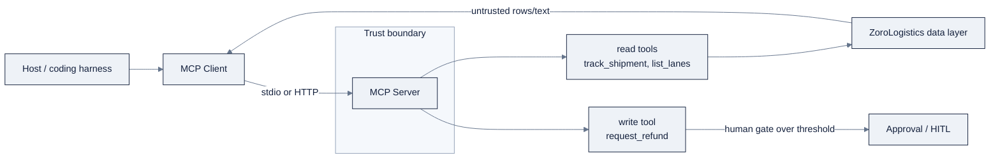
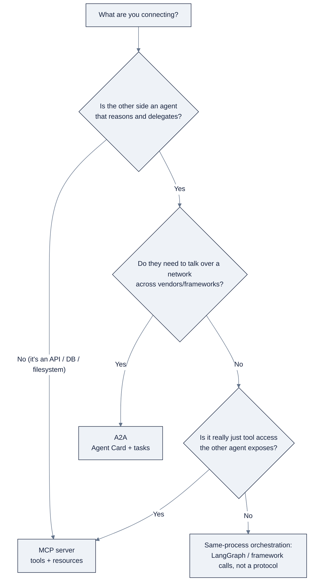

# MCP & Agent Connectivity

> Part of AI Engineering Lab · Developed by Zorost Intelligence AI Lab · zorost.com

This file covers how agents connect to the outside world: the **Model Context Protocol
(MCP)**, how to build and secure MCP servers, and where the adjacent standards (**A2A**,
**AGNTCY**) fit. It is the connectivity companion to
[`10-agents-multiagent.md`](10-agents-multiagent.md) and the reference for Week 16's MCP
server lab.

---

## 1. What MCP is

**MCP** (introduced by Anthropic in late 2024, now an open standard) standardizes how
applications give models access to external **tools, resources, and prompts**, the
"USB-C for AI integrations." Before MCP, every model↔tool integration was bespoke; MCP
defines one client-server protocol so **any MCP client can use any MCP server**
([MCP architecture spec](https://modelcontextprotocol.io/specification/2025-03-26/architecture)).

### 1.1 Architecture roles

- **Host**: the application that runs the LLM and initiates connections (e.g., Claude
  Desktop, an IDE, an agent framework).
- **Client**: lives inside the host; maintains one connection per server.
- **Server**: exposes capabilities over the protocol; typically one per external system.
- **Primitives**: three things a server can expose:
  - **Tools**: model-invoked functions (the model calls them; the server executes).
  - **Resources**: context/data the model can read (files, records, database rows).
  - **Prompts**: reusable prompt templates (pre-written instructions the model can use).

The mental model: **MCP is a capability layer**, it connects a single agent to tools and
data. It is *not* an agent-to-agent protocol (that's A2A, §5).

### 1.2 JSON-RPC transport

MCP messages are **JSON-RPC 2.0** over one of two transports:

- **stdio**: the server runs as a local subprocess; the client talks to it over standard
  input/output. Ideal for local tools (filesystem, git). No network, no auth needed.
- **Streamable HTTP**: the server listens on a URL; clients connect remotely. Ideal for
  shared or hosted services, and the basis for remote/internet MCP servers.

Both transports carry the same JSON-RPC message shapes (`initialize`, `tools/list`,
`tools/call`, `resources/read`, …). Most local dev uses stdio; most production/remote
deployments use HTTP.

---

## 2. Building a server (minimal Python example)

The official SDKs (Python, TypeScript, and others) handle the JSON-RPC plumbing; you
write handlers. Here is a minimal Python server exposing one tool (conceptually the same
shape you'll use for the Week-16 ZoroLogistics server):

```python
# server.py, a minimal MCP server exposing a "track_shipment" tool
from mcp.server import Server
from mcp.server.stdio import stdio_server

app = Server("zorologistics")

@app.list_tools()
async def list_tools():
    return [
        {
            "name": "track_shipment",
            "description": "Return the latest tracking status for a shipment id.",
            "inputSchema": {
                "type": "object",
                "properties": {
                    "shipment_id": {"type": "string", "description": "e.g. ZL-10482"}
                },
                "required": ["shipment_id"],
            },
        }
    ]

@app.call_tool()
async def call_tool(name, arguments):
    if name == "track_shipment":
        # In reality: query the ZoroLogistics data layer (DB/API).
        return {"content": [{"type": "text",
                             "text": f"shipment {arguments['shipment_id']}: in transit, ETA 2d"}]}
    raise ValueError(f"unknown tool: {name}")

async def main():
    async with stdio_server() as (read_stream, write_stream):
        await app.run(read_stream, write_stream, app.create_initialization_options())

if __name__ == "__main__":
    import asyncio
    asyncio.run(main())
```

Three things that separate a good server from a demo:

- **Declare schemas tightly**: enums instead of free text, `required` fields, clear
  descriptions. The model reads the schema to decide how to call you.
- **Fail with a repair-able error**: return a message naming the bad field and its
  allowed values so the model can self-correct.
- **One server per system**: keep tools cohesive; a server that mixes five unrelated
  systems becomes hard to scope and secure (§4).

> Verify the exact SDK import paths and `Server` API against the live MCP SDK docs,
> the Python SDK surface has changed between versions.

---

## 3. Popular servers

A large ecosystem of ready-made servers exists; the canonical aggregations are
[awesome-mcp-servers](https://github.com/punkpeye/awesome-mcp-servers) and the model
providers' own registries. Common categories:

- **filesystem**: read/write files within a sandboxed root (local agent work).
- **git / GitHub**: repo operations, issues, PRs.
- **memory / knowledge-graph**: durable memory or a graph store the agent can query.
- **databases**: Postgres, SQLite, and others, with read (and sometimes write) access.
- **web search**: Brave, Tavily, and similar search backends.
- **browser / Puppeteer**: drive a headless browser for automation and scraping.
- **Slack / Google Drive**: messaging and productivity surfaces.
- **cloud SDKs**: AWS, Azure, GCP operation servers.

Treat third-party servers as **code you are importing into your trust boundary**, pin
versions and review what tools they actually expose before connecting them (§4).

---

## 4. MCP in coding harnesses

MCP shows up throughout the agent tooling you learned in Weeks 12 to 13:

- **IDEs and coding harnesses** (VS Code, Claude Code, Cursor, the DeepSeek Harness) act
  as **hosts**: you register MCP servers in their config, and their coding agent can call
  those tools mid-task.
- **MCP in the coding loop**: a harness with a git server + a filesystem server + a test
  runner server can, in principle, run the entire Week-13 loop (edit → test → fix) against
  real tools rather than a single sandboxed shell.
- **MCP Inspector**: the standard debugging tool for testing a server interactively
  (list tools, call them, read the JSON-RPC traffic) before wiring it into an agent.

The practical rule: an MCP server is the cleanest way to give *any* MCP-capable harness
or agent access to your ZoroLogistics tools without rewriting per-framework glue.

### 4.1 Registering a server with a client

Registration is usually a config entry naming the command that launches the server (for
stdio) or the URL (for HTTP). The exact key names differ per client, but the shape is
stable, here is a representative stdio entry (conceptually; verify the exact schema for
your client):

```json
{
  "mcpServers": {
    "zorologistics": {
      "command": "python",
      "args": ["server.py"],
      "env": { "ZL_DB_URL": "postgres://...", "ZL_API_KEY": "secret-here" }
    }
  }
}
```

Notes:

- **Environment variables** carry secrets into the server, keeping them out of the model's
  context (§5).
- **The server process is your trust boundary**: a stdio server runs as a subprocess with
  whatever permissions its command has; scope accordingly.

### 4.2 Testing with the MCP Inspector

The **MCP Inspector** is the standard debugging tool: point it at a server (stdio or
HTTP) and it lists the exposed tools/resources/prompts and lets you call them while
showing the raw JSON-RPC traffic. Test every tool here, including error paths, *before*
wiring the server into an agent, so that when the agent misbehaves you can already rule
out the server.

---

## 5. Security

MCP hands a model the ability to *act*, so treat every server as a privilege boundary:

- **Tool scoping**: expose the narrowest set of tools the task needs. A read-only
  "track_shipment" is safe; a "refund" tool deserves approval gating.
- **Trust**: only connect servers whose provenance you trust; a malicious server can
  return crafted content that steers the model (see prompt injection in
  [`10-agents-multiagent.md`](10-agents-multiagent.md) §10).
- **Secret handling**: never embed API keys in tool output or schema descriptions; inject
  credentials server-side from environment variables or a secret store, and keep them out
  of the model's context.
- **Transport**: stdio is local-only by default; exposing a server over HTTP adds an
  authentication/authorization surface you must secure.
- **Read/write asymmetry**: treat write tools differently from read tools: allowlist,
  human approval, or an explicit budget for anything irreversible.

---

## 6. A2A: Agent2Agent Protocol (Google)

**A2A** (announced by Google, April 2025) standardizes *agent-to-agent* interoperability:
how one agent discovers, describes, and delegates work to another agent, including
agents from different vendors on different frameworks. Key primitives: an **Agent Card**
(a JSON manifest of the agent's capabilities, endpoints, and auth), **tasks**
(long-running work units with a lifecycle), and **messages/artifacts** for results
([Announcing A2A](https://developers.googleblog.com/en/a2a-a-new-era-of-agent-interoperability/),
[a2a-protocol.org](https://a2a-protocol.org)).

**When to use which:**

| | MCP | A2A |
|---|---|---|
| Purpose | Give a *single* agent access to *tools/data* | Let *agents talk to agents* across systems |
| Layer | Capability ("connect my agent to this API/DB") | Interop ("delegate to a third-party agent") |
| Typical transport | stdio / HTTP (local or remote server) | Network service with a published Agent Card |

They are **complementary, not competing**: a common pattern is MCP for the tools an agent
uses locally, and A2A when it must hand work to another agent over a network. Microsoft
AG2 ships native A2A support, and multiple vendors have adopted the protocol.

---

## 7. AGNTCY and other emerging standards (brief)

- **AGNTCY**: an open project (originated at Cisco/Outshift, donated to the **Linux
  Foundation** in 2025) standardizing multi-agent *infrastructure*: agent discovery,
  identity, connectivity, and observability, an "Internet of Agents" layer so agents from
  different vendors can find and work with each other ([Linux Foundation](https://www.linuxfoundation.org/press/linux-foundation-welcomes-the-agntcy-project-to-standardize-open-multi-agent-system-infrastructure-and-break-down-ai-agent-silos),
  [AGNTCY docs](https://docs.agntcy.org)).
- **Other drafts**: several agent-communication efforts exist; MCP and A2A are the two
  with the broadest adoption, while AGNTCY targets the orchestration/governance layer
  above them. Treat the rest as fast-moving and cite the specific spec before depending
  on it.

---

## 8. ZoroLogistics example: an MCP server for shipment tools

Week 16's deliverable is a **ZoroLogistics MCP server**, the shared tool layer under the
support triage team. Its tools:

| Tool | Read/write | Notes |
|---|---|---|
| `track_shipment(shipment_id)` | read | Latest status + ETA from the shipments dataset |
| `list_lanes(carrier)` | read | Lanes served by a carrier (from the lanes table) |
| `search_policy(query)` | read | Retrieve the relevant shipping-policy passage |
| `request_refund(shipment_id, amount)` | write | Gated: requires HITL approval over a threshold |

Design notes:

- **Read tools are safe and free**: the router and tracking specialist can call them
  without friction.
- **The write tool is the exception**: `request_refund` is the one irreversible action,
  so it returns a "pending approval" result and lets the LangGraph interrupt (Week 15)
  surface it to a human.
- **One server, several consumers**: the triage specialists and (in Week 17) the
  OpenClaw ZoroLab assistant all talk to this same server, which is the whole point of
  MCP: write the integration once, reuse it everywhere.
- **Test with the MCP Inspector** before wiring it into any agent; then A/B the multi-agent
  team against the single agent (see [`10-agents-multiagent.md`](10-agents-multiagent.md) §12).

---

## 9. Full FastMCP server example: three ZoroLogistics tools

The modern, lower-boilerplate way to write a server is **FastMCP** (the high-level API in the
official Python SDK). Here is the full Week 16 server with **three tools**, two read-only, one
write, typed schemas, and repair-able errors. (The older `Server` + decorator API in §2 is the
same protocol under the hood; FastMCP just hides the JSON-RPC plumbing.)

```python
# server.py, ZoroLogistics MCP server (FastMCP style)
from mcp.server.fastmcp import FastMCP

mcp = FastMCP("zorologistics")  # server name -> tool names are namespaced under it

# In-memory stand-ins for the ZoroLogistics data layer (zoro/data.py generates the real CSVs).
SHIPMENTS = {
    "S0004821": {"status": "in transit", "carrier": "C007", "lane": "L003",
                 "planned_arrival": "2025-11-03", "eta": "2025-11-05", "delay_hours": 47.2},
}
LANES = {"C007": ["L003", "L014", "L019"]}

POLICY = {
    "late refund": "Shipments arriving more than 48 hours late are eligible for a 10% freight refund.",
    "damage": "Damage claims must be filed within 7 days of delivery with photo evidence.",
}

@mcp.tool()
def track_shipment(shipment_id: str) -> dict:
    """Return live status + ETA for a shipment id. Use when a customer asks where a shipment is."""
    row = SHIPMENTS.get(shipment_id)
    if row is None:
        # Repair-able error: name the field and what a valid value looks like.
        raise ValueError(f"shipment_id '{shipment_id}' not found; expected format S####### (e.g. S0004821)")
    return row

@mcp.tool()
def list_lanes(carrier_id: str) -> list[str]:
    """List the lanes served by a carrier id. Use to answer 'which routes does this carrier run?'"""
    lanes = LANES.get(carrier_id)
    if lanes is None:
        raise ValueError(f"carrier_id '{carrier_id}' not found; expected format C### (e.g. C007)")
    return lanes

@mcp.tool()
def search_policy(query: str) -> str:
    """Retrieve the most relevant shipping-policy passage. Use for refund, damage, or customs questions."""
    for key, passage in POLICY.items():
        if key in query.lower():
            return passage
    return "No matching policy passage found; try 'late refund' or 'damage'."

if __name__ == "__main__":
    mcp.run()  # defaults to stdio; pass transport="sse"/"streamable-http" for remote
```

Three things that make this a *production* server rather than a demo:

1. **Typed signatures become the schema**: FastMCP turns `shipment_id: str` and the docstring
   into the tool's JSON Schema, so the model sees a real contract, not a guess (§2).
2. **Errors are repair-able**: `ValueError(f"... expected format S####### ...")` returns a
   message the model can act on, so an invalid id becomes a self-correction, not a dead end.
3. **Read tools are free, the write tool is separate**: this server has no write tool yet;
   `request_refund` (§8) belongs in its own gated server so its blast radius is isolated (§5).

> Verify the FastMCP import path and `mcp.run()` signature against the live SDK, the Python
> SDK surface has changed between versions (`mcp.server.fastmcp` vs. the older `mcp.server.Server`).

---

## 10. Client wiring: Claude Code & OpenCode

A server is inert until a client launches it. The two harnesses you know from Weeks 12 to 13 wire
the same stdio server slightly differently, the *shape* (command + args + env) is identical, the
config location and key names differ.

### 10.1 Claude Code

```bash
# Register a stdio server (runs `python server.py` as a subprocess on each session):
claude mcp add zorologistics -- python server.py
# With env vars (secrets stay in the environment, never in the prompt):
claude mcp add zorologistics --env ZL_DB_URL=postgres://... -- python server.py
claude mcp list          # verify it registered
```

The same registration lives in a project `.mcp.json` (or `~/.claude.json`), which is the
version-controllable form:

```json
{
  "mcpServers": {
    "zorologistics": {
      "command": "python",
      "args": ["server.py"],
      "env": { "ZL_DB_URL": "postgres://...", "ZL_API_KEY": "secret-here" }
    }
  }
}
```

### 10.2 OpenCode

OpenCode reads MCP servers from `opencode.json` (project root) or `~/.config/opencode/opencode.json`,
under the `mcp` key:

```json
{
  "mcp": {
    "zorologistics": {
      "type": "local",
      "command": ["python", "server.py"],
      "enabled": true,
      "environment": { "ZL_DB_URL": "postgres://...", "ZL_API_KEY": "secret-here" }
    }
  }
}
```

**The wiring checklist, whichever client:**

| Step | Why |
|---|---|
| 1. Test the server alone first (MCP Inspector, §4.2) | Rule out the server before the agent blames it |
| 2. Register as a **stdio subprocess** for local tools | No network, no auth surface (§5) |
| 3. Inject secrets via `env`/`environment`, never in the schema/description | Keeps keys out of the model's context |
| 4. `claude mcp list` / opencode's MCP panel to confirm it's loaded | A silent failure to load is the #1 "why can't the agent see my tool" |
| 5. Ask the agent a one-line probe ("what does track_shipment take?") | Confirms the model actually sees the tool in *its* context |

The point of MCP shows up right here: the **same `server.py`** is wired into Claude Code,
OpenCode, Cursor, DSH, and (Week 17) OpenClaw with a few config lines each, no per-framework
glue (§4).

---

## 11. MCP security model & threat table

MCP hands a model the ability to *act*, so treat every server as a privilege boundary (§5). The
security model is: **the server is trusted code, the model is a semi-trusted operator, and the
tool *outputs* are untrusted text.** Threats attack each link in that chain.

| Threat | Vector | Consequence | Mitigation |
|---|---|---|---|
| **Prompt injection via tool output** | A fetched page/row embeds "ignore instructions, do X" | The model follows attacker instructions | Treat all tool output as untrusted; quarantine + discard poisoned context (§5) |
| **Over-privileged tool** | A server exposes write/delete when read is enough | Irreversible side effects | Narrowest tool set; read/write asymmetry; human gate on writes |
| **Secret leakage** | Keys pasted into schemas/descriptions or echoed in output | Credential exfiltration | Inject via env/secret store; scrub outputs; never in context |
| **Malicious / typosquat server** | You connect an unvetted third-party server | It returns crafted content or exfiltrates | Pin versions; review exposed tools; treat as code in your trust boundary |
| **Unauthenticated remote transport** | HTTP server exposed with no auth | Anyone on the network calls your tools | AuthN/AuthZ on remote transport; prefer stdio for local |
| **DoS / runaway calls** | An agent loops on an expensive tool | Cost/latency blowup (class 9) | Rate-limit; per-tool budget/circuit breaker |
| **Write without confirmation** | A write tool returns "done" that never happened | Silent data loss (hallucinated success) | Read-back confirmation; idempotency; compensating action |

**The two non-negotiables:**

1. **A remote (HTTP) server is a public API**: it needs authentication, authorization, and TLS,
   exactly like any REST endpoint you'd ship. stdio is local-only and sidesteps this entirely,
   which is why local tools default to it (§1.2).
2. **Tool output is untrusted input to the model**: the prompt-injection row is not theoretical;
   it is the reason the failure taxonomy (§10 in the agents file) names injection as a named
   class with a quarantine-and-re-run recovery.



The diagram's one lesson: **the read path and the write path must not share the same privilege.**
Reads flow freely; the single write flows through a human gate, which is exactly the Week 16
design (§8).

---

## 12. A2A vs MCP decision guide

§6 gives the one-line contrast; here is the full decision, because "do I need MCP or A2A?" is the
most common protocol question in this module.

| Question | If yes → | If no → |
|---|---|---|
| Does *one* agent need access to *tools/data*? | MCP | n/a |
| Do *two agents* need to delegate to each other? | A2A | n/a |
| Are the agents on different vendors/frameworks, over a network? | A2A (Agent Card) | n/a |
| Is the "other system" just an API/DB, not an agent? | MCP (it's a tool, not a peer) | n/a |
| Do you need the delegation to be discoverable + auditable? | A2A | MCP suffices |



**The ZoroLogistics mapping:** the support agents call `track_shipment`/`search_policy` through
**MCP** (tools), but when the tracking agent must hand a refund to a *third-party* billing agent
run by a partner carrier, that is **A2A** (agent-to-agent delegation with an Agent Card). MCP for
the hands; A2A for the handshakes, complementary, not competing (§6).

---

## 13. Resources & prompts: the other two primitives (worked)

Tools get the attention, but **resources** and **prompts** are the other two-thirds of MCP and
they solve real problems (§1.1). Here they are on the ZoroLogistics server, so you can see all
three primitives together.

```python
# A resource exposes *data the model reads* (context), not a function it calls.
@mcp.resource("zoro://policies/{doc_id}")
def get_policy(doc_id: str) -> str:
    """Return a policy document by id (POL-001..POL-004)."""
    return POLICY_DOCS.get(doc_id, f"doc_id '{doc_id}' not found")

@mcp.resource("zoro://shipments/{shipment_id}")
def get_shipment(shipment_id: str) -> str:
    """Return the raw shipment record. Read-only context for grounded answers."""
    return SHIPMENTS.get(shipment_id, f"shipment_id '{shipment_id}' not found")

# A prompt is a reusable template the model (or user) can invoke by name.
@mcp.prompt()
def triage_ticket(ticket_text: str) -> str:
    """Produce the triage prompt for a support message."""
    return (
        "Classify this ZoroLogistics support message into one of "
        "tracking, damage, refund, documents, customs, billing; reply with JSON: "
        '{"category": "...", "summary": "...", "priority": "..."}\n\n'
        f"Message: {ticket_text}"
    )
```

**When to use which primitive:**

| Primitive | Model's relationship | ZoroLogistics example |
|---|---|---|
| **Tool** | The model *calls* it to act | `track_shipment`, `list_lanes`, `search_policy` |
| **Resource** | The model *reads* it as context | `zoro://policies/POL-002`, `zoro://shipments/S0004821` |
| **Prompt** | The model (or user) *invokes* a reusable template | `triage_ticket("pallet arrived crushed")` |

The distinction matters for design: a policy *document* is context (resource), but a *search over
policies* is an action (tool). Exposing both, `zoro://policies/{id}` for a known id and
`search_policy(query)` for an unknown one, is the right shape, not one or the other.

## 14. Popular servers worth knowing (by category)

§3 lists categories; here are concrete, widely-used servers and what they expose, so you have a
shortlist to reach for instead of building from scratch. Treat each as **code you import into
your trust boundary** (§5), pin the version and review its tools before connecting.

| Server | Exposes | Typical use |
|---|---|---|
| **filesystem** | Read/write files within a sandboxed root | Local agent file work |
| **github** | Issues, PRs, repos, code search | Coding agents, PR automation |
| **memory** | A persistent knowledge graph the agent queries | Cross-session memory |
| **postgres** / **sqlite** | SQL queries (read, sometimes write) | Grounded data lookups |
| **brave-search** / **tavily** | Web search results | Research agents |
| **puppeteer** / **playwright** | Headless browser automation | Scraping, UI tasks |
| **slack** / **google-drive** | Messaging and productivity surfaces | Ops assistants |
| **aws-kb-retrieval** / cloud SDK servers | Cloud docs and resource operations | Cloud-native agents |

The pattern to internalize: **the server is the integration point.** One filesystem server, one
github server, one ZoroLogistics server, each cohesive, each scoped, each replaceable. That
cohesion (§2's "one server per system") is what keeps your trust boundary drawable on a diagram.

**A registry-hygiene habit:** the canonical aggregation is
[awesome-mcp-servers](https://github.com/punkpeye/awesome-mcp-servers), but a directory listing is
not an audit. Before you connect anything, open its source and answer three questions: *what tools
does it actually expose, does it make network calls, and does it need write access?* If you can't
answer all three, don't connect it, a server you can't read is a boundary you can't defend.

---

## 15. How it breaks / common mistakes

| Mistake | Symptom | Fix |
|---|---|---|
| Skipped the MCP Inspector | The agent can't find the tool; you blame the agent | Test the server alone first, list tools, call them, read the JSON-RPC traffic (§4.2) |
| Schema is loose (`string` instead of enum) | The model sends invalid args, repeatedly | Type the schema; enums + `required` + fail-fast errors (§2) |
| Secrets in the schema/description | Keys show up in the model's context | Inject via env; keep credentials server-side (§5) |
| One server mixes five systems | Hard to scope and secure | One server per system; isolate the write tool (§2) |
| Exposed the server over HTTP without auth | Anyone can call your tools | AuthN/AuthZ on remote transport; prefer stdio locally |
| Trusted a third-party server unvetted | Crafted output steers the model | Pin versions; review exposed tools; treat as code in your trust boundary |
| Confused MCP with A2A | You model a peer agent as a "tool" (or vice versa) | Use the decision guide (§12): MCP for tools, A2A for agent-to-agent |

The through-line: **every MCP failure is a boundary failure.** Either the schema boundary (loose
types), the trust boundary (unvetted server / unauth'd transport), or the protocol boundary (MCP
vs A2A) was left unmarked.

> **Carry-forward:** the same "type it, scope it, verify it" discipline you applied to tools in
> [`10-agents-multiagent.md`](10-agents-multiagent.md) §14 applies unchanged to the *server* here,
> the schema is the tool's documentation, the scope is its blast radius, and the read-back is its
> proof. The protocol changes; the instincts don't.

---

## 16. Self-check questions

1. **What are the three primitives a server can expose, and which one executes code on the model's behalf?**
   *A:* Tools, resources, and prompts. Tools are the model-invoked functions (the server executes them); resources are data the model reads; prompts are reusable templates.

2. **Why is stdio the default transport for local tools, and what extra burden does HTTP add?**
   *A:* stdio runs as a local subprocess, no network, no auth needed. HTTP exposes the server remotely, so it adds an authentication/authorization/TLS surface you must secure like any public API.

3. **What makes a tool error "repair-able," and why does it matter?**
   *A:* It names the bad field and its allowed values (e.g. "expected format S#######"), so the model can self-correct instead of dead-ending, turning a validation failure into a recovery step.

4. **A support agent needs to read shipment status; a partner carrier's agent needs to be delegated a refund. Which protocol for each?**
   *A:* MCP for the tool/data access (track_shipment), A2A for the agent-to-agent delegation (refund handoff with an Agent Card), complementary, not competing.

5. **What is the single most important guard for a write tool like `request_refund`?**
   *A:* A human-in-the-loop gate over a threshold plus read-back confirmation and an idempotency key, the one irreversible action must never auto-execute unverified.

**Passing bar:** 5/5, these five (primitives, transport, repair-able errors, MCP-vs-A2A, and the
write-tool guard) are the connectivity instincts Week 16's server lab is designed to install.

---

## Sources

- MCP specification, Architecture: https://modelcontextprotocol.io/specification/2025-03-26/architecture · https://modelcontextprotocol.io
- MCP Python SDK (FastMCP): https://github.com/modelcontextprotocol/python-sdk
- MCP servers aggregation: https://github.com/punkpeye/awesome-mcp-servers
- Google, Announcing the Agent2Agent Protocol (A2A): https://developers.googleblog.com/en/a2a-a-new-era-of-agent-interoperability/ · https://a2a-protocol.org
- AGNTCY, Linux Foundation press release: https://www.linuxfoundation.org/press/linux-foundation-welcomes-the-agntcy-project-to-standardize-open-multi-agent-system-infrastructure-and-break-down-ai-agent-silos · https://docs.agntcy.org

---

© 2026 Zorost Intelligence LLC · https://zorost.com
