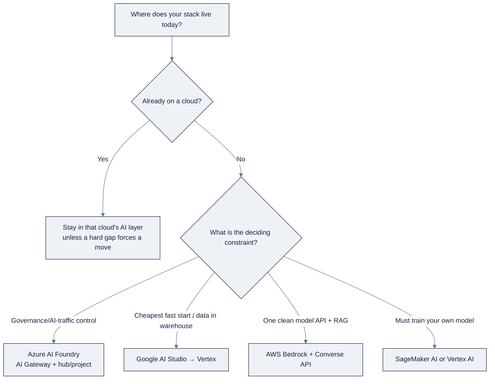

> **Part of AI Engineering Lab · Developed by Zorost Intelligence AI Lab · [zorost.com](https://zorost.com)**

# 12 · Enterprise Cloud AI Platforms: Azure, Google, and AWS

> **Find the Signal. Act with Intelligence.** · Knowledge Base · Cloud AI Platforms (Weeks 18 to 20)

This file is the reference for Phase 6 of the program: the three enterprise cloud AI
platforms, **Azure AI Foundry** (Microsoft), **Google (AI Studio + Vertex AI)**, and
**AWS (Bedrock + SageMaker AI)**. It gives you the mental models, the service maps, the
SDK entry points, and a comparison so you can make an informed "which cloud for which
job" call.

The running case study connects the three weeks: **the same ZoroLogistics support agent,
deployed three ways.** You build the identical capability on each cloud and compare
capabilities, governance, and cost, the exercise is the point.

> **⚠️ These facts move fast: verify against live docs.** Model names, service names,
> SDK versions, model IDs, quotas, and prices in this file were checked against vendor
> documentation at the time of writing, but every vendor ships aggressively. Microsoft
> and Google in particular have renamed their AI portals more than once. Before you
> publish or build on any specific name, price, or limit, re-check the live pages linked
> in [Sources](#sources). Treat every *specific* model name, model ID, SDK import, and
> price below as "correct at time of writing, subject to change."

---

## A) Microsoft Azure AI Foundry

### 1. Platform overview & mental model

**Azure AI Foundry** (recently rebranded in places as **"Microsoft Foundry"**; formerly
"Azure AI Studio," and before that pieces of "Azure Machine Learning Studio") is
Microsoft's unified enterprise platform for building, evaluating, deploying, and governing
generative-AI applications. Think of it as the control plane that glues together several
previously separate Azure services, Azure OpenAI, Azure AI Search, Azure AI Content
Safety, Azure Machine Learning, Speech, Vision, and Document Intelligence, behind one
portal and one set of SDKs.

The platform's defining idea is a **hub-and-project hierarchy**:

- **Hub** (sometimes called the "AI resource"), the shared enterprise container. It owns
  the shared connection resources: the Azure OpenAI instances, Azure AI Search indexes,
  storage accounts, key vaults, and the network boundary (VNet / private endpoints).
  Governance, identity, and security are configured once at the hub and inherited by every
  project under it.
- **Project**: a workspace where a team actually works. A project holds deployments,
  fine-tuning jobs, flows, evaluation runs, traces, and agent definitions. Several
  projects can share one hub.

The separation is the whole point for enterprises: **central IT controls the hub
(connectivity, models, data, keys); builders get freedom inside projects without
re-plumbing infrastructure.** This is the governance model you will see in real Azure
shops, so it is worth internalizing even though it adds ceremony at first.

### 2. Portal structure

The Foundry portal (`ai.azure.com`, now surfaced from the Azure portal) is organized around
a left-hand navigation that roughly follows the build lifecycle:

- **Model catalog**: browse, compare, and deploy foundation models.
- **Models + endpoints / Deployments**: see your deployed models, endpoints, and keys.
- **Playgrounds**: interactive chat/completion/realtime "try it" surfaces.
- **Agents**: build and deploy agents (Microsoft Agent Framework).
- **Prompt flow**: author an LLM + tools + retrieval pipeline as a DAG.
- **Evaluation** and **Tracing**, run evaluators and inspect end-to-end traces.
- **Fine-tuning**: create SFT/DPO jobs.
- **AI services / Content Safety**: configure safety policies.
- **Management center**: hub/project settings, RBAC, networking, billing.

The portal is best understood as **a UI over the same APIs you call in code**, everything
visible there is reachable through the SDKs and CLI.

### 3. Model catalog & the Azure OpenAI relationship

The **model catalog** aggregates two classes of models:

1. **Azure OpenAI models** (first-party, hosted by Azure OpenAI Service), OpenAI's GPT
   family (GPT-4.1, GPT-4.1-mini, GPT-4o), the **o-series reasoning models** (o1/o3/
   o4-mini), plus DALL·E, Whisper, and text-embedding-3. Microsoft also contributes its
   own open models, most notably **Phi-4**.
2. **Third-party / open models**: Meta **Llama**, **Mistral**, **Cohere**, **DeepSeek**,
   and others, deployed via **serverless API endpoints** ("Models as a Service," MaaS),
   where the model runs in a Microsoft-managed, metered endpoint.

**The Azure OpenAI relationship:** Azure OpenAI Service is the specific Azure resource that
*hosts* OpenAI models. AI Foundry is the *platform* around it. In practice you create an
Azure OpenAI resource (or several) attached to a hub, deploy a model into it, and call that
deployment through either the Azure OpenAI endpoint/SDK or Foundry's unified tooling. For
OpenAI models, Foundry and Azure OpenAI are effectively the same thing seen through two
lenses.

### 4. Core AI services

Beyond model hosting, the ecosystem's core adjacent services include:

- **Azure AI Search**: managed vector + hybrid + semantic search; the standard RAG backend.
- **Azure AI Content Safety**: prompt shields, jailbreak detection, groundedness checks,
  and protected-material detection, applied to inputs and outputs.
- **Azure AI Document Intelligence**: OCR and document layout/field extraction for RAG.
- **Azure AI Speech / Vision / Language**: speech-to-text, text-to-speech, translation, OCR.
- **Azure Machine Learning**: the underlying ML platform for training, registries, compute.

### 5. Authentication

- **Human/portal:** Entra ID (Azure AD) login, governed by Azure RBAC roles on hub/project.
- **Code (recommended):** Entra ID managed identity / service principal via
  `DefaultAzureCredential` (from `azure-identity`), rather than keys. Projects are reached
  with a **project connection string** plus an Entra credential.
- **Keys (legacy/quick-start):** Azure OpenAI resources still expose API keys for quick
  experiments, but production guidance is managed identity + role-based access.

### 6. SDKs & code patterns

Three entry points cover almost everything:

1. **`openai` SDK with Azure endpoints**: the most common "quick start" for chat completion
   on Azure OpenAI models (`AzureOpenAI` with the Azure endpoint and API version).
2. **`azure-ai-projects` SDK**: the Foundry-native client (`AIProjectClient`) with typed
   access to agents, evaluations, tracing, and the project abstraction.
3. **`azure-ai-inference`** (with `azure-identity`), the newer, model-agnostic Azure AI
   Inference SDK for calling any serverless-endpoint model with a uniform surface.

**Minimal chat completion (OpenAI SDK against an Azure OpenAI deployment):**

```python
import os
from openai import AzureOpenAI

client = AzureOpenAI(
    azure_endpoint=os.environ["AZURE_OPENAI_ENDPOINT"],   # https://<resource>.openai.azure.com
    api_key=os.environ["AZURE_OPENAI_API_KEY"],           # or use azure-identity for managed identity
    api_version="2024-10-21",
)

resp = client.chat.completions.create(
    model="gpt-4.1",                # your *deployment name*, not the raw model id
    messages=[{"role": "user", "content": "Explain a hub vs a project in AI Foundry."}],
)
print(resp.choices[0].message.content)
```

Note the subtlety: `model=` is your **deployment name** in Azure, not the raw model id,
a common first-timer confusion.

### 7. Deployment options

- **Serverless API endpoints (MaaS)**: pay-per-token, Microsoft-managed; ideal for catalog
  and open models.
- **Provisioned throughput (PTUs)**: reserved, guaranteed capacity with predictable cost
  for OpenAI models at production scale.
- **Managed compute (real-time / batch)**: deploy to your own Azure ML compute for full
  control or custom/fine-tuned models.

### 8. Agent building: Microsoft Agent Framework

- **Microsoft Agent Framework** (with the **Azure AI Agent Service** underneath) is
  Foundry's first-class agent runtime. An agent = model + instructions + tools +
  (optional) vector-store grounding. Tools include function calling, code interpreter,
  file search, and connectors to services like Azure AI Search.
- Agents are built in the **portal**, through the **`azure-ai-projects` SDK**, or with the
  **Agent Framework SDKs** (Python/C#/JS), which also support multi-agent orchestration.
- **MCP support:** Foundry supports the **Model Context Protocol**, you can attach MCP
  server endpoints (cloud or local) as tools, and Azure API Management can convert APIs to
  MCP (see AI Gateway below).

### 9. Evaluation & tracing

- **Evaluation:** built-in quality/safety evaluators (groundedness, relevance, coherence,
  fluency) plus custom evaluators and LLM-as-judge, run over a dataset in the portal or via
  the `azure-ai-evaluation` SDK.
- **Tracing:** Foundry records end-to-end traces (inputs, tool calls, intermediate steps,
  outputs) for agents and flows, viewable in the portal and exportable.
- **Prompt flow** is the structured authoring vehicle, an LLM app as a DAG of nodes, and
  it is tightly coupled to evaluation ("develop a flow, evaluate it, deploy it").

### 10. Fine-tuning

SFT and DPO are supported for eligible models (GPT-4o, Phi, several open models). Jobs are
created in the portal or SDK with training + validation datasets; the result deploys as its
own endpoint (including serverless). Fine-tuned models are private to your subscription,
Microsoft doesn't train on your data.

### 11. Governance: AI Gateway, content safety, monitoring

- **AI Gateway** is Foundry's governance layer, implemented via **Azure API Management
  (APIM)** with **GenAI policies**. It sits in front of your endpoints and provides
  **token-rate limiting**, **token-usage quotas/cost caps**, **semantic caching**,
  **content-safety filtering**, **load balancing**, and **model routing**. APIM can also
  convert APIs/OpenAPI to MCP and govern MCP tool calls.
- **Azure AI Content Safety** filters inputs and outputs (prompt shields, jailbreak
  detection, groundedness, protected material).
- Broader governance: Azure RBAC, private networking/VNet, Azure Policy, cost management,
  and Azure Monitor / Application Insights for logs, metrics, and traces.

### 12. Pricing (rough)

- **Pay-as-you-go (serverless/standard):** per-token, with input and output priced
  separately (output usually pricier); per-image for image models.
- **Provisioned throughput (PTU):** reserve capacity for guaranteed throughput at a discount.
- **Fine-tuning:** training cost plus per-hour hosting of the fine-tuned model.
- Azure generally prices at parity with OpenAI's own API for equivalent models, but bills
  through Azure with enterprise agreements and consolidated cost management. Always check
  the live Azure OpenAI pricing page.

---

## B) Google: AI Studio + Vertex AI

### 1. Platform overview & mental model

Google splits its generative-AI surface into **two entry points over largely the same
Gemini models**:

- **Google AI Studio** (`aistudio.google.com`), the developer/experiment sandbox. Free
  tier, no cloud project required (just a Google account and an API key), optimized for
  prompt testing and quick Gemini API calls. Great for learning; not for production control.
- **Vertex AI** (Google Cloud Console), the enterprise platform. Same Gemini models plus
  hundreds more, but with cloud-project billing, IAM, VPC Service Controls, quotas, and
  MLOps. This is where you productionize.

**Mental model:** AI Studio = "open the hood and tinker with Gemini for free." Vertex AI =
"run AI as governed enterprise infrastructure on GCP." They converge through a documented
migration path, start in AI Studio, later point the same code at Vertex with different
credentials.

### 2. Portal structure

- **Google AI Studio:** a single-page workspace, prompt builder, model selector, a
  **"Get code"** button that emits a runnable snippet, prompt gallery, and tuning.
- **Vertex AI (console):** left-nav with Vertex AI Studio (playground + tuning), Model
  Garden (catalog), Agent Builder / Agent Engine, Evaluation, Pipelines, Training,
  Deployment / Model Registry, Feature Store, Metadata, and Colab Enterprise.

### 3. Model catalog: the Gemini family & Model Garden

**Gemini** is the flagship family with a clear size/cost ladder (tier + generation naming):

- **Gemini 2.5 Pro**: flagship "thinking"/frontier model (large context, best reasoning).
- **Gemini 2.5 Flash**: the cost/performance workhorse; low latency, lower price.
- **Gemini 2.5 Flash-Lite**: cheapest, for high-volume/simple tasks.
- **Thinking variants**: Pro/Flash models that expose internal reasoning with a budget.
- (Historically: Gemini 1.5 Pro/Flash, Nano for on-device, and **Gemma**, Google's
  open-weight sibling family, analogous to Llama.)

Beyond Gemini, **Model Garden** surfaces a broad catalog of first-party (Imagen for images,
Veo for video, Chirp for speech), open (Llama, Mistral, Gemma), and partner models, many
deployable to Vertex endpoints.

### 4. Core AI services

- **Vertex AI Studio**: prompt/chat playground plus tuning.
- **Model Garden**: catalog/discovery.
- **Agent Builder / Agent Engine**: agentic RAG and agent deployment (below).
- **Vertex AI Evaluation, Pipelines, Prediction (endpoints), Training**: the MLOps backbone.
- **BigQuery ML**: train/invoke ML *inside BigQuery with SQL*, including remote calls to
  Gemini for in-warehouse generation/embedding (a distinctive "AI without leaving the
  warehouse" capability).
- **Colab Enterprise**: managed, governed Colab notebooks (the enterprise version of free
  Google Colab).

### 5. Authentication

- **AI Studio:** a simple Gemini API key, the easiest possible auth for learning.
- **Vertex AI:** Google Cloud application default credentials (ADC), `gcloud auth
  application-default login` for local dev, or a service account / workload identity in
  production.
- The unified **`google-genai`** SDK can target either: pass `api_key` for AI Studio, or
  `vertexai=True` + project/location for Vertex.

### 6. SDK & code patterns

The **`google-genai`** SDK (Python `google-genai`; also TS/Go/Java) is the current
recommended unified client, replacing the older `google-generativeai` and `vertexai` paths.

**Minimal chat completion (Gemini API via AI Studio key):**

```python
from google import genai

client = genai.Client(api_key="YOUR_API_KEY")          # AI Studio key
resp = client.models.generate_content(
    model="gemini-2.5-flash",                          # or gemini-2.5-pro / flash-lite
    contents="Explain the difference between AI Studio and Vertex AI.",
)
print(resp.text)
```

**Same call on Vertex AI (enterprise):**

```python
from google import genai

client = genai.Client(
    vertexai=True,               # switches to Vertex auth + project
    project="your-gcp-project",
    location="us-central1",
)
resp = client.models.generate_content(
    model="gemini-2.5-flash",
    contents="Explain Vertex AI Model Garden.",
)
print(resp.text)
```

### 7. Deployment options

- **AI Studio:** no deployment, it's a playground returning API responses.
- **Vertex AI:** deploy to Prediction/Model endpoints (serverless or dedicated), use Batch
  prediction, or call Gemini directly through the API with project quotas. Model Garden
  supports one-click "deploy to endpoint" for open models.

### 8. Agent building: Agent Builder, Agent Engine, ADK

- **Agent Builder**: no-code/low-code agent + grounded RAG builder (search your own data,
  grounded on Vertex AI Search / Google Search). Pick a model, connect data/tools, define
  instructions, get a testable, governed agent.
- **Agent Engine**: the managed **runtime** that hosts/deploys agents (including
  ADK-built agents) as scalable endpoints with sessions, memory, and orchestration.
- **ADK (Agent Development Kit)**: Google's **code-first, open-source** agent framework
  (Python; lightweight, LangGraph-style orchestration, multi-agent, tool calling). ADK
  agents can be deployed to Agent Engine.
- **MCP support:** ADK and Agent Engine/Agent Builder support the Model Context Protocol,
  with "advanced tool governance" for tool/MCP access control.

### 9. Evaluation & fine-tuning

- **Vertex AI Evaluation**: model-based / LLM-as-judge evaluation with metric templates,
  plus a Gen AI evaluation service for comparing prompts/models and running offline/batch
  evaluation on datasets.
- **Fine-tuning:** supervised fine-tuning (SFT) of Gemini (e.g. Gemini 2.5 Flash), plus
  continued pre-training and RLHF for select models. Managed tuning jobs produce a private,
  deployable model.

### 10. Monitoring / governance

- **Vertex AI:** IAM, VPC Service Controls, CMEK, audit logs, quotas, and Model Monitoring
  for drift/alerts. Enterprise controls are the main differentiator vs AI Studio.
- **AI Studio:** essentially none of these, data may be used to improve Google's products
  by default, with no enterprise isolation. **The single most important lesson: do not send
  sensitive data through the free AI Studio tier.**

### 11. Pricing (rough)

- **AI Studio free tier:** a daily request quota on Gemini API (historically tens-to-hundreds
  of requests/day depending on model and tier; a paid "Tier 1" raises it toward ~1,000 RPD
  for Flash). Exact limits change, check the live quota page.
- **Paid Gemini API:** per-token (input/output) and per-image, with context-caching discounts.
- **Vertex AI:** per-token/per-image/per-second for Gemini, plus endpoint hosting, tuning,
  and pipeline costs. BigQuery ML and other services bill separately. Prices per million
  tokens drop frequently, always confirm against live pages.

---

## C) AWS: Bedrock + SageMaker AI

### 1. Platform overview & mental model

AWS's generative-AI story is two complementary layers:

- **Amazon Bedrock**: the managed foundation-model layer. "Call models as an API without
  running infrastructure." It unifies many third-party and first-party models behind one
  **Converse API**, and layers on RAG, agents, guardrails, and evals.
- **SageMaker AI**: the build/train/deploy-your-own-model layer. Bring your own data and
  models, train on managed clusters, deploy to endpoints. It is AWS's classical ML platform
  now refocused on generative AI (fine-tuning, HyperPod, JumpStart).

**Mental model:** Bedrock = consume models + managed GenAI features. SageMaker = build,
fine-tune, and serve models you own. A production RAG app commonly uses **Bedrock (model +
Knowledge Bases)** and reaches for **SageMaker only if fine-tuning**. Around them sit
**Amazon Q** (end-user/workplace assistants) and **PartyRock** (a free no-code playground).

### 2. Portal structure

- **Bedrock console:** Model catalog, Playgrounds (Chat/Text/Image), Knowledge Bases,
  Agents, Guardrails, Prompt management, Model evaluation, AgentCore, Marketplace, and
  cross-region inference settings.
- **SageMaker AI console:** SageMaker Studio (the IDE), JumpStart (one-click model catalog +
  fine-tune + deploy), Training jobs, HyperPod (resilient GPU clusters), Inference/endpoints,
  Model Customization, plus Pipelines, Feature Store, and Model Registry.

### 3. Model catalog

Bedrock's catalog spans first-party and third-party models, all callable through the same
Converse/InvokeModel surface:

- **Amazon Nova**: AWS's first-party family: Nova Pro/Lite/Micro (text), Nova Canvas
  (image), Nova Reel (video). Cheapest, deep AWS integration.
- **Anthropic Claude**: Claude 3.7 Sonnet / Claude 4 families; the flagship frontier models
  for reasoning/coding.
- **Meta Llama**: Llama 3.x / 4 open-weight models.
- **Mistral**: Mistral/Mixtral open models.
- **Amazon Titan**: older first-party text/embedding models (embeddings still useful for RAG).
- Plus **Cohere, Stability AI, DeepSeek**, and others via **Bedrock Marketplace**.

The **Converse API** is the key abstraction: a single, provider-neutral request/response
format (system/messages/tool-calling) that lets you swap models without rewriting code.

### 4. Core AI services

- **Knowledge Bases (RAG)**: managed ingestion + retrieval: point it at S3, it chunks,
  embeds (Titan/Cohere), stores vectors (OpenSearch Serverless/Aurora/Pinecone/etc.), and
  exposes `retrieve` / `retrieve_and_generate`.
- **Agents**: managed orchestration: model + instructions + action groups/tools +
  knowledge bases, with multi-agent collaboration and code interpreter.
- **AgentCore**: the newer managed agent **runtime**: hosts code-first agents (LangGraph,
  Strands, etc.) with memory, sessions, and tool/gateway controls, for running agentic
  systems at scale.
- **Guardrails**: configurable safety filters (denied topics, content filters, PII
  redaction, custom word filters) applied to model I/O.
- **Prompt management**: versioned, cataloged prompts invokable by ARN.
- **Model evaluation**: automatic (benchmark) and human-in-the-loop (LLM-as-judge) jobs.
- **Bedrock Marketplace**: browse/deploy third-party and specialized models.

### 5. Authentication

**AWS IAM everywhere.** Bedrock/SageMaker calls are authorized by IAM roles/policies
(e.g. `bedrock:InvokeModel`, `bedrock:Converse`). No API keys, you sign requests with
credentials from the environment, an EC2 instance role, or SSO (`aws sso login`). Model
access is **explicitly enabled per model** in the console before you can invoke it, an
important least-privilege habit.

### 6. SDK & code patterns

**`boto3`** is the AWS SDK for Python; Bedrock runtime calls go through the
`bedrock-runtime` client. The **Converse API** is the recommended modern pattern (replacing
raw `invoke_model` with provider-specific JSON bodies).

**Minimal chat completion (boto3, Converse API):**

```python
import boto3

client = boto3.client("bedrock-runtime", region_name="us-east-1")

resp = client.converse(
    modelId="anthropic.claude-3-5-sonnet-20241022-v2:0",   # or a Nova/Llama/Mistral id
    messages=[
        {"role": "user", "content": [{"text": "Explain Bedrock vs SageMaker."}]}
    ],
)
print(resp["output"]["message"]["content"][0]["text"])
```

(Also useful: `invoke_model` for legacy/streaming cases, the higher-level Agents / Knowledge
Bases clients, and `@aws-sdk/client-bedrock-runtime` in TypeScript.)

### 7. Deployment options

- **Bedrock:** serverless by default. **On-demand** (pay-per-token) vs **Provisioned
  Throughput** (reserve "model units" for guaranteed throughput at a discount).
  **Cross-region inference** routes traffic across a pre-defined region set for higher
  throughput and resilience.
- **SageMaker:** real-time endpoints, batch transform, serverless inference, and async
  inference, with multi-model endpoints and autoscaling. **HyperPod** provides resilient
  GPU clusters for large training jobs (checkpointing, auto-repair).

### 8. Agent building & assistants

- **Bedrock Agents**: build agents that call knowledge bases and tools (Lambda/action
  groups), with multi-agent collaboration.
- **AgentCore**: deploy/manage code-first agents (LangGraph, Strands, etc.) with managed
  runtime, memory, sessions, and an API gateway for tools (with optional OAuth/Cedar-policy
  access control). AWS's answer to "run my agent framework in production."
- **Amazon Q**: pre-built assistants you buy: **Q Developer** (coding assistant) and
  **Q Business** (workplace assistant grounded in enterprise data via connectors).
- **PartyRock**: a free, shareable, no-code drag-and-drop playground on Bedrock models,
  the best zero-friction "taste of Bedrock."

### 9. Evaluation & fine-tuning

- **Bedrock Model Evaluation**: automatic (built-in benchmarks + custom metrics) and human
  evaluation workflows (LLM-as-judge with your own rubric).
- **Fine-tuning:** **SageMaker Model Customization** fine-tunes first-party (Nova) and open
  (Llama/Mistral) models with SFT/DPO/reinforcement approaches; Bedrock also supports custom
  model import. Fine-tuned models deploy to a SageMaker endpoint (or, for Nova, back through
  Bedrock).

### 10. Monitoring / governance

- **Bedrock Guardrails** for content safety; **CloudWatch** for logs/metrics/alarms;
  **CloudTrail** for API audit; **IAM + SCPs** for access; model invocation logging to
  S3/CloudWatch.
- **SageMaker** adds **Model Monitor** (drift/quality), Clarify (bias/explainability), and
  full training-job observability.
- Anchors: IAM, KMS, VPC endpoints, AWS Organizations/SCPs, and the Well-Architected +
  Responsible AI frameworks.

### 11. Pricing (rough)

- **Bedrock on-demand:** per-token (input/output) or per-image, model-specific. Nova is
  typically cheapest; Claude frontier models most expensive.
- **Provisioned Throughput:** reserve model units per hour (commitment-based, significant
  discount) for guaranteed throughput.
- **Cross-region inference:** billed at the same on-demand token rates; pools capacity
  across regions.
- **Knowledge Bases / Agents / Guardrails / AgentCore:** mostly pay-per-use (tokens +
  storage + vector DB + per-session/per-node runtime for AgentCore).
- **SageMaker:** pay per compute-hour of training/inference instances (on-demand or spot),
  plus storage. JumpStart models deploy to endpoints billed like normal inference.
- Confirm on the live Bedrock pricing page, token prices change and model IDs get
  superseded frequently.

---

## Big Comparison Table

| Dimension | **Azure AI Foundry** | **Google (AI Studio + Vertex AI)** | **AWS (Bedrock + SageMaker)** |
|---|---|---|---|
| **Model access** | Azure OpenAI (GPT/o-series, Phi) + Llama/Mistral/Cohere/DeepSeek via serverless endpoints | Gemini 2.5 (Pro/Flash/Lite) + open/partner models in Model Garden | Claude, Nova, Llama, Mistral, Titan, Cohere + Marketplace |
| **Unified API abstraction** | OpenAI SDK + Azure AI Inference SDK (serverless) | `google-genai` SDK (one client for AI Studio & Vertex) | **Converse API** (provider-neutral), the cleanest of the three |
| **Agent building** | Microsoft Agent Framework + Azure AI Agent Service | Agent Builder (low-code) + Agent Engine (runtime) + ADK (code-first) | Bedrock Agents + **AgentCore** (managed runtime for LangGraph/Strands) |
| **RAG** | Azure AI Search (vector/hybrid/semantic) + agent file-search | Vertex AI Search / Agent Builder grounding; BigQuery ML in-warehouse | **Bedrock Knowledge Bases** (managed ingest + retrieve) |
| **Evals** | Foundry Evaluation + tracing (built-in + LLM-as-judge) | Vertex AI Evaluation / Gen AI Eval service | Bedrock Model Evaluation (auto + human/LLM-as-judge) |
| **Fine-tuning** | SFT/DPO on GPT/Phi/open models, private deploy | SFT of Gemini (plus RLHF/CPT on select models) | SageMaker Model Customization (SFT/DPO) on Nova/Llama/Mistral |
| **Serving** | Serverless endpoints, PTU, managed compute | Vertex Prediction endpoints (serverless/dedicated), batch | Bedrock serverless + Provisioned Throughput + cross-region; SageMaker endpoints |
| **Governance** | RBAC, VNet/private endpoints, APIM AI Gateway (GenAI policies), Content Safety | IAM, VPC-SC, CMEK, quotas, model monitoring (Vertex only) | IAM/SCPs, Guardrails, CloudTrail, VPC endpoints, invocation logging |
| **Pricing** | Per-token + PTU + fine-tune/hosting | Per-token; free AI Studio tier; Vertex pay-as-you-go | Per-token on-demand + Provisioned Throughput; SageMaker per compute-hour |
| **Learning curve** | Medium, hub/project concept + Entra ID adds ceremony | **Lowest to start (AI Studio), medium to productionize (Vertex)** | Medium-high, IAM + two overlapping platforms (Bedrock vs SageMaker) |

---

## Which Platform for Which Learner / Team

- **Total beginner wanting instant gratification and the cheapest start → Google AI Studio.**
  A browser, a Google account, and a free API key get you a working Gemini chat call in
  minutes with zero infrastructure. The best "hello world" in the industry, just learn the
  rule early: it's not for sensitive data.

- **Learner who wants one clean mental model for "call any model with one API" → AWS
  Bedrock (Converse API).** The Converse API's provider-neutral message format is the most
  pedagogically clean way to learn model invocation, tool calling, and streaming across
  Claude/Nova/Llama, one code shape, swap the `modelId`. Knowledge Bases + Agents +
  Guardrails also teach the full RAG → agent → safety arc without running servers.

- **Learner on the Microsoft/enterprise-IT path (Azure shops, .NET/Entra) → Azure AI
  Foundry.** Foundry teaches the hub/project governance model, managed-identity auth, and
  the AI Gateway pattern that real Azure deployments use. OpenAI SDK familiarity transfers
  directly from OpenAI's own API.

- **Learner who wants to actually *train* models, not just call them → SageMaker AI (or
  Vertex AI).** Bedrock/AI Studio call models; if your goal is fine-tuning, dataset
  pipelines, HyperPod-scale training, or deploying your own endpoints, SageMaker's
  JumpStart → Training → Customization → Endpoint path is the most complete build-it-
  yourself curriculum. Vertex offers a similarly deep (and arguably more unified) MLOps
  alternative if you prefer GCP.

- **Data/analytics professional → Google (BigQuery ML + Colab Enterprise) or AWS (SageMaker
  + Bedrock).** Google's in-warehouse `ML.GENERATE_TEXT` and Colab Enterprise are uniquely
  friendly to SQL/notebook-first practitioners; AWS wins if your data already lives in
  S3/Redshift and you want Bedrock RAG on top.

**Practical recommendation for the program's teaching order:** start everyone in **AI
Studio** (free, 10-minute win) → teach model invocation again in **Bedrock Converse**
(cleanest API) → contrast **Foundry's hub/project governance** (enterprise reality) → end
with a **SageMaker/Vertex fine-tuning** unit for the "own your model" lesson. That is
roughly the Week 18 → 19 → 20 order, with the fine-tuning depth carried by SageMaker in
Week 20 and the earlier Week 10 fine-tuning unit.

---

## ZoroLogistics connection: one support agent, three clouds

The Phase 6 case study is deliberately repetitive. The **same ZoroLogistics support agent**
tracking lookups, refund triage with a human approval step, and shipping-policy Q&A from
your Week 7 RAG corpus, is rebuilt once per cloud:

| Week | Cloud | How the support agent is built | What you compare |
|---|---|---|---|
| 18 | Azure AI Foundry | Microsoft Agent Framework agent + serverless endpoint + AI Gateway | Hub/project governance, tracing, gateway rate limits |
| 19 | Google Vertex AI | ADK agent deployed to Agent Engine (+ multimodal BoL OCR pipeline) | Gemini multimodal, Agent Engine, BigQuery ML |
| 20 | AWS Bedrock | Bedrock Agent + Knowledge Bases + Guardrails | Converse API, managed RAG, Guardrails |

Because the *product* is constant, the *platform* becomes the variable, which is exactly
the skill you need when a client or employer asks "should we standardize on Azure, GCP, or
AWS?" The Week 20 deliverable is the **three-cloud comparison matrix**, which the table
above is the seed for.

---

## Side-by-side: the same support agent, three codebases

The Phase 6 point is that the *product* is constant and only the *platform* varies. Here is the
same ZoroLogistics support agent, one `track_shipment` tool, one instruction, one refund gate,
written three ways. All three are **shape-only illustrations** (SDK surfaces move fast); the
lesson is in *what stays the same*, not the exact imports.

**The shared tool contract (identical on all three):**

```json
{
  "name": "track_shipment",
  "description": "Return live status + ETA for a shipment id.",
  "parameters": {
    "type": "object",
    "properties": { "shipment_id": { "type": "string", "description": "e.g. S0004821" } },
    "required": ["shipment_id"]
  }
}
```

**Azure: Microsoft Agent Framework (`azure-ai-projects`):**

```python
from azure.ai.projects import AIProjectClient
from azure.identity import DefaultAzureCredential

client = AIProjectClient.from_connection_string(
    conn_str=os.environ["PROJECT_CONNECTION_STRING"],
    credential=DefaultAzureCredential(),          # managed identity, not a key
)
agent = client.agents.create_agent(
    model="gpt-4.1",                              # your *deployment name*
    instructions="You are the ZoroLogistics support agent: tracking, refund triage, policy Q&A.",
    tools=[{"type": "function", "function": TRACK_SCHEMA}],
)
# refund gate -> a tool that returns "pending_approval" over $500, surfaced to a human reviewer
```

**Google: ADK (deployed to Agent Engine):**

```python
from google.adk.agents import Agent

def track_shipment(shipment_id: str, tool_context) -> dict:
    return zoro.track(shipment_id)               # same data layer as the MCP server in Week 16

agent = Agent(
    model="gemini-2.5-flash",
    instruction="You are the ZoroLogistics support agent: tracking, refund triage, policy Q&A.",
    tools=[track_shipment],
)
# refund gate -> a tool returning "pending_approval" for amounts over $500 (ADK tool governance)
```

**AWS: Bedrock Agents (action group → Lambda):**

```python
import boto3
# 1) The Lambda implements the tool; 2) an action group declares its schema; 3) the agent calls it
agent = boto3.client("bedrock-agent").create_agent(
    agentName="zoro-support",
    foundationModel="anthropic.claude-3-5-sonnet-20241022-v2:0",
    instruction="You are the ZoroLogistics support agent: tracking, refund triage, policy Q&A.",
    actionGroups=[{
        "actionGroupName": "shipment-tools",
        "actionGroupExecutor": {"lambda": "arn:aws:lambda:...:function:zoro-track"},
    }],
)
# refund gate -> Guardrails + an action-group Lambda that returns "pending_approval" over $500
```

**What's identical, what differs:**

| Element | Identical across clouds | Differs |
|---|---|---|
| The tool **contract** | name/description/schema are byte-for-byte the same | how the schema is *attached* (function dict vs. Python signature vs. action group) |
| The **instruction** | same system prompt | deployment name vs. model id vs. foundationModel ARN |
| The **data layer** | `zoro.track()` is the same function | the wrapper (tool registration, Lambda, ADK tool) |
| The **refund gate** | same "pending_approval over $500" rule | Azure HITL · ADK tool governance · Bedrock Guardrails |

The transferable skill is the *contract*: a typed tool, a scoped instruction, and a human gate on
the irreversible action are cloud-independent. The cloud only changes the glue.

---

## Cost-model comparison (worked numbers)

Pick one workload and cost it on all three, that's the Week 20 deliverable in number form.
Worked example: **10,000 support tickets/month**, each resolved in ~3 tool calls, averaging
**3,000 input + 600 output tokens per ticket** → **30M input + 6M output tokens/month**.

| Cost component | Azure AI Foundry | Google Vertex | AWS Bedrock |
|---|---|---|---|
| Model (illustrative, re-verify) | GPT-4.1 ~$2.50/M in, ~$10/M out | Gemini 2.5 Flash ~$0.30/M in, ~$2.50/M out | Claude Sonnet ~$3/M in, ~$15/M out |
| Monthly tokens | 30M in + 6M out | same | same |
| **Monthly model cost** | 30×2.5 + 6×10 = **$135** | 30×0.30 + 6×2.50 = **$24** | 30×3 + 6×15 = **$180** |
| Fixed costs | Serverless $0 (PTU optional) | Vertex endpoint hosting if self-hosted | Serverless $0 (PTU optional) |
| **Total (rough)** | **~$135/mo** | **~$24/mo** | **~$180/mo** |

*(Illustrative per-1M-token rates, verify against the live pricing pages before quoting. The
pattern, 30M input × rate + 6M output × rate, is the math, not the specific dollar figures.)*

**Three cost lessons the table hides:**

1. **Output tokens dominate.** Output is usually 4 to 6× the input price; a wordy agent doubles your
   bill. Cap/steer answer length before you compare models.
2. **The cheapest *capable* model wins by an order of magnitude.** Flash at $24 vs. Sonnet at $180
   is a 7.5× gap, which is why Week 19's "use Flash for triage, Pro only for hard reasoning"
   routing matters more than which cloud you pick.
3. **Serverless keeps fixed cost at $0**: which is why all three defaults are pay-per-token.
   Provisioned throughput (PTU/model units) only pays once you have steady, predictable volume:
   the break-even is *not* at 10K tickets/month, it's when your *peak* regularly exceeds the
   on-demand ceiling.

---

## Governance feature matrix

"Which cloud" at an enterprise is often decided by governance, not models. Here is the
capability-by-capability comparison.

| Governance capability | Azure AI Foundry | Google Vertex AI | AWS Bedrock + SageMaker |
|---|---|---|---|
| Identity / access | Entra ID + Azure RBAC | Cloud IAM | AWS IAM + SCPs |
| Network isolation | VNet + private endpoints | VPC Service Controls | VPC endpoints |
| Content safety | Azure AI Content Safety (prompt shields, jailbreak, groundedness) | Vertex safety filters | Bedrock Guardrails (denied topics, PII redaction) |
| API-level AI governance | APIM AI Gateway (rate limits, quotas, semantic cache, routing) | Quotas + model monitoring | CloudWatch + invocation logging; AgentCore gateway w/ Cedar policies |
| Audit trail | Azure Monitor / Log Analytics | Cloud Audit Logs | CloudTrail |
| Data-at-rest key | Customer-managed keys (CMK) | CMEK | KMS |
| Responsible-AI tooling | Content Safety + evaluation | Model monitoring + explainability | SageMaker Clarify + Guardrails |
| Cost management | Azure Cost Management + budgets | Cloud Billing + budgets | AWS Budgets + Cost Explorer |

**Reading it:** Azure's differentiator is the **AI Gateway** (APIM GenAI policies, the most
*explicit* AI-traffic governance of the three). Google's is **VPC-SC** and the cleanest
AI-Studio→Vertex migration of controls. AWS's is **IAM granularity + Guardrails** as a first-class,
swappable filter. None is "more governed", they express the same controls in different idioms.

---

## Migration decision guide

Teams rarely start greenfield; they migrate from an existing API or platform. The tree and table
turn "should we move to X?" into a sequence of checks.



| From → To | Why you'd move | What changes | Watch out |
|---|---|---|---|
| OpenAI API → Azure OpenAI | Enterprise Entra/RBAC, data residency, consolidated billing | Same OpenAI SDK, new endpoint + deployment names | `model=` is the *deployment* name |
| AI Studio → Vertex AI | Governance, no data-to-improve-models, quotas | Same `google-genai`, switch `vertexai=True` | Re-point auth to ADC/service account |
| Bedrock model swap | Cheaper/faster model for the same task | One `modelId` change in Converse | Model IDs carry dated suffixes and get superseded |
| Self-hosted → any cloud | Offload serving/ops | Your endpoint → serverless | Re-verify token price + latency budget |
| On-prem warehouse → Databricks | Lakehouse + governed AI (Weeks 21 to 24) | See [`13-databricks-overview.md`](13-databricks-overview.md) | Different module, the migration is a re-platform, not a re-point |

**The meta-rule:** the cheapest migration is the one you don't do. If you're already on a cloud,
its native AI layer is almost always the right default; the other clouds are worth switching for
only when a *specific* hard gap (a governance control, a model, a cost line) is measured and real.

---

## How it breaks / common mistakes

| Mistake | Symptom | Fix |
|---|---|---|
| Sent sensitive data through the free AI Studio tier | Data used to improve Google's products, no isolation | AI Studio is for learning only; production = Vertex (or Bedrock/Foundry) |
| Used `model=` as the raw model id on Azure | "model not found" on a working deployment | `model=` is the **deployment name**, not the model id |
| Compared clouds on model names, not the workload | Analysis paralysis; no decision | Fix one workload (the support agent) and cost it on all three (§ cost model) |
| Skipped the Converse API on Bedrock | Rewrote code per provider | Use Converse for one provider-neutral shape; swap `modelId` |
| Ignored output-token cost | Bill 4 to 6× the input expectation | Output dominates; cap answer length and route cheap models for easy turns |
| Enabled every model in the Bedrock console "just in case" | Least-privilege violation, surprise spend | Enable per-model access explicitly; audit quarterly |
| Trusted a model ID without the dated suffix | `modelId` breaks after a vendor supersedes it | Re-check the live model list; treat IDs as "correct at time of writing" |

The through-line: **the platform is the variable, but the discipline is constant**, fix the
workload, cost it, verify the IDs/prices against live docs, and don't send regulated data through
a free tier.

---

## Self-check questions

1. **What is the one thing that stays identical when you build the support agent on all three clouds?**
   *A:* The tool *contract*, name, description, JSON Schema, plus the instruction and the refund gate. Only the glue (tool registration, auth, model id) changes.

2. **Why does `model=` on Azure OpenAI refer to the deployment name, and why does it trip people up?**
   *A:* Azure routes through a *deployment* you created, not the raw model id, so a working endpoint can still "not find" the raw id. It's the most common first-timer 404.

3. **In the cost model, why does output-token price dominate even when output is only 6M of 36M total tokens?**
   *A:* Because output tokens are priced 4 to 6× input, 6M output at $10 to 15/M can cost more than 30M input at $0.30 to 3/M. Steer answer length before comparing models.

4. **What is Azure's governance differentiator, Google's, and AWS's?**
   *A:* Azure's AI Gateway (APIM GenAI policies) for AI-traffic governance; Google's VPC-SC and the clean AI-Studio→Vertex control migration; AWS's IAM granularity + swappable Guardrails.

5. **When is a cloud migration justified, versus staying put?**
   *A:* Only when a *specific, measured* hard gap (a governance control, a model, or a cost line) requires it, otherwise the cloud you're already on is the cheapest default.

**Passing bar:** 5/5, these five (the constant contract, the deployment-name trap, output-token
economics, the governance idioms, and the migration bar) are what the Week 20 three-cloud matrix
is actually testing.

---

## Sources

**Microsoft / Azure**
- Azure AI Foundry architecture: https://learn.microsoft.com/en-us/azure/ai-foundry/concepts/architecture
- Azure OpenAI Service models: https://learn.microsoft.com/en-us/azure/ai-services/openai/concepts/models
- Microsoft Agent Framework overview: https://learn.microsoft.com/en-us/agent-framework/overview/
- Azure AI Projects client library (JS): https://learn.microsoft.com/en-us/javascript/api/overview/azure/ai-projects-readme
- Connect agents to MCP server endpoints: https://learn.microsoft.com/en-us/azure/foundry/agents/how-to/tools/model-context-protocol
- Install the Azure Developer CLI Foundry extensions: https://learn.microsoft.com/en-us/azure/foundry/agents/how-to/install-cli-foundry-extensions
- Deploy models as serverless APIs: https://learn.microsoft.com/en-us/azure/ai-studio/how-to/deploy-models-serverless
- Azure AI Foundry deployment options: https://learn.microsoft.com/en-us/azure/ai-foundry/concepts/deployments-overview
- Prompt flow (Azure Machine Learning): https://learn.microsoft.com/en-us/azure/machine-learning/prompt-flow/community-ecosystem
- Azure API Management GenAI gateway policies: https://github.com/microsoft/azure-skills/blob/main/.github/plugins/azure-skills/skills/azure-aigateway/SKILL.md
- Azure OpenAI chat completion (OpenAI SDK): https://learn.microsoft.com/en-us/azure/ai-foundry/openai/how-to/chatgpt

**Google**
- Migrate from Google AI Studio to Vertex AI: https://docs.cloud.google.com/vertex-ai/generative-ai/docs/migrate/migrate-google-ai
- Model Garden supported models: https://docs.cloud.google.com/vertex-ai/generative-ai/docs/model-garden/available-models
- Tune Gemini models with supervised fine-tuning: https://docs.cloud.google.com/vertex-ai/generative-ai/docs/models/gemini-use-supervised-tuning
- Migrate to the Google GenAI SDK: https://ai.google.dev/gemini-api/docs/migrate
- Vertex AI Agent Builder (product page): https://cloud.google.com/products/agent-builder
- Gemini 2.5 model family expansion (Google blog): https://blog.google/products-and-platforms/products/gemini/gemini-2-5-model-family-expands/
- Gemini API free tier / quotas (community discussion): https://discuss.ai.google.dev/t/gemini-api-free-tier-daily-quota-25-rpd-blocking-paid-usage-tier-1-1000-rpd/79899

**AWS**
- Amazon Bedrock Converse API supported models: https://docs.aws.amazon.com/bedrock/latest/userguide/conversation-inference-supported-models-features.html
- Amazon Bedrock overview: https://docs.aws.amazon.com/bedrock/latest/userguide/what-is-bedrock.html
- Amazon Bedrock model availability & compatibility: https://docs.aws.amazon.com/bedrock/latest/userguide/models.html
- Bedrock cross-region inference / inference profiles: https://docs.aws.amazon.com/bedrock/latest/userguide/inference-profiles-support.html
- Bedrock capacity & cost optimization (on-demand vs PTU): https://docs.aws.amazon.com/bedrock/latest/userguide/capacity-limits-cost-optimization.html
- Bedrock Runtime code examples (boto3): https://docs.aws.amazon.com/code-library/latest/ug/python_3_bedrock-runtime_code_examples.html
- SageMaker AI (deploy from JumpStart / HyperPod): https://docs.aws.amazon.com/sagemaker/latest/dg/sagemaker-hyperpod-model-deployment-deploy.html
- Amazon Bedrock AgentCore (AWS news): https://www.aboutamazon.com/news/aws/aws-amazon-bedrock-agent-core-ai-agents

> *This is a synthesized knowledge-base file written in AI Engineering Lab's own words; no
> third-party training content was copied. Where a fact is a moving target (model names,
> IDs, prices, quotas), it is flagged inline and should be re-verified against the live
> vendor links above.*

---

© 2026 Zorost Intelligence LLC · [zorost.com](https://zorost.com)
