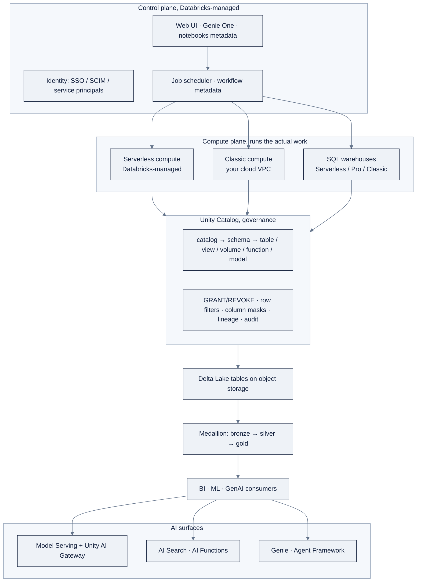

> **Part of AI Engineering Lab · Developed by Zorost Intelligence AI Lab · [zorost.com](https://zorost.com)**

# 13 · The Databricks Data Intelligence Platform at a Glance

> **Find the Signal. Act with Intelligence.** · Knowledge Base · Databricks (Weeks 21 to 24)

This file is the one-page mental map for the entire Databricks module. It answers
"what is this platform, what are its moving parts, and where in the program do I learn
each part?" Each section is a 1 to 3 sentence "what it is" plus a pointer to the week and
platform file that teaches it. For depth, follow the pointer; for the raw facts this
file is built from, see [`research/06-databricks-deep-dive.md`](research/06-databricks-deep-dive.md).

The running case study is **ZoroLogistics**, a fictional freight company whose synthetic
data toolkit lives in [`zoro/`](../../zoro/). Every example in the platform files maps a
Databricks feature to a ZoroLogistics problem: a governed medallion lakehouse, a streaming
shipment pipeline, a point-in-time ETA model, and a RAG assistant over shipping documents.

> **⚠️ These facts move fast: verify against live docs.** Databricks renamed a large
> number of products through 2024 to 2026 and continues to ship aggressively. Every rename
> below is flagged **current name (formerly …)**. Before you build on any specific name,
> API, version number, or limit, re-check the pages linked in [Sources](#sources) and the
> machine-readable index at `https://docs.databricks.com/llms.txt`.

---

## 1. What the platform is

**Databricks is a unified, open analytics and AI platform** for building, deploying, and
governing data, analytics, and AI, the **Data Intelligence Platform**. It is *not* a
separate cloud; it runs **inside your cloud account** (AWS, Azure, or GCP) and layers a
governed **lakehouse** on top of your object storage, while Databricks manages the
orchestration and control services on your behalf. Databricks' differentiator is that it
adds **AI on top of the lakehouse**, understanding data semantics and automatically
optimizing performance, indexing, and infrastructure.

The architecture is two conceptual planes:

| Plane | What runs there | Where it lives |
|---|---|---|
| **Control plane** | Web UI, identity, job scheduling, notebook/workspace metadata, backend services | Databricks-managed |
| **Compute plane** | Actual data processing, Spark executors, SQL engines | **Classic**: your cloud account · **Serverless**: Databricks-managed |

- **Classic compute** runs in *your* virtual network → natural network isolation, customer-managed VPCs.
- **Serverless compute** runs in a Databricks-managed plane, created in the same region, inside a network boundary that isolates your workspace.

**Which week teaches it:** Week 21, [`reference/platforms/databricks/00-day-zero-setup.md`](../platforms/databricks/00-day-zero-setup.md).

---

## 2. Accounts vs. workspaces

- A **workspace** is a single Databricks deployment, where a team works with notebooks,
  jobs, clusters, SQL warehouses, and data. It has **workspace storage** for notebooks,
  queries, and dashboards. (The legacy **DBFS root** and **DBFS mounts** are deprecated,
  use Unity Catalog for all data access.)
- A **Databricks account** is the top-level entity holding **multiple workspaces**. At the
  account level you manage identity (users/groups/service principals, SSO/SCIM), workspace
  creation across regions, **Unity Catalog metastores**, and billing.
- The **account console** (`accounts.cloud.databricks.com`) is where account admins manage
  settings, subscription/billing, serverless quotas, and workspaces.

Workspaces come in two deployment types:

| Type | Description |
|---|---|
| **Serverless workspace** | Pre-configured serverless compute + Databricks-managed default storage. Best for Genie One, AI/BI dashboards, Apps, serverless pipelines, most AI features. |
| **Classic workspace** | Storage + compute in your own cloud account. Needed for legacy Spark RDD code, Scala/R-first teams, direct on-prem/private connectivity. Serverless is still available inside it. |

An account can hold multiple **Unity Catalog metastores**; one metastore can attach to
**multiple workspaces in the same region**, giving them one shared, governed view of data.

**Which week teaches it:** Week 21, `00-day-zero-setup.md`.

---

## 3. Naming quick-reference (current → formerly)

Reproduced from the research fact base §0, the renames you will trip over if you read
older blogs, courses, or the UI before a migration:

| Current name | Formerly known as | Notes |
|---|---|---|
| **Lakeflow Pipelines** | Delta Live Tables (DLT) | Built on open-source Apache Spark Declarative Pipelines (SDP); Python module `dlt` → `pyspark.pipelines` (import as `dp`) |
| **Lakeflow Jobs** | Workflows / Jobs | Sidebar entry is now "Jobs & Pipelines" |
| **Lakeflow Connect** | Databricks Ingest / Ingestion | Managed + standard connectors for SaaS/databases/files/streams |
| **Declarative Automation Bundles (DABs)** | Databricks Asset Bundles | Still abbreviated "DABs" |
| **OpenSharing** | Delta Sharing | Open project now at `opensharing.io` |
| **AI Search** | Vector Search | Managed vector retrieval |
| **Unity AI Gateway** | AI Gateway | Governance control plane for LLM/agent/MCP traffic |
| **Genie Agents** | Genie Spaces | Natural-language data Q&A configured by analysts |
| **Genie One** | Databricks One | Simplified business-user UI |
| **AI/BI dashboards** | Lakeview dashboards | Legacy "DBSQL dashboards" are archived |
| **Data quality monitoring** | Lakehouse Monitoring | Anomaly detection + data profiling |
| **SQL warehouses** | SQL endpoints | Renamed 2023 |
| **Models in Unity Catalog** | MLflow Model Registry | Registry "stages" → movable **aliases** (`@prod`, `Champion`/`Challenger`) |
| **Git folders** | Repos | Built-in Git client |
| **Standard / Dedicated access mode** | Shared / Single-user access mode | Compute access modes |
| `AUTO CDC` | `APPLY CHANGES` | CDC in Lakeflow Pipelines (same syntax) |
| `Trigger.AvailableNow` | `Trigger.Once` | One-shot incremental Structured Streaming |

The **"Mosaic AI"** prefix has largely been retired across the docs ("Mosaic AI Model
Serving" → **Model Serving**, "Mosaic AI Model Training" → **Databricks Model Training**),
though it still appears in some marketing material. Teach the current name; note the legacy.

**Which week teaches it:** all of Weeks 21 to 24; kept here as the module's cheat sheet.

---

## 4. Unity Catalog

**Unity Catalog (UC) is the unified governance layer for data *and* AI**, one metastore
that governs tables, volumes, files, models, functions, and ML artifacts with fine-grained
access control, lineage, audit, and discovery. It uses a **three-level namespace**:

```
metastore ── catalog ── schema ── table | view | volume | function | model
```

Other securables (storage credentials, external locations, connections, shares) sit
directly under the metastore. Tables are **managed** (UC owns the data lifecycle) or
**external** (you point at existing storage). UC is the foundation everything else in the
module stands on, MLflow models, feature tables, and AI Search indexes all live in it.

**Which week teaches it:** Week 21, [`01-unity-catalog.md`](../platforms/databricks/01-unity-catalog.md).

---

## 5. Delta Lake

**Delta Lake is the default storage layer**: unless configured otherwise, *all* tables on
Databricks are Delta tables. It extends Parquet with a file-based transaction log to add
**ACID transactions, schema enforcement/evolution, and time travel**, and it is fully
compatible with Spark Structured Streaming (one copy of data for batch + streaming). It is
the substrate for the **medallion architecture** (bronze → silver → gold) and for features
like **liquid clustering**, **deletion vectors**, and the **change data feed**.

**Which week teaches it:** Week 21, [`03-delta-lake.md`](../platforms/databricks/03-delta-lake.md).

---

## 6. Compute

**Compute is the "engines" that run your code.** Three broad families:

| Family | What it is | Learn in |
|---|---|---|
| **All-purpose clusters** | Interactive, shared compute for notebooks and ad-hoc work (you create/terminate manually) | Week 21 |
| **Job clusters** | Ephemeral compute created per job run and torn down after (cheaper per DBU) | Week 22 |
| **SQL warehouses** | Analytics-optimized engines for Databricks SQL (Serverless / Pro / Classic) | Week 21 |
| **Serverless compute** | Databricks-managed on-demand compute for notebooks, jobs, and pipelines | Week 21 |

Key concepts: **Databricks Runtime (DBR)**, **Photon** (the vectorized C++ engine),
**cluster policies** (admin guardrails), **autoscaling**, **access modes** (Standard vs.
Dedicated, formerly Shared vs. Single-user), and **DBU pricing** (the normalized unit of
compute per hour).

**Which week teaches it:** Week 21, [`02-compute.md`](../platforms/databricks/02-compute.md).

---

## 7. Databricks SQL (DBSQL)

**DBSQL is a cloud data warehouse on the lakehouse**: ANSI SQL plus Delta extensions,
served by SQL warehouses. Its surfaces are the **SQL editor** (Genie Code-assisted), saved
**queries**, **query history**, **alerts**, and the **AI/BI** product family (dashboards +
Genie). Because it reads the same Delta tables Spark writes, BI and ML share one copy of
data rather than two silos.

**Which week teaches it:** Week 21, [`04-dbsql.md`](../platforms/databricks/04-dbsql.md).

---

## 8. Lakeflow: Pipelines, Jobs, Connect

**"Lakeflow" is the umbrella brand for Databricks' data-engineering surfaces:**

- **Lakeflow Pipelines (formerly Delta Live Tables)**: declarative batch + streaming
  pipelines in SQL or Python (`pyspark.pipelines`), with automatic orchestration, data
  quality **expectations**, and CDC via **AUTO CDC**. *Week 22.*
- **Lakeflow Jobs (formerly Workflows)**: workflow orchestration: tasks (notebook, wheel,
  SQL, dbt, pipeline…) arranged as a DAG with parameters, schedules, retries, and repair.
  *Week 22.*
- **Lakeflow Connect (formerly Databricks Ingest)**: managed ingestion connectors from
  SaaS apps, databases, files, and streams into governed Delta tables. *Week 22.*

**Which week teaches it:** Week 22, [`06-pipelines-jobs.md`](../platforms/databricks/06-pipelines-jobs.md).

---

## 9. MLflow + Models in Unity Catalog

**MLflow** is the open-source experiment-tracking and model-lifecycle tool that Databricks
hosts. **Experiments → runs → models**: you log parameters, metrics, and artifacts with
**autologging** or the logging API. **Models in Unity Catalog (formerly the MLflow Model
Registry)** gives registered models a `<catalog>.<schema>.<model>` name; the deprecated
"stages" are replaced by movable **aliases**, `models:/zrl_.ml.eta_model@prod`, or the
`Champion`/`Challenger` convention. MLflow 3 adds GenAI observability, evaluation, and
prompt management.

**Which week teaches it:** Week 23, [`07-mlflow-experiments.md`](../platforms/databricks/07-mlflow-experiments.md).

---

## 10. Feature engineering

**Unity Catalog Feature Engineering (the Feature Store)** is a central registry for ML
features with governance, lineage, and **point-in-time joins**, using the same features at
train and serve time eliminates training/serving skew. You define **feature tables** (a
Delta table with a primary key) or declarative **feature views**, then use
**`FeatureLookup`** + **`create_training_set()`** to assemble training data and
**`score_batch()`** for batch inference. A time-series feature table declares a timestamp
key so joins are **AS OF** the label timestamp (no leakage).

**Which week teaches it:** Week 23, [`08-feature-engineering.md`](../platforms/databricks/08-feature-engineering.md).

---

## 11. Model Serving + Unity AI Gateway

**Model Serving** is unified real-time/batch inference as a REST API on serverless,
auto-scaling compute. It serves three model types: **custom models** (MLflow PyFunc,
including agents), **Databricks-hosted foundation models** (pay-per-token or provisioned
throughput), and **external models** (OpenAI, Anthropic, Bedrock, Vertex…).

**Unity AI Gateway (formerly AI Gateway)** is the centralized governance control plane for
AI traffic, built on UC: it governs **assets** (models, MCP servers, functions), **traffic**
(rate limits, budgets, usage), and **behavior** (service-policy guardrails, `ALLOW` /
`DENY` / `ASK`).

**Which week teaches it:** Week 23 to 24 (serving in `09-model-training.md` and `10-model-serving.md`; gateway in `10-model-serving.md` and `16-governance-security.md`).

---

## 12. AI Search (formerly Vector Search)

**AI Search is managed vector retrieval** in Unity Catalog: you create an **index from a
Delta table** (Delta Sync) and query it via REST/SDK. Algorithms: **HNSW** (vector),
**BM25** (keyword), and **hybrid search** (Reciprocal Rank Fusion). It is the retrieval
half of a Databricks RAG pipeline: embed query → similarity search → retrieve chunks →
append to prompt → generate.

**Which week teaches it:** Week 23, [`11-vector-search-rag.md`](../platforms/databricks/11-vector-search-rag.md).

---

## 13. AI Functions

**AI Functions are built-in SQL/PySpark functions that apply LLMs to data in place**: no
endpoint or API key to manage. Core functions: `ai_query` (general prompt against a
Foundation Model endpoint), `ai_classify`, `ai_extract`, `ai_gen`, `ai_summarize`,
`ai_mask`, `ai_similarity`, `ai_parse_document`, `ai_translate`, `ai_forecast`, and more.
Requirements (as of Aug 2026): serverless compute and DBR 18.2+.

**Which week teaches it:** Week 23, [`12-ai-functions-genie.md`](../platforms/databricks/12-ai-functions-genie.md).

---

## 14. Genie (Agents, One, Code) & Agent Framework

**Genie** is Databricks' natural-language-to-SQL/data family:

- **Genie Agents (formerly Genie Spaces)**: analyst-configured NL→SQL chat over governed
  tables, with instructions and example SQL.
- **Genie One (formerly Databricks One)**: the simplified business-user UI.
- **Genie Code**: the developer AI assistant in the SQL editor.

**Agent Framework** is the code-first way to build AI agents on Databricks: wrap any
framework in **`ResponsesAgent`**, attach **tools** (managed MCP servers, UC functions,
retrieval), and deploy through Model Serving or Databricks Apps. **Agent Bricks** are the
higher-level templates: **Knowledge Assistant** (document Q&A with citations) and
**Supervisor Agent** (multi-agent orchestration).

**Which week teaches it:** Week 23 to 24 (`12-ai-functions-genie.md`, `13-agents.md`).

---

## 15. AI/BI (dashboards + Genie)

**AI/BI is Databricks' compound-AI BI product**: **AI/BI dashboards (formerly Lakeview
dashboards)**, low-code, AI-assisted dashboards with datasets, cross-filtering, custom
calculations, and subscriptions, plus **Genie Agents** for self-service Q&A, all informed
by **Unity Catalog metric views** (governed business semantics). The legacy **DBSQL
dashboards** are archived; migrate via "Clone a legacy dashboard to an AI/BI dashboard."

**Which week teaches it:** Week 21 (dashboards, `04-dbsql.md`) and Week 24
(`14-apps-dashboards.md`).

---

## 16. Declarative Automation Bundles (DABs)

**DABs (formerly Databricks Asset Bundles) are infrastructure-as-code for data/AI
projects**: source files + resource definitions (jobs, pipelines, dashboards, serving
endpoints, models) + tests, declared in `databricks.yml` and deployed as a unit. Targets
(dev/staging/prod), variables, and resources describe the whole project; the CLI lifecycle
is `bundle init → validate → deploy → run → destroy`.

**Which week teaches it:** Week 24, [`15-dabs-ci-cd.md`](../platforms/databricks/15-dabs-ci-cd.md).

---

## 17. System tables

**System tables are read-only operational data** in the `system` catalog (free; query
compute is billed). Key schemas: `system.access.audit` (audit events),
`system.access.table_lineage`/`column_lineage`, `system.billing.usage`/`list_prices`,
`system.compute.*`, `system.lakeflow.jobs`/`pipelines`, `system.query.history`,
`system.serving.*`, and `system.information_schema.*`. Most retain 365 days. They power
lineage, FinOps, and observability dashboards.

**Which week teaches it:** Week 24 (`16-governance-security.md`, `17-finopps-cost.md`).

---

## 18. Certification landscape

Databricks certifications are role-based, at **Associate** and **Professional** levels,
plus free **accreditations**:

| Certification | Assesses |
|---|---|
| Data Analyst Associate | Data analysis with Databricks SQL |
| Data Engineer Associate / Professional | Data engineering on the Data + AI Platform |
| Machine Learning Associate / Professional | ML tasks on Databricks |
| Generative AI Engineer Associate | Design, build, deploy GenAI solutions |
| Context Engineer Associate | Design and govern context for AI agent systems |
| Associate Developer for Apache Spark | The Spark DataFrame API |

Accreditations: **Databricks Fundamentals** (Lakehouse) and **Generative AI Fundamentals**.
Official training is on **Databricks Academy** with role-based learning pathways.

**Which week teaches it:** Week 24, [`18-certification-path.md`](../platforms/databricks/18-certification-path.md).

---

## 19. How it all hangs together (the one-paragraph arc)

ZoroLogistics lands raw shipment files into a **Unity Catalog volume**, loads them into
**Delta Lake** bronze tables, cleans and dedupes them through a **Lakeflow Pipeline** with
data-quality **expectations** into silver, and aggregates on-time KPIs into gold. Analysts
query gold with **DBSQL** and build **AI/BI dashboards**; data scientists log **MLflow**
experiments, assemble **point-in-time features** from the feature store, train an ETA
model, register it to **Models in Unity Catalog**, and serve it behind the **Unity AI
Gateway**. A **RAG assistant** over shipping documents uses **AI Search** + **AI
Functions**, exposed via **Genie** to ops analysts. The whole thing ships as a **DAB**
through CI/CD, is governed end-to-end by **Unity Catalog**, and is monitored for cost with
**system tables**. That single arc: governed data → reliable pipelines → governed models →
served AI, is Weeks 21 to 24, and it is exactly the modernization journey Zorost's
Databricks practice runs for its clients.

---

## 20. Architecture diagram

§1 describes two planes in prose; here is the picture to hold in your head for the whole module.



The one sentence that goes with it: **control plane decides, compute plane executes, Unity
Catalog governs, Delta Lake stores, and the AI surfaces all consume the *same* governed tables**
one copy of data from raw file to served model.

---

## 21. Zero-to-hero learning sequence (detail)

The research fact base §10.3 gives the four-week arc; here it is expanded into the day-level
detail a motivated engineer actually follows, with the ZoroLogistics artifact produced at each
step.

| Day | Focus | ZoroLogistics artifact |
|---|---|---|
| 0 | Setup: workspace, UC metastore, CLI + OAuth U2M auth, Git repo, DAB scaffold | `databricks.yml` with `dev`/`prod` targets committed |
| 1 | UC: catalog/schema/table/volume; GRANT/REVOKE; managed vs external | `zrl_bronze` / `zrl_silver` / `zrl_gold` catalogs created |
| 2 | Delta Lake: ACID, time travel, schema evolution, VACUUM, liquid clustering | Load `shipments.csv` to a Delta table; roll back one version |
| 3 | Auto Loader + COPY INTO; volumes as landing zone | `zrl_bronze.shipments_raw` streaming from `/Volumes/.../landing/` |
| 4 | Lakeflow Pipelines: streaming tables, expectations, AUTO CDC | Bronze→silver pipeline with `weight_kg IS NOT NULL` expectation |
| 5 | Lakeflow Jobs: DAG, `depends_on`, Run-if, retries | Orchestrate pipeline + a validation notebook as a job |
| 6 | DBSQL: SQL warehouse, editor, query history, alerts | `zrl_gold.ontime_kpis` query + an alert on low on-time % |
| 7 | AI/BI dashboards + Genie Agents | An on-time dashboard + a Genie Agent over gold tables |
| 8 | AI Functions | `ai_classify` on ticket text; `ai_extract` on bills of lading |
| 9 | MLflow: experiments, autologging, Models in UC (aliases) | Log the ETA model run; register `zrl_ml.eta_model@champion` |
| 10 | Feature Engineering: feature tables, point-in-time joins | `carrier_features` time-series table; leak-free training set |
| 11 | Model Training + batch inference | Train ETA model; `score_batch` against feature store |
| 12 | Model Serving + Unity AI Gateway | Serve ETA model behind the gateway with rate limits |
| 13 | AI Search + RAG | Index shipping policies; a RAG assistant with citations |
| 14 | Agent Framework + Agent Bricks | Knowledge Assistant over policies; Supervisor for triage |
| 15 | DABs + CI/CD: `bundle init → validate → deploy` | Deploy the whole project to `prod` via GitHub Actions |
| 16 | Governance + FinOps: system tables, budgets | A cost dashboard off `system.billing.usage` |

The sequence is *deliberately incremental*: every later day builds on an artifact from an earlier
one, and the whole thing is the single arc §19 describes, governed data → reliable pipelines →
governed models → served AI.

---

## 22. Feature → week map

Where each feature is taught, so you can jump straight to it.

| Feature (current name) | Formerly | Week | Platform file |
|---|---|---|---|
| Platform planes, accounts/workspaces | n/a | 21 | [`00-day-zero-setup.md`](../platforms/databricks/00-day-zero-setup.md) |
| Unity Catalog (namespace, GRANT/REVOKE, row filters/masks) | n/a | 21 | [`01-unity-catalog.md`](../platforms/databricks/01-unity-catalog.md) |
| Compute (clusters, policies, Photon, DBU) | n/a | 21 | [`02-compute.md`](../platforms/databricks/02-compute.md) |
| Delta Lake (ACID, time travel, liquid clustering) | n/a | 21 | [`03-delta-lake.md`](../platforms/databricks/03-delta-lake.md) |
| Databricks SQL + AI/BI | DBSQL / Lakeview dashboards | 21 | [`04-dbsql.md`](../platforms/databricks/04-dbsql.md) |
| PySpark DataFrames + Structured Streaming | n/a | 22 | [`05-pyspark.md`](../platforms/databricks/05-pyspark.md) |
| Lakeflow Pipelines + Jobs + Connect | DLT / Workflows / Ingest | 22 | [`06-pipelines-jobs.md`](../platforms/databricks/06-pipelines-jobs.md) |
| MLflow experiments + Models in UC | MLflow Model Registry | 23 | [`07-mlflow-experiments.md`](../platforms/databricks/07-mlflow-experiments.md) |
| Feature Engineering (point-in-time joins) | Feature Store | 23 | [`08-feature-engineering.md`](../platforms/databricks/08-feature-engineering.md) |
| Model Training (Optuna, AI Runtime) | Mosaic AI Model Training | 23 | [`09-model-training.md`](../platforms/databricks/09-model-training.md) |
| Model Serving + Unity AI Gateway | Mosaic AI Serving / AI Gateway | 23 to 24 | [`10-model-serving.md`](../platforms/databricks/10-model-serving.md) |
| AI Search + RAG | Vector Search | 23 | [`11-vector-search-rag.md`](../platforms/databricks/11-vector-search-rag.md) |
| AI Functions + Genie | n/a | 23 | [`12-ai-functions-genie.md`](../platforms/databricks/12-ai-functions-genie.md) |
| Agent Framework + Agent Bricks | n/a | 23 to 24 | [`13-agents.md`](../platforms/databricks/13-agents.md) |
| Databricks Apps + AI/BI dashboards | n/a | 24 | [`14-apps-dashboards.md`](../platforms/databricks/14-apps-dashboards.md) |
| DABs + CI/CD | Databricks Asset Bundles | 24 | [`15-dabs-ci-cd.md`](../platforms/databricks/15-dabs-ci-cd.md) |
| Governance + security (system tables) | n/a | 24 | [`16-governance-security.md`](../platforms/databricks/16-governance-security.md) |
| FinOps + cost | n/a | 24 | [`17-finopps-cost.md`](../platforms/databricks/17-finopps-cost.md) |
| Certification path | n/a | 24 | [`18-certification-path.md`](../platforms/databricks/18-certification-path.md) |

---

## 23. Worked medallion example (concrete ZoroLogistics numbers)

The medallion pattern (§5, §19) on real ZoroLogistics data, the numbers come from the seeded
`zoro/data.py` generators, so you can reproduce every figure.

**Bronze: raw, append-only, source-faithful:**

```sql
-- 100,000 shipments land as CSV; Auto Loader appends them raw, with all their flaws preserved.
CREATE STREAMING TABLE zrl_bronze.shipments_raw AS
SELECT _metadata.file_name, * FROM STREAM read_files('/Volumes/zrl_landing/landing/shipments');
```

The generator *plants* two flaws for Week 2 to find: **~200 duplicate rows** (0.2% concat) and
**~300 rows with null `weight_kg`** (0.3%). Bronze keeps both, that's its job: fidelity over
cleanliness, so audit can always see what actually arrived.

**Silver: cleaned, deduped, typed, joined:**

```sql
CREATE OR REFRESH STREAMING TABLE zrl_silver.shipments
(CONSTRAINT weight_not_null EXPECT (weight_kg IS NOT NULL) ON VIOLATION DROP ROW) AS
SELECT DISTINCT s.shipment_id, s.carrier_id, c.carrier_name, s.lane_id,
       l.origin, l.destination, l.distance_km, s.commodity, s.weight_kg,
       s.value_usd, s.planned_arrival, s.actual_arrival, s.delay_hours, s.is_on_time
FROM STREAM(zrl_bronze.shipments_raw) s
LEFT JOIN zrl_bronze.carriers c ON s.carrier_id = c.carrier_id
LEFT JOIN zrl_bronze.lanes    l ON s.lane_id    = l.lane_id;
```

Result: **100,000 clean rows** (200 dupes removed by `DISTINCT`, 300 null-weight rows dropped by
the expectation, and *recorded as a metric* so you know exactly how many). Types are enforced,
and the carrier/lane dimensions are joined in.

**Gold: business-aligned KPIs:**

```sql
CREATE OR REFRESH MATERIALIZED VIEW zrl_gold.ontime_kpis AS
SELECT carrier_id, carrier_name, commodity,
       COUNT(*)                          AS shipments,
       ROUND(AVG(CASE WHEN is_on_time THEN 1 ELSE 0 END), 3) AS on_time_pct,
       ROUND(AVG(delay_hours), 1)        AS avg_delay_hours,
       ROUND(SUM(value_usd), 0)          AS total_value_usd
FROM zrl_silver.shipments
GROUP BY ALL;
```

Concrete gold numbers you can sanity-check against the generators: **~82% overall on-time**, with
the worst carrier (C014, a low-reliability draw) near **~71%**, and `severe`-weather rows running
**~35% late** (the `weather_p_late` table drives it). `avg_delay_hours` is dominated by the
long-tail lognormal late rows, so the *median* (a better summary) is far below the mean, the
kind of nuance a Week-3 histogram teaches.

**Why the medallion earns its keep:** a data-quality bug in bronze is *contained* (you can replay
silver from bronze), a schema change is *absorbed* (silver evolves without touching gold), and an
auditor can always *point to the exact raw row* behind any gold KPI. That traceability, from the
dashboard cell back to the source file, is the whole reason the pattern exists.

---

## 24. Certification landscape (deepened)

§18 lists the certs; here they are with level, the natural "when to take it" in the program, and
what it's for.

| Certification | Level | Take after | What it proves |
|---|---|---|---|
| Databricks Fundamentals (accreditation) | Free badge | Week 21 | You can navigate the platform and its vocabulary |
| Generative AI Fundamentals (accreditation) | Free badge | Week 23 | You know the GenAI surface (Serving, AI Search, Genie, Agents) |
| Data Analyst Associate | Associate | Week 21 | DBSQL + AI/BI dashboard competence |
| Data Engineer Associate | Associate | Week 22 | Delta, PySpark, Lakeflow Pipelines/Jobs fundamentals |
| Data Engineer Professional | Professional | Week 22+ | Production data engineering at scale |
| Machine Learning Associate | Associate | Week 23 | MLflow, Feature Engineering, Model Training basics |
| Machine Learning Professional | Professional | Week 23+ | Production ML: serving, monitoring, MLOps |
| Generative AI Engineer Associate | Associate | Week 23 | Build/deploy GenAI (RAG, Agents, Serving) |
| Context Engineer Associate | Associate | Week 23 | Design + govern context for agent systems |
| Associate Developer for Apache Spark | Associate | Week 22 | The Spark DataFrame API itself |

**Path guidance:**

- **Data-engineer path:** Data Analyst Associate → Data Engineer Associate → Professional.
- **ML/GenAI path:** ML Associate → GenAI Engineer Associate → Context Engineer Associate.
- **The two free accreditations first**: they're the cheapest confidence win and map one-to-one
  onto Weeks 21 and 23. Training lives on **Databricks Academy** with role-based pathways (§18).

---

## 25. How it breaks / common mistakes

| Mistake | Symptom | Fix |
|---|---|---|
| Used DBFS root / mounts instead of UC | "Works" but ungoverned, deprecated | All data through Unity Catalog; DBFS is legacy |
| Wrote to the wrong medallion layer | Analysts query raw; models read dirty data | Bronze=raw, silver=cleaned, gold=business, one job per layer |
| Forgot point-in-time joins | ETA model "predicts" the future (label leakage) | Time-series feature tables + `timestamp_lookup_key` AS OF |
| Skipped expectations in pipelines | Bad rows silently reach silver/gold | `EXPECT ... ON VIOLATION DROP/FAIL` with metrics |
| Used registry "stages" | Deprecated lifecycle model | Move to movable **aliases** (`@prod`, Champion/Challenger) |
| Trusted an old product name | "Delta Live Tables" gone from the docs | Teach/use current names (§3), Lakeflow Pipelines, AI Search, etc. |
| Left an all-purpose cluster running | Idle DBU burn | Auto-termination + serverless; job clusters for scheduled work |

The through-line: **Databricks failures are usually a governance or lifecycle slip**, a legacy
API, a skipped quality check, a stale name, or a leaky join, not a Spark bug. The renames (§3)
and the medallion discipline (§23) are what catch most of them.

---

## 26. Self-check questions

1. **What runs in the control plane vs. the compute plane, and where does your data actually live?**
   *A:* The control plane (Databricks-managed) runs UI/identity/scheduling metadata; the compute plane runs Spark/SQL. Data lives in Delta tables on *your* object storage, governed by Unity Catalog.

2. **Why is "all tables are Delta by default" the load-bearing fact of the lakehouse?**
   *A:* Because it means one copy of data serves batch, streaming, BI, and ML with ACID + time travel, no separate warehouse silo (§5).

3. **What does the bronze layer preserve that silver deliberately removes?**
   *A:* Bronze preserves source fidelity (raw rows, all flaws, the 200 dupes and 300 null weights stay); silver dedupes, types, and enforces quality via expectations (§23).

4. **Why do point-in-time joins prevent label leakage in the ETA model?**
   *A:* A time-series feature table joins features "AS OF" the label timestamp, so the model never sees a feature computed *after* the event it's predicting (§10).

5. **Name the three stages the model lifecycle uses instead of "Staging/Production."**
   *A:* Movable **aliases**, e.g. `@prod`, or the `Champion`/`Challenger` convention, which replace the deprecated registry stages (§9).

**Passing bar:** 5/5, these five (planes, Delta-default, medallion, point-in-time joins, and
aliases) are the mental map you need before opening a notebook in Week 21.

---

## Sources

**Platform & compute**
- https://docs.databricks.com/introduction/
- https://docs.databricks.com/getting-started/concepts/
- https://docs.databricks.com/getting-started/high-level-architecture/
- https://docs.databricks.com/lakehouse/
- https://docs.databricks.com/data-governance/unity-catalog/
- https://docs.databricks.com/compute/
- https://docs.databricks.com/compute/serverless/
- https://docs.databricks.com/compute/sql-warehouse/
- https://www.databricks.com/product/pricing

**Data, SQL & AI/BI**
- https://docs.databricks.com/delta/
- https://docs.databricks.com/lakehouse/medallion
- https://docs.databricks.com/sql/
- https://docs.databricks.com/ai-bi/
- https://docs.databricks.com/dashboards/
- https://docs.databricks.com/genie/
- https://docs.databricks.com/large-language-models/ai-functions

**Pipelines, ML & GenAI**
- https://docs.databricks.com/ldp/
- https://docs.databricks.com/jobs/
- https://docs.databricks.com/mlflow/
- https://docs.databricks.com/machine-learning/feature-store/
- https://docs.databricks.com/machine-learning/model-serving/
- https://docs.databricks.com/ai-gateway/
- https://docs.databricks.com/ai-search/ai-search/
- https://docs.databricks.com/agents/

**Engineering, governance & certification**
- https://docs.databricks.com/dev-tools/bundles/
- https://docs.databricks.com/admin/system-tables/
- https://docs.databricks.com/data-governance/unity-catalog/access-control
- https://www.databricks.com/learn/certification
- https://docs.databricks.com/resources/glossary

**Docs index (source of truth for further lookup)**
- https://docs.databricks.com/llms.txt

> **Renames move fast: verify against docs.databricks.com/llms.txt.** This file teaches
> *current* names with the former name in parentheses. Product names, APIs, version
> numbers, and limits in this file were checked against the official documentation at the
> time of writing (Aug 2026) and should be re-verified against the live pages above before
> you publish or build on any specific value.

---

© 2026 Zorost Intelligence LLC · [zorost.com](https://zorost.com)
