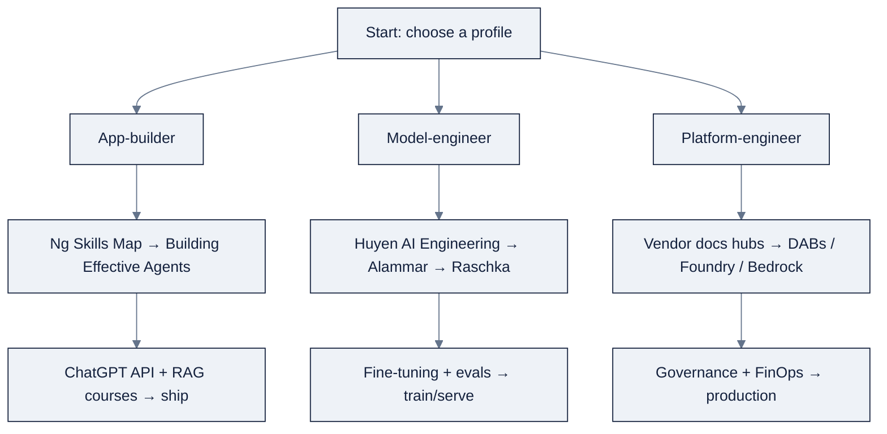

# 14: References & Bibliography

Purpose: the living source list behind the program, Ng's letters, textbooks, vendor agent references, DeepLearning.AI courses, Zorost Signals posts, benchmarks, and vendor docs hubs, each annotated with what it contributes **and when to read it**.

Part of AI Engineering Lab · Developed by Zorost Intelligence AI Lab · zorost.com

---

## How to use this list

Every week's README links back here. Each entry states, in one to three sentences, *what the source contributes*, *why it is in the program*, and now **"Read when"**, the week or section where it earns its place, so you can tell at a glance whether to read it before, during, or after a given week.

**Read-when conventions used below:**

| Tag | Meaning |
|---|---|
| `Week N` | Read during that curriculum week, alongside its lesson |
| `§ (a)-(g)` | A cross-reference to a section of this file |
| `Before Week N` | Prerequisite, read it to get the most out of that week |
| `Any time` | A reference you return to repeatedly, not a one-time read |

This is a **living list**. URLs rot, titles get renamed, and new editions ship. The policy is: *verify before you cite.* If a link 404s, check the publisher or vendor's own docs hub (section g) for the current canonical location; do not silently keep a dead link. When you fix or add an entry, date it. AI Engineering Lab content is original writing, these are sources, not copied material; brief quotes carry a citation inline wherever they appear.

---

## (a) Letters & essays

The intellectual backbone of the program. Andrew Ng's letters are the primary source for the four skills and three loops; the essays are the practitioner canon that operationalizes them.

- **Ng, *The AI Engineering Skills Map***, The Batch issue 366, **14 Aug 2026**: https://www.deeplearning.ai/the-batch/issue-366 · also posted as an X article: https://x.com/AndrewYNg/status/2088302050706686198
  *Contributes:* the four skills (building & deploying AI applications, software engineering fundamentals, using coding agents, shaping the build) and the "skills not job titles" terminology. This is the map the whole program is built on.
  *Read when:* **Week 1** (and re-read at Week 12), it is the program's north star.

- **Ng, *Three Key Loops for Building Great Software***, The Batch, **2026**: https://www.deeplearning.ai/the-batch/three-key-loops-for-building-great-software
  *Contributes:* the agentic coding → developer feedback → external feedback loops, and the "context advantage" humans retain over AI. The operating rhythm of Weeks 12 to 13 and beyond.
  *Read when:* **Week 12**, before you start driving a coding agent.

- **Ng, *Make All Your Tokens (and Your Brainwork) Count***, The Batch: https://www.deeplearning.ai/the-batch/make-all-your-tokens-and-your-brainwork-count
  *Contributes:* "AI tokens are cheap; human tokens are gold", the economics behind spec-driven development, persisting decisions in `SPEC.md`, and the 0-to-1 "inferior spec + cheap prototype" exception. The most direct elaboration of *shaping the spec*.
  *Read when:* **Week 13**, the spec-driven development week.

- **Ng, *Coding Agents Accelerate Some Software Tasks More Than Others***, The Batch: https://www.deeplearning.ai/the-batch/coding-agents-accelerate-some-software-tasks-more-than-others
  *Contributes:* acceleration is uneven, frontend > backend > infrastructure > research. The reason not to promise infra or research work at frontend speed, and to keep a skilled human on backend corner cases, security, and migrations.
  *Read when:* **Week 13**, when setting expectations for what your agent can do.

- **Ng, *Improve Agentic Performance with Evals and Error Analysis, Part 1* & *Part 2***, The Batch: https://www.deeplearning.ai/the-batch/improve-agentic-performance-with-evals-and-error-analysis-part-1 · https://www.deeplearning.ai/the-batch/improve-agentic-performance-with-evals-and-error-analysis-part-2
  *Contributes:* the evals-first + error-analysis-second loop, human-level parity (HLP), reading traces, and changing workflow shape before changing the model. The core of Week 11 and `07-evals-error-analysis.md`.
  *Read when:* **Week 11**, the evals & error-analysis week.

- **Husain, Hamel, *Your AI Product Needs Evals***, 2024: https://hamel.dev/blog/posts/evals/
  *Contributes:* a short, high-leverage argument that evals, not model upgrades, are the best investment for LLM products, with a practical taxonomy (unit tests for models, LLM-as-judge). Turns Ng's message into a concrete engineering practice.
  *Read when:* **Week 11**, right after Ng's evals letters.

- **Yan, Bischof, Frye, Husain, Liu & Shankar, *What We Learned from a Year of Building with LLMs***, 2024 (later an O'Reilly book): https://applied-llms.org/
  *Contributes:* the definitive synthesis of production LLM lessons across ~50 practitioners and dozens of companies, organized as ~42 tactics over tactics → operations → strategy. The empirical backbone of the applied modules.
  *Read when:* **Weeks 6 to 11**, return to a specific tactic whenever the corresponding module appears.

---

## (b) Textbooks

The depth reads. Huyen is the spine; the others are the specific weeks' companions.

- **Chip Huyen, *AI Engineering: Building Applications with Foundation Models***, O'Reilly, 2025: https://www.oreilly.com/library/view/ai-engineering/9781098166298/
  *Contributes:* the field-defining reference for building, evaluating, and operating products on top of foundation models, evals, RAG, agents, fine-tuning, deployment, framed as *engineering* (systems, tradeoffs, operations), not prompting. The natural spine text for the whole program.
  *Read when:* **Weeks 5 to 11**, the spine; read the relevant chapter as each module lands.

- **Louis-François Bouchard & Louie Peters, *Building LLMs for Production***, 2024: https://www.oreilly.com/library/view/building-llms-for/9798324731472/
  *Contributes:* a shorter, code-forward handbook organized around the abilities that move an LLM from demo to production, grounding, tool use, safety. The practitioner's companion for the "ship something real" weeks.
  *Read when:* **Weeks 6 to 7**, grounding/tool use chapters.

- **Jay Alammar & Maarten Grootendorst, *Hands-On Large Language Models***, O'Reilly, 2024: https://www.oreilly.com/library/view/hands-on-large-language/9781098150952/
  *Contributes:* the best visual guide to how LLMs actually compute, embeddings, attention, fine-tuning, deployment, with diagrams and runnable notebooks. The intuition-builder for Week 5's internals.
  *Read when:* **Week 5**, before or during the internals lesson.

- **Aurélien Géron, *Hands-On Machine Learning with Scikit-Learn, Keras, and TensorFlow***, 3rd ed., O'Reilly, 2022: https://www.oreilly.com/library/view/hands-on-machine-learning/9781098125967/
  *Contributes:* the canonical classical-ML/neural-networks text, the end-to-end project workflow, data prep, evaluation, and deep learning. Its evaluation instincts (metrics, test distributions, error analysis) transfer directly to generative AI, and classical ML is still the right tool for tabular/structured problems. The Week 3 to 4 companion.
  *Read when:* **Weeks 3 to 4**, the classical ML and deep learning weeks.

- **Sebastian Raschka, *Build a Large Language Model (From Scratch)***, Manning, 2024: https://www.manning.com/books/build-a-large-language-model-from-scratch
  *Contributes:* the from-first-principles build of a GPT-style model, tokenization, attention, training, fine-tuning, in code. The deepest possible complement to Week 5: you do not need it to *use* LLMs, but reading it makes the internals concrete rather than metaphorical.
  *Read when:* **Week 5 (optional depth)** and **Week 10**, the fine-tuning chapter.

---

## (c) Vendor agent references

The "how to build agents" canon from the major labs. Primary reference material for skills 1 and 3.

- **Anthropic, *Building Effective Agents***, Dec 2024: https://www.anthropic.com/engineering/building-effective-agents
  *Contributes:* the most-cited agent-design essay, build the simplest thing that works (workflows before autonomous agents), and add agency only when complexity buys reliability. The Week 14 starting point.
  *Read when:* **Week 14**, before you write a single agent loop.

- **Anthropic, *Claude Code Best Practices***, 2025: https://code.claude.com/docs/en/best-practices
  *Contributes:* practical agentic-coding guidance (write `CLAUDE.md`, work incrementally, let the model verify its own work) that directly operationalizes Ng's skill 3. Used in Weeks 12 to 13.
  *Read when:* **Week 12**, when you write your first rules file.

- **OpenAI, *A Practical Guide to Building Agents***, 2025: https://cdn.openai.com/business-guides-and-resources/a-practical-guide-to-building-agents.pdf
  *Contributes:* a practitioner PDF covering single- vs. multi-agent design, the reason → act → observe loop, tool design, guardrails, and evals, with an SDK-and-deployment orientation. The agent-construction complement to Anthropic's essay.
  *Read when:* **Weeks 14 to 16**, the agent-building weeks.

- **Google, *Agents* whitepaper**, 2024: https://www.kaggle.com/whitepaper-agents
  *Contributes:* the canonical definition, an agent is an application using an LLM plus tools and orchestration to achieve a goal, and the cognitive architecture (model → orchestration → tools). The vocabulary for Weeks 14 to 15.
  *Read when:* **Week 14**, to lock down the definitions.

- **Google, *Multi-Agent Systems* whitepaper**, 2025: https://www.kaggle.com/whitepaper-multi-agent-systems
  *Contributes:* the follow-up focused on multi-agent architectures and their evaluation; part of Google's expanding agent-whitepaper series. The Week 16 reference.
  *Read when:* **Week 16**, the multi-agent week.

- **Microsoft, Agent Framework** (Semantic Kernel / AutoGen ecosystem), 2025: https://learn.microsoft.com/en-us/dotnet/ai/ai-agents-dotnet
  *Contributes:* enterprise multi-agent orchestration, observability, and integration patterns from the .NET/Azure side of the ecosystem. The "agents inside enterprise platforms" perspective for Weeks 18 and 24.
  *Read when:* **Week 18**, the Azure AI Foundry week.

---

## (d) DeepLearning.AI courses relevant to the program

Ng's catalog maps cleanly onto the four skills. This table pairs each with the week it supports, treat them as optional-but-recommended, not required. **Read when** = the `Pairs with` column.

| Course | Instructor | Why it matters | Read when (Pairs with) |
|---|---|---|---|
| AI Python for Beginners | Andrew Ng | An LLM-assisted intro to Python; lowers the barrier to the coding baseline everything else needs. | Week 1 |
| Machine Learning Specialization | Andrew Ng | The classical-ML substrate (supervised-learning evaluation intuitions) that transfers to generative AI. | Week 3 |
| Deep Learning Specialization | Andrew Ng | Neural-net and training intuitions, backprop, regularization, evaluation, under the modern stack. | Week 4 |
| How Transformer LLMs Work | Jay Alammar & Maarten Grootendorst | The correct mental model of how an LLM computes; underpins context engineering, cost, and debugging. | Week 5 |
| Building Systems with the ChatGPT API | Isa Fulford & Andrew Ng | Turns a model API into a *system*, chaining, token/cost accounting, classification, moderation. | Week 6 |
| Large Language Models with Semantic Search | Jay Alammar & Luis Serrano | Embeddings, dense retrieval, and reranking, the foundation of RAG. | Week 7 |
| Vector Databases: from Embeddings to Applications | Sebastian Witalec (Weaviate) | Hands-on with the retrieval store that powers RAG at scale. | Week 7 |
| Knowledge Graphs for RAG | Andreas Kollegger (Neo4j) | Graph-structured retrieval for multi-hop questions vector search alone cannot answer. | Week 7 |
| Building and Evaluating Advanced RAG | Jerry Liu & Anupam Datta | Sentence-window retrieval, reranking, and RAG *evaluation* (context relevance, groundedness, answer relevance). | Week 7, 11 |
| Preprocessing Unstructured Data for LLM Applications | Matt Robinson (Unstructured) | Ingestion quality bounds RAG quality, the "garbage in" guardrail. | Week 7 |
| Open Source Models with Hugging Face | Khalusova, Belkada, Sun | Open-weight models via the Hub, central to local and air-gapped deployments. | Week 8 |
| Generative AI with LLMs | Barth, Fregly, Eigenbrode, Chambers (AWS) | The flagship survey: transformers, prompting, PEFT/LoRA, RLHF, deployment tradeoffs. | Weeks 9 to 10 |
| Fine-tuning & RL for LLMs: Intro to Post-training | DeepLearning.AI | When to fine-tune (after the eval says prompt+RAG isn't enough) and how. | Week 10 |
| Evaluating and Debugging Generative AI | Andrew Ng & Carey Phelps (Weights & Biases) | Direct teaching of the evals + error-analysis loop, instrumenting, logging traces, debugging from them. | Week 11 |
| Automated Testing for LLMOps | DeepLearning.AI | CI-style testing for LLM apps; turns evals into a repeatable gate. | Week 11 |
| AI Agents in LangGraph | Harrison Chase (LangChain) | Persistence, human-in-the-loop, and state machines for *controllable* agents. | Week 15 |
| Long-Term Agentic Memory With LangGraph | LangChain team | Memory architectures for agents, a live frontier topic. | Week 14 |
| MCP: Build Rich-Context AI Apps with Anthropic | Anthropic × DeepLearning.AI | The Model Context Protocol for standard tool/data access, the interoperability layer. | Week 16 |
| LLMOps | Erwin Huizenga (Google Cloud) | Data pipelines, fine-tuning, deployment, and monitoring on Vertex AI, the production-operations layer. | Week 19, 24 |

> Catalog root: https://www.deeplearning.ai/courses/

---

## (e) Zorost Signals posts

Zorost's own published analysis and engineering notes, the primary source for the program's extensions to Ng's map. Individual post URLs are not all pinned in the research notes; the canonical skills-map guide is linked, and the rest live on the Signals blog at zorost.com (verify the current URL on the index before citing).

- **The AI Engineering Skills Map, turned into a training plan** (Dr. Fereydun Hashemi, 16 Aug 2026): https://zorost.com/ai-engineering-skills-map-training-guide
  *Contributes:* the systems-engineering spine, the seven assumed competencies, the "implementation is cheap / deciding what to implement is expensive" thesis, and the six-block twelve-week programme. **The single most important Zorost source for this program.**
  *Read when:* **Week 1**, it frames the whole program.

- **Agent harness architecture**: the loop itself: how the agent runtime, context, and tools fit together. Supports Weeks 12 to 13.
  *Read when:* **Week 12**.

- **The evaluation harness**: Zorost's engineering detail on building the eval machinery behind area one. Supports Week 11.
  *Read when:* **Week 11**.

- **Context engineering as a budget**: retrieval and the token/window problem treated as a design artifact. Supports Weeks 6 to 7.
  *Read when:* **Weeks 6 to 7**.

- **Cost and latency engineering**: cost per resolved task and latency budgets as architecture constraints. Supports Weeks 9 to 10.
  *Read when:* **Weeks 9 to 10**.

- **Prompt injection and LLM security**: the trust-boundary work for systems that read untrusted text. Supports Week 17.
  *Read when:* **Week 17**.

- **Agent failure taxonomy: ten classes, with recovery for each** (24 Jul 2026), a classification of how agents fail and how to recover. Supports Weeks 14 to 17.
  *Read when:* **Week 14** (and keep it open through Week 17).

- **Structured output: getting data instead of prose from a model** (24 Jul 2026), schema-constrained generation. Supports Weeks 6, 11, 14.
  *Read when:* **Week 6** (then Week 11, 14).

---

## (f) Benchmark landscape

These benchmarks define how "coding agents" and "tool agents" are measured. The program teaches them as *concepts*, what they measure and why a *validated* eval set matters, not as leaderboards to chase.

- **SWE-bench / SWE-bench Verified** (Princeton, 2023 to 2024): https://www.swebench.com/ · arXiv:2310.06770
  *Contributes:* real GitHub issues from popular Python repos, graded by whether a patch passes hidden tests. The **Verified** 500-task subset (human-validated to remove under-specified issues) became the standard coding-agent leaderboard. Teaches why a validated eval set matters. Supports Weeks 12 to 13.
  *Read when:* **Week 12**, when you start measuring coding agents.

- **Terminal-Bench** (Stanford/Laude Institute, 2025): https://www.tbench.ai/ · arXiv:2504.06051
  *Contributes:* agents graded on *terminal/CLI* tasks (shell, file systems, package management) rather than repo patches, a broader "computer use" signal. Supports Weeks 12 to 13.
  *Read when:* **Week 13**.

- **τ-bench / τ²-bench** (Sierra Research, 2024 to 2025): https://github.com/sierra-research/tau-bench · arXiv:2406.12045
  *Contributes:* tool-agent-user interaction in realistic domains (retail, airlines) where an agent must use APIs and converse with a simulated user. Teaches evaluation of agentic conversation + tool use, the territory beyond code generation. Supports Weeks 14, 16.
  *Read when:* **Week 14**, it is the model for the Week 16 support-agent eval.

---

## (g) Vendor docs hubs

The authoritative references for the platform weeks. When a vendor detail matters, go to the source, these are where the program's platform-specific claims are checked.

- **Databricks documentation**: https://docs.databricks.com
  *Contributes:* Unity Catalog, Delta Lake, Lakeflow, Mosaic AI, Agent Bricks, and DABs. The backbone of Weeks 21 to 24.
  *Read when:* **Weeks 21 to 24**, the machine-readable index `https://docs.databricks.com/llms.txt` is your lookup entry point.

- **Microsoft Learn (Azure AI)**: https://learn.microsoft.com
  *Contributes:* Azure AI Foundry, the Microsoft Agent Framework, and enterprise AI governance. The backbone of Week 18.
  *Read when:* **Week 18**.

- **Google Cloud AI (Vertex AI)**: https://cloud.google.com/vertex-ai
  *Contributes:* Vertex AI, Gemini, AI Studio, and Google's agent tooling. The backbone of Week 19.
  *Read when:* **Week 19**.

- **AWS documentation (Bedrock / SageMaker AI)**: https://docs.aws.amazon.com
  *Contributes:* Bedrock, SageMaker AI, and the AWS AI/ML service surface. The backbone of Week 20.
  *Read when:* **Week 20**.

---

## (h) Reading-order paths for three learner profiles

Not everyone needs everything in the same order. Three paths through this list, each with a
minimal spine first and the depth reads after.

### App-builder: ship LLM apps and agents fast

| Order | Source | Why first | When |
|---|---|---|---|
| 1 | Ng, *AI Engineering Skills Map* | The four-skill frame; orients everything | Week 1 |
| 2 | Anthropic, *Building Effective Agents* | Simplest thing that works; the agent north star | Week 14 |
| 3 | OpenAI, *A Practical Guide to Building Agents* | The reason→act→observe loop in practice | Week 14 |
| 4 | *Building Systems with the ChatGPT API* + RAG courses | Chaining, cost, retrieval, the app toolkit | Weeks 6 to 7 |
| 5 | Hamel, *Your AI Product Needs Evals* | The eval habit before you scale anything | Week 11 |
| 6 | *Open Source Models with Hugging Face* | Local/air-gapped options | Week 8 |

### Model-engineer: train, fine-tune, and serve your own models

| Order | Source | Why first | When |
|---|---|---|---|
| 1 | Huyen, *AI Engineering* | The engineering frame for the whole stack | Week 5 |
| 2 | Alammar & Grootendorst, *Hands-On LLMs* | Internals before you touch weights | Week 5 |
| 3 | Raschka, *Build an LLM From Scratch* | Tokenization → attention → training, concretely | Weeks 5, 10 |
| 4 | *Generative AI with LLMs* + *Fine-tuning & RL* | PEFT/LoRA, RLHF, when to fine-tune | Weeks 9 to 10 |
| 5 | Ng, *Evals and Error Analysis* + *Automated Testing for LLMOps* | The eval gate before/after every training run | Week 11 |

### Platform-engineer: govern and operate AI on cloud/lakehouse infrastructure

| Order | Source | Why first | When |
|---|---|---|---|
| 1 | Databricks docs hub + `llms.txt` | The lakehouse spine (UC, Delta, DABs) | Weeks 21 to 24 |
| 2 | Azure AI Foundry / Vertex / Bedrock docs | The three-cloud comparison | Weeks 18 to 20 |
| 3 | Microsoft Agent Framework | Enterprise agent orchestration | Week 18 |
| 4 | *LLMOps* (Google Cloud) | Production pipelines, deploy, monitor | Week 19, 24 |
| 5 | Ng, *Three Key Loops* + *Make Your Tokens Count* | Spec-driven, human-tokens-gold ops discipline | Weeks 12 to 13 |

**The common trunk:** all three profiles share the first three reads, the Skills Map (Week 1),
the evals letters (Week 11), and *Building Effective Agents* (Week 14). The profiles only diverge
in where they go deep.

---

## (i) How it breaks / common mistakes (how to misuse this list)

| Mistake | Symptom | Fix |
|---|---|---|
| Read every source cover-to-cover in order | Burnout before Week 6 | Use a profile path (§ h); read the spine, dip into the rest |
| Cited a dead link without checking | A 404 in your write-up | Verify against the vendor docs hub (§ g); update and date the entry |
| Treated benchmarks as leaderboards to chase | Optimizing for SWE-bench, not your task | Teach them as *concepts*, a validated eval set matters, the leaderboard doesn't |
| Skipped the "read when" timing | A dense read at the wrong week | Follow the `Week N` tags; each source lands when its module does |
| Confused "open weights" with "open license" | A legal surprise at ship time | See `08-local-inference-gpu.md` §1, license, not download, decides |

The through-line: **this list is a map, not a syllabus to exhaust.** The verification policy and
the profile paths exist so you spend your reading budget where it compounds.

---

## (j) Self-check questions

1. **What two annotations does every entry in this file carry?**
   *A:* "What it contributes" and "Read when", the contribution and the week/section where it lands.

2. **What is the verification policy, in one sentence?**
   *A:* Verify before you cite, if a link 404s, find the canonical location on the vendor's docs hub, fix it, and date the change; never silently keep a dead link.

3. **Which three reads are shared by all three learner profiles?**
   *A:* Ng's Skills Map (Week 1), the evals letters (Week 11), and *Building Effective Agents* (Week 14).

4. **Why are benchmarks taught as concepts rather than leaderboards?**
   *A:* Because a *validated* eval set is what transfers to your own task; chasing a public leaderboard optimizes for someone else's metric, not your product.

5. **Where do you go first when a Databricks or cloud detail matters?**
   *A:* The vendor docs hub (§ g), `docs.databricks.com/llms.txt` for Databricks, the platform docs for Azure/Vertex/Bedrock.

**Passing bar:** 5/5, these five (the two annotations, the policy, the shared trunk, the
benchmark stance, and the docs-first habit) are how you use this list without drowning in it.

---

## Sources

The entries above are the sources; the links embedded in each are the canonical locations. Where a Zorost Signals post lacks a pinned URL, it resolves to the Signals index at https://zorost.com, verify before citing per the policy at the top of this file.
