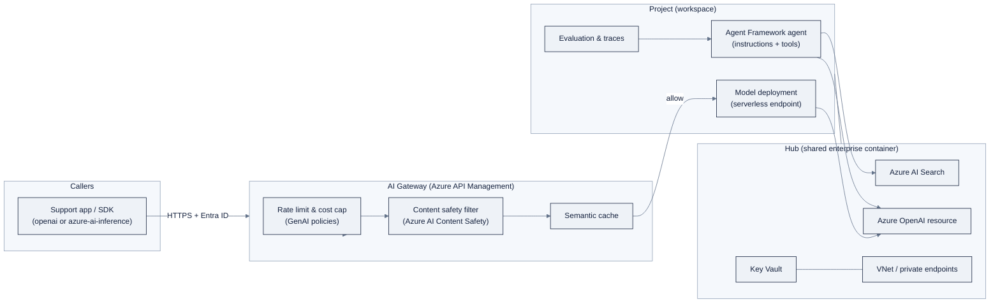

> **Part of AI Engineering Lab · Developed by Zorost Intelligence AI Lab · [zorost.com](https://zorost.com)**

# Azure AI Foundry: Module Guide

> **Week 18 · Cloud AI Platforms · Microsoft** · *Deploy the ZoroLogistics support agent
> with online evaluation and AI Gateway governance.*

This is the hands-on guide for Week 18. Read [reference/knowledge-base/12-cloud-platforms.md](../../knowledge-base/12-cloud-platforms.md)
for the full Foundry mental model; this README is the runbook, what to set up, what code to
run, and what to watch out for.

> **⚠️ Verify against live docs.** Microsoft has renamed this portal more than once (Azure AI
> Studio → Azure AI Foundry → "Microsoft Foundry" in places), and the model lineup, SDK
> imports, CLI commands, and prices in this file churn quickly. Treat every *specific* model
> name, SDK import, CLI flag, and price below as "correct at time of writing, subject to
> change", click through to the links in [Sources](#sources) before you publish or build on
> any of them.

## 1. Overview: what Foundry is and when to use it

**Azure AI Foundry** (recently rebranded in places as "Microsoft Foundry") is Microsoft's
unified enterprise platform for building, evaluating, deploying, and governing generative-AI
apps. It glues together Azure OpenAI, Azure AI Search, Azure AI Content Safety, and Azure
Machine Learning behind one portal and one set of SDKs.

Its defining idea is the **hub-and-project hierarchy**:

- **Hub**: the shared enterprise container. Owns the Azure OpenAI instances, AI Search
  indexes, storage, key vaults, and the network boundary. Governance, identity, and security
  are configured once here.
- **Project**: the workspace where a team works: deployments, fine-tuning jobs, flows,
  evaluation runs, traces, and agent definitions.

**When to use it:** you are heading toward Azure/Entra-heavy enterprises, want managed
identity + role-based access over API keys, or need the AI Gateway governance pattern
(rate limits, content safety, cost caps) that real Azure deployments use. If you just want
the fastest possible model call, Google AI Studio's free tier is quicker; if you want a
single provider-neutral API, Bedrock's Converse API is cleaner. Foundry's payoff is
**governance**.

### The shape of the whole system

Here is the Week 18 target architecture in one picture. Read it top-to-bottom: a client
hits the **AI Gateway** first, which enforces policy before forwarding to a **deployment**,
which is attached to a **project** that lives under a **hub**.



The one sentence that explains Foundry's enterprise value: **the gateway and the hub are
configured once by central IT; the builders get freedom inside the project.** You are both
roles this week, wear the platform hat in Section 4, then the builder hat in Sections 5 to 7.

## 2. Day-0 setup

### What you need

- An **Azure subscription** (free tier works for the labs).
- Access to the [AI Foundry portal](https://ai.azure.com) (now surfaced from the Azure portal).

### Create the hub and project (portal)

1. Open `ai.azure.com`, sign in with your Entra ID (Azure AD) account.
2. **Create a hub** (or "AI resource"). Name it e.g. `zorost-hub`. Choose a resource group
   and region. The hub bundles the shared resources, including, if you opt in, an Azure
   OpenAI resource, an AI Search resource, and a storage account.
3. **Create a project** inside the hub, e.g. `zoro-support-agent`. A project is the
   workspace you'll do the Week 18 work in.
4. Note the **project connection string** (available in the project overview). You'll use it
   in code.

> The hub/project split is the point of the exercise. Central IT (you, wearing the platform
> hat) owns the hub; the builder (you, wearing the developer hat) works inside the project
> without re-plumbing infrastructure.

### Create via CLI

The `az` CLI plus the Foundry extensions cover the same ground:

```bash
# install / update the Azure CLI ML + Foundry extensions
az extension add --name ml
az extension add --name ai-foundry # name may vary, see the install docs linked below

az login

# create a resource group, then a hub (AI resource) and a project
az group create --name rg-zorost --location eastus
az ml workspace create --name zorost-hub --resource-group rg-zorost --kind hub
az ai project create --name zoro-support-agent --resource-group rg-zorost \
    --hub-name zorost-hub
```

Microsoft also ships the **Azure Developer CLI (`azd`) Foundry extensions** for a
scaffold-and-deploy agent workflow (`azd ai agent ...`), the "hosted agent" path. See the
install docs in [Sources](#sources).

> **CLI gotcha:** the extension name and sub-command spelling have changed between releases
> (`ai-foundry` vs `foundry` vs `azd ai`). Run `az extension list` / `az ai --help` / `azd ai
> agent --help` to discover the current surface rather than memorizing it, this is exactly
> the "discover the command, don't guess the flag" habit the Databricks modules install.

### Authenticate from code

- **Recommended:** Entra ID via `DefaultAzureCredential` (from `azure-identity`), no keys.
- **Quick start:** Azure OpenAI resources still expose API keys.

For the labs, the OpenAI SDK path with an API key is the simplest first win; switch to
managed identity when you read the governance section.

```bash
pip install openai azure-identity azure-ai-projects azure-ai-inference azure-ai-evaluation
```

## 3. Model catalog & serverless endpoints

The **model catalog** has two families:

1. **Azure OpenAI models**: GPT-4.1, GPT-4o, the o-series reasoning models, Phi-4, and
   embeddings (deployed into an Azure OpenAI resource).
2. **Open/third-party models**: Llama, Mistral, Cohere, DeepSeek, via **serverless API
   endpoints** (Models-as-a-Service): a Microsoft-managed, metered endpoint, no infra to own.

### The full worked walkthrough (hub → project → catalog → endpoint → SDK call)

This is the complete Week 18 "hello world, end to end." Follow it in order; each step
produces the value the next step consumes.

**Step 1: Hub.** You create the shared container (portal or `az ml workspace create --kind
hub`, above). It owns the Azure OpenAI resource that will actually host the GPT/o-series
deployment.

**Step 2: Project.** You create the workspace where the work happens (`az ai project
create`, above). Copy the **project connection string** from the portal's project overview,
it looks like `azureml://subscriptions/<sub>/resourceGroups/<rg>/providers/Microsoft.MachineLearningServices/workspaces/<project>`.

**Step 3: Model catalog.** In the portal, open **Model catalog** and pick a model. For the
support agent, choose `gpt-4.1` (or a cheaper `gpt-4.1-mini` for the first smoke test). Note
the distinction as you browse:

- **Azure OpenAI models** deploy *into* the hub's Azure OpenAI resource and are called with
  the Azure OpenAI endpoint + API version.
- **Serverless catalog models** (Phi, Llama, Mistral, DeepSeek) deploy as a *standalone*
  serverless endpoint with its own URL + key.

**Step 4: Deploy.** Click **Deploy** on the chosen model, give it a **deployment name**
(e.g. `zoro-support-model`), and confirm. The deployment name is what your code will use as
`model=`: **not** the raw model ID. This is the single most common Week 18 error.

**Step 5: SDK call.** Copy the endpoint URL + key (or use managed identity), then:

```python
import os
from openai import AzureOpenAI

client = AzureOpenAI(
    azure_endpoint=os.environ["AZURE_OPENAI_ENDPOINT"],   # https://<resource>.openai.azure.com
    api_key=os.environ["AZURE_OPENAI_API_KEY"],           # or DefaultAzureCredential()
    api_version="2024-10-21",
)

resp = client.chat.completions.create(
    model="zoro-support-model",     # your *deployment name*, not the raw model id
    messages=[{"role": "user", "content": "Explain a hub vs a project in AI Foundry."}],
)
print(resp.choices[0].message.content)
```

**Model-agnostic call (Azure AI Inference SDK) against a serverless endpoint:**

```python
import os
from azure.ai.inference import ChatCompletionsClient
from azure.identity import DefaultAzureCredential

client = ChatCompletionsClient(
    endpoint=os.environ["SERVERLESS_ENDPOINT"],
    credential=DefaultAzureCredential(),
)
resp = client.complete(
    model="Phi-4",                  # any catalog model
    messages=[{"role": "user", "content": "Hello"}],
)
print(resp.choices[0].message.content)
```

**Streaming** works the same as the OpenAI SDK, pass `stream=True` and iterate:

```python
stream = client.chat.completions.create(
    model="zoro-support-model",
    messages=[{"role": "user", "content": "Track shipment ZRL-1042."}],
    stream=True,
)
for chunk in stream:
    if chunk.choices and chunk.choices[0].delta.content:
        print(chunk.choices[0].delta.content, end="")
```

> **Gotcha:** `model=` is your **deployment name** in Azure, not the raw model ID. If you
> get a `DeploymentNotFound` / 404, you almost certainly passed the model ID instead of the
> name you gave the deployment in Step 4.

## 4. Building the ZoroLogistics support agent (Microsoft Agent Framework)

The Week 18 use case reuses the Week 14 to 16 support agent. On Foundry you rebuild it with
**Microsoft Agent Framework** (with the Azure AI Agent Service underneath): an agent =
**model + instructions + tools + optional grounding**.

Tools you'll wire (mirroring the Week 16 MCP server):

- **Function calling**: a `track_shipment` tool and a `check_refund_policy` tool.
- **File search / vector store**: ground answers in the Week 7 shipping-policy corpus.
- Optionally, **code interpreter** for quick table math.

### Step-by-step: build it with the SDK (`azure-ai-projects`)

This is the full, ordered recipe. Each step is a distinct call so you can see exactly which
piece does what.

**Step 1: Connect to the project.**

```python
import os
from azure.ai.projects import AIProjectClient
from azure.identity import DefaultAzureCredential

client = AIProjectClient.from_connection_string(
    conn_str=os.environ["PROJECT_CONNECTION_STRING"],
    credential=DefaultAzureCredential(),
)
```

**Step 2: Define the tools.** A function-calling tool is a name + JSON schema of its
arguments + a Python function. The agent never runs your function directly, it *requests*
the call, your runtime executes it, and you hand the result back. That round-trip is the
loop you hand-wrote in Week 14.

```python
import json

def track_shipment(tracking_number: str) -> str:
    """Return the current status and ETA for a tracking number."""
    # In the lab this reads the Week 1 synthetic shipments dataset.
    return json.dumps({"tracking_number": tracking_number,
                       "status": "in_transit", "eta": "2026-08-20"})

def check_refund_policy(amount: float) -> str:
    """Decide whether a refund is automatic or needs human approval."""
    return ("requires_human_approval" if amount > 500 else "auto_approved")
```

**Step 3: Register the tools and create the agent.** The schema tells the model how to
call each function; `instructions` is the system prompt (your Week 6 prompt skill applies
directly here).

```python
from azure.ai.projects.models import FunctionTool, ToolSet

track_tool = FunctionTool(
    name="track_shipment",
    description="Look up a shipment by tracking number.",
    parameters={
        "type": "object",
        "properties": {
            "tracking_number": {"type": "string",
                                "description": "The ZRL-xxxx tracking number."},
        },
        "required": ["tracking_number"],
    },
)

refund_tool = FunctionTool(
    name="check_refund_policy",
    description="Decide whether a refund amount needs human approval.",
    parameters={
        "type": "object",
        "properties": {"amount": {"type": "number"}},
        "required": ["amount"],
    },
)

agent = client.agents.create_agent(
    model="zoro-support-model",
    name="zoro-support-agent",
    instructions=(
        "You are the ZoroLogistics support agent. Help customers track shipments, "
        "answer shipping-policy questions from the provided files, and flag refund "
        "requests above $500 for human approval. Never invent a tracking number."
    ),
    toolset=ToolSet([track_tool, refund_tool]),
)
```

**Step 4: Run a conversation turn.** The `run` loop is where the tool round-trip happens:
the agent emits a `requires_action` status when it wants a tool, you execute it, and submit
the result.

```python
thread = client.agents.create_thread()
client.agents.create_message(
    thread_id=thread.id,
    role="user",
    content="Where is shipment ZRL-1042 and can I refund $800?",
)

run = client.agents.create_run(thread_id=thread.id, agent_id=agent.id)

# Poll until the run needs a tool or completes (simplified for the lab):
while run.status in ("queued", "in_progress"):
    run = client.agents.get_run(thread_id=thread.id, run_id=run.id)

if run.status == "requires_action":
    for tool_call in run.required_action.submit_tool_outputs.tool_calls:
        args = json.loads(tool_call.function.arguments)
        if tool_call.function.name == "track_shipment":
            output = track_shipment(**args)
        else:
            output = check_refund_policy(**args)
        client.agents.submit_tool_outputs(
            thread_id=thread.id, run_id=run.id,
            tool_outputs=[{"tool_call_id": tool_call.id, "output": output}],
        )

# read the assistant's final answer
messages = client.agents.list_messages(thread_id=thread.id)
print(messages.data[0].content[0].text.value)
```

> The `azure-ai-projects` API surface (class names like `FunctionTool`/`ToolSet`, the run
> polling statuses) is a moving target, verify the exact imports against the SDK version you
> installed and the docs in [Sources](#sources).

### Build it in the portal (the same thing, with a UI)

Playgrounds → **Agents** → New agent → choose a deployed model → write the system
instructions → add tools (functions, file search) → test in the playground. The portal is a
UI over the same SDK calls above, useful for a fast smoke test, but the SDK is the repeatable
artifact for the Week 18 deliverable.

### Deploy it

An agent can be exposed as a **hosted endpoint**, wired into a project, or run locally via
"Foundry Local." For Week 18, exposing it as an endpoint and putting the **AI Gateway** in
front of it (Section 6) is the deliverable.

**MCP note:** Foundry supports the **Model Context Protocol**, you can attach your Week 16
MCP server endpoints as tools, and APIM can convert APIs to MCP. If your MCP server is
already working, this is the fastest way to port the triage team.

## 5. Evaluation & tracing

- **Evaluation:** run built-in evaluators (groundedness, relevance, coherence, fluency) and
  custom/LLM-as-judge evaluators over a dataset, the Week 11 golden sets port straight in.
- **Tracing:** Foundry records end-to-end traces (inputs, tool calls, intermediate steps,
  outputs) for agents and flows, viewable in the portal.

### Set up an evaluation batch (with sample prompts)

The Week 18 checklist asks you to **run one online evaluation batch, read the trace, and fix
the worst failure**, the same error-analysis loop you installed in Week 11, now on
platform tooling.

**Step 1: Build the golden set.** A JSONL file where each line is one test case. The Week
11 golden set shape works unchanged; keep `context` (the retrieved policy passage) and
`ground_truth` (the expected answer) so the built-in evaluators have something to compare
against:

```jsonl
{"query": "Where is shipment ZRL-1042?", "context": "Tracking shows in transit, ETA 2026-08-20.", "ground_truth": "In transit, ETA 2026-08-20.", "expected_tool": "track_shipment"}
{"query": "Can I get a full refund for $1200 of damaged freight?", "context": "Refunds over $500 require human approval.", "ground_truth": "Requires human approval.", "expected_tool": "check_refund_policy"}
{"query": "What is the late-delivery compensation policy?", "context": "Carriers compensate 1% per day late, capped at 10%.", "ground_truth": "1% per day, capped at 10%."}
```

**Step 2: Write a thin target function** the evaluator can call. It takes one row and
returns the agent's answer (and ideally the citations/context it used):

```python
def answer(row: dict) -> str:
    # In the lab: run the agent turn from Section 4 and return the final text.
    # Placeholder showing the contract the evaluator expects:
    return f"Agent answer for: {row['query']}"
```

**Step 3: Run the batch.** Map each built-in evaluator to the columns it needs
(`query`, `response`, `context`, `ground_truth`):

```python
from azure.ai.evaluation import evaluate, RelevanceEvaluator, GroundednessEvaluator

result = evaluate(
    data="zorologistics_golden_set.jsonl",   # question / context / ground_truth
    target=answer,                            # function(row) -> response
    evaluators={
        "relevance": RelevanceEvaluator(model_config={"azure_endpoint": os.environ["AZURE_OPENAI_ENDPOINT"],
                                                     "azure_deployment": "zoro-judge-model",
                                                     "api_version": "2024-10-21"}),
        "groundedness": GroundednessEvaluator(model_config={"azure_endpoint": os.environ["AZURE_OPENAI_ENDPOINT"],
                                                           "azure_deployment": "zoro-judge-model",
                                                           "api_version": "2024-10-21"}),
    },
)
print(result["metrics"])          # aggregate scores
print(result["rows"]) # per-row scores, find the worst one here
```

**Step 4: Read the trace, fix the worst failure.** Sort `result["rows"]` by the lowest
metric, open that conversation in the portal's **Tracing** view, and find *why* it failed
(wrong tool called? context not retrieved? instruction ambiguity?). Fix the prompt or the
tool schema, re-run, and record the **before/after score**, that delta is the Week 18
proof of work, not a screenshot of the dashboard.

> The evaluator class names and `evaluate()` signature (`target=` vs `flow=`, and the
> `model_config` shape) have shifted across `azure-ai-evaluation` releases, verify against
> the installed version's docs.

## 6. AI Gateway governance

The **AI Gateway** is Foundry's governance layer, implemented via **Azure API Management
(APIM)** with **GenAI policies**, sitting in front of your endpoints. It gives you:

- **Token-rate limiting** and **token-usage quotas / cost caps**
- **Semantic caching** (serve identical/similar requests from cache)
- **Content-safety filtering** (Azure AI Content Safety)
- **Load balancing** across backends and **model routing**
- **API → MCP conversion** and governance of MCP tool calls

### What to configure for the use case

1. Put the support-agent endpoint behind APIM.
2. Add a **rate-limit policy** (e.g. cap requests and tokens per minute per consumer).
3. Add a **cost-cap / token-quota policy** so a runaway agent can't blow the budget.
4. Attach a **content-safety policy** (prompt shields, jailbreak detection) on both input
   and output.

### Policy examples

**Rate limit + cost cap (illustrative gateway JSON).** The Foundry gateway exposes these as
a JSON-shaped config; the underlying APIM policy language is XML, so the exact serialization
varies by how you apply it (portal form vs `az apim` vs Bicep). The *knobs* are what matter:

```json
{
  "name": "zoro-support-gateway",
  "policies": {
    "rateLimit": {
      "calls": 60,
      "renewalPeriod": "minute",
      "key": "subscription-id"
    },
    "tokenQuota": {
      "tokensPerPeriod": 120000,
      "period": "day",
      "onExceed": "reject"
    }
  }
}
```

Translated to the intent: **60 requests/minute per API-key consumer**, and a hard
**120,000-token/day budget** after which the gateway rejects rather than overruns. A runaway
agent is then a *bounded* failure, not an open bill.

**Content safety (Azure AI Content Safety JSON).** Configure severity thresholds for the
categories plus a blocklist; attach it to both request and response:

```json
{
  "contentSafety": {
    "hate": { "severity": "medium", "action": "block" },
    "sexual": { "severity": "medium", "action": "block" },
    "violence": { "severity": "medium", "action": "block" },
    "selfHarm": { "severity": "medium", "action": "block" },
    "promptShield": { "jailbreak": "block", "indirectAttack": "block" },
    "blocklist": ["competitor_rate_card", "unreleased_pricing"]
  }
}
```

> **Semantic cache** is the money-saver: two *different* phrasings of the same
> shipping-policy question return the *same* cached completion instead of a fresh token bill.
> It is a small config flag with an outsized cost effect on a high-Q&A support workload.

The APIM GenAI-policy reference is linked in [Sources](#sources). This is the enterprise
reality check: a deployed agent without a gateway is an unmetered liability; with one, it's
governed.

## 7. Cost notes & free-tier reality

- **Serverless/standard = pay-as-you-go** per token (input/output priced separately; output
  usually pricier). Start here.
- **Provisioned throughput (PTU)** reserves capacity for guaranteed throughput, it bills
  whether you use it or not. **Do not provision PTU for the labs.**
- **Fine-tuning** adds training cost plus per-hour hosting of the fine-tuned model.
- **Free tier:** the Azure free account gives credits and some services have free monthly
  allowances, but AI model inference generally isn't free, it's discounted/limited, not
  $0. Set a **budget + alert** on the subscription before you deploy anything.
- Azure generally prices at parity with OpenAI's own API for equivalent models, billed
  through Azure. Confirm on the live Azure OpenAI pricing page.

### Cost table for typical Week 18 usage

Per-1M-token prices are the fastest-moving number in this entire module, so the table gives
you **cost class** and **relative position** rather than figures you'd trust next quarter.
Look up the current per-1M-token rates on the live pricing page and drop them into the
right-hand column yourself, that is the actual skill.

| Model class | Typical use in the lab | Cost position (relative) | Billing model |
|---|---|---|---|
| o-series reasoning (o1/o3/o4-mini) | Hard BoL/edge-case extraction, agent planning | Highest (esp. output + reasoning tokens) | Per token |
| Frontier chat (GPT-4.1 / GPT-4o) | The support agent's brain | High | Per token (or PTU) |
| Mini chat (GPT-4.1-mini) | Smoke tests, batch evaluation judge | Low-mid | Per token |
| Small open (Phi-4) | Cheap local-substitute experiments | Lowest | Per token (serverless) |
| Embeddings (text-embedding-3) | Indexing the Week 7 policy corpus | Very low | Per token |

**Worked estimate (illustrative).** A support-agent workload of ~10,000 Q&A turns/month,
averaging 1,500 input + 400 output tokens per turn, is roughly **15M input + 4M output
tokens/month**. Plug the live rates into `15,000,000 × input_rate + 4,000,000 × output_rate`
and compare against the PTU commitment before you ever consider reserving capacity. For the
labs, that volume never happens, your entire Week 18 spend should fit inside a few dollars,
*provided* the gateway cost cap is on and you tear down idle endpoints.

**Week 18 cost-safety checklist:**
- [ ] Budget + alert set on the subscription before the first deploy.
- [ ] Serverless endpoints only; no PTU.
- [ ] AI Gateway cost cap in place before load-testing.
- [ ] Delete/stop endpoints and the test hub when done (or at least before the weekend).

## 8. Troubleshooting (6 common errors)

| # | Error | Likely cause | Fix |
|---|---|---|---|
| 1 | `DeploymentNotFound` / HTTP 404 | `model=` holds the **model ID**, not the **deployment name** | Use the exact deployment name from Step 4 of the walkthrough; it's what you named the deployment, not `gpt-4.1` |
| 2 | `AuthenticationError` / 401 | Wrong API key, or key-based auth where the resource now wants Entra | Re-check the key; in production switch to `DefaultAzureCredential()` + RBAC role on the resource |
| 3 | `InvalidApiVersion` / 400 on `api_version` | Pinned an API version that the resource doesn't support | Use a currently supported `api_version` (e.g. `2024-10-21`); verify against the live API-versions list |
| 4 | 429 (throttled) | Hit the endpoint's requests-per-minute or tokens-per-minute limit | Add backoff/retry, raise the limit in the gateway, or batch fewer calls; do **not** remove the cap to "fix" it |
| 5 | Agent run stuck in `requires_action` | You never submitted the tool output back to the run | In the run loop, after executing the tool call, call `submit_tool_outputs`; a run left in `requires_action` eventually times out |
| 6 | `PermissionDenied` / RBAC error | Managed identity lacks a role on the project/resource | Grant the least-privilege role (e.g. `Azure AI Developer` on the project, `Cognitive Services OpenAI User` on the Azure OpenAI resource) |

> **Verify against live docs.** Error strings, API versions, and RBAC role names change with
> each SDK/release. When one of the above doesn't match what you see, search the current
> Microsoft Learn page, the *diagnosis* (which layer failed) is stable even when the exact
> message moves.

## Week 18 notebooks

The runnable artifacts live in `curriculum/week-18/notebooks/`:

- `01-foundry-serverless-endpoints.ipynb`: deploy + call a serverless model from both the
  OpenAI SDK and the Azure AI Inference SDK.
- `02-foundry-agent-evaluation.ipynb`: build the Agent Framework support agent, run an
  evaluation batch, and read the trace.

## Sources

- Azure AI Foundry architecture: https://learn.microsoft.com/en-us/azure/ai-foundry/concepts/architecture
- Azure OpenAI Service models: https://learn.microsoft.com/en-us/azure/ai-services/openai/concepts/models
- Microsoft Agent Framework overview: https://learn.microsoft.com/en-us/agent-framework/overview/
- Azure AI Projects client library (JS): https://learn.microsoft.com/en-us/javascript/api/overview/azure/ai-projects-readme
- Connect agents to MCP server endpoints: https://learn.microsoft.com/en-us/azure/foundry/agents/how-to/tools/model-context-protocol
- Install the Azure Developer CLI Foundry extensions: https://learn.microsoft.com/en-us/azure/foundry/agents/how-to/install-cli-foundry-extensions
- Deploy models as serverless APIs: https://learn.microsoft.com/en-us/azure/ai-studio/how-to/deploy-models-serverless
- Azure AI Foundry deployment options: https://learn.microsoft.com/en-us/azure/ai-foundry/concepts/deployments-overview
- Prompt flow (Azure Machine Learning): https://learn.microsoft.com/en-us/azure/machine-learning/prompt-flow/community-ecosystem
- Azure API Management GenAI gateway policies: https://github.com/microsoft/azure-skills/blob/main/.github/plugins/azure-skills/skills/azure-aigateway/SKILL.md
- Azure OpenAI chat completion (OpenAI SDK): https://learn.microsoft.com/en-us/azure/ai-foundry/openai/how-to/chatgpt

> *Original AI Engineering Lab writing; verify specific model names, SDK versions, and prices
> against the live links above, Microsoft's portal and SDK naming churns quickly.*

---

© 2026 Zorost Intelligence LLC · [zorost.com](https://zorost.com)
