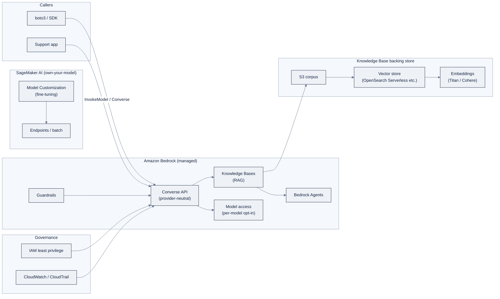

> **Part of AI Engineering Lab · Developed by Zorost Intelligence AI Lab · [zorost.com](https://zorost.com)**

# AWS Bedrock: Module Guide

> **Week 20 · Cloud AI Platforms · AWS** · *A Bedrock RAG support agent with Guardrails,
> plus the three-cloud comparison matrix.*

This is the hands-on guide for Week 20. Read [reference/knowledge-base/12-cloud-platforms.md](../../knowledge-base/12-cloud-platforms.md)
for the full Bedrock vs SageMaker mental model; this README is the runbook.

> **⚠️ Verify against live docs.** Bedrock model IDs carry dated suffixes and get superseded
> often; Guardrails/AgentCore capabilities and per-1M-token prices move fast. Treat every
> specific model ID, API field, and price in this file as "correct at time of writing, subject
> to change", click through to the links in [Sources](#sources) before you rely on any of
> them.

## 1. Overview: Bedrock vs SageMaker: the mental model

AWS's generative-AI story is **two complementary layers**:

- **Amazon Bedrock**: the managed foundation-model layer. Call models as an API without
  running infrastructure, unified behind one **Converse API**, with RAG, agents, guardrails,
  and evals layered on top.
- **SageMaker AI**: the build/train/deploy-your-own-model layer. Bring your own data and
  models, train on managed clusters (HyperPod, JumpStart), deploy to endpoints.

**The rule:** Bedrock = consume models + managed GenAI features. SageMaker = build,
fine-tune, and serve models you own. A production RAG app commonly uses **Bedrock (model +
Knowledge Bases)** and reaches for **SageMaker only if fine-tuning**. Around them sit
**Amazon Q** (assistants you buy) and **PartyRock** (a free no-code playground).

**When to use Bedrock over the other clouds:** you want the cleanest provider-neutral API
(the Converse API), you're already on AWS, or you value the managed RAG/agent/guardrails
arc. If you want the fastest free "hello world," Google AI Studio is quicker; if you need
Microsoft's hub/project governance model, Foundry is the fit.

### Decision table: Bedrock vs SageMaker

| Question | If yes → | Why |
|---|---|---|
| Am I *calling* a foundation model (Claude/Nova/Llama/Mistral)? | **Bedrock** | Serverless API, no endpoints to run |
| Am I building RAG / an agent / safety filters on top? | **Bedrock** | Knowledge Bases, Agents, Guardrails are managed |
| Am I *fine-tuning* a model I own? | **SageMaker** | Model Customization is the training path |
| Am I deploying my own/custom model behind an endpoint? | **SageMaker** | Endpoints, batch, autoscaling |
| Do I need an enterprise-ready **code-first** agent runtime (LangGraph/Strands)? | **Bedrock (AgentCore)** | Managed memory/sessions/gateway for your framework |
| Do I want a zero-code "taste of Bedrock" today? | **PartyRock** | Free drag-and-drop playground |

### The shape of the whole system



Two lessons in the diagram: (1) **everything on Bedrock is behind one `Converse` surface**,
so the model ID is a dial you turn rather than code you rewrite; (2) **IAM sits across every
arrow**, there are no API keys, only policies, and model access is an explicit opt-in.

## 2. Day-0 setup

### What you need

- An **AWS account** (free tier works for the labs).
- The **AWS CLI** and a configured profile.

```bash
# configure credentials (env, SSO, or instance role, no keys in code)
aws configure            # or: aws sso login
aws sts get-caller-identity   # confirm who you are and which account
```

### IAM least privilege

AWS has **no API keys for models**, everything is IAM. Create a least-privilege policy
scoped to what the labs actually need, attach it to a role/user, and use it for the week:

```json
{
  "Version": "2012-10-17",
  "Statement": [
    {
      "Sid": "BedrockInvoke",
      "Effect": "Allow",
      "Action": [
        "bedrock:ListFoundationModels",
        "bedrock:Converse",
        "bedrock:ConverseStream",
        "bedrock:InvokeModel",
        "bedrock:Retrieve",
        "bedrock:RetrieveAndGenerate"
      ],
      "Resource": "arn:aws:bedrock:us-east-1::foundation-model/*"
    },
    {
      "Sid": "BedrockRAGAndGuardrails",
      "Effect": "Allow",
      "Action": [
        "bedrock:Retrieve",
        "bedrock:RetrieveAndGenerate",
        "bedrock:CreateGuardrail",
        "bedrock:ApplyGuardrail",
        "bedrock:CreateAgent",
        "bedrock:InvokeAgent"
      ],
      "Resource": [
        "arn:aws:bedrock:us-east-1:*:knowledge-base/*",
        "arn:aws:bedrock:us-east-1:*:guardrail/*",
        "arn:aws:bedrock:us-east-1:*:agent/*"
      ]
    }
  ]
}
```

The three habits this encodes, which matter more than the exact ARNs:

1. **Explicit allow-list**: only the Bedrock actions the labs use; no wildcard on `Action`.
2. **Resource scoping**: the first statement scopes to foundation-model ARNs, the second to
   knowledge-base/guardrail/agent ARNs, not `*` everywhere.
3. **No admin anywhere**: the policy cannot do anything except invoke and configure the
   specific GenAI resources. In production you'd also add a `Condition` to pin the region
   and block specific model IDs you haven't approved.

> **Do not use `"Resource": "*"` on admin actions.** For the labs the *habits* (explicit
> allow-list, least privilege, no `*` on admin actions) matter more than the exact ARNs,
> but write the scoped version above so the muscle memory is correct.

### Model access requests

Bedrock models are **not enabled by default**, you must opt in per model, per region:

1. Bedrock console → **Model access** → request access to the models you need (Claude,
   Nova, Llama, or whichever the labs use).
2. Approval is usually instant for most models; some (notably Claude) require agreeing to
   the vendor's EULA.

Until you enable a model, invoking it returns an `AccessDeniedException`, not a code bug.

### Authenticate from code

`boto3` picks up credentials from the environment, an EC2 instance role, or SSO
(`aws sso login`). No keys in code.

## 3. Converse API quickstart

The **Converse API** is the recommended, provider-neutral surface: one request/response
format (system/messages/tool-calling) across Claude, Nova, Llama, and Mistral, swap the
`modelId` and nothing else.

```python
import boto3

client = boto3.client("bedrock-runtime", region_name="us-east-1")

resp = client.converse(
    modelId="anthropic.claude-3-5-sonnet-20241022-v2:0",   # or a Nova/Llama/Mistral id
    messages=[
        {"role": "user", "content": [{"text": "Explain Bedrock vs SageMaker."}]}
    ],
)
print(resp["output"]["message"]["content"][0]["text"])
```

### Walkthrough: system prompt, tool use, and streaming

**Step 1: System prompt + user turn.** The `system` list and the `messages` list are
provider-neutral; the model sees both.

```python
resp = client.converse(
    modelId="anthropic.claude-3-5-sonnet-20241022-v2:0",
    system=[{"text": "You are the ZoroLogistics support agent. Never invent tracking numbers."}],
    messages=[{"role": "user", "content": [{"text": "Where is ZRL-1042?"}]}],
)
print(resp["output"]["message"]["content"][0]["text"])
```

**Step 2: Tool use.** Declare a tool; when the model wants it, it returns a `toolUse`
block, and you reply with a `toolResult` in the next turn. This is the same loop you
hand-wrote in Week 14, expressed in the Converse shape:

```python
resp = client.converse(
    modelId="anthropic.claude-3-5-sonnet-20241022-v2:0",
    toolConfig={
        "tools": [
            {
                "toolSpec": {
                    "name": "track_shipment",
                    "description": "Look up a shipment by tracking number.",
                    "inputSchema": {
                        "json": {
                            "type": "object",
                            "properties": {"tracking_number": {"type": "string"}},
                            "required": ["tracking_number"],
                        }
                    },
                }
            }
        ]
    },
    messages=[{"role": "user", "content": [{"text": "Track ZRL-1042."}]}],
)

# the model asks to call the tool
if resp["stopReason"] == "tool_use":
    tool_use = next(b for b in resp["output"]["message"]["content"] if "toolUse" in b)["toolUse"]
    result = {"tracking_number": "ZRL-1042", "status": "in_transit", "eta": "2026-08-20"}
    # second turn: return the result
    resp2 = client.converse(
        modelId="anthropic.claude-3-5-sonnet-20241022-v2:0",
        messages=[
            {"role": "user", "content": [{"text": "Track ZRL-1042."}]},
            {"role": "assistant", "content": resp["output"]["message"]["content"]},
            {"role": "user", "content": [{"toolResult": {
                "toolUseId": tool_use["toolUseId"],
                "content": [{"json": result}],
            }}]},
        ],
    )
    print(resp2["output"]["message"]["content"][0]["text"])
```

**Step 3: Streaming.** Use `converse_stream` and iterate the event stream; text arrives in
`contentBlockDelta` events.

```python
stream = client.converse_stream(
    modelId="anthropic.claude-3-5-sonnet-20241022-v2:0",
    messages=[{"role": "user", "content": [{"text": "Summarize the refund policy."}]}],
)
for event in stream["stream"]:
    if "contentBlockDelta" in event:
        text = event["contentBlockDelta"]["delta"].get("text", "")
        if text:
            print(text, end="")
```

> **Gotcha:** Bedrock model IDs carry **dated suffixes** (e.g. `...-20241022-v2:0`) and get
> superseded often, copy the current ID from the console's Model catalog, don't memorize it.

The Week 20 core lab runs the **Week 6 prompt suite across several Bedrock models** and
compares quality, latency, and token cost per model, the same eval habit, now used to pick
a model.

### Model catalog: what's on Bedrock

The catalog spans first-party and third-party models, all behind the same Converse surface:

- **Amazon Nova**: AWS's first-party family: Nova Pro/Lite/Micro (text), Nova Canvas
  (image), Nova Reel (video). Cheapest, deepest AWS integration, the sensible default for
  high-volume text work.
- **Anthropic Claude**: Claude 3.7 Sonnet / Claude 4 families; the frontier pick for
  reasoning/coding, and the anchor of many Bedrock agents.
- **Meta Llama** (Llama 3.x / 4) and **Mistral**, open-weight options when you want
  portability or a self-host path later.
- **Amazon Titan**: older first-party text/embedding models; Titan embeddings are still
  the standard RAG default.
- Plus **Cohere, Stability AI, DeepSeek**, and more via **Bedrock Marketplace**.

A good Week 20 selection drill: run the same prompt suite on **Nova Lite vs Claude vs Llama**
and price each, that directly feeds the comparison matrix's "model access" and "pricing"
rows.

## 4. Knowledge Bases (RAG)

**Bedrock Knowledge Bases** is fully managed RAG: point it at S3, and it chunks, embeds
(Titan/Cohere), stores vectors (OpenSearch Serverless, Aurora, Pinecone, etc.), and exposes
`retrieve` / `retrieve_and_generate`.

### Set up and query with boto3

**Step 1: Put the Week 7 shipping-policy corpus in S3**, then create the Knowledge Base
(console: Bedrock → **Knowledge Bases** → Create → point at the bucket → choose an embedding
model and vector store → sync). The creation is long-running; the console and the
`bedrock-agent` client both create it.

**Step 2: Query with citations:**

```python
kb = boto3.client("bedrock-agent-runtime", region_name="us-east-1")

resp = kb.retrieve_and_generate(
    input={"text": "What is the ZoroLogistics refund policy for damaged freight?"},
    retrieveAndGenerateConfiguration={
        "type": "KNOWLEDGE_BASE",
        "knowledgeBaseConfiguration": {
            "knowledgeBaseId": "YOUR_KB_ID",
            "modelArn": "arn:aws:bedrock:us-east-1::foundation-model/anthropic.claude-3-5-sonnet-20241022-v2:0",
        },
    },
)
print(resp["output"]["text"])
# citations are in resp["citations"], each links the claim to a retrieved passage
for c in resp.get("citations", []):
    for ref in c.get("retrievedReferences", []):
        print(ref["location"]["s3Location"]["uri"])
```

**Step 3: Retrieval-only** (when you want the passages but not a generated answer, useful
to measure retrieval quality in isolation):

```python
retrieved = kb.retrieve(
    knowledgeBaseId="YOUR_KB_ID",
    retrievalQuery={"text": "damaged freight refund policy"},
    retrievalConfiguration={"vectorSearchConfiguration": {"numberOfResults": 5}},
)
for r in retrieved["retrievalResults"]:
    print(r["content"]["text"][:200], ", score:", r.get("score"))
```

Measure **groundedness** (do answers cite real passages?) against your Week 11 golden set,
and separately measure **retrieval recall** (does the right passage appear in the top-k?).
They are two different failure modes: a grounded answer can still be wrong if retrieval
fetched the wrong passage.

## 5. Agents & Guardrails

### Bedrock Agents

Build an agent that calls knowledge bases and tools (Lambda/action groups), with multi-agent
collaboration. The Week 20 support agent = model + instructions + the policy Knowledge Base
+ a `track_shipment` action group (Lambda) + a refund-approval gate.

Create it with the `bedrock-agent` client: an agent resource with a foundation model, an
instruction, an action group (backed by a Lambda), and an associated knowledge base. Then
invoke it via `bedrock-agent-runtime`:

```python
agent_runtime = boto3.client("bedrock-agent-runtime", region_name="us-east-1")

resp = agent_runtime.invoke_agent(
    agentId="YOUR_AGENT_ID",
    agentAliasId="YOUR_AGENT_ALIAS_ID",
    sessionId="zoro-session-1",
    inputText="Track ZRL-1042 and tell me the refund policy for damaged freight.",
)
# invoke_agent streams; assemble the final trace from the event stream
```

### Guardrails

**Bedrock Guardrails** are configurable safety filters applied to model I/O:

- **Denied topics**: e.g. block requests about pricing your competitors won't disclose.
- **Content filters**: severity thresholds for hate/sexual/violence categories.
- **PII redaction**: mask names, addresses, and tracking identifiers.
- **Custom word filters**: block/flag specific terms.

Create one with `bedrock:CreateGuardrail` using a policy JSON:

```json
{
  "name": "zoro-support-guardrail",
  "contentPolicyConfig": {
    "filtersConfig": [
      { "type": "HATE", "inputStrength": "HIGH", "outputStrength": "HIGH" },
      { "type": "SEXUAL", "inputStrength": "HIGH", "outputStrength": "HIGH" },
      { "type": "VIOLENCE", "inputStrength": "HIGH", "outputStrength": "HIGH" }
    ]
  },
  "topicPolicyConfig": {
    "topicsConfig": [
      {
        "name": "competitor_pricing",
        "definition": "Requests for pricing of competitors we do not disclose.",
        "examples": ["What does ACME Freight charge per mile?"],
        "type": "DENY"
      }
    ]
  },
  "sensitiveInformationPolicyConfig": {
    "piiEntitiesConfig": [
      { "type": "NAME", "action": "ANONYMIZE" },
      { "type": "ADDRESS", "action": "ANONYMIZE" }
    ]
  }
}
```

Apply it to both the Knowledge Base response and the agent (the model ARN/Knowledge Base
association carries the guardrail), then **test blocked prompts** (the checklist item).
A guardrail is the AWS answer to "how do I keep the agent from saying the wrong thing", and
it plugs directly into the Week 20 comparison matrix's governance row.

> **Verify against live docs.** The `create_guardrail` field names and strength values
> (`HIGH`/`MEDIUM`/`LOW`) and the agent/action-group create parameters change, confirm the
> exact JSON against the current Bedrock Guardrails/Agents API reference.

### AgentCore (mention)

**AgentCore** is AWS's newer managed agent **runtime**: it hosts code-first agents (LangGraph,
Strands, etc.) with managed memory, sessions, and a tool/gateway with OAuth/Cedar-policy
access control. It's the "run my own agent framework in production" answer, worth knowing
about, but Bedrock Agents is the right entry point for Week 20. AgentCore is brand-new and
under heavy iteration; treat its specifics as moving targets.

## 6. SageMaker AI: training & serving

You only need this path if the Week 20 (or later) work requires **fine-tuning**:

- **JumpStart**: one-click model catalog + fine-tune + deploy.
- **Model Customization**: fine-tune Nova/Llama/Mistral with SFT/DPO/reinforcement.
- **Training jobs / HyperPod**: managed training, with HyperPod providing resilient GPU
  clusters (checkpointing, auto-repair) for large jobs.
- **Serving**: real-time endpoints, batch transform, serverless inference, async inference,
  with autoscaling. JumpStart models deploy to endpoints billed like normal inference.

The program's fine-tuning unit lives in Week 10 (local/Colab); SageMaker is where you'd
scale it. For Week 20, the comparison-matrix fine-tuning row just needs you to know
SageMaker Model Customization exists and how it prices (compute-hour).

### Prompt management

**Bedrock Prompt management** catalogs and versions your prompts as first-class resources
you can invoke by ARN, the platform-native answer to the prompt versioning habit from
Week 6. If your Week 6 BoL-extraction prompt suite is stable, registering it here gives you
one canonical prompt the agent and the eval harness both call.

### Deployment options (summary)

- **Bedrock** is serverless by default, no endpoints to manage; you just call the API.
- **On-demand** (pay-per-token) vs **Provisioned Throughput** (reserve model units for
  guaranteed throughput). For labs: on-demand only.
- **Cross-region inference** routes traffic across a pre-defined region set for higher
  throughput/resilience at the same token rates, useful if you hit a single-region throttle.
- **SageMaker** endpoints: real-time, batch transform, serverless inference, and async
  inference, with autoscaling. Only needed if you deploy a fine-tuned model.

## 7. Pricing: on-demand vs provisioned cost math

- **On-demand:** per-token (input/output) or per-image, model-specific. Nova is typically
  cheapest; Claude frontier models most expensive. **Start here.**
- **Provisioned Throughput:** reserve "model units" per hour (commitment-based, significant
  discount) for guaranteed throughput, **it bills whether you use it or not. Skip it for
  the labs.**
- **Cross-region inference:** billed at the same on-demand token rates; pools capacity
  across a pre-defined region set for higher throughput/resilience at no per-call markup.
- **Knowledge Bases / Agents / Guardrails / AgentCore:** mostly pay-per-use (tokens +
  storage + vector DB; AgentCore adds per-session/per-node runtime).
- **SageMaker:** pay per compute-hour of training/inference instances (on-demand or spot),
  plus storage.

### The break-even math

The decision between on-demand and provisioned is arithmetic, not preference. A provisioned
throughput commitment costs a fixed **$/model-unit/hour** (`C_h`). On-demand costs a variable
**$/1M tokens** for input and output (`R_in`, `R_out`).

```
on_demand_monthly  = (M_in × R_in + M_out × R_out)
provisioned_monthly = C_h × 24 × 30   (one model unit, always on)
```

**Provisioned wins only when `on_demand_monthly > provisioned_monthly`**: i.e. when your
token volume is high *and* steady. The labs' volume is tiny and bursty, so on-demand is
always cheaper; provisioned would simply bill a fixed fee for idle capacity. The rule that
survives all price changes: **reserve capacity only when you have a sustained, measurable
throughput requirement**, which a learner never does in Week 20.

**Week 20 cost-safety checklist:**
- [ ] **AWS Budgets alert** set (e.g. $5/month) with an email/SNS action before any runs.
- [ ] On-demand only; no Provisioned Throughput.
- [ ] Enable **model invocation logging** (to S3/CloudWatch) so you can audit spend.
- [ ] Delete the Knowledge Base, vector store, and any endpoints when the week ends.

## 8. Troubleshooting (AccessDenied, throttling, model access)

| # | Error | Likely cause | Fix |
|---|---|---|---|
| 1 | `AccessDeniedException` | Model not enabled in **Model access** (or IAM policy missing the action) | Enable the model in the console, and confirm the IAM action (`bedrock:InvokeModel`/`bedrock:Converse`) is allowed, check both before touching code |
| 2 | `ThrottlingException` | Over the on-demand rate limit | Add retry/backoff, or switch to **cross-region inference** to pool capacity |
| 3 | `ValidationException` on `modelId` | The dated model ID is stale | Copy the current ID from the console's Model catalog (or `bedrock:ListFoundationModels`) |
| 4 | `ResourceNotFoundException` on a Knowledge Base / agent | Wrong ID, or the resource is still provisioning/syncing | Confirm the KB/agent ID and wait for sync to finish before querying |
| 5 | `AccessDeniedException` on `Retrieve` but not `InvokeModel` | The policy scopes invoke but not RAG actions | Add `bedrock:Retrieve`/`bedrock:RetrieveAndGenerate` (and the knowledge-base ARN) to the policy |
| 6 | Guardrail not applied / prompt passes through | Guardrail created but not associated with the model/KB | Attach the guardrail to the model ARN or Knowledge Base, creating it isn't enough |

> **Verify against live docs.** Bedrock model IDs, Guardrails/AgentCore capabilities,
> and token prices change frequently, verify against the live links in [Sources](#sources).

## 9. Week 20 deliverables (acceptance gate)

The phase ends with the artifact the whole section was building toward. Ship these:

1. **The three-cloud comparison matrix**: Foundry vs Vertex vs Bedrock, with rows for model
   access, unified API, agents, RAG, evals, fine-tuning, serving, governance, and pricing.
   Every cell must cite a number you measured across Weeks 18 to 20 (same golden set, same
   seed, same metrics), not a marketing claim.
2. **The Bedrock RAG agent with Guardrails**: a Knowledge Base on the Week 7 policy corpus,
   an agent with the `track_shipment` action group, and a guardrail with its
   **blocked/allowed counts** from the blocked-prompt tests.
3. **The one-paragraph recommendation**: given a real "Azure, GCP, or AWS?" question, which
   cloud would you standardize on *for the ZoroLogistics support agent specifically*, and
   why. The paragraph is the deliverable that proves you can make the judgment call, not
   just recite the table.

A stranger should be able to read the matrix and your three deployment guides, and trace
every "how do I do X here" claim to a runnable notebook with a printed number. If a cell has
no number behind it, it isn't done.

## Week 20 notebooks

Runnable artifacts in `curriculum/week-20/notebooks/`:

- `01-bedrock-converse-and-knowledge-bases.ipynb`: Converse API across models + Knowledge
  Base RAG with citations.
- `02-bedrock-agents-and-guardrails.ipynb`: Bedrock Agent + Guardrails, blocked-prompt
  tests, and the three-cloud comparison matrix.

## Sources

- Amazon Bedrock Converse API supported models: https://docs.aws.amazon.com/bedrock/latest/userguide/conversation-inference-supported-models-features.html
- Amazon Bedrock overview: https://docs.aws.amazon.com/bedrock/latest/userguide/what-is-bedrock.html
- Amazon Bedrock model availability & compatibility: https://docs.aws.amazon.com/bedrock/latest/userguide/models.html
- Bedrock cross-region inference / inference profiles: https://docs.aws.amazon.com/bedrock/latest/userguide/inference-profiles-support.html
- Bedrock capacity & cost optimization (on-demand vs PTU): https://docs.aws.amazon.com/bedrock/latest/userguide/capacity-limits-cost-optimization.html
- Bedrock Runtime code examples (boto3): https://docs.aws.amazon.com/code-library/latest/ug/python_3_bedrock-runtime_code_examples.html
- SageMaker AI (deploy from JumpStart / HyperPod): https://docs.aws.amazon.com/sagemaker/latest/dg/sagemaker-hyperpod-model-deployment-deploy.html
- Amazon Bedrock AgentCore (AWS news): https://www.aboutamazon.com/news/aws/aws-amazon-bedrock-agent-core-ai-agents

> *Original AI Engineering Lab writing; Bedrock model IDs, Guardrails/AgentCore capabilities,
> and token prices change frequently, verify against the live links above.*

---

© 2026 Zorost Intelligence LLC · [zorost.com](https://zorost.com)
