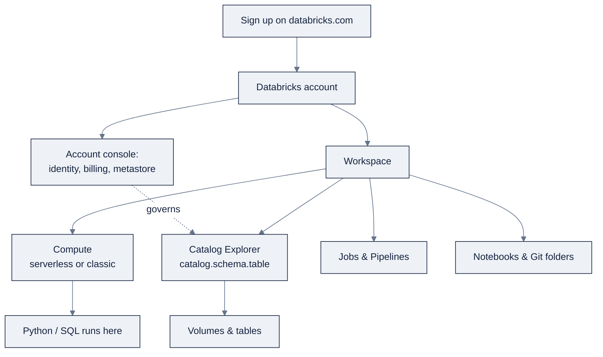

> **Part of AI Engineering Lab · Developed by Zorost Intelligence AI Lab · [zorost.com](https://zorost.com)**

# 00 · Day Zero: Account, Workspace & CLI

> **Find the Signal. Act with Intelligence.** · Databricks Module · Week 21, Day 0

This file is your first two hours on Databricks. By the end you will have: a free-trial
account, a mental model of the workspace UI, the **Databricks CLI** authenticated with
**OAuth U2M**, a working first notebook, a file uploaded to a **volume**, and a checklist
to prove it all works. Everything else in this module builds on these muscles.

The running case study is **ZoroLogistics**, a fictional freight company. Day 0 is about
getting the *platform* ready; Day 1 (file 01) starts building the lakehouse for it.

By the end of Day 0 you will be able to:

- Name the two planes (control vs. compute) and the two URL spaces (workspace vs. account).
- Install and authenticate the CLI with **OAuth U2M**, and switch profiles.
- Run a Python **and** a SQL cell in one notebook on serverless compute.
- Create a catalog/schema/**volume** and upload a file two different ways.
- Explain, in one sentence, how `catalog.schema.table` will govern everything that follows.
- State the day-zero cost reflex: "turn the meter off when idle" (file 17 makes it precise).

> **⚠️ Verify against live docs.** Trial offers, free credits, UI labels, and CLI command
> names change. Re-check the links in [Sources](#sources) if a button or flag isn't where
> this file says it is.

---

## 1. Create the account (free trial)

Databricks offers a **free trial** with a credit that covers serverless SQL and notebooks,
enough for the entire first week. There is no credit card required for the trial tier in
most regions; you will be asked to sign in with or create a cloud identity.

**Steps (conceptual: follow the live flow):**

1. Go to `databricks.com` and choose **Try Databricks free** / **Start for free**.
2. Pick your cloud (**AWS**, **Azure**, or **Google Cloud**) and region. Any works; if you
   are in Zorost's Databricks Modernization Practice mindset, pick the cloud your clients
   actually use, the concepts are cloud-portable.
3. Authenticate with your cloud account (this links Databricks to your cloud subscription
   for classic compute and storage).
4. Wait for the **workspace** to provision. You land in the workspace home screen.

You now have a **Databricks account** (the top-level entity) containing **one workspace**
(a single deployment). Bookmark both URLs:

| Thing | URL | What it's for |
|---|---|---|
| **Workspace** | `https://<workspace-id>.cloud.databricks.com` | Daily work: notebooks, jobs, data |
| **Account console** | `https://accounts.cloud.databricks.com` | Identity, workspaces, billing, metastores (admin only) |

> **Free-tier reality:** the trial has guardrails (e.g., single-user compute limits, some
> regions serverless-only). Keep file `17-finopps-cost.md` in the back of your mind from
> hour zero: the discipline is *always* "what does this cost me?", not an afterthought.

**Signup decision points**: you make three choices up front. Here's how to think about each,
so the choice is deliberate rather than defaulted:

| Decision | Options | Guidance for this module |
|---|---|---|
| **Cloud** | AWS / Azure / Google Cloud | All three work identically for what you'll learn. Pick the cloud your clients actually run on, the concepts are cloud-portable, and muscle memory on one cloud transfers. |
| **Region** | Per-cloud list | Prefer a region with full serverless coverage. If you'll attach your own object storage later, keep it in the same region as the workspace to avoid egress cost. |
| **Workspace type** | Serverless vs. classic | **Serverless workspace** is the fast default (pre-configured compute + managed storage). Choose **classic** only if you need your own VPC or storage on day one. |

None of these is permanent: you can add workspaces and metastores later (file 01), so today
optimize for "fastest path to a working notebook," not "perfect forever architecture."

**Trial guardrails cheat sheet**: what you can and can't do on the free tier shapes the
first week, so know it up front:

| Aspect | Typical free-tier behavior | Consequence for you |
|---|---|---|
| Compute | Serverless notebooks + SQL; single-user classic limits | Plan on serverless for Week 21 |
| Credits | A finite credit covering serverless SQL/notebooks | Turn compute off when idle (file 17) |
| Workspaces | Usually one, in one region | Keep everything in `zrl_` rather than many catalogs |
| Users | Small user cap on some trials | You're the only persona; wear all four hats |

The trial is enough for *this entire module*, the constraint isn't "can I?", it's "will I
remember to stop the meter?" File 17 makes that reflex permanent.

---

## 2. Workspace anatomy tour

Open the workspace and orient yourself on the left sidebar (top to bottom, roughly):

| Area | What it is | You will use it for |
|---|---|---|
| **Workspace** | File tree of notebooks, folders, **Git folders**, workspace files | Your code lives here |
| **Recents** | Jump back to recent notebooks/queries | Navigation |
| **Catalog** | **Catalog Explorer**, the Unity Catalog UI (metastore → catalog → schema → table/volume) | Browsing and governing data (file 01) |
| **Jobs & Pipelines** | **Lakeflow Jobs** (formerly Workflows) and **Lakeflow Pipelines** (formerly DLT) | Orchestration (file 06) |
| **Compute** | Clusters, **SQL warehouses**, policies, pools | Engines (file 02) |
| **Dashboards** | **AI/BI dashboards** (formerly Lakeview) | BI (file 04) |
| **Genie** | **Genie Agents** natural-language data Q&A | Self-service analytics (file 12) |
| **Experiments** | **MLflow experiments** | Model tracking (file 07) |
| **Model Serving** | Serving endpoints + **Unity AI Gateway** | Inference (files 09 to 10) |
| **Marketplace** | Data products (via OpenSharing) | Sourcing data |
| **Settings** | Workspace admin (or account-level via the account console) | Governance |

**The day-zero map**: everything you'll touch this module lives on one of these layers, and
the arrows are the "who governs whom / what runs where" relationships:



**The two concepts to internalize now** (they recur all week):

- **Control plane vs. compute plane**: the UI, metadata, and scheduling are Databricks'
  control plane; your Spark/SQL actually runs in a *compute plane* (your cloud, or
  serverless). "Attaching" a notebook to compute is the explicit act of saying *where* code
  runs.
- **`catalog.schema.table`**: all governed data lives at a three-level name. You'll create
  your first catalog in file 01.

---

## 3. The persona model

Databricks organizes its tools around four personas. You'll touch all of them this module:

| Persona | Goal | Primary tools |
|---|---|---|
| **Data engineer** | Reliable governed ETL/ELT | Lakeflow Pipelines/Jobs, Auto Loader, Lakeflow Connect, Spark |
| **Data analyst / BI** | Query + visualize curated data | SQL warehouses, SQL editor, AI/BI dashboards, Genie |
| **Data scientist / ML engineer** | Train/track/deploy models | MLflow, Feature Engineering, Model Training, Model Serving |
| **Administrator** | Govern platform, identity, cost | Account console, Unity Catalog, compute policies, system tables |

Admin roles split into **account admin** (whole account), **workspace admin** (one
workspace), and **feature roles** (Metastore admin, Billing admin, Marketplace admin).
Your trial user is typically a workspace admin, enough for the whole module.

**For ZoroLogistics**, think of the four personas as four hats you wear on one team: you
are the data engineer who ingests shipments, the analyst who measures on-time delivery, the
scientist who models ETA, and the admin who keeps it governed and cheap.

| Hat | ZoroLogistics job | First tool you'll use | File |
|---|---|---|---|
| Data engineer | Land `shipments.csv`, build bronze→silver→gold | Lakeflow Pipelines / Spark | 03, 05, 06 |
| Analyst | Answer "are we on time?" | DBSQL + AI/BI dashboard | 04 |
| Data scientist | Predict ETA from features | MLflow + Feature Engineering | 07 to 09 |
| Admin | Keep it governed, cheap, auditable | Unity Catalog + budgets | 01, 02, 17 |

Wearing all four at once is the *point*: the module deliberately walks one person through the
whole value chain so you can see how a governed lakehouse is one system, not four tools.

---

## 4. Install the Databricks CLI

The **CLI** wraps the Databricks REST API and is how you'll do version-control and DAB
work later (file 15). Install it now.

**macOS / Linux (Homebrew):**

```bash
brew tap databricks/tap
brew install databricks
```

**Alternative (all platforms): download the binary:**

```bash
# Linux / macOS: download the release from github.com/databricks/cli
# Windows: use the .exe from the same release page, or
winget install Databricks.DatabricksCLI
```

**Verify the install:**

```bash
databricks --version
```

The CLI has command groups that mirror the UI: `databricks workspace`, `databricks
compute`, `databricks jobs`, `databricks pipelines`, `databricks catalogs`, `databricks
schemas`, `databricks tables`, `databricks grants`, `databricks bundle`, and so on. You'll
meet most of them in later files; today you only need auth and `current-user`.

| Command group | Mirrors UI area | You'll use it in |
|---|---|---|
| `databricks workspace` | Workspace file tree | Managing notebooks/files (file 15) |
| `databricks compute` | Compute page | Clusters & SQL warehouses (file 02) |
| `databricks catalogs` / `schemas` / `tables` | Catalog Explorer | Unity Catalog DDL (file 01) |
| `databricks grants` | Catalog permissions | Access control (file 01) |
| `databricks jobs` / `pipelines` | Jobs & Pipelines | Orchestration (file 06) |
| `databricks bundle` | DABs (infra-as-code) | Deploying projects as code (file 15) |
| `databricks fs` | DBFS/Volumes path space | File copy, legacy surface, prefer volumes |

---

## 5. Authenticate with OAuth U2M

Databricks supports several auth methods; for **interactive human use** the recommended one
is **OAuth user-to-machine (U2M)**, it opens a browser, you sign in, and the CLI stores a
short-lived token that it refreshes automatically. (For automation/CI you'd use **OAuth
M2M** with a service principal, or **OIDC token federation**; those are file 15.)

**The four auth methods at a glance:**

| Method | Who/what it's for | Secret handling |
|---|---|---|
| **OAuth U2M** (user-to-machine) | Interactive *humans* on their laptop | Browser login; CLI stores + auto-refreshes a short-lived token |
| **OAuth M2M** (machine-to-machine) | Service principals / automation | Client ID + secret (file 15) |
| **OIDC token federation** | CI/CD pipelines | Exchanges the CI platform's token, no stored secret (file 15) |
| **PAT** (personal access token) | Legacy scripts | A long-lived string you must rotate/guard, avoid for new work |

```bash
databricks auth login --host <https://your-workspace.cloud.databricks.com>
```

This opens your browser to authorize, then writes a **profile** to your config. After it
completes, confirm:

```bash
databricks auth profiles
```

You should see a profile named `DEFAULT` pointing at your workspace host.

### Profiles: switching workspaces

Profiles live in `~/.databrickscfg` (INI format). Each profile is a named set of host +
credentials. If you work with several workspaces, say your personal trial plus a client's
environment, you can hold both:

```ini
# ~/.databrickscfg
[DEFAULT]
host = https://my-trial.cloud.databricks.com

[ZORO-CLIENT]
host = https://client-prod.cloud.databricks.com
```

Log in to a second workspace and target any command at it with the `-p` / `--profile`
flag, or export `DATABRICKS_CONFIG_PROFILE`:

```bash
databricks auth login --host <https://client-prod.cloud.databricks.com> --profile ZORO-CLIENT
databricks current-user me -p ZORO-CLIENT
```

**Environment-variable overrides**: the CLI also respects `DATABRICKS_HOST` and
`DATABRICKS_CONFIG_PROFILE`, which is handy inside scripts that must not assume a profile:

```bash
export DATABRICKS_CONFIG_PROFILE=ZORO-CLIENT
databricks current-user me                 # uses ZORO-CLIENT without a -p flag
```

**Refresh & troubleshooting:**

```bash
databricks auth token --host <https://your-workspace.cloud.databricks.com>   # print the current token (don't commit it)
databricks auth env --profile DEFAULT                                       # emit DATABRICKS_* env vars for other tools
```

If a command fails with an auth error, the checklist is: (1) is the host exactly right,
scheme, hostname, no trailing slash? (2) is the profile the one you think
(`databricks auth profiles`)? (3) has the token expired (`databricks auth login` again)?

> **Rule of thumb:** one profile per environment (personal, client-dev, client-prod). Never
> hardcode tokens or passwords in code, the CLI resolves credentials from the profile so
> your scripts stay secret-free.

---

## 6. Test connectivity

The `current-user` group proves auth works end-to-end and tells you *who* the CLI is acting
as, invaluable when debugging "why can't I see this table" (usually: wrong profile or
wrong identity).

```bash
databricks current-user me
```

Expected output is your user name, email, and id. If you see an auth error, re-run
`databricks auth login`: the token may have expired or the host may be mistyped.

Now browse a couple of read-only surfaces to confirm the CLI can reach the control plane:

```bash
databricks compute list            # clusters (probably empty on day zero)
databricks catalogs list           # Unity Catalog catalogs (see the default 'main'/'workspace')
```

| Command | Proves | If it fails |
|---|---|---|
| `current-user me` | Auth works; *who* you are | Host typo / expired token → re-run `auth login` |
| `compute list` | CLI reaches the compute API | Permissions or wrong profile |
| `catalogs list` | UC is on; you can see the metastore's catalogs | Account not UC-enabled (rare post-2023) |

If `catalogs list` returns the workspace's default catalog, your account is UC-enabled
(automatic for workspaces created after Nov 8, 2023), which is the prerequisite for
everything in file 01.

### Python SDK (optional, but you'll meet it in file 15)

The **Python SDK** (`databricks-sdk`) is the programmatic sibling of the CLI, same unified
auth, same resources, but callable from Python. Install it and do the same identity check:

```bash
pip install databricks-sdk
```

```python
from databricks.sdk import WorkspaceClient

w = WorkspaceClient()                    # picks up the same ~/.databrickscfg profile
me = w.current_user.me()
print(me.user_name)

for c in w.catalogs.list():
    print(c.name)
```

Because it shares the profile/auth machinery, whatever you authenticated with `databricks
auth login` "just works" in the SDK, one credential, two surfaces. You'll use the SDK for
DABs, jobs, and MLflow orchestration in file 15.

---

## 7. Your first notebook

Notebooks are the interactive surface for Python, SQL, Scala, and R. Create one and run a
cell to close the loop "UI → compute → data."

**Steps:**

1. Sidebar → **Workspace** → right-click your user folder → **Create → Notebook**.
2. Name it `00_day_zero_hello`, default language **Python**, and **attach to compute**:
   - Choose a **serverless** compute (instant start) if available, or
   - create a small **all-purpose cluster** (single-node, smallest DBR) if not.
3. In the first cell, paste and run:

```python
print("Hello from ZoroLogistics Day 0")
spark.sql("SELECT current_timestamp() AS now, current_user() AS who").display()
```

4. Add a second cell and switch it to **SQL** (notebooks are multi-language, a `%sql`
   magic at the top of a cell):

```sql
%sql
SELECT current_catalog() AS catalog,
       current_schema() AS schema,
       current_user()  AS user
```

5. Add a **third** cell that touches *data*, not just the session, the real "loop closed"
   test. It reads the file you upload in §8, so run it after the upload:

```python
df = spark.read.option("header", "true").csv("/Volumes/zrl_/bronze/landing/shipments.csv")
df.select("shipment_id", "carrier_id", "weight_kg").show(5)
```

If all three run, you have proven: compute starts, Spark works, SQL works, files read from a
governed volume, and your identity is recognized. That's the whole loop in miniature.

> **Cell magics worth knowing now:** `%sql` (SQL in a Python notebook), `%python` (Python in
> a SQL notebook), `%md` (markdown), and `%run ./other-notebook` (include another notebook's
> code). Notebooks are polyglot, a single notebook can mix Python, SQL, and prose.

> **Serverless note:** serverless notebooks have a default **2.5 h execution timeout** and
> run "versionless" (always latest runtime). For day zero that's perfect; for production you
> will pin runtimes (file 02).

---

## 8. Upload files to a volume

**Volumes** govern non-tabular data (files) at `catalog.schema.volume`, addressed as
`/Volumes/<catalog>/<schema>/<volume>/<path>`. They are where raw CSVs land before they
become Delta tables (file 01, file 03). Let's create one and upload a file two ways.

**Create the volume (SQL cell or Catalog Explorer):**

```sql
%sql
CREATE CATALOG IF NOT EXISTS zrl_;
CREATE SCHEMA IF NOT EXISTS zrl_.bronze;
CREATE VOLUME IF NOT EXISTS zrl_.bronze.landing;
```

> **Why `bronze.landing`?** The volume is the *raw landing zone* for the medallion's bronze
> layer (file 03). Keeping the volume inside the `bronze` schema (rather than a loose
> `landing` schema) means a single `USE SCHEMA zrl_.bronze` grant covers both the raw files
> and the raw tables, one trust boundary, not two (file 01).

**Option A: upload via the UI:** Catalog → `zrl_` → `bronze` → `landing` → **Upload to this
volume**, and drop in `zoro/`'s `shipments.csv`.

**Option B: upload via the CLI** (requires the Databricks CLI files API):

```bash
databricks fs mkdir dbfs:/Volumes/zrl_/bronze/landing    # NOT recommended for data (see note)
databricks fs cp ./zoro/shipments.csv dbfs:/Volumes/zrl_/bronze/landing/shipments.csv
```

> **DBFS vs. Volumes:** `dbfs:/Volumes/...` is the legacy DBFS path space; volumes are the
> governed, recommended surface. The CLI `fs` commands touch DBFS; prefer the UI upload or
> the SDK for volumes, and always treat the `/Volumes/...` path (no `dbfs:` prefix) as the
> canonical one in Spark/SQL code.

**Verify** from a notebook cell:

```sql
%sql
LIST '/Volumes/zrl_/bronze/landing'
```

If `shipments.csv` appears, raw files are in a governed location and ready for the
`COPY INTO` / `read_files` load you'll do in files 01 and 03.

**Volume types**: you'll hear "managed" vs "external" all module; here's the day-zero
version:

| Type | Storage | `DROP VOLUME` behavior | Use for |
|---|---|---|---|
| **Managed volume** | UC-owned storage (you don't pick a path) | Deletes the files (7-day soft-delete) | Raw landing, checkpoints, libraries, the default |
| **External volume** | Existing object storage you own (`LOCATION`) | Deletes only metadata | Files other tools already read |

**Upload methods**: three ways, pick by what you're doing:

| Method | Best for | Notes |
|---|---|---|
| **UI drag-and-drop** | A few small files, exploration | Simplest; no CLI needed |
| **CLI (`databricks fs cp`)** | Scripting file moves | Touches the DBFS path space, see note above |
| **SDK / REST** | Programmatic upload in a pipeline | `WorkspaceClient().files` or the Files API |

Today, the UI upload is enough; the CLI/SDK paths matter when upload becomes a *scheduled*
step rather than a one-off (file 06's ingestion).

**The next two weeks in one table**: everything after Day 0 builds this same `shipments.csv`
into the full ZoroLogistics lakehouse:

| File | What you add | The ZoroLogistics asset it becomes |
|---|---|---|
| 01 | Catalogs, schemas, grants, lineage | Governed `zrl_` layout with least-privilege roles |
| 02 | Clusters, warehouses, serverless, DBU math | The compute policy that keeps it cheap |
| 03 | Delta ACID, time travel, medallion | `bronze → silver → gold` tables |
| 04 | DBSQL, materialized views, dashboards | The on-time KPI dashboard |
| 05 | PySpark DataFrames | The programmatic medallion transform |
| 06 | Lakeflow Pipelines + Jobs | The scheduled, expectation-gated pipeline |
| 07 to 09 | MLflow, features, training | The ETA model registered in UC |

Keep this table in view: Day 0 is not an isolated "make an account" chore, it's the
foundation the whole case study is built on.

---

## 9. The "first hour" checklist

Work this top to bottom; check each box off. **Time budget** (assumes a smooth signup and
serverless compute, the timings are the point, not the exact minutes):

| Step | What you're doing | ~Time |
|---|---|---|
| 1 to 4 | Sign up, provision workspace, land on the home screen | 10 min |
| 5 to 6 | Sidebar tour + control-plane/compute-plane mental model | 5 min |
| 7 to 8 | Personas + install CLI (`databricks --version`) | 5 min |
| 9 to 10 | OAuth U2M login + profiles + `current-user me` | 5 min |
| 11 to 12 | First notebook (Python + `%sql` cell) on serverless | 10 min |
| 13 to 15 | Create `zrl_` → volume, upload `shipments.csv`, `LIST` it | 10 min |
| 16 | Note cost guardrails; skim file 17's checklist | 5 min |

- [ ] Created a free-trial account and opened the workspace.
- [ ] Toured the sidebar and can name what **Catalog**, **Compute**, and **Jobs &
      Pipelines** do.
- [ ] Can explain control plane vs. compute plane in one sentence.
- [ ] Know the four personas and which tools map to each.
- [ ] Installed the CLI (`databricks --version` works).
- [ ] Ran `databricks auth login` with OAuth U2M and `databricks auth profiles` shows `DEFAULT`.
- [ ] Ran `databricks current-user me` and saw your identity.
- [ ] Ran `databricks catalogs list` and saw a default catalog (UC is on).
- [ ] Created and ran a Python + a `%sql` cell in a notebook on compute.
- [ ] Created `zrl_` catalog → `bronze` schema → `landing` volume and uploaded `shipments.csv`.
- [ ] Ran `LIST '/Volumes/zrl_/bronze/landing'` and saw the file.
- [ ] Noted the free-tier cost guardrails for later (file 17).

**Definition of done:** a colleague could sit at your machine, run
`databricks current-user me`, and follow the same checklist without asking "where is X?".
If that's true, Day 0 is done, file 01 starts building the governed lakehouse.

---

## Try it

Three hands-on tasks to prove Day 0 is real, not just read. Each has a check you can run.

### Task 1: Second profile, second workspace

Configure a second CLI profile and prove profile selection works without touching `DEFAULT`.

```bash
databricks auth login --host https://client-dev.cloud.databricks.com --profile ZORO-DEV
databricks auth profiles
databricks current-user me -p ZORO-DEV
```

**Acceptance check:** `databricks auth profiles` lists both `DEFAULT` and `ZORO-DEV`, and a
command with `-p ZORO-DEV` targets the second host (it may fail to *authenticate* if that
host is fake, the point is that profile *selection* works and `DEFAULT` stays untouched).

### Task 2: Notebook reads the uploaded file

From a notebook, read `shipments.csv` back from the volume and report its shape:

```python
df = spark.read.option("header", "true").csv("/Volumes/zrl_/bronze/landing/shipments.csv")
print(f"rows={df.count()} cols={len(df.columns)}")
```

**Acceptance check:** `rows=` prints a number > 0 and `cols=` matches the CSV header
(13 columns for `shipments.csv`). If you get a "path not found" error, your volume path or
upload is wrong, re-run `LIST '/Volumes/zrl_/bronze/landing'` to confirm the file is there.

### Task 3: CLI ↔ UI round trip

Use the CLI to inspect the catalog you created, then confirm the same objects in the UI.

```bash
databricks catalogs list          # see zrl_
databricks schemas list zrl_      # see bronze
databricks volumes list zrl_ bronze   # see landing
```

**Acceptance check:** `databricks catalogs list` shows `zrl_`, and the same catalog appears
in Catalog Explorer, the CLI and the UI are two windows onto one control plane, and this
round trip is the proof.

---

## Common mistakes

1. **Using `dbfs:/Volumes/...` in Spark/SQL code.** DBFS is the legacy path space; the
   governed surface is `/Volumes/<catalog>/<schema>/<volume>/...` with no `dbfs:` prefix.
   *Fix:* write `/Volumes/zrl_/bronze/landing/shipments.csv` in notebooks; treat `dbfs:` as
   a deprecated alias you never type in new code.
2. **Leaving the interactive cluster running.** A small all-purpose cluster left on
   overnight bills roughly 24× what the same work costs on a job cluster (file 02's math).
   *Fix:* set auto-termination to 30 min and prefer serverless notebooks for exploration.
3. **`databricks auth login` against the wrong host.** A trailing slash, `http://`, or a
   typo breaks the profile silently. *Fix:* copy the host exactly from the workspace URL,
   then confirm with `databricks current-user me`, it prints *who* the CLI is acting as.
4. **Skipping the explicit schema on the first CSV read.** `inferSchema` reads the file
   twice and guesses column types. *Fix:* declare a `StructType` (file 05) from day zero,
   the habit compounds.
5. **Creating objects under the workspace default catalog.** Untracked tables in the default
   catalog bypass your governance plan. *Fix:* create `zrl_` first and always qualify
   `catalog.schema.table` from the very first notebook cell.
6. **Hardcoding a token in a script.** It works until the token expires or leaks. *Fix:* let
   the CLI resolve credentials from `~/.databrickscfg` profiles; never paste tokens into
   source code.
7. **Creating the volume under a throwaway schema name.** A `landing` schema separate from
   `bronze` fragments your grants later. *Fix:* put the raw volume at `zrl_.bronze.landing`
   so one `USE SCHEMA` grant covers raw files *and* raw tables (file 01).

> **Next:** [01-unity-catalog.md](01-unity-catalog.md) turns the `zrl_` skeleton you just made
> into a governed, least-privilege lakehouse.

---

## Sources

- https://docs.databricks.com/introduction/
- https://docs.databricks.com/getting-started/concepts/
- https://docs.databricks.com/getting-started/high-level-architecture/
- https://docs.databricks.com/dev-tools/cli/
- https://docs.databricks.com/dev-tools/auth/
- https://docs.databricks.com/dev-tools/sdk-python
- https://docs.databricks.com/volumes/
- https://docs.databricks.com/data-governance/unity-catalog/
- https://docs.databricks.com/notebooks/
- https://docs.databricks.com/compute/serverless/
- https://www.databricks.com/product/pricing
- https://docs.databricks.com/llms.txt

> *This is original curriculum written in AI Engineering Lab's own words; no third-party
> course material was copied. Names and flows that change quickly (trial UI, CLI flags)
> are flagged inline, verify against the live links above.*

---

© 2026 Zorost Intelligence LLC · [zorost.com](https://zorost.com)
