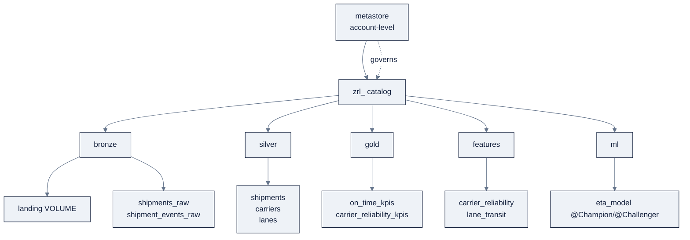
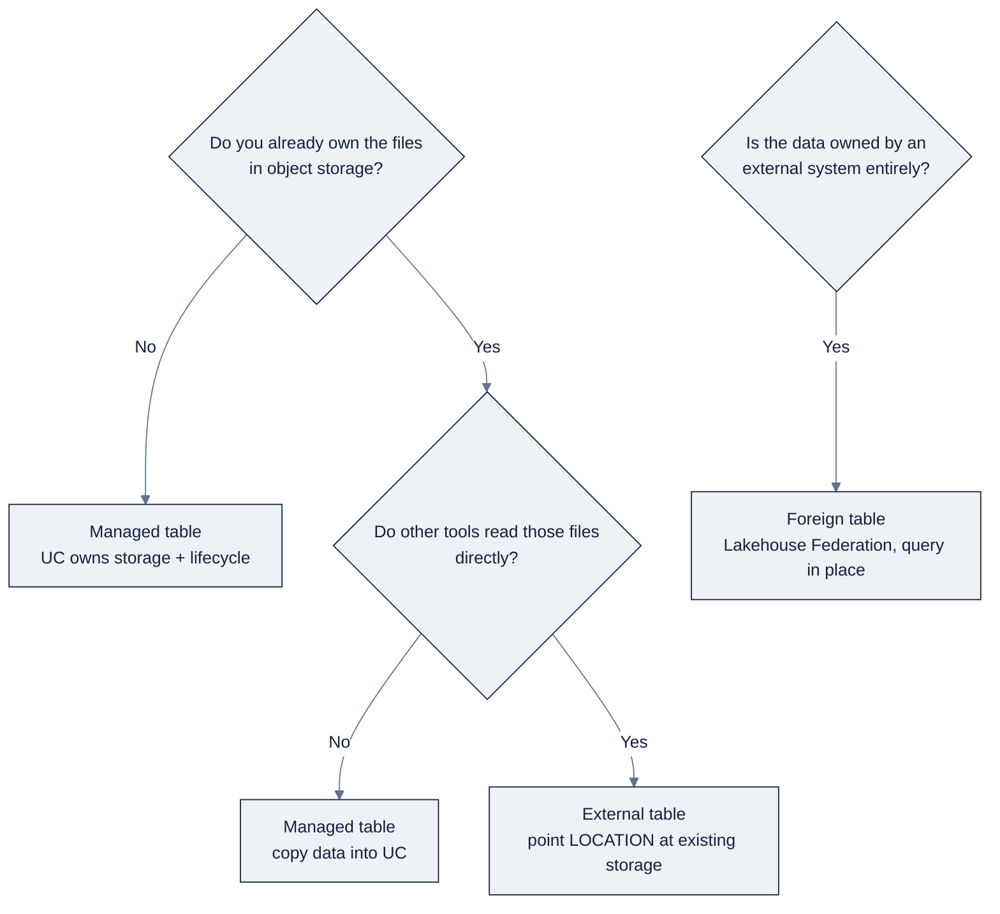

> **Part of AI Engineering Lab · Developed by Zorost Intelligence AI Lab · [zorost.com](https://zorost.com)**

# 01 · Unity Catalog: Governance for Data & AI

> **Find the Signal. Act with Intelligence.** · Databricks Module · Week 21

Unity Catalog (UC) is the foundation every other Databricks feature stands on. This file
teaches the object model, the privilege model, ownership and lineage, sharing, and, most
importantly, how to lay out a governed catalog for **ZoroLogistics**. By the end you will
create `zrl_` with `bronze` / `silver` / `gold` schemas, grant least-privilege access, and
know exactly where every table should live and why.

> **⚠️ Verify against live docs.** GRANT surface and sharing features evolve; re-check
> [Sources](#sources) and `docs.databricks.com/llms.txt` before relying on a specific
> privilege.

---

## 1. What Unity Catalog is

UC is the **unified governance layer for data and AI**, one metastore that governs tables,
views, volumes, files, functions, and ML models with fine-grained access control, lineage,
audit, and discovery. It is automatically enabled for workspaces created after **Nov 8,
2023**, and is also available as an open-source project.

Two ideas make it different from the legacy Hive metastore it replaces:

1. **One namespace, all securables.** Data *and* AI artifacts share the same
   `catalog.schema.object` address, a table and an MLflow model live side by side under the
   same governance.
2. **Account-scoped metastore.** A metastore is an *account-level* resource that can attach
   to **multiple workspaces in the same region**, so several teams see one governed view.

---

## 2. The object model

```
metastore
 └── catalog
      └── schema (database)
           ├── table | view | volume | function | model
```

| Object | Purpose |
|---|---|
| **Metastore** | Account-level metadata registry; one can attach to many workspaces in a region |
| **Catalog** | Top-level container for isolating/organizing data |
| **Schema** (database) | Holds tables, views, volumes, functions, models |
| **Table** | Governs tabular data (Delta by default) |
| **View** | Saved query (incl. materialized views, dynamic views) |
| **Volume** | Governs non-tabular data (files) |
| **Function / Model** | UDFs and MLflow-packaged models, also governed securables |

Other securables sit directly under the metastore: **storage credentials**, **external
locations**, **connections** (Lakehouse Federation / Lakeflow Connect), and **shares**
(OpenSharing).

**Three-level names** are used everywhere: `catalog.schema.table`,
`catalog.schema.volume`, `models:/catalog.schema.model@alias`.

---

## 3. Setting up ZoroLogistics: the `zrl_` layout

Naming is governance. Adopt a consistent convention from day one. Zorost's convention for
this program:

| Level | Convention | ZoroLogistics example |
|---|---|---|
| **Catalog** | Short team/domain prefix, lowercase, underscore suffix | `zrl_` (ZoroLogistics) |
| **Schema** | Medallion layer or subject area | `bronze`, `silver`, `gold`, `features`, `ml` |
| **Table** | Snake_case, singular entity, `_raw` for landing | `shipments_raw`, `shipments`, `on_time_kpis` |
| **Volume** | Purpose-named | `landing`, `checkpoints`, `libraries` |
| **Model** | Snake_case, `_model` suffix optional | `eta_model` |

**Create the layout:**

```sql
-- Catalog
CREATE CATALOG IF NOT EXISTS zrl_
  COMMENT 'ZoroLogistics governed data and AI assets';

-- Medallion schemas (file 03 explains the layers)
CREATE SCHEMA IF NOT EXISTS zrl_.bronze COMMENT 'Raw, unvalidated ingestion';
CREATE SCHEMA IF NOT EXISTS zrl_.silver COMMENT 'Cleaned, validated, deduped';
CREATE SCHEMA IF NOT EXISTS zrl_.gold   COMMENT 'Aggregated, business-aligned';

-- Cross-cutting schemas for later files
CREATE SCHEMA IF NOT EXISTS zrl_.features COMMENT 'ML feature tables (file 08)';
CREATE SCHEMA IF NOT EXISTS zrl_.ml      COMMENT 'Registered models (file 07)';

-- Volumes for non-tabular data
CREATE VOLUME IF NOT EXISTS zrl_.bronze.landing   COMMENT 'Raw file landing zone';
CREATE VOLUME IF NOT EXISTS zrl_.silver.checkpoints COMMENT 'Streaming checkpoints';
```

**Why `zrl_` and not `zorologistics`?** A short, stable prefix is easy to type, grep, and
grant against; the trailing underscore separates the org from object names and is a
Databricks convention for a catalog you own. Within it, `bronze/silver/gold` encode *data
quality stage* in the namespace itself, so a grant or a scan can reason about trust level
without opening any table.

### The full naming-conventions guide

Naming is the cheapest governance you'll ever do, it makes `GRANT`, lineage reads, and
cost chargeback *legible* without opening any object. Adopt these rules once and keep them:

| Object | Pattern | Example | Anti-pattern |
|---|---|---|---|
| Catalog | `<org><_>` (short, org-owned) | `zrl_` | `zorologistics_production_final` |
| Schema | medallion layer or subject area | `bronze`, `silver`, `gold`, `features`, `ml` | `ana_schema_2` |
| Table | snake_case, singular entity; suffix stage | `shipments`, `shipments_raw` | `Shipments Jan FINAL` |
| Column | snake_case, descriptive | `shipped_at`, `on_time_rate` | `col1`, `data` |
| Volume | purpose-named | `landing`, `checkpoints` | `vol1` |
| Model | snake_case, entity + `_model` | `eta_model` | `model_v2_copy` |
| View | snake_case, `_v`/purpose suffix if needed | `on_time_kpis`, `carrier_ot_v` | `view123` |

Rules of thumb that survive contact with real teams:

1. **Singular, not plural**: `shipments` (the entity) is fine, but be consistent; pick one.
2. **Encode trust in the schema, not the table name**: `silver.shipments` beats
   `shipments_clean_v3`.
3. **Never version in the name**: versions belong to Delta/MLflow, not `_v2` suffixes.
4. **Prefix raw** with `_raw` so "don't trust this yet" is visible at a glance.
5. **Lowercase everything**: object names are case-sensitive in some tools; avoid the trap.

### The governed layout as a diagram



---

## 4. Managed vs. external tables

UC tables are **managed**, **external**, or **foreign**:

| | Managed | External | Foreign |
|---|---|---|---|
| Data lifecycle | UC manages | You manage | External system manages |
| Storage | UC-managed | You specify (`LOCATION`) | External system |
| `DROP TABLE` deletes data? | **Yes** | **No** (metadata only) | No |
| Formats | Delta, Apache Iceberg | Delta (rec.), CSV/JSON/Avro/Parquet/ORC/Text | System-dependent |
| Best for | Production (default) | Existing data / external clients | Migration / temporary federation |

**Create a managed table** (default, no `LOCATION`):

```sql
CREATE TABLE zrl_.bronze.shipments_raw (
  shipment_id     STRING,
  carrier_id      STRING,
  lane_id         STRING,
  origin_city     STRING,
  dest_city       STRING,
  shipped_at      TIMESTAMP,
  delivered_at    TIMESTAMP,
  promised_at     TIMESTAMP,
  weight_kg       DOUBLE,
  status          STRING
) USING DELTA
  COMMENT 'Raw shipment rows as ingested';
```

**Create an external table** (point at existing object storage you already own):

```sql
CREATE TABLE zrl_.bronze.shipments_ext (
  shipment_id STRING, carrier_id STRING
) USING DELTA
  LOCATION 'abfss://containers@account.dfs.core.windows.net/zrl/bronze/shipments_ext';
```

> **Rule of thumb:** default to **managed** for anything Databricks is the system of record
> for (simpler lifecycle, UC-owned storage, automatic cleanup). Use **external** when you
> must keep files in a pre-existing location that other tools read directly. Use **foreign**
> tables (via Lakehouse Federation) to query data *in place* without copying it.

### Managed vs. external: the decision guide

Walk the three questions; they decide the table type:



| Question | Yes → | No → |
|---|---|---|
| Do I already have files in my own object storage? | Ask next question | **Managed** (UC owns it) |
| Do other (non-Databricks) tools read those files directly? | **External** | **Managed** (copy in) |
| Is the source an external database I don't want to copy? | **Foreign** (Federation) | n/a |

**The `DROP TABLE` consequence is the decision you must remember:** `DROP` a **managed**
table and the data is gone (7-day soft-delete then permanent); `DROP` an **external** table
and only the metadata is gone, your files stay. When you hand a table to a colleague, they
should know which of those is true *before* they type `DROP`.

**ZoroLogistics mapping:** `shipments_raw` (Databricks loads it, nobody else reads the raw
files) → **managed**. A client's pre-existing `shipments` in their own S3/ADLS that their
legacy ETL still writes → **external**. Their on-prem Oracle database you must query without
migrating → **foreign** (file 03 §3.3).

---

## 5. Grants: the privilege model

UC's privilege model is **additive only: there is no `DENY`**. A principal (user, group,
or service principal) can do something only if it holds the needed privileges; the default
is "nothing." Privileges **inherit down the hierarchy**: granting `SELECT` on a catalog
applies to everything under it.

Two kinds of privileges matter:

| Kind | Examples | Meaning |
|---|---|---|
| **Traversal** | `USE CATALOG`, `USE SCHEMA` | You may *see/reach* the container |
| **Action** | `SELECT`, `MODIFY`, `READ VOLUME`, `CREATE TABLE`, `EXECUTE`, `APPLY TAG` | You may *do* the thing |

A principal needs **both** traversal and action. The mental checklist for "can Alice read
table `zrl_.silver.shipments`?" is: `USE CATALOG zrl_` + `USE SCHEMA silver` + `SELECT` on
the table.

### Worked example: ZoroLogistics role grants

First, create groups (best practice: grant to **groups**, not individuals):

```sql
-- (Creating groups is an account-console/SCIM operation; here we just reference them.)
-- zrl_data_engineers : can read+write bronze/silver, full gold
-- zrl_analysts       : can read silver/gold only
-- zrl_ml_engineers   : can read silver/gold + use features/ml
```

Grant **traversal** at the catalog level so everyone can *reach* it:

```sql
GRANT USE CATALOG ON CATALOG zrl_ TO `zrl_data_engineers`;
GRANT USE CATALOG ON CATALOG zrl_ TO `zrl_analysts`;
GRANT USE CATALOG ON CATALOG zrl_ TO `zrl_ml_engineers`;
```

Grant **schema traversal + action** per layer:

```sql
-- Data engineers: full access to bronze & silver, write access to gold
GRANT USE SCHEMA, CREATE TABLE, CREATE VOLUME ON SCHEMA zrl_.bronze TO `zrl_data_engineers`;
GRANT USE SCHEMA, CREATE TABLE ON SCHEMA zrl_.silver TO `zrl_data_engineers`;
GRANT USE SCHEMA, CREATE TABLE ON SCHEMA zrl_.gold   TO `zrl_data_engineers`;

-- Analysts: read-only on silver & gold
GRANT USE SCHEMA, SELECT ON SCHEMA zrl_.silver TO `zrl_analysts`;
GRANT USE SCHEMA, SELECT ON SCHEMA zrl_.gold   TO `zrl_analysts`;

-- ML engineers: read silver/gold + use features & ml schemas
GRANT USE SCHEMA, SELECT ON SCHEMA zrl_.gold     TO `zrl_ml_engineers`;
GRANT USE SCHEMA ON SCHEMA zrl_.features TO `zrl_ml_engineers`;
GRANT USE SCHEMA ON SCHEMA zrl_.ml       TO `zrl_ml_engineers`;
```

Grant **on a specific table** (fine-grained):

```sql
GRANT SELECT, MODIFY ON TABLE zrl_.silver.shipments TO `zrl_data_engineers`;
GRANT SELECT ON TABLE zrl_.gold.on_time_kpis TO `zrl_analysts`;
```

Grant **volume access** (needed to read files before they are tables):

```sql
GRANT READ VOLUME, WRITE VOLUME ON VOLUME zrl_.bronze.landing TO `zrl_data_engineers`;
```

### Revoking

`REVOKE` is the mirror image, remove a privilege you no longer want:

```sql
REVOKE SELECT ON TABLE zrl_.gold.on_time_kpis FROM `zrl_analysts`;
```

### Inspecting

```sql
SHOW GRANTS ON CATALOG zrl_;
SHOW GRANTS ON TABLE zrl_.gold.on_time_kpis;
SHOW GRANTS ON SCHEMA zrl_.silver;
```

### Other privileges worth knowing

| Privilege | Grants the right to |
|---|---|
| `MODIFY` | `INSERT`, `UPDATE`, `DELETE`, `MERGE`, `OPTIMIZE` on a table |
| `MANAGE` | Grant/revoke on the object (delegated grant admin), powerful, use sparingly |
| `BROWSE` | Metadata-only (see the object exists), no data |
| `APPLY TAG` / `EXECUTE` | Tag securables / run functions or models |

### The complete GRANT matrix: who needs what

The checklist "`USE CATALOG` + `USE SCHEMA` + `SELECT`/`MODIFY`" generalizes into a matrix.
Read it as "to let **this principal** do **that**, grant **these**, at **this level**."

| Principal | Needs to | Traversal | Action | Grant at |
|---|---|---|---|---|
| **Data engineer** | Build + maintain bronze/silver/gold | `USE CATALOG zrl_`, `USE SCHEMA` (each layer) | `CREATE TABLE`, `CREATE VOLUME`, `MODIFY`, `SELECT` | schema (per layer) |
| **Analyst** | Query silver + gold | `USE CATALOG zrl_`, `USE SCHEMA silver`/`gold` | `SELECT` | schema (or table) |
| **ML engineer** | Read features + train/register models | `USE CATALOG zrl_`, `USE SCHEMA features`/`ml` | `SELECT` (features), `CREATE MODEL`/`EXECUTE` (ml) | schema |
| **Data steward** | Read everything, tag it | `USE CATALOG zrl_`, `USE SCHEMA` (all) | `SELECT`, `APPLY TAG`, `MANAGE` (delegated) | catalog/schema |
| **Platform admin** | Own the metastore | metastore admin role | `CREATE CATALOG`, `MANAGE` | metastore |
| **Service principal (pipeline)** | Run the nightly ETL | `USE CATALOG zrl_`, `USE SCHEMA` (bronze/silver/gold) | `MODIFY`, `SELECT`, `READ VOLUME` | schema + volume |

**The two rules the matrix encodes:**

1. **Traversal first, action second.** Every "can do X" is the *pair* (`USE` + action). Granting
   `SELECT` without `USE SCHEMA` does nothing useful.
2. **Grant at the coarsest level that stays least-privilege.** `SELECT` on `gold` schema
   covers all gold tables *and* future ones; a one-off grant on a single table is the
   exception (a sensitive table, not the norm).

**Worked grant for a new hire**: the full "welcome an analyst" sequence in one block:

```sql
GRANT USE CATALOG ON CATALOG zrl_ TO `zrl_analysts`;
GRANT USE SCHEMA, SELECT ON SCHEMA zrl_.silver TO `zrl_analysts`;
GRANT USE SCHEMA, SELECT ON SCHEMA zrl_.gold   TO `zrl_analysts`;
-- verify
SHOW GRANTS ON SCHEMA zrl_.gold;
```

> **Least privilege in one line:** never grant `MANAGE` or whole-catalog `MODIFY` "to make
> it work." Grant the narrowest traversal + action pair the role actually needs; it's
> additive, so you can always add more later.

---

## 6. Ownership

Every UC securable has **exactly one owner**. The owner can always manage the object,
including transferring ownership:

```sql
-- Transfer ownership to a group (preferred over an individual)
ALTER TABLE zrl_.gold.on_time_kpis OWNER TO `zrl_data_engineers`;
```

**Best practices:**

- Make **groups** owners, not individuals, no single point of failure when someone leaves.
- Distinguish *ownership* (lifecycle responsibility) from *access* (grants). The owner
  "owns" the object; grants control who uses it.
- `MANAGE` lets a non-owner delegate grants; the owner always has full control implicitly.

---

## 7. Lineage

UC records **automatic table and column lineage** for Delta operations, and extends it to
MLflow models (file 07). You can see it in **Catalog Explorer** (a table's **Lineage** tab)
or query the system tables:

```sql
SELECT * FROM system.access.table_lineage
WHERE source_table_full_name = 'zrl_.bronze.shipments_raw';

SELECT * FROM system.access.column_lineage
WHERE column_name = 'shipment_id';
```

**Why lineage matters for ZoroLogistics:** when a gold KPI looks wrong, lineage answers
"which bronze file, through which silver transform, produced this number?", the same
upstream/downstream trace a modern BI migration (a core Zorost practice offering) needs to
prove correctness to a client.

### Lineage walkthrough: trace one KPI to its source

Imagine `zrl_.gold.on_time_kpis` shows a suspiciously high on-time rate for carrier `C007`.
Lineage answers "which tables, and which columns, fed that number?" in two queries:

```sql
-- 1. Upstream: what feeds on_time_kpis?
SELECT source_table_full_name, target_table_full_name
FROM system.access.table_lineage
WHERE target_table_full_name = 'zrl_.gold.on_time_kpis';

-- 2. Column-level: which bronze/silver columns produced on_time_rate?
SELECT source_table_full_name, source_column_name, target_column_name
FROM system.access.column_lineage
WHERE target_table_full_name = 'zrl_.gold.on_time_kpis'
  AND target_column_name = 'on_time_rate';
```

The result is a chain you can read top to bottom:

```mermaid
%%{init:{"theme":"base","fontFamily":"Helvetica Neue,Helvetica,Arial,sans-serif","flowchart":{"curve":"basis","padding":14,"nodeSpacing":45,"rankSpacing":55},"themeVariables":{"fontSize":"15px","background":"#FFFFFF","primaryColor":"#EEF2F7","primaryTextColor":"#14213D","primaryBorderColor":"#14213D","secondaryColor":"#FFF1E3","secondaryTextColor":"#14213D","tertiaryColor":"#E7F4F1","tertiaryTextColor":"#14213D","lineColor":"#64748B","textColor":"#14213D","edgeLabelBackground":"#FFFFFF","clusterBkg":"#F5F8FC","clusterBorder":"#94A3B8","nodeBorder":"#14213D","mainBkg":"#EEF2F7","titleColor":"#14213D"}}}%%
flowchart LR
    F[shipments.csv<br>in bronze.landing VOLUME] --> B[zrl_.bronze.shipments_raw]
    B --> S[zrl_.silver.shipments]
    S --> G[zrl_.gold.on_time_kpis]
    G --> D[AI/BI dashboard]
```



Each arrow is *recorded automatically* the moment a Delta write or `COPY INTO` lands, you
don't instrument lineage; you just query it. That's what makes it trustworthy in a client
migration: the trace is produced by the platform, not by an engineer's memory.

**Column lineage matters too:** table lineage tells you *which table*; column lineage tells
you *which field*, the difference between "the KPI came from `silver.shipments`" and
"`on_time_rate` is `delivered_at <= promised_at` from `silver.shipments`." For a BI
migration, column lineage is the evidence that a re-implemented metric *means the same
thing* as the legacy one.

---

## 8. Delta Sharing → OpenSharing

**OpenSharing (formerly Delta Sharing)** securely shares **live** data and AI assets
outside your organization, recipients don't need Databricks. Core concepts:

| Concept | Role |
|---|---|
| **Provider** | You, the party sharing data |
| **Share** | A read-only collection of tables (and, for Databricks recipients, views/volumes/models/notebooks) |
| **Recipient** | The party you share with |

Two protocols:

1. **Databricks-to-Databricks**: between UC-enabled workspaces; no bearer token; full
   governance and audit.
2. **Databricks-to-Open**: to any platform (Spark, pandas, Power BI…) via bearer tokens or
   OIDC federation.

**Create a share and hand it out:**

```sql
CREATE SHARE zrl_ops_share;

ALTER SHARE zrl_ops_share ADD TABLE zrl_.gold.on_time_kpis;

-- Create a recipient and grant SELECT on the share
CREATE RECIPIENT ops_partner USING ID 'ops-partner-tenant';
GRANT SELECT ON SHARE zrl_ops_share TO RECIPIENT ops_partner;
```

Adjacent sharing surfaces: **Databricks Marketplace** (data-product exchange) and **Clean
Rooms** (privacy-preserving collaboration). For a freight company, OpenSharing is how
ZoroLogistics hands its *validated* KPIs to a customer or a 3PL partner without exporting
CSVs or giving them warehouse access.

> **OpenSharing / Delta Sharing naming:** the open project is now at `opensharing.io`; the
> Databricks docs still describe the capability under data-sharing. Teach both names.

### OpenSharing basics: the five things to remember

| Concept | What it means | ZoroLogistics example |
|---|---|---|
| **Provider** | The party who shares (you) | ZoroLogistics shares `on_time_kpis` |
| **Share** | A read-only, named collection of tables | `zrl_ops_share` |
| **Recipient** | The party who receives | A 3PL partner or a customer's warehouse |
| **Protocol** | Databricks-to-Databricks or Databricks-to-Open | See table below |
| **Live data** | Shares are *live*, updates flow, no export | KPI refresh shows up automatically |

The two protocols, side by side:

| | Databricks-to-Databricks | Databricks-to-Open |
|---|---|---|
| Recipient | UC-enabled Databricks workspace | Any platform (Spark, pandas, Power BI…) |
| Auth | No bearer token; governed via UC | Bearer token or OIDC federation |
| Shareable assets | Tables, views, volumes, models, notebooks | Tables (plus files) |
| Governance/audit | Full | Lighter (token-scoped) |

**A fuller worked share**: add several tables and a recipient, then let them mount it:

```sql
CREATE SHARE zrl_ops_share;
ALTER SHARE zrl_ops_share ADD TABLE zrl_.gold.on_time_kpis;
ALTER SHARE zrl_ops_share ADD TABLE zrl_.gold.carrier_reliability_kpis;
ALTER SHARE zrl_ops_share ADD TABLE zrl_.silver.carriers;

CREATE RECIPIENT ops_partner USING ID 'ops-partner-tenant';
GRANT SELECT ON SHARE zrl_ops_share TO RECIPIENT ops_partner;
```

**Why shares, not CSV exports?** A share is *live* (the recipient always sees current data),
*revocable* (`REVOKE SELECT ON SHARE ...`), and *auditable*, three properties a
spreadsheet attached to an email has none of. For a freight company handing validated KPIs
to customers and 3PLs, OpenSharing is the difference between "here's last month's file" and
"here's a live, governed view."

---

## 9. ZoroLogistics naming & layout: the full picture

The complete target layout after this file (built up through the module):

```
zrl_                                  # catalog
├── bronze                            # raw, append-only, source fidelity
│   ├── landing (VOLUME)              #   raw CSVs/JSON before COPY INTO
│   ├── shipments_raw                 #   ingested, unvalidated
│   └── shipment_events_raw           #   streaming event feed (file 06)
├── silver                            # cleaned, validated, deduped, typed
│   ├── checkpoints (VOLUME)          #   Structured Streaming checkpoints
│   ├── shipments                     #   clean, SCD-typed shipment facts
│   └── carriers / lanes              #   conformed dimensions
├── gold                              # aggregated, business-aligned
│   ├── on_time_kpis                  #   on-time rate by carrier/lane/month
│   └── carrier_reliability_kpis      #   reliability rollups
├── features                          # ML feature tables (file 08)
│   ├── carrier_reliability
│   └── lane_transit
└── ml                                # registered models (file 07)
    └── eta_model  (@Champion / @Challenger)
```

**Grants summary** (least privilege):

| Principal | Catalog | bronze | silver | gold | features/ml |
|---|---|---|---|---|---|
| `zrl_data_engineers` | `USE` | `USE` + create/write | `USE` + create/write | `USE` + create/write | n/a |
| `zrl_analysts` | `USE` | n/a | `USE` + `SELECT` | `USE` + `SELECT` | n/a |
| `zrl_ml_engineers` | `USE` | n/a | `USE` + `SELECT` | `USE` + `SELECT` | `USE` (features/ml) |

---

## 10. Checklist

- [ ] Explained the three-level namespace and the full securable list (table/view/volume/function/model).
- [ ] Created `zrl_` with `bronze`/`silver`/`gold`/`features`/`ml` and a `landing` volume.
- [ ] Created a managed Delta table *and* an external table, and can state when to use each.
- [ ] Granted `USE CATALOG` + `USE SCHEMA` + `SELECT`/`MODIFY`/`READ VOLUME` for the three ZoroLogistics roles.
- [ ] Ran `SHOW GRANTS` to verify; `REVOKE`d one privilege to prove it sticks.
- [ ] Set a group as owner and explained ownership vs. access.
- [ ] Queried `system.access.table_lineage` and saw a row.
- [ ] Created an OpenSharing share + recipient and can describe the two protocols.

**Definition of done:** a third party can answer "who can read `zrl_.gold.on_time_kpis`,
and what is the least-privilege path to grant a new analyst?" from your setup.

---

## Try it

Three hands-on tasks. Do them in order; each has a check you can run.

### Task 1: Lay out the catalog and prove grants stick

Create the full `zrl_` layout, grant the three roles, then verify and revoke.

```sql
CREATE CATALOG IF NOT EXISTS zrl_;
CREATE SCHEMA IF NOT EXISTS zrl_.bronze;
CREATE SCHEMA IF NOT EXISTS zrl_.silver;
CREATE SCHEMA IF NOT EXISTS zrl_.gold;

GRANT USE CATALOG ON CATALOG zrl_ TO `zrl_analysts`;
GRANT USE SCHEMA, SELECT ON SCHEMA zrl_.silver TO `zrl_analysts`;

SHOW GRANTS ON SCHEMA zrl_.silver;
REVOKE SELECT ON SCHEMA zrl_.silver FROM `zrl_analysts`;
SHOW GRANTS ON SCHEMA zrl_.silver;   -- the SELECT grant is gone
```

**Acceptance check:** `SHOW GRANTS` lists the `SELECT` grant before the `REVOKE` and no
longer lists it after, proof the additive model is reversible, not just additive.

### Task 2, Managed vs. external: make one of each

Create one managed and one external table, and check where each lives:

```sql
CREATE TABLE zrl_.bronze.shipments_raw (shipment_id STRING, weight_kg DOUBLE) USING DELTA;

CREATE TABLE zrl_.bronze.shipments_ext (shipment_id STRING, weight_kg DOUBLE) USING DELTA
  LOCATION 'abfss://containers@account.dfs.core.windows.net/zrl/bronze/shipments_ext';

DESCRIBE EXTENDED zrl_.bronze.shipments_raw;   -- note: no LOCATION (UC-managed)
DESCRIBE EXTENDED zrl_.bronze.shipments_ext;   -- note: your LOCATION
```

**Acceptance check:** `DESCRIBE EXTENDED` shows no explicit `LOCATION` on the managed table
and your path on the external table, and you can say which one loses its files on `DROP`.

### Task 3: Trace lineage after a real load

Load a row into silver from bronze, then read the lineage back:

```sql
INSERT INTO zrl_.silver.shipments SELECT * FROM zrl_.bronze.shipments_raw;

SELECT source_table_full_name, target_table_full_name
FROM system.access.table_lineage
WHERE source_table_full_name = 'zrl_.bronze.shipments_raw';
```

**Acceptance check:** the lineage query returns a row connecting
`zrl_.bronze.shipments_raw` → `zrl_.silver.shipments`, recorded automatically by the write,
not by you.

---

## Common mistakes

1. **Granting `SELECT` without `USE SCHEMA`/`USE CATALOG`.** The action is useless without
   traversal. *Fix:* always grant the `USE` + action pair; think of it as "the key to the
   room" + "permission to open the drawer."
2. **Defaulting to external tables "just in case."** You keep the storage-management burden
   *and* risk `DROP` silently orphaning files. *Fix:* default to **managed**; go external
   only when another tool reads the files directly.
3. **Granting to individuals instead of groups.** When someone leaves, every individual
   grant is a landmine. *Fix:* create groups (`zrl_analysts`) and grant to the group; add
   people to the group, never to the table.
4. **Using `MANAGE` or whole-catalog `MODIFY` "to make it work."** It works, and so does
   anyone who ever shares that principal. *Fix:* grant the narrowest traversal + action
   pair; additive means you can always add more later.
5. **Renaming objects casually.** A renamed table breaks every `catalog.schema.table`
   reference and the lineage trace. *Fix:* pick the convention (file §3) *before* creating,
   and treat renames as a migration with a plan.
6. **Ignoring column lineage.** Table lineage tells you *where*, not *what*; a KPI bug is a
   *column* bug. *Fix:* query `system.access.column_lineage` when a metric looks wrong, not
   just `table_lineage`.

---

## Sources

- https://docs.databricks.com/data-governance/unity-catalog/
- https://docs.databricks.com/data-governance/unity-catalog/access-control
- https://docs.databricks.com/database-objects/
- https://docs.databricks.com/tables/types
- https://docs.databricks.com/tables/managed
- https://docs.databricks.com/tables/external
- https://docs.databricks.com/tables/foreign
- https://docs.databricks.com/volumes/
- https://docs.databricks.com/data-governance/unity-catalog/data-lineage
- https://docs.databricks.com/data-sharing/
- https://docs.databricks.com/opensharing/
- https://docs.databricks.com/admin/system-tables/
- https://docs.databricks.com/data-governance/unity-catalog/filters-and-masks
- https://docs.databricks.com/llms.txt

> *This is original curriculum written in AI Engineering Lab's own words; no third-party
> course material was copied. Privilege surfaces and sharing names change; verify against
> the live links above.*

---

© 2026 Zorost Intelligence LLC · [zorost.com](https://zorost.com)
