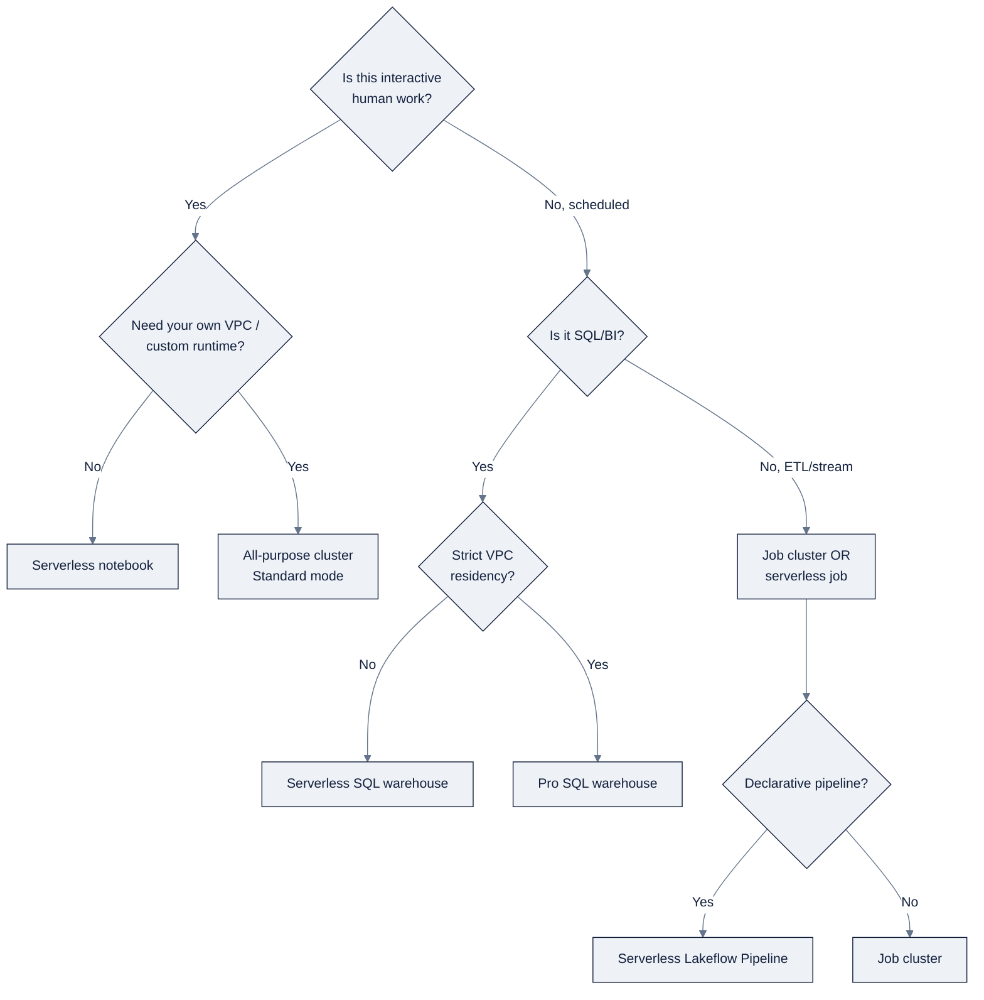

> **Part of AI Engineering Lab · Developed by Zorost Intelligence AI Lab · [zorost.com](https://zorost.com)**

# 02 · Compute: Clusters, Warehouses & Serverless

> **Find the Signal. Act with Intelligence.** · Databricks Module · Week 21

Compute is the "where does my code run?" answer. This file teaches the three families,
**serverless**, **classic** (all-purpose + job clusters), and **SQL warehouses**, plus the
levers that make compute *fast* and *cheap*: policies, autoscaling, access modes, Photon,
and DBU pricing. The through-line for ZoroLogistics is the same as for Zorost's FinOps
practice: **pick the smallest compute that meets the SLA, and turn it off when it's idle.**

> **⚠️ Verify against live docs.** SKU names, DBU rates, and feature availability differ by
> cloud and region; re-check [Sources](#sources) and `docs.databricks.com/llms.txt`.

---

## 1. The three families at a glance

| Family | Who manages it | Best for | Startup |
|---|---|---|---|
| **Serverless compute** | Databricks | Notebooks, jobs, pipelines, zero ops | ~seconds |
| **Classic (all-purpose / job clusters)** | You (in your cloud) | Interactive work, custom runtimes, VPC control | 1 to 5+ min |
| **SQL warehouses** | Databricks (serverless) or you (pro/classic) | Databricks SQL / BI | ~2 to 6 s (serverless) |

The key architectural fact: **classic compute runs in *your* virtual network** (natural
isolation, customer-managed VPCs, your security rules), while **serverless runs in a
Databricks-managed plane** in the same region. That single distinction drives most of the
"which compute" decisions below.

### The compute decision tree

Start at the top and answer truthfully; you'll land on a compute type in ≤3 steps:



**The one-liner version:** interactive → serverless/all-purpose; scheduled → job
cluster/serverless; SQL/BI → SQL warehouse; and "your VPC required" is the main reason to
leave serverless for classic.

---

## 2. All-purpose vs. job clusters

Both are "classic" Spark clusters (driver + workers). The difference is lifecycle and
purpose:

| | All-purpose (interactive) | Job cluster |
|---|---|---|
| Created by | User (UI/CLI/API) | Job scheduler, per run |
| Lifecycle | Manual terminate/restart; shared by a team | Created when the job runs, terminated when done; **cannot restart** |
| Use | Interactive notebooks, ad-hoc analysis | Scheduled/automated production |
| Billing workload | "Interactive" | "Automated/job", **cheaper per DBU** |

**Rule of thumb:** never run a *scheduled* workload on an all-purpose cluster, you pay the
interactive rate for something a job cluster does cheaper, and you lose the
tear-down-after-finish hygiene. Conversely, don't put interactive notebooks on job
clusters, they can't be shared or restarted.

A **single-node** cluster runs Spark locally on the driver (no workers), ideal for small
DataFrames and unit tests. **Fleet instance types** let Databricks auto-resolve an
available instance of a family instead of pinning one exact type.

---

## 3. Cluster configuration essentials

- **Databricks Runtime (DBR)**: Spark + Databricks optimizations. Variants: standard,
  **DBR for ML** (ML/DL libraries + GPU support), and **Long-Term Support (LTS)**
  (recommended for production stability).
- **Driver + workers**: one driver, zero or more workers (one executor each). Pick
  instance types per node, or fleet types. Single-node = driver only.
- **Photon**: Databricks' native C++ **vectorized query engine**. Default on SQL
  warehouses and serverless; default-on for classic DBR 9.1 LTS+. Billed at a different
  DBU rate. Accelerates SQL/DataFrame/ETL and stateless streaming, but *not* UDFs, RDDs,
  or stateful streaming.
- **Access modes**: see §4.

**Photon eligibility at a glance**: the "is my workload Photon-accelerated?" table:

| Workload | Photon? | Notes |
|---|---|---|
| SQL / DataFrame / ETL | ✅ Accelerated | The core value; prefer built-ins |
| Stateless streaming | ✅ Accelerated | Append-only stream transforms |
| Python UDFs | ❌ | Falls back to Spark's interpreter |
| RDD / Dataset code | ❌ | Legacy low-level API |
| Stateful streaming | ❌ | State store path differs |

### Creating compute: three ways

You can create a cluster/warehouse via **UI** (the Compute page), **CLI**, or **API/SDK**:

```bash
# List compute; then read the JSON for a cluster
databricks compute list
```

The UI is fine for exploration; for reproducibility you'll want the cluster *spec as code*
either a **DAB** (file 15) or a cluster policy (below). The habit: treat compute config
like any other code, versioned and reviewable, not click-created.

### Databricks Runtime variants (a closer look)

| Variant | What's in it | Use |
|---|---|---|
| **Standard DBR** | Spark + Databricks optimizations | General data engineering |
| **DBR for ML** | Standard + scikit-learn/XGBoost/PyTorch/TensorFlow + GPU drivers | Training (file 09) |
| **LTS (Long-Term Support)** | A pinned, patch-supported DBR line | Production, fewer surprises |

**LTS is the production default**: it changes less often and gets longer patch support, so a
nightly job doesn't silently pick up a breaking runtime bump. (Serverless "versionless"
compute sidesteps this by auto-upgrading, trade-off covered in §8.)

---

## 4. Access modes (Standard / Dedicated)

Access modes control how a cluster isolates users and whether UC + Photon are available.
**Current names first, legacy in parentheses:**

| Access mode | Formerly | Description | When |
|---|---|---|---|
| **Standard** | Shared | Multi-user; strong isolation between users; UC enabled; Photon available | Recommended default for most work |
| **Dedicated** | Single-user | One user/group; full language support (R, legacy Spark contexts, some libraries) | Legacy RDD/Scala code, niche libraries, no-UC cases |

> **Teach "Standard / Dedicated"** and note the old "Shared / Single-user" labels you will
> still see in older screenshots and courses. In general: choose **Standard** unless you
> hit a hard requirement only Dedicated satisfies.

---

## 5. Cluster policies

A **compute policy** (formerly "cluster policy") is a set of admin rules that **limit what
users can configure**. Use it to:

- Fix or hide settings (force a runtime, instance family, or access mode).
- Limit cluster count and **cap cost (max DBU/hour)**.
- Enforce library installs and **tags** (for cost attribution/chargeback).

Policies inherit from **policy families**, and admins can enforce compliance on existing
clusters. Without the "unrestricted cluster creation" entitlement, users can only create
compute **via policies**.

```jsonc
// A minimal cost-capping policy (conceptual)
{
  "dbus_per_hour": { "type": "range", "maxValue": 8 },
  "instance_pool_id": { "type": "fixed", "value": "pool-abc123" },
  "custom_tags.zrl.team": { "type": "fixed", "value": "zrl_data_engineers" }
}
```

### A fuller policy template (YAML)

The JSONC above is the *skeleton*; here's a complete policy expressed the way DABs and the
policy API carry it, with the fields you'll actually set:

```yaml
name: zrl-standard-compute
description: "ZoroLogistics default guardrails, cap cost, force tags, pin runtime"
definition: |
  {
    "spark_version": { "type": "fixed", "value": "15.4.x-lts", "hidden": true },
    "dbus_per_hour": { "type": "range", "maxValue": 16 },
    "autotermination_minutes": { "type": "fixed", "value": 30, "hidden": true },
    "spark_conf.spark.sql.shuffle.partitions": { "type": "unlimited" },
    "node_type_id": { "type": "allowlist", "values": ["i3.2xlarge", "i3.4xlarge"] },
    "custom_tags.zrl.team": { "type": "fixed", "value": "zrl_data_engineers" },
    "custom_tags.zrl.cost_center": { "type": "unlimited", "is_optional": false }
  }
```

What each field does:

| Field | Effect | Why it's in the template |
|---|---|---|
| `spark_version` (fixed/hidden) | Pins `15.4.x-lts`; users can't change it | Production stability (LTS) |
| `dbus_per_hour` (range) | Caps at 16 DBU/h | Cost ceiling, the headline guardrail |
| `autotermination_minutes` (fixed 30) | Forces 30-min idle shutdown | Kills the "left running overnight" leak |
| `node_type_id` (allowlist) | Only two instance types allowed | Right-sizing + predictable pricing |
| `custom_tags.zrl.*` (fixed/unlimited) | Forces a team tag, requires a cost-center | Chargeback (file 17) |

**For ZoroLogistics:** a policy is how the platform team guarantees "no engineer can spin a
$40/hr cluster by accident", the enforcement half of the FinOps discipline. The template
above is exactly what a Zorost Modernization Practice engagement hands a client on day one
of governance work.

---

## 6. Autoscaling

- **Optimized autoscaling** (Premium+): scales up in ≤2 events; scales down based on
  shuffle state + utilization windows.
- **Standard autoscaling** (Standard plan): adds 8 nodes then grows exponentially; scales
  down after 10 min of low activity.
- **Serverless** scales automatically and transparently, nothing to configure.
- **Anti-pattern:** do **not** enable Spark **Dynamic Allocation** *alongside* Databricks
  autoscaling, the two fight and cause churn / `NODES_LOST`.

Autoscaling is a *latency-vs-cost* tradeoff: it absorbs spikes without over-provisioning
24/7, at the cost of a brief scale-up delay. For a batch job that runs nightly, autoscaling
is usually worth it; for a latency-critical stream, consider fixed sizing.

### Tuning autoscaling (with numbers)

Autoscaling isn't "set and forget", three knobs and what to set them to:

| Knob | What it controls | Starting point | When to change |
|---|---|---|---|
| **Min/max workers** | The autoscale band | `min=2, max=8` for a nightly job | Widen the band if you see repeated scale-ups hit the max |
| **Scale-up speed** | Optimized (≤2 events) vs standard (8 nodes then exponential) | Optimized (Premium+) | Standard is the fallback on Standard plan |
| **Scale-down window** | Idle time before shrinking | Default (standard ~10 min) | Lower it for bursty BI; raise for streaming to avoid thrash |

**Rules of thumb that hold up:**

1. **Size the *min* for the steady state, the *max* for the spike.** If your nightly job
   idles at 4 workers but bursts to 12, set `min=4, max=12`, not `min=2` (cold scale-up
   latency) or `max=64` (a runaway).
2. **Don't let autoscaling fight Dynamic Allocation.** Enabling both causes churn and
   `NODES_LOST`: pick Databricks autoscaling, not Spark's.
3. **Streaming ≠ batch for scale-down.** A stream that dips below threshold and shrinks,
   then re-scales on every micro-burst, thrashes. Fixed sizing (or a wider band) is often
   cheaper for continuous streams.
4. **Measure, then tune.** Watch the cluster's *utilization* in the UI or
   `system.compute.*` before touching the band, a "slow" job is usually a partition/config
   problem (file 05), not an autoscale problem.

**ZoroLogistics example:** the nightly medallion job idles at ~3 workers and peaks at ~10
during the gold aggregation, so `min=3, max=12` on a job cluster absorbs the peak without
paying for 12 workers all night. The continuous shipment-events stream runs **fixed** at 4
workers, autoscaling a stream thrashes more than it saves.

---

## 7. SQL warehouses

SQL warehouses are analytics-optimized engines for Databricks SQL:

| Type | Compute | Photon | Predictive I/O | Intelligent Workload Mgmt (IWM) | Startup |
|---|---|---|---|---|---|
| **Serverless** | Databricks | ✓ | ✓ | ✓ (AI autoscaling) | ~2 to 6 s |
| **Pro** | Your cloud | ✓ | ✓ | n/a | ~4 min |
| **Classic** | Your cloud | ✓ | n/a | n/a | ~4 min |
| **Lakehouse Real-Time (Beta)** | Serverless | ✓ | n/a | n/a | sub-second reads |

- **Serverless** is the recommended default: instant start, AI-driven autoscaling
  (**Intelligent Workload Management**), no idle-cluster management.
- **Pro** keeps compute in your VPC (needed if your data access requires it) with predictive
  I/O but no IWM.
- **Auto Stop** default is **10 min** idle (min 5 via UI, 1 via API). **Idle still accrues
  DBUs**, set auto-stop aggressively for BI workloads.
- **Channels:** **Current** (production) and **Preview** (test upcoming versions).

**Rule of thumb:** classic/pro scale roughly **1 cluster per 10 concurrent queries**;
serverless autoscales clusters of a chosen size for you.

### Sizing a SQL warehouse

Warehouse "size" (2X-Small → 4X-Large) is really "one engine of this capacity"; serverless
spins up *clusters* of that size on demand. The sizing questions, in order:

| Question | What it tells you | Action |
|---|---|---|
| How many *concurrent* queries? | How many engines you need | <10 → one small engine; 50 → several or serverless autoscale |
| Are queries latency-critical (dashboards)? | Whether to size up | Interactive dashboards → size up, fewer spindles |
| Are queries mostly batch/ETL-ish? | Whether size matters less | Prefer many small engines over one big |
| Does data residency force Pro? | Serverless vs. Pro | VPC/network requirement → Pro |

**Starting points (classic/pro):**

- **2X-Small**: a handful of concurrent users, light queries.
- **Small/Medium**: the workhorse for a 10 to 50 user BI team.
- **Large+**: heavy joins/aggregations or many concurrent dashboard refreshes.

**The observation rule:** watch **query queueing** and **spilling to disk** in query history
(`system.query.history`). Queueing → add engines (serverless does this automatically via
IWM); spilling → size *up* the engine. Those two symptoms point in different directions, so
don't guess, read the history.

---

## 8. Serverless notebooks & jobs

**Serverless compute** is Databricks-managed on-demand compute for **notebooks, jobs, and
Lakeflow Pipelines**, no cluster in your cloud account. Properties:

- **"Versionless"**: always latest runtime, auto-upgraded (you stop pinning DBR).
- Billed under **serverless SKUs** (see §9).
- Serverless notebooks have a default **2.5 h execution timeout** (overspend protection).
- Limitations vs. classic: no custom data sources (Federation only), no cluster/spot
  policies, and customer-managed VPC/keys don't apply.

### Serverless limits: what you give up (and don't)

Serverless isn't "classic but free." It's a *different contract*; know the edges before you
commit a workload:

| Capability | Serverless | Classic | Decision |
|---|---|---|---|
| Custom data sources (JDBC on-prem) | Federation only | Any | Need raw JDBC? → classic |
| Cluster/spot policies | Not applicable | Yes | Need policy guardrails? → classic (or budgets) |
| Customer-managed VPC / keys | Not applicable | Yes | Compliance requires it? → classic |
| Pin a runtime (DBR) | No, "versionless" | Yes (LTS) | Need a frozen runtime? → classic |
| Idle cost / start latency | ~None / ~seconds | Yes / minutes | Latency- or cost-sensitive? → serverless |
| Execution timeout | 2.5 h default (notebooks) | Configurable | Long-running train? → classic or AI Runtime |

**The mental model:** serverless trades *control* (VPC, runtime pin, policies) for *zero-ops
elasticity*. If your workload doesn't need the control, serverless is almost always the
lower-total-cost choice, the premium DBU rate is outweighed by no idle time and no
over-provisioning.

For ZoroLogistics' Week 22 pipeline, **serverless Lakeflow Pipelines** are the low-ops
default: you write the pipeline, Databricks runs it. But the Week 23 **GPU training** stays
on **AI Runtime** (serverless GPU) or a classic **DBR ML** cluster, training needs pinned
libraries, not just elasticity (file 09).

---

## 9. DBU pricing & cost levers

A **DBU (Databricks Unit)** is a unit of *processing capability per hour, based on the VM
instance type*. Billing is **pay-as-you-go at per-second granularity**; **Committed Use
Contracts** give discounts. Rates vary by **SKU (workload), cloud, and region**; Photon
instances bill differently.

| SKU tier | Applies to |
|---|---|
| **Jobs Compute** | Automated/job workloads (also a "Jobs Light" variant) |
| **All-Purpose Compute** | Interactive/notebook workloads (higher rate) |
| **SQL** | DBSQL warehouses (`CLASSIC`/`PRO`; serverless billed separately) |
| **Serverless** | Serverless jobs, notebooks, Lakeflow Pipelines |

**Cost levers, strongest first:**

1. **Right-size the workload**: job cluster vs. all-purpose; serverless vs. classic.
2. **Auto-terminate / auto-stop**: kill idle compute (clusters 10 to 10,000 min; warehouses
   default 10 min idle).
3. **Spot instances** for latency-tolerant workers (driver always on-demand).
4. **Instance pools**: pre-warmed idle instances (pay cloud cost, **no DBUs while idle**)
   for faster start/scale; note Databricks now recommends **serverless instead of pools**
   where supported.
5. **Compute policies + tags**: caps and chargeback.
6. **Budgets & alerts**: account-wide or filtered by team/project/workspace.

**Spot vs. instance pools vs. serverless**: three ways to cut classic cost, compared:

| Mechanism | How it saves | Tradeoff | Use when |
|---|---|---|---|
| **Spot instances** | Discounted worker VMs | Can be reclaimed mid-run (driver stays on-demand) | Latency-tolerant batch workers |
| **Instance pools** | Pre-warmed idle VMs (no DBUs while idle) | Faster start, but you still manage the pool | Predictable classic workloads; else prefer serverless |
| **Serverless** | No idle, no over-provisioning | Premium DBU rate, less control | The default when you don't need VPC/runtime pin |

**Serverless vs. classic economics:** serverless has a **premium DBU rate** but often
*lower total cost of ownership* because it eliminates idle time and over-provisioning.
Classic is predictable but you pay for idle and manage patching/scaling.

### A DBU cost worked example (ZoroLogistics)

Rough mental math (rates vary, treat as illustration, not a quote):

- A **job cluster** of 2 × `i3.2xlarge` runs 1 h/night at ~2.5 DBU/h each → ~5 DBU/night
  → ~150 DBU/month on the *Jobs* SKU.
- The same compute as an **all-purpose** cluster left running 24/7 → ~2.5 × 2 × 24 × 30 ≈
  **3,600 DBU/month** on the *higher* all-purpose SKU, **~24× the cost** for the same work.

The lesson isn't the exact numbers, it's the *order of magnitude*: idle interactive
compute dominates the bill far more than the per-DBU rate does. That's why "auto-terminate
+ job cluster for scheduled work" (levers 2 and 1) beat "hunt for a cheaper instance type"
every time.

### Cost-per-DBU worked examples (the full table)

Work the same ZoroLogistics nightly job through four deployment choices. All numbers are
illustrative (DBU rates vary by cloud/region, treat as *relative*, not a quote):

| Scenario | Compute | Nodes × DBU/h | Hours/month | DBU/month | The cost driver |
|---|---|---|---|---|---|
| Interactive, left running 24/7 | All-purpose cluster | 2 × 2.5 = 5 | 720 | ~3,600 | **Idle time** at the higher interactive rate |
| Nightly job cluster | Job cluster, auto-terminate | 5 × 1 h | 30 | ~150 | Right SKU + teardown |
| Serverless job | Serverless (auto-scale) | ~5 × 1 h | 30 | ~150 × premium rate | Premium DBU, but zero idle |
| Over-provisioned job | Job cluster `min=12` fixed | 12 × 2.5 = 30 | 30 | ~900 | **Over-provisioning** (the spike left on all night) |

**Three takeaways you can bank:**

1. **Idle interactive compute is the #1 bill item**: 3,600 DBU vs 150 DBU for the *same
   work* on a job cluster. Fix this before anything else.
2. **Serverless' premium rate is usually a rounding error** next to idle/over-provisioning.
   The serverless job's "premium" 150 DBU is still ~24× cheaper than the 3,600-DBU
   interactive case.
3. **Over-provisioning is the quiet second leak.** `min=12` "just in case" costs ~6× the
   right-sized `min=3, max=12` band. Autoscaling exists to close exactly this gap.

**The formula to memorize:** `cost ≈ DBU rate × nodes × duration × SKU`. Attack the *biggest
multiplier* first, for almost everyone that's duration (idle) or nodes (over-provisioning),
not the rate.

### Reading your actual bill

```sql
SELECT sku_name, SUM(usage_quantity) AS dbus
FROM system.billing.usage
WHERE usage_date >= CURRENT_DATE - INTERVAL 30 DAYS
GROUP BY sku_name
ORDER BY dbus DESC;
```

Join `system.billing.list_prices` for cost, and filter by `custom_tags` for chargeback.
File `17-finopps-cost.md` goes deeper.

---

## 10. When to use what: the decision table

| Situation | Use | Why |
|---|---|---|
| Interactive notebook, ad-hoc exploration | **All-purpose** (Standard mode) or **serverless notebook** | Shared, restartable; serverless = zero ops |
| Nightly batch job | **Job cluster** or **serverless job** | Cheaper SKU; auto-teardown |
| Production BI / SQL | **Serverless SQL warehouse** | Instant start, IWM autoscaling |
| BI with strict VPC data-residency needs | **Pro SQL warehouse** | Compute stays in your VPC |
| Lakeflow Pipeline | **Serverless pipeline** (default) or job-cluster-backed | Managed, auto-orchestrated |
| Legacy Spark RDD / Scala / niche lib | **Dedicated** cluster | Full language + library surface |
| Many ad-hoc users, cost risk | Compute **policies** + budgets + tags | Guardrails + chargeback |
| Fast cluster start/scale, predictable cloud | **Instance pools** (or serverless) | Pre-warmed instances |
| ML/DL training (GPU) | **DBR ML** cluster or **AI Runtime** (file 09) | Preinstalled ML libs, GPU |

---

## 11. Checklist

- [ ] Can draw the three compute families and say where each runs (your VPC vs. Databricks).
- [ ] State the difference between all-purpose and job clusters (lifecycle + billing).
- [ ] Explain Photon and name two things it does *not* accelerate.
- [ ] Use **Standard** access mode by default and know when **Dedicated** is required.
- [ ] Wrote a conceptual cluster policy with a max DBU/hour and a cost tag.
- [ ] Explained optimized vs. standard autoscaling and the Dynamic Allocation anti-pattern.
- [ ] Picked serverless vs. pro SQL warehouse for a given data-residency requirement.
- [ ] Computed a rough DBU cost and applied ≥3 cost levers to a ZoroLogistics scenario.

**Definition of done:** given any ZoroLogistics workload (ad-hoc, nightly batch, BI, stream,
ML), you can name the compute type, the SKU tier, and one cost lever, in under a minute.

---

## Try it

Three hands-on tasks. Do them in order; each has a check you can run.

### Task 1: Author a policy, then read it back

Write the ZoroLogistics cost-capping policy to a file and validate it with the CLI:

```bash
cat > zrl-policy.json <<'EOF'
{
  "dbus_per_hour": { "type": "range", "maxValue": 16 },
  "autotermination_minutes": { "type": "fixed", "value": 30, "hidden": true },
  "custom_tags.zrl.team": { "type": "fixed", "value": "zrl_data_engineers" }
}
EOF
databricks cluster-policies list
```

**Acceptance check:** you can explain what each of the three fields enforces, and
`databricks cluster-policies list` shows the existing policies in the workspace (your new
one appears once created via the UI/API). The JSON is valid and parses without error.

### Task 2: Compute the four-scenario cost table for your own job

Take the Nightly-job cluster math and re-derive the four numbers by hand:

```text
given: 2 nodes × 2.5 DBU/h, 1 h/night, 30 nights
interactive 24/7 → 5 DBU/h × 720 h  = ?
job cluster     → 5 DBU/h × 30 h   = ?
over-provisioned → 12 nodes × 2.5 × 30 h = ?
```

**Acceptance check:** your three answers land at ~3,600 / ~150 / ~900 DBU respectively, and
you can state *which multiplier* (duration vs. nodes vs. rate) dominates each gap.

### Task 3: Right-size a SQL warehouse's auto-stop

Check the current auto-stop on your warehouse and set it to the minimum via the API/UI:

```bash
databricks warehouses list
```

**Acceptance check:** you can state the default (10 min idle), the minimum (5 min via UI,
1 min via API), and *why* idle DBUs still accrue, then set auto-stop to the most aggressive
value your BI workload tolerates.

---

## Common mistakes

1. **Running scheduled jobs on an all-purpose cluster.** You pay the interactive rate and
   lose teardown hygiene. *Fix:* scheduled = job cluster (or serverless); interactive =
   all-purpose/serverless notebook.
2. **Leaving the default 200 `shuffle.partitions` on a 4-core cluster.** 200 tiny tasks on 4
   cores = scheduler overhead. *Fix:* tune to 1 to 2× executor cores (file 05).
3. **Enabling Dynamic Allocation *and* Databricks autoscaling.** They fight and cause churn /
   `NODES_LOST`. *Fix:* pick one, Databricks autoscaling.
4. **Treating Photon as a free speedup.** It accelerates SQL/DataFrame/ETL but *not* UDFs,
   RDDs, or stateful streaming. *Fix:* prefer built-ins; know what's Photon-eligible.
5. **Ignoring idle DBUs on SQL warehouses.** Auto-stop off = you pay while nobody queries.
   *Fix:* set auto-stop aggressively (10 min default → 5 min via UI).
6. **Choosing serverless "because it's new."** Serverless trades VPC/runtime/policy control
   for elasticity. *Fix:* use the §1 decision tree, "your VPC required" is the classic
   signal.

> **Next:** [03-delta-lake.md](03-delta-lake.md), now that you know *where* code runs, the
> next file teaches *what it writes to*: the Delta storage layer underneath every table.

---

## Sources

- https://docs.databricks.com/compute/
- https://docs.databricks.com/compute/configure
- https://docs.databricks.com/compute/serverless/
- https://docs.databricks.com/compute/photon
- https://docs.databricks.com/compute/sql-warehouse/
- https://docs.databricks.com/compute/sql-warehouse/warehouse-types
- https://docs.databricks.com/admin/clusters/policies
- https://docs.databricks.com/compute/pool-index
- https://docs.databricks.com/admin/system-tables/billing
- https://docs.databricks.com/admin/usage
- https://www.databricks.com/product/pricing
- https://docs.databricks.com/llms.txt

> *This is original curriculum written in AI Engineering Lab's own words; no third-party
> course material was copied. SKU names and DBU rates change by cloud/region, verify
> against the live links above.*

---

© 2026 Zorost Intelligence LLC · [zorost.com](https://zorost.com)
