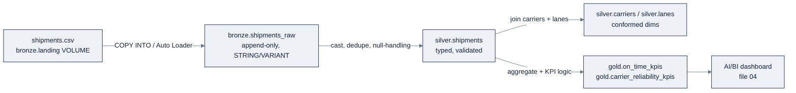

> **Part of AI Engineering Lab · Developed by Zorost Intelligence AI Lab · [zorost.com](https://zorost.com)**

# 03 · Delta Lake: The Storage Layer

> **Find the Signal. Act with Intelligence.** · Databricks Module · Week 21

Delta Lake is the storage layer *everything* sits on: every table on Databricks is a Delta
table unless you say otherwise. This file teaches what that buys you, ACID transactions,
time travel, schema evolution, and the maintenance operations (`VACUUM`, `OPTIMIZE`,
clustering), then turns it into the **medallion architecture** for ZoroLogistics.

> **⚠️ Verify against live docs.** Version-specific features (VACUUM LITE, liquid
> clustering, automatic CDF) are tied to Databricks Runtime versions; re-check
> [Sources](#sources) and `docs.databricks.com/llms.txt`.

---

## 1. What Delta Lake is

Delta Lake extends **Parquet** with a **file-based transaction log** (the `_delta_log/`
directory of JSON transaction entries) to add:

- **ACID transactions** on top of object storage,
- **schema enforcement & evolution**,
- **time travel** (query any prior version),
- a single copy of data serving **both batch and streaming** (Structured Streaming).

Because the transaction log *is* the source of truth for metadata, readers get consistent
snapshots and writers get serializability without a separate catalog service.

---

## 2. Table formats (one paragraph of context)

"Table format" = the open spec that turns a folder of files into a *table* with ACID
semantics. The main ones are **Delta Lake**, **Apache Iceberg**, and **Apache Hudi**.
Databricks' default is **Delta**, and it also supports **Iceberg** tables (managed, or via
external-engine reads). The concepts below, a transaction log, snapshots, column stats for
data skipping, are shared across formats; this module teaches them through Delta.

---

## 3. ACID transactions

- Each **SQL statement is its own atomic transaction**: it commits fully or not at all.
- **Multi-statement transactions** via `BEGIN ATOMIC … END`:

```sql
BEGIN ATOMIC
  DELETE FROM zrl_.silver.shipments WHERE status = 'CANCELLED';
  INSERT INTO zrl_.gold.on_time_kpis SELECT ... ;
END;
```

- **Concurrency model:** **optimistic concurrency control**, writers don't block each
  other up front; conflicts are detected at commit. Readers get **snapshot isolation**,
  writers get **write-serializable** isolation.
- **PK/FK constraints are informational only**: they are *not* enforced (enforcement is
  your pipeline's job; see expectations in file 06).

**Schema enforcement & evolution:**

- Writes are validated against the table schema (safe casts attempted; mismatches fail).
- Evolve explicitly with `ALTER TABLE` (add/reorder/rename/type-widening), or implicitly via
  `mergeSchema` (`spark.databricks.delta.schema.autoMerge.enabled=true`).

```sql
ALTER TABLE zrl_.silver.shipments ADD COLUMNS (insurance_covered BOOLEAN DEFAULT FALSE);
```

---

## 4. Time travel (worked example)

Every write creates a new **table version**. You can read any prior version:

```sql
-- Load current shipments, then "go back in time" three versions
SELECT * FROM zrl_.silver.shipments VERSION AS OF 3;
SELECT * FROM zrl_.silver.shipments TIMESTAMP AS OF '2026-08-01T00:00:00';
-- @-syntax shorthand
SELECT * FROM zrl_.silver.shipments@v3;
```

**Worked example: audit a bad update.** A botched `UPDATE` zeroed out weights:

```sql
-- 1. You realize weights are wrong in the current version.
SELECT version, timestamp, operation, operationMetrics
FROM (DESCRIBE HISTORY zrl_.silver.shipments)
ORDER BY version DESC;

-- 2. Version 12 was the good state; roll back to it.
RESTORE TABLE zrl_.silver.shipments TO VERSION AS OF 12;

-- 3. Confirm the fix, then inspect the restored values.
SELECT shipment_id, weight_kg FROM zrl_.silver.shipments WHERE weight_kg > 0;
```

**Retention:** the transaction log keeps history for `logRetentionDuration` (default **30
days**) and data files for `deletedFileRetentionDuration` (default **7 days**). Time travel
works within those windows (see VACUUM for the interaction).

**Streaming note:** `readChangeFeed` / `table_changes()` (see §8) is how you *stream* the
same row-level history time travel lets you *query*.

### The full time-travel lab

Do this end-to-end to *feel* versioning, not just read about it. Each block is a cell you
can run in order.

```sql
-- 0. Start from a small working table
CREATE OR REPLACE TABLE zrl_.silver.shipments_tt (
  shipment_id STRING, weight_kg DOUBLE, status STRING) USING DELTA;

INSERT INTO zrl_.silver.shipments_tt VALUES ('S001', 850.0, 'In Transit');   -- version 1
INSERT INTO zrl_.silver.shipments_tt VALUES ('S002', 1200.0, 'In Transit');  -- version 2
UPDATE zrl_.silver.shipments_tt SET status = 'Delivered' WHERE shipment_id = 'S001'; -- v3
DELETE FROM zrl_.silver.shipments_tt WHERE shipment_id = 'S002';             -- v4
```

Now the history *is* the audit trail:

```sql
-- 1. Read the transaction log
DESCRIBE HISTORY zrl_.silver.shipments_tt;

-- 2. Read any prior state
SELECT * FROM zrl_.silver.shipments_tt VERSION AS OF 2;   -- both rows, pre-update
SELECT * FROM zrl_.silver.shipments_tt@v3;                -- S001 delivered, S002 still there

-- 3. Compare "now" vs "then" without touching either
SELECT 'now' AS snapshot, shipment_id, status FROM zrl_.silver.shipments_tt
UNION ALL
SELECT 'v2', shipment_id, status FROM zrl_.silver.shipments_tt VERSION AS OF 2;

-- 4. Roll back a mistake
RESTORE TABLE zrl_.silver.shipments_tt TO VERSION AS OF 3;  -- undo the DELETE
SELECT COUNT(*) FROM zrl_.silver.shipments_tt;              -- back to 2 rows
```

**What this proves:** every `INSERT`/`UPDATE`/`DELETE` is a *separate recoverable version*.
A bad update isn't a crisis, it's `RESTORE TABLE` away. The whole lab is why "we need to
restore Friday's data" is a query, not a tape-restore ticket.

**The version you can't reach:** once you `VACUUM` (next section) past the retention window,
those versions' files are gone. Time travel is *bounded* by retention, that's the contract.

---

## 5. VACUUM

`VACUUM` **permanently deletes** data files older than the retention threshold (default **7
days**), reclaiming storage:

```sql
-- Preview what would be removed (no-op)
VACUUM zrl_.silver.shipments DRY RUN;

-- Remove files older than the retention window (default 7 days)
VACUUM zrl_.silver.shipments;

-- With an explicit retention
VACUUM zrl_.silver.shipments RETAIN 168 HOURS;
```

- **After VACUUM, time travel past the retention window is impossible**: the files are
  gone. Set retention ≥ your longest legitimate rollback window.
- **`VACUUM … LITE`** (DBR 16.4 LTS+) is a faster, log-based variant.
- Soft-deleted rows (from **deletion vectors** or dropped columns) are physically removed
  only after `REORG TABLE … APPLY (PURGE)`.

**Rule of thumb:** VACUUM is a scheduled maintenance job (weekly is common), *not* something
to run after every write, and never on bronze if audit requires long-term raw history.

---

## 6. OPTIMIZE + Z-ORDER

- **`OPTIMIZE`** compacts small files into larger ones (**bin-packing**) to reduce the
  metadata overhead of many tiny files.
- **`ZORDER BY (cols)`** colocates related data so queries on those columns can **skip
  data** (data-skipping uses the file-level min/max stats in the log).

```sql
OPTIMIZE zrl_.silver.shipments;
OPTIMIZE zrl_.silver.shipments ZORDER BY (carrier_id, lane_id);
```

> **Heads-up:** Z-order and Hive-style partitioning are **now superseded by liquid
> clustering** (§7). Teach OPTIMIZE/ZORDER because existing tables use them, but reach for
> `CLUSTER BY` on new tables.

### VACUUM vs. OPTIMIZE: the tradeoff table

New Delta users conflate the two. They're opposite in purpose and in *risk*:

| | VACUUM | OPTIMIZE (+ ZORDER/CLUSTER) |
|---|---|---|
| Purpose | Delete old data files (reclaim storage) | Reorganize files (speed queries) |
| Affects | Storage size ↓ | Query latency ↓ |
| Destructive? | **Yes**, removes files past retention | No (rewrites, doesn't delete logic) |
| Interacts with time travel | **Kills it past retention** | Leaves history intact |
| Run it | Scheduled (weekly), retention-aware | Scheduled (after big loads), latency-driven |
| Dry run | `VACUUM … DRY RUN` | n/a (OPTIMIZE is safe) |
| Cost | Cheap | Reads + rewrites the table (can be expensive) |

**The rule:** run `OPTIMIZE` after large appends to control small-file overhead; run
`VACUUM` on a *schedule* with a retention you've committed to. Never VACUUM a bronze table
if audit requires replay-from-source, bronze is your lossless record.

---

## 7. Liquid clustering

**Liquid clustering** (`CLUSTER BY`) automatically organizes data for data-skipping *and*
lets you **change clustering keys without rewriting**, the fix for the classic pain where
re-partitioning a big table meant a full rewrite.

```sql
CREATE TABLE zrl_.silver.shipments (
  shipment_id STRING, carrier_id STRING, lane_id STRING, delivered_at TIMESTAMP, ...
) USING DELTA
  CLUSTER BY (carrier_id, lane_id);
```

- Change keys later, **no rewrite**: `ALTER TABLE zrl_.silver.shipments CLUSTER BY (lane_id);`
- **`CLUSTER BY AUTO`** lets Databricks adapt the keys from workload automatically.
- GA for Delta on **DBR 15.4 LTS+**; recommended for all new tables.

**For ZoroLogistics:** cluster shipments by `carrier_id, lane_id`, the two filter columns
in every on-time query (file 04), instead of hard-partitioning by a date you may want to
change later.

### Liquid clustering rules (when, and when not)

Liquid clustering is the default for new tables, but a few rules keep it from backfiring:

| Rule | Guidance | Why |
|---|---|---|
| **Pick filter columns, not all columns** | 1 to 4 keys max; the columns your queries `WHERE` on | More keys = more overhead, less skipping |
| **High-cardinality first** | Put the most selective key first (`carrier_id` before `lane_id`) | Order matters for skip efficiency |
| **Don't over-cluster small tables** | < ~1 GB, clustering is noise | Overhead outweighs benefit |
| **Change keys freely** | `ALTER TABLE … CLUSTER BY (…)`, no rewrite | That's the whole point vs. partitioning |
| **Let `CLUSTER BY AUTO` adapt** | On tables with evolving access patterns | Databricks re-keys from observed workload |
| **Clustering ≠ partitioning** | It's incremental, not a hard directory split | You avoid the classic full-rewrite repartition |

**The migration path:** existing Z-ordered/partitioned tables keep working; when you rebuild
or the table gets big, switch to `CLUSTER BY`. New tables → `CLUSTER BY` from day one.

---

## 8. Deletion vectors & the change data feed

**Deletion vectors** mark rows deleted in *metadata* instead of rewriting the whole Parquet
file, which accelerates `DELETE`/`UPDATE`/`MERGE`:

```sql
CREATE TABLE zrl_.silver.shipments (...) USING DELTA
  TBLPROPERTIES ('delta.enableDeletionVectors' = 'true');
```

- Reads require DBR 12.2 LTS+; "all-optimized" writes DBR 14.3 LTS+.
- Iceberg **v3** tables include deletion vectors by default.

**Change data feed (CDC)** tracks row-level changes between versions:

```sql
-- Row-level changes between versions 5 and 8
SELECT * FROM table_changes('zrl_.silver.shipments', 5, 8);
```

Each row carries metadata columns: `_change_type` (`insert`/`update_preimage`/
`update_postimage`/`delete`), `_commit_version`, `_commit_timestamp`.

Two ways to get it:

| Approach | How | When |
|---|---|---|
| **Automatic CDF** (Public Preview, DBR 18 LTS+) | Computed at query time, no write overhead | Newer runtimes; prefer this |
| **Legacy CDF** | Materialized at write: `delta.enableChangeDataFeed = true` | Older runtimes / existing tables |

> **Naming note:** this table-level CDC is related to, but distinct from, the
> **`AUTO CDC`** (formerly `APPLY CHANGES`) clause inside Lakeflow Pipelines (file 06),
> which turns a CDC feed into SCD Type 1/2 tables. `table_changes()`/`readChangeFeed`
> *produces* the change feed; `AUTO CDC` *consumes* it.

### CDC worked example: read the change feed, then consume it

**Produce** the feed (this file's concern): after a few writes, read exactly what changed:

```sql
-- What changed between versions 1 and 4?
SELECT shipment_id, _change_type, _commit_version, _commit_timestamp
FROM table_changes('zrl_.silver.shipments', 1, 4);
```

| `_change_type` | Means |
|---|---|
| `insert` | New row |
| `update_preimage` | The *before* image of an updated row |
| `update_postimage` | The *after* image of an updated row |
| `delete` | Removed row |

**Consume** it into a versioned history table (the SCD Type 2 pattern, in SQL you can read,
the pipeline version is `AUTO CDC` in file 06):

```sql
-- Conceptual: apply changes to a target keyed by shipment_id, ordered by event time
-- (In a Lakeflow Pipeline this is the single APPLY CHANGES / AUTO CDC clause.)
CREATE OR REPLACE TABLE zrl_.silver.shipment_status_history (
  shipment_id STRING, status STRING, event_time TIMESTAMP,
  __START_AT TIMESTAMP, __END_AT TIMESTAMP) USING DELTA;
```

The SCD Type 2 columns `__START_AT`/`__END_AT` give you "what was this shipment's status *as
of* a date?", the same *point-in-time* instinct the feature store uses for ML features
(file 08). CDC and time travel are two views of the same idea: **row-level history is
queryable, not just loggable.**

```sql
-- Stream the same change feed into a downstream table (file 06 goes deeper)
-- SELECT * FROM STREAM(table_changes('zrl_.silver.shipments', 1)) ...
```

---

## 9. Medallion architecture (with ZoroLogistics mapping)

The **medallion** (bronze → silver → gold) is a *recommended best practice*, not a
requirement: a progressive data-quality pattern where each layer adds trust.

| Layer | Purpose | Rules | Consumers |
|---|---|---|---|
| **Bronze (raw)** | Ingest raw, unvalidated data; **append-only**; preserve source fidelity (store as `STRING`/`VARIANT`/`BINARY`) | No cleaning, no deletes | Data engineers, audit/compliance |
| **Silver (validated)** | Clean, dedupe, normalize, enforce schema, handle nulls/late data, join | Schema enforced; deduped; SCD-typed | Data engineers, analysts, scientists |
| **Gold (enriched)** | Aggregated, dimensional-modeled, business-aligned | Business rules + KPIs | BI, analysts, ML, executives |

**ZoroLogistics mapping:**

| Layer | Tables | What happens |
|---|---|---|
| **Bronze** | `shipments_raw`, `shipment_events_raw` | Raw CSV/JSON landed as-is from the `landing` volume; every field a string; append-only |
| **Silver** | `shipments`, `carriers`, `lanes` | Cast types, drop dupes, null-handling, join carriers/lanes into conformed dimensions |
| **Gold** | `on_time_kpis`, `carrier_reliability_kpis` | `on_time = delivered_at <= promised_at`; aggregate by carrier/lane/month |

**The medallion as a flow:**



**The medallion in SQL (skeleton):**

```sql
-- BRONZE: raw append
CREATE TABLE zrl_.bronze.shipments_raw (shipment_id STRING, carrier_id STRING, /* ... */)
  USING DELTA;

-- SILVER: typed + deduped
CREATE TABLE zrl_.silver.shipments AS
SELECT CAST(shipment_id AS STRING) AS shipment_id,
       CAST(carrier_id  AS STRING) AS carrier_id,
       CAST(shipped_at  AS TIMESTAMP) AS shipped_at,
       CAST(delivered_at AS TIMESTAMP) AS delivered_at,
       CAST(promised_at AS TIMESTAMP) AS promised_at,
       CAST(weight_kg   AS DOUBLE)   AS weight_kg
FROM (SELECT *, ROW_NUMBER() OVER (PARTITION BY shipment_id ORDER BY ingested_at DESC) rn
      FROM zrl_.bronze.shipments_raw)
WHERE rn = 1;

-- GOLD: business KPIs
CREATE TABLE zrl_.gold.on_time_kpis AS
SELECT carrier_id,
       DATE_TRUNC('MONTH', delivered_at) AS month,
       AVG(CASE WHEN delivered_at <= promised_at THEN 1 ELSE 0 END) AS on_time_rate,
       COUNT(*) AS shipments
FROM zrl_.silver.shipments
GROUP BY carrier_id, DATE_TRUNC('MONTH', delivered_at);
```

> In file 06 you'll rebuild this same bronze→silver→gold **declaratively** with Lakeflow
> Pipelines + expectations; here it's hand-written SQL so you own the mechanics.

**Medallion best practices (Zorost):**

1. **Bronze is append-only and lossless**: store as `STRING`/`VARIANT`/`BINARY`, add an
   `ingested_at` timestamp, and never delete. Bronze is your replay-from-source guarantee.
2. **Silver is the "single source of truth"**: dedupe on the natural key (`shipment_id`),
   enforce types, handle nulls. Most downstream consumers read *silver*.
3. **Gold is business-shaped**: star/snowflake or aggregate tables with clear KPI columns
   (`on_time_rate`), not raw facts.
4. **Separate layers by schema** (`bronze`/`silver`/`gold`) so a `GRANT` on a schema
   *is* a trust statement (file 01).
5. **Cluster gold by query columns** (`carrier_id`, `lane_id`) for the dashboard filters
   that hit it (file 04).

### Design patterns: bronze/silver/gold, fully worked

The skeleton above is the *shape*; here are the patterns you'll actually repeat, with the
"why" for each layer.

**Bronze: lossless, append-only, typed as little as possible:**

```sql
CREATE TABLE zrl_.bronze.shipments_raw (
  shipment_id STRING, carrier_id STRING, lane_id STRING,
  commodity STRING, weight_kg STRING, value_usd STRING,
  planned_departure STRING, planned_arrival STRING, actual_arrival STRING,
  delay_hours STRING, is_on_time STRING, status STRING, weather_severity STRING,
  ingested_at TIMESTAMP
) USING DELTA;

INSERT INTO zrl_.bronze.shipments_raw
SELECT *, current_timestamp() FROM read_files(
  '/Volumes/zrl_/bronze/landing/shipments.csv', format => 'csv', header => true);
```

Why `STRING` everywhere: a bad `weight_kg` value can't break the ingest. Bronze's job is
*never to fail*: you validate later, in silver.

**Silver: typed, deduped, joined into conformed entities:**

```sql
CREATE TABLE zrl_.silver.shipments AS
SELECT shipment_id, carrier_id, lane_id,
       CAST(weight_kg AS DOUBLE) AS weight_kg,
       CAST(value_usd AS DOUBLE) AS value_usd,
       CAST(planned_departure AS TIMESTAMP) AS shipped_at,
       CAST(planned_arrival AS TIMESTAMP) AS promised_at,
       CAST(actual_arrival AS TIMESTAMP) AS delivered_at,
       CAST(delay_hours AS DOUBLE) AS delay_hours,
       (delivered_at <= promised_at) AS on_time,
       status, weather_severity
FROM (
  SELECT *, ROW_NUMBER() OVER (PARTITION BY shipment_id ORDER BY ingested_at DESC) rn
  FROM zrl_.bronze.shipments_raw
)
WHERE rn = 1 AND weight_kg IS NOT NULL AND weight_kg > 0;
```

**Gold: business-shaped aggregates with clear KPI names:**

```sql
CREATE TABLE zrl_.gold.on_time_kpis AS
SELECT carrier_id, DATE_TRUNC('MONTH', delivered_at) AS month,
       COUNT(*) AS shipments,
       ROUND(AVG(CASE WHEN on_time THEN 1 ELSE 0 END), 4) AS on_time_rate,
       ROUND(AVG(delay_hours), 2) AS avg_delay_hours
FROM zrl_.silver.shipments
GROUP BY carrier_id, DATE_TRUNC('MONTH', delivered_at);
```

**The pattern in one line per layer:** bronze = *never fail*; silver = *never lie*; gold =
*never make the business recompute*. Each layer adds a guarantee the next one relies on.

---

## 10. Streaming vs. batch tables

Delta unifies both: a table can be **batch-loaded** (full rewrites/merges) or written by a
**Structured Streaming** job with the same DataFrame API. Key guidance:

| | Batch table | Streaming table (Delta sink) |
|---|---|---|
| Write | `INSERT` / `MERGE` / `OVERWRITE` | `toTable()` / `foreachBatch` micro-batches |
| Freshness | On schedule | Near-real-time |
| Sink modes | n/a | **Append** (default) or **Complete**; **Update is not supported** for Delta |
| Example | `zrl_.gold.on_time_kpis` nightly | `zrl_.silver.shipment_events` from Auto Loader |

A table written by a stream is still a normal Delta table, analysts query it with plain
SQL; the streaming machinery is just *how it gets written*. That's the "one copy of data
for batch + streaming" promise in practice.

```python
# Streaming write to a Delta table (file 06 covers pipelines/streams in depth)
(df.writeStream
   .format("delta")
   .outputMode("append")
   .option("checkpointLocation", "/Volumes/zrl_/silver/checkpoints/events")
   .toTable("zrl_.silver.shipment_events"))
```

---

## 11. Checklist

- [ ] Explained how the transaction log gives ACID + time travel over object storage.
- [ ] Named the three table formats and Databricks' default.
- [ ] Ran a time-travel query and `RESTORE TABLE` in a worked example.
- [ ] Ran `VACUUM … DRY RUN` and can state the retention tradeoff.
- [ ] Ran `OPTIMIZE`/`ZORDER BY` and explained data-skipping.
- [ ] Created a table with `CLUSTER BY` and changed its keys without a rewrite.
- [ ] Enabled deletion vectors and queried `table_changes()` for a version range.
- [ ] Distinguished Automatic CDF from legacy CDF, and from pipelines' `AUTO CDC`.
- [ ] Mapped ZoroLogistics bronze/silver/gold and wrote the medallion SQL.
- [ ] Stated the Delta streaming sink modes (Append/Complete; not Update).

**Definition of done:** you can explain, in your own words, what Delta adds on top of
Parquet, and defend a `CLUSTER BY` choice and a VACUUM retention window for a
ZoroLogistics table.

---

## Try it

Three hands-on tasks. Do them in order; each has a check you can run.

### Task 1: Run the full time-travel lab, then break it

Recreate `shipments_tt` from §4, make four writes, and answer from the history:

```sql
DESCRIBE HISTORY zrl_.silver.shipments_tt;
SELECT * FROM zrl_.silver.shipments_tt VERSION AS OF 2;
```

**Acceptance check:** `DESCRIBE HISTORY` shows ≥4 versions with `operation` values
(`WRITE`, `UPDATE`, `DELETE`), and `VERSION AS OF 2` returns the pre-update, pre-delete
state, exactly the two-row insert set.

### Task 2: VACUUM with intent

On the same table, preview a VACUUM and then run one with a deliberate retention:

```sql
VACUUM zrl_.silver.shipments_tt DRY RUN;
VACUUM zrl_.silver.shipments_tt RETAIN 0 HOURS;   -- dev-only: purge everything
```

**Acceptance check:** the `DRY RUN` lists files *without* deleting; after the `RETAIN 0
HOURS` VACUUM, querying a version older than the retention now fails, proving time travel
is bounded by retention, not magic.

### Task 3: Cluster a table and change the keys without a rewrite

```sql
CREATE TABLE zrl_.silver.shipments_cl (shipment_id STRING, carrier_id STRING, lane_id STRING)
  USING DELTA CLUSTER BY (carrier_id, lane_id);
ALTER TABLE zrl_.silver.shipments_cl CLUSTER BY (lane_id);   -- no data rewrite
```

**Acceptance check:** the `ALTER … CLUSTER BY` completes quickly (no full-table rewrite) and
`DESCRIBE DETAIL zrl_.silver.shipments_cl` reflects the new clustering key, the exact win
liquid clustering exists to give you over hard partitioning.

---

## Common mistakes

1. **VACUUMing a bronze table on a tight retention.** Bronze is your replay-from-source
   guarantee; VACUUM destroys it. *Fix:* never VACUUM bronze (or set retention very long);
   VACUUM belongs on silver/gold where re-derivation is possible.
2. **Assuming PK/FK constraints are enforced.** Delta stores them as *information only*.
   *Fix:* enforce uniqueness/dedup in the pipeline (silver's `ROW_NUMBER` dedupe), not in the
   DDL.
3. **Using `overwrite` mode casually on a table others read.** It's atomic, but it replaces
   the whole table, fine for a rebuild, wrong for incremental. *Fix:* use `append` or
   `MERGE` for incremental; reserve `overwrite` for full rebuilds.
4. **Hard-partitioning by a date you might change.** Repartitioning later = full rewrite.
   *Fix:* `CLUSTER BY` on new tables; change keys freely.
5. **Forgetting VACUUM interacts with time travel.** "Restore last month's data" fails if you
   VACUUMed at 7-day retention. *Fix:* set retention ≥ your longest legitimate rollback
   window.
6. **Enabling deletion vectors without reading the runtime floor.** Reads need DBR 12.2 LTS+.
   *Fix:* confirm all readers are on a supported runtime before `delta.enableDeletionVectors`.

> **Next:** [04-dbsql.md](04-dbsql.md), the gold tables you just modeled are exactly what
> analysts will query with Databricks SQL and turn into AI/BI dashboards.

---

## Sources

- https://docs.databricks.com/delta/
- https://docs.databricks.com/lakehouse/acid
- https://docs.databricks.com/tables/schema-enforcement
- https://docs.databricks.com/tables/update-schema
- https://docs.databricks.com/tables/history
- https://docs.databricks.com/tables/operations/vacuum
- https://docs.databricks.com/tables/operations/optimize
- https://docs.databricks.com/tables/data-skipping
- https://docs.databricks.com/tables/clustering
- https://docs.databricks.com/tables/features/deletion-vectors
- https://docs.databricks.com/tables/features/change-data-feed
- https://docs.databricks.com/lakehouse/medallion
- https://docs.databricks.com/structured-streaming/output-mode
- https://docs.databricks.com/llms.txt

> *This is original curriculum written in AI Engineering Lab's own words; no third-party
> course material was copied. Version-gated features are flagged inline, verify against
> the live links above.*

---

© 2026 Zorost Intelligence LLC · [zorost.com](https://zorost.com)
