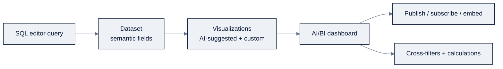

> **Part of AI Engineering Lab · Developed by Zorost Intelligence AI Lab · [zorost.com](https://zorost.com)**

# 04 · Databricks SQL (DBSQL)

> **Find the Signal. Act with Intelligence.** · Databricks Module · Week 21

Databricks SQL is the analytics surface of the lakehouse, a cloud data warehouse that
reads the *same* Delta tables Spark writes. This file teaches the editor, warehouses,
scripting, the AI/BI dashboard story (current vs. legacy), and the DBSQL-specific features
(materialized views, pipe syntax, `DEEP CLONE`, `ai_query`), all through ZoroLogistics
queries.

> **⚠️ Verify against live docs.** Dashboard product names and `ai_query` requirements
> change; re-check [Sources](#sources) and `docs.databricks.com/llms.txt`.

---

## 1. What DBSQL is

DBSQL is **ANSI SQL + Delta extensions** running on **SQL warehouses** (file 02). Its
surfaces:

| Surface | What it is |
|---|---|
| **SQL editor** | The query IDE (with **Genie Code** AI assistance) |
| **Queries** | Saved SQL with a credential mode, "Run as viewer" or "Run as owner" |
| **Query history** | Every query, backed by `system.query.history` |
| **Alerts** | Scheduled queries with conditions → email/Slack/webhooks (status `OK`/`TRIGGERED`/`ERROR`) |
| **AI/BI dashboards** | The current dashboard product (see §5) |

The headline benefit: **no data copy.** The `on_time_kpis` table a Spark pipeline wrote in
file 03 is the *same table* a DBSQL analyst queries, one governed copy, two access
patterns.

---

## 2. SQL warehouses (recap from file 02)

Queries run on a **SQL warehouse**. The one decision that matters here:

- **Serverless**: recommended default; ~2 to 6 s start; **Intelligent Workload Management**
  autoscales; no ops.
- **Pro**: compute in *your* VPC (when data residency/network rules require it).
- **Classic**: legacy; only for specific needs.

Attach a warehouse in the editor, then just write SQL. The rest of this file assumes you
have one running.

---

## 3. The SQL editor, queries, and alerts

**Editor basics:** multi-statement support, schema browser, autocomplete, and Genie Code
assistance. Save work as a **query**; a query can be **scheduled** (a cron + warehouse) and
turned into an **alert** by adding a condition:

```sql
-- Alert query: fire when any carrier's on-time rate drops below 90%
SELECT carrier_id, on_time_rate
FROM zrl_.gold.on_time_kpis
WHERE on_time_rate < 0.90;
```

Alerts push to email/Slack/webhooks when the condition trips, and their status is readable
in the UI or `system.query.history`.

> **Credential modes:** "Run as **owner**" runs with the owner's privileges (the query can
> touch anything the owner can); "Run as **viewer**" runs with the viewer's privileges
> (fails if the viewer lacks grants). Prefer *owner* for tightly-scoped reporting that
> viewers shouldn't need raw table access to.

**Query history** is every query you've run, backed by `system.query.history`, the
observability surface for "what's slow, what's expensive, what failed":

```sql
SELECT query_text, total_task_duration_ms, executed_at, user_name
FROM system.query.history
WHERE status = 'FAILED'
ORDER BY executed_at DESC
LIMIT 50;
```

Use it for slow-query triage and warehouse right-sizing, the same instinct as the FinOps
file 17, applied to SQL.

---

## 4. SQL scripting

Beyond single statements, DBSQL supports **procedural scripting**, variables, control
flow, and multi-step logic in one script:

```sql
DECLARE OR REPLACE min_on_time DEFAULT 0.90;
DECLARE rows_affected INT DEFAULT 0;

CREATE OR REPLACE TEMP VIEW flagged_carriers AS
SELECT DISTINCT carrier_id
FROM zrl_.gold.on_time_kpis
WHERE on_time_rate < min_on_time;

SELECT COUNT(*) INTO rows_affected FROM flagged_carriers;

IF rows_affected > 0 THEN
  SELECT 'FLAG' AS action, carrier_id FROM flagged_carriers;
ELSE
  SELECT 'OK' AS action;
END IF;
```

Useful patterns: `DECLARE`, `SET`, `IF/ELSE`, `CASE` in SQL expressions, temp views, and
`FOR` loops over result sets. Scripting is what turns a one-off query into a small,
testable data operation without leaving SQL.

---

## 5. AI/BI dashboards vs. legacy dashboards

**AI/BI dashboards** (formerly **Lakeview dashboards**) are the *current* dashboard
product: low-code, AI-assisted, with **datasets**, **cross-filtering**, **custom
calculations**, scheduling/subscriptions, embedding, and Git/source-control.

**Legacy "DBSQL dashboards" are archived**: you can no longer create them. Migrate via
**"Clone a legacy dashboard to an AI/BI dashboard."**

| | Legacy DBSQL dashboard | AI/BI dashboard (current) |
|---|---|---|
| Status | Archived | Current |
| Model | Single SQL + widgets | **Datasets** (semantic layer) + visuals |
| Cross-filtering | Limited | Native |
| AI assist | Minimal | AI-generated visualizations |
| Create new? | No | Yes |

**Workflow:** build a **dataset** (one or more SQL queries with a semantic schema), then
add visualizations and let AI suggest charts. Publish/subscribe and embed the result. File
`14-apps-dashboards.md` goes deeper; here the takeaway is *which product to use*.

### Building an AI/BI dashboard: the exact steps

Here's the end-to-end path for the ZoroLogistics **on-time dashboard** (you'll do a variant
in Try it):

1. **Write the dataset query** in the SQL editor, one clean `SELECT` that returns the rows
   you want to visualize:

   ```sql
   SELECT carrier_id, month, shipments, on_time_rate
   FROM zrl_.gold.on_time_kpis;
   ```

2. **Create a dashboard** (Dashboards → Create), then **Add a dataset** and point it at the
   saved query (or paste the SQL). The dataset's columns become the semantic fields.
3. **Let AI suggest visuals**: the dashboard's AI reads the dataset and proposes charts
   (a line for `on_time_rate` over `month`, a bar for `shipments` per carrier). Accept,
   tweak, or add your own.
4. **Add cross-filters**: a carrier filter on the top of the page filters every widget on
   the page at once.
5. **Add custom calculations**: e.g. a "YoY change" or a "target vs. actual" computed from
   dataset columns, without rewriting SQL.
6. **Publish**: then **schedule/subscribe** (email snapshots on a cadence) or **embed** the
   dashboard in another app.



**The one-line mental model:** dataset = the *semantic layer*; visualizations = *views over
it*; the dashboard = *a governed, shareable page* over both.

---

## 6. Key DBSQL features

### Materialized views

A **materialized view** is a persisted query result that stays "always correct" via
incremental refresh, great for gold-layer KPIs that many dashboards hit:

```sql
CREATE MATERIALIZED VIEW zrl_.gold.carrier_kpis AS
SELECT carrier_id,
       COUNT(*) AS shipments,
       AVG(CASE WHEN delivered_at <= promised_at THEN 1 ELSE 0 END) AS on_time_rate
FROM zrl_.silver.shipments
GROUP BY carrier_id;

REFRESH MATERIALIZED VIEW zrl_.gold.carrier_kpis;
```

Materialized views differ from plain tables in that Databricks keeps them in sync with
their base tables (incrementally where possible), so analysts query a fast, always-current
aggregate instead of re-aggregating raw rows every time.

**The materialized-view lifecycle**: the operations you'll actually run:

| Operation | SQL | When |
|---|---|---|
| Create | `CREATE MATERIALIZED VIEW … AS SELECT …` | First definition |
| Refresh | `REFRESH MATERIALIZED VIEW <mv>` | After base tables change (or scheduled) |
| Inspect | `DESCRIBE EXTENDED <mv>` | See base table + refresh state |
| Rebuild | `ALTER MATERIALIZED VIEW <mv> AS …` | Change the definition |
| Drop | `DROP MATERIALIZED VIEW <mv>` | Retire it |

**Refresh semantics: the fine print that matters:**

- **Incremental where possible:** if the base table is a Delta table with a detectable
  change (append/merge), the MV refreshes *incrementally*, cheap.
- **Full recompute otherwise:** certain transforms (or non-incremental sources) force a full
  recompute, still correct, just more DBU.
- **Scheduling:** wire `REFRESH MATERIALIZED VIEW` into a Lakeflow Job (file 06) so gold
  MVs stay fresh on a cadence, or let a *materialized view* inside a Lakeflow Pipeline
  refresh automatically.

**When to reach for an MV:** many dashboards re-aggregating the same silver table →
materialize it once and refresh incrementally. When *not* to: a one-off exploration query
(just run it) or a table that changes constantly and is always queried ad-hoc (the refresh
cost may exceed the savings).

### Pipe syntax (mention)

DBSQL supports **pipe syntax** (`|>`) as a more linear way to write transformations, read
it left-to-right instead of inside-out:

```sql
FROM zrl_.silver.shipments
|> WHERE status = 'DELIVERED'
|> AGGREGATE COUNT(*) AS delivered_count;
```

Pipe syntax is SQL-sugar: it compiles to the same plan as nested/`WITH` queries. It's a
style choice, useful for long transformation chains and increasingly common in
modern-DBMS SQL. (Full reference is beyond this file; the point is recognizing it.)

**A fuller pipe-syntax example**: the same on-time analysis, written linear:

```sql
FROM zrl_.silver.shipments
|> WHERE status = 'DELIVERED'
|> EXTEND on_time AS delivered_at <= promised_at
|> AGGREGATE COUNT(*) AS shipments,
           AVG(CASE WHEN on_time THEN 1 ELSE 0 END) AS on_time_rate
   GROUP BY carrier_id
|> ORDER BY on_time_rate DESC
|> LIMIT 5;
```

Read it left-to-right: start from `shipments`, keep delivered rows, add an `on_time` flag,
aggregate per carrier, sort, keep five. The nested equivalent:

```sql
SELECT carrier_id, on_time_rate FROM (
  SELECT carrier_id, AVG(CASE WHEN delivered_at <= promised_at THEN 1 ELSE 0 END) AS on_time_rate
  FROM zrl_.silver.shipments WHERE status = 'DELIVERED'
  GROUP BY carrier_id
) ORDER BY on_time_rate DESC LIMIT 5;
```

Same plan, two shapes. Pipe syntax wins when the chain is long; standard `WITH`/subquery is
fine when it's short. Both are valid DBSQL, pick one and be consistent per file.

### DEEP CLONE

`DEEP CLONE` copies a table's data *and* metadata for isolation or experimentation (a
**shallow** clone copies only metadata):

```sql
CREATE OR REPLACE TABLE zrl_.silver.shipments_stage
  DEEP CLONE zrl_.silver.shipments;
```

Use it to snapshot a table for a risky migration or a reproducible experiment without
touching the source.

### ai_query (hook for later)

`ai_query` is a built-in SQL function that runs a prompt against a Foundation Model
endpoint, LLM calls *inside* SQL:

```sql
SELECT ai_query('databricks-meta-llama-3-1-70b-instruct',
                'Summarize this shipment note: ' || note) AS summary
FROM zrl_.silver.shipments;
```

It requires serverless compute and DBR 18.2+. This file only *hooks* it, file
`12-ai-functions-genie.md` covers the full AI-function family.

### DBSQL cheat sheet: the Delta/SQL features to know by name

| Feature | Syntax | Use |
|---|---|---|
| Materialized view | `CREATE MATERIALIZED VIEW … AS` | Fast, always-current aggregates |
| `DEEP CLONE` | `CREATE TABLE … DEEP CLONE <t>` | Full copy (data + metadata) for experiments |
| Shallow clone | `CREATE TABLE … SHALLOW CLONE <t>` | Metadata-only copy (cheap) |
| Pipe syntax | `FROM … \|> …` | Linear, left-to-right transforms |
| `QUALIFY` | `… QUALIFY rn <= 3` | Filter on window results |
| Time travel | `… VERSION AS OF n` / `TIMESTAMP AS OF` | Read a prior table state |
| `table_changes()` | `SELECT * FROM table_changes('t', a, b)` | Row-level change feed |
| `read_files` | `SELECT * FROM read_files('/path', …)` | Read files into SQL |
| `ai_query` | `SELECT ai_query(endpoint, prompt)` | LLM call inside SQL |
| `PIVOT` | `… PIVOT (agg FOR col IN (…))` | Rows → columns |

Memorize these ten names and you can read most production DBSQL you'll encounter; the deep
dives live in their own files (03 for Delta, 06 for pipelines, 12 for AI functions).

---

## 7. Worked ZoroLogistics queries

### 7.1 On-time rate by carrier

The foundational KPI: what fraction of shipments delivered on or before the promise?

```sql
SELECT carrier_id,
       COUNT(*) AS shipments,
       SUM(CASE WHEN delivered_at <= promised_at THEN 1 ELSE 0 END) AS on_time,
       ROUND(SUM(CASE WHEN delivered_at <= promised_at THEN 1 ELSE 0 END) / COUNT(*), 4)
         AS on_time_rate
FROM zrl_.silver.shipments
GROUP BY carrier_id
ORDER BY on_time_rate DESC;
```

### 7.2 Window functions: rank carriers per lane

Window functions compute across related rows *without collapsing* the result. Here, rank
each carrier within a lane by on-time rate:

```sql
SELECT lane_id, carrier_id, on_time_rate,
       RANK() OVER (PARTITION BY lane_id ORDER BY on_time_rate DESC) AS lane_rank
FROM zrl_.gold.carrier_lane_kpis
QUALIFY lane_rank <= 3;
```

`QUALIFY` filters on window results in one pass, DBSQL's tidy alternative to a wrapping
subquery. (A `ROW_NUMBER()` version gives one row per lane; `RANK()` ties.)

### 7.3 PIVOT: on-time rate matrix

`PIVOT` turns rows into columns, here a carrier × month on-time matrix:

```sql
SELECT *
FROM (
  SELECT carrier_id,
         DATE_TRUNC('MONTH', delivered_at) AS month,
         CASE WHEN delivered_at <= promised_at THEN 1 ELSE 0 END AS on_time
  FROM zrl_.silver.shipments
)
PIVOT (
  AVG(on_time) FOR month IN (
    '2026-01-01' AS jan, '2026-02-01' AS feb, '2026-03-01' AS mar
  )
);
```

### 7.4 Top lanes by volume with a moving average

Combine an aggregation with a window over time:

```sql
WITH daily AS (
  SELECT lane_id, DATE(delivered_at) AS d, COUNT(*) AS n
  FROM zrl_.silver.shipments
  GROUP BY lane_id, DATE(delivered_at)
)
SELECT lane_id, d, n,
       AVG(n) OVER (PARTITION BY lane_id ORDER BY d ROWS BETWEEN 6 PRECEDING AND CURRENT ROW)
         AS seven_day_avg
FROM daily
ORDER BY lane_id, d;
```

### 7.5 LAG/LEAD: month-over-month change

`LAG`/`LEAD` reach into a *previous/next* row in a window, the "how did we change?" query:

```sql
WITH monthly AS (
  SELECT carrier_id,
         DATE_TRUNC('MONTH', delivered_at) AS month,
         AVG(CASE WHEN delivered_at <= promised_at THEN 1 ELSE 0 END) AS on_time_rate
  FROM zrl_.silver.shipments
  GROUP BY carrier_id, DATE_TRUNC('MONTH', delivered_at)
)
SELECT carrier_id, month, on_time_rate,
       LAG(on_time_rate) OVER (PARTITION BY carrier_id ORDER BY month) AS prev_month_rate,
       ROUND(on_time_rate - LAG(on_time_rate) OVER (PARTITION BY carrier_id ORDER BY month), 4)
         AS mom_change
FROM monthly
ORDER BY carrier_id, month;
```

`mom_change > 0` = improving; `< 0` = slipping. This is the query behind a "carriers trending
down" alert.

### 7.6 Cumulative running total

A **running total** = `SUM(...) OVER (ORDER BY … ROWS UNBOUNDED PRECEDING)`:

```sql
SELECT DATE(delivered_at) AS d,
       COUNT(*) AS daily_shipments,
       SUM(COUNT(*)) OVER (ORDER BY DATE(delivered_at)
                           ROWS BETWEEN UNBOUNDED PRECEDING AND CURRENT ROW) AS cumulative
FROM zrl_.silver.shipments
GROUP BY DATE(delivered_at)
ORDER BY d;
```

The `cumulative` column is "shipments so far this period", the classic year-to-date shape.

### 7.7 Percentiles & spread

`PERCENTILE_CONT`/`PERCENTILE_DISC` give the distribution of a metric, not just its average:

```sql
SELECT carrier_id,
       PERCENTILE_CONT(0.50) WITHIN GROUP (ORDER BY delay_hours) AS median_delay,
       PERCENTILE_CONT(0.90) WITHIN GROUP (ORDER BY delay_hours) AS p90_delay,
       MAX(delay_hours) AS worst_delay
FROM zrl_.silver.shipments
WHERE status = 'DELIVERED'
GROUP BY carrier_id;
```

A carrier with a low *average* but a high **p90** has a long tail of bad deliveries, the
average hides it, the percentile exposes it.

### 7.8 Top-N per group with QUALIFY

"Top 3 carriers per lane by on-time rate" is a window + `QUALIFY` one-liner (extending 7.2):

```sql
SELECT lane_id, carrier_id,
       AVG(CASE WHEN delivered_at <= promised_at THEN 1 ELSE 0 END) AS on_time_rate,
       ROW_NUMBER() OVER (PARTITION BY lane_id ORDER BY
           AVG(CASE WHEN delivered_at <= promised_at THEN 1 ELSE 0 END) DESC) AS rn
FROM zrl_.silver.shipments
GROUP BY lane_id, carrier_id
QUALIFY rn <= 3;
```

`QUALIFY` filters on the window result without a wrapping subquery, the DBSQL idiom you'll
use constantly once you've seen it once.

---

## 8. Checklist

- [ ] Ran a query on a **serverless** SQL warehouse and explained Pro/Classic vs. it.
- [ ] Saved a query with "Run as owner" and explained the credential-mode tradeoff.
- [ ] Scheduled a query and added an **alert** condition.
- [ ] Wrote a multi-step SQL **script** (`DECLARE`, temp view, `IF/ELSE`).
- [ ] Stated why **AI/BI dashboards** (current) replaced legacy DBSQL dashboards and how to migrate.
- [ ] Created a **materialized view** and refreshed it.
- [ ] Recognized **pipe syntax** and used **`DEEP CLONE`**.
- [ ] Wrote the on-time-rate, window-function (`QUALIFY`), and `PIVOT` queries above.

**Definition of done:** you can hand an analyst the three worked queries, a materialized
view, and one AI/BI dashboard, and explain which of them answers "how are our carriers
doing?"

---

## Try it

Three hands-on tasks. Do them in order; each has a check you can run.

### Task 1: The full on-time query set

Write and run all four foundational queries against silver: on-time by carrier (7.1),
month-over-month change (7.5), p90 delay (7.7), and top-3 per lane (7.8).

**Acceptance check:** each returns rows with the expected shape, `on_time_rate` between 0
and 1, `p90_delay ≥ median_delay`, and `rn ≤ 3` in the top-N result. No query errors, and
you can say *which* of the four you'd put on a dashboard vs. an alert.

### Task 2: Materialized view lifecycle

```sql
CREATE MATERIALIZED VIEW zrl_.gold.carrier_kpis AS
SELECT carrier_id, COUNT(*) AS shipments,
       AVG(CASE WHEN delivered_at <= promised_at THEN 1 ELSE 0 END) AS on_time_rate
FROM zrl_.silver.shipments GROUP BY carrier_id;

REFRESH MATERIALIZED VIEW zrl_.gold.carrier_kpis;
DESCRIBE EXTENDED zrl_.gold.carrier_kpis;
```

**Acceptance check:** `DESCRIBE EXTENDED` shows the base table and refresh state, and a
second `REFRESH` after a new insert reflects the updated counts, the MV stays "always
correct."

### Task 3: Rewrite one query in pipe syntax

Take the on-time-by-carrier query (7.1) and rewrite it with `|>` pipe operators.

**Acceptance check:** your pipe-syntax version returns the *same rows* as the standard SQL,
proving it's sugar over the same plan, not a different engine.

---

## Common mistakes

1. **Using legacy DBSQL dashboards for new work.** They're archived; you can't create them.
   *Fix:* build new dashboards as **AI/BI dashboards**; migrate old ones via "Clone a legacy
   dashboard."
2. **Materializing views nobody re-queries.** An MV only pays off when many queries hit the
   same aggregate. *Fix:* materialize for shared, hot aggregates; run ad-hoc queries as-is.
3. **Forgetting the "Run as owner vs. viewer" distinction.** A "Run as viewer" query fails
   for viewers without table grants. *Fix:* use "Run as owner" for tightly-scoped reporting
   where viewers shouldn't need raw table access.
4. **Using `RANK()` when you need one row per group.** `RANK()` ties; `ROW_NUMBER()` doesn't.
   *Fix:* pick the function that matches the semantics (ties allowed vs. exactly N rows).
5. **Overusing `DEEP CLONE` for every experiment.** A deep clone copies *data*, expensive on
   big tables. *Fix:* use **shallow** clone (metadata-only) when you don't need an isolated
   copy of the data.
6. **Skipping `QUALIFY` and nesting subqueries.** Readable but verbose and error-prone.
   *Fix:* use `QUALIFY` to filter on window results in one pass.

---

## Sources

- https://docs.databricks.com/sql/
- https://docs.databricks.com/sql/user/sql-editor/
- https://docs.databricks.com/sql/user/queries/query-history
- https://docs.databricks.com/sql/user/alerts/
- https://docs.databricks.com/compute/sql-warehouse/
- https://docs.databricks.com/ai-bi/
- https://docs.databricks.com/dashboards/
- https://docs.databricks.com/sql/user/dashboards/
- https://docs.databricks.com/large-language-models/ai-functions
- https://docs.databricks.com/genie/
- https://docs.databricks.com/sql/language-manual/
- https://docs.databricks.com/llms.txt

> *This is original curriculum written in AI Engineering Lab's own words; no third-party
> course material was copied. Dashboard and AI-function names change; verify against the
> live links above.*

---

© 2026 Zorost Intelligence LLC · [zorost.com](https://zorost.com)
