> **Part of AI Engineering Lab · Developed by Zorost Intelligence AI Lab · [zorost.com](https://zorost.com)**

# 05 · PySpark: DataFrame Data Engineering

> **Find the Signal. Act with Intelligence.** · Databricks Module · Week 22

PySpark is the programmatic engine for data engineering at scale. This file teaches the
DataFrame API, schema management, partitioning, caching, and performance (Photon, shuffle,
broadcast joins), then the "PySpark vs. SQL vs. pandas" decision, and how to test PySpark
locally. The running example: read a ZoroLogistics CSV from a volume, transform it, write a
Delta table.

By the end of this file you will be able to:

- Read a CSV with an explicit schema and write a governed Delta table.
- Express any medallion transform with six verbs (filter → enrich → aggregate → window →
  join → write).
- Tune a shuffle and a broadcast join with real numbers, not vibes.
- Know when a UDF is worth it, and when it's a performance bug.
- Unit-test a transform locally before paying for cluster time.

> **⚠️ Verify against live docs.** API signatures and config defaults evolve; re-check
> [Sources](#sources) and `docs.databricks.com/llms.txt`.

---

## 1. The DataFrame mental model

PySpark's primary abstraction is the **DataFrame**: named columns, immutable, lazily
evaluated. The single most important concept is **lazy evaluation**:

- **Transformations** (`select`, `filter`, `join`, `groupBy`/`agg`, `withColumn`,
  `orderBy`, `union`) build a *logical plan*, they run nothing yet.
- **Actions** (`show`/`display`, `count`, `take`, `collect`, `saveAsTable`) trigger
  execution.
- **In production, the write is usually the only action**: extra actions (a stray
  `count()` for logging) interrupt the optimizer.

```python
from pyspark.sql import functions as F

df = (spark.read.table("zrl_.silver.shipments")
      .filter(F.col("weight_kg") > 0)          # lazy
      .withColumn("on_time", F.col("delivered_at") <= F.col("promised_at")))  # lazy

df.count() # ACTION, now Spark actually runs
```

---

## 2. Reading & writing (ZoroLogistics end-to-end)

**Read a CSV from a volume → transform → write Delta**: the bread-and-butter pipeline:

```python
from pyspark.sql import functions as F
from pyspark.sql.types import StructType, StructField, StringType, DoubleType, TimestampType

# 1. Explicit schema (always prefer this over inference for production)
schema = StructType([
    StructField("shipment_id", StringType(), True),
    StructField("carrier_id",  StringType(), True),
    StructField("lane_id",     StringType(), True),
    StructField("shipped_at",  TimestampType(), True),
    StructField("delivered_at",TimestampType(), True),
    StructField("promised_at", TimestampType(), True),
    StructField("weight_kg",   DoubleType(), True),
    StructField("status",      StringType(), True),
])

# 2. Read from a UC volume path
raw = (spark.read
       .format("csv")
       .option("header", "true")
       .schema(schema)
       .load("/Volumes/zrl_/bronze/landing/shipments.csv"))

# 3. Transform: drop bad weights, compute on-time flag
silver = (raw
          .filter(F.col("weight_kg") > 0)
          .dropDuplicates(["shipment_id"])
          .withColumn("on_time", F.col("delivered_at") <= F.col("promised_at")))

# 4. Write to a governed Delta table
(silver.write
       .mode("overwrite")
       .saveAsTable("zrl_.silver.shipments"))
```

**Reading:** `spark.read.format(...).option(...).schema(...).load(path)` or
`.table("catalog.schema.table")`. **Writing:** `.mode("append"|"overwrite"|"error"|
"ignore")` then `.saveAsTable()` / `.save()`. Formats: Delta, Parquet, CSV, JSON, Avro,
ORC, XML, text, Excel, and streaming connectors.

---

## 3. Common transformations (cheat sheet)

| Op | Example |
|---|---|
| select / filter | `df.select("id").filter(F.col("amount") > 0)` |
| withColumn | `df.withColumn("total", F.col("qty") * F.col("price"))` |
| join | `df.join(dim, "id", "inner")` (inner/left/right/full/semi/anti) |
| groupBy / agg | `df.groupBy("state").agg(F.sum("amount").alias("sales"))` |
| distinct | `df.dropDuplicates(["id"])` |
| orderBy | `df.orderBy(F.col("amount").desc())` |

**Window functions** compute across related rows without collapsing them:

```python
from pyspark.sql.window import Window

win = Window.partitionBy("carrier_id").orderBy(F.col("delivered_at").desc())
df.withColumn("rn", F.row_number().over(win)).filter("rn = 1")  # latest per carrier
```

**Spark SQL from a DataFrame:** register a temp view, then query with SQL:

```python
silver.createOrReplaceTempView("shipments")
spark.sql("SELECT carrier_id, COUNT(*) n FROM shipments GROUP BY carrier_id").show()
```

### The transformation cookbook (shipment data, complete)

The cheat sheet above is the *verbs*; this is the *recipes* you'll actually write for
ZoroLogistics. Each is a self-contained idiom:

```python
from pyspark.sql import functions as F
from pyspark.sql.window import Window

s = spark.table("zrl_.silver.shipments")

# Clean: drop null weights and impossible values
s_clean = (s.filter(F.col("weight_kg").isNotNull() & (F.col("weight_kg") > 0))
            .filter(F.col("status").isin("Delivered", "In Transit", "Booked")))

# Enrich: compute on-time and a late flag in one pass
s_enriched = s_clean.withColumn(
    "on_time", F.col("delivered_at") <= F.col("promised_at")
).withColumn(
    "latency_bucket",
    F.when(F.col("delay_hours") <= 0, "early")
     .when(F.col("delay_hours") <= 2, "on_time")
     .when(F.col("delay_hours") <= 24, "late")
     .otherwise("very_late"))

# Aggregate: carrier x month on-time rate
kpis = (s_enriched
        .withColumn("month", F.date_trunc("month", "delivered_at"))
        .groupBy("carrier_id", "month")
        .agg(F.count("*").alias("shipments"),
             F.avg(F.when(F.col("on_time"), 1).otherwise(0)).alias("on_time_rate")))

# Window: rank carriers within each lane by on-time
lane_win = Window.partitionBy("lane_id").orderBy(F.desc("on_time_rate"))
ranked = kpis.withColumn("lane_rank", F.rank().over(lane_win))

# Dedupe: keep the latest row per shipment_id
latest = (s.withColumn("rn", F.row_number().over(
              Window.partitionBy("shipment_id").orderBy(F.desc("ingested_at"))))
            .filter("rn = 1").drop("rn"))

# Pivot: carrier x month matrix of on-time rates
pivoted = (kpis.groupBy("carrier_id")
           .pivot("month")
           .agg(F.first("on_time_rate")))

# Join: bring carrier region in from the dimension
carriers = spark.table("zrl_.silver.carriers")
joined = s_enriched.join(carriers, "carrier_id", "left")

# Union: stack two partitions of the same shape
combined = s_enriched.unionByName(s_clean.select(*s_enriched.columns))
```

**Read the shape, not the code:** nearly every pipeline is *filter → enrich → aggregate →
window/rank → join → write*. Master those six verbs and you can express any medallion
transform in PySpark.

### A tiny transform pipeline (the whole loop in one view)

```mermaid
%%{init:{"theme":"base","fontFamily":"Helvetica Neue,Helvetica,Arial,sans-serif","flowchart":{"curve":"basis","padding":14,"nodeSpacing":45,"rankSpacing":55},"themeVariables":{"fontSize":"15px","background":"#FFFFFF","primaryColor":"#EEF2F7","primaryTextColor":"#14213D","primaryBorderColor":"#14213D","secondaryColor":"#FFF1E3","secondaryTextColor":"#14213D","tertiaryColor":"#E7F4F1","tertiaryTextColor":"#14213D","lineColor":"#64748B","textColor":"#14213D","edgeLabelBackground":"#FFFFFF","clusterBkg":"#F5F8FC","clusterBorder":"#94A3B8","nodeBorder":"#14213D","mainBkg":"#EEF2F7","titleColor":"#14213D"}}}%%
flowchart LR
    A[read CSV<br>volume] --> B[filter<br>nulls + bad weights]
    B --> C[enrich<br>on_time + latency_bucket]
    C --> D[aggregate<br>carrier x month]
    D --> E[window<br>rank per lane]
    E --> F[write Delta<br>zrl_.gold.on_time_kpis]
```



---

## 4. Schema management

- **Explicit schema wins** over `inferSchema=True`: inference reads data twice, guesses
  wrong on edge cases, and is non-deterministic. Declare `StructType` (or use Delta's
  `schema` enforcement + `mergeSchema`).
- **Evolve schemas** on Delta with `ALTER TABLE` or `mergeSchema`/`spark.databricks.delta
  .schema.autoMerge.enabled` (file 03).
- **Casting & nulls:** use `F.col("x").cast("int")`, `F.coalesce`, `F.when(...).otherwise(...)`
  to make types explicit rather than relying on inference.

---

## 5. Partitioning

- **`spark.sql.shuffle.partitions`** sets the number of partitions after a shuffle (joins,
  aggregations). Tune to **1 to 2× your total executor cores**, the default (often 200) is
  too high for small clusters and causes many tiny tasks.
- **`repartition(n)`** reshuffles to exactly n partitions (full shuffle).
- **`coalesce(n)`** reduces partitions *without* a full shuffle (faster, but can skew).
- **AQE (Adaptive Query Execution)** coalesces/rebalances automatically at runtime, so you
  often don't hand-tune.

```python
spark.conf.set("spark.sql.shuffle.partitions", "16")
df = df.repartition(8, "carrier_id")   # co-locate by carrier before a join
```

---

## 6. Caching

Two distinct mechanisms, don't confuse them:

| Mechanism | What it is | You control it? |
|---|---|---|
| **Disk cache** | Databricks-managed Parquet cache on local NVMe; automatic, speeds re-reads | No (automatic) |
| **`cache()` / `persist()`** | Manual Spark caching of a DataFrame (memory/disk) | Yes |

Manual caching helps when you re-use an intermediate DataFrame many times (e.g., a small
dimension table joined repeatedly). It *costs* memory and adds staleness risk, cache
deliberately, and `unpersist()` when done.

---

## 7. Performance

### Photon

**Photon** is Databricks' native C++ vectorized engine, default on SQL warehouses and
serverless. It accelerates SQL/DataFrame/ETL and *stateless* streaming. It does **not**
help: **UDFs, RDD/Dataset code, or stateful streaming.** Implication: prefer built-in
functions over Python UDFs to stay Photon-eligible.

### Shuffle & broadcast joins

- **Shuffle** = redistributing rows across executors; the most expensive operation. Reduce
  it via partitioning, filtering *before* joining, and choosing join order.
- **Broadcast joins** copy the *small* side to every executor, avoiding a shuffle. AQE
  auto-converts joins to broadcast when one side is small; you can hint:

```python
from pyspark.sql import functions as F
result = big_df.join(F.broadcast(small_df), "carrier_id", "left")
```

**Broadcast vs. shuffle: the numbers that decide it:**

| Join shape | What happens | Cost | The rule |
|---|---|---|---|
| Small side < ~10 MB (auto threshold) | AQE broadcasts it automatically | Cheap, no shuffle | Let AQE do it |
| Small side up to ~10s of MB (dim table) | `F.broadcast()` forces it | Cheap, copy to each executor | Broadcast dimensions (`carriers`, `lanes`) |
| Both sides large (fact × fact) | Shuffle join | Expensive, redistributes both sides | Accept the shuffle; tune partitions |

**Shuffle tuning with numbers:**

```python
spark.conf.set("spark.sql.shuffle.partitions", "16") # 1 to 2× executor cores
spark.conf.set("spark.sql.adaptive.enabled", "true")          # AQE on
spark.conf.set("spark.sql.adaptive.coalescePartitions.enabled", "true")
spark.conf.set("spark.databricks.optimizer.dynamicFilePruning.enabled", "true")
```

- **`shuffle.partitions = 1 to 2 × total executor cores`.** 8 workers × 4 cores = 32 cores →
  32 to 64 partitions, *not* the default 200. Too many = tiny tasks + scheduler overhead; too
  few = skew + memory pressure.
- **Broadcast threshold** (`spark.sql.autoBroadcastJoinThreshold`, default ~10 MB) decides
  when AQE auto-broadcasts. Raise it cautiously for a known-small dimension; don't blanket
  raise it or you'll OOM executors on a "small" table that isn't.
- **Skew:** if one `carrier_id` dominates (say 40% of rows), a shuffle join sends all of it
  to one task. Fix with AQE skew join (`spark.sql.adaptive.skewJoin.enabled`) or salting,
  the advanced move file 06's pipeline tuning returns to.

### Config & habits

```python
spark.conf.set("spark.sql.shuffle.partitions", "16")   # right-size shuffles
spark.conf.set("spark.sql.adaptive.enabled", "true")   # AQE (usually already on)
spark.conf.set("spark.databricks.optimizer.dynamicFilePruning.enabled", "true")
```

- **Dynamic file pruning** skips unneeded files in a join when one side is filtered.
- **Prefer built-ins over UDFs** (Photon + optimizer friendly).
- **Filter early, project narrow**: drop unused columns and rows as soon as possible.

### UDFs: built-ins first, then pandas UDFs, Python UDF last

Custom row logic falls on a spectrum of performance:

| Kind | Syntax | Notes |
|---|---|---|
| **Built-in functions** | `F.col("a") + F.col("b")` | Fastest; Photon-eligible; always prefer |
| **Pandas UDF (vectorized)** | `@pandas_udf("double")` | Batches rows through pandas; much faster than Python UDF |
| **Python UDF** | `@udf("double")` | Row-at-a-time; serializes per row; slow; breaks Photon |

```python
from pyspark.sql.functions import pandas_udf, udf
import pandas as pd

# Vectorized: applies to a whole batch at once
@pandas_udf("double")
def kg_to_lbs(s: pd.Series) -> pd.Series:
    return s * 2.20462

# Row-at-a-time: avoid unless you have no choice
@udf("double")
def kg_to_lbs_slow(x):
    return x * 2.20462

df.withColumn("weight_lbs", kg_to_lbs(F.col("weight_kg")))
```

**Rule:** if it can be written with built-ins, write it with built-ins; if it's genuinely
custom, use a **pandas UDF**; reserve plain Python UDFs for tiny/simple cases.

**UDF pitfalls: the four that bite:**

1. **Row-at-a-time Python UDFs serialize per row** across the JVM↔Python boundary. A million
   rows = a million round-trips. *Fix:* use a **pandas UDF** (batched) or, better, built-ins.
2. **UDFs silently disable Photon.** Photon can't vectorize Python UDFs, so a hot path that
   *could* be 3× faster falls back to the interpreter. *Fix:* keep UDFs off the Photon path.
3. **A UDF that closes over non-serializable state** (a DB connection, a model object not
   broadcast) fails at executor time, not driver time. *Fix:* pass state as arguments or
   broadcast it; keep UDFs pure.
4. **Nondeterministic UDFs** (e.g., `random()` inside the body) break exactly-once replay and
   test assertions. *Fix:* seed randomness explicitly and keep UDFs pure functions of their
   inputs.

### The performance checklist (run it before "it's slow" becomes a support ticket)

| # | Check | Why | Quick fix |
|---|---|---|---|
| 1 | Is `shuffle.partitions` ≈ 1 to 2× cores? | Default 200 → tiny tasks | Set it per cluster size |
| 2 | Are you filtering *before* the join? | Less data across the shuffle | Move `.filter()` earlier |
| 3 | Is the small join side broadcast? | Avoids a full shuffle | `F.broadcast()` the dimension |
| 4 | Any Python UDF on the hot path? | Kills Photon + serializes per row | Built-ins or pandas UDF |
| 5 | `collect()`/`toPandas()` on a big frame? | OOMs the driver | Aggregate/limit first |
| 6 | Are you caching a reused frame? | Recompute on every action | `persist()` once, `unpersist()` after |
| 7 | Is AQE on? | Auto coalesce + skew + broadcast | `spark.sql.adaptive.enabled=true` |

Work the list top-down; the first three fix the majority of "slow PySpark" reports.

### Delta operations from PySpark

The Delta maintenance you learned in file 03 is scriptable too:

```python
from delta.tables import DeltaTable

dt = DeltaTable.forName(spark, "zrl_.silver.shipments")
dt.vacuum(retentionHours=168)          # VACUUM with retention
dt.optimize().executeCompaction()      # OPTIMIZE (bin-packing)
dt.optimize().executeZOrderBy("carrier_id", "lane_id")

# Time travel from PySpark
old = spark.read.option("versionAsOf", 12).table("zrl_.silver.shipments")
old2 = spark.read.option("timestampAsOf", "2026-08-01").table("zrl_.silver.shipments")

# Change data feed
changes = (spark.read.format("delta")
           .option("readChangeFeed", "true")
           .option("startingVersion", 5)
           .option("endingVersion", 8)
           .table("zrl_.silver.shipments"))
```

`delta.tables.DeltaTable` is the Python mirror of the SQL maintenance statements, handy
when maintenance belongs inside a scheduled notebook rather than a hand-run SQL cell.

---

## 8. PySpark vs. SQL vs. pandas(-on-Spark)

| Tool | Best for | Limits |
|---|---|---|
| **SQL (DBSQL)** | Declarative set/aggregate logic, BI, rapid prototyping | Awkward for imperative, multi-step, dynamic logic |
| **PySpark DataFrame** | Programmatic ETL, tests, dynamic column logic, ML features at scale | More verbose than SQL for pure aggregations |
| **pandas-on-Spark** (formerly Koalas) | Familiar pandas syntax on Spark for *moderate* data | Pandas semantics don't always scale; API coverage gaps |
| **plain pandas** | Small data (< a few GB) on the driver | Single-node memory bound, don't `collect()` a big DataFrame |

**Decision guidance for ZoroLogistics:**

1. **Medallion transformations** → PySpark DataFrames (testable, versionable, reusable in
   pipelines, file 06).
2. **Gold-layer KPIs & BI** → SQL (materialized views, dashboards, file 04).
3. **Small exploration on the driver** → pandas on a *filtered* `toPandas()` result, never
   the whole table.
4. **Scikit-learn-style preprocessing** → pandas-on-Spark or a Spark ML pipeline (file 09).

> **The golden rule:** `collect()` / `toPandas()` pulls data to the driver, use it only on
> *small, filtered* results. Pulling a billion rows to the driver is how you OOM a cluster.

---

## 9. Testing PySpark locally

You don't need a cluster to develop or test PySpark, run it locally with `pyspark`:

```bash
pip install pyspark
```

```python
# local_pyspark_test.py
from pyspark.sql import SparkSession
from pyspark.sql import functions as F

spark = (SparkSession.builder
         .master("local[*]")
         .appName("zrl_local_test")
         .getOrCreate())

df = spark.createDataFrame(
    [("S1", "C1", 100.0), ("S2", "C1", None)],
    ["shipment_id", "carrier_id", "weight_kg"])

clean = df.filter(F.col("weight_kg").isNotNull())
assert clean.count() == 1
print("local PySpark test passed")
```

- **`master("local[*]")`** runs Spark in-process on all cores, no cluster.
- Write tests with plain `assert` or `pytest`; keep DataFrames tiny and assertions on
  `count()`/schema/aggregates.
- For *pure SQL* logic (joins, windows, aggregations) that doesn't need Spark's
  distributed machinery, **DuckDB** is a faster local loop: write the same SQL against a
  DuckDB connection, iterate, then port to Databricks. DuckDB isn't a Spark substitute,
  it's a fast *SQL* sandbox for logic that will end up in DBSQL or Spark SQL.

```bash
pip install duckdb
```

```python
import duckdb
con = duckdb.connect()
con.execute("CREATE TABLE shipments AS SELECT * FROM read_csv_auto('zoro/shipments.csv')")
print(con.execute("SELECT carrier_id, AVG(weight_kg) FROM shipments GROUP BY 1").fetchall())
```

**Local → Databricks loop:** prototype the *logic* locally (DuckDB for SQL, `pyspark`
`local[*]` for DataFrame code), then run the identical code in a notebook/cluster. This
keeps the fast iteration local and the scale on Databricks.

### A real pytest around the transform

Extract the transform into a pure function, then test *it* (not the Spark plumbing):

```python
# transform.py
from pyspark.sql import functions as F

def clean_shipments(df):
    return (df.filter(F.col("weight_kg").isNotNull() & (F.col("weight_kg") > 0))
              .withColumn("on_time", F.col("delivered_at") <= F.col("promised_at")))
```

```python
# test_transform.py
import pytest
from pyspark.sql import SparkSession
from transform import clean_shipments

@pytest.fixture(scope="module")
def spark():
    return (SparkSession.builder.master("local[2]")
            .appName("zrl_tests").getOrCreate())

def test_drops_bad_weights(spark):
    df = spark.createDataFrame(
        [("S1", 100.0), ("S2", None), ("S3", -5.0)],
        ["shipment_id", "weight_kg"])
    out = clean_shipments(df)
    assert out.count() == 1                    # only S1 survives

def test_on_time_flag(spark):
    from pyspark.sql import functions as F
    df = spark.createDataFrame(
        [("S1", "2026-01-01 10:00", "2026-01-01 12:00")],
        ["shipment_id", "delivered_at", "promised_at"])
    out = clean_shipments(df).select("on_time").collect()
    assert out[0]["on_time"] is True           # delivered <= promised
```

Run with `pytest -q`. The habit: **write the transform as a function, assert on small
DataFrames, then run the same function on the cluster.** That's the test pyramid for data
engineering, cheap local tests, one integration run.

> **Databricks Connect (optional bridge):** if you want local IDE + remote execution, the
> Python SDK's Databricks Connect runs your local code against a real cluster. It's heavier
> to set up than `local[*]`; reach for it when you need *real* data or cluster behavior
> during development (file 15 touches the SDK again).

---

## 10. Checklist

- [ ] Explained lazy evaluation and named the one "action" that usually runs a production pipeline.
- [ ] Wrote the read-CSV-from-volume → transform → write-Delta example with an explicit schema.
- [ ] Used a window function (`row_number`) to dedupe "latest per carrier."
- [ ] Tuned `spark.sql.shuffle.partitions` and explained `repartition` vs. `coalesce`.
- [ ] Distinguished the automatic disk cache from manual `cache()`/`persist()`.
- [ ] Stated what Photon does *not* accelerate (UDFs/RDD/stateful streaming).
- [ ] Used `F.broadcast()` and explained why it beats a shuffle.
- [ ] Chose PySpark vs. SQL vs. pandas for three ZoroLogistics tasks.
- [ ] Ran a local `pyspark` test and a DuckDB SQL check.

**Definition of done:** you can write the ZoroLogistics medallion transform in PySpark with
an explicit schema, a window dedupe, and a broadcast join, and unit-test the logic locally.

---

## Try it

Three hands-on tasks. Do them in order; each has a check you can run.

### Task 1: The medallion transform, end to end

Write `bronze → silver` in PySpark: read the CSV from the volume with an explicit schema,
dedupe on `shipment_id`, drop bad weights, add `on_time`, write to `zrl_.silver.shipments`.

**Acceptance check:** `spark.table("zrl_.silver.shipments").count()` matches your dedupe
expectation (no duplicate `shipment_id`s), and every row has a non-null `weight_kg > 0` and
a computed `on_time` boolean.

### Task 2: Broadcast vs. shuffle, measured

Join `shipments` (large) to `carriers` (small) twice, once with `F.broadcast()` and once
without, and compare the plans:

```python
from pyspark.sql import functions as F
s = spark.table("zrl_.silver.shipments")
c = spark.table("zrl_.silver.carriers")
s.join(F.broadcast(c), "carrier_id").explain("formatted")   # look for BroadcastHashJoin
s.join(c, "carrier_id").explain("formatted")                # look for SortMergeJoin / shuffle
```

**Acceptance check:** `explain("formatted")` shows `BroadcastHashJoin` in the broadcast case
and a shuffle-based join otherwise, you can *see* the difference, not just believe it.

### Task 3: Local pytest on the transform

Extract your bronze→silver logic into a `clean_shipments(df)` function and write two
`pytest` tests (bad weights dropped; `on_time` computed) using `local[*]`.

**Acceptance check:** `pytest -q` passes both tests locally with no cluster, proof the logic
is correct *before* you pay cluster time.

---

## Common mistakes

1. **`collect()`/`toPandas()` on a whole table.** A billion rows to the driver = OOM.
   *Fix:* filter/aggregate/limit first; only pull what fits in driver memory.
2. **Leaving `shuffle.partitions` at 200 on a small cluster.** 200 tiny tasks on 4 cores
   thrashes the scheduler. *Fix:* set it to 1 to 2× total executor cores.
3. **Using a Python UDF where a built-in exists.** Serializes per row and drops Photon.
   *Fix:* built-ins first, pandas UDF second, Python UDF last.
4. **`repartition()` when `coalesce()` suffices.** `repartition` does a full shuffle;
   `coalesce` only merges. *Fix:* use `coalesce` to *reduce* partitions cheaply.
5. **Not passing an explicit schema on reads.** `inferSchema` reads twice and guesses wrong.
   *Fix:* declare `StructType` on every CSV/JSON ingest.
6. **Forgetting to `unpersist()` cached frames.** Cached memory is memory other jobs can't
   use. *Fix:* `unpersist()` when the cached frame's reuse window ends.

> **Next:** [06-pipelines-jobs.md](06-pipelines-jobs.md), you've written the transform by
> hand; the next file declares the *same* bronze→silver→gold declaratively with Lakeflow
> Pipelines and schedules it with Lakeflow Jobs.

---

## Sources

- https://docs.databricks.com/pyspark/
- https://docs.databricks.com/spark/
- https://docs.databricks.com/getting-started/dataframes/
- https://docs.databricks.com/optimizations/disk-cache
- https://docs.databricks.com/optimizations/aqe
- https://docs.databricks.com/compute/photon
- https://docs.databricks.com/optimizations/
- https://docs.databricks.com/structured-streaming/concepts
- https://docs.databricks.com/volumes/
- https://docs.databricks.com/llms.txt

> *This is original curriculum written in AI Engineering Lab's own words; no third-party
> course material was copied. API defaults and configs change; verify against the live
> links above.*

---

© 2026 Zorost Intelligence LLC · [zorost.com](https://zorost.com)
