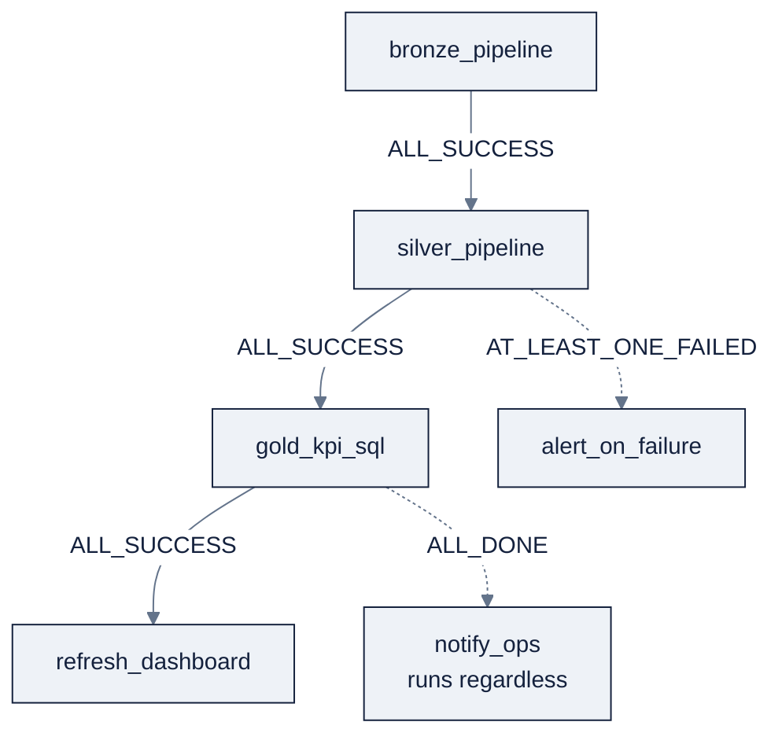

> **Part of AI Engineering Lab · Developed by Zorost Intelligence AI Lab · [zorost.com](https://zorost.com)**

# 06 · Lakeflow: Pipelines, Jobs & Connect

> **Find the Signal. Act with Intelligence.** · Databricks Module · Week 22

This is the data-engineering heart of the module. **Lakeflow Pipelines** (formerly Delta
Live Tables) give you *declarative* batch + streaming with data-quality gates; **Lakeflow
Jobs** (formerly Workflows) orchestrate everything as a DAG; **Lakeflow Connect** ingests
from outside systems. The running example is the Week 22 capstone: a live shipment-events
stream → validated silver (with expectations) → gold KPIs.

> **⚠️ Verify against live docs.** The `dlt` → `pyspark.pipelines` rename and `APPLY
> CHANGES` → `AUTO CDC` rename are recent; re-check [Sources](#sources) and
> `docs.databricks.com/llms.txt` for the exact Python decorators and CDC syntax.

---

## Part A: Lakeflow Pipelines (formerly Delta Live Tables)

### A1. The idea: declarative pipelines

A pipeline is a set of **dataset declarations**; you describe *what* tables you want, and
Databricks figures out the **orchestration**, correct dependency order, maximum
parallelism, and progressive retry. No manual "run task X after Y." Datasets are written in
**SQL** or **Python** (`pyspark.pipelines`, imported as `dp`; formerly `dlt`).

Three dataset types:

| Type | Semantics | Use when |
|---|---|---|
| **Streaming table** | Each record processed once; incremental; append-only source | Streaming ingestion |
| **Materialized view** | Recomputed to reflect *current* state ("always correct") | Aggregations/joins; dimension changes |
| **View** | Evaluated on demand, not persisted | Intermediate checks |

The subtle point: **streaming tables don't recompute on late dimension changes; materialized
views do.** A gold KPI that must reflect a corrected carrier dimension is a materialized
view; an append-only event log is a streaming table. All pipeline tables are **Delta
tables** (ACID + time travel, file 03).

### A2. ZoroLogistics pipeline: SQL

```sql
-- BRONZE: stream JSON shipment events from a volume into a streaming table
CREATE OR REFRESH STREAMING TABLE bronze_shipment_events
AS SELECT * FROM STREAM read_files('/Volumes/zrl_/bronze/landing/events/', format => 'json');

-- SILVER: validate + clean with expectations
CREATE OR REFRESH STREAMING TABLE silver_shipment_events
(
  CONSTRAINT valid_shipment_id EXPECT (shipment_id IS NOT NULL) ON VIOLATION DROP ROW,
  CONSTRAINT valid_weight      EXPECT (weight_kg > 0)           ON VIOLATION DROP ROW,
  CONSTRAINT known_status      EXPECT (status IS NOT NULL)      ON VIOLATION FAIL UPDATE
)
AS SELECT
     shipment_id,
     carrier_id,
     lane_id,
     shipped_at,
     delivered_at,
     promised_at,
     CAST(weight_kg AS DOUBLE) AS weight_kg,
     status
   FROM STREAM(LIVE.bronze_shipment_events);

-- GOLD: recompute on-time KPIs as a materialized view (reflects late dimension changes)
CREATE OR REFRESH MATERIALIZED VIEW gold_on_time_kpis
AS SELECT
     carrier_id,
     DATE_TRUNC('MONTH', delivered_at) AS month,
     AVG(CASE WHEN delivered_at <= promised_at THEN 1 ELSE 0 END) AS on_time_rate,
     COUNT(*) AS shipments
   FROM LIVE.silver_shipment_events
   GROUP BY carrier_id, DATE_TRUNC('MONTH', delivered_at);
```

Notes on the SQL surface:

- `STREAM read_files(...)` reads files as a stream (incremental, exactly-once).
- `STREAM(LIVE.<table>)` / `LIVE.<table>` references an upstream dataset; `STREAM(...)`
  forces streaming semantics.
- `CREATE PRIVATE ...` makes a dataset visible only inside the pipeline.

### A3. ZoroLogistics pipeline: Python (`pyspark.pipelines` as `dp`)

```python
from pyspark import pipelines as dp
from pyspark.sql import functions as F

# BRONZE: Auto Loader source (cloudFiles) into a streaming table
@dp.table
def bronze_shipment_events():
    return (spark.readStream
            .format("cloudFiles")
            .option("cloudFiles.format", "json")
            .load("/Volumes/zrl_/bronze/landing/events/"))

# SILVER: transform + attach expectations
@dp.table
def silver_shipment_events():
    return (dp.read_stream("bronze_shipment_events")
            .filter(F.col("shipment_id").isNotNull())
            .withColumn("weight_kg", F.col("weight_kg").cast("double")))
```

Dataset functions **must return a DataFrame** and **must not call actions**, no
`collect()`, `count()`, `toPandas()`, or `save()` inside them (those force eager execution
and break the declarative plan). Upstream tables are read with `dp.read()` (batch) /
`dp.read_stream()` (streaming), the direct successors of the former `dlt.read()` /
`dlt.read_stream()`.

> **Verify the decorator names.** The research fact base confirms `@dp.table`,
> `@dp.materialized_view`, and `@dp.temporary_view`. The expectation decorators
> (`dp.expect`, `dp.expect_or_drop`, `dp.expect_or_fail`) mirror the former `dlt.*` API,
> confirm exact names against the live Python reference before relying on them, or attach
> expectations in SQL (`CONSTRAINT … EXPECT`), which is stable.

### The full Python pipeline (bronze → silver → gold, with expectations)

Here's the same pipeline in complete Python form, so you can see the decorator surface end
to end:

```python
from pyspark import pipelines as dp
from pyspark.sql import functions as F

# BRONZE, streaming table from Auto Loader (cloudFiles)
@dp.table
def bronze_shipment_events():
    return (spark.readStream
            .format("cloudFiles")
            .option("cloudFiles.format", "json")
            .option("cloudFiles.schemaLocation", "/Volumes/zrl_/bronze/checkpoints/events_schema")
            .load("/Volumes/zrl_/bronze/landing/events/"))

# SILVER, streaming table with expectations
@dp.table
@dp.expect_or_drop("valid_shipment_id", "shipment_id IS NOT NULL")
@dp.expect_or_drop("valid_weight", "weight_kg > 0")
@dp.expect_or_fail("known_status", "status IS NOT NULL")
def silver_shipment_events():
    return (dp.read_stream("bronze_shipment_events")
            .filter(F.col("shipment_id").isNotNull())
            .withColumn("weight_kg", F.col("weight_kg").cast("double"))
            .withColumn("on_time", F.col("delivered_at") <= F.col("promised_at")))

# GOLD, materialized view (recomputed, reflects late dimension changes)
@dp.materialized_view
def gold_on_time_kpis():
    return (dp.read("silver_shipment_events")
            .groupBy("carrier_id", F.date_trunc("month", "delivered_at").alias("month"))
            .agg(F.count("*").alias("shipments"),
                 F.avg(F.when(F.col("on_time"), 1).otherwise(0)).alias("on_time_rate")))
```

**Reading the decorators:** `@dp.table` = streaming table; `@dp.materialized_view` =
always-correct aggregate; `@dp.expect_or_drop`/`@dp.expect_or_fail` attach the same
warn/drop/fail gates as SQL `CONSTRAINT … EXPECT`. The pipeline resolves `bronze → silver →
gold` from the `dp.read`/`dp.read_stream` references, you never write "run A then B."

### A4. Expectations: data quality in the pipeline

An **expectation** is a boolean constraint with three actions:

| Action | SQL | Behavior |
|---|---|---|
| **Warn** | `CONSTRAINT c EXPECT (cond)` | Default, keep rows, record metrics |
| **Drop** | `... ON VIOLATION DROP ROW` | Discard bad rows, keep going |
| **Fail** | `... ON VIOLATION FAIL UPDATE` | Abort the update (block bad data) |

Use **drop** for tolerable noise (a negative weight you can discard), **fail** for
invariants that must never silently pass (a missing shipment id). Metrics are visible in
the pipeline UI and via event logs, your data-quality observability comes "for free" with
the pipeline.

### Streaming with watermarks

Stateful streaming operations (aggregations, dedup, stream-stream joins) grow state
forever unless you bound it. A **watermark** says "I won't wait for data older than X",
late rows past the watermark are dropped, and old state is cleaned up:

```python
from pyspark import pipelines as dp
from pyspark.sql import functions as F

@dp.table
def silver_events_per_minute():
    return (dp.read_stream("bronze_shipment_events")
            .withWatermark("event_time", "10 minutes")
            .groupBy(F.window("event_time", "5 minutes"), "carrier_id")
            .agg(F.count("*").alias("events")))
```

```sql
CREATE OR REFRESH STREAMING TABLE silver_events_per_minute AS
SELECT window(event_time, '5 minutes') AS win, carrier_id, COUNT(*) AS events
FROM STREAM(LIVE.bronze_shipment_events)
GROUP BY window(event_time, '5 minutes'), carrier_id
```

**The watermark rules that matter:**

| Situation | Watermark requirement |
|---|---|
| Stream-stream **outer** join | **Mandatory** |
| Stream-stream inner join | Recommended |
| Streaming aggregation | Recommended (bounds state) |
| `dropDuplicates`/`distinct` | Recommended (bounds the dedupe buffer) |

**Window types** (`window()` / `F.window`): **tumbling** (fixed, non-overlapping, the
`5 minutes` above), **sliding** (fixed length + slide), and **session** (gaps define
boundaries). Pick tumbling for "events per 5 min", sliding for "last 30 min updated every
5 min", session for "bursts separated by inactivity."

**The mental model:** watermark = your *tolerance for lateness*, expressed in time. A
10-minute watermark on a stream that's usually seconds-late drops only the genuinely
straggling rows; a 10-second watermark on a bursty stream drops legitimate data. Size it to
your data's actual lateness distribution.

### A5. AUTO CDC (formerly APPLY CHANGES)

For **change-data-capture** sources (a stream of upserts/deletes keyed by `shipment_id`
with a sequence column), `AUTO CDC` turns the feed into a slowly-changing-dimension table:

```sql
CREATE OR REFRESH STREAMING TABLE silver_shipment_status;

APPLY CHANGES INTO LIVE.silver_shipment_status
FROM STREAM(LIVE.bronze_shipment_events)
KEYS (shipment_id)
SEQUENCE BY event_time
COLUMNS * EXCEPT (operation, _rescued_data)
STORED AS SCD TYPE 1;
```

- **SCD Type 1** keeps only the latest row per key.
- **SCD Type 2** keeps versioned history, automatically adding **`__START_AT`** and
  **`__END_AT`** columns:

```sql
STORED AS SCD TYPE 2;
```

**Name note:** teach **AUTO CDC** as the current name for this CDC mechanism (formerly
`APPLY CHANGES`); the syntax is the same. This is *distinct* from Delta's table-level
change data feed (`table_changes()`, file 03): AUTO CDC *consumes* a change feed to build
SCD tables inside a pipeline.

### AUTO CDC: a fuller worked example

The feed arrives as a stream of upserts/deletes keyed by `shipment_id`, with a monotonic
`event_time` for ordering and an `operation` column marking the row's intent:

```sql
-- 1. Target: SCD Type 2 versioned history (adds __START_AT / __END_AT automatically)
CREATE OR REFRESH STREAMING TABLE silver_shipment_status;

-- 2. Consume the feed (AUTO CDC = the current name for APPLY CHANGES)
APPLY CHANGES INTO LIVE.silver_shipment_status
FROM STREAM(LIVE.bronze_shipment_events)
KEYS (shipment_id)
SEQUENCE BY event_time
COLUMNS * EXCEPT (operation, _rescued_data)
WHERE operation IN ('insert', 'update', 'delete')
STORED AS SCD TYPE 2;
```

**What each clause does:**

| Clause | Meaning |
|---|---|
| `KEYS (shipment_id)` | The natural key that identifies a row across versions |
| `SEQUENCE BY event_time` | Orders changes; the *latest* sequence wins on conflict |
| `COLUMNS * EXCEPT (…)` | Carries all source columns except the CDC plumbing |
| `WHERE operation IN (…)` | Which feed rows count as changes |
| `STORED AS SCD TYPE 2` | Versioned history with `__START_AT`/`__END_AT` (vs Type 1 = latest only) |

**When to use each type:** **Type 1** when only the current state matters (a carrier's
current status); **Type 2** when *history* matters (what was this shipment's status as of
last Tuesday, the point-in-time question the feature store asks, file 08). The `__START_AT`
/`__END_AT` columns are what make Type 2 queryable "as of" any moment.

### A6. Orchestration in pipelines

You don't schedule individual dataset steps. The pipeline engine:

- Resolves the **DAG** from your `LIVE.<table>` references,
- Runs independent branches in parallel,
- Applies **progressive retry** on transient failures,
- Runs on **serverless** (recommended) or a classic compute policy.

You schedule *one* pipeline (continuous or triggered), and the internals follow.

### A7. Pipeline configuration & execution modes

Beyond the dataset declarations, a pipeline has a small set of *runtime* knobs:

| Setting | Options | Meaning |
|---|---|---|
| **Mode** | `Development` / `Production` | Dev: cluster reused across runs, cheaper iteration. Prod: fresh cluster, full retry semantics |
| **Trigger** | `Triggered` / `Continuous` | Run once, or run continuously as a streaming pipeline |
| **Compute** | Serverless (default) or a compute policy | Where the pipeline runs (file 02) |
| **Channel** | `Current` / `Preview` | DBR channel the pipeline uses |

A streaming pipeline in `Continuous` mode stays up and processes events as they arrive; a
batch medallion build is usually `Triggered` (run on a schedule from a job). The
**development vs. production** distinction is the one new pipeline authors most often miss:
dev mode keeps a warm cluster and relaxes retries (fast but not resilient), prod mode is
the real thing.

---

## Part B: Lakeflow Jobs (formerly Workflows)

### B1. Jobs orchestrate tasks as a DAG

A **job** schedules and coordinates **tasks**. Task types include:

| Task type | What it runs |
|---|---|
| **Notebook** | A notebook (with parameters) |
| **Python script / wheel** | A `.py` file or installed wheel |
| **SQL** | A query, file, dashboard, or alert |
| **dbt** | A dbt Core project |
| **Pipeline** | A Lakeflow Pipeline (compose pipelines!) |
| **JAR** | Scala/Java code |
| **Run Job** | Another job (nesting) |
| **If/else** | Conditional branching |
| **For each** | Loop over a collection |

### B2. The DAG: dependencies + Run if

Tasks are wired with `depends_on` and gated with **Run if** conditions:

| Run if | Meaning |
|---|---|
| `ALL_SUCCESS` (default) | Run after all deps succeed |
| `AT_LEAST_ONE_SUCCESS` | Run after ≥1 dep succeeds |
| `NONE_FAILED` | Run if no dep failed |
| `ALL_DONE` | Run regardless of dep outcome |
| `AT_LEAST_ONE_FAILED` | Run after a failure (error path) |
| `ALL_FAILED` | Run after all deps fail |

**ZoroLogistics DAG:** `bronze_pipeline` → (on success) `silver_pipeline` → (on success)
`gold_kpi_sql`; on failure of `silver_pipeline`, an `alert_on_failure` task fires (Run if
`AT_LEAST_ONE_FAILED`).

**Control-flow tasks** extend the DAG beyond linear chains:

- **If/else**: branch on a condition (e.g., "if `run_date` is month-end, run the
  `monthly_rollup` task, else skip it").
- **For each**: loop over a collection (e.g., run a per-carrier task for each `carrier_id`
  in a list, with parallelism).

### The ZoroLogistics DAG, drawn



Every arrow is a `depends_on` + `run_if` pair. The two dotted arrows are the *non-happy-path*
edges most beginners forget: a failure branch (alert) and an always-run branch (notify).
A DAG that only has success edges silently swallows failures.

**Run-if worked example**: the same edges as `databricks.yml` task config:

```yaml
tasks:
  - task_key: bronze_pipeline
    pipeline_task: { pipeline_id: "…" }
  - task_key: silver_pipeline
    pipeline_task: { pipeline_id: "…" }
    depends_on: [{ task_key: bronze_pipeline, outcome: success }]
  - task_key: gold_kpi_sql
    sql_task: { warehouse_id: "…", query: { query_id: "…" } }
    depends_on: [{ task_key: silver_pipeline, outcome: success }]
  - task_key: alert_on_failure
    notebook_task: { notebook_path: "/Zoro/alerts/notify" }
    depends_on: [{ task_key: silver_pipeline, outcome: failed }]
  - task_key: notify_ops
    notebook_task: { notebook_path: "/Zoro/ops/notify" }
    depends_on: [{ task_key: gold_kpi_sql, outcome: all_done }]
```

`outcome: failed` + `run_if: AT_LEAST_ONE_FAILED` is the "error path" edge; `outcome:
all_done` + `run_if: ALL_DONE` is the "always notify" edge. Together they turn a linear
chain into a resilient graph.

### B3. Parameters

Job-level parameters flow into tasks:

- Declare a parameter on the job (e.g., `run_date`), reference it in task configs as
  `{{job.parameters.run_date}}`.
- In a notebook, read it with **widgets**:

```python
dbutils.widgets.text("run_date", "2026-08-01")
run_date = dbutils.widgets.get("run_date")
```

Pass values per-run (backfill a date) or at schedule time.

**Parameterized job, worked**: the classic "backfill a date range" pattern:

```yaml
jobs:
  zrl_backfill:
    parameters:
      - name: start_date
        default: "2026-01-01"
      - name: end_date
        default: "2026-01-07"
    tasks:
      - task_key: backfill_bronze
        notebook_task:
          notebook_path: "/Zoro/etl/load_shipments"
          base_parameters:
            start_date: "{{job.parameters.start_date}}"
            end_date: "{{job.parameters.end_date}}"
```

```python
# In the notebook: declare widgets, then read them
dbutils.widgets.text("start_date", "2026-01-01")
dbutils.widgets.text("end_date", "2026-01-07")
start = dbutils.widgets.get("start_date")
end = dbutils.widgets.get("end_date")

df = spark.sql(f"""
  SELECT * FROM zrl_.bronze.shipments_raw
  WHERE planned_departure BETWEEN '{start}' AND '{end}'
""")
```

**Parameter rules of thumb:**

1. **Declare defaults** so a manual "Run now" doesn't fail on a missing value.
2. **Reference with `{{job.parameters.<name>}}`** in task configs; the notebook reads the
   *widget*: the job injects into the widget at run time.
3. **Use widget types** (`dbutils.widgets.dropdown`/`text`/`multiselect`) to make ad-hoc
   runs self-documenting, a dropdown of carriers beats a free-text `carrier_id`.
4. **Backfill = parameterized job + manual runs**, not a special mode: pass a `start_date`,
   run, change it, run again. The *same* job definition serves schedule and backfill.

### B4. Scheduling & triggers

| Trigger | Use |
|---|---|
| **Scheduled** | Cron expression (e.g., nightly) |
| **Periodic** | Fixed interval (min 10 s between runs) |
| **File arrival** | When a file lands in storage |
| **Table update** | When a table is updated |
| **Continuous** | Always-on streaming job |

### B5. Resilience: retries, repair, timeout

- **Per-task retries**: auto-retry on transient failure.
- **Repair / rerun**: re-run *only the failed tasks* (repair) rather than the whole DAG.
- **Per-task timeout**: kill a runaway task.

### B6. Compute for jobs

Jobs run on **job clusters** (reused across tasks, recommended for classic), existing
all-purpose clusters, or **serverless** (omit cluster config entirely). Serverless is the
low-ops default; job clusters give you VPC/runtime control (file 02).

### Orchestration patterns (the four you'll reuse)

| Pattern | Shape | When | The run-if/depends trick |
|---|---|---|---|
| **Linear pipeline** | A → B → C | Simple nightly ETL | `depends_on` chain, all `success` |
| **Fan-out / fan-in** | A → {B, C} → D | Split by subject, rejoin | B and C both depend on A; D depends on *all* of B and C |
| **Error path** | A → B; B → alert on failure | Notify/repair on failure | `depends_on` with `outcome: failed` |
| **Conditional** | A → if(month-end) → B | Month-end close, special runs | **If/else** task on `{{job.parameters.run_date}}` |
| **Loop** | A → for-each carrier → B | Per-entity processing | **For each** task over a `carrier_id` list |

**The pattern in practice: fan-out by carrier:** one `bronze` pipeline, then a **For each**
task that runs the `silver` transform per `carrier_id` in parallel, then a `gold` task that
joins them back. The `depends_on` graph expresses it; you don't hand-roll parallelism.

**The one rule to internalize:** every non-linear DAG is just `depends_on` + `run_if`
composed. If you can draw it as boxes and arrows, you can express it in a job.

### B7. Jobs as code (databricks.yml, a preview of file 15)

A job is a first-class **DAB resource**, you can declare the whole DAG in `databricks.yml`
instead of clicking it together in the UI:

```yaml
resources:
  jobs:
    zrl_nightly:
      schedule:
        quartz_cron_expression: "0 0 2 * * ?"   # 02:00 UTC daily
      tasks:
        - task_key: bronze_pipeline
          pipeline_task:
            pipeline_id: ${resources.pipelines.zrl_medallion.id}
        - task_key: gold_kpis
          sql_task:
            warehouse_id: ${var.sql_warehouse_id}
            query:
              query_id: ${resources.queries.gold_kpis.id}
          depends_on:
            - task_key: bronze_pipeline
            - outcome: success
```

This is the bridge to **Declarative Automation Bundles** (file 15): what you orchestrate
*by hand* this week, you ship *as code* next week.

### B8. Monitoring jobs

- **Job run UI** shows the DAG, per-task status, duration, and retries.
- **`system.lakeflow.jobs`** system table holds run/task history for querying:

```sql
SELECT * FROM system.lakeflow.jobs WHERE job_name = 'zrl_nightly' ORDER BY start_time DESC;
```

- Failed runs surface in **alerts** (file 04) or a **repair** click, you re-run only the
  broken branch, not the whole night.

---

## Part C: Lakeflow Connect (ingestion connectors, briefly)

**Lakeflow Connect (formerly Databricks Ingest)** is managed ingestion from external
systems into governed Delta tables, powered by serverless Lakeflow Pipelines. The layered
connector model:

| Tier | Examples |
|---|---|
| **Managed (fully managed)** | SaaS (Salesforce, Workday, ServiceNow, GA4, HubSpot, Confluence…), database CDC (SQL Server; PostgreSQL/MySQL CDC in preview), file sources (SharePoint, Google Drive, SFTP…), streaming (Kafka, Kinesis, Pub/Sub, Pulsar) |
| **Standard** | More control over configuration |
| **Community / custom** | Community-built connectors |

**Rule of thumb vs. Lakehouse Federation:** Lakeflow Connect **copies** data into governed
Delta tables (you transform downstream); Lakehouse Federation **queries in place** without
copying (read-only, via foreign catalogs). Use Connect for ELT ingestion; Federation for
ad-hoc/read-only access to an external system.

For ZoroLogistics, a **Kafka connector** is the natural choice if shipment events arrive on
a message bus; the **Auto Loader** (`cloudFiles`, file 05/A3) is the file-based
alternative you already used in the pipeline.

---

## Part D: The full ZoroLogistics flow (assembled)

```
[shipment events stream]
        │  (Kafka via Lakeflow Connect, OR files via Auto Loader)
        ▼
bronze_shipment_events   ── streaming table, append-only
        │  STREAM(LIVE.bronze_shipment_events)
        ▼
silver_shipment_events   ── streaming table + expectations (drop bad, fail on missing id)
        │                    + AUTO CDC (SCD Type 2) for status history
        ▼
gold_on_time_kpis        ── materialized view (always-correct aggregation)
        │
        └── scheduled by a Lakeflow Job → AI/BI dashboard (file 04) / alerts
```

Everything above is one **pipeline** (Part A) whose *schedule and failure handling* is one
**job** (Part B), fed by **Connect/Auto Loader** (Part C). The three Lakeflow surfaces are
one story: *ingest → transform with quality gates → orchestrate.*

---

## Part E: Checklist

- [ ] Named the three dataset types and the "streaming table vs. materialized view" rule.
- [ ] Wrote the SQL pipeline (bronze → silver with expectations → gold materialized view).
- [ ] Wrote the Python `dp` pipeline and obeyed "no actions in dataset functions."
- [ ] Attached warn/drop/fail expectations and explained when each.
- [ ] Wrote `APPLY CHANGES` (AUTO CDC) as SCD Type 1 and Type 2, and named `__START_AT`/`__END_AT`.
- [ ] Listed ≥5 job task types and the six Run-if gates.
- [ ] Passed `{{job.parameters.*}}` into a notebook via `dbutils.widgets`.
- [ ] Chose a trigger (scheduled/periodic/file-arrival/table-update/continuous).
- [ ] Distinguished repair vs. rerun, and job cluster vs. serverless.
- [ ] Explained Lakeflow Connect (copy) vs. Lakehouse Federation (query in place).

**Definition of done:** the shipment-events stream lands in bronze, passes silver
expectations, feeds gold KPIs, and is scheduled + monitored by a Lakeflow Job, described
end-to-end in your own words and code.

---

## Try it

Three hands-on tasks. Do them in order; each has a check you can run.

### Task 1: SQL pipeline with all three expectation actions

Write the bronze → silver (with warn/drop/fail) → gold materialized view pipeline in SQL:

```sql
CREATE OR REFRESH STREAMING TABLE bronze_events AS
SELECT * FROM STREAM read_files('/Volumes/zrl_/bronze/landing/events/', format => 'json');

CREATE OR REFRESH STREAMING TABLE silver_events
(CONSTRAINT valid_id EXPECT (shipment_id IS NOT NULL) ON VIOLATION DROP ROW,
 CONSTRAINT valid_weight EXPECT (weight_kg > 0) ON VIOLATION DROP ROW,
 CONSTRAINT known_status EXPECT (status IS NOT NULL) ON VIOLATION FAIL UPDATE)
AS SELECT * FROM STREAM(LIVE.bronze_events);
```

**Acceptance check:** you can name which expectation *warns*, which *drops*, which *fails*,
and the pipeline UI shows per-constraint row counts after a run.

### Task 2: Python pipeline (dp) with a watermark

Rewrite silver in Python (`from pyspark import pipelines as dp`) and add a tumbling-window
aggregate with a 10-minute watermark.

**Acceptance check:** the code uses `@dp.table`, `dp.read_stream`, and `.withWatermark(...)`
and returns a DataFrame, no `collect()`/`count()`/`save()` inside the dataset function.

### Task 3: A three-node job DAG with an error path

Declare (or draw) a job with `bronze_pipeline → silver_pipeline → gold_sql` plus an
`alert_on_failure` task that fires only when `silver_pipeline` fails.

**Acceptance check:** your `depends_on` uses `outcome: success` for the happy path and
`outcome: failed` (run-if `AT_LEAST_ONE_FAILED`) for the alert, and you can point at which
edge is the error path in the DAG.

---

## Common mistakes

1. **Calling `collect()`/`count()`/`toPandas()` inside a dataset function.** It forces eager
   execution and breaks the declarative plan. *Fix:* return a DataFrame; let the pipeline
   engine run it.
2. **Using a streaming table where a materialized view is needed.** A streaming table won't
   recompute when a dimension changes late; an MV will. *Fix:* "always correct" aggregates =
   materialized views; append-only logs = streaming tables.
3. **Omitting the failure edge in a job DAG.** A DAG with only success edges swallows
   failures. *Fix:* add an `AT_LEAST_ONE_FAILED`/`ALL_DONE` edge for alerts and cleanup.
4. **No watermark on a stateful stream.** State grows unbounded (and OOMs). *Fix:* add
   `.withWatermark(...)` (mandatory for stream-stream outer joins) sized to real lateness.
5. **Reusing one checkpoint across two queries.** Each query needs its own checkpoint path,
   or resume/correctness breaks. *Fix:* unique `/Volumes/.../checkpoints/<query>` per query.
6. **Forgetting `development` vs. `production` mode.** Dev mode reuses a warm cluster and
   relaxes retries, great for iteration, wrong for a real run. *Fix:* iterate in
   Development, ship in Production.

---

## Sources

- https://docs.databricks.com/ldp/
- https://docs.databricks.com/ldp/concepts
- https://docs.databricks.com/ldp/expectations
- https://docs.databricks.com/ldp/cdc
- https://docs.databricks.com/ldp/developer/sql-dev
- https://docs.databricks.com/ldp/developer/python-ref
- https://docs.databricks.com/jobs/
- https://docs.databricks.com/jobs/configure-task
- https://docs.databricks.com/jobs/scheduled
- https://docs.databricks.com/jobs/run-if
- https://docs.databricks.com/ingestion/overview
- https://docs.databricks.com/ingestion/lakeflow-connect/
- https://docs.databricks.com/ingestion/cloud-object-storage/auto-loader/
- https://docs.databricks.com/query-federation/
- https://docs.databricks.com/llms.txt

> *This is original curriculum written in AI Engineering Lab's own words; no third-party
> course material was copied. The `pyspark.pipelines` and AUTO CDC renames are recent,
> verify exact decorator/CDC syntax against the live links above.*

---

© 2026 Zorost Intelligence LLC · [zorost.com](https://zorost.com)
