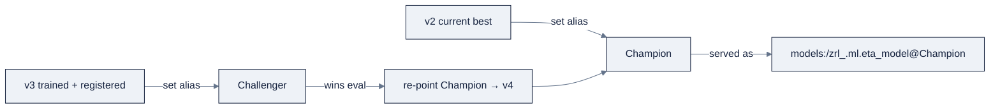

> **Part of AI Engineering Lab · Developed by Zorost Intelligence AI Lab · [zorost.com](https://zorost.com)**

# 07 · MLflow: Experiments, Tracking & Models in UC

> **Find the Signal. Act with Intelligence.** · Databricks Module · Week 23

MLflow is the experiment-tracking and model-lifecycle backbone of Databricks ML. This file
teaches experiments → runs → models: how to log a run (autologging or the explicit API),
how MLflow 3 changes the picture, and how **Models in Unity Catalog** (formerly the Model
Registry) manage versions with **aliases** instead of the old "stages." The worked example:
log and register a ZoroLogistics **ETA baseline**.

> **⚠️ Verify against live docs.** MLflow 3 and the registry → UC migration are recent;
> re-check [Sources](#sources) and `docs.databricks.com/llms.txt`.

---

## 1. The model: experiments → runs → models

| Object | What it is |
|---|---|
| **Experiment** | A container grouping related runs (e.g., "zrl-eta") |
| **Run** | One execution: code version, parameters, metrics, artifacts, model |
| **Model** | An artifact (the trained model) + its environment, optionally **registered** |

The discipline this enables is core AI engineering: **every training attempt is a run**,
so you can compare "XGBoost depth 6" against "depth 8" and pick with evidence, not memory.

---

## 2. Two logging mechanisms

### Autologging

One line captures params, metrics, and the model for supported frameworks:

```python
import mlflow

mlflow.set_experiment("/Users/you@example.com/zrl-eta")
mlflow.sklearn.autolog()          # captures sklearn params/metrics/model automatically
# ... train a scikit-learn model ...
```

Flavors have their own autolog: `mlflow.sklearn.autolog()`, `mlflow.xgboost.autolog()`,
`mlflow.pytorch.autolog()`, `mlflow.spark.autolog()`, etc.

**What autolog actually captures**: the "output shape" so you know what to expect in the UI:

| What it logs | Example for `sklearn` | Where you see it |
|---|---|---|
| **Params** | `max_depth=6`, `n_estimators=200` (constructor args) | Run → Parameters |
| **Metrics** | `training_score`, `training_mean_absolute_error` (fit metrics) | Run → Metrics |
| **Model + signature** | The fitted estimator + input/output schema | Run → Artifacts → `model/` |
| **Env/versions** | `mlflow`, `sklearn`, Python versions | Run → System/versions |

The walkthrough in one cell:

```python
import mlflow
from sklearn.ensemble import GradientBoostingRegressor
from sklearn.metrics import mean_absolute_error

mlflow.set_experiment("/Users/you@example.com/zrl-eta")
mlflow.sklearn.autolog()

model = GradientBoostingRegressor(max_depth=6, n_estimators=200).fit(X_train, y_train)
# autolog captured: params (depth=6, n_estimators=200),
#                    metrics (training MAE),
#                    the fitted model + signature
```

After this runs, open the run: **Parameters** shows the constructor args, **Metrics** shows
the training MAE, and **Artifacts → model/** holds the logged model. That's autologging's
contract, *no `log_param`/`log_metric` calls required* for the common case.

**When autolog isn't enough:** it captures *fit-time* metrics, not your *test-set* metric.
For the number you actually commit to (hold-out MAE), add one explicit `log_metric` after
predicting. Autologging handles the boilerplate; the explicit API handles the *judgment*
metrics.

### The explicit logging API

More control, log exactly what you want:

```python
import mlflow

with mlflow.start_run(run_name="eta_baseline_v1") as run:
    mlflow.log_param("model", "gradient_boosting")
    mlflow.log_param("max_depth", 6)
    mlflow.log_metric("mae", 2.4)
    mlflow.log_metric("rmse", 3.1)
    mlflow.log_artifact("model_card.md")
    mlflow.sklearn.log_model(model, "model")   # logs the model + signature + env
```

**What to log: the minimum bar:** the metric you committed to (MAE/RMSE for ETA), the
split used (train/val/test), hyperparameters, the dataset version, and the code git commit.
That's what makes a run *reproducible*, not just *recorded*.

### Organizing experiments

Experiment naming is a governance decision, not an afterthought. A workable convention:

| Path | Purpose |
|---|---|
| `/Users/<you>/zrl-eta` | Personal sandbox experiments |
| `/Shared/zrl/eta` | Team-shared, canonical ETA experiments |
| `/Shared/zrl/on-time` | Team-shared on-time classifier experiments |

Rules of thumb:

- **One experiment per problem**, not one giant "everything" experiment, compare runs
  *within* a problem.
- **Shared experiments for team work**, personal paths for throwaway exploration.
- **Tag runs** with `mlflow.set_tag("dataset", "gold_eta_features_v3")` and the git commit,
  so "which data/code was this?" is one click away.

---

## 3. MLflow 3 notes

MLflow 3 is the current major version on Databricks. Headlines relevant here:

- **GenAI observability, evaluation, and prompt management** are first-class (file 13 /
  evals), `mlflow.genai.evaluate()` and trace-based monitoring.
- **Logged Models** and **Deployment Jobs** streamline deploy-from-run.
- **The default registry is `databricks-uc`**: UC is the registry by default, which is why
  "Model Registry" is now "Models in Unity Catalog."

The practical consequence: **you don't choose a separate registry**, when you register a
model on a UC-enabled workspace, it lands in UC automatically.

**In practice, "MLflow 3" means:** the code you write (`mlflow.sklearn.autolog()`,
`mlflow.register_model`, `MlflowClient().set_registered_model_alias`) is unchanged, what
moved is *where models live* (UC, not a standalone registry) and *what's first-class*
(GenAI eval, traces, prompts). If you learned MLflow 2.x, you mostly keep your code and gain
governance for free.

---

## 4. Models in Unity Catalog (formerly Model Registry)

### Registering

A registered model lives at `<catalog>.<schema>.<model>` and **requires a model signature**
(input/output schema):

```python
import mlflow

run_id = run.info.run_id
model_uri = f"runs:/{run_id}/model"

mlflow.register_model(model_uri, "zrl_.ml.eta_model")
```

Each `register_model` creates a new **version** under that name. Governance applies exactly
as for tables (file 01): grant `USE SCHEMA` + `EXECUTE` (or `APPLY TAG`) on the model to
whoever should use it.

### Aliases (stages are deprecated)

The old Registry "Staging/Production/Archived" **stages are deprecated**. Replace them with
**aliases**: mutable, named references to a specific version:

```python
from mlflow import MlflowClient
client = MlflowClient()

client.set_registered_model_alias("zrl_.ml.eta_model", "Champion",  "3")
client.set_registered_model_alias("zrl_.ml.eta_model", "Challenger", "4")
```

Reference a model *through its alias* (so promotion is a pointer move, not a copy):

```python
model_uri = "models:/zrl_.ml.eta_model@Champion"
```

**Conventions:**

| Alias | Meaning |
|---|---|
| `@prod` | What's live in production |
| `Champion` / `Challenger` | A/B: current best vs. candidate (promote Challenger → Champion when it wins) |

> **Why aliases beat stages:** you can have several named references (Champion, Challenger,
> `@prod`, `@shadow`) instead of one linear stage, and promote by *re-pointing an alias*
> rather than mutating a stage.

### The alias promotion workflow (Champion / Challenger)

The full lifecycle, from "candidate trained" to "promoted to prod", is a sequence of alias
moves, not a mutation of the model:



```python
from mlflow import MlflowClient
client = MlflowClient()
name = "zrl_.ml.eta_model"

# 1. Register a candidate; alias it Challenger
client.set_registered_model_alias(name, "Challenger", "4")

# 2. Serve production from Champion (unchanged during the test)
prod_uri = f"models:/{name}@Champion"

# 3. When Challenger beats Champion on the eval metric, promote:
client.set_registered_model_alias(name, "Champion", "4")   # re-point, no copy
# optionally demote the old one:
client.set_registered_model_alias(name, "Archived", "3")
```

**The promotion rules:**

1. **Promotion is a pointer move.** `Champion → v4` doesn't touch v3; it just re-points.
   Rollback = re-point `Champion` back to v3, one call, instant.
2. **`@prod` and `Champion` are *different* references for different audiences.** `Champion`
   is "best known model" (the ML team's truth); `@prod` is "what's actually serving." Keep
   them distinct so a shadow deploy doesn't confuse the two.
3. **Never delete the currently-aliased version.** `models:/...@alias` URIs are the safety
   net; deleting a version an alias points to breaks every consumer.

### Version management

- Each registration is a new **version** (immutable). Promote/demote by moving aliases, not
  by editing a version.
- Delete a registered model or version only when you're sure nothing references it
  (`client.delete_model_version(...)`); aliases and `models:/...@alias` URIs are the safety
  net against accidental removal.
- Use `models:/zrl_.ml.eta_model@latest` when you want "whatever is newest" during
  development, and an explicit alias (`@prod` / `Champion`) for anything production-facing.

**Sharing models:** because models are UC securables, they inherit UC governance, workspaces
attached to the *same metastore* share the same `zrl_.ml.eta_model`, and you can share a
model cross-account with **OpenSharing** (file 01). No more copying model files between
teams; you share the governed reference.

### Signing & loading

Load a registered model by URI to serve it (file 09/10):

```python
import mlflow
model = mlflow.sklearn.load_model("models:/zrl_.ml.eta_model@Champion")
```

### UC lineage for models

Because models are UC securables, **lineage extends to them**: log the input dataset with
`mlflow.log_input()` so Catalog Explorer shows *which table version* produced *which model
version*:

```python
dataset = mlflow.data.from_spark(train_df, table_name="zrl_.gold.eta_features")
mlflow.log_input(dataset, context="training")
```

Now `system.access.table_lineage` and the UI connect the model back to its training data,
the audit trail "this ETA model was trained on gold features as of version N."

**What model lineage gives you, concretely:**

| Question | Answered by | Where |
|---|---|---|
| Which table(s) trained this model? | `mlflow.log_input()` | Catalog Explorer → model → Lineage |
| Which *version* of that table? | The dataset's Delta version | The lineage edge label |
| Which model version came from it? | The registered model version | The model lineage graph |
| Who can see the trace? | UC governance on the model | Grants (file 01) |

**The full lineage chain for ETA** (each hop recorded automatically or via one call):

```mermaid
%%{init:{"theme":"base","fontFamily":"Helvetica Neue,Helvetica,Arial,sans-serif","flowchart":{"curve":"basis","padding":14,"nodeSpacing":45,"rankSpacing":55},"themeVariables":{"fontSize":"15px","background":"#FFFFFF","primaryColor":"#EEF2F7","primaryTextColor":"#14213D","primaryBorderColor":"#14213D","secondaryColor":"#FFF1E3","secondaryTextColor":"#14213D","tertiaryColor":"#E7F4F1","tertiaryTextColor":"#14213D","lineColor":"#64748B","textColor":"#14213D","edgeLabelBackground":"#FFFFFF","clusterBkg":"#F5F8FC","clusterBorder":"#94A3B8","nodeBorder":"#14213D","mainBkg":"#EEF2F7","titleColor":"#14213D"}}}%%
flowchart LR
    F[zrl_.silver.shipments] -->|aggregate| G[zrl_.gold.eta_features]
    G -->|log_input training| M[zrl_.ml.eta_model v4]
    M -->|alias| S["Model Serving @Champion"]
```



The audit trail reads: "ETA v4 was trained on `gold.eta_features` as of version N, which was
built from `silver.shipments`." That's the *evidence* a governed ML platform owes regulators
and clients, and it's automatic once you call `log_input()`.

---

## 5. Worked example: log the ZoroLogistics ETA baseline

A minimal but complete baseline: load a small feature set, train a linear model, log it,
register it, and set an alias.

```python
import mlflow
import mlflow.sklearn
from sklearn.linear_model import LinearRegression
from sklearn.model_selection import train_test_split
from sklearn.metrics import mean_absolute_error
import pandas as pd

# 1. Features (simplified for the baseline; file 08 adds point-in-time features)
pdf = spark.table("zrl_.gold.eta_features").toPandas()
X = pdf[["weight_kg", "distance_km"]]
y = pdf["eta_hours"]

X_train, X_test, y_train, y_test = train_test_split(
    X, y, test_size=0.2, random_state=42)

# 2. Experiment + run
mlflow.set_experiment("/Users/you@example.com/zrl-eta")
with mlflow.start_run(run_name="eta_linear_baseline") as run:
    model = LinearRegression().fit(X_train, y_train)
    mae = mean_absolute_error(y_test, model.predict(X_test))

    mlflow.log_param("model", "linear_regression")
    mlflow.log_metric("mae", mae)
    mlflow.sklearn.log_model(model, "model", input_example=X_test.head(1))

    # 3. Register + alias
    mlflow.register_model(f"runs:/{run.info.run_id}/model", "zrl_.ml.eta_model")

MlflowClient().set_registered_model_alias("zrl_.ml.eta_model", "Challenger",
                                         run_id_and_version_from_above)
```

From the **Experiments UI** you can now compare this run against later ones (XGBoost, a
PyTorch model, file 09) on the same `mae` metric, and the registered model is a governed
UC object ready for serving.

> **Baseline discipline:** the point of a baseline is a *number to beat*, not a good model.
> Log it, register it, alias it `Challenger`, then let every improvement compete against it.

**The complete loop, one line per step:** set experiment → start run → train → log metric →
log model (with input example) → register → set alias → load by alias. That sequence is the
*entire* MLflow contract; every later file (08, 09, 10) is a variation on it.

---

## 6. Comparing & navigating runs

- **Experiments UI** → compare runs side-by-side on params/metrics.
- **Search API** to query runs programmatically:

```python
from mlflow import MlflowClient
client = MlflowClient()
runs = client.search_runs(
    experiment_ids=["12345"],
    filter_string="metrics.mae < 2.5",
    order_by=["metrics.mae ASC"])
```

**More `search_runs` patterns**: the filter syntax is the query language you'll reuse:

```python
# By tag (dataset version) and metric
runs = client.search_runs(
    experiment_ids=["12345"],
    filter_string="tags.dataset = 'gold_eta_features_v3' AND metrics.mae < 2.5")

# Latest N runs, most recent first
runs = client.search_runs(experiment_ids=["12345"],
                          order_by=["start_time DESC"], max_results=10)

# By run name (substring), find all "baseline" runs
runs = client.search_runs(experiment_ids=["12345"],
                          filter_string="run_name LIKE '%baseline%'")

# Pull the best run's params/metrics programmatically
best = client.search_runs(experiment_ids=["12345"],
                          order_by=["metrics.mae ASC"], max_results=1)[0]
print(best.data.params.get("max_depth"), best.data.metrics.get("mae"))
```

| Filter target | Syntax | Example |
|---|---|---|
| Metric | `metrics.<name> <op> <value>` | `metrics.mae < 2.5` |
| Param | `params.<name> = 'value'` | `params.model = 'gbt'` |
| Tag | `tags.<name> = 'value'` | `tags.dataset = 'v3'` |
| Run name | `run_name LIKE '%…%'` | `run_name LIKE '%baseline%'` |
| Combine | `AND` / `OR` | `tags.dataset = 'v3' AND metrics.mae < 2.5` |

- **`mlflow.get_run(run_id)`** to fetch a single run's full record.

The habit: after every training session, open the compare view and write one line, "X
beat the baseline by 0.4 MAE because …", so the next session starts from knowledge, not
re-discovery.

---

## 7. Checklist

- [ ] Named the experiment → run → model hierarchy.
- [ ] Ran `mlflow.sklearn.autolog()` *and* an explicit logging run; know when to use each.
- [ ] Logged params + metrics + artifacts + a model with a signature.
- [ ] Stated two MLflow 3 changes (UC default registry, GenAI eval/observability).
- [ ] Registered a model to `zrl_.ml.eta_model` and set `Champion`/`Challenger` aliases.
- [ ] Loaded a model via `models:/zrl_.ml.eta_model@Champion`.
- [ ] Explained why aliases replaced stages.
- [ ] Called `mlflow.log_input()` and saw model lineage in Catalog Explorer.
- [ ] Logged the ETA baseline and confirmed it appears in the compare view.

**Definition of done:** a colleague can reproduce your ETA baseline run from its logged
params/metrics/artifacts, and promote `Challenger` → `Champion` by re-pointing an alias.

---

## Try it

Three hands-on tasks. Do them in order; each has a check you can run.

### Task 1: Autolog a run, then read the output shape

Autolog a `GradientBoostingRegressor` fit and confirm *what* got captured:

```python
import mlflow
mlflow.set_experiment("/Users/you@example.com/zrl-eta")
mlflow.sklearn.autolog()
# ... fit model ...
```

**Acceptance check:** the run's **Parameters** show constructor args, **Metrics** show
training metrics, and **Artifacts → model/** holds a logged model, the three things
autolog promises, all visible without a single `log_*` call.

### Task 2: Alias promotion round trip

Register two versions, alias v3 `Champion` and v4 `Challenger`, then promote v4 and demote v3:

```python
from mlflow import MlflowClient
c = MlflowClient()
c.set_registered_model_alias("zrl_.ml.eta_model", "Champion", "3")
c.set_registered_model_alias("zrl_.ml.eta_model", "Challenger", "4")
c.set_registered_model_alias("zrl_.ml.eta_model", "Champion", "4")   # promote
c.set_registered_model_alias("zrl_.ml.eta_model", "Archived", "3")   # demote
```

**Acceptance check:** loading `models:/zrl_.ml.eta_model@Champion` now returns v4, and v3 is
intact (reachable via `@Archived`), promotion was a pointer move, not a copy or edit.

### Task 3: search_runs to find the best MAE

Use `search_runs` to find the single best run by `metrics.mae` and print its params:

**Acceptance check:** `search_runs(..., order_by=["metrics.mae ASC"], max_results=1)` returns
one run whose `metrics.mae` is the minimum across the experiment, the programmatic version
of the compare view.

---

## Common mistakes

1. **Using the deprecated "stages" (Staging/Production).** They're gone; aliases replaced
   them. *Fix:* use `Champion`/`Challenger`/`@prod` aliases and `set_registered_model_alias`.
2. **Registering without a signature.** UC requires a model signature; autolog usually adds
   one, but a hand-rolled `log_model` may not. *Fix:* pass `input_example`/`signature` when
   logging.
3. **Logging only fit metrics, not the hold-out metric.** Autolog captures training MAE, not
   your test MAE, the number you commit to. *Fix:* add one explicit `log_metric("mae",
   test_mae)`.
4. **One giant experiment for everything.** Comparing unrelated runs in one experiment is
   noise. *Fix:* one experiment per problem (`zrl-eta`), tag runs with the dataset version.
5. **Deleting an aliased model version.** It breaks every `models:/...@alias` consumer.
   *Fix:* check aliases before `delete_model_version`.
6. **Forgetting `mlflow.log_input()`.** You lose model→data lineage. *Fix:* log the training
   DataFrame so Catalog Explorer shows which table version trained which model.

> **Next:** [08-feature-engineering.md](08-feature-engineering.md), the training data you
> just logged is the *output* of the feature store. The next file builds those features with
> point-in-time correctness, so the model you registered here is trained on features that
> don't leak the future.

---

## Sources

- https://docs.databricks.com/mlflow/
- https://docs.databricks.com/mlflow/tracking
- https://docs.databricks.com/machine-learning/manage-model-lifecycle/
- https://docs.databricks.com/mlflow3/genai
- https://docs.databricks.com/mlflow3/genai/eval-monitor/
- https://docs.databricks.com/data-governance/unity-catalog/data-lineage
- https://docs.databricks.com/machine-learning/model-serving/
- https://docs.databricks.com/llms.txt

> *This is original curriculum written in AI Engineering Lab's own words; no third-party
> course material was copied. MLflow 3 and registry → UC names change; verify against the
> live links above.*

---

© 2026 Zorost Intelligence LLC · [zorost.com](https://zorost.com)
