> **Part of AI Engineering Lab · Developed by Zorost Intelligence AI Lab · [zorost.com](https://zorost.com)**

# 08 · Feature Engineering in Unity Catalog

> **Find the Signal. Act with Intelligence.** · Databricks Module · Week 23

Feature engineering is where leakage happens or doesn't. This file teaches UC's **Feature
Engineering** (the Feature Store): feature tables, `FeatureLookup`, **point-in-time joins**,
declarative feature creation, the online store, and feature serving, centered on two
ZoroLogistics features: **carrier reliability** and **lane transit**.

By the end of this file you will be able to:

- Create a feature table (with a primary key) and a time-series feature table.
- Assemble a training set with `FeatureLookup` and a correct **AS OF** join.
- Explain, with concrete timestamps, exactly where leakage comes from without PIT.
- Publish features to the online store and read them back at serve time.
- Pick a refresh cadence that matches each feature's window, and alert on staleness.

> **⚠️ Verify against live docs.** The declarative Feature Views API (`create_feature`) is
> Public Preview and moving fast; re-check [Sources](#sources) and
> `docs.databricks.com/llms.txt`.

---

## 1. Why a feature store at all

The classic ML failure: features computed one way at *training* time and a different way at
*serving* time → **training/serving skew**. A feature store fixes this by making features a
**single, governed, versioned definition** that both training and serving look up. In
Databricks it's called **Feature Engineering in Unity Catalog**, feature tables are just
Delta tables with a primary key, governed like any other UC object.

Two building styles:

| Style | What it is | Status |
|---|---|---|
| **Feature tables** | A Delta table in UC with a **primary key**; you own the pipeline that fills it | GA |
| **Feature Views** | Declarative `Feature` objects; Databricks computes/materializes the pipeline | Public Preview (recommended) |

---

## 2. Feature tables

A **feature table** is a UC Delta table with a declared primary key. Create one in SQL:

```sql
CREATE TABLE zrl_.features.carrier_reliability (
  carrier_id STRING NOT NULL,
  on_time_rate_30d DOUBLE,
  avg_transit_hours_30d DOUBLE,
  shipments_30d INT,
  CONSTRAINT carrier_reliability_pk PRIMARY KEY (carrier_id)
);
```

Fill it with a batch job (file 02/06) that recomputes rolling 30-day metrics per carrier:

```sql
INSERT OVERWRITE zrl_.features.carrier_reliability
SELECT carrier_id,
       AVG(CASE WHEN delivered_at <= promised_at THEN 1 ELSE 0 END) AS on_time_rate_30d,
       AVG(DATEDIFF(hour, shipped_at, delivered_at)) AS avg_transit_hours_30d,
       COUNT(*) AS shipments_30d
FROM zrl_.silver.shipments
WHERE delivered_at >= CURRENT_DATE - INTERVAL 30 DAYS
GROUP BY carrier_id;
```

The primary key (`carrier_id`) is what `FeatureLookup` joins on at training/serving time.

---

## 3. Time-series feature tables (for point-in-time joins)

A **time-series feature table** adds a **timestamp key**, enabling **AS OF** (point-in-time)
joins. For **lane transit**, where the "average transit hours" changes over time, you must
not join a *future* value onto a *past* label:

```sql
CREATE TABLE zrl_.features.lane_transit (
  origin_lane STRING NOT NULL,
  dest_lane   STRING NOT NULL,
  shipment_ts TIMESTAMP NOT NULL,
  avg_transit_hours DOUBLE,
  CONSTRAINT lane_transit_pk PRIMARY KEY (origin_lane, dest_lane, shipment_ts)
) TBLPROPERTIES (delta.featurestore.timeseries_columns = 'shipment_ts');
```

`delta.featurestore.timeseries_columns` declares the timestamp column; the lookup then joins
"the latest value **as of** the label's timestamp", never a later one.

---

## 4. FeatureLookup + create_training_set (the core API)

```python
from databricks.feature_engineering import FeatureEngineeringClient, FeatureLookup

fe = FeatureEngineeringClient()

feature_lookups = [
    # Static (as-of-now) feature: join on carrier_id
    FeatureLookup(
        table_name="zrl_.features.carrier_reliability",
        lookup_key="carrier_id"
    ),
    # Point-in-time feature: AS OF the shipment's timestamp
    FeatureLookup(
        table_name="zrl_.features.lane_transit",
        lookup_key=["origin_lane", "dest_lane"],
        timestamp_lookup_key="shipment_ts"
    ),
]

training_set = fe.create_training_set(
    df=labels_df,                      # label DataFrame: shipment_id, carrier_id, lanes, shipment_ts, eta_hours
    feature_lookups=feature_lookups,
    label="eta_hours",
    exclude_columns=["shipment_id"]
)

train_df = training_set.load_df()      # labels + looked-up features, joined correctly
```

`timestamp_lookup_key` is the whole point: it tells the store to run an **AS OF join** at
`shipment_ts`, so training uses only information that *would have existed* when the shipment
shipped.

### The complete FeatureLookup flow, from labels to training set

```python
from databricks.feature_engineering import FeatureEngineeringClient, FeatureLookup
fe = FeatureEngineeringClient()

# 0. Label DataFrame, one row per training example (the shipment + its known outcome)
labels_df = spark.sql("""
  SELECT shipment_id, carrier_id,
         origin_lane, dest_lane,
         planned_departure AS shipment_ts,
         DATEDIFF(hour, planned_departure, actual_arrival) AS eta_hours
  FROM zrl_.silver.shipments
  WHERE actual_arrival IS NOT NULL
""")

# 1. Define the lookups
feature_lookups = [
    FeatureLookup(table_name="zrl_.features.carrier_reliability", lookup_key="carrier_id"),
    FeatureLookup(table_name="zrl_.features.lane_transit",
                  lookup_key=["origin_lane", "dest_lane"],
                  timestamp_lookup_key="shipment_ts"),
]

# 2. Assemble the training set (joins labels + features correctly)
training_set = fe.create_training_set(
    df=labels_df,
    feature_lookups=feature_lookups,
    label="eta_hours",
    exclude_columns=["shipment_id"])

train_df = training_set.load_df()
train_df.display()   # labels + on_time_rate_30d + avg_transit_hours, joined AS OF shipment_ts
```

**The key detail:** `timestamp_lookup_key="shipment_ts"` *must* name a column that exists in
the **label** DataFrame, it's the label's timestamp, not the feature table's. Mix that up
and the AS OF join silently falls back to "as of now" (leak). The feature table's own
timestamp comes from its `timeseries_columns` property, declared at `CREATE TABLE` time.

---

## 5. Point-in-time correctness: an as-of example

Consider a shipment that shipped **Aug 1** and was delivered Aug 5. Its label
(`eta_hours`) is known Aug 5. If you join *today's* `lane_transit` (say Aug 20's average),
you leak future information, the model sees "August's" average to predict an August
shipment. With `timestamp_lookup_key="shipment_ts"`, the join uses the **latest
`avg_transit_hours` on or before Aug 1**, which is exactly what a production system would
have had.

**Why this matters for ZoroLogistics:** carrier/lane behavior drifts (a lane gets busier in
peak season). A non-PIT join makes the model look better in training than it can ever be in
production, the classic silent leakage. PIT joins are the feature store's core value.

### The worked example: with concrete timestamps

Make it concrete. The time-series feature table holds one `avg_transit_hours` per lane *per
day*:

```sql
-- Feature table: lane_transit has a row per lane per day (timeseries on shipment_ts)
CREATE TABLE zrl_.features.lane_transit (
  origin_lane STRING NOT NULL, dest_lane STRING NOT NULL,
  shipment_ts TIMESTAMP NOT NULL, avg_transit_hours DOUBLE,
  CONSTRAINT lane_transit_pk PRIMARY KEY (origin_lane, dest_lane, shipment_ts)
) TBLPROPERTIES (delta.featurestore.timeseries_columns = 'shipment_ts');
```

Now a label row for shipment `S123` that **shipped Aug 1**:

| shipment_id | origin_lane | dest_lane | shipment_ts | eta_hours (label) |
|---|---|---|---|---|
| S123 | Chicago | Memphis | 2026-08-01 09:00 | 14.2 |

The `lane_transit` feature table has these versions of the feature:

| origin_lane | dest_lane | shipment_ts | avg_transit_hours |
|---|---|---|---|
| Chicago | Memphis | 2026-07-28 | 13.1 |
| Chicago | Memphis | 2026-08-02 | 15.8 ← **future** |
| Chicago | Memphis | 2026-08-10 | 16.9 ← **future** |

**Naive join** (no timestamp): picks `avg_transit_hours = 16.9` (today's value) → the model
sees August's *actual* slowdown to predict an August shipment. Leak.

**PIT join** (`timestamp_lookup_key="shipment_ts"`): picks the latest value **as of
2026-08-01 09:00** → `13.1` (the July 28 value). That's exactly what the ops system would
have known when `S123` shipped, no future information.

**The one-liner to remember:** `timestamp_lookup_key` means "give me the latest feature *on
or before* this label's timestamp." That single constraint is the difference between a model
that generalizes and one that silently cheats.

---

## 6. Training and scoring with features

**Train:** log the model *with* the training set, so the lookup definition travels with it:

```python
import mlflow
fe.log_model(
    model=model,
    flavor=mlflow.sklearn,
    artifact_path="model",
    training_set=training_set,
    registered_model_name="zrl_.ml.eta_model"
)
```

**Score in batch:** `score_batch` automatically does the feature lookup at inference:

```python
predictions = fe.score_batch(
    model_uri="models:/zrl_.ml.eta_model@Champion",
    df=batch_df
)
```

Because the training set captured the exact `FeatureLookup` list, scoring applies the *same*
lookups, eliminating training/serving skew by construction.

---

## 7. Declarative feature creation (Feature Views: `create_feature`)

Feature Views are the recommended (Public Preview) way to define features **declaratively**:
you describe the source table, the input columns, and the aggregation/window, and Databricks
computes and materializes the pipeline (instead of you hand-writing `INSERT OVERWRITE`).
The building blocks are `Feature` objects over a `DeltaTableSource`, with window helpers
like `RollingWindow` and `SlidingWindow`, tied together by `create_feature`.

```python
# Conceptual sketch, verify exact imports against the live Feature Views reference.
from databricks.feature_engineering import Feature
from databricks.feature_engineering.sources import DeltaTableSource

source = DeltaTableSource(path="zrl_.silver.shipments")

carrier_on_time_30d = Feature(
    name="on_time_rate_30d",
    input_columns=["delivered_at", "promised_at", "carrier_id"],
    # transform/window definition computes a 30-day rolling on-time rate per carrier
)
# ... create_feature(...) materializes the feature into zrl_.features
```

The value proposition: **the pipeline, not just the table, is a governed, versioned asset**,
and Databricks handles refresh and lineage. Use it for new features; use hand-filled
feature tables for the GA, "I own the SQL" cases.

### Feature Views vs. feature tables: a fuller comparison

| | Feature table (GA) | Feature View (Preview, recommended) |
|---|---|---|
| You write | The SQL/Spark that fills it (`INSERT OVERWRITE`) | The *declaration* (`Feature` objects) |
| Refresh | Your job (file 06) | Databricks computes/materializes it |
| Lineage | Table-level | Pipeline-level (source → feature → model) |
| Best for | Full control, existing SQL | New features, less ops |

**A concrete Feature View sketch** (verify exact imports against live docs, the API is
moving):

```python
from databricks.feature_engineering import Feature, FeatureTable
from databricks.feature_engineering.sources import DeltaTableSource
from databricks.feature_engineering.windows import RollingWindow

source = DeltaTableSource(path="zrl_.silver.shipments", timestamp_column="delivered_at")

carrier_on_time_30d = Feature(
    name="on_time_rate_30d",
    input_columns=["carrier_id", "delivered_at", "promised_at"],
    window=RollingWindow(days=30),
    # transform: AVG(delivered_at <= promised_at) grouped by carrier_id
)

feature_table = FeatureTable(features=[carrier_on_time_30d], keys=["carrier_id"])
# ... create_feature(...) materializes and keeps it refreshed
```

**The mental model:** a Feature View *declares intent* (source, window, aggregation); the
platform *runs* it. A feature table *is* the data and you run the pipeline. Both produce the
same governed Delta table, the difference is who owns the refresh and how much code you
write.

---

## 8. Online store & feature serving

The **offline** store (Delta tables) powers training and batch scoring. For **low-latency**
lookups (a real-time ETA endpoint), publish features to the **online store (Lakebase)**:

```python
fe.create_online_store(name="zrl_online")

fe.publish_table(
    name="zrl_.features.carrier_reliability",
    online_store="zrl_online",
    mode="TRIGGERED"     # TRIGGERED (incremental) | CONTINUOUS (streaming) | SNAPSHOT (one-time)
)
```

**Feature serving** exposes features to external apps via a serving endpoint:

```python
from databricks.feature_engineering import FeatureSpec, FeatureFunction

spec = FeatureSpec(
    features=[
        FeatureFunction(name="on_time_rate_30d", udf_name="zrl_.features.carrier_ot"),
    ],
    lookup_keys=["carrier_id"],
)
fe.create_feature_serving_endpoint(name="zrl-carrier-features", spec=spec)
```

External systems (a microservice, an app) then call the endpoint with a `carrier_id` and get
governed features back, the serving-side half of "same features everywhere."

**Publish modes, compared**: how fresh the online store stays:

| Mode | How it syncs | Freshness | Cost/latency |
|---|---|---|---|
| `SNAPSHOT` | One-time full copy | Frozen at publish | Cheapest; re-run to update |
| `TRIGGERED` | Incremental on schedule | As fresh as the schedule | Pay per sync; no streaming overhead |
| `CONTINUOUS` | Streaming, near-real-time | Sub-minute | Always-on streaming cost |

**The offline ↔ online flow:**

```mermaid
%%{init:{"theme":"base","fontFamily":"Helvetica Neue,Helvetica,Arial,sans-serif","flowchart":{"curve":"basis","padding":14,"nodeSpacing":45,"rankSpacing":55},"themeVariables":{"fontSize":"15px","background":"#FFFFFF","primaryColor":"#EEF2F7","primaryTextColor":"#14213D","primaryBorderColor":"#14213D","secondaryColor":"#FFF1E3","secondaryTextColor":"#14213D","tertiaryColor":"#E7F4F1","tertiaryTextColor":"#14213D","lineColor":"#64748B","textColor":"#14213D","edgeLabelBackground":"#FFFFFF","clusterBkg":"#F5F8FC","clusterBorder":"#94A3B8","nodeBorder":"#14213D","mainBkg":"#EEF2F7","titleColor":"#14213D"}}}%%
flowchart LR
    F[zrl_.features.carrier_reliability<br>Delta table] -->|publish_table| O[zrl_online<br>Lakebase online store]
    O -->|lookup| S[Feature Serving endpoint]
    S -->|REST, carrier_id| A[ETA service / app]
```



**Reading features at serve time**: the endpoint answers "give me features for carrier
`C007`":

```python
from databricks.feature_engineering import FeatureEngineeringClient
fe = FeatureEngineeringClient()
fe.get_online_store(name="zrl_online").get_table("carrier_reliability").get("C007")
```

**Why "same features everywhere" is the payoff:** training joined `carrier_reliability` via
`FeatureLookup`; serving reads the *same table* from the online store via the endpoint. Same
definition, same key, same window, no drift between what the model learned on and what it
sees in production.

---

## 9. Best practices

- **Refresh on a schedule**: features are *point-in-time snapshots*; a stale feature is a
  wrong feature. Schedule the pipeline that fills feature tables (file 06), and publish
  modes (TRIGGERED/CONTINUOUS) to keep online fresh.
- **Use time-series tables + `timestamp_lookup_key` for anything that changes over time**:
  the single highest-leverage anti-leakage habit.
- **One primary key, owned by you**: a feature table is useless if two jobs write it with
  different key semantics.
- **Log `training_set` with the model** (`fe.log_model`), the lookup list is part of the
  model artifact, so lineage and reproducibility are automatic.
- **Track lineage**: feature tables are UC tables; `system.access.table_lineage` and the
  Catalog Explorer show which tables feed which features feed which model.

### Naming & refresh conventions (ZoroLogistics)

| Convention | Example | Why |
|---|---|---|
| Feature schema is `features` | `zrl_.features.*` | Separates ML inputs from medallion tables |
| Name = entity + metric + window | `carrier_on_time_rate_30d` | Self-documenting; window matters |
| Refresh = a scheduled job | `zrl_feature_refresh` (file 06) | Features are snapshots; freshness is scheduled |
| Time-series for anything temporal | `delta.featurestore.timeseries_columns` | Enables PIT joins |

```sql
-- The refresh job's core (scheduled nightly via Lakeflow Jobs):
INSERT OVERWRITE zrl_.features.carrier_reliability
SELECT carrier_id,
       AVG(CASE WHEN delivered_at <= promised_at THEN 1 ELSE 0 END) AS on_time_rate_30d,
       AVG(DATEDIFF(hour, shipped_at, delivered_at))                 AS avg_transit_hours_30d,
       COUNT(*)                                                       AS shipments_30d
FROM zrl_.silver.shipments
WHERE delivered_at >= CURRENT_DATE - INTERVAL 30 DAYS
GROUP BY carrier_id;
```

A feature is only as good as its **refresh cadence**: a `30d` window recomputed daily is
"daily-fresh"; the same window recomputed monthly silently drifts for 30 days. Tie the
window to the refresh schedule, and alert on staleness (a `MAX(updated_at)` check).

### Refresh strategy: pick a cadence that matches the window

| Feature window | Sensible refresh | Why |
|---|---|---|
| `7d` rolling | Daily | The window turns over fast |
| `30d` rolling | Daily | Stable but should track the latest day |
| `90d` rolling | Daily or weekly | Slow-moving; weekly may suffice |
| Point-in-time (per-day) | Recompute the day | Historical days never change, recompute only the new day |
| Static (carrier name) | Rarely | It doesn't drift |

**The staleness alert**: the practical guardrail:

```sql
-- A feature table older than its window's refresh SLA is a silent failure
SELECT MAX(updated_at) AS last_refresh
FROM zrl_.features.carrier_reliability;
```

Wire this into a scheduled check (file 06): if `last_refresh` is older than the SLA, the
feature has *silently* gone stale, and a stale feature is a wrong prediction.

### Leakage pitfalls: the four ways PIT goes wrong

| # | Pitfall | Symptom | Fix |
|---|---|---|---|
| 1 | Forgetting `timestamp_lookup_key` | Join uses *today's* feature → unrealistically good train score | Always set it for time-varying features |
| 2 | `timestamp_lookup_key` on the wrong column | Names the feature table's ts, not the label's | Point it at a column in the **label** DF |
| 3 | Feature table lacks `timeseries_columns` | No AS OF possible → falls back to "now" | Declare it at `CREATE TABLE` |
| 4 | Label includes post-event columns | The label row itself leaks (e.g., `actual_arrival` used as input) | Build labels from *pre-outcome* columns only |

**The rule:** if a feature would have been *unavailable* at the label's timestamp in
production, it must not appear in training. PIT joins are the mechanism; that rule is the
principle.

---

## 10. Checklist

- [ ] Created a feature table with a primary key (`carrier_reliability`).
- [ ] Created a time-series feature table and declared `timeseries_columns`.
- [ ] Built a `FeatureLookup` list and called `create_training_set` with `timestamp_lookup_key`.
- [ ] Explained the Aug 1 as-of example and why a non-PIT join leaks.
- [ ] Logged a model with `fe.log_model(..., training_set=...)` and scored with `score_batch`.
- [ ] Described declarative `create_feature` (Feature Views) and when to prefer it.
- [ ] Named the online store publish modes (TRIGGERED/CONTINUOUS/SNAPSHOT).
- [ ] Stated two feature-refresh / lineage best practices.

**Definition of done:** you can build `carrier_reliability` and `lane_transit`, assemble a
training set with a correct AS OF join, and explain, concretely, where the leakage would
have come from without it.

---

## Try it

Three hands-on tasks. Do them in order; each has a check you can run.

### Task 1: Build the time-series feature table

Create `zrl_.features.lane_transit` with the `timeseries_columns` property and a primary
key on `(origin_lane, dest_lane, shipment_ts)`.

**Acceptance check:** `DESCRIBE EXTENDED zrl_.features.lane_transit` shows the
`timeseries_columns` table property and the primary key, both required for a PIT join to
work.

### Task 2: Assemble a training set with and without the timestamp key

Build two `FeatureLookup`s for `lane_transit`, one *with* `timestamp_lookup_key` and one
*without*: and compare the joined values for a known shipment.

**Acceptance check:** the "without" join returns *today's* `avg_transit_hours`; the "with"
join returns the value **as of the shipment's timestamp**, and you can point at which one
would leak.

### Task 3: Publish to the online store and read it back

```python
fe.create_online_store(name="zrl_online")
fe.publish_table(name="zrl_.features.carrier_reliability",
                 online_store="zrl_online", mode="TRIGGERED")
```

**Acceptance check:** the online store has a `carrier_reliability` table, and a `get()` for a
known `carrier_id` returns the same `on_time_rate_30d` value the offline Delta table holds,
same feature, two stores.

---

## Common mistakes

1. **Skipping `timestamp_lookup_key` for time-varying features.** The join silently uses
   today's value → leakage. *Fix:* always set it for anything temporal.
2. **Pointing `timestamp_lookup_key` at the feature table's column.** It must be a column in
   the *label* DataFrame. *Fix:* name a label column that carries the event timestamp.
3. **Forgetting `timeseries_columns` on the feature table.** No AS OF is possible without it.
   *Fix:* declare it at `CREATE TABLE`, you can't add PIT behavior retroactively.
4. **Publishing with `SNAPSHOT` and expecting freshness.** A snapshot is frozen. *Fix:* use
   `TRIGGERED` (scheduled) or `CONTINUOUS` (streaming) for features that must stay fresh.
5. **Refreshing a `30d` window monthly.** It drifts for 30 days. *Fix:* tie the refresh
   cadence to the window, and alert on `MAX(updated_at)` staleness.
6. **Building labels with post-outcome columns.** Using `actual_arrival` as a *feature* leaks
   the answer. *Fix:* labels come from pre-outcome columns; outcomes are labels only.

> **Next:** [09-model-training.md](09-model-training.md), the training set you just assembled
> (`training_set.load_df()`) is the exact input the next file trains on: XGBoost, AutoML, and
> distributed PyTorch, all registered back to the same `zrl_.ml.eta_model`.

---

## Sources

- https://docs.databricks.com/machine-learning/feature-store/
- https://docs.databricks.com/machine-learning/feature-store/feature-views
- https://docs.databricks.com/machine-learning/feature-store/train-models-with-feature-store
- https://docs.databricks.com/machine-learning/feature-store/time-series
- https://docs.databricks.com/machine-learning/feature-store/online-feature-store
- https://docs.databricks.com/machine-learning/feature-store/feature-function-serving
- https://docs.databricks.com/data-governance/unity-catalog/data-lineage
- https://docs.databricks.com/mlflow/tracking
- https://docs.databricks.com/llms.txt

> *This is original curriculum written in AI Engineering Lab's own words; no third-party
> course material was copied. The Feature Views API is in preview and changing, verify
> exact imports against the live links above.*

---

© 2026 Zorost Intelligence LLC · [zorost.com](https://zorost.com)
