> **Part of AI Engineering Lab · Developed by Zorost Intelligence AI Lab · [zorost.com](https://zorost.com)**

# 09 · Model Training: Classic ML to Distributed

> **Find the Signal. Act with Intelligence.** · Databricks Module · Week 23

This file covers *training* on Databricks: classic single-node ML (scikit-learn/XGBoost),
distributed training (PyTorch + TorchDistributor, Spark ML), **Databricks Model Training**
(formerly Mosaic AI Model Training), **AutoML**, hyperparameter tuning, and the runtimes
(DBR ML / AI Runtime). The through-line is the Week 23 capstone: train the ZoroLogistics
**ETA model** end-to-end and register it to UC.

> **⚠️ Verify against live docs.** AutoML packaging, Hyperopt deprecation, and AI Runtime
> GPU tiers are runtime-version-sensitive; re-check [Sources](#sources) and
> `docs.databricks.com/llms.txt`.

---

## 1. Pick the compute first (recap of file 02)

Training compute is the one place you *do* spend on hardware:

| Need | Compute |
|---|---|
| Small scikit-learn / XGBoost (single node) | All-purpose or **single-node** cluster, **DBR ML** |
| Distributed PyTorch (multi-GPU) | **DBR ML** GPU cluster or **AI Runtime** |
| Serverless GPU, no cluster config | **AI Runtime** (1×A10, 1×H100, or 8×H100) |
| Spark ML pipelines | Standard DBR cluster |

**DBR ML** preinstalls scikit-learn, XGBoost, PyTorch, TensorFlow, and GPU drivers; **AI
Runtime** is serverless GPU compute with no cluster to configure (see §7).

---

## 2. Classic ML on Databricks (single-node)

### scikit-learn

Train in pandas on the driver, tune, then **score at scale** later:

```python
from sklearn.ensemble import GradientBoostingRegressor
from sklearn.model_selection import train_test_split
from sklearn.metrics import mean_absolute_error
import mlflow

pdf = spark.table("zrl_.gold.eta_features").toPandas()
X = pdf[["weight_kg", "distance_km", "carrier_on_time_rate_30d"]]
y = pdf["eta_hours"]

X_train, X_test, y_train, y_test = train_test_split(
    X, y, test_size=0.2, random_state=42)

mlflow.sklearn.autolog()
model = GradientBoostingRegressor(max_depth=6, n_estimators=200)
model.fit(X_train, y_train)
print("MAE:", mean_absolute_error(y_test, model.predict(X_test)))
```

Score the single-node model at Spark scale with a **pandas UDF** or
`mlflow.pyfunc.spark_udf` (file 10 covers serving).

### XGBoost

Single-node `xgboost` is preinstalled; distributed training uses **`xgboost.spark`** (DBR
12.0 ML+):

```python
import xgboost
# single-node
xgb = xgboost.XGBRegressor(n_estimators=200, max_depth=6)
xgb.fit(X_train, y_train)

# distributed, same API on Spark DataFrames
from xgboost.spark import SparkXGBRegressor
spark_xgb = SparkXGBRegressor(num_workers=4, n_estimators=200)
spark_xgb.fit(train_df)   # train_df is a Spark DataFrame
```

**Single-node XGBoost with autolog + early stopping** (the production shape):

```python
import mlflow, xgboost
from sklearn.metrics import mean_absolute_error

mlflow.xgboost.autolog()
xgb = xgboost.XGBRegressor(n_estimators=1000, max_depth=6, learning_rate=0.05)

xgb.fit(
    X_train, y_train,
    eval_set=[(X_test, y_test)],
    eval_metric="mae",
    early_stopping_rounds=20,      # stop when test MAE stops improving
    verbose=False)

print("MAE:", mean_absolute_error(y_test, xgb.predict(X_test)))
```

**The `xgboost.spark` decision:** use it when your training data is already a *large Spark
DataFrame* and you want distributed training without moving data to the driver. `num_workers`
distributes the boosting rounds across executors; the rest of the API mirrors single-node.
For the ZoroLogistics ETA model (a few hundred thousand rows), single-node is plenty,
`xgboost.spark` is for the scale-up, not the default.

**The XGBoost cheat:**

| Knob | Meaning | Starting point |
|---|---|---|
| `n_estimators` | Boosting rounds | 200 (raise with early stopping) |
| `max_depth` | Tree depth (complexity) | 6 |
| `learning_rate` | Step size per round | 0.05 to 0.1 |
| `early_stopping_rounds` | Stop if no test gain | 20 |

### Spark MLlib

`pyspark.ml` provides distributed Pipelines for classification/regression/clustering,
useful when features are already a large Spark DataFrame and you want the whole
preprocess→train flow distributed. Note the newer `pyspark.ml.connect` API (DBR 17.0+) is
the recommended path for Spark ML going forward.

---

## 3. Hyperparameter tuning

| Tool | When | Notes |
|---|---|---|
| **Optuna** | Single-node (recommended) | Flexible search; preinstalled |
| **Ray Tune** | Distributed | Pairs with Ray on Databricks |
| **Hyperopt** | Legacy | **Deprecated**, absent after DBR 16.4 LTS ML |

```python
import optuna

def objective(trial):
    depth = trial.suggest_int("max_depth", 2, 10)
    model = GradientBoostingRegressor(max_depth=depth, n_estimators=200)
    model.fit(X_train, y_train)
    return mean_absolute_error(y_test, model.predict(X_test))

study = optuna.create_study(direction="minimize")
study.optimize(objective, n_trials=20)
print("Best:", study.best_params, study.best_value)
```

**Rule of thumb:** tune *after* you have a baseline and a metric (file 07). Hyperopt is
what old tutorials show, reach for **Optuna** on new work.

**A fuller Optuna study**: multiple parameters, pruning, and MLflow logging per trial:

```python
import optuna, mlflow
from sklearn.ensemble import GradientBoostingRegressor
from sklearn.metrics import mean_absolute_error

def objective(trial):
    params = {
        "max_depth": trial.suggest_int("max_depth", 2, 12),
        "learning_rate": trial.suggest_float("learning_rate", 0.01, 0.3, log=True),
        "n_estimators": trial.suggest_int("n_estimators", 50, 500, step=50),
        "subsample": trial.suggest_float("subsample", 0.5, 1.0),
    }
    model = GradientBoostingRegressor(**params).fit(X_train, y_train)
    mae = mean_absolute_error(y_test, model.predict(X_test))

    with mlflow.start_run(nested=True):          # each trial is a nested run
        mlflow.log_params(params)
        mlflow.log_metric("mae", mae)
    return mae

study = optuna.create_study(direction="minimize")
study.optimize(objective, n_trials=30)
print("Best:", study.best_params, "MAE:", study.best_value)

# Retrain the best config and register it (file 07)
best = GradientBoostingRegressor(**study.best_params).fit(X_train, y_train)
```

**Optuna vs. Ray Tune vs. Hyperopt, in one line each:**

| Tool | Use when | Note |
|---|---|---|
| **Optuna** | Single-node search | Recommended default; `suggest_*` + pruning |
| **Ray Tune** | Distributed search | Pairs with Ray on Databricks (§5) |
| **Hyperopt** | Legacy code | Deprecated, absent after DBR 16.4 LTS ML |

The nested-MLflow-run pattern keeps every trial visible in the experiment, so "best params"
is backed by a full search history you can re-inspect.

---

## 4. AutoML

Databricks **AutoML** runs classification, regression, or forecasting trials, generates
**per-trial source notebooks**, and adds SHAP explainability: a fast way to find a strong
starting model *and* learn from the code it generates.

- Available via the UI ("AutoML experiment") or the API.
- **Not built-in after DBR 18.0 ML+**: install `databricks-automl-runtime` on newer
  runtimes.
- Treat AutoML output as a *strong baseline + candidate code*, not a finished product; you
  still own the eval (file 07) and the deployment (file 10).

**The AutoML walkthrough**: what actually happens, step by step:

1. **Point it at a training DataFrame** and a target (`eta_hours`), regression in the ETA
   case.
2. **AutoML splits, trials many models** (linear, trees, ensembles) and tracks each as an
   MLflow run, so the whole search is already governed.
3. **It picks the best by your metric** (default regression metric, e.g., R²/RMSE) and
   registers it.
4. **It emits per-trial source notebooks**: the exact preprocessing + training code it ran,
   which you read, edit, and own.
5. **It adds SHAP** feature-importance so you can explain the model (and sanity-check it).

```python
# API sketch, verify exact call against live docs
import databricks.automl
summary = databricks.automl.regress(
    dataset=train_df, target_col="eta_hours",
    timeout_minutes=30, experiment_name="/Users/you@example.com/zrl-eta-automl")
```

**The honest framing:** AutoML's output is a *strong baseline + a code template*, not a
finished product. You still evaluate it on a hold-out set (file 07), check the features
(file 08), and decide deployment (file 10). AutoML compresses the "try 15 models" grind; it
doesn't replace ML judgment.

---

## 5. Distributed training

### PyTorch + TorchDistributor

PyTorch/TensorFlow are **preinstalled in DBR ML**, and GPU instances come with **GPU-aware
scheduling** + CUDA/cuDNN/NCCL. Single-GPU training is just PyTorch with autologging:

```python
import torch, torch.nn as nn, mlflow
from torch.utils.data import DataLoader, TensorDataset

mlflow.pytorch.autolog()            # logs params, metrics, and the model
# ... define dataset, DataLoader, nn.Module, optimizer ...
# ... standard train loop; autolog captures loss/metrics ...
```

**TorchDistributor** runs that same PyTorch as Spark jobs, multi-node data-parallel
training without managing a scheduler:

```python
from pyspark.ml.torch.distributor import TorchDistributor

def train_fn():
    import torch
    # ... build DataLoader, model, optimizer; DDP handles multi-node ...
    return trained_model_path

TorchDistributor(num_processes=4, local_mode=False, use_gpu=True).run(train_fn)
```

- `num_processes` = GPUs/workers; `use_gpu=True` for GPU training.
- Track the run with `mlflow.pytorch.autolog()`.

**A fuller `train_fn`**: so the shape is concrete, not "…":

```python
import mlflow, torch, torch.nn as nn
from torch.utils.data import DataLoader, TensorDataset
from pyspark.ml.torch.distributor import TorchDistributor

def train_fn():
    mlflow.pytorch.autolog()
    # data (in practice: load from a table/volume, not literals)
    X = torch.randn(1000, 4); y = torch.randn(1000, 1)
    loader = DataLoader(TensorDataset(X, y), batch_size=64, shuffle=True)

    model = nn.Sequential(nn.Linear(4, 32), nn.ReLU(), nn.Linear(32, 1))
    opt = torch.optim.Adam(model.parameters(), lr=1e-3)
    loss_fn = nn.MSELoss()

    for epoch in range(3):
        for xb, yb in loader:
            opt.zero_grad()
            loss = loss_fn(model(xb), yb)
            loss.backward()
            opt.step()

    return "saved_model.pt"   # or log via mlflow

TorchDistributor(num_processes=4, local_mode=False, use_gpu=True).run(train_fn)
```

**What TorchDistributor does for you:** launches `train_fn` on N workers, wires up **DDP**
(distributed data-parallel) so each worker trains on a shard and gradients sync, and returns
the result to the driver. You write single-GPU PyTorch; it makes it multi-GPU.

*(Older tutorials mention **Horovod**; it has largely been superseded by TorchDistributor
and **DeepSpeed** on Databricks.)*

**TorchDistributor vs. DeepSpeed vs. Ray, the pick:**

| Tool | Use | Why |
|---|---|---|
| **TorchDistributor** | Multi-node data-parallel PyTorch | Simplest path from single-GPU code |
| **DeepSpeed** | Very large models (memory-bound) | ZeRO memory + pipeline parallelism |
| **Ray** | Distributed tune/train/data | Ray Tune (§3) + flexible compute |

### DeepSpeed & Ray

- **DeepSpeed** adds memory and pipeline optimization for very large models.
- **Ray** (Ray 2.3.0+ on Spark clusters) gives distributed `Tune`/`Train`/`Data`, and is
  the substrate for Ray Tune (§3).

### Spark ML (distributed tabular)

`pyspark.ml` pipelines distribute feature engineering + training over a cluster, the right
tool when both data and model are tabular and huge.

---

## 6. Databricks Model Training (formerly Mosaic AI Model Training)

**Databricks Model Training** is the managed training service (the "Mosaic AI" prefix is
retired). It gives you one place to configure and launch training jobs, including the
distributed frameworks above, with the cluster/runtime handling abstracted, rather than
hand-rolling a GPU cluster per run.

**Adjacent deprecation to know:** **Foundation Model Fine-tuning is deprecated** (removal
Aug 2026), migrate LLM fine-tuning (LoRA/QLoRA/full) to **AI Runtime**.

**What you configure**: a training run is a small declarative spec:

| Setting | What it chooses | Example |
|---|---|---|
| Framework | PyTorch / TensorFlow / Spark ML / … | PyTorch |
| Compute | GPU count + instance | 4 × A100 |
| Entry point | The training script/notebook | `train_eta.py` |
| Hyperparameters | Passed to the script | `--lr 1e-3` |
| Tracking | MLflow experiment | auto (every run logged) |

**The value:** instead of provisioning a GPU cluster, installing CUDA, and wiring DDP by
hand *every run*, you declare the training job and Databricks runs it on managed compute,
with the run auto-logged to MLflow. It's the same "declarative, not hand-rolled" instinct as
Lakeflow Pipelines (file 06), applied to training.

**For ZoroLogistics:** the ETA model (tabular, small) doesn't need managed distributed
training, a single-node DBR ML cluster with XGBoost is the right size. Databricks Model
Training earns its keep the moment a client asks for a *large* PyTorch model, which is
exactly the jump the capstone's GenAI work makes.

---

## 7. AI Runtime (serverless GPU)

**AI Runtime** is serverless GPU compute for training and fine-tuning, no cluster config:

| Tier | Use |
|---|---|
| **1×A10 / 1×H100** | Single-GPU fine-tuning, CV, small DL |
| **8×H100** (`@distributed`) | Large distributed training |

It supports **DDP/FSDP/DeepSpeed**, **Ray**, and is the recommended path for **LLM
fine-tuning (LoRA/QLoRA/full), computer vision, and recommenders**. The `@distributed`
decorator scales a function across the 8×H100 tier:

```python
# Conceptual, verify the exact AI Runtime API against live docs
@distributed(num_gpus=8)
def train():
    # ... DDP/FSDP training loop ...
    return model_uri
```

**Why AI Runtime for ZoroLogistics?** the ETA model (tabular, small) doesn't need it, a
single-node DBR ML cluster is plenty. AI Runtime matters when the project extends to LLM
fine-tuning (e.g., a freight-docs summarizer), which is exactly the jump file 13 makes.

---

## 8. ZoroLogistics ETA model: end-to-end

Tie files 07 to 09 together: features (file 08) → train (this file) → register (file 07).

```python
import mlflow
import mlflow.sklearn
from sklearn.ensemble import GradientBoostingRegressor
from sklearn.metrics import mean_absolute_error
from databricks.feature_engineering import FeatureEngineeringClient

fe = FeatureEngineeringClient()

# 1. Point-in-time training set (file 08)
training_set = fe.create_training_set(df=labels_df, feature_lookups=feature_lookups,
                                      label="eta_hours", exclude_columns=["shipment_id"])
train_df = training_set.load_df()
train_pdf = train_df.toPandas()

X = train_pdf.drop(columns=["eta_hours"])
y = train_pdf["eta_hours"]

# 2. Train + log (file 07)
mlflow.set_experiment("/Users/you@example.com/zrl-eta")
with mlflow.start_run(run_name="eta_gbt_v1") as run:
    model = GradientBoostingRegressor(max_depth=6, n_estimators=200).fit(X, y)
    mae = mean_absolute_error(y, model.predict(X))   # hold-out split omitted for brevity

    mlflow.log_metric("mae", mae)
    fe.log_model(model=model, flavor=mlflow.sklearn, artifact_path="model",
                 training_set=training_set, registered_model_name="zrl_.ml.eta_model")

# 3. Promote (file 07)
from mlflow import MlflowClient
MlflowClient().set_registered_model_alias("zrl_.ml.eta_model", "Champion", <version>)
```

Then **batch-score** with `fe.score_batch` (file 08) or serve it behind an endpoint + the
**Unity AI Gateway** (file 10). The model is now a governed UC object with feature lineage
and an alias, ready for production.

> **The training loop, compressed:** baseline (file 07) → point-in-time features (file 08)
> → tune (Optuna) → register + alias → score. Each step logs to MLflow so the whole path is
> auditable.

**The whole path, drawn:**

```mermaid
%%{init:{"theme":"base","fontFamily":"Helvetica Neue,Helvetica,Arial,sans-serif","flowchart":{"curve":"basis","padding":14,"nodeSpacing":45,"rankSpacing":55},"themeVariables":{"fontSize":"15px","background":"#FFFFFF","primaryColor":"#EEF2F7","primaryTextColor":"#14213D","primaryBorderColor":"#14213D","secondaryColor":"#FFF1E3","secondaryTextColor":"#14213D","tertiaryColor":"#E7F4F1","tertiaryTextColor":"#14213D","lineColor":"#64748B","textColor":"#14213D","edgeLabelBackground":"#FFFFFF","clusterBkg":"#F5F8FC","clusterBorder":"#94A3B8","nodeBorder":"#14213D","mainBkg":"#EEF2F7","titleColor":"#14213D"}}}%%
flowchart LR
    F[features<br>zrl_.features.*] -->|create_training_set| TS[training_set]
    TS -->|toPandas| X[features + labels]
    X -->|fit| M[GradientBoostingRegressor]
    M -->|fe.log_model| R[zrl_.ml.eta_model vN]
    R -->|alias| A[Champion / Challenger]
    A -->|score_batch / serving| S[ETA predictions]
```



**Register + alias, made explicit** (the tail of the code above, unrolled):

```python
from mlflow import MlflowClient
client = MlflowClient()

# fe.log_model already registered the model; now alias it
model_details = client.get_latest_versions("zrl_.ml.eta_model", stages=None)[0]
version = model_details.version
client.set_registered_model_alias("zrl_.ml.eta_model", "Challenger", version)

# Promote after it beats Champion on hold-out MAE
client.set_registered_model_alias("zrl_.ml.eta_model", "Champion", version)

# Serve / batch-score through the alias (file 10 serves it as an endpoint)
serving_uri = f"models:/zrl_.ml.eta_model@Champion"
```

Then **batch-score** with `fe.score_batch` (file 08) or serve it behind an endpoint + the
**Unity AI Gateway** (file 10). The model is now a governed UC object with feature lineage
and an alias, ready for production.

**The one-line review of files 07 to 09:** *train* (this file) what you can *track* (file 07)
on features that don't *leak* (file 08), register it to *UC*, and move an *alias* to ship.
That's the MLOps loop in four verbs.

---

## 9. Checklist

- [ ] Chose the right compute (DBR ML single-node vs. AI Runtime vs. Spark ML) for three scenarios.
- [ ] Trained a scikit-learn ETA model and a single-node XGBoost model, both autologged.
- [ ] Ran a distributed `xgboost.spark` or TorchDistributor example.
- [ ] Tuned with Optuna and explained why Hyperopt is deprecated.
- [ ] Ran (or described) AutoML and its per-trial notebook generation.
- [ ] Named the AI Runtime GPU tiers and when LLM fine-tuning belongs there.
- [ ] Trained the ETA model end-to-end and registered it to `zrl_.ml.eta_model` with an alias.

**Definition of done:** you can take the point-in-time features from file 08, train a tuned
ETA model, register it to UC with a `Champion` alias, and state, in one sentence, when
each training compute (single-node, Spark ML, TorchDistributor, AI Runtime) is the right
call.

---

## Try it

Three hands-on tasks. Do them in order; each has a check you can run.

### Task 1: XGBoost with early stopping, autologged

Train a single-node `XGBRegressor` on the ETA features with `mlflow.xgboost.autolog()`,
`eval_set`, and `early_stopping_rounds=20`.

**Acceptance check:** the run's **Metrics** show the eval MAE *and* the stopping round, and
`xgb.best_iteration` is set, proof early stopping fired, not just "fit 1000 rounds."

### Task 2: Optuna over three hyperparameters

Run a 20-trial Optuna study over `max_depth`, `learning_rate`, and `n_estimators`, logging
each trial as a nested MLflow run.

**Acceptance check:** `study.best_params` returns a real config and `study.best_value` is the
minimum MAE, and each of the 20 trials appears as a nested run in the experiment.

### Task 3, End-to-end: train, register, alias

Train a `GradientBoostingRegressor` via `fe.log_model` (from a training set), then alias the
new version `Challenger` and, after a mock comparison, promote it to `Champion`.

**Acceptance check:** `models:/zrl_.ml.eta_model@Champion` loads the version you just trained,
and the promotion was a pointer move (`set_registered_model_alias`), not a re-registration.

---

## Common mistakes

1. **Tuning before you have a baseline + metric.** You optimize against nothing. *Fix:* log
   a baseline (file 07) first, then tune against the *same* MAE.
2. **Using Hyperopt on new work.** It's deprecated (absent after DBR 16.4 LTS ML). *Fix:*
   reach for **Optuna** (single-node) or **Ray Tune** (distributed).
3. **`collect()`-ing a huge training DataFrame to pandas.** OOMs the driver. *Fix:* keep
   training data on Spark for `xgboost.spark`/Spark ML, or aggregate/filter before `toPandas`.
4. **Expecting AutoML to ship itself.** Its output is a baseline + notebooks, not a finished
   product. *Fix:* still eval on hold-out, check features, and own deployment.
5. **TorchDistributor for a tiny model.** Multi-node overhead for a 100-row model is waste.
   *Fix:* single-node first; distribute when data/model actually demand it.
6. **Forgetting the hold-out split in the end-to-end script.** Logging MAE on train data is
   a lie. *Fix:* always evaluate on a held-out split and log *that* metric.

> **Next:** [10-model-serving.md](10-model-serving.md), the model you registered here is one
> `models:/…@Champion` URI away from a real-time endpoint behind the Unity AI Gateway.

---

## Sources

- https://docs.databricks.com/machine-learning/train-model/
- https://docs.databricks.com/machine-learning/train-model/distributed-training/
- https://docs.databricks.com/machine-learning/automl-hyperparam-tuning/
- https://docs.databricks.com/machine-learning/automl/
- https://docs.databricks.com/machine-learning/train-model/scikit-learn
- https://docs.databricks.com/machine-learning/train-model/xgboost
- https://docs.databricks.com/machine-learning/model-inference/
- https://docs.databricks.com/compute/gpu
- https://docs.databricks.com/machine-learning/ai-runtime/
- https://docs.databricks.com/machine-learning/ray/
- https://docs.databricks.com/mlflow/tracking
- https://docs.databricks.com/llms.txt

> *This is original curriculum written in AI Engineering Lab's own words; no third-party
> course material was copied. AutoML packaging and AI Runtime tiers are version-sensitive,
> verify against the live links above.*

---

© 2026 Zorost Intelligence LLC · [zorost.com](https://zorost.com)
