# 11: AI Search (Vector Search) & RAG

> Part of AI Engineering Lab · Developed by Zorost Intelligence AI Lab · [zorost.com](https://zorost.com)

**AI Search** (formerly **Vector Search**) is Databricks' managed similarity search. You
point it at a Delta table, it maintains a vector index for you, and you query it over a REST
API, the retrieval half of retrieval-augmented generation (RAG), governed by Unity Catalog
and built for the same lakehouse tables you already have.

> **Week 23 · ML & GenAI.** Pairs with [`10-model-serving.md`](10-model-serving.md) (the
> generation half) and [`12-ai-functions-genie.md`](12-ai-functions-genie.md) (the `ai_query`
> glue and document parsing).

---

## 1. The concepts

| Concept | What it is |
|---|---|
| **Endpoint** | The compute that hosts one or more indexes, **Standard** (20 to 50 ms, up to ~320M vectors) or **Storage-optimized** (300 to 500 ms, 1B+ vectors, ~7× cheaper per vector) |
| **Index** | The vector data structure you query, created from a Delta table or uploaded directly |
| **Embedding** | The vector that represents a text (or other) item's meaning |
| **Similarity search** | "Find the vectors nearest to this query vector" (ANN via **HNSW**, cosine) |

The full RAG loop this file builds, end to end:

```mermaid
%%{init:{"theme":"base","fontFamily":"Helvetica Neue,Helvetica,Arial,sans-serif","flowchart":{"curve":"basis","padding":14,"nodeSpacing":45,"rankSpacing":55},"themeVariables":{"fontSize":"15px","background":"#FFFFFF","primaryColor":"#EEF2F7","primaryTextColor":"#14213D","primaryBorderColor":"#14213D","secondaryColor":"#FFF1E3","secondaryTextColor":"#14213D","tertiaryColor":"#E7F4F1","tertiaryTextColor":"#14213D","lineColor":"#64748B","textColor":"#14213D","edgeLabelBackground":"#FFFFFF","clusterBkg":"#F5F8FC","clusterBorder":"#94A3B8","nodeBorder":"#14213D","mainBkg":"#EEF2F7","titleColor":"#14213D"}}}%%
flowchart LR
    DOC[policy docs\nPDF / text] --> CHUNK[chunk\nai_prep_search or SQL]
    CHUNK --> EMBED[embed\nmanaged GTE model]
    EMBED --> IDX[Delta Sync index\npolicy_chunks_index]
    QRY[user question] --> QV[embed query\nquery_text]
    QV --> RET[retrieve\nsimilarity / hybrid / filter]
    IDX --> RET
    RET --> AUG[augment prompt\nwith top-k chunks]
    AUG --> GEN[ai_query\nchat endpoint]
    GEN --> ANS[grounded answer\nwith citations]
    ANS --> EVAL["measure\nrecall@k + groundedness"]
```



### Index types

| Type | Embeddings | Sync | Best for |
|---|---|---|---|
| **Delta Sync (managed)** | Databricks computes them from a text column | Automatic from the Delta table | Easiest; the policy-docs use case |
| **Delta Sync (self-managed)** | You compute and store them | Automatic from the Delta table | Custom/chunked embeddings |
| **Direct Vector (manual upsert)** | You provide | Manual CRUD (`upsert`/`delete`) | Real-time, non-Delta sources |

Delta Sync is the default recommendation: your source of truth stays a normal, governable
Delta table, and the index follows it. (The SDK calls the third type `DIRECT_ACCESS`; the docs
also say "Direct Vector", same thing, manual upsert of vectors you already have.)

### Search modes

- **Semantic (ANN)**: pure vector similarity. Good when meaning matters more than exact
  terms.
- **Keyword (BM25)**: lexical matching. Good for SKUs, IDs, error codes.
- **Hybrid**: combines both via **Reciprocal Rank Fusion (RRF)**. Use it when a query mixes
  exact terms ("POL-002", "48 hours") with paraphrase.

---

## 2. Endpoint creation

```python
from databricks.sdk import WorkspaceClient

w = WorkspaceClient()

# Standard (low-latency), default for interactive RAG
w.vector_search_endpoints.create_endpoint(
    name="zrl-vs-endpoint",
    endpoint_type="STANDARD",
)

# Storage-optimized (large, cost-sensitive)
w.vector_search_endpoints.create_endpoint(
    name="zrl-vs-storage",
    endpoint_type="STORAGE_OPTIMIZED",
)
```

CLI equivalents:

```bash
databricks vector-search-endpoints create-endpoint zrl-vs-endpoint STANDARD
databricks vector-search-endpoints list-endpoints
```

Endpoint creation is asynchronous, poll `get_endpoint()` until it is ready.

### Endpoint sizing guidance

Choose the endpoint *before* you build the index, it determines your latency ceiling and
your vector budget:

| Question | Answer → endpoint |
|---|---|
| Interactive chat that must answer in <100 ms? | **Standard** |
| Hundreds of millions to 1B+ vectors, or cost dominates latency? | **Storage-optimized** |
| Indexing a huge corpus on a schedule (not query-latency-bound)? | **Storage-optimized** (indexes ~20× faster) |
| Small corpus (<50M vectors), want the simplest fast path? | **Standard** |

| Endpoint | Latency | Capacity (768-dim) | Relative cost | Indexing speed |
|---|---|---|---|---|
| **Standard** | 20 to 50 ms | ~320M vectors | baseline | baseline |
| **Storage-optimized** | 300 to 500 ms | 1B+ vectors | ~7× cheaper/vector | ~20× faster |

> Capacity is quoted at a reference dimension (e.g. 768). Higher-dimensional embeddings (GTE
> is 1024-dim) consume proportionally more of the vector budget, factor that in when you
> plan a large index.

---

## 3. Creating a Delta Sync index (managed embeddings)

A Delta Sync index needs a source table with a **primary key** and a **text column** to
embed. ZoroLogistics chunks the Week-7 policy corpus into `zrl_.zorologistics.policy_chunks`
(`chunk_id`, `title`, `content`, `doc_id`) and indexes it:

```python
w.vector_search_indexes.create_index(
    name="zrl_.zorologistics.policy_chunks_index",
    endpoint_name="zrl-vs-endpoint",
    primary_key="chunk_id",
    index_type="DELTA_SYNC",
    delta_sync_index_spec={
        "source_table": "zrl_.zorologistics.policy_chunks",
        "embedding_source_columns": [
            {
                "name": "content",                       # column to embed
                "embedding_model_endpoint_name": "databricks-gte-large-en",
            }
        ],
        "pipeline_type": "TRIGGERED",                   # or CONTINUOUS for always-on sync
    },
)
```

- `TRIGGERED`: sync on demand (`sync_index`) or on a schedule; cheap.
- `CONTINUOUS`: syncs as the Delta table changes; low-latency, always current.
- `columns_to_sync` controls which columns the index returns at query time, include every
  column you want back (here `title`, `doc_id`, and `content`).

For **self-managed** embeddings, replace `embedding_source_columns` with
`embedding_vector_columns` (a pre-computed `ARRAY<FLOAT>` column + its dimension):

```python
delta_sync_index_spec={
    "source_table": "zrl_.zorologistics.policy_chunks",
    "embedding_vector_columns": [
        {"name": "embedding", "embedding_dimension": 1024}
    ],
    "pipeline_type": "TRIGGERED",
}
```

### Chunk → embed → index: the ingest half

The classic Databricks RAG path builds the chunk table first. In SQL (standalone):

```sql
CREATE OR REPLACE TABLE zrl_.zorologistics.policy_chunks AS
SELECT
  doc_id,
  title,
  -- naive fixed-window chunking for the policy corpus; swap for ai_prep_search in 12
  explode(
    split(regexp_replace(text, '[\\n]{2,}', '\n'), '\n')
  ) AS sentence,
  md5(concat(doc_id, ':', monotonically_increasing_id())) AS chunk_id
FROM zrl_.zorologistics.policy_docs;
```

(For real documents, PDFs, Office files, use `ai_parse_document` → `ai_prep_search` to
produce semantic chunks, covered in [`12-ai-functions-genie.md`](12-ai-functions-genie.md).)

**Which embedding model?** Databricks hosts a small set of built-in models you can name in
`embedding_model_endpoint_name`:

| Model | Dimensions | Context window | Use |
|---|---|---|---|
| `databricks-gte-large-en` | 1024 | 8192 tokens | English, high quality, the default |
| `databricks-bge-large-en` | 1024 | 512 tokens | English, general purpose / shorter passages |

Match the model to the corpus language and chunk size: GTE's 8K context suits the multi-clause
policy paragraphs; BGE suits short, dense chunks.

### Direct Vector (manual upsert)

When the source is not a Delta table (real-time events, an external vector store), use
`DIRECT_ACCESS` and push vectors yourself:

```python
import json

w.vector_search_indexes.create_index(
    name="zrl_.zorologistics.live_events_index",
    endpoint_name="zrl-vs-endpoint",
    primary_key="event_id",
    index_type="DIRECT_ACCESS",
    direct_access_index_spec={
        "embedding_vector_columns": [
            {"name": "embedding", "embedding_dimension": 1024}
        ],
        "schema_json": json.dumps({
            "event_id": "string",
            "text": "string",
            "embedding": "array<float>",
        }),
    },
)

w.vector_search_indexes.upsert_data_vector_index(
    index_name="zrl_.zorologistics.live_events_index",
    inputs_json=json.dumps([
        {"event_id": "e1", "text": "…", "embedding": [0.1, 0.2, 0.3, 0.4]},
    ]),
)
```

### Self-managed embeddings: compute → write → index

When you want control over the embedding model (a multilingual embedder, a domain-tuned
model, or a custom chunking pipeline), compute the vectors yourself, persist them in a Delta
column, and index with `embedding_vector_columns` instead of `embedding_source_columns`:

```python
from openai import OpenAI

client = OpenAI(api_key="<TOKEN>", base_url="https://<host>/serving-endpoints")

def embed(texts: list[str]) -> list[list[float]]:
    r = client.embeddings.create(model="databricks-gte-large-en", input=texts)
    return [d.embedding for d in r.data]

# 1. Embed each chunk and persist an ARRAY<FLOAT> column alongside the text.
chunks = spark.table("zrl_.zorologistics.policy_chunks").toPandas()
chunks["embedding"] = [embed([t])[0] for t in chunks["content"]]
spark.createDataFrame(chunks).write.mode("overwrite") \
    .saveAsTable("zrl_.zorologistics.policy_chunks_embedded")

# 2. Index the pre-computed vectors (note embedding_vector_columns, not embedding_source_columns).
w.vector_search_indexes.create_index(
    name="zrl_.zorologistics.policy_chunks_index",
    endpoint_name="zrl-vs-endpoint",
    primary_key="chunk_id",
    index_type="DELTA_SYNC",
    delta_sync_index_spec={
        "source_table": "zrl_.zorologistics.policy_chunks_embedded",
        "embedding_vector_columns": [{"name": "embedding", "embedding_dimension": 1024}],
        "pipeline_type": "TRIGGERED",
    },
)
```

The tradeoff: you own the embedding pipeline (model choice, batch compute, drift), but the
index still auto-syncs from the Delta table, so the "source of truth is a governed table"
property is preserved either way.

---

## 4. Querying the index

### 4.1 Similarity search

```python
results = w.vector_search_indexes.query_index(
    index_name="zrl_.zorologistics.policy_chunks_index",
    columns=["chunk_id", "title", "doc_id", "content"],
    query_text="Can a customer change the delivery address after pickup?",
    num_results=5,
)

for doc in results.result.data_array:
    # data_array rows end with the similarity score as the final column
    score = doc[-1]
    print(f"score={score:.3f}  {doc[1]}  {doc[3][:80]}...")
```

Use `query_vector=[...]` instead of `query_text` when you already have a query embedding
(e.g. from a self-managed index).

### 4.2 Hybrid search

```python
results = w.vector_search_indexes.query_index(
    index_name="zrl_.zorologistics.policy_chunks_index",
    columns=["chunk_id", "title", "doc_id", "content"],
    query_text="POL-002 refund policy for 48-hour late delivery",
    query_type="HYBRID",
    num_results=5,
)
```

Hybrid wins here because the question names a policy ID (`POL-002`) and an exact phrase
("48 hours late") that pure semantic search might paraphrase away.

### 4.3 Filter queries

Restrict retrieval to a subset (e.g. only dangerous-goods documents). **Standard** endpoints
use a JSON dictionary:

```python
results = w.vector_search_indexes.query_index(
    index_name="zrl_.zorologistics.policy_chunks_index",
    columns=["chunk_id", "title", "doc_id", "content"],
    query_text="lithium battery limits",
    num_results=5,
    filters_json='{"doc_id": "POL-003"}',
)
```

**Storage-optimized** endpoints use SQL-like string filters via the `databricks-vectorsearch`
client:

```python
from databricks.vector_search.client import VectorSearchClient

vsc = VectorSearchClient()
idx = vsc.get_index(
    endpoint_name="zrl-vs-storage",
    index_name="zrl_.zorologistics.policy_chunks_index",
)

hits = idx.similarity_search(
    query_text="customs hold fees",
    columns=["chunk_id", "title", "doc_id", "content"],
    num_results=5,
    filters="doc_id IN ('POL-004') AND title LIKE '%Customs%'",
)
```

The `databricks-vectorsearch` `filters` parameter accepts both formats, use it when you want
one code path across endpoint types.

---

## 5. The Databricks RAG pattern

The full loop, end to end:

```
chunk → embed → index → retrieve → augment → ai_query
```

| Step | Where it lives | ZoroLogistics artifact |
|---|---|---|
| chunk | `ai_prep_search` or your chunker | `policy_chunks` |
| embed | managed (GTE) or external | `databricks-gte-large-en` |
| index | Delta Sync index | `policy_chunks_index` |
| retrieve | `query_index` (ANN / hybrid) | top-5 chunks |
| augment | put retrieved text into a prompt | template below |
| generate | `ai_query` against a chat endpoint | `databricks-llama-3-1-70b-instruct` |

The retrieve → augment → generate half, in SQL (`ai_query` runs inside a SQL warehouse):

```sql
-- One grounded answer per question, with citations
WITH retrieved AS (
  SELECT "What is the refund for a shipment more than 48 hours late?" AS question
)
SELECT
  question,
  ai_query(
    'databricks-llama-3-1-70b-instruct',
    concat(
      'Answer using ONLY the passages below. Cite the policy id and quote the clause.\n\n',
      'QUESTION: ', question, '\n\n',
      'PASSAGES:\n',
      (SELECT string_agg(concat('[', doc_id, '] ', content), '\n---\n')
       FROM zrl_.zorologistics.policy_chunks
       WHERE content IS NOT NULL
       LIMIT 5)
    )
  ) AS answer
FROM retrieved;
```

In production you do the *retrieve* step with the index (not a raw `LIMIT 5` scan) and pass
those chunks into `ai_query`; the retrieval query above just isolates the concept.

**Citations are not optional**: in a freight/regulatory context a grounded answer must name
its source so a human can verify the rate or clause. Return the `doc_id`/`title` alongside
the generated text and render it to the user.

### The complete lab, as one Python script

The same loop in code, retrieve with the index, then generate with citations:

```python
from databricks.sdk import WorkspaceClient

w = WorkspaceClient()

def answer(question: str, k: int = 5) -> dict:
    hits = w.vector_search_indexes.query_index(
        index_name="zrl_.zorologistics.policy_chunks_index",
        columns=["chunk_id", "title", "doc_id", "content"],
        query_text=question,
        query_type="HYBRID",
        num_results=k,
    )
    passages, citations = [], []
    for row in hits.result.data_array:
        score, title, doc_id, content = row[-1], row[1], row[2], row[3]
        passages.append(f"[{doc_id}] {title}: {content}")
        citations.append({"doc_id": doc_id, "title": title, "score": round(score, 3)})

    prompt = (
        "Answer using ONLY the passages below. Cite the policy id and quote the clause.\n\n"
        f"QUESTION: {question}\n\nPASSAGES:\n" + "\n---\n".join(passages)
    )
    resp = w.serving_endpoints.query(
        name="databricks-llama-3-1-70b-instruct",
        messages=[{"role": "user", "content": prompt}],
    )
    return {"answer": resp.choices[0].message.content, "citations": citations}

print(answer("Is a shipment 3 days late eligible for a refund?"))
```

---

## 6. Eval with retrieval metrics

Retrieval quality and generation quality are **different numbers** (see
[`reference/knowledge-base/07-evals-error-analysis.md`](../../knowledge-base/07-evals-error-analysis.md)).
Measure them separately:

| Metric | What it answers | Target (ZoroLogistics) |
|---|---|---|
| **Recall@k** | Was the correct chunk in the top-k? | recall@5 ≥ 0.9 |
| **Precision@k** | How many of the top-k were relevant? | track, not gating |
| **MRR / NDCG** | Was the right doc ranked *first*? | track, not gating |
| **Groundedness** | Is every claim in the answer supported by the retrieved text? | ≥ 0.95 (LLM judge) |
| **Answer relevancy** | Does the answer actually address the question? | track, not gating |
| **Faithfulness** | Does the answer repeat only retrieved facts (no invention)? | ≥ 0.95 (LLM judge) |

Golden set: 50 real business questions, each with the correct answer **and** the source
passage(s) that justify it. Retrieval evals are cheap **code metrics**, compare returned
`chunk_id`s to the golden set without an LLM:

```python
gold = {"What is the refund for >48h late delivery?": "POL-002"}   # question → expected doc_id

hits, ok = 0, 0
for q, expected_doc in gold.items():
    r = w.vector_search_indexes.query_index(
        index_name="zrl_.zorologistics.policy_chunks_index",
        columns=["doc_id"], query_text=q, num_results=5,
    )
    retrieved_docs = {row[0] for row in r.result.data_array}
    hits += 1
    ok += expected_doc in retrieved_docs
print(f"recall@5 = {ok / hits:.2f}")
```

A fuller retrieval harness that reports every offline metric at once:

```python
def evaluate_retrieval(gold: dict, k: int = 5) -> dict:
    recall, precision, mrr = 0.0, 0.0, 0.0
    for q, expected_docs in gold.items():            # expected_docs: list of relevant doc_ids
        r = w.vector_search_indexes.query_index(
            index_name="zrl_.zorologistics.policy_chunks_index",
            columns=["doc_id"], query_text=q, num_results=k,
        )
        retrieved = [row[0] for row in r.result.data_array]
        rel = set(expected_docs)
        n_hit = sum(1 for d in retrieved if d in rel)
        recall += (n_hit / len(rel)) if rel else 0.0
        precision += n_hit / k if k else 0.0
        for rank, d in enumerate(retrieved, start=1):   # reciprocal rank of first hit
            if d in rel:
                mrr += 1.0 / rank
                break
    n = len(gold)
    return {"recall@k": recall / n, "precision@k": precision / n, "mrr": mrr / n}

print(evaluate_retrieval({"What is the refund for >48h late delivery?": ["POL-002"]}))
```

For **groundedness**, use an LLM judge with a rubric (5 = every claim cited, 3 = one
unsupported detail, 1 = invented a rate/date), the same rubric in the eval knowledge base.
Gate on groundedness; when it regresses, run error analysis: the classic finding is *the
right document is retrieved ranked 4th*, which is a **chunking/embedding/reranking** problem,
not a model problem.

> **Read the failure, not just the score.** A low recall with a high MRR means the right doc
> is *in* the top-k but ranked late, fix ranking/reranking. A low recall with a low MRR means
> the right doc is missing entirely, fix chunking or the embedding model. They are different
> fixes.

### Groundedness judge, concretely

Groundedness is an **LLM judge**, not a code metric: it asks "is every claim in this answer
supported by the retrieved passages?" A concrete rubric:

| Score | Meaning |
|---|---|
| 5 | Every claim is cited to a retrieved passage; nothing invented |
| 3 | One unsupported detail, or a slightly reworded claim |
| 1 | Invented a rate, date, or policy that appears nowhere in the passages |

Pair it with a **confidence threshold**: if the top retrieval score is below a floor (say 0.4),
the assistant declines instead of guessing, the same "I don't have a policy on that" behavior
that `block_hallucination` enforces at the gateway in
[`10-model-serving.md`](10-model-serving.md). The two work together: the threshold handles
*retrieval* confidence; the judge handles *generation* honesty.

---

## 7. ZoroLogistics: RAG over shipping policies with citations

**Goal.** A policy Q&A assistant that answers with citations, from the four policy documents
(`POL-001`…`POL-004`) in the synthetic-data toolkit (`zoro.data.policy_docs()`).

1. **Load + chunk** the docs into `policy_chunks` (fixed-window SQL above, or
   `ai_prep_search` for real PDFs).
2. **Index** with a Delta Sync (managed GTE embeddings) on a Standard endpoint.
3. **Retrieve** with hybrid search + `filters_json` by `doc_id` when the user scopes a policy.
4. **Generate** with `ai_query`, injecting the retrieved chunks and instructing citations.
5. **Eval**: recall@5 ≥ 0.9 (code metric) and groundedness ≥ 0.95 (judge) on the 50-question
   golden set.

**Acceptance artifact:** a run that takes 10 unseen questions, returns cited answers, and
prints both the retrieval recall and the groundedness score. If a question retrieves nothing
confidently relevant, the assistant **declines** ("I don't have a policy on that") rather than
guessing, the same pattern enforced by `block_hallucination` in the Unity AI Gateway.

---

## 8. Operations & gotchas

| Symptom | Fix |
|---|---|
| Index sync slow | Storage-optimized endpoints index ~20× faster |
| Query latency high | Use a Standard endpoint for <100 ms |
| `filters_json` returns nothing on a storage-optimized endpoint | Use the SQL-like string `filters=` via `databricks-vectorsearch` |
| Embedding dimension mismatch | Query vector and index must share the dimension |
| `query_vector` truncated | Large (1024-dim) vectors can truncate as JSON, prefer `query_text`, or pass raw vectors via the SDK |
| Index not updating | `TRIGGERED` needs `sync_index()`; `CONTINUOUS` needs the endpoint to support it |
| Managed embeddings not matching the query language | Pick the right model (`gte-large-en` for English) at index creation |

> **Verify against live docs.** Endpoint types, model names, and filter syntax change;
> confirm against `https://docs.databricks.com/llms.txt`.

---

## 9. Try it

**Task 1: Index the policy corpus.**
Create `policy_chunks` from `zoro.data.policy_docs()`, then a Delta Sync (managed) index on a
Standard endpoint, then call `sync_index()`.
*Acceptance check:* `get_index` reports the index `READY`; `scan_index` returns at least as
many rows as you have chunks, and the count matches `SELECT COUNT(*) FROM policy_chunks`.

**Task 2: Compare semantic vs hybrid.**
Run the query "POL-002 refund policy for 48-hour late delivery" with `query_text` (semantic)
and again with `query_type="HYBRID"`.
*Acceptance check:* hybrid's top result is `doc_id = POL-002` (the exact ID is matched by
BM25), while semantic alone may rank a paraphrase of "late delivery" first, record both
top-5 `doc_id` lists to show the difference.

**Task 3: Measure retrieval offline.**
Build a 20-question golden set (question → expected `doc_id`), run the §6
`evaluate_retrieval` harness, and print recall@5 / precision@5 / MRR.
*Acceptance check:* recall@5 ≥ 0.9 on the golden set; if it is below, open the misses and name
the failure class (chunking vs embedding vs ranking) before touching the model.

---

## 10. Common mistakes

1. **Not syncing a `TRIGGERED` index.** The index sits empty until you call `sync_index()`
   (or schedule it). *Fix:* call `sync_index()` after load, and schedule re-syncs when the
   Delta table changes.
2. **Embedding the wrong RAG column.** With `ai_prep_search`, embed `chunk_to_embed`
   (context-enriched) but *return* `chunk_to_retrieve` to the LLM. *Fix:* set the index's
   embedding source to `chunk_to_embed` and `columns_to_sync` to include `chunk_to_retrieve`.
3. **Omitting return columns from `columns_to_sync`.** Only synced columns come back at query
   time. *Fix:* list every column you want in the answer (title, doc_id, content) at index
   creation.
4. **Using `filters_json` on a storage-optimized endpoint.** It expects SQL-like string
   filters, not the dict form. *Fix:* use the `databricks-vectorsearch` client's `filters=`
   parameter, which accepts both.
5. **Confusing retrieval score with answer quality.** A high similarity score means the
   vector is close, not that the answer is grounded. *Fix:* gate on recall@k (retrieval) *and*
   groundedness (generation) as two separate numbers.
6. **Baking an embedding model name into production.** Model names and dimensions rotate.
   *Fix:* resolve the live embedding endpoint at runtime (like foundation models in
   [`10-model-serving.md`](10-model-serving.md)) rather than hardcoding.

---

## Sources

- AI Search: https://docs.databricks.com/ai-search/ai-search/
- Foundation Model APIs (embedding models): https://docs.databricks.com/machine-learning/foundation-model-apis
- AI functions (`ai_query`, `ai_parse_document`, `ai_prep_search`): https://docs.databricks.com/large-language-models/ai-functions
- MLflow GenAI evaluation: https://docs.databricks.com/mlflow3/genai
- Agents (Vector Search retrieval tools): https://docs.databricks.com/agents/

> *Original AI Engineering Lab writing; index specs, embedding model names, and filter syntax
> change frequently, verify against the live links above.*

---

© 2026 Zorost Intelligence LLC · [zorost.com](https://zorost.com)
