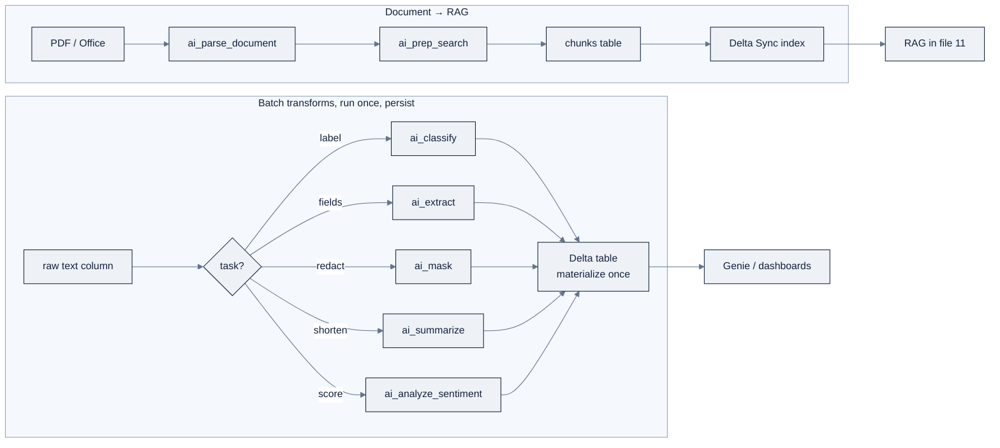

# 12: AI Functions & Genie

> Part of AI Engineering Lab · Developed by Zorost Intelligence AI Lab · [zorost.com](https://zorost.com)

**AI Functions** put an LLM *inside your SQL*, you call a model on table columns as
naturally as `UPPER()` or `LENGTH()`, with no serving endpoint, no API key, and no client
code. **Genie** is the analyst-configured natural-language layer that sits *on top* of your
tables so business users can ask questions in English and get governed SQL back.

> **Week 23 · ML & GenAI.** This is the "do AI in place" file: AI functions for batch
> transforms, Genie for self-service Q&A, and a clear decision rule for when each (vs a served
> endpoint) is the right tool.

---

## 1. What AI Functions are (and are not)

They are built-in SQL/PySpark functions backed by Databricks research models or Foundation
Model API endpoints. They are **batch-inference primitives**, not access control, not an
app, and not a replacement for a serving endpoint when you need low-latency real-time calls.

> **Requirements (Aug 2026):** serverless compute (not Pro/Classic SQL warehouses), Databricks
> Runtime **18.2+**, and a region that supports AI Functions. `ai_parse_document` needs
> DBR 17.3+; `ai_prep_search` needs DBR 18.2+.

**Cost rule: materialize once, query cheap.** Every call is an LLM inference (slow, billed
per token). Run a function *once per row*, persist the result to a Delta table, and never
re-invoke it in a downstream query.

The two big flows this file teaches:



---

## 2. The function catalog

| Function | Task | Input → Output |
|---|---|---|
| `ai_query` | Run any prompt against any serving endpoint | `(endpoint, request)` → parsed response |
| `ai_classify` | Classify text into labels you give | `(content, labels)` → `VARIANT` with `response` array |
| `ai_extract` | Extract structured fields by schema | `(content, schema JSON)` → `VARIANT` with `response` object |
| `ai_gen` | Free-form generation from a prompt | `(prompt)` → `STRING` |
| `ai_summarize` | Concise summary (optional `max_words`) | `(content [, max_words])` → `STRING` |
| `ai_mask` | Mask specified PII entity types | `(content, labels ARRAY)` → `STRING` with `[MASKED]` |
| `ai_translate` | Translate to a target language | `(content, to_lang)` → `STRING` |
| `ai_fix_grammar` | Correct grammar | `(content)` → `STRING` |
| `ai_analyze_sentiment` | Sentiment class | `(content)` → `positive/negative/neutral/mixed` |
| `ai_similarity` | Semantic similarity 0.0 to 1.0 | `(a, b)` → `FLOAT` |
| `ai_parse_document` | Parse PDF/Office/images → layout/text/tables | `(content BINARY)` → `VARIANT` |
| `ai_prep_search` (Beta) | Chunk parsed docs for RAG/AI Search | `(parsed VARIANT)` → `VARIANT` chunks |
| `ai_forecast` | Time-series forecast to a horizon | table-valued; `(observed, horizon, …)` → rows |

Newer Beta additions beyond the core list: **`ai_search`** (ranked retrieval + grounded
answer in one call), **`vector_search`** (query an AI Search index), and **`ai_top_drivers`**
(rank the dimensions driving a metric change).

| Beta function | What it does | Roughly replaces |
|---|---|---|
| `ai_search` | Ranked, deduplicated retrieval + a grounded answer in one SQL call | hand-built retrieve → `ai_query` |
| `vector_search` | Query an AI Search index directly from SQL | the `query_index` SDK call |
| `ai_top_drivers` | Rank which dimensions changed a metric most | manual attribution queries |

> All three are **Beta**, signatures move; confirm against the live docs before building on
> them (§3.10 shows illustrative shapes, not guarantees).

**Prefer a task-specific function over `ai_query`.** Reach for `ai_query` only when no task
function fits, custom/external endpoints, multimodal input, or JSON nesting beyond
`ai_extract`'s limits.

---

## 3. Worked ZoroLogistics SQL

### 3.1 Classify ticket sentiment (and route)

The synthetic `support_tickets` table has `category` and free-text `text`. Sentiment tells
ops *how* a ticket feels, independent of its queue:

```sql
SELECT
  ticket_id,
  ai_analyze_sentiment(text) AS sentiment,
  ai_classify(text, '["billing","damage","tracking","documents","customs"]',
              map('version', '2.0')):response[0]::STRING AS predicted_queue
FROM zrl_.zorologistics.support_tickets
LIMIT 50;
```

`ai_classify` returns a `VARIANT`; read the label with the colon operator
(`:response[0]::STRING`). Compare `predicted_queue` against the true `category` column to
measure routing accuracy, that is the Week-11 triage eval, now running inside the warehouse.

### 3.2 Extract bill-of-lading fields

The toolkit's `bol_samples()` produces raw BoL text with a known schema. Extract it with
`ai_extract`, which enforces the JSON schema you declare:

```sql
SELECT
  bol_id,
  result:response:shipper::STRING          AS shipper,
  result:response:port_of_loading::STRING  AS port_of_loading,
  result:response:gross_weight_kg::INT     AS gross_weight_kg,
  result:response:freight_terms::STRING    AS freight_terms,
  result:error_message::STRING             AS extract_error
FROM (
  SELECT bol_id,
         ai_extract(text,
           '{"shipper":{"type":"string"},"consignee":{"type":"string"},
             "port_of_loading":{"type":"string"},"port_of_discharge":{"type":"string"},
             "gross_weight_kg":{"type":"number"},"freight_terms":{"type":"string"}}',
           map('version', '2.0')) AS result
  FROM zrl_.zorologistics.bol_raw
);
```

Because `ai_extract` returns `{response: {...}, error_message}`, the query routes per-row
errors to a `extract_error` column instead of crashing the batch, the same discipline you
learned in Week 6, now declarative.

### 3.3 Mask PII

`ai_mask` rewrites named entity types to `[MASKED]`, redact before a table is shared or
stored in a less-restricted layer:

```sql
SELECT
  ticket_id,
  ai_mask(text, array('person', 'email', 'phone', 'address')) AS text_safe
FROM zrl_.zorologistics.support_tickets;
```

> **`ai_mask` ≠ a column mask.** `ai_mask` is a *content transform* (rewrites text once).
> A Unity Catalog **column mask** is a *governance policy* enforced at query time for
> unauthorized readers, see [`16-governance-security.md`](16-governance-security.md). Use
> `ai_mask` to scrub a free-text field; use a column mask to control who sees a column.

### 3.4 Chain functions in one pass

Enrich a raw feedback table with four transforms in a single scan:

```sql
CREATE OR REPLACE TABLE zrl_.zorologistics.tickets_enriched AS
SELECT
  ticket_id,
  ai_analyze_sentiment(text) AS sentiment,
  ai_summarize(text, 30)      AS summary,
  ai_classify(text, '["urgent","routine","info"]', map('version','2.0')):response[0]::STRING AS urgency,
  ai_fix_grammar(text)        AS text_clean
FROM zrl_.zorologistics.support_tickets;
```

### 3.5 Document parsing → RAG prep (the pipeline)

For real documents, chain `ai_parse_document` → `ai_prep_search` → a Delta Sync index
(the retrieval target of [`11-vector-search-rag.md`](11-vector-search-rag.md)):

```sql
CREATE OR REPLACE TABLE zrl_.zorologistics.parsed_chunks AS
WITH prepped AS (
  SELECT path AS source_path,
         ai_prep_search(ai_parse_document(content)) AS prep
  FROM read_files('/Volumes/zrl_/zorologistics/policies/', format => 'binaryFile')
)
SELECT
  variant_get(chunk, '$.chunk_id',          'STRING') AS chunk_id,
  variant_get(chunk, '$.chunk_to_retrieve', 'STRING') AS chunk_to_retrieve,
  variant_get(chunk, '$.chunk_to_embed',    'STRING') AS chunk_to_embed,
  source_path
FROM prepped
LATERAL VIEW explode(variant_get(prep, '$.document.contents', 'ARRAY<VARIANT>')) c AS chunk;
```

**Embed `chunk_to_embed`, return `chunk_to_retrieve`**: the first is context-enriched (title,
headers, page) for retrieval quality; the second is what you hand the LLM.

The stage-by-stage view of the same flow (each stage a table, so a failure is isolated):

| Stage | Function | Output | Failure handling |
|---|---|---|---|
| Parse | `ai_parse_document(content BINARY)` | `VARIANT` (pages/elements/`error_status`) | filter `parsed:error_status IS NULL` |
| Chunk | `ai_prep_search(parsed)` | `VARIANT` (`document.contents`) | `explode` only valid arrays |
| Extract fields | `ai_extract(text, schema)` | `VARIANT` (`response`, `error_message`) | route `error_message` to a sidecar column |
| Store | `CREATE OR REPLACE TABLE` | Delta table | enable CDF for incremental index sync |

After `parsed_chunks` exists, enable change-data-feed so a Delta Sync index can pick up new
chunks incrementally:

```sql
ALTER TABLE zrl_.zorologistics.parsed_chunks
  SET TBLPROPERTIES (delta.enableChangeDataFeed = true);
```

### 3.6 The rest, in one enrichment pass

A single scan can apply the remaining task functions at once, and this is the pattern to
reach for before writing an endpoint:

```sql
SELECT
  ticket_id,
  -- generation: a short canned reply (draft only, never auto-send)
  ai_gen(concat('Draft a 2-sentence reply to this support ticket: ', text)) AS draft_reply,
  -- summarization with a token/word cap
  ai_summarize(text, 30)                                                  AS summary,
  -- translation to Spanish for a bilingual queue
  ai_translate(text, 'es')                                                AS text_es,
  -- grammar correction (normalize before storing in the shared queue)
  ai_fix_grammar(text)                                                    AS text_clean
FROM zrl_.zorologistics.support_tickets
LIMIT 25;
```

**Semantic matching / dedup**: `ai_similarity` scores two strings 0.0 to 1.0; self-join and
threshold to find near-duplicate tickets:

```sql
SELECT a.ticket_id AS t1, b.ticket_id AS t2,
       ai_similarity(a.text, b.text) AS score
FROM zrl_.zorologistics.support_tickets a
JOIN zrl_.zorologistics.support_tickets b
  ON a.ticket_id < b.ticket_id
WHERE ai_similarity(a.text, b.text) > 0.85;
```

### 3.7 `ai_query`: the general-purpose escape hatch

Only when no task function fits (custom/external endpoint, multimodal input, or JSON beyond
`ai_extract`'s limits). Parse nested JSON with `from_json`, and route per-row errors with
`failOnError => false` instead of crashing the batch:

```sql
SELECT from_json(
  ai_query(
    'databricks-claude-sonnet-4',
    concat('Extract the invoice as JSON with nested line_items: ', text_blocks),
    responseFormat => '{"type":"json_object"}',
    failOnError => false
  ).response,
  'STRUCT<invoice_number:STRING, total:DOUBLE, line_items:ARRAY<STRUCT<code:STRING, qty:DOUBLE>>>'
) AS invoice
FROM zrl_.zorologistics.parsed_documents;
```

With `failOnError => false`, `ai_query` returns a STRUCT whose `.response` holds the payload
and `.errorMessage` holds a per-row failure, the batch never dies on one bad row.

### 3.8 Forecasting (table-valued)

`ai_forecast` projects a time series to a horizon with confidence bounds:

```sql
SELECT * FROM ai_forecast(
  observed => TABLE(SELECT planned_departure::DATE AS d, COUNT(*) AS n
                    FROM zrl_.zorologistics.silver_shipments GROUP BY 1),
  horizon   => '2026-12-31',
  time_col  => 'd',
  value_col => 'n'
);
-- returns: d, n_forecast, n_upper, n_lower
```

### 3.9 PII masking patterns (when to mask *what*)

`ai_mask` takes a list of entity types to redact. Choose the list to match the risk, not a
maximalist "mask everything" (over-masking destroys the signal a downstream model needs):

| Entity type | Example text | Use when |
|---|---|---|
| `person` | "Jane Doe called about…" | names in free text |
| `email` | "reply to jane@co.com" | contact fields |
| `phone` | "call 555-0100" | contact fields |
| `address` | "deliver to 12 Main St" | addresses in notes |
| `credit_card` / `ssn` | card/PAN numbers | payment/identity fields |

Three patterns:

1. **Scrub before share**: mask a free-text ticket body before copying it to a less-restricted
   sandbox. One pass, materialized.
2. **Mask the field, govern the column**: `ai_mask` the free text *and* attach a UC column
   mask on the raw column; the transform protects the copy, the policy protects the source.
3. **Mask at the edge, not the warehouse**: for streaming data, mask in the ingestion
   transform so PII never lands unmasked in bronze.

### 3.10 Beta functions (illustrative: confirm signatures)

These are Beta and the exact signatures move; treat these as *shapes* and verify against the
live docs before relying on them:

```sql
-- ai_search (Beta): ranked retrieval + grounded answer in one call
SELECT ai_search(
  'zrl_.zorologistics.policy_chunks_index',
  'Is a shipment 3 days late eligible for a refund?'
) AS grounded_answer;

-- vector_search (Beta): query an AI Search index from SQL
SELECT vector_search(
  index_name => 'zrl_.zorologistics.policy_chunks_index',
  query_text => 'lithium battery limits',
  num_results => 5
) AS hits;

-- ai_top_drivers (Beta): rank the dimensions that moved a metric
SELECT * FROM ai_top_drivers(
  TABLE(SELECT carrier_id, region, on_time_pct
        FROM zrl_.zorologistics.gold_on_time_kpis),
  metric => 'on_time_pct'
);
```

The value proposition is the same as the core functions, do the AI work *in the warehouse*,
once, and persist the result, but the API surface is still settling.

### 3.11 `ai_translate` languages & `ai_fix_grammar`

`ai_translate` supports a fixed set of languages (eight as of writing): English (`en`), French
(`fr`), German (`de`), Hindi (`hi`), Italian (`it`), Portuguese (`pt`), Spanish (`es`), and
Thai (`th`). Pass the code or the full name; anything else needs `ai_query` with a multilingual
model:

```sql
-- Supported target languages (codes / names)
SELECT ai_translate(text, 'es') AS text_es,
       ai_translate(text, 'de') AS text_de,
       ai_translate(text, 'fr') AS text_fr
FROM zrl_.zorologistics.support_tickets
LIMIT 10;
```

`ai_fix_grammar` normalizes free text before it enters a shared queue, correct the grammar,
*then* store, so downstream classification sees cleaner input (and don't discard the raw text;
the correction can mangle product codes or SKUs):

```sql
CREATE OR REPLACE TABLE zrl_.zorologistics.tickets_clean AS
SELECT ticket_id,
       text,
       ai_fix_grammar(text) AS text_clean,
       ai_analyze_sentiment(ai_fix_grammar(text)) AS sentiment
FROM zrl_.zorologistics.support_tickets;
```

| Function | Output | Watch out |
|---|---|---|
| `ai_translate(content, lang)` | translated `STRING` | unsupported language → use `ai_query` |
| `ai_fix_grammar(content)` | corrected `STRING` | may rewrite codes/SKUs, keep the raw column too |

### 3.12 `ai_query` multimodal (files =>)

`ai_query` can pass files (images, documents) to multimodal endpoints, the one case no task
function covers. Illustrative shape (Beta surface; confirm the exact argument against live
docs):

```sql
SELECT ai_query(
  'databricks-claude-sonnet-4',
  'Describe any visible damage in the attached photo and estimate the claim risk.',
  files => ARRAY(
    STRUCT(path => '/Volumes/zrl_/zorologistics/claims/photo1.jpg')
  )
) AS damage_analysis;
```

Use this for damage-claim photos, scanned bills of lading, or any image input. Everything else
should route through the task-specific functions, `ai_query` is the escape hatch, not the
default.

---

## 4. Genie: natural-language analytics

The **Genie family** has three members:

| Product | Formerly | Who configures | Who uses |
|---|---|---|---|
| **Genie Agents** | Genie Spaces | Analysts (datasets, SQL examples, instructions) | Business users (chat) |
| **Genie One** | Databricks One | Platform admins (a curated whole-workspace agent) | Non-technical business users (one unified assistant) |
| **Genie Code** | n/a | Developers (IDE/notebook assistant) | Developers |

### 4.1 Genie Agents: setup

1. **Create** a Genie Agent (Genie UI → New).
2. **Add tables**: select `zrl_.zorologistics.gold_on_time_kpis`, `silver_shipments`,
   `carriers`, `lanes`.
3. **Write plain-English instructions**: e.g. *"on-time means `is_on_time = TRUE`; a lane's
   transit days come from `lanes.avg_transit_days`; always filter by `status` unless asked."*
4. **Add example SQL**: a few verified queries that teach the agent your joins and units:
   ```sql
   -- Example: on-time % by carrier, last 90 days
   SELECT c.carrier_name,
          ROUND(100.0 * SUM(CASE WHEN s.is_on_time THEN 1 ELSE 0 END) / COUNT(*), 1) AS on_time_pct
   FROM silver_shipments s
   JOIN carriers c ON s.carrier_id = c.carrier_id
   WHERE s.planned_departure >= current_date() - INTERVAL 90 DAYS
   GROUP BY c.carrier_name
   ORDER BY on_time_pct DESC;
   ```
5. **Review SQL functions**: Genie shows which functions are trusted/blocked; tighten as
   needed.
6. **Publish** to a workspace group.

A strong instructions set is the difference between "returns numbers" and "returns the *right*
numbers." Aim for these five, in this order:

1. **Define the ambiguous terms**: "on-time", "late", "a month": in one place.
2. **Name the canonical units**: hours vs days, % vs ratio, USD.
3. **Give the join path**: "carrier attributes live in `carriers`, joined on `carrier_id`."
4. **State the default scope**: "unless asked, look at the last 90 days and exclude `Booked`."
5. **Forbid a trap**: "never average a percentage; recompute it from the counts."

### 4.2 SQL functions & guardrails

The agent only uses **trusted SQL functions**, a curated list you control. Review it before
publish: allow the read-only functions your questions need (`COUNT`, `AVG`, `date_trunc`,
`PERCENTILE`), and keep the rest blocked. This is Genie's version of least privilege: even if
the model wants to, it cannot run a function you have not allowed.

### 4.3 Verified answers

Before you trust Genie, **verify its answers**: in the Genie UI, open any answer's generated
SQL, confirm it matches the question's intent, and mark it **verified**. Verified answers
teach the agent (they become few-shot examples for future questions) and give reviewers a
standing audit trail. The Week-23 gate is *"Genie answers the 10 canonical ops questions and
their SQL is verified by a human."*

A canonical set for ZoroLogistics:

1. On-time % by carrier, last 90 days.
2. Average delay by lane.
3. Which carriers have >10% late-48h shipments this month?
4. Weather-severity breakdown of delays.
5. Total shipments by month.

The verification loop: ask → read the generated SQL → decide *correct / wrong / right-answer-
wrong-way* → mark verified or add an example SQL that nudges it right. Treat every verified
answer as a durable test: re-ask the same question after you change the instructions and
confirm it still holds.

### 4.4 Genie One vs Genie Agents

**Genie One** is the simplified **business-user UI**: one workspace-wide assistant that
answers across all the tables the user can read, with generated SQL shown for trust, no
analyst configuring datasets required. Use Genie **Agents** when a domain needs *curated*
semantics (custom instructions, a specific table subset, verified examples); use **Genie One**
when you just want "any business user can ask anything they're allowed to read."

### 4.5 Governance

- Genie is a governed **asset**, permissions follow Unity Catalog (`SELECT` on the underlying
  tables is still required).
- Instructions, SQL functions, and verified answers are versioned; restrict *who can edit* the
  agent.
- Genie's SQL runs as the *viewer* against tables they can already read, it cannot exceed the
  caller's grants.
- For traffic governance (rate limits, budgets, guardrails), Genie's LLM calls route through
  the **Unity AI Gateway** like everything else.
- Genie respects the **row filters / column masks** on the underlying tables (see
  [`16-governance-security.md`](16-governance-security.md)), a masked email stays masked in a
  Genie answer.

### 4.6 Genie One setup walkthrough

**Genie One** is the *whole-workspace* assistant, so setup is mostly *enabling + governing*
rather than per-domain configuration:

1. **Enable Genie One** in workspace settings (needs a serverless-capable workspace).
2. **Confirm the catalog/schema scope**: Genie One answers across the tables the user can
   read, so the tables must already be in Unity Catalog with the right grants.
3. **Sanity-check the first answers**: Genie One shows generated SQL for trust; review the
   first few the same way you verify a Genie Agent (§4.3) before you roll it out broadly.
4. **Point recurring KPIs at dashboards**: Genie One answers ad-hoc questions; the recurring
   ones still belong in an AI/BI dashboard or a metric view (see
   [`14-apps-dashboards.md`](14-apps-dashboards.md)).

Genie One vs a Genie Agent is a **scope** decision: whole-workspace (any table the user can
read) vs a *curated* domain subset with custom instructions and verified examples. Use Genie
One for "any business user can ask anything"; use a Genie Agent when a domain needs taught
semantics.

---

## 5. AI functions vs served endpoints vs Genie

| | **AI Function** | **Serving endpoint** | **Genie** |
|---|---|---|---|
| Shape | SQL/PySpark function over rows | REST API, real-time | Chat → SQL → answer |
| Latency | Batch (seconds to minutes for a table) | Millisecond-low second | Interactive (seconds) |
| Caller | SQL warehouse / notebook | Any app/client (OpenAI-compatible) | Business user |
| Best for | One-time bulk enrich: classify, extract, mask, summarize, parse | Low-latency, high-QPS, streaming, custom PyFunc | Self-service Q&A over curated tables |
| Governance | UC + AI Gateway | UC + AI Gateway (rate limits) | UC + verified answers |

**Decision rule:** *batch transform over a column* → AI function. *real-time call from an
app* → serving endpoint. *business user asking questions* → Genie. They compose: AI functions
build the gold tables, Genie answers over them, and a served endpoint serves the ETA model
the ops app calls every few seconds.

**Two anti-patterns to avoid:**

- **AI functions in a view scanned repeatedly**: each read re-invokes the LLM. Materialize
  once (`CREATE OR REPLACE TABLE`) and query the Delta result.
- **Genie for a fixed, recurring KPI**: that is a dashboard's job (see
  [`14-apps-dashboards.md`](14-apps-dashboards.md)); Genie is for *ad-hoc* questions. Reserve
  it for the questions you could not predict.

---

## 6. Common issues

| Symptom | Fix |
|---|---|
| Function returns NULL everywhere | Input column is NULL, filter `WHERE col IS NOT NULL` first |
| `ai_parse_document` not found | Needs DBR 17.3+ |
| `ai_prep_search` not found | Needs DBR 18.2+ (serverless env v3+) |
| `ai_forecast` fails | Needs Pro **or Serverless** SQL warehouse, not Classic |
| `explode()` fails on a VARIANT | Cast first: `variant_get(prep, '$.document.contents', 'ARRAY<VARIANT>')` |
| `ai_classify` returns surprising labels | Fewer, mutually exclusive labels (2 to 5) are more reliable |
| `ai_query` raises on some rows | Pass `failOnError => false` → returns a STRUCT with `.errorMessage` |
| Batch job slow | Use DBR 15.4 ML LTS (optimized batch throughput), not serverless interactive |

---

## 7. Try it

**Task 1: Enrich the ticket table once.**
Run §3.4's `CREATE OR REPLACE TABLE tickets_enriched` over `support_tickets`, then query the
Delta result (not the functions) a second time.
*Acceptance check:* `tickets_enriched` has `sentiment`, `summary`, `urgency`, `text_clean`
columns populated; the second read is a plain `SELECT` with **no** AI function call (prove it
with `DESCRIBE`, the table, not a view, holds the values).

**Task 2: Parse and chunk a policy PDF.**
Drop a policy PDF in `/Volumes/zrl_/zorologistics/policies/`, run §3.5, then index
`parsed_chunks` in AI Search (see [`11-vector-search-rag.md`](11-vector-search-rag.md)).
*Acceptance check:* `parsed_chunks` has non-null `chunk_to_embed` rows; a hybrid query for
"refund 48 hours" returns a chunk whose `chunk_to_retrieve` quotes the Refund & Claims clause.

**Task 3: Verify a Genie answer.**
In a Genie Agent over `gold_on_time_kpis` + `carriers`, ask "which carrier has the worst
on-time % last 90 days?" and open the generated SQL.
*Acceptance check:* the SQL joins `carriers` on `carrier_id`, filters to the last 90 days,
and recomputes the % from counts (not an average of percentages); you marked it verified.

---

## 8. Common mistakes

1. **Re-invoking a function on every read.** An `ai_classify` left in a live view bills
   tokens on every scan. *Fix:* `CREATE OR REPLACE TABLE` once, query the Delta result.
2. **Reading the `VARIANT` wrong.** `ai_classify`/`ai_extract` return a `VARIANT`; you must
   dereference it (`:response[0]::STRING`, `:response:field::STRING`). *Fix:* select the raw
   VARIANT first, inspect the shape, then write the dereference.
3. **Embedding the wrong RAG column.** Embed `chunk_to_embed` (context-enriched), return
   `chunk_to_retrieve`. *Fix:* keep both columns and name them explicitly in the index spec.
4. **Confusing `ai_mask` with a column mask.** One is a one-time text transform, the other a
   query-time governance policy. *Fix:* use `ai_mask` for free text, a UC column mask for
   governed columns (see [`16-governance-security.md`](16-governance-security.md)).
5. **Over-masking.** Masking every entity type destroys the signal a downstream classifier
   needs. *Fix:* mask the entity types that carry actual risk, per the §3.9 table.
6. **Letting Genie guess a KPI.** A recurring metric belongs in a dashboard, not a chat
   prompt. *Fix:* reserve Genie for ad-hoc questions; build the recurring KPI as an AI/BI
   dashboard or metric view.

> **Verify against live docs.** Function signatures, runtime floors, and Beta surface change;
> confirm against `https://docs.databricks.com/llms.txt`.

---

## Sources

- AI functions: https://docs.databricks.com/large-language-models/ai-functions
- SQL function reference: https://docs.databricks.com/sql/language-manual/functions/
- Genie: https://docs.databricks.com/genie/
- Genie Agents: https://docs.databricks.com/genie-agents/
- Genie One: https://docs.databricks.com/genie-one/

> *Original AI Engineering Lab writing; AI-function signatures, runtime floors, and Genie naming
> change frequently, verify against the live links above.*

---

© 2026 Zorost Intelligence LLC · [zorost.com](https://zorost.com)
