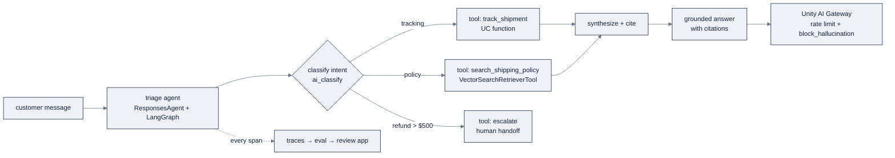

# 13: Agentic AI on Databricks

> Part of AI Engineering Lab · Developed by Zorost Intelligence AI Lab · [zorost.com](https://zorost.com)

An **agent** is a program that uses a language model to choose and execute actions toward a
goal, in a loop, with tools feeding real observations back in. Databricks gives you the whole
agent lifecycle on one governed surface: author it with **Agent Framework**, give it tools
(Unity Catalog functions, AI Search, SQL, MCP), evaluate it with **Agent Evaluation**, and
deploy it as a **serving endpoint**, all through the **Unity AI Gateway**.

> **Weeks 23 to 24 · ML & GenAI.** Builds on [`10-model-serving.md`](10-model-serving.md) (agents
> are custom models), [`11-vector-search-rag.md`](11-vector-search-rag.md) (AI Search tools),
> and the agent concepts in [`reference/knowledge-base/10-agents-multiagent.md`](../../knowledge-base/10-agents-multiagent.md).

---

## 1. The mental model

```
user request ─▶ agent loop (LangGraph / OpenAI Agents SDK / …)
                    │  plan · act · observe · repeat
                    ├─▶ tools: UC functions · AI Search · SQL (MCP) · external MCP
                    └─▶ governed by Unity AI Gateway (rate limits, guardrails)
                                    │
                         trace → eval → deploy (serving endpoint)
```

The Databricks-specific insight: **everything is a governed UC asset.** Your tools are UC
functions, your retrieval is an AI Search index, your model is a serving endpoint, so the
agent inherits Unity Catalog permissions, lineage, and audit for free.

The support-triage agent this file builds, in detail:



---

## 2. Agent Framework (code-first)

**Agent Framework** (part of the retired "Mosaic AI" brand) is the code-first surface: you
write your agent in any framework, then wrap it in MLflow's **`ResponsesAgent`** interface to
get streaming, multi-agent support, tracing, and a deployable artifact.

- **LangGraph-based** by default, the low-level, stateful control flow you learned in
  Week 15 (`nodes`, `edges`, checkpoints, human-in-the-loop interrupts).
- Also supports the **OpenAI Agents SDK** and other frameworks.
- `ResponsesAgent` is the wrapper that makes the agent **serveable**: the same serving
  machinery from [`10-model-serving.md`](10-model-serving.md) then hosts it.

The authoring loop: build in a notebook → log traces automatically → evaluate → register the
agent as a UC model → deploy. Every step keeps the artifact governable.

A minimal `ResponsesAgent` sketch (LangGraph under the hood, wrapped for serving):

```python
import mlflow
from langgraph.graph import StateGraph, MessagesState, START, END

def build_graph():
    g = StateGraph(MessagesState)
    g.add_node("assistant", assistant_node)   # your model + tool-calling logic
    g.add_edge(START, "assistant")
    g.add_edge("assistant", END)
    return g.compile()

graph = build_graph()

# Wrap + log: this is what makes the agent a serveable UC model
with mlflow.start_run():
    mlflow.langchain.log_model(graph, "agent", resources=[], pip_requirements=["langgraph"])
```

`mlflow.langchain.log_model` records the graph; Databricks' `ResponsesAgent` path adds the
serving/streaming/tracing contract on top. The point is the *interface*, not the framework,
you author in LangGraph (or the OpenAI Agents SDK), and the same `ResponsesAgent` wrapper
makes it deployable.

### 2.1 The full build (LangGraph + UC tools + Vector Search)

Here is the real, runnable shape, a `ResponsesAgent` subclass whose graph calls UC functions
and a Vector Search index, then streams OpenAI-compatible output. Three files: `agent.py`
(the agent), `log_model.py` (register to UC with passthrough auth), `deploy_agent.py`
(deploy to a serving endpoint).

```python
# agent.py
import mlflow
from mlflow.pyfunc import ResponsesAgent
from mlflow.types.responses import (
    ResponsesAgentRequest, ResponsesAgentResponse, ResponsesAgentStreamEvent,
    output_to_responses_items_stream, to_chat_completions_input,
)
from databricks_langchain import (
    ChatDatabricks, UCFunctionToolkit, VectorSearchRetrieverTool,
)
from langchain_core.messages import AIMessage
from langchain_core.runnables import RunnableLambda
from langgraph.graph import END, StateGraph
from langgraph.graph.message import add_messages
from langgraph.prebuilt.tool_node import ToolNode
from typing import Annotated, Generator, Sequence, TypedDict

LLM_ENDPOINT = "databricks-claude-sonnet-4" # resolve at runtime, see file 10
VS_INDEX     = "zrl_.zorologistics.policy_chunks_index"
UC_FUNCTIONS = ["zrl_.zorologistics.track_shipment"]
SYSTEM_PROMPT = (
    "You are the ZoroLogistics support-triage assistant. Use track_shipment for "
    "shipment status, the policy retriever for policy questions. Cite policy ids. "
    "Escalate refunds over $500 to a human, never approve them yourself."
)

class State(TypedDict):
    messages: Annotated[Sequence, add_messages]

class SupportTriageAgent(ResponsesAgent):
    def __init__(self):
        self.llm = ChatDatabricks(endpoint=LLM_ENDPOINT, temperature=0.1)
        # UC function tool(s) + Vector Search retriever both come from databricks_langchain
        self.tools = list(UCFunctionToolkit(function_names=UC_FUNCTIONS).tools)
        self.tools.append(
            VectorSearchRetrieverTool(
                index_name=VS_INDEX,
                num_results=5,
                columns=["content", "title", "doc_id"],
                tool_name="search_shipping_policy",
                tool_description="Search ZoroLogistics policy docs. Returns cited chunks.",
            )
        )
        self.llm_with_tools = self.llm.bind_tools(self.tools)

    def _graph(self):
        def call_model(state):
            msgs = [{"role": "system", "content": SYSTEM_PROMPT}] + state["messages"]
            return {"messages": [self.llm_with_tools.invoke(msgs)]}

        def should_continue(state):
            last = state["messages"][-1]
            return "tools" if isinstance(last, AIMessage) and last.tool_calls else "end"

        g = StateGraph(State)
        g.add_node("agent", RunnableLambda(call_model))
        g.add_node("tools", ToolNode(self.tools))
        g.set_entry_point("agent")
        g.add_conditional_edges("agent", should_continue, {"tools": "tools", "end": END})
        g.add_edge("tools", "agent")
        return g.compile()

    def predict_stream(self, req: ResponsesAgentRequest) -> Generator[ResponsesAgentStreamEvent, None, None]:
        msgs = to_chat_completions_input([m.model_dump() for m in req.input])
        for kind, payload in self._graph().stream({"messages": msgs}, stream_mode=["updates"]):
            if kind != "updates":
                continue
            for node in payload.values():
                if node.get("messages"):
                    yield from output_to_responses_items_stream(node["messages"])

    def predict(self, req: ResponsesAgentRequest) -> ResponsesAgentResponse:
        items = [ev.item for ev in self.predict_stream(req)
                 if ev.type == "response.output.item.done"]
        return ResponsesAgentResponse(output=items)

mlflow.langchain.autolog()
mlflow.models.set_model(SupportTriageAgent())
```

> **Output-item gotcha.** The serving layer silently drops raw dicts. Build output items with
> the `ResponsesAgent` helpers, `create_text_output_item`, `create_function_call_item`,
> `create_function_call_output_item`, or rely on `output_to_responses_items_stream` (above)
> which emits them correctly.

Register it to Unity Catalog **with passthrough auth**, this is the non-obvious step that
prevents `PERMISSION_DENIED` at query time:

```python
# log_model.py
import mlflow
from mlflow.models.resources import (
    DatabricksServingEndpoint, DatabricksFunction, DatabricksVectorSearchIndex,
)
from mlflow.tracking import MlflowClient

mlflow.set_registry_uri("databricks-uc")
mlflow.set_experiment("/Users/me@example.com/zrl_agents")

FULL_NAME = "zrl_.zorologistics.support_triage_agent"

# Every thing the agent calls must be declared so the endpoint inherits its auth.
resources = [
    DatabricksServingEndpoint(endpoint_name="databricks-claude-sonnet-4"),
    DatabricksVectorSearchIndex(index_name="zrl_.zorologistics.policy_chunks_index"),
    *[DatabricksFunction(function_name=f) for f in ["zrl_.zorologistics.track_shipment"]],
]

with mlflow.start_run():
    info = mlflow.pyfunc.log_model(
        name="agent",
        python_model="agent.py",          # file path; agent.py ends with set_model()
        resources=resources, # auto-auth, DO NOT skip
        input_example={"input": [{"role": "user", "content": "Shipment S0000042 is late"}]},
        pip_requirements=["mlflow==3.1.0", "databricks-langchain",
                          "langgraph==0.3.4", "databricks-agents", "pydantic>=2"],
        registered_model_name=FULL_NAME,
    )

client = MlflowClient(registry_uri="databricks-uc")
v = max(client.search_model_versions(f"name='{FULL_NAME}'"), key=lambda x: int(x.version)).version
client.set_registered_model_alias(FULL_NAME, "prod", v)
```

| Resource the agent calls | Passthrough declaration |
|---|---|
| Foundation Model API / serving endpoint | `DatabricksServingEndpoint(endpoint_name=…)` |
| UC SQL/Python function | `DatabricksFunction(function_name=…)` |
| Vector Search index | `DatabricksVectorSearchIndex(index_name=…)` |
| Lakebase Postgres | `DatabricksLakebase(database_instance_name=…)` |

Anything the agent calls that is *not* in `resources` will hit auth errors at the endpoint,
and the error rarely names the missing resource.

---

## 3. Agent Bricks (low-code)

**Agent Bricks** are pre-built agent types you configure instead of code:

| Brick | What it does | Use when |
|---|---|---|
| **Knowledge Assistant** | Document Q&A with **citations**, powered by an "Instructed Retriever" over your indexed corpus | "Answer questions from these documents" |
| **Supervisor Agent / Supervisor API** | Multi-agent orchestration with built-in **access controls** and structured handoffs | Coordinating specialist agents under one goal |

A Knowledge Assistant is RAG productized: point it at the AI Search index from
[`11-vector-search-rag.md`](11-vector-search-rag.md), give it instructions, and it returns
answers with source citations, no LangGraph code. A Supervisor Agent orchestrates several
specialists (tracking, refunds, docs) with per-agent permissions and result synthesis, the
Week-16 triage *team*, now as a managed brick.

---

## 4. Tools: UC functions, AI Search, MCP

An agent is only as good as its tools. On Databricks the tools are governed:

| Tool type | What it is | Example (ZoroLogistics) |
|---|---|---|
| **UC function tools** | Registered SQL/Python UDFs with `EXECUTE` grants | `track_shipment(id)` → location/status |
| **AI Search tool** | `VectorSearchRetrieverTool` over an index | Retrieve policy chunks before answering |
| **SQL tools** | Managed MCP server for DBSQL / Genie | Query gold tables in natural language |
| **External MCP servers** | Third-party MCP servers, governed by the gateway | A carrier-rate API |
| **Custom MCP servers** | Your own, deployed on Databricks Apps | Internal pricing service |

Integrating a UC function tool is just registering the function and granting `EXECUTE`:

```sql
CREATE OR REPLACE FUNCTION zrl_.zorologistics.track_shipment(shipment_id STRING)
RETURNS TABLE(location STRING, status STRING, eta_ts TIMESTAMP)
RETURN
  SELECT 'Memphis hub' AS location, status,
         actual_arrival AS eta_ts
  FROM zrl_.zorologistics.silver_shipments
  WHERE shipment_id = track_shipment.shipment_id;

GRANT EXECUTE ON FUNCTION zrl_.zorologistics.track_shipment TO `support_agents`;
```

The agent declares the function as a tool; at runtime the framework calls it with the
caller's identity, so a user who lacks `EXECUTE` cannot make the agent run it. In the full
build (§2.1), `UCFunctionToolkit(function_names=[...])` turns that UC function into a
LangChain tool in one line.

**AI Search as a tool**: wrap an index in `VectorSearchRetrieverTool` so the agent can
retrieve before answering (the retrieval half from
[`11-vector-search-rag.md`](11-vector-search-rag.md)):

```python
from databricks_langchain import VectorSearchRetrieverTool

retriever = VectorSearchRetrieverTool(
    index_name="zrl_.zorologistics.policy_chunks_index",
    num_results=5,
    tool_name="search_shipping_policy",
    tool_description="Search the ZoroLogistics policy documents. Returns cited chunks.",
)
```

**MCP servers** extend the tool set beyond UC: Databricks manages built-in MCP servers (Genie,
AI Search, DBSQL) and governs **external MCP servers** through the Unity AI Gateway, while you
can deploy **custom MCP servers** on Databricks Apps. The mental model from
[`reference/knowledge-base/11-mcp-ecosystem.md`](../../knowledge-base/11-mcp-ecosystem.md) carries over
unchanged, the Databricks addition is that the MCP server is itself a governed asset.

---

## 5. Deploying agents as serving endpoints

An agent is a **custom model** under the hood. The deploy path:

1. Wrap the agent in `ResponsesAgent` and `log_model` it to Unity Catalog.
2. `deploy()` it (or create a serving endpoint pointing at the registered agent model).
3. It is now callable exactly like any endpoint, OpenAI-compatible chat, streaming, and
   behind the gateway.

```python
# deploy_agent.py, submitted as a serverless job because deploy blocks ~15 min
import json
from databricks import agents

dbutils.widgets.text("model_name", "")
dbutils.widgets.text("version", "")
dbutils.widgets.text("endpoint_name", "")

model_name    = dbutils.widgets.get("model_name")
version       = dbutils.widgets.get("version")
endpoint_name = dbutils.widgets.get("endpoint_name") or None

# Always pass endpoint_name explicitly, auto-derived names (agents_<catalog>-<schema>-<model>) are unpredictable.
kwargs = {}
if endpoint_name:
    kwargs["endpoint_name"] = endpoint_name

deployment = agents.deploy(model_name, version, **kwargs)

dbutils.notebook.exit(json.dumps({
    "endpoint_name":  deployment.endpoint_name,
    "query_endpoint": deployment.query_endpoint,
}))
```

Then query it like a chat endpoint:

```python
# after authoring `agent` and logging it with mlflow
from databricks.sdk import WorkspaceClient

w = WorkspaceClient()
# the deployed agent answers like a chat endpoint:
resp = w.serving_endpoints.query(
    name="zrl-support-triage-agent",
    messages=[{"role": "user", "content": "Shipment S0000042 is late, what do I do?"}],
)
print(resp.choices[0].message.content)
```

> **Deployment note.** Model Serving (agent serving via `deploy()`) is one path; **Databricks
> Apps** is now the recommended host for *new* user-facing agent use cases (interactive UI,
> auth, streaming), see [`14-apps-dashboards.md`](14-apps-dashboards.md).

---

## 6. Agent Evaluation

Agent evaluation is harder than single-call evaluation because you are grading a **trajectory**,
not one output. Databricks ships the machinery (MLflow 3 `mlflow.genai.evaluate()`):

- **Traces**: every agent run is automatically logged (each model call, tool call, retrieval
  query, with latency and tokens). The trace is the raw material for error analysis.
- **LLM-as-judge scorers**: built-in scorers include **Guidelines**, **Correctness**,
  **Safety**, and **RetrievalGroundedness**; you can write custom `@scorer` functions.
- **Eval sets**: labelled inputs (a golden set, ideally from real traffic) the agent is
  scored against on a cadence.
- **Review App**: a human-in-the-loop UI to collect feedback and label traces.

| Built-in scorer | What it grades | Use for |
|---|---|---|
| **Guidelines** | Adherence to a rubric / instructions | Every agent (does it follow its own rules?) |
| **Correctness** | Factual correctness vs a reference answer | Q&A over known ground truth |
| **Safety** | Unsafe / harmful / policy-violating output | Any agent that can *act* |
| **RetrievalGroundedness** | Is the answer supported by the retrieved context? | RAG / policy agents |
| **Custom `@scorer` / `make_genai_metric`** | Anything you code | Domain-specific (e.g. queue accuracy) |

A minimal eval run with the built-in groundedness scorer:

```python
import mlflow

evals = [
    {
        "request": {"messages": [
            {"role": "user", "content": "Is a shipment 3 days late eligible for a refund?"}
        ]},
        "expected_retrieval_context": [
            "Shipments arriving more than 48 hours late are eligible for a 10% freight refund.",
        ],
    },
]

mlflow.genai.evaluate(
    model=agent_endpoint,
    data=evals,
    scorers=["databricks/rag-grounding"],   # built-in judge; confirm exact name in live docs
)
```

A **custom judge** for the triage domain (did it route to the right queue?):

```python
from mlflow.metrics import make_genai_metric

queue_accuracy = make_genai_metric(
    name="queue_accuracy",
    definition="The queue the agent assigns matches the golden queue for the ticket.",
    grading_prompt=(
        "Compare the agent's assigned queue to the reference queue. "
        "Return 1 if they match, 0 otherwise, with a one-line justification."
    ),
    examples=[
        {"input": "My pallet arrived crushed", "output": "damage",
         "score": 1, "justification": "Correctly routed to the damage queue."},
    ],
    model="endpoints:/databricks-llama-3-1-70b-instruct",
)

mlflow.genai.evaluate(
    model=agent_endpoint,
    data=ticket_evals,                     # request + expected queue + expected citations
    scorers=[queue_accuracy, "databricks/rag-grounding"],
)
```

The trace tells you **where** a bad answer came from, a wrong retrieval step, a missed tool
call, or the model itself, exactly the debugging discipline from
[`reference/knowledge-base/07-evals-error-analysis.md`](../../knowledge-base/07-evals-error-analysis.md).

A ZoroLogistics trace, one line per span:

```text
trace_id=abc123 input="Shipment S0000042 arrived damaged, can I file a claim?"
  span 1  retrieve(query="damage claim policy")         → POL-002 chunk  (120ms)
  span 2  tool:track_shipment(id="S0000042")            → status=Delivered (40ms)
  span 3  generate(context=[POL-002], question)         → cited answer   (830ms)
  output: "Yes, damage claims must be filed within 7 days of delivery [POL-002]."
  verdict: CORRECT, grounded, cited
```

Reading the trace you can see *whether the right tool was called and the right chunk was
retrieved*, the difference between "wrong answer" and "here is the exact call that broke."

The Week-23 gate reuses the ZoroEval habit from Week 11: a golden set of 30 support
interactions, scored with a calibrated judge, gating on **queue accuracy ≥ 0.9** and
**groundedness ≥ 0.95**. Run `mlflow.genai.evaluate()` against the agent, read the worst
traces, fix the largest failure class, and add it back to the eval set, the same loop as
[`reference/knowledge-base/07-evals-error-analysis.md`](../../knowledge-base/07-evals-error-analysis.md).

### 6.1 The Review App

The **Review App** is the human-feedback surface: it renders agent runs, lets a reviewer
thumbs-up/thumbs-down each answer, and attaches labels (correct queue, grounded, safe) to
individual traces. Those labeled traces become eval-set rows, so the *human* calibration from
Week 11 feeds the *automated* judge. The loop is: **collect real traffic → label in the
Review App → promote the best traces to the eval set → re-run the judge.** That keeps the
judge honest as the agent's behavior drifts.

---

## 7. Unity AI Gateway for agent traffic

Agents route through the **Unity AI Gateway** (see [`10-model-serving.md`](10-model-serving.md))
for the same three controls:

- **Rate limits**: cap calls/min/user on the agent endpoint.
- **Budgets + usage tracking**: cost observability per agent.
- **Service policies (guardrails)**: `block_unsafe_content`, `block_jailbreak`,
  `block_hallucination`, evaluated `ON CALL`/`ON RESULT`, **fail-closed**.

For a support agent that can *act* (escalate, issue refunds), the guardrail is the difference
between "the model said something wrong" and "the model did something irreversible." Refunds
over a threshold still get the human-in-the-loop interrupt you built in Week 15.

```bash
# Cap the triage agent and add a fail-closed hallucination guardrail
databricks serving-endpoints put-ai-gateway zrl-support-triage-agent --json '{
  "rate_limits": [{"calls": 500, "key": "user", "renewal_period": "minute"}]
}' --profile zrl
# then attach block_hallucination as a service policy on the endpoint (see file 10 §5.3)
```

---

## 8. ZoroLogistics: a support triage agent

**Goal.** Route an inbound support message to the right specialist, using UC tools for live
data and AI Search for policy grounding.

```
customer message ─▶ triage agent (classify intent + answer from tools)
                      ├─ tool: track_shipment(id)          [UC function]
                      ├─ tool: search_policy(query)         [AI Search retriever]
                      └─ tool: escalate(reason)             [human handoff]
                                   │
                      Unity AI Gateway (rate limit + block_hallucination)
```

1. **Register tools**: `track_shipment` (UC function above) and
   `VectorSearchRetrieverTool` over `policy_chunks_index`.
2. **Author** the agent in LangGraph, wrapping it in `ResponsesAgent`; declare the tools and
   a system prompt (*"answer from tools; cite policies by id; escalate refunds > $500"*).
   This is exactly the `SupportTriageAgent` class in §2.1.
3. **Log + register** with `resources=[...]` (the LLM endpoint, the VS index, the UC function)
   so the endpoint inherits their auth, see §2.1's `log_model.py`.
4. **Evaluate**: golden set of 30 tickets, judge on queue accuracy + groundedness (§6).
5. **Deploy** as `zrl-support-triage-agent` (`agents.deploy(...)`).
6. **Govern**: gateway rate limit (e.g. 500 calls/min/user) + `block_hallucination` so policy
   answers cannot invent rates.

**Acceptance:** the agent answers 10 unseen scenarios, cites policy documents where it used
them, escalates the refund-over-$500 case, and the eval set reports ≥ 0.9 accuracy / ≥ 0.95
groundedness. Every run leaves a trace you can open to see *which tool call* produced a wrong
answer.

---

## 9. When to use what

| Need | Use |
|---|---|
| Document Q&A, low code | **Knowledge Assistant** (Agent Brick) |
| Orchestrate several specialists | **Supervisor Agent** (Agent Brick) |
| Full control, custom tools, state | **Agent Framework** (LangGraph + `ResponsesAgent`) |
| Interactive user-facing app | **Databricks Apps** hosting the agent |
| Headless API for another system | **Model Serving** endpoint |

## 10. Production monitoring & cost

An agent in production is a *running* system, not a one-shot artifact, apply the standing
discipline from [`reference/knowledge-base/07-evals-error-analysis.md`](../../knowledge-base/07-evals-error-analysis.md):

- **Trace monitoring**: ingest production traces and watch for drift (a model swap, a retrieval
  index rebuild, a tool schema change). A regression shows up as a score move *before* a
  customer complains.
- **Per-span cost**: traces record tokens per step; a runaway retry loop (the "cascading
  retries" failure class) is visible as cost/latency spikes on one tool.
- **Rate limits + budgets**: the Unity AI Gateway caps calls/min and tracks spend per agent,
  so a misbehaving agent is throttled, not billed into the abyss.
- **Eval on a schedule**: re-run the golden set nightly or at release; the gate has authority
  to block a deploy.

The same three numbers close the loop: **accuracy** (did it answer right), **groundedness**
(did it cite), and **cost** (what did a correct answer cost).

---

## 11. Try it

**Task 1: Register the UC function and prove the privilege model.**
Create `track_shipment` (SQL in §4), grant `EXECUTE` to `support_agents` only, and query it as
two identities.
*Acceptance check:* a `support_agents` member gets a row back; a non-member gets
`PERMISSION_DENIED`: the same identity check the agent inherits at runtime.

**Task 2: Log the agent with passthrough auth and validate pre-deploy.**
Run §2.1's `agent.py` + `log_model.py` (with `resources=[...]`), then call
`mlflow.models.predict(model_uri=..., env_manager="uv")` on a "ping".
*Acceptance check:* the pre-deploy predict returns a `ResponsesAgentResponse` without a
`PERMISSION_DENIED`; the model is registered in UC with a `@prod` alias.

**Task 3: Evaluate a trajectory, not just an answer.**
Run `mlflow.genai.evaluate()` with the built-in groundedness scorer plus a custom
`make_genai_metric` for queue accuracy, then open the worst trace.
*Acceptance check:* the eval reports groundedness ≥ 0.95 and queue accuracy ≥ 0.9; for any
miss, the trace pinpoints the failing span (retrieval, tool call, or generation).

---

## 12. Common mistakes

1. **Skipping `resources=[...]` at log time.** The deployed agent has no creds for its LLM,
   UC functions, or VS index, and every query returns `PERMISSION_DENIED`. *Fix:* declare
   `DatabricksServingEndpoint` / `DatabricksFunction` / `DatabricksVectorSearchIndex` for
   everything the agent calls.
2. **Returning raw dicts from `ResponsesAgent`.** The serving layer silently drops them. *Fix:*
   use `create_text_output_item` / `create_function_call_item` / `create_function_call_output_item`,
   or `output_to_responses_items_stream`.
3. **Letting `agents.deploy()` auto-name the endpoint.** The derived name
   (`agents_<catalog>-<schema>-<model>`) is unpredictable. *Fix:* pass `endpoint_name=…`
   explicitly.
4. **Evaluating only the final answer.** A correct answer can hide a wrong tool call (or a
   lucky one). *Fix:* grade the trace, which tool fired, which chunk was retrieved, not just
   the string.
5. **No guardrail on an agent that acts.** A support agent that can escalate or refund needs a
   fail-closed `block_hallucination`/`block_unsafe_content` policy. *Fix:* attach service
   policies via the Unity AI Gateway, and keep the refund-over-$500 human interrupt.
6. **Trusting a one-shot eval.** The agent drifts as models/indexes/prompts change. *Fix:*
   re-run the golden set on a schedule and let the gate block a deploy.

---

## Sources

- Agents overview: https://docs.databricks.com/agents/
- Author an agent: https://docs.databricks.com/agents/custom-agents/author-agent
- MCP tools: https://docs.databricks.com/agents/mcp-tools/
- Knowledge Assistant: https://docs.databricks.com/agents/agent-bricks/knowledge-assistant
- Multi-agent Supervisor: https://docs.databricks.com/agents/agent-bricks/multi-agent-supervisor
- Deploy agents to serving endpoints: https://docs.databricks.com/agents/custom-agents/model-serving/deploy-agent
- GenAI evaluation & monitoring: https://docs.databricks.com/mlflow3/genai/eval-monitor/
- Unity AI Gateway: https://docs.databricks.com/ai-gateway/

> *Original AI Engineering Lab writing; agent framework, Agent Bricks, and eval APIs iterate fast,
> verify against the live links above and `https://docs.databricks.com/llms.txt`.*

---

© 2026 Zorost Intelligence LLC · [zorost.com](https://zorost.com)
