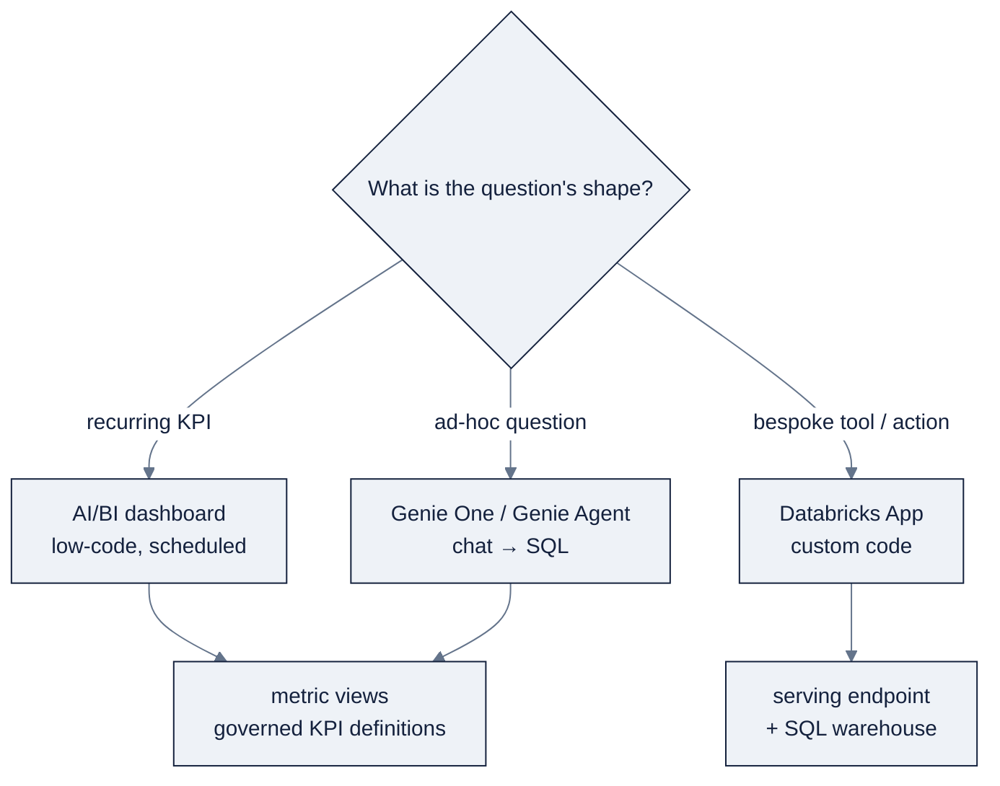

# 14: AI/BI Dashboards & Databricks Apps

> Part of AI Engineering Lab · Developed by Zorost Intelligence AI Lab · [zorost.com](https://zorost.com)

Two ways to put a *surface* on your lakehouse: **AI/BI dashboards** (low-code, AI-assisted
analytics) and **Databricks Apps** (full custom-code web apps). Between them sits **Genie One**
(the no-code business-user assistant). This file is the "how do I show this to a human" layer.

> **Week 24 · Production & Capstone.** You have gold tables and a served model; this file
> turns them into a dashboard, a Genie space, or an app.

---

## 1. AI/BI dashboards (current: formerly Lakeview)

**AI/BI** is Databricks' compound-AI BI product: dashboards + Genie + Unity Catalog
**metric views**. An **AI/BI dashboard** is a low-code, AI-assisted canvas over one or more
**datasets** (SQL queries):

- **Datasets** are the query layer, each is a SQL query saved as a named dataset, reused
  across visuals.
- **AI-assisted authoring**: describe the chart you want; the assistant writes the SQL.
- **Cross-filtering**: selecting a bar filters every other visual.
- **Custom calculations, scheduling, subscriptions, embedding, Git/source-control.**
- Built on **metric views** when you want governed, shared KPI definitions.

The surface decision, at a glance:



### 1.1 Datasets, metric views, and cross-filtering

Three concepts make a dashboard *governed* rather than just pretty:

- **Dataset**: a saved SQL query with a schema; multiple visuals can reference one dataset,
  so a metric change happens in one place.
- **Metric view**: a Unity Catalog securable that names a KPI once (e.g. "on-time %" = that
  exact formula), shared across dashboards and Genie, so two teams cannot silently define the
  same KPI differently.
- **Cross-filtering**: dashboard-level interactivity: click a carrier, and every visual
  re-filters to that carrier without a second query authored by hand.

> **Legacy "DBSQL dashboards" are archived**, you cannot create new ones. Migrate with
> **"Clone a legacy dashboard to an AI/BI dashboard."**

Dashboard files are `.lvdash.json` (Lakeview format) and deploy via DABs as a resource with
`file_path`, `warehouse_id`, and (CLI 0.281.0+) `dataset_catalog`/`dataset_schema` so the
SQL is not hardcoded to one catalog, the pattern in
[`15-dabs-ci-cd.md`](15-dabs-ci-cd.md).

### 1.2 Building an AI/BI dashboard (the workflow)

The order matters: **test the SQL first, then render.** A dashboard is only as good as the
queries behind it.

1. **Know the data**: list warehouses (`databricks warehouses list`), discover schema, and
   probe the aggregations you plan to show. Confirm the story is not flat, empty, or
   uninteresting.
2. **Test every query via CLI before deploying**: a dashboard query that fails at render time
   is a broken dashboard. Use a SQL warehouse to run each dataset's SQL and check the result
   shape.
3. **Plan the layout**: map each visual to a dataset; decide filters and confirm every
   dataset you want filtered *contains* the filter column.
4. **Write the `.lvdash.json`**: datasets + pages, bare table names only (no catalog/schema
   prefix), widget `fieldName`s matching dataset columns exactly.
5. **Deploy + publish** with `databricks lakeview create` … `publish`.

| Step | CLI | Notes |
|---|---|---|
| List warehouses | `databricks warehouses list` | grab the warehouse id |
| Probe data | `databricks experimental aitools tools query --warehouse WH "SELECT …"` | validate the story |
| Create | `databricks lakeview create --display-name "X" --warehouse-id WH --dataset-catalog CAT --dataset-schema SCH --serialized-dashboard "$(cat d.json)"` | returns a dashboard id |
| List / inspect | `databricks lakeview list` / `get ID` | |
| Update | `databricks lakeview update ID --serialized-dashboard "$(cat d.json)"` | update only changes the draft |
| Publish | `databricks lakeview publish ID --warehouse-id WH` | viewers see the published snapshot |
| Trash | `databricks lakeview trash ID` | |

> **`--dataset-catalog` / `--dataset-schema` are flag-only** (not JSON fields) and **required**
>they fill in the catalog/schema that your dashboard queries intentionally omit. Queries
> inside the JSON must use **bare table names** (`FROM gold_on_time_kpis`, never
> `FROM zrl_.zorologistics.gold_on_time_kpis`) or the flags are ignored and the dashboard is
> not portable across environments.

A minimal dashboard JSON (one counter + one bar chart over the gold KPIs):

```json
{
  "datasets": [
    {
      "name": "ds_kpis",
      "displayName": "On-Time KPIs",
      "queryLines": [
        "SELECT carrier_id, month, total_shipments, on_time_shipments, ",
        "       on_time_pct, avg_delay_hours, late_48h_shipments ",
        "FROM gold_on_time_kpis "
      ]
    }
  ],
  "pages": [
    {
      "name": "main",
      "displayName": "Main",
      "pageType": "PAGE_TYPE_CANVAS",
      "layoutVersion": "GRID_V1",
      "layout": [
        {"widget": {"widgetType": "text", "spec": {"text": "# On-Time Performance"}},
         "position": {"x": 0, "y": 0, "width": 12, "height": 1}},
        {"widget": {"widgetType": "counter",
                    "dataset": "ds_kpis",
                    "query": {"fields": [{"name": "sum(total_shipments)", "expression": "SUM(`total_shipments`)"}]},
                    "encodings": {"value": {"fieldName": "sum(total_shipments)", "displayName": "Total Shipments"}}},
         "position": {"x": 0, "y": 1, "width": 4, "height": 3}},
        {"widget": {"widgetType": "bar",
                    "dataset": "ds_kpis",
                    "query": {"fields": [{"name": "carrier_id", "expression": "`carrier_id`"},
                                         {"name": "avg(avg_delay_hours)", "expression": "AVG(`avg_delay_hours`)"}]},
                    "encodings": {"x": {"fieldName": "carrier_id", "displayName": "Carrier"},
                                  "y": {"fieldName": "avg(avg_delay_hours)", "displayName": "Avg Delay (h)"}}},
         "position": {"x": 4, "y": 1, "width": 8, "height": 5}}
      ]
    }
  ]
}
```

The rule that breaks dashboards more than any other: **the field `name` in `query.fields` must
exactly match the `fieldName` in `encodings`** (`"sum(total_shipments)"` both places). A
mismatch renders "no selected fields to visualize."

### 1.3 Dashboard governance & lifecycle

- **Permissions** follow the underlying data, a viewer needs `SELECT` on the source tables;
  the dashboard cannot show what the caller cannot read.
- **Source control**: export the `.lvdash.json` into Git; promote `dev` → `prod` via the
  bundle, not by hand-editing in the UI.
- **Scheduling & subscriptions**: a dashboard can be emailed on a schedule; alerts
  (`system.query.history`-backed) fire when a threshold trips.
- **Embedding**: embed a live dashboard in an external app while keeping Databricks auth.

**ZoroLogistics dashboard:** an "On-Time Performance" dashboard over `gold_on_time_kpis`,
on-time % by carrier, avg delay by lane, and a weather-severity breakdown, cross-filtered.
This is the artifact the capstone ships (see `capstone/`).

---

## 2. Genie One

**Genie One** (formerly **Databricks One**) is the simplified **business-user UI** for asking
questions in plain English. Where **Genie Agents** are analyst-configured per-domain (see
[`12-ai-functions-genie.md`](12-ai-functions-genie.md)), Genie One is the *whole-workspace*
assistant: one unified chat that answers across the tables the user can read, with generated
SQL shown for trust.

**When Genie One:** you want non-technical users asking "what was on-time % by carrier last
month" without an analyst building a dashboard first. It composes with dashboards, the
dashboard answers the *recurring* questions; Genie answers the *ad-hoc* ones.

---

## 3. Databricks Apps

**Databricks Apps** hosts custom web apps on serverless compute, deployed as code. Two
language tracks:

| Track | Stack | Use when |
|---|---|---|
| **AppKit (React/Node)** | `databricks-apps` AppKit, prebuilt data/AI components (charts, tables, Genie/chat) | Data screens + Genie/chat assistants with a polished UI, fast |
| **Python backend** | FastAPI (default), Flask, Dash, **Streamlit**, **Gradio** | Python-only teams, quick internal tools |

**AppKit** is the default for a *new* app: it scaffolds a Node/TypeScript/React project with
first-class components for the common data-app screen genres (KPI cards, tables, charts) and a
built-in Genie/chat widget, plus a `serving` plugin to wire a Model Serving endpoint directly
into the app. Reach for the **Python backend** track only when the team is Python-only or the
app is a quick internal tool (Streamlit is the fastest "show a human something" path).

Both tracks give you: **built-in auth** (app access + single sign-on), **resources** (declare
a SQL warehouse or serving endpoint the app can call), and **deploy via DABs/CLI** with CI/CD.

### 3.1 Auth

Apps authenticate the user automatically and, via the SDK, can act on the user's behalf or as
a service principal. Data access stays governed: the app calls the SQL warehouse / serving
endpoint under the app's declared permissions, so a user without `SELECT` still sees nothing
the warehouse would not return.

The key facts to remember:

- **SSO is built in**: no auth code to write; the app knows who the caller is.
- **Resource permissions are explicit**: an app can only call a serving endpoint or warehouse
  it *declares* as a resource (with `CAN_QUERY`), so a compromised app cannot reach arbitrary
  endpoints.
- **Endpoints stay governed**: the app's calls to a model still pass through the Unity AI
  Gateway rate limits/guardrails from [`10-model-serving.md`](10-model-serving.md).

### 3.2 Resources

An app declares the Databricks resources it needs; DABs wires them:

```yaml
# resources/my_app.app.yml
resources:
  apps:
    on_time_app:
      name: on-time-app-${bundle.target}
      description: 'ZoroLogistics on-time performance app'
      source_code_path: ../src/app
      resources:
        - name: eta_endpoint
          serving_endpoint:
            name: zrl-eta-model
            permission: CAN_QUERY
```

The app's Python backend then calls the endpoint through the SDK without managing a key.

### 3.3 Python backend (Streamlit example)

```python
# src/app/app.py
import streamlit as st
from databricks.sdk import WorkspaceClient

w = WorkspaceClient()

st.title("ZoroLogistics ETA Lookup")
shipment_id = st.text_input("Shipment ID")

if shipment_id:
    resp = w.serving_endpoints.query(
        name="zrl-eta-model",
        dataframe_records=[{"shipment_id": shipment_id}],
    )
    st.metric("Predicted delay (hours)", round(resp.predictions[0], 2))
```

A slightly richer worked app, query the gold KPIs through the SQL warehouse and render a
table, then call the served ETA model on demand:

```python
# src/app/app.py (extended)
import streamlit as st
from databricks.sdk import WorkspaceClient

w = WorkspaceClient()

st.title("ZoroLogistics Ops Console")
st.caption("Gold on-time KPIs + live ETA lookup, all behind Databricks auth.")

@st.cache_data(ttl=300)
def on_time_kpis() -> list:
    resp = w.statement_execution.execute_statement(
        warehouse_id=st.secrets["WAREHOUSE_ID"],
        statement="SELECT carrier_id, month, on_time_pct, avg_delay_hours "
                  "FROM zrl_.zorologistics.gold_on_time_kpis ORDER BY month DESC LIMIT 20",
    )
    return [row.as_dict() for row in resp.result]

tab1, tab2 = st.tabs(["On-time KPIs", "ETA lookup"])
with tab1:
    st.dataframe(on_time_kpis())
with tab2:
    dist = st.number_input("Distance (km)", 120.0, 4200.0, 1800.0)
    weight = st.number_input("Weight (kg)", 5.0, 20000.0, 850.0)
    if st.button("Predict delay"):
        resp = w.serving_endpoints.query(
            name="zrl-eta-model",
            dataframe_records=[{"distance_km": dist, "weight_kg": weight,
                                "carrier_on_time_rate": 0.88, "weather_severity": "moderate"}],
        )
        st.metric("Predicted delay (hours)", round(resp.predictions[0], 2))
```

Note the two access patterns: the **SQL warehouse** for governed reads (KPI table) and the
**serving endpoint** for real-time inference (ETA), both declared as app resources, neither
using a hardcoded key.

### 3.4 Deploying

```bash
databricks bundle validate --strict
databricks bundle deploy -t dev
databricks bundle run on_time_app -t dev     # deploy AND start (bare bundle deploy leaves apps stopped)
databricks apps logs on-time-app              # debug
```

Environment variables live in `app.yaml` inside the app source directory, **not** in
`databricks.yml` (a common gotcha).

### 3.5 The apps dev loop

```bash
databricks apps init --name on_time_app --features serving \
  --set "serving.serving-endpoint.name=zrl-eta-model" --run none   # AppKit scaffold
# …edit source…
databricks apps deploy on_time_app    # deploy + start
databricks apps logs on_time_app      # read stdout/stderr
```

AppKit's `serving` plugin wires the ETA endpoint in one flag; a Python app reaches the same
endpoint through `databricks-sdk`. Either way, the endpoint remains a governed resource the
app *declares*, never a hardcoded key.

### 3.6 AppKit vs Python backend (the 30-second rule)

- **AppKit (React/Node)**: you want a polished data screen with KPI cards, charts, and a
  Genie/chat widget, and the team is comfortable in TypeScript/React.
- **Python backend (Streamlit/FastAPI/Flask/Dash/Gradio)**: you want a quick internal tool
  and the team is Python-only; Streamlit is the fastest "show a human something" path.

Both deploy through the same DABs `apps` resource and get the same SSO + resource governance.
The choice is a team/language and UI-polish decision, not a platform-capability one, an app
that calls a serving endpoint and a SQL warehouse can be built either way.

---

## 4. Dashboard vs app vs Genie

| | **AI/BI dashboard** | **Databricks App** | **Genie One** |
|---|---|---|---|
| Code required | No (SQL + AI assist) | Yes (React/Python) | No |
| Custom interactivity | Cross-filter, params | Anything you can code | Natural language only |
| Audience | Analysts, ops | Operators needing a custom tool | Business users |
| Best for | Recurring KPIs, scheduled views | A product-like tool (ETA lookup, triage console) | Ad-hoc questions |
| Deploy | DABs (`.lvdash.json`) | DABs (`apps` resource) | Workspace config |

**Rule of thumb:** recurring metric → dashboard; a bespoke workflow or custom UX → app; a
non-technical person with a question → Genie One. They coexist in one bundle, the capstone
ships the on-time dashboard *and* an ETA app *and* a Genie space, all from one `databricks.yml`.

**A worked decision (ZoroLogistics ops):**

| Ops need | Surface | Why |
|---|---|---|
| "How did we do on-time last month?" | AI/BI dashboard | Recurring KPI, scheduled, cross-filterable |
| "What's the ETA for this specific shipment right now?" | Databricks App (ETA lookup) | Bespoke real-time tool calling the served model |
| "Which carriers keep breaching their lane SLA?" | Genie One | Unpredictable, ad-hoc question over gold tables |
| "Show me the refund policy for a 3-day-late shipment." | RAG endpoint / App chat | Retrieval + generation, not a chart |

The instinct to cultivate: **match the surface to the shape of the question**, a chart for a
recurring number, a tool for a repeatable action, a chat for an unpredictable question.

---

## 5. Try it

**Task 1: Deploy a two-widget dashboard.**
Write the §1.2 JSON, then `databricks lakeview create … --dataset-catalog zrl_ --dataset-schema
zorologistics`, and `publish`.
*Acceptance check:* `databricks lakeview list` shows the dashboard; the published URL renders
the counter and the bar chart without a "no selected fields" error.

**Task 2: Prove cross-filtering shares one dataset.**
Click a carrier bar in the bar chart.
*Acceptance check:* the counter (same `ds_kpis` dataset) re-filters to that carrier, because
both widgets read one dataset, not because you wrote a second query.

**Task 3: Declare the ETA endpoint as an app resource.**
Add the §3.2 `resources.apps.on_time_app` block with `serving_endpoint: zrl-eta-model,
permission: CAN_QUERY`, deploy, and call it from the app backend.
*Acceptance check:* the app returns a prediction with **no** API key in the code; removing the
resource declaration makes the call fail (the endpoint is not reachable undeclared).

---

## 6. Common mistakes

1. **Hardcoding catalog/schema in a dashboard query.** `FROM zrl_.zorologistics.gold_on_time_kpis`
   breaks portability; the `--dataset-catalog`/`--dataset-schema` flags only fill in what you
   omit. *Fix:* use bare table names in `queryLines`.
2. **Mismatching field names.** The `name` in `query.fields` must equal `fieldName` in
   `encodings` (both `"sum(total_shipments)"`). *Fix:* keep them byte-identical.
3. **`update` without `publish`.** `lakeview update` only changes the draft; viewers keep the
   old snapshot. *Fix:* always `publish` after `update`.
4. **Re-`create`-ing to update.** That mints a new dashboard id + URL and breaks shared links.
   *Fix:* `update` + `publish` on the same id.
5. **Putting env vars in `databricks.yml`.** App environment variables belong in `app.yaml`
   inside the app source. *Fix:* keep app config in the app directory.
6. **Skipping SQL testing before deploying a dashboard.** A query that fails at render time is
   a broken dashboard. *Fix:* run every dataset's SQL via CLI first and gate on the result.

---

## Sources

- AI/BI: https://docs.databricks.com/ai-bi/
- AI/BI dashboards: https://docs.databricks.com/dashboards/
- Legacy dashboards: https://docs.databricks.com/sql/user/dashboards/
- Genie One: https://docs.databricks.com/genie-one/
- Databricks Apps: https://docs.databricks.com/dev-tools/databricks-apps/

> *Original AI Engineering Lab writing; dashboard JSON structure, AppKit, and app deployment
> details change frequently, verify against the live links above.*

---

© 2026 Zorost Intelligence LLC · [zorost.com](https://zorost.com)
