# 15: Declarative Automation Bundles (DABs) & CI/CD

> Part of AI Engineering Lab · Developed by Zorost Intelligence AI Lab · [zorost.com](https://zorost.com)

**Declarative Automation Bundles** (DABs; formerly **Databricks Asset Bundles**) are
infrastructure-as-code for data + AI projects. You declare your source files and your
resources (jobs, pipelines, dashboards, apps, models, experiments, schemas) in
`databricks.yml`, and deploy the whole thing as one unit, then promote it through
`dev` → `prod` with Git and CI/CD.

> **Week 24 · Production & Capstone.** This file is what turns Weeks 21 to 23's ad-hoc artifacts
> into a reproducible, promotable project, the capstone's packaging layer.

---

## 1. Why bundles

Three ways to source-control Databricks work, from lightest to fullest:

| Option | What it manages | Good for |
|---|---|---|
| **Git-with-jobs** | Point a job at a Git repo's notebook | Quick notebooks in jobs |
| **Git folders** (formerly **Repos**) | Notebooks in a Git-backed folder | Notebook development |
| **Declarative Automation Bundles** | Source **+ resource definitions + tests**, deployed as a unit | **Production (recommended)** |

Bundles win because the *job definition itself* is versioned with the code, a pipeline
change and the job that runs it ship in the same commit.

The promotion arc this file builds:

```mermaid
%%{init:{"theme":"base","fontFamily":"Helvetica Neue,Helvetica,Arial,sans-serif","flowchart":{"curve":"basis","padding":14,"nodeSpacing":45,"rankSpacing":55},"themeVariables":{"fontSize":"15px","background":"#FFFFFF","primaryColor":"#EEF2F7","primaryTextColor":"#14213D","primaryBorderColor":"#14213D","secondaryColor":"#FFF1E3","secondaryTextColor":"#14213D","tertiaryColor":"#E7F4F1","tertiaryTextColor":"#14213D","lineColor":"#64748B","textColor":"#14213D","edgeLabelBackground":"#FFFFFF","clusterBkg":"#F5F8FC","clusterBorder":"#94A3B8","nodeBorder":"#14213D","mainBkg":"#EEF2F7","titleColor":"#14213D"}}}%%
flowchart LR
    GIT[Git push / tag] --> CI[CI runner\nGitHub Actions]
    CI --> VAL[validate --strict]
    VAL --> DEP[deploy -t dev]
    DEP --> RUN[run etl_job -t dev]
    RUN --> TEST[verify tables / gates]
    TEST --> TAG[tag release\nimmutable tree]
    TAG --> PROD["deploy -t prod\nmode: production"]
    PROD --> MON[monitor\nsystem tables]
```



---

## 2. `databricks.yml` anatomy

A bundle project:

```
project/
├── databricks.yml           # name, variables, targets, resources (or include:)
├── resources/               # one YAML per resource (convention <name>.<type>.yml)
│   ├── etl_job.job.yml
│   ├── medallion.pipeline.yml
│   └── ontime.dashboard.yml
└── src/                     # code + dashboard JSON
    ├── pipeline.sql
    └── dashboards/ontime.lvdash.json
```

### 2.1 The main config (fully commented)

```yaml
# databricks.yml, the bundle's single entry point.
# bundle.name + variables + targets + resources (or include:).

bundle:
  name: zorologistics            # unique project name; used in ${bundle.name}

# Pull resource definitions in from resources/*.yml (keeps one file small).
include:
  - resources/*.yml

# Variables are the "configuration knobs", parameterize per target.
variables:
  catalog:
    default: 'zrl_'             # default when a target doesn't override
  schema:
    default: 'zorologistics'
  warehouse_id:
    # lookup = resolve by name at deploy time, not a hardcoded id
    lookup:
      warehouse: 'Shared SQL Warehouse'

# Targets are environments. Promotion = `bundle deploy -t <target>`.
targets:
  dev:
    default: true               # the target used when you omit -t
    mode: development           # allows experimentation / overwrites
    workspace:
      profile: zrl-dev          # which CLI auth profile (from ~/.databrickscfg)
    variables:                  # per-environment overrides
      catalog: 'zrl_dev'
      schema: 'zorologistics'

  prod:
    mode: production            # locks the workspace against accidental overwrites
    workspace:
      profile: zrl-prod
    variables:
      catalog: 'zrl_'
      schema: 'zorologistics'
```

### 2.2 Resources

**`resources:`** keys are the resource *type*; under each, a keyed definition. Jobs:

```yaml
# resources/etl_job.job.yml
resources:
  jobs:
    etl_job:
      name: 'ZoroLogistics Medallion ETL'
      tasks:
        - task_key: 'run_pipeline'
          pipeline_task:
            pipeline_id: ${resources.pipelines.medallion.id}
      schedule:
        quartz_cron_expression: '0 30 2 * * ?'
        timezone_id: 'America/Chicago'
```

Pipelines (Lakeflow/SDP):

```yaml
# resources/medallion.pipeline.yml
resources:
  pipelines:
    medallion:
      name: 'ZoroLogistics Medallion'
      catalog: ${var.catalog}
      target: ${var.schema}
      libraries:
        - glob:
            include: ../src/pipeline.sql
      root_path: ../src
      serverless: true
      photon: true
      continuous: false
      development: true
      channel: current
      permissions:
        - level: CAN_VIEW
          group_name: 'users'
```

Dashboards (AI/BI):

```yaml
# resources/ontime.dashboard.yml
resources:
  dashboards:
    ontime_dashboard:
      display_name: 'On-Time Performance'
      file_path: ../src/dashboards/ontime.lvdash.json
      warehouse_id: ${var.warehouse_id}
      dataset_catalog: ${var.catalog}
      dataset_schema: ${var.schema}
```

Registered models, experiments, schemas, volumes, and apps are all first-class `resources:`
types too (`registered_models`, `experiments`, `schemas`, `volumes`, `apps`).

| Resource type | `resources:` key | What it deploys |
|---|---|---|
| Job | `jobs` | Scheduled/task DAGs |
| Pipeline | `pipelines` | Lakeflow (SDP) pipelines |
| Dashboard | `dashboards` | AI/BI `.lvdash.json` |
| App | `apps` | Databricks Apps |
| Model | `registered_models` | Models in UC |
| Experiment | `experiments` | MLflow experiments |
| Schema / Volume | `schemas` / `volumes` | UC securables |

> **Path resolution matters:** resource files live one level deep, so their paths are
> `../src/...`; paths in `databricks.yml` itself are `./src/...`.

### 2.3 Variables & substitutions

```yaml
${var.catalog}                          # a variable you declared
${bundle.name}                          # bundle.name
${bundle.target}                        # dev / staging / prod
${workspace.current_user.userName}      # who is deploying
${resources.jobs.etl_job.id}            # another resource's deployed id
```

Variables parameterize catalog/schema/warehouse per target, the difference between
"works on my workspace" and "promotes cleanly to prod."

### 2.4 Resource permissions

Declare who can view/manage each deployed resource, right in the bundle, permissions deploy
with the resource, so a fresh workspace gets the same access without a manual grant pass:

```yaml
# resources/medallion.pipeline.yml (excerpt)
permissions:
  - level: CAN_VIEW
    group_name: 'users'
  - level: CAN_MANAGE
    group_name: 'data_engineers'
```

| Resource | Common permission levels |
|---|---|
| Job / Pipeline | `CAN_VIEW`, `CAN_MANAGE_RUN`, `CAN_MANAGE`, `IS_OWNER` |
| Dashboard | viewer / editor levels |
| Serving endpoint | `CAN_QUERY`, `CAN_MANAGE` |
| App | access + SSO group scoping |

Declarative permissions are the difference between "the pipeline exists" and "the pipeline is
governed", and they travel with the bundle through every environment.

### 2.5 A parameterized job (job-level parameters)

```yaml
# resources/refresh_job.job.yml
resources:
  jobs:
    refresh_job:
      name: 'ZoroLogistics Model Refresh'
      parameters:
        - name: model_version
          default: '1'
      tasks:
        - task_key: retrain
          notebook_task:
            notebook_path: ../src/train_eta.py
        - task_key: repoint_alias
          depends_on: [{task_key: retrain}]
          sql_task:
            warehouse_id: ${var.warehouse_id}
            query:
              query: 'ALTER MODEL zrl_.zorologistics.eta_model SET ALIAS prod AS VERSION {{job.parameters.model_version}}'
```

Job parameters flow into tasks as `{{job.parameters.<name>}}`; notebooks read them with
`dbutils.widgets.get()`. Use parameters instead of hardcoding version numbers, so a re-run can
promote a different model version without editing the notebook, the same "no hardcode" rule as
the variables in §2.3.

---

## 3. The bundle lifecycle

```bash
databricks bundle init                          # scaffold (templates: default-python/sql, lakeflow-pipelines, …)
databricks bundle validate --strict -t dev      # validate config (--strict = warnings are errors)
databricks bundle deploy -t dev                 # deploy resources to the target workspace
databricks bundle run etl_job -t dev            # run a resource
databricks bundle summary                       # what's deployed where
databricks bundle destroy -t dev                # remove everything the bundle deployed (destructive)
```

- `bundle deploy` is idempotent, re-running updates the resources.
- **Always `validate --strict`** after a config change.
- **Code changes only take effect after `deploy`**: then `run`.
- `bundle destroy` removes deployed resources; confirm the target first.

You can also **generate** config from an existing workspace resource instead of hand-writing:

```bash
databricks bundle generate job <job-id>
databricks bundle generate pipeline <pipeline-id>
databricks bundle generate dashboard <dashboard-id>
```

### 3.1 Debugging a failed deploy

`bundle deploy` failing is rarely a mystery, the CLI tells you where to look:

```bash
databricks bundle validate --strict --debug          # full config parse + schema errors
databricks bundle summary                              # what's deployed where
databricks bundle deploy -t dev --auto-approve --debug # verbose deploy
```

The three most common deploy failures, and where the error points:

| Failure | The error says | Fix |
|---|---|---|
| Bad path | `no such file: ../src/...` | resource files use `../src`; `databricks.yml` uses `./src` |
| Schema error | `field X is not expected` | run `databricks bundle schema` and match the field name |
| Missing auth | `cannot configure default credentials` | pass `--profile`, or fix `~/.databrickscfg` |

`validate --strict` catches most of these *before* the deploy attempt, that is why it is the
first step in every CI job. When a deploy still fails, `--debug` prints the full request, which
is usually enough to see the offending field or path.

### 3.2 `bundle init` templates

`databricks bundle init` scaffolds from a template, the fastest way to a correct skeleton:

| Template | Gives you |
|---|---|
| `default-python` / `default-sql` | a job + code, the minimal CI-ready bundle |
| `lakeflow-pipelines` | a medallion pipeline starter |
| custom (company template) | your org's naming, targets, and policies |

Templates enforce the convention (folder layout, `resources/` split, variables) so a new
project starts correct instead of starting from a blank file, use one, then edit.

---

## 4. Workspace files vs Git folders (formerly Repos)

| | **Workspace files** | **Git folders** | **Bundles** |
|---|---|---|---|
| What it is | Arbitrary files in the workspace | Git-backed notebook folders | Git repo + `databricks.yml` |
| Sync | Manual upload | Git pull | `bundle deploy` |
| Resource defs | Not versioned with code | Partial | Fully versioned |
| Use | Ad-hoc scripts | Notebook dev | **Production** |

Bundles don't replace Git, they *consume* it. Your `databricks.yml`, `resources/`, and
`src/` live in the repo; CI validates and deploys from there.

### 4.1 Git folders workflow (notebook dev)

For interactive notebook development before you have a bundle, **Git folders** (the built-in
Git client, formerly "Repos") give you a Git-backed folder in the workspace:

1. In the UI, **Git folders → Add** and point it at your GitHub/GitLab/Bitbucket/Azure DevOps
   repo.
2. Work in the notebook; **commit + push** from the Git folder UI (or `databricks repos
   update`).
3. **Pull** on the workspace to get the latest branch.

Git folders are the *middle* rung: notebooks are versioned, but the **job/pipeline
definitions are not**, that is exactly what a bundle adds. The canonical path is to start in
a Git folder, then wrap the same repo in `databricks.yml` when it graduates to production.

---

## 5. Auth for CI: OAuth M2M service principals

CI must authenticate **without an interactive user**. The options, in order of preference:

| Method | What it is | Use |
|---|---|---|
| **OAuth U2M** | Interactive user login (browser) | Local development |
| **OAuth M2M** | Service principal with client ID + secret | **CI/CD, automation** |
| **OIDC / token federation** | Exchange a CI platform's identity token for Databricks OAuth, **no stored secret** | GitHub Actions / Azure DevOps (best) |
| **PAT** (legacy) | Personal access token | Legacy; prefer OAuth M2M |

Set up M2M: create a **service principal** in the account console, give it a **client secret**,
grant it workspace access + permissions on the resources it deploys, then reference it in the
bundle target's `workspace.profile`. The CLI profile in `~/.databrickscfg`:

```ini
[zrl-ci]
host       = https://<workspace-host>
client_id  = <service-principal-client-id>
client_secret = <service-principal-client-secret>
auth_type  = oauth-m2m
```

### 5.1 Secrets handling (two kinds, do not mix)

There are two distinct "secrets" concerns and they live in different places:

| Concern | What it protects | Where it lives | Example |
|---|---|---|---|
| **CI auth** | The identity that deploys | CI platform secret / OIDC federation | GitHub `DATABRICKS_CLIENT_ID` + secret |
| **Runtime credentials** | Keys the *jobs/pipelines* need at run time | Databricks secret scope | `{{secrets/zrl-ai/openai-key}}` |

Runtime secrets: create a scope, put the secret, reference it by path, never in code:

```bash
databricks secrets create-scope zrl-ai --profile zrl
databricks secrets put-secret zrl-ai openai-key --string "$OPENAI_API_KEY" --profile zrl
```

```python
# then reference without ever materializing the value in code
secret = dbutils.secrets.get(scope="zrl-ai", key="openai-key")
```

**The one rule:** `.databrickscfg`, client secrets, and API keys never enter Git. Auth secrets
become OIDC federation (no stored secret) or CI secrets; runtime secrets become Databricks
secret scopes referenced by `{{secrets/…}}` paths.

---

## 6. GitHub Actions workflow

The reference CI flow: **Version (Git) → Build → Deploy → Test → Run → Monitor.** With OIDC
federation you never store a secret in GitHub:

```yaml
# .github/workflows/deploy.yml
name: deploy-bundle
on:
  push:
    branches: [main]
  pull_request:
    branches: [main]

permissions:
  id-token: write          # required for OIDC federation
  contents: read

jobs:
  deploy-dev:
    runs-on: ubuntu-latest
    steps:
      - uses: actions/checkout@v4

      - uses: databricks/setup-cli@main

      # OIDC: exchange the GitHub token for Databricks OAuth (no stored secrets)
      - name: Configure Databricks auth
        run: |
          echo "DATABRICKS_HOST=${{ vars.DATABRICKS_HOST }}" >> $GITHUB_ENV
          echo "DATABRICKS_AUTH_TYPE=github-oidc-azure" >> $GITHUB_ENV  # or github-oidc-aws
          echo "DATABRICKS_CLIENT_ID=${{ vars.DATABRICKS_CLIENT_ID }}" >> $GITHUB_ENV

      - name: Validate bundle
        run: databricks bundle validate --strict -t dev

      - name: Deploy dev
        run: databricks bundle deploy -t dev --auto-approve

      - name: Run pipeline
        run: databricks bundle run etl_job -t dev

      - name: Smoke-test tables
        run: |
          databricks bundle summary --output json | jq .

  # Promotion job: only on a release tag, with an environment protection gate.
  deploy-prod:
    if: startsWith(github.ref, 'refs/tags/v')
    runs-on: ubuntu-latest
    environment: production           # requires approval in GitHub repo settings
    permissions:
      id-token: write
      contents: read
    steps:
      - uses: actions/checkout@v4
      - uses: databricks/setup-cli@main
      - name: Configure Databricks auth (prod)
        run: |
          echo "DATABRICKS_HOST=${{ vars.DATABRICKS_PROD_HOST }}" >> $GITHUB_ENV
          echo "DATABRICKS_AUTH_TYPE=github-oidc-azure" >> $GITHUB_ENV
          echo "DATABRICKS_CLIENT_ID=${{ vars.DATABRICKS_PROD_CLIENT_ID }}" >> $GITHUB_ENV
      - name: Validate prod
        run: databricks bundle validate --strict -t prod
      - name: Deploy prod
        run: databricks bundle deploy -t prod --auto-approve
```

**The M2M fallback** (when OIDC isn't available): store the service principal's client secret
as a GitHub **secret** (not a variable) and swap the auth step:

```yaml
      - name: Configure Databricks auth (M2M)
        run: |
          echo "DATABRICKS_HOST=${{ vars.DATABRICKS_HOST }}" >> $GITHUB_ENV
          echo "DATABRICKS_CLIENT_ID=${{ vars.DATABRICKS_CLIENT_ID }}" >> $GITHUB_ENV
          echo "DATABRICKS_CLIENT_SECRET=${{ secrets.DATABRICKS_CLIENT_SECRET }}" >> $GITHUB_ENV
```

> **OIDC provider details** (the exact `auth_type` string and token audience) vary by cloud and
> provider, confirm against
> [oauth-federation-provider](https://docs.databricks.com/dev-tools/auth/oauth-federation-provider/)
> rather than memorizing.

---

## 7. Versioning & promotion patterns

- **Targets are your environments**: `dev` (mode `development`, ephemeral catalogs) →
  `staging` → `prod` (mode `production`, locked-down catalogs). Promotion = `bundle deploy -t prod`.
- **`mode: production`** locks the workspace against accidental overwrites.
- **Tag releases** in Git; the bundle deploys whatever the tag's tree contains, an immutable
  promotion record.
- **Parametrize with variables**, not hardcoded names, so the same bundle targets different
  catalogs per environment.
- Keep secrets out of the repo: use M2M/OIDC for auth and `secrets` for runtime credentials.

**The golden path, one command per stage:**

```bash
# clone → validate → deploy → run, then promote
git clone <repo> && cd <repo>/capstone
databricks bundle validate --strict -t dev     # G1: config is sound
databricks bundle deploy -t dev --auto-approve # create/update resources
databricks bundle run etl_job -t dev           # run the pipeline
# …test in dev, tag the release…
databricks bundle deploy -t prod               # promote (mode: production)
```

The whole arc, *version, build, deploy, test, run, monitor*, is four CLI commands plus Git.
That is the payoff of bundles: the "ship it as code" muscle from Week 13 now applies to your
entire Databricks stack, not just your application code.

### 7.1 A staging target + the promotion matrix

Add a `staging` target between `dev` and `prod` when you want a gate that mirrors prod without
being prod:

```yaml
targets:
  staging:
    mode: production
    workspace:
      profile: zrl-staging
    variables:
      catalog: 'zrl_staging'
      schema: 'zorologistics'
```

| Environment | Mode | Catalog | Promotion gate |
|---|---|---|---|
| `dev` | development | `zrl_dev` | none (every push) |
| `staging` | production | `zrl_staging` | main branch + automated tests pass |
| `prod` | production | `zrl_` | release tag + manual approval |

Promotion is *one command per environment*, `bundle deploy -t staging`, then `-t prod`, and
the variables do the environment switching, so the bundle source never changes between
environments.

### 7.2 Rolling back a bad promotion

Because the bundle is Git-backed, a rollback is a redeploy of the previous tag:

```bash
git checkout v1.2.0                        # the last good tag
databricks bundle deploy -t prod --auto-approve
```

There is no "undo" in the workspace, the *previous tree* is the rollback. That is why tags
matter: an untagged "last good state" is not reproducible. Keep the tag discipline and rollback
becomes one `checkout` + one `deploy`.

---

## 8. ZoroLogistics: bundle the pipeline + job + dashboard

The capstone bundle (`capstone/databricks.yml`) declares:

1. **`pipelines.medallion`**: the bronze→silver→gold Lakeflow pipeline, source in
   `src/pipeline.sql`, `catalog: zrl_`, `schema: zorologistics`.
2. **`jobs.etl_job`**: a scheduled job that runs the pipeline (and, later, model refresh).
3. **`dashboards.ontime_dashboard`**: the on-time AI/BI dashboard.

**Acceptance:** from a clean clone, `bundle validate --strict` passes, `bundle deploy -t dev`
creates all three resources, `bundle run etl_job` runs the pipeline, and the dashboard renders
on the deployed tables. That is the Week-24 "ship it as code" gate, the same shape the
capstone `README-run.md` walks through step by step.

---

## 9. Try it

**Task 1: Promote a variable, not a hardcode.**
Add a `warehouse_id` variable with a `lookup`, reference it in the dashboard resource, and
validate.
*Acceptance check:* `databricks bundle validate --strict -t dev` exits 0; swapping the
variable's value in a target does not require touching the dashboard file.

**Task 2: Prove `mode: production` locks the target.**
Set `prod.mode: production`, then attempt a deploy that would overwrite a resource.
*Acceptance check:* the deploy is refused (or demands an explicit confirmation), the
production workspace is protected from accidental overwrite.

**Task 3: Wire the promotion job.**
Add the `deploy-prod` GitHub Actions job with `if: startsWith(github.ref, 'refs/tags/v')` and
an `environment: production` gate.
*Acceptance check:* a push to `main` deploys only `dev`; a `v*` tag (after approval) deploys
`prod`: no secret is stored for OIDC.

---

## 10. Common mistakes

1. **Hardcoding catalog/schema in resource files.** Promotion then breaks. *Fix:* use
   `${var.catalog}` / `${var.schema}` and override per target.
2. **Wrong path prefixes.** Resource files one level deep use `../src/...`; `databricks.yml`
   itself uses `./src/...`. *Fix:* keep the two path rules straight.
3. **Storing client secrets in the repo.** `.databrickscfg` and M2M secrets must never enter
   Git. *Fix:* OIDC federation (no secret) or CI secrets; runtime keys in Databricks scopes.
4. **Skipping `validate --strict`.** A config error ships to prod. *Fix:* validate after every
   change; treat `--strict` (warnings are errors) as the only mode.
5. **Deploying without `--auto-approve` in CI.** The pipeline blocks on a prompt. *Fix:* add
   `--auto-approve` to non-interactive deploys.
6. **Forgetting code changes need a `deploy`.** Editing `src/` without re-deploying leaves the
   workspace on the old code. *Fix:* `deploy` (then `run`) after any source change.

---

## Sources

- Declarative Automation Bundles: https://docs.databricks.com/dev-tools/bundles/
- Databricks CLI: https://docs.databricks.com/dev-tools/cli/
- Python SDK: https://docs.databricks.com/dev-tools/sdk-python
- Authentication (U2M/M2M): https://docs.databricks.com/dev-tools/auth/
- CI/CD: https://docs.databricks.com/dev-tools/ci-cd/
- OIDC / token federation: https://docs.databricks.com/dev-tools/auth/oauth-federation-provider/
- Git folders (Repos): https://docs.databricks.com/repos/
- Workspace files: https://docs.databricks.com/files/workspace

> *Original AI Engineering Lab writing; bundle schema, resource fields, and CLI flags evolve, verify
> with `databricks bundle schema` and the live links above.*

---

© 2026 Zorost Intelligence LLC · [zorost.com](https://zorost.com)
