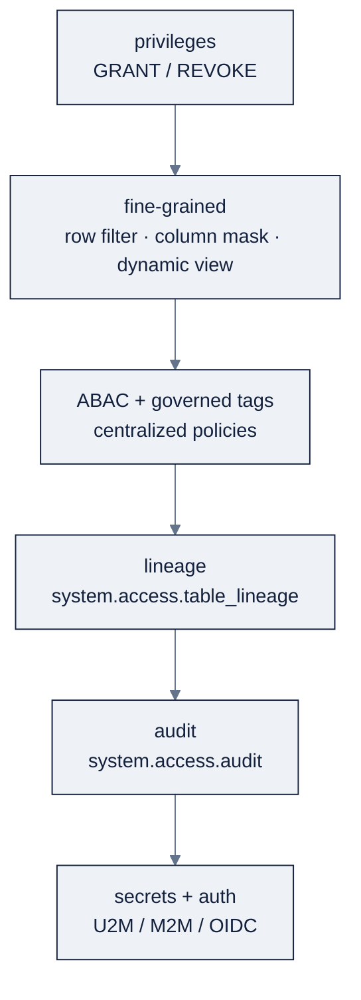

# 16: Governance & Security

> Part of AI Engineering Lab · Developed by Zorost Intelligence AI Lab · [zorost.com](https://zorost.com)

Unity Catalog is the governance layer for **data and AI**: who can do what (privileges),
*which rows/columns* they can see (row filters, column masks, dynamic views), where data
came from (lineage), and who touched what (audit + system tables). This file is the
"regulated-industry" pass, the lens Zorost's aviation/pharma/federal clients actually need.

> **Week 24 · Production & Capstone.** Pairs with [`15-dabs-ci-cd.md`](15-dabs-ci-cd.md)
> (who *deploys*) and [`17-finopps-cost.md`](17-finopps-cost.md) (who *pays*).

The governance stack, bottom to top:



---

## 1. The privileges model

UC access is **additive-only** (there is no `DENY`). A principal needs **traversal** +
**action** privileges, and privileges **inherit down** the hierarchy:

```text
metastore → catalog → schema → table / view / volume / function / model
```

```sql
-- Traversal + action, at the narrowest securable that works
GRANT USE CATALOG ON CATALOG zrl_ TO `ops_analysts`;
GRANT USE SCHEMA  ON SCHEMA zrl_.zorologistics TO `ops_analysts`;
GRANT SELECT     ON TABLE  zrl_.zorologistics.gold_on_time_kpis TO `ops_analysts`;

-- Who can see this table?
SHOW GRANTS ON TABLE zrl_.zorologistics.gold_on_time_kpis;

-- Revoke
REVOKE SELECT ON TABLE zrl_.zorologistics.gold_on_time_kpis FROM `ops_analysts`;
```

Key rules:

- **One owner per object**: prefer a **group**, not a person.
- **`MANAGE`** delegates grant-admin on an object.
- **`BROWSE`** is metadata-only visibility.
- Traversal (`USE CATALOG` / `USE SCHEMA`) is required *in addition to* the action
  (`SELECT`, `MODIFY`, `READ VOLUME`, `EXECUTE`).

---

## 2. Row filters, column masks, dynamic views

Fine-grained controls layer **on top of** table grants, `SELECT` is still required; these
narrow *which rows* and *what values* a caller sees.

### 2.1 Row filters (rows)

A row filter is a BOOLEAN UDF attached to the table; rows where it returns `TRUE` are visible.

```sql
CREATE OR REPLACE FUNCTION zrl_.zorologistics.region_filter(region STRING)
RETURN
  is_account_group_member('region_admins')
  OR is_account_group_member(concat('region_', lower(region)));

ALTER TABLE zrl_.zorologistics.gold_on_time_kpis
  SET ROW FILTER zrl_.zorologistics.region_filter ON (region);

-- inspect / remove
DESCRIBE EXTENDED zrl_.zorologistics.gold_on_time_kpis;
ALTER TABLE zrl_.zorologistics.gold_on_time_kpis DROP ROW FILTER;
```

**ZoroLogistics, made concrete:** the `carriers` master has a `region` column
(`North`/`South`/`East`/`West`/`Central`). Attach the filter to a region-scoped table so each
regional manager sees only their region:

```sql
-- The carriers dimension is region-scoped; filter it directly.
CREATE OR REPLACE FUNCTION zrl_.zorologistics.carrier_region_filter(region STRING)
RETURN
  is_account_group_member('region_admins')
  OR is_account_group_member(concat('region_', lower(region)));

ALTER TABLE zrl_.zorologistics.carriers
  SET ROW FILTER zrl_.zorologistics.carrier_region_filter ON (region);

-- Now a member of `region_north` reading `carriers` sees only North carriers,
-- and any gold view that joins carriers inherits the same scoping.
```

> **Note on the gold example above:** `gold_on_time_kpis` is keyed by `carrier_id`, so region
> scoping there means joining `carriers.region` first. The cleanest pattern is to filter the
> *dimension* (`carriers`) and let every downstream join inherit it, one policy, not one per
> fact table.

### 2.2 Column masks (column values)

A column mask is a UDF whose first parameter is the column; its return replaces the value for
unauthorized callers.

```sql
CREATE OR REPLACE FUNCTION zrl_.zorologistics.email_mask(email STRING)
RETURN CASE
  WHEN is_account_group_member('pii_readers') THEN email
  ELSE regexp_replace(email, '^[^@]+', '****')
END;

ALTER TABLE zrl_.zorologistics.customers
  ALTER COLUMN email SET MASK zrl_.zorologistics.email_mask;

-- a mask can read other columns too
ALTER TABLE zrl_.zorologistics.customers
  ALTER COLUMN email SET MASK zrl_.zorologistics.email_mask USING COLUMNS (tier);
```

**ZoroLogistics, made concrete: mask the phone field the same way:**

```sql
CREATE OR REPLACE FUNCTION zrl_.zorologistics.phone_mask(phone STRING)
RETURN CASE
  WHEN is_account_group_member('pii_readers') THEN phone
  ELSE regexp_replace(phone, '[0-9]', '*')
END;

ALTER TABLE zrl_.zorologistics.customers
  ALTER COLUMN phone SET MASK zrl_.zorologistics.phone_mask;
```

> **The policy UDF runs with the *table owner's* authority**, the owner needs access to
> anything the UDF reads (e.g. an entitlements table). Callers do **not** need `EXECUTE`; UC
> invokes the policy automatically.

### 2.3 Dynamic views (self-contained)

When you cannot attach policies to the base table, expose a view that self-censors using
`current_user()` / `is_account_group_member()`:

```sql
CREATE OR REPLACE VIEW zrl_.zorologistics.customers_secure AS
SELECT
  customer_id,
  CASE WHEN is_account_group_member('pii_readers')
       THEN email ELSE '****@****' END AS email,
  region,
  credit_terms
FROM zrl_.zorologistics.customers
WHERE is_account_group_member('region_admins')
   OR region IN (SELECT region FROM zrl_.security.user_region_map
                 WHERE user_email = current_user());

GRANT SELECT ON VIEW zrl_.zorologistics.customers_secure TO `analysts`;
-- and do NOT grant SELECT on the base customers table to `analysts`
```

**ZoroLogistics, made concrete: hide the credit terms from non-finance readers:**

```sql
CREATE OR REPLACE VIEW zrl_.zorologistics.customers_secure AS
SELECT
  customer_id,
  customer_name,
  CASE WHEN is_account_group_member('pii_readers')
       THEN email ELSE '****@****' END AS email,
  -- credit terms are finance-only; everyone else sees NULL
  CASE WHEN is_account_group_member('finance')
       THEN credit_terms ELSE NULL END AS credit_terms,
  region
FROM zrl_.zorologistics.customers
WHERE is_account_group_member('region_admins')
   OR region IN (SELECT region FROM zrl_.security.user_region_map
                 WHERE user_email = current_user());
```

| Mechanism | Protects | Best for |
|---|---|---|
| Row filter | Rows, at the base table | "Users only see their region" |
| Column mask | Column values, at the base table | "Redact PII unless entitled" |
| Dynamic view | Rows + columns, via the view | Read-only consumers, no UDF lifecycle |

### 2.4 The entitlements-table pattern

Hardcoding account-group names in every filter/mask UDF works for a handful of groups but does
not scale. The production pattern is a single **entitlements table** that maps users to
attributes, and policy UDFs that read it:

```sql
-- One entitlements table drives every row filter / column mask.
CREATE OR REPLACE TABLE zrl_.security.user_region_map (
  user_email STRING,
  region STRING,
  tier STRING,
  is_pii_reader BOOLEAN
);

-- The row filter reads the table instead of hardcoding group names.
CREATE OR REPLACE FUNCTION zrl_.zorologistics.customer_region_filter(region STRING)
RETURN
  is_account_group_member('region_admins')
  OR region IN (
    SELECT region FROM zrl_.security.user_region_map
    WHERE user_email = current_user()
  );
```

Benefits: one place to change who sees what, an auditable mapping, and the same entitlements
table drives both row filters and column masks. The policy UDF runs with the **table owner's**
authority, so the owner (not each caller) needs `SELECT` on the entitlements table.

> **`ai_mask` ≠ column mask.** `ai_mask` (see [`12-ai-functions-genie.md`](12-ai-functions-genie.md))
> rewrites *free text* with an LLM once; a column **mask** is a deterministic governance policy
> enforced at query time.

---

## 3. ABAC & governed tags

Attribute-based access control (ABAC) centralizes the same rules as **policies**: define
**governed tags** (e.g. `PII=true`, `region=EMEA`) on tables/columns, then apply
row-filter / column-mask / GRANT policies that key off those attributes, "mask any column
tagged `PII` for everyone except `pii_readers`," defined once, enforced everywhere.

A worked pattern (illustrative, confirm exact tag DDL against live docs):

```sql
-- 1. Tag the sensitive columns once.
ALTER TABLE zrl_.zorologistics.customers ALTER COLUMN email SET TAGS ('pii' = 'true');
ALTER TABLE zrl_.zorologistics.customers ALTER COLUMN phone SET TAGS ('pii' = 'true');

-- 2. One policy, keyed off the tag, covers every PII column now and later.
--    (a centralized mask policy: "for columns tagged pii=true, redact unless pii_readers")
```

Why it matters at Zorost's scale: without ABAC, ten tables with PII mean ten hand-attached
masks and ten chances to forget one. With ABAC, you tag columns once and one policy covers
them all, and a new PII column is protected by the *tag*, not by someone remembering to attach
a mask.

| Attribute | Governed tag | Policy it triggers |
|---|---|---|
| `email`, `phone` | `pii = true` | column mask (redact unless `pii_readers`) |
| `region` | `region = <val>` | row filter (scoped to the caller's region) |
| `credit_terms` | `sensitive = finance` | column mask (NULL unless `finance`) |

### 3.1 When ABAC is worth it (and when it's overkill)

ABAC pays off when the *same attribute* recurs across many objects: dozens of PII columns,
region-scoping across every fact table, or a compliance tag that must apply everywhere. It is
overkill for one or two one-off masks, a hand-attached row filter is fine until the pattern
repeats. The trigger to switch: **the second time you write "the same mask, on another table."**
At that point, one tag + one policy beats N hand-attached masks, and a new PII column is
protected by the *tag* rather than by someone remembering to attach a mask.

---

## 4. Data lineage

Lineage is automatic (table- and column-level), visible in **Catalog Explorer**, and queryable:

```sql
-- What feeds gold_on_time_kpis?
SELECT DISTINCT source_table_full_name, source_type
FROM system.access.table_lineage
WHERE target_table_full_name = 'zrl_.zorologistics.gold_on_time_kpis';

-- Column-level: where does `delay_hours` come from?
SELECT source_table_full_name, source_column_name
FROM system.access.column_lineage
WHERE target_table_full_name = 'zrl_.zorologistics.silver_shipments'
  AND target_column_name = 'delay_hours';
```

Lineage is the compliance backbone: prove to a regulator that a gold KPI traces to a specific
bronze source and the exact transformation columns.

> **Filter lineage by `event_date` too** (like audit) when the table is large; the lineage
> tables carry the same date partition as other `system.access` tables.

---

## 5. Audit logs & system tables

`system.access.audit` records every UC operation. **Always filter by `event_date`.**

```sql
-- Who read the sensitive table in the last 7 days?
SELECT event_time, user_identity.email AS user_email,
       source_ip_address, action_name
FROM system.access.audit
WHERE event_date >= current_date() - 7
  AND request_params.full_name_arg IN ('zrl_.zorologistics.customers')
ORDER BY event_time DESC;

-- Permission changes in the last 30 days
SELECT event_time, user_identity.email AS changed_by,
       action_name, request_params
FROM system.access.audit
WHERE event_date >= current_date() - 30
  AND action_name IN ('updatePermissions', 'grantPermission', 'revokePermission')
ORDER BY event_time DESC;

-- Failed access attempts (security monitoring)
SELECT event_time, user_identity.email, source_ip_address,
       action_name, response.error_message
FROM system.access.audit
WHERE event_date >= current_date() - 7
  AND response.status_code != '200'
ORDER BY event_time DESC;
```

> System schemas must be **enabled** before querying, and access is **not** granted by default,
> `GRANT USE CATALOG ON CATALOG system`, then `USE SCHEMA` + `SELECT` on `system.access`.
> `request_params` is a MAP whose keys vary by event; select the raw MAP first to inspect them.
> Most system tables retain **365 days** by default, confirm the current value rather than
> hardcoding a longer lookback.

**A standing "sensitive access" monitor** (saved query + alert):

```sql
SELECT event_time, user_identity.email AS user_email,
       source_ip_address, action_name
FROM system.access.audit
WHERE event_date >= current_date() - 7
  AND request_params.full_name_arg IN ('zrl_.zorologistics.customers')
ORDER BY event_time DESC;
```

Other system tables worth knowing: `system.access.table_lineage`/`column_lineage`,
`system.billing.*` (cost, file 17), `system.query.history`, `system.information_schema.*`.

### 5.1 More audit queries (the ones you'll actually run)

```sql
-- Grant/revoke events on a specific table (prove who changed access)
SELECT event_time, user_identity.email AS changed_by,
       action_name, request_params
FROM system.access.audit
WHERE event_date >= current_date() - 30
  AND action_name IN ('updatePermissions', 'grantPermission', 'revokePermission')
  AND request_params.full_name_arg = 'zrl_.zorologistics.customers'
ORDER BY event_time DESC;

-- Most active readers of a sensitive table (volume, not just presence)
SELECT user_identity.email AS user_email, COUNT(*) AS reads
FROM system.access.audit
WHERE event_date >= current_date() - 30
  AND action_name IN ('getTable', 'commandSubmit', 'tableRead')
  AND request_params.full_name_arg = 'zrl_.zorologistics.customers'
GROUP BY user_identity.email
ORDER BY reads DESC
LIMIT 20;

-- Reads joined to lineage (who read the gold table, and what feeds it)
SELECT a.event_time, a.user_identity.email AS user_email,
       l.source_table_full_name
FROM system.access.audit a
LEFT JOIN system.access.table_lineage l
  ON l.target_table_full_name = a.request_params.full_name_arg
WHERE a.event_date >= current_date() - 7
  AND a.request_params.full_name_arg = 'zrl_.zorologistics.gold_on_time_kpis'
ORDER BY a.event_time DESC;
```

> `request_params` keys vary by event type, select the raw MAP for one event first to learn
> the exact keys (e.g. `full_name_arg` vs a different field) before writing the filter.

---

## 6. Secrets, auth, network

- **Secrets**: store API keys/credentials in a Databricks **secret scope**; reference them by
  path (`{{secrets/<scope>/<key>}}`) in SQL/Python. Never in code or notebooks.

  ```bash
  databricks secrets create-scope zrl-ai --profile zrl
  databricks secrets put-secret zrl-ai openai-key --string "$OPENAI_API_KEY" --profile zrl
  ```

  ```python
  # then reference without ever materializing the value in code
  secret = dbutils.secrets.get(scope="zrl-ai", key="openai-key")
  ```

- **OAuth U2M / M2M vs PATs**: the decision, in one table:

  | Auth | Who/what it is for | Secret? | Use |
  |---|---|---|---|
  | **OAuth U2M** | Interactive *users* (browser login) | transient | Local dev, ad-hoc CLI |
  | **OAuth M2M** | *Service principals* (client id + secret) | client secret (stored in CI) | CI/CD, automation |
  | **OIDC federation** | CI platforms (GitHub/Azure DevOps) | **none** (token exchange) | CI/CD (best) |
  | **PAT** (legacy) | Personal access token | long-lived token | Legacy only, migrate to OAuth |

  U2M for people, **M2M** for automation, **OIDC** for CI (no stored secret). **PATs are
  legacy**, migrate to OAuth. Full detail in [`15-dabs-ci-cd.md`](15-dabs-ci-cd.md).

- **Network / private link**: classic compute runs in *your* VPC (customer-managed VPCs,
  PrivateLink); serverless runs in a Databricks-managed plane with a network boundary that
  isolates workspaces. Choose classic when you need data in your own network or direct
  on-prem/private connectivity. The compliance consequence: *where the compute plane lives*
  determines whether your data ever leaves your network boundary, a first-order question for
  aviation/federal clients.

---

## 7. Compliance patterns (the Zorost lens)

Zorost's Modernization Practice serves aviation, pharma, and federal clients, the patterns
that recur:

| Requirement | Databricks mechanism |
|---|---|
| Least-privilege access | GRANT at the narrowest securable; group ownership |
| Need-to-know rows | Row filters keyed to account groups / entitlements table |
| PII/PHI redaction | Column masks + `ai_mask` for free text |
| "Show me the data's origin" | Automatic table/column lineage |
| "Who accessed what, when" | `system.access.audit` (365-day retention) |
| No secrets in code | Secret scopes; OAuth M2M/OIDC |
| Data residency / isolation | Regional metastores, customer-managed VPC (classic), private link |
| AI guardrails | Unity AI Gateway service policies (fail-closed) |
| Right to erasure (GDPR/CCPA) | Delta time travel + `RESTORE`/`VACUUM` for controlled deletion, audit of the change |
| Change control / promotion | DABs targets (dev → prod) with `mode: production` |

**The pattern to internalize:** *grants first, then fine-grained; test as a non-privileged
user; and make every sensitive table auditable by lineage + audit log.* Governance is not a
final checklist, it is what makes the Weeks 21 to 23 artifacts *shippable* to a regulated client.

**The 5-question governance review** (run it before any table is shared):

1. **Who owns it?** Is the owner a *group*, not a person?
2. **Who can see it?** `SHOW GRANTS`, is `SELECT` at the narrowest securable?
3. **Which rows/columns?** Row filter + column mask for PII and region scope?
4. **Can I prove origin?** Does lineage trace it to a source, and audit record every read?
5. **Where do secrets/keys live?** Secret scopes + M2M/OIDC, no PATs, no keys in code?

Answer "no" to any of these and the table is not done.

### 7.1 The regulated-industry checklist (expanded)

Beyond the §7 table, the items a regulated client's auditor will ask for, each with its
Databricks evidence:

| Auditor asks | Databricks evidence |
|---|---|
| "Who changed this table's grants, and when?" | `system.access.audit` grant/revoke events (§5.1) |
| "Prove this KPI traces to raw source." | `system.access.table_lineage` / `column_lineage` |
| "Is PII masked for everyone except entitled users?" | Column mask + a non-privileged test run (§8.1) |
| "Can you delete a user's data on request?" | Delta time travel + `VACUUM`, with the change audited |
| "Where are the API keys?" | Secret scopes only, `SHOW SECRETS` (metadata), never values in code |
| "Is deployment change-controlled?" | DABs targets + `mode: production` + tag releases |
| "Are the LLM calls governed?" | Unity AI Gateway service policies (fail-closed) |

The through-line: **every "yes" is a query or an artifact, not an assertion.** If you cannot
point at the table/query that proves it, it is not done.

---

## 8. ZoroLogistics: the governance gate

**Goal.** Prove the gold layer is safe to share with ops analysts who should only see their
own region's on-time KPIs and never raw customer PII.

1. **Mask customer PII**: column mask on `customers.email` (and any phone field) so
   non-`pii_readers` see `****@****`.
2. **Row-filter by region**: `SET ROW FILTER region_filter ON (region)` on
   `gold_on_time_kpis`, keyed to account groups (or filter the `carriers` dimension, §2.1).
3. **Audit query**: a saved query over `system.access.audit` that reports who read
   `customers` and any failed access in the last 7 days.
4. **Lineage review**: confirm `gold_on_time_kpis` traces to `bronze_shipments` via
   `system.access.table_lineage`.

**Acceptance:** a non-privileged test user sees only their region's rows, sees masked email,
and both facts are visible in the audit log. (The `customers` table is a natural extension of
the Week-1 generator, add `customer_name/email/phone/region` columns when you build the
customer dimension.)

### 8.1 The non-privileged test harness

The single highest-value governance habit: run every policy as a **least-privileged identity**
before you call it done:

1. Create a test principal in *only* the target group (`region_north`, not `region_admins`).
2. Query `customers` and `gold_on_time_kpis` as that principal.
3. Assert: the row count is scoped, PII is masked, and the audit log recorded the read.

A policy that works for an admin but silently no-ops for everyone else is the most common
governance failure, this harness catches it before a regulator does. Make it a saved query or
a small notebook so the "prove it" step is one run, not an afternoon.

---

## 9. Try it

**Task 1: Attach a row filter and prove scoping.**
Create `carrier_region_filter` and attach it to `carriers` on `region`; query as two identities.
*Acceptance check:* a `region_north` member reading `carriers` sees only `region = 'North'`
rows; a `region_admins` member sees all, and the count differs exactly by the non-North rows.

**Task 2: Mask the phone column.**
Create `phone_mask` (redact unless `pii_readers`) and attach it to `customers.phone`.
*Acceptance check:* a non-`pii_readers` query returns `phone` as asterisks; a `pii_readers`
query returns the real value, the same column, two outcomes by identity.

**Task 3: Prove lineage to a regulator.**
Run the §4 lineage query on `gold_on_time_kpis`.
*Acceptance check:* the result names `bronze_shipments` (via `silver_shipments`) as an
upstream source, a chain you can cite in an audit, not an assertion you have to defend.

---

## 10. Common mistakes

1. **Granting action without traversal.** `SELECT` alone fails without `USE CATALOG` +
   `USE SCHEMA`. *Fix:* grant traversal *and* action at the narrowest securable.
2. **Owning objects by a person.** When that person leaves, the object is orphaned. *Fix:*
   group ownership, always.
3. **Confusing `ai_mask` with a column mask.** One is a one-time text transform, the other a
   query-time policy. *Fix:* scrub free text with `ai_mask`; govern columns with a UC mask.
4. **Forgetting the policy UDF runs as the table owner.** If the owner can't read the
   entitlements table, the filter/mask returns nothing (or errors). *Fix:* ensure the owner
   has access to whatever the UDF reads.
5. **Hardcoding a long audit lookback.** Retention is ~365 days; a 400-day filter returns
   nothing silently. *Fix:* confirm retention and clamp the lookback.
6. **Skipping the non-privileged-user test.** A mask that works for an admin can silently
   no-op for everyone else. *Fix:* test every filter/mask as a *least-privileged* identity.

---

## Sources

- Unity Catalog: https://docs.databricks.com/data-governance/unity-catalog/
- Access control (privileges): https://docs.databricks.com/data-governance/unity-catalog/access-control
- Row filters & column masks: https://docs.databricks.com/data-governance/unity-catalog/filters-and-masks
- ABAC: https://docs.databricks.com/data-governance/unity-catalog/abac/
- Governed tags: https://docs.databricks.com/admin/governed-tags/
- Data lineage: https://docs.databricks.com/data-governance/unity-catalog/data-lineage
- System tables: https://docs.databricks.com/admin/system-tables/
- Authentication: https://docs.databricks.com/dev-tools/auth/

> *Original AI Engineering Lab writing; audit event names, system-table columns, and ABAC surface
> change, verify against the live links above.*

---

© 2026 Zorost Intelligence LLC · [zorost.com](https://zorost.com)
