# 17: FinOps & Cost

> Part of AI Engineering Lab · Developed by Zorost Intelligence AI Lab · [zorost.com](https://zorost.com)

FinOps on Databricks is a *measurement discipline*: know what a **DBU** is, read the billing
system tables, and hunt the leaks. This file is the cost-control pass that turns a
"serverless-first" platform decision into a defensible number, the last habit before the
capstone ships.

> **Week 24 · Production & Capstone.** Pairs with [`02-compute.md`](02-compute.md) (the SKUs)
> and [`16-governance-security.md`](16-governance-security.md) (who can see the bill).

The FinOps loop this file teaches:

```mermaid
%%{init:{"theme":"base","fontFamily":"Helvetica Neue,Helvetica,Arial,sans-serif","flowchart":{"curve":"basis","padding":14,"nodeSpacing":45,"rankSpacing":55},"themeVariables":{"fontSize":"15px","background":"#FFFFFF","primaryColor":"#EEF2F7","primaryTextColor":"#14213D","primaryBorderColor":"#14213D","secondaryColor":"#FFF1E3","secondaryTextColor":"#14213D","tertiaryColor":"#E7F4F1","tertiaryTextColor":"#14213D","lineColor":"#64748B","textColor":"#14213D","edgeLabelBackground":"#FFFFFF","clusterBkg":"#F5F8FC","clusterBorder":"#94A3B8","nodeBorder":"#14213D","mainBkg":"#EEF2F7","titleColor":"#14213D"}}}%%
flowchart LR
    TAG[tag workloads\ncompute policies] --> USE[usage lands in\nsystem.billing.usage]
    USE --> JOIN[join list_prices\nDBU → dollars]
    JOIN --> DASH[cost dashboard\n7-day moving avg]
    DASH --> ALERT[budget alert\nfires early]
    ALERT --> FIX[fix a leak\nidle / oversized / naive]
    FIX --> TAG
```



---

## 1. The DBU model

A **DBU (Databricks Unit)** is a unit of *processing capability per hour, based on the VM
instance type*. Cost ≈ **(DBU rate × workload SKU) × instances × duration**, at per-second
granularity.

| SKU tier | Applies to | Relative cost |
|---|---|---|
| **Jobs Compute** | Automated/job workloads | Lowest |
| **All-Purpose Compute** | Interactive notebooks | Higher than jobs |
| **SQL** | SQL warehouses (Classic/Pro) | Per-warehouse rate |
| **Serverless** | Serverless jobs/notebooks/pipelines | Premium rate, no idle |

Other billed products are tracked by `billing_origin_product`: Lakeflow Pipelines
(DLT `CORE/PRO/ADVANCED`), Model Serving, AI Search, Unity AI Gateway, Lakeflow Connect, AI
Functions, Lakebase, and more.

### 1.1 DBU cost math, worked

The formula is `cost = usage_quantity (DBUs) × list_price`. Worked examples (rates are
**illustrative**: real DBU rates vary by cloud, region, and SKU; confirm against
`system.billing.list_prices`):

| Workload | DBUs/hour | Hours/day | DBUs/day | Rate (illustrative) | $/day |
|---|---|---|---|---|---|
| All-purpose cluster (2 × m5d.2xlarge), left on 24 h | 2.4 | 24 | 57.6 | $0.55 | **$31.68** |
| Same cluster, auto-terminated after a 2 h job | 2.4 | 2 | 4.8 | $0.55 | **$2.64** |
| Serverless job (same 2 h of work) | 2.4 | 2 | 4.8 | $0.70 | **$3.36** |
| Serverless SQL warehouse, 30 min of queries | 1.0 | 0.5 | 0.5 | $0.70 | **$0.35** |
| Pay-per-token serving (10k tokens) | n/a | n/a | n/a | per-1M-token | usage-only |

The first row is the whole story of Databricks FinOps: **the same job costs ~12× more because
an all-purpose cluster idles 22 h/day.** Auto-termination (row 2) or serverless (row 3)
removes the idle; serverless charges a premium *per DBU* but only for the hours you actually
use.

### 1.2 The one-line cost model

Every cost question reduces to three numbers pulled from the billing tables:

```
cost = SUM(usage_quantity × price)  over [sku, date, tags]
```

- `usage_quantity` → `system.billing.usage`
- `price` → `system.billing.list_prices` (join on `sku_name` + `cloud`)
- `tags` → `custom_tags` (attribution) or `usage_metadata.cluster_id` (per-cluster)

### 1.3 Worked cost math: SQL warehouse + serving

Two more worked examples (rates illustrative, confirm against `list_prices`):

**SQL warehouse.** A Serverless warehouse runs ~0.5 h of queries a day at ~1 DBU/h. Cost ≈
0.5 DBU × $0.70 ≈ **$0.35/day**. The same workload on a Pro warehouse that sits up 24 h at a
lower rate but accrues DBUs while idle is usually *more* expensive, idle is the leak, not the
rate.

**Model Serving (scale-to-zero).** A scale-to-zero endpoint bills $0 while idle; a warm
replica floor (`min_provisioned_throughput > 0`) bills continuously. If ops queries the ETA
endpoint ~2,000×/day in a 2-hour window, scale-to-zero costs ~2 h of compute + cold starts; a
24/7 warm floor costs 24 h. For spiky daytime traffic, scale-to-zero wins; for a latency SLA on
a hot path, the warm floor is the price of the guarantee.

**The pattern to internalize:** every cost question is *usage_quantity × price*, summed, and
the biggest lever is almost always **eliminating hours you pay for but don't use** (idle
compute), not shaving the per-DBU rate.

---

## 2. Serverless vs classic: the tradeoff

| | **Classic** | **Serverless** |
|---|---|---|
| Start | ~minutes (cluster spin-up) | ~seconds |
| Idle | You pay for idle VMs | No idle cost (scale-to-zero) |
| Scaling | You configure autoscale | Automatic |
| Ops | You patch/upgrade | Always latest, managed |
| DBU rate | Lower per-DBU | **Premium per-DBU** |
| Limits | Your VPC, spot/pools, policies | Federation-only, no custom data sources |

**The FinOps takeaway:** serverless charges more *per DBU* but often wins on **TCO** because
you eliminate idle clusters, over-provisioning, and the ops tax. The classic trap is comparing
DBU rates instead of total monthly spend. Migrate predictable, spiky, or infrequently-run
workloads to serverless; keep classic only where you need your own VPC or spot economics.

**A worked comparison (the medallion pipeline):** an all-purpose cluster idles ~22 h/day
between nightly runs → you pay 24 h of interactive DBUs for 2 h of work. On serverless you pay
for ~2 h of serverless DBUs plus a cold-start, at a higher rate but with **no idle**. The
serverless bill is usually lower even at a premium rate, and the real saving is that nobody
manages autoscaling, patches, or teardown.

**The TCO comparison, in one table:**

| Line | Classic (all-purpose) | Serverless |
|---|---|---|
| DBUs (2 h of work) | 4.8 | 4.8 |
| DBUs (idle) | 52.8 | 0 |
| Total DBUs/day | 57.6 | ~4.8 |
| Rate | $0.55 | $0.70 |
| **Compute $/day** | **$31.68** | **~$3.36** |
| Ops (patching, autoscale tuning) | someone's hours | $0 |

---

## 3. Instance pools, spot, and warehouse scaling

- **Instance pools**: pre-warmed idle instances (you pay cloud cost, **no DBUs while idle**)
  for faster cluster start/scale. Databricks now recommends **serverless instead of pools**
  where supported.
- **Spot instances**: cut cost for latency-tolerant workers (driver stays on-demand); use
  **fleet types** for resilient spot.
- **SQL warehouse scaling**: serverless warehouses **autoscale** (Intelligent Workload
  Management); classic/pro scale ~1 cluster per 10 concurrent queries. **Auto Stop** defaults
  to 10 min idle (idle still accrues DBUs), tune it down.

---

## 4. Billing system tables

`system.billing.usage` holds granular DBU records; join `system.billing.list_prices` for cost.

| Column | Meaning |
|---|---|
| `usage_date` | Date of usage (partition, always filter) |
| `sku_name` | Product SKU |
| `usage_quantity` | DBUs (or other units) consumed |
| `usage_metadata` | MAP, cluster id/name, tags, etc. |
| `billing_origin_product` | Product (pipeline, serving, search…) |
| `custom_tags` | Your cost-attribution tags |

```sql
-- Daily DBU by SKU, last 30 days
SELECT usage_date, sku_name, SUM(usage_quantity) AS total_dbus
FROM system.billing.usage
WHERE usage_date >= current_date() - 30
GROUP BY usage_date, sku_name
ORDER BY usage_date DESC, total_dbus DESC;

-- Compute vs SQL vs Serverless
SELECT
  CASE
    WHEN sku_name LIKE '%ALL_PURPOSE%' THEN 'All-Purpose'
    WHEN sku_name LIKE '%JOBS%'         THEN 'Jobs'
    WHEN sku_name LIKE '%SQL%'          THEN 'SQL Warehouse'
    WHEN sku_name LIKE '%SERVERLESS%'   THEN 'Serverless'
    ELSE 'Other'
  END AS compute_type,
  SUM(usage_quantity) AS total_dbus
FROM system.billing.usage
WHERE usage_date >= current_date() - 30
GROUP BY 1
ORDER BY total_dbus DESC;

-- Estimated cost by SKU (join list prices)
SELECT u.sku_name,
       SUM(u.usage_quantity) AS total_dbus,
       SUM(u.usage_quantity * p.pricing.default) AS estimated_cost
FROM system.billing.usage u
LEFT JOIN system.billing.list_prices p
  ON u.sku_name = p.sku_name AND u.cloud = p.cloud
WHERE u.usage_date >= current_date() - 30
  AND p.price_end_time IS NULL
GROUP BY u.sku_name
ORDER BY estimated_cost DESC;

-- Chargeback by tag (requires tags enforced via compute policy)
SELECT usage_metadata.cluster_id,
       MAX(usage_metadata.cluster_name) AS cluster_name,
       SUM(usage_quantity)               AS total_dbus
FROM system.billing.usage
WHERE usage_date >= current_date() - 30
  AND usage_metadata.cluster_id IS NOT NULL
GROUP BY usage_metadata.cluster_id
ORDER BY total_dbus DESC
LIMIT 20;

-- Daily trend with 7-day moving average (catch a spike early)
SELECT usage_date,
       SUM(usage_quantity) AS daily_dbus,
       AVG(SUM(usage_quantity)) OVER (
         ORDER BY usage_date ROWS BETWEEN 6 PRECEDING AND CURRENT ROW
       ) AS moving_avg_7d
FROM system.billing.usage
WHERE usage_date >= current_date() - 60
GROUP BY usage_date
ORDER BY usage_date;
```

> Grant access explicitly: `GRANT USE CATALOG ON CATALOG system`, then `USE SCHEMA` + `SELECT`
> on `system.billing`.

### 4.1 More billing queries (the operational set)

```sql
-- Spend by workspace (multi-workspace account view)
SELECT workspace_id, SUM(usage_quantity) AS dbus
FROM system.billing.usage
WHERE usage_date >= current_date() - 30
GROUP BY workspace_id
ORDER BY dbus DESC;

-- Month-over-month delta (catch a creep before it compounds)
SELECT date_trunc('MONTH', usage_date) AS month,
       SUM(usage_quantity) AS dbus,
       LAG(SUM(usage_quantity)) OVER (ORDER BY date_trunc('MONTH', usage_date)) AS prev_dbus
FROM system.billing.usage
WHERE usage_date >= current_date() - 90
GROUP BY 1
ORDER BY 1;

-- Spend by product (pipeline vs serving vs search vs compute)
SELECT COALESCE(billing_origin_product, 'compute') AS product,
       SUM(usage_quantity) AS dbus
FROM system.billing.usage
WHERE usage_date >= current_date() - 30
GROUP BY 1
ORDER BY dbus DESC;

-- All-purpose DBUs that could be job/serverless (the migration candidate)
SELECT SUM(usage_quantity) AS all_purpose_dbus
FROM system.billing.usage
WHERE usage_date >= current_date() - 30
  AND sku_name LIKE '%ALL_PURPOSE%';
```

---

## 5. Cost dashboard, tagging, budgets & alerts

- **Cost dashboard**: build an AI/BI dashboard on `system.billing.usage` (daily DBU, top SKUs,
  per-cluster, 7-day moving average). Import the official usage dashboards to start faster.
- **Tagging**: enforce **tags** via compute policies; `custom_tags` then powers chargeback
  ("this team's pipelines cost X"). The bundle already tags the ETL job; extend tags to every
  cluster and warehouse.
- **Budgets & alerts**: set account-wide or filtered (team/project/workspace) budgets with
  alerts. **Do this on day one**, a $5 budget alert beats a surprise invoice.
- **Governance Hub**: the account-level cost page for trends and anomalies.

### A cost dashboard spec (what to build)

One dataset on `system.billing.usage` + one on `list_prices`, then:

| Widget | Dataset query (shape) | Why |
|---|---|---|
| Total spend (KPI) | `SUM(usage_quantity × price)` last 30d | the headline number |
| 7-day moving average (line) | daily DBU + `AVG() OVER (...)` | catches spikes same-day |
| Top SKUs (table) | `GROUP BY sku_name` | where the money goes |
| Compute type split (bar) | the `CASE` buckets | classic vs serverless |
| Per-cluster (table) | `GROUP BY usage_metadata.cluster_id` | find the idle culprit |
| Per-team (table) | `GROUP BY custom_tags.team` | chargeback |

### 5.1 Budgets & alerts, concretely

A budget is **account-wide or filtered** (by team/project/workspace/tag). Set it to fire early:

1. Create a budget scoped to the `project = zorologistics-capstone` tag.
2. Set the threshold at ~120% of the *expected* spend, not your pain point. The alert is an
   early-warning tripwire, not a kill switch.
3. Route the alert to the team's Slack/email; name one person the responder.
4. Review it at the weekly FinOps cadence and tune the threshold down as you learn real spend.

The discipline: **a $5 budget alert on day one beats a surprise invoice at month-end.** The
budget doesn't stop spend, it makes spend *visible the day it happens*, which is what turns
FinOps from a monthly post-mortem into a daily habit.

---

## 6. Top-10 cost leaks (and the fixes)

| # | Leak | Symptom | Fix |
|---|---|---|---|
| 1 | Idle clusters | All-purpose cluster runs 24/7 | Auto-termination (10 min) or serverless |
| 2 | Over-provisioned warehouses | Warehouse at 2× needed size | Downsize; rely on autoscale + auto-stop |
| 3 | Naive streaming | Streaming pipeline runs continuously at full tilt | `availableNow`/`Trigger.AvailableNow` for one-shot; rightsize workers |
| 4 | Pay-per-token in prod | Token bill grows linearly with traffic | Provisioned throughput once latency/volume is known |
| 5 | Every AI function re-invoked per query | `ai_classify` in a view scanned on each read | Materialize once into Delta |
| 6 | No tags | Can't attribute spend | Enforce tags via compute policy |
| 7 | Untracked Model Serving / AI Search | Endpoints left idle or over-provisioned | `scale_to_zero_enabled`; storage-optimized endpoints |
| 8 | Idle SQL warehouse | Warehouse accrues DBUs while idle | Tune Auto Stop down to the minimum (5 min via UI, 1 via API) |
| 9 | All-purpose for scheduled jobs | Interactive rate on an automated workload | Use a **job cluster** (cheaper per DBU) or serverless |
| 10 | Ignored moving average | A spike is found at month-end, not day-of | Watch the 7-day moving average daily |

### 6.1 Three leaks, deep-dived

**The idle cluster (leak #1).** An all-purpose cluster left on between runs is the #1 line item
in almost every new workspace. The fix is mechanical, auto-termination at 10 min, and the
payoff is immediate: 24 h of interactive DBUs becomes 2 h.

**The live-view AI function (leak #5).** `ai_classify` in a view re-bills tokens on every
scan, and scans happen more than you think (dashboards, joins, exports). Materialize once; the
Delta result costs cents to read.

**Pay-per-token at scale (leak #4).** Pay-per-token is usage-only and perfect for experiments,
but it scales linearly with traffic. Once you know the volume and have a latency SLA,
provisioned throughput buys a ceiling and a guarantee, the break-even is a number you should
compute, not assume.

### 6.2 The serverless-migration checklist

The highest-leverage FinOps move is migrating the right workloads to serverless. Work down
this list:

1. **Find the idle**: the per-cluster query (§4) names the all-purpose clusters running 24/7.
2. **Move scheduled jobs to job clusters or serverless**: interactive rate → job/serverless
   rate, and no idle.
3. **Rightsize the SQL warehouse**: serverless autoscale beats a Pro warehouse sized for peak.
4. **Enable scale-to-zero on every low-traffic endpoint**: $0 while idle.
5. **Keep classic only where you must**: your VPC, spot economics, a custom data source.

Measure each move as a before/after `usage_quantity × price` delta, and record it, the
capstone's G10 gate is exactly this, done once and documented.

### 7.1 A worked FinOps note (copy the shape)

The one-paragraph note the capstone gate wants, as a fill-in-the-blank:

> *Change:* moved the medallion pipeline from an all-purpose cluster (24/7) to a serverless
> job. *Before:* ~57.6 DBU/day (2 h of work + 22 h idle). *After:* ~4.8 DBU/day + cold start.
> *Delta:* −52.8 DBU/day ≈ −$29/day ≈ −$870/month (illustrative rates). *Verification:*
> `system.billing.usage`, `billing_origin_product = 'pipelines'`, last 30 days.

Every cost claim in this module should reduce to that shape: **the change, the number, the
dollar delta, and the query that proved it.**

> **Rates are illustrative everywhere in this file.** Before you publish a dollar figure, pull
> the live rate from `system.billing.list_prices` for your cloud/region, the *shape* of the math
> never changes, only the constants do.

---

## 7. ZoroLogistics: cost exercise

**A cost-tracking query** (saved as the capstone's FinOps view):

```sql
SELECT
  usage_date,
  CASE
    WHEN billing_origin_product IS NOT NULL THEN billing_origin_product
    ELSE 'Compute'
  END AS product,
  SUM(usage_quantity) AS dbus,
  COALESCE(SUM(usage_quantity * p.pricing.default), 0) AS est_cost_usd
FROM system.billing.usage u
LEFT JOIN system.billing.list_prices p
  ON u.sku_name = p.sku_name AND u.cloud = p.cloud AND p.price_end_time IS NULL
WHERE usage_date >= current_date() - 30
GROUP BY usage_date, 2
ORDER BY usage_date DESC, dbus DESC;
```

**One concrete cost win** (do it, don't just read it):

1. Find the pipeline's **Jobs vs All-Purpose** split in the query above.
2. Confirm the medallion pipeline runs on **serverless** (not an all-purpose cluster) and that
   the ETA serving endpoint has `scale_to_zero_enabled: true`.
3. Measure before/after in `system.billing.usage` and write a one-paragraph FinOps note:
   *the change, the DBU delta, and the dollar delta.*

**Acceptance:** the cost dashboard is live, tags are on the bundle resources, a budget alert
fires at a threshold, and the one cost-win exercise is documented with a number, the same
"every artifact ships with a metric" habit applied to spend.

### A FinOps cadence (make it somebody's job)

| Cadence | Do this |
|---|---|
| **Daily** | Glance at the 7-day moving average; a spike is caught same-day, not at month-end |
| **Weekly** | Top-5 SKUs and top-5 clusters; confirm each is still *needed* |
| **Monthly** | Chargeback by tag; compare against the budget; close one cost-win (idle cluster, oversized warehouse, naive stream) |
| **Quarterly** | Re-evaluate classic vs serverless; re-check provisioned throughput vs pay-per-token |

---

## 8. Try it

**Task 1: Reproduce the cost math.**
Run the "Estimated cost by SKU" query (§4) and pick the top SKU.
*Acceptance check:* `estimated_cost ≈ total_dbus × pricing.default` for that SKU, you can
state the exact dollar figure and the DBUs behind it, not just "spend is up."

**Task 2: Find the idle cluster.**
Run the per-cluster chargeback query and identify the cluster with the most DBUs that has no
recent job runs.
*Acceptance check:* you name one cluster, its daily DBU, and the auto-termination (or
serverless migration) that removes it, a specific fix, not a general "optimize compute."

**Task 3: Set a budget alert and trip it.**
Create a filtered budget on the `zorologistics-capstone` tag with a low threshold, then run the
pipeline.
*Acceptance check:* the alert fires (or is scheduled to) at the threshold, and the moving
average in your cost dashboard shows the pipeline's contribution the same day.

---

## 9. Common mistakes

1. **Comparing DBU rates instead of total spend.** The premium serverless rate looks worse on
   paper but wins on TCO once idle and ops are counted. *Fix:* always reduce to
   `usage_quantity × price`, summed, never per-DBU rate alone.
2. **No budget alert on day one.** The most expensive mistake is the one you find at
   month-end. *Fix:* a small, filtered budget alert before the first pipeline run.
3. **Re-invoking AI functions per query.** An `ai_classify` in a live view bills tokens on
   every scan. *Fix:* materialize once into a Delta table.
4. **A streaming pipeline at full tilt for batch data.** *Fix:* use
   `availableNow`/scheduled triggers, and rightsize the workers.
5. **Scale-to-zero disabled on low-traffic endpoints.** You pay for idle replicas you never
   use. *Fix:* `scale_to_zero_enabled: true` as the default.
6. **Tags as an afterthought.** Untagged spend is unattributable spend. *Fix:* enforce tags
   via compute policy from the start, and join `custom_tags` in every chargeback query.

---

## Sources

- Billing system tables: https://docs.databricks.com/admin/system-tables/billing
- Usage & cost monitoring: https://docs.databricks.com/admin/usage
- Instance pools: https://docs.databricks.com/compute/pool-index
- SQL warehouses: https://docs.databricks.com/compute/sql-warehouse/
- Pricing: https://www.databricks.com/product/pricing

> *Original AI Engineering Lab writing; SKU names, DBU rates, and system-table columns change,
> verify against the live links above.*

---

© 2026 Zorost Intelligence LLC · [zorost.com](https://zorost.com)
