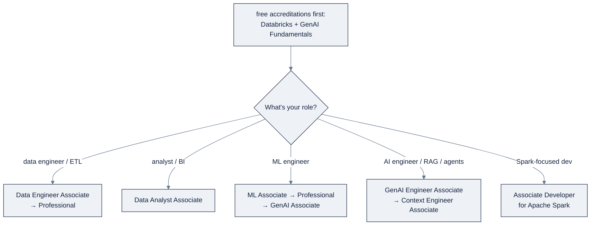

# 18: Certification Path & the Hero's Recap

> Part of AI Engineering Lab · Developed by Zorost Intelligence AI Lab · [zorost.com](https://zorost.com)

This module is the whole "zero to hero" arc. This final file maps it to Databricks
certifications, gives you a study plan, and closes with the **what-done-looks-like** checklist.

> **Week 24 · Graduation.** After this file, the capstone is the proof.

---

## 1. The certifications

Role-based certifications (Associate/Professional), plus free accreditations:

| Certification | Assesses | Level |
|---|---|---|
| **Data Analyst Associate** | Data analysis with Databricks SQL, queries, visualizations, dashboards | Associate |
| **Data Engineer Associate** | Introductory data engineering on the Data + AI Platform | Associate |
| **Data Engineer Professional** | Advanced data engineering (Delta, streaming, pipelines, jobs, optimization) | Professional |
| **Machine Learning Associate** | Basic ML tasks on Databricks | Associate |
| **Machine Learning Professional** | Advanced ML in production (MLflow, Feature Engineering, Model Serving) | Professional |
| **Generative AI Engineer Associate** | Design, build, deploy GenAI solutions (RAG, agents, serving, governance) | Associate |
| **Context Engineer Associate** | Design, assemble, govern context for AI agent systems | Associate |
| **Associate Developer for Apache Spark** | The Spark DataFrame API | Associate |

Plus **accreditations** (free badges): **Databricks Fundamentals** (Lakehouse) and
**Generative AI Fundamentals**. The Hadoop Migration Architect exam was retired Aug 1, 2024.

Picking a path:

### 1.1 Exam details (typical: confirm before booking)

| Exam | Format | Length (typical) | Passing (typical) |
|---|---|---|---|
| Associate exams | Multiple-choice / multiple-select, proctored (remote) | ~90 to 100 min | ~70% |
| Professional exams | Scenario-heavy, case-based | longer | ~70% |
| Accreditations | Self-paced, unproctored | ~1 to 3 h | completion |

> Exact length, question count, and passing score **vary per exam and change**, confirm on the
> certification portal before booking. Professional exams assume hands-on production experience,
> not just recall.

### What each cert covers

| Certification | Core topic areas (representative) |
|---|---|
| **Data Analyst Associate** | SQL queries & joins, aggregations/windows, visualizations, dashboards, Genie; reading governed data |
| **Data Engineer Associate** | Delta Lake (ACID, time travel, VACUUM/OPTIMIZE), PySpark/SQL, Lakeflow Pipelines, Jobs, Unity Catalog basics |
| **Data Engineer Professional** | Streaming (Auto Loader, watermarks, CDC), incremental design, liquid clustering, performance tuning, CI/CD, multi-hop medallion |
| **Machine Learning Associate** | MLflow tracking, Model Registry/aliases, Feature Engineering, AutoML, scikit-learn/XGBoost, batch + serving inference |
| **Machine Learning Professional** | Feature Store point-in-time, distributed training, model lifecycle at scale, production serving, monitoring |
| **Generative AI Engineer Associate** | Foundation Model APIs, RAG + AI Search, agents, evaluation, Unity AI Gateway, governance of GenAI |
| **Context Engineer Associate** | Context assembly, retrieval quality, context-window engineering, grounding, agent memory |
| **Associate Developer for Apache Spark** | The Spark DataFrame API, transformations/actions, joins, aggregation, optimization basics |

**Exam formats (typical):** Associate exams are ~90 to 100 minutes, multiple-choice/multiple-select,
proctored, with a passing score near 70% (confirm the exact length, question count, and
passing score per exam, they vary and change). Professional exams are longer, scenario-heavy,
and assume hands-on production experience. Official prep is on the **Databricks Academy**
(`customer-academy.databricks.com`).

### Which cert for me?

| Your role | Start here | Then |
|---|---|---|
| Data engineer / ETL | Data Engineer Associate | Data Engineer Professional |
| Analyst / BI | Data Analyst Associate | (optionally DE Associate) |
| ML engineer | Machine Learning Associate | ML Professional → GenAI Engineer Associate |
| AI engineer (RAG/agents) | GenAI Engineer Associate | Context Engineer Associate |
| Spark-focused developer | Associate Developer for Apache Spark | DE track |

**The honest guidance:** the free **accreditations** (Databricks Fundamentals + Generative AI
Fundamentals) are a one-afternoon warm-up that orient you to the platform's vocabulary before
you book a paid exam.

### 1.2 Five objectives per cert (the deep breakdown)

The blueprints are weighted; here is what each weight actually tests, in the module's own
vocabulary:

**Data Engineer Associate**: (1) Delta Lake mechanics (ACID, time travel, VACUUM/OPTIMIZE,
liquid clustering); (2) PySpark/SQL transformations; (3) Lakeflow Pipelines (expectations,
streaming vs materialized views); (4) Lakeflow Jobs orchestration; (5) Unity Catalog basics.
→ files `03`, `05`, `06`, `01`.

**Data Engineer Professional**: (1) streaming (Auto Loader, watermarks, CDC / `AUTO CDC`);
(2) incremental multi-hop medallion; (3) performance tuning (Photon, AQE, partitioning);
(4) CI/CD + DABs; (5) governance + observability at scale. → files `06`, `03`, `05`, `15`, `16`.

**Data Analyst Associate**: (1) SQL joins/aggregations/windows; (2) visualization + dashboards;
(3) Genie + governed data; (4) alerts; (5) reading governed tables. → files `04`, `12`, `14`, `16`.

**Machine Learning Associate**: (1) MLflow tracking; (2) Models in UC + aliases; (3) Feature
Engineering; (4) classic ML (scikit-learn/XGBoost) + AutoML; (5) batch + serving inference. →
files `07`, `08`, `09`, `10`.

**Machine Learning Professional**: (1) point-in-time features (no leakage); (2) distributed
training; (3) model lifecycle at scale; (4) production serving + monitoring; (5) MLOps
governance. → files `08`, `09`, `10`, `16`.

**Generative AI Engineer Associate**: (1) Foundation Model APIs; (2) RAG + AI Search; (3)
agents + evaluation; (4) Unity AI Gateway + governance; (5) AI functions. → files `10`, `11`,
`12`, `13`, `16`.

**Context Engineer Associate**: (1) context assembly; (2) retrieval quality; (3)
context-window engineering; (4) grounding; (5) agent memory. → files `11` to `13`, plus the
knowledge-base context/agent files.

**Associate Developer for Apache Spark**: (1) transformations/actions + lazy evaluation;
(2) joins + aggregation; (3) window functions; (4) optimization basics; (5) reading/writing
formats. → file `05`.

### 1.3 Sample scenarios, mapped to the module

Exam questions are scenarios. Map them to the file + artifact, not trivia:

| Scenario | It tests | File + artifact |
|---|---|---|
| "A nightly job is slow and the table keeps growing" | OPTIMIZE / liquid clustering / VACUUM | `03` |
| "A gold KPI must trace to raw source for an auditor" | lineage | `16` |
| "A user should only see their region's rows" | row filter | `16` |
| "Roll a new model to 10% of traffic with zero downtime" | A/B traffic routing | `10` |
| "A RAG answer invents a tariff" | groundedness + gateway guardrail | `11`, `10` |
| "Genie returns the wrong join" | instructions + verified answers | `12` |
| "The pipeline passes but drops the null-weight rows" | expectations (`DROP ROW`) | `06` |

Answer from what you *built*, every row is an artifact you produced in the capstone.

---

## 2. How this module maps to each cert

| File | DE Assoc | DE Pro | Analyst | ML Assoc | ML Pro | GenAI Assoc |
|---|---|---|---|---|---|---|
| `01-unity-catalog.md` | ✅ | ✅ | n/a | ✅ | ✅ | ✅ |
| `02-compute.md` | ✅ | ✅ | n/a | ✅ | ✅ | n/a |
| `03-delta-lake.md` | ✅ | ✅ | n/a | n/a | n/a | n/a |
| `04-dbsql.md` | ✅ | n/a | ✅ | n/a | n/a | n/a |
| `05-pyspark.md` | ✅ | ✅ | n/a | n/a | n/a | n/a |
| `06-pipelines-jobs.md` | ✅ | ✅ | n/a | n/a | n/a | n/a |
| `07-mlflow-experiments.md` | n/a | n/a | n/a | ✅ | ✅ | n/a |
| `08-feature-engineering.md` | n/a | n/a | n/a | ✅ | ✅ | n/a |
| `09-model-training.md` | n/a | n/a | n/a | ✅ | ✅ | n/a |
| `10-model-serving.md` | n/a | n/a | n/a | ✅ | ✅ | ✅ |
| `11-vector-search-rag.md` | n/a | n/a | n/a | n/a | ✅ | ✅ |
| `12-ai-functions-genie.md` | n/a | n/a | ✅ | n/a | n/a | ✅ |
| `13-agents.md` | n/a | n/a | n/a | n/a | ✅ | ✅ |
| `14-apps-dashboards.md` | n/a | n/a | ✅ | n/a | n/a | ✅ |
| `15-dabs-ci-cd.md` | ✅ | ✅ | n/a | ✅ | ✅ | n/a |
| `16-governance-security.md` | ✅ | ✅ | n/a | ✅ | ✅ | ✅ |
| `17-finopps-cost.md` | ✅ | ✅ | n/a | ✅ | ✅ | n/a |

**Pick the cert that matches your role:** a data engineer targets **DE Associate → Pro**; an
analyst targets **Data Analyst Associate**; an ML/AI engineer targets **ML Associate → Pro**,
then **GenAI Engineer Associate**. The Spark exam is a useful add-on for DE-track learners.

### 2.1 Reverse lookup: cert → the files that matter most

Work backward from the exam to the module:

| Target cert | Primary files (read twice) | Secondary |
|---|---|---|
| DE Associate | `03`, `05`, `06`, `01` | `02`, `04`, `15` |
| DE Professional | `06`, `03`, `05`, `15`, `16` | `02`, `17` |
| Data Analyst | `04`, `12`, `14` | `16` |
| ML Associate | `07`, `08`, `09`, `10` | `02` |
| ML Professional | `08`, `09`, `10`, `16` | `17` |
| GenAI Associate | `10`, `11`, `12`, `13`, `16` | `14` |
| Context Engineer | `11` to `13` | KB context/agent files |
| Spark Associate | `05` | `03` |

---

## 3. Study plan (4 weeks, alongside the capstone)

### 3.1 The weekly arc

| Week | Focus | Cert prep |
|---|---|---|
| **W1** | Re-read files 01 to 06; rebuild the medallion pipeline from memory | DE Associate practice sets (Delta, Spark, pipelines) |
| **W2** | Files 07 to 09; log an experiment, register a model, point-in-time features | ML Associate practice sets |
| **W3** | Files 10 to 13; serve the ETA model, build RAG, evaluate an agent | GenAI Associate practice sets |
| **W4** | Files 14 to 17 + capstone; governance, DABs, FinOps | Mock exam + weak-area review |

### 3.2 Daily tasks (45 to 60 min/day)

The same cadence every week, **Mon to Thu**: one concept file + one hands-on reconstruction;
**Fri**: a practice set, then fix the two weakest answers.

| Week | Mon | Tue | Wed | Thu | Fri |
|---|---|---|---|---|---|
| **W1** | `01` + `GRANT`/`SHOW GRANTS` | `02` + a cluster policy | `03` + time travel + VACUUM | `04` to `05` + a DataFrame aggregation | DE practice set |
| **W2** | `06` + a pipeline expectation | `07` + log an experiment | `08` + a point-in-time join | `09` + register + alias a model | ML practice set |
| **W3** | `10` + create + query an endpoint | `11` + a Delta Sync index + query | `12` + one AI function, materialized | `13` + log an agent with tools | GenAI practice set |
| **W4** | `14` + a two-widget dashboard | `15` + `bundle validate`/`deploy` | `16` + a row filter + mask | `17` + a cost query | **Mock exam** |

**Daily cadence (45 to 60 min/day):** *Mon to Thu*, one concept file + one hands-on reconstruction
of its core artifact; *Fri*, a practice-question set on that week's files, then fix the two
weakest answers by re-reading. The capstone IS the practical exam: if you can rebuild it from
memory, you already hold the passing knowledge.

**Exam-day tips:**

- Read the **blueprint weights** first; answer the high-weight domains you know cold, flag the
  rest, and return.
- Many questions are **scenario-based** ("a job is slow / a table is ungoverned, what do you
  do?"), map each scenario to the file + artifact it tests, not to memorized trivia.
- Know the **current names** (Lakeflow Pipelines, AI Search, Unity AI Gateway, Genie Agents),
  the research file's naming table is a cheat sheet for the renames the exam may still call by
  their old names.
- The **capstone is your notes**: you built every objective, so answer from what you *did*.

**Habits that transfer directly:** every lab here already *is* an exam objective, the on-time
KPIs are the data-analysis questions, the expectations are the data-quality questions, the A/B
traffic split is the serving question, and the groundedness gate is the GenAI governance
question. Passing the exam is mostly *retelling what you built* in the exam's vocabulary.

**Study resources (in order):**

1. **This module**: files 01 to 18 are the concept map; the capstone is the lab.
2. **Databricks Academy** learning pathway for your target cert, the official courseware.
3. **Official docs index** (`https://docs.databricks.com/llms.txt`), for drilling specific
   objectives.
4. **A practice exam**: take one early to find weak areas, then re-read those files.
5. **The exam's own blueprint**: every cert publishes a weighted objective list; spend your
   time proportionally to the weights, not the file order.

| Practice source | What it's for | When |
|---|---|---|
| Free accreditations | Platform vocabulary warm-up | before Week 1 |
| Databricks Academy pathway | Official courseware per cert | all 4 weeks |
| Practice exam (first pass) | Baseline + weak-area map | end of Week 1 |
| `docs.databricks.com/llms.txt` | Drill specific objectives | as needed |
| The capstone | The practical exam | continuously |
| Mock exam | Exam-day rehearsal | end of Week 4 |

### 3.3 The daily 45-minute block

Every weekday, same shape, 45 to 60 min, no more:

1. **10 min**: re-read one concept file (the §3.2 table tells you which).
2. **30 min**: *reconstruct* that file's core artifact from memory (each file's "Try it" task
   is your prompt).
3. **10 min**: write down one thing you got wrong and its fix; that note is your review stack.

**Friday** replaces the reconstruction with a practice set: answer it, then fix the two weakest
answers by re-reading their files before Monday. The capstone runs alongside all four weeks,
each week's reconstruction *is* a capstone phase (see `capstone/README.md` §4).

### 3.4 The final-week checklist

Week 4 is a rehearsal, not new content. Before you book:

1. **Mock exam**: one full timed run, then a weak-area list.
2. **Naming cheat sheet**: re-read the current→formerly table in the overview; the exam may
   still use the old names.
3. **Demo the capstone cold**: clone → validate → deploy → run → query, no notes.
4. **Verify exam logistics**: confirm the current length, question count, and passing score
   on the portal (they change).
5. **Book it**: schedule the exam while the material is warm; a booked date forces the review.

### 3.5 A practice-question warm-up (seven, right now)

Answer these in one sitting; the answers are one file each:

1. What happens to time travel after `VACUUM`? (file `03`)
2. `state.ready == READY` but a version swap is still rolling, what else do you poll? (file `10`)
3. A RAG answer invents a tariff, is that a retrieval problem or a generation problem? (file `11`)
4. Genie returns an average of percentages, what instruction fixes it? (file `12`)
5. A non-privileged user should see only their region's rows, row filter, column mask, or
   dynamic view? (file `16`)
6. `ai_mask` redacts free text once; a column mask governs a column, which is which, and when
   do you use each? (files `12`, `16`)
7. A bundle deploys to dev but is refused on prod, what setting, and why? (file `15`)

The habit: every exam question is *one artifact from the capstone*, restated. If you can answer
these from what you built, you are exam-ready; if one stumps you, re-read that file.

### 3.6 Night-before / day-of checklist

**Night before:** re-read the naming cheat sheet + your own weak-area notes; demo the capstone
one more time cold; confirm the exam link and system check.

**Day of:** read blueprint weights first; answer high-weight domains you know cold; flag and
return; keep the current names; and answer from what you *built*, not what you memorized.

That is the whole arc, the exam is a formality if the capstone is real.

> **A note on recency:** exam names, lengths, passing scores, and even the product names they
> use move. Everything in this file was checked as of Aug 2026, re-verify against the
> certification portal and `docs.databricks.com/llms.txt` in the week you book. The one thing
> that does not change: the exam tests what you can *do*, and the capstone is what you did.

---

## 4. Zero-to-hero recap: what "done" looks like

**From day zero to hero in 4 weeks: done = you can demonstrate each line:**

| # | Done looks like |
|---|---|
| 1 | A workspace with a **Unity Catalog** metastore, a `zrl_` catalog, and grants you can `SHOW`. |
| 2 | A **Delta lakehouse** with bronze → silver → gold tables, time travel, and liquid clustering. |
| 3 | A **Lakeflow Pipeline** with expectations (warn/drop/fail) that passes every update. |
| 4 | A **Lakeflow Job** that schedules and orchestrates the pipeline as a DAG. |
| 5 | An **MLflow experiment** + a model registered in UC with a `@prod` alias. |
| 6 | **Point-in-time features** joining without leakage (the ETA model's training set). |
| 7 | A **serving endpoint** behind the **Unity AI Gateway** with a rate limit, callable from Python. |
| 8 | An **AI Search** index + **RAG** answer with citations and a measured recall/groundedness. |
| 9 | **AI functions** doing classify/extract/mask in SQL, persisted once. |
| 10 | An **agent** (or Agent Brick) with UC tools, evaluated with a judge. |
| 11 | A **Genie** space with **verified** answers on the gold tables. |
| 12 | An **AI/BI dashboard** and/or **Databricks App** a human actually uses. |
| 13 | A **DAB** (`databricks.yml`) deploying pipeline + job + dashboard, promoted dev → prod. |
| 14 | **CI/CD** that validates and deploys the bundle from Git (M2M/OIDC). |
| 15 | **Governance**: a row filter, a column mask, a lineage review, and an audit query. |
| 16 | **FinOps**: a live cost dashboard, tags, a budget alert, and one documented cost win. |
| 17 | **The capstone**, ZoroLogistics Lakehouse Intelligence, demoed end to end and in your portfolio. |

**The graduation bar is not "I read the files."** It is: *clone the repo, run the bundle, watch
the pipeline pass, ask the RAG bot a question, see the dashboard, and show the audit log.* If
you can do that without the notes, you are a hero, and you have a portfolio to prove it.

### 4.1 The recap, grouped by week

The 17 "done" lines map back to the weeks that built them, proof the arc is real:

| Week | Recap lines |
|---|---|
| **21** | 1 to 4 (catalog, lakehouse, pipeline, job) |
| **22** | 4 to 5 (job orchestration, first experiment) |
| **23** | 5 to 11 (model, features, serving, RAG, AI functions, agent, Genie) |
| **24** | 12 to 17 (dashboard/app, DABs, CI/CD, governance, FinOps, capstone) |

If you can demo every line in a week's row without notes, that week is *done*, not "read,"
done. Print the recap and tick one line per artifact; the last line is the capstone demo.

---

## 5. Try it

**Task 1: Map your role to a cert and a file list.**
Pick your role, write down your target cert(s) and the §2 file columns you must master.
*Acceptance check:* you can name, for *your* cert, the three highest-value files and the
artifact each one produces (e.g. DE → `03` time travel, `06` expectations, `15` bundle).

**Task 2: Reconstruct one artifact from memory.**
Close the files and rebuild *one* recap item (e.g. the endpoint + gateway rate limit, or the
row filter + mask).
*Acceptance check:* it runs without peeking; the acceptance check from that file's "Try it"
passes.

**Task 3: Take a baseline practice set.**
Answer a practice set for your target cert, then list your two weakest answers and re-read
those exact files.
*Acceptance check:* you have a written weak-area list with the file + section that fixes each
one, a plan, not a score.

---

## 6. Common mistakes

1. **Studying in file order instead of blueprint-weight order.** The exam weights domains, not
   file numbers. *Fix:* read the blueprint first and spend time proportionally to the weights.
2. **Memorizing trivia instead of scenarios.** Most questions are "a job is slow / a table is
   ungoverned, what do you do?" *Fix:* map each scenario to the artifact it tests.
3. **Using the old names.** Exams may still say Delta Live Tables / Vector Search / AI Gateway.
   *Fix:* keep the naming quick-reference (§3 of the overview) as your cheat sheet.
4. **Booked the exam before the free accreditations.** *Fix:* do Databricks Fundamentals +
   GenAI Fundamentals first, a one-afternoon vocabulary warm-up.
5. **Skipping the capstone as "not study."** Rebuilding it *is* the practical exam. *Fix:*
   treat the capstone as the study plan's hands-on half, not a separate chore.
6. **No weak-area loop.** A practice score with no follow-up changes nothing. *Fix:* after
   every practice set, re-read the two weakest answers' files before the next set.

---

## Sources

- Databricks certifications: https://www.databricks.com/learn/certification
- Databricks training / Academy: https://www.databricks.com/learn/training
- Glossary: https://docs.databricks.com/resources/glossary

> *Original AI Engineering Lab writing; exam names, lengths, and passing scores change, verify at
> the certification portal before booking.*

---

© 2026 Zorost Intelligence LLC · [zorost.com](https://zorost.com)
