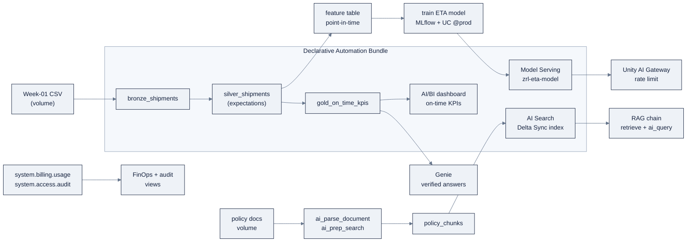
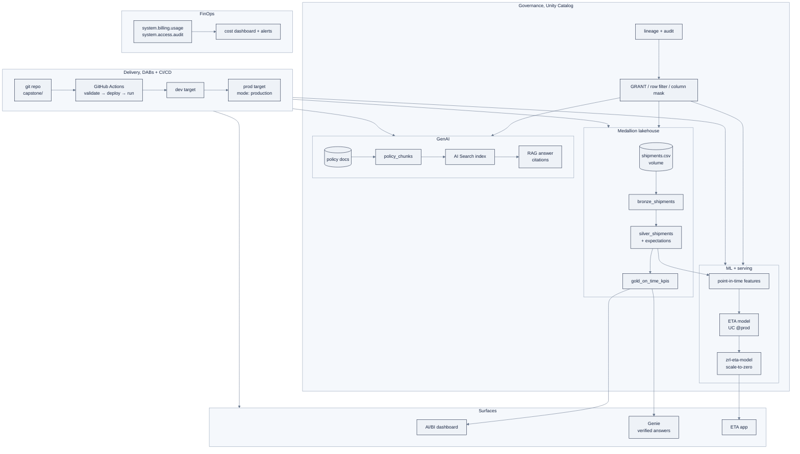

# Capstone: ZoroLogistics Lakehouse Intelligence

> Part of AI Engineering Lab · Developed by Zorost Intelligence AI Lab · [zorost.com](https://zorost.com)

The final project of the Databricks module (Weeks 21 to 24): ship the **entire** ZoroLogistics
stack, medallion lakehouse, point-in-time ETA model, RAG over shipping policies, Genie, and
an AI/BI dashboard, as **one deployable bundle**, with governance and FinOps. This is the
artifact that proves "hero," not "reader."

---

## 1. Goals

Build a governed, serverless lakehouse AI system for ZoroLogistics (a fictional freight
company) that:

1. Ingests the Week-1 CSV into a **medallion lakehouse** (bronze → silver → gold) with data
   quality **expectations**.
2. Trains and serves a **point-in-time ETA model** (delay-hours regression) behind the
   **Unity AI Gateway**.
3. Answers policy questions with **RAG over shipping policies**, with citations and a
   measured **groundedness** score.
4. Lets ops analysts ask questions in **Genie** and see **verified** answers.
5. Exposes an **AI/BI dashboard** of on-time KPIs.
6. Ships all of it via a **Declarative Automation Bundle** (`databricks.yml`) with a
   **FinOps** dashboard and an **audit** trail.

---

## 2. Architecture



**Layer → artifact map:**

| Layer | Artifact | File/feature |
|---|---|---|
| Bronze | `bronze_shipments` | `src/pipeline.sql` (Auto Loader from volume) |
| Silver | `silver_shipments` (cleaned, expectations) | `src/pipeline.sql` |
| Gold | `gold_on_time_kpis` (aggregate) | `src/pipeline.sql` |
| Features | point-in-time feature table | Week 23 notebook |
| Model | ETA regressor registered in UC, `@prod` alias | MLflow |
| Serving | `zrl-eta-model` endpoint, gateway rate limit | Model Serving |
| RAG | `policy_chunks` → AI Search index → `ai_query` | Vector Search + AI functions |
| Genie | Genie space on gold tables, verified answers | Genie |
| BI | On-time AI/BI dashboard | `.lvdash.json` |
| Ops | FinOps dashboard + audit query | `system.billing.*`, `system.access.audit` |

### 2.1 The full architecture (governance + CI/CD included)

The diagram above shows the *data + AI* flow. The complete picture adds the two cross-cutting
layers every artifact passes through, **governance** (Unity Catalog) and **delivery** (DABs +
CI/CD):



Two ideas matter here: **every rectangle is a governed UC securable**, and **every rectangle is
deployed by the bundle**, so the governance and delivery layers wrap the whole stack, not just
the data.

---

## 3. Asset bundle layout

```
capstone/
├── README.md                  # this spec
├── README-run.md              # step-by-step run instructions
├── databricks.yml             # bundle: variables, targets, resources (pipeline + job + dashboard)
└── src/
    ├── pipeline.sql           # Lakeflow (DLT) bronze → silver → gold
    ├── train_eta.py           # (your Week-23 notebook/py) point-in-time features + model train
    ├── dashboards/
    │   └── ontime.lvdash.json # AI/BI on-time dashboard (AI/BI export)
    └── sql/
        └── finops_audit.sql   # cost + audit queries (finops dashboard dataset)
```

`databricks.yml` declares the resources; `src/` holds the code. `sql/` holds the dashboard
datasets; the `.lvdash.json` is exported from the AI/BI editor. (The starter bundle ships
`pipeline.sql`; `train_eta.py` and the dashboards are yours to add from Weeks 23 to 24.)

---

## 4. Phase-by-phase build plan (Week 21 → 24)

Build the capstone in four phases, one per week, each phase closes the gates it enables:

| Phase | Week | What you build | Files you lean on | Gates closed |
|---|---|---|---|---|
| **P0: Governed lakehouse** | 21 | Catalog/schema/volume, upload CSV, bronze→silver→gold pipeline with expectations, job that runs it | `01` to `06`, `15` | G1, G2, G3 |
| **P1: ETA model + serving** | 23 | Point-in-time features, train + register the ETA model (`@prod`), serve `zrl-eta-model` behind the gateway | `07` to `10` | G4, G5 |
| **P2: RAG + Genie** | 23 | `policy_chunks`, AI Search index, RAG chain with citations + eval, Genie space with verified answers | `11` to `13` | G6, G7 |
| **P3: Surface + productionize** | 24 | AI/BI dashboard, (optional) ETA app, governance (mask/filter/audit), FinOps dashboard + cost win, promote dev → prod | `14`, `16`, `17`, `15` | G8, G9, G10 |

**P0 detail (Week 21):** `databricks bundle validate --strict` → `deploy -t dev` → `run
etl_job` → confirm bronze/silver/gold counts (README-run.md walks it). The expectations must
fire on the planted null `weight_kg` rows, that drop is G2.

**P1 detail (Week 23):** assemble point-in-time features from `silver_shipments` (no leakage,
join on `planned_departure` AS OF), train a delay-hours regressor, register in UC, alias `@prod`,
then create a scale-to-zero endpoint and `put-ai-gateway` a rate limit. Warm prediction < 1 s
and a 429 on rate-limit trip is G5.

**P2 detail (Week 23):** chunk the four policy docs → Delta Sync index (managed GTE) → hybrid
retrieve → `ai_query` with citations. Measure recall@5 ≥ 0.9 and groundedness ≥ 0.95 (G6).
Configure a Genie space over `gold_on_time_kpis` + `carriers`, verify 10 canonical questions (G7).

**P3 detail (Week 24):** export `ontime.lvdash.json` and uncomment the dashboard resource (G8).
Add the row filter + column mask + audit query (G9). Build the cost dashboard, set a budget
alert, and document one cost win with a before/after DBU delta (G10). Finally `bundle deploy -t prod`.

---

## 5. Acceptance gates

Each gate is an **inspectable artifact with a number**, a reviewer can verify it without
asking you what you meant.

| # | Gate | Artifact | Threshold |
|---|---|---|---|
| **G1** | Bundle valid + deployable | `databricks bundle validate --strict` + `deploy -t dev` | exits 0; pipeline/job/dashboard exist |
| **G2** | Pipeline passes expectations | Lakeflow run + expectation metrics | all `FAIL UPDATE` constraints pass; drop-rate reported |
| **G3** | Bronze/silver/gold populated | `SELECT COUNT(*)` per table | bronze > 0, silver ≤ bronze (drops), gold aggregates by carrier+month |
| **G4** | ETA model trained & registered | MLflow run + UC model, `@prod` alias | MAE on held-out test < **0.75 days** (18 h) of delay |
| **G5** | ETA served + governed | `zrl-eta-model` endpoint + gateway rate limit | warm prediction < 1 s; 429 on rate-limit trip |
| **G6** | RAG grounded | policy Q&A with citations + eval | recall@5 ≥ **0.9**; groundedness ≥ **0.95** (judge) |
| **G7** | Genie verified | Genie space on gold tables | 10 canonical questions answered, SQL verified by a human |
| **G8** | Dashboard live | on-time AI/BI dashboard | renders on `gold_on_time_kpis`; cross-filter works |
| **G9** | Governance | row filter + column mask + audit query | non-privileged user sees masked/region-filtered data |
| **G10** | FinOps | cost dashboard + one cost win | budget alert set; before/after DBU delta documented |

> Thresholds are **minimums**. The gate is binary: the number is met or it is not. If a
> threshold is not met, you iterate (error analysis first), the same loop as Week 11.

---

## 6. Scoring rubric

100 points, one row per gate, score by whether the **artifact** and the **number** both hold:

| Gate | Criterion | Points | Full marks = |
|---|---|---|---|
| G1 | Bundle correctness | 10 | `validate --strict` exits 0; `deploy -t dev` creates pipeline + job + dashboard |
| G2 | Data quality | 10 | Every `FAIL UPDATE` constraint passes; drop-rate reported and matches the planted rows |
| G3 | Medallion populated | 10 | bronze > 0; silver ≤ bronze; gold aggregates by carrier + month |
| G4 | Model quality | 10 | Registered model with signature + `@prod`; MAE < 0.75 days |
| G5 | Serving | 10 | `zrl-eta-model` READY; warm prediction < 1 s; 429 on rate-limit trip |
| G6 | RAG grounded | 10 | Cited answers; recall@5 ≥ 0.9 **and** groundedness ≥ 0.95 |
| G7 | Genie verified | 10 | 10 canonical answers, SQL verified by a human |
| G8 | Dashboard | 5 | Renders on gold; cross-filter works |
| G9 | Governance | 10 | Non-privileged user sees masked + region-filtered data; audit query returns it |
| G10 | FinOps | 10 | Cost dashboard live; budget alert set; before/after DBU delta documented |
| n/a | **Write-up** | 5 | Architecture diagram + one failure you traced + what you'd do next |

| Score | Grade |
|---|---|
| 90 to 100 | **Pass with Honors** (all gates + a written error-analysis note for one failed eval + the FinOps dollar delta) |
| 75 to 89 | **Pass** (all 10 gates met) |
| 60 to 74 | **Not yet** (gates G1 to G3 green but a GenAI/production gate missing) |
| < 60 | **Incomplete** (lakehouse itself not shippable) |

**Honors bar:** pass + a written error-analysis note for one failed eval and its fix, plus the
FinOps dollar delta. **Pass:** all 10 gates met.

---

## 7. Portfolio instructions

The capstone is your portfolio centerpiece. To make it *provable* to a hiring manager:

1. **README-run.md is your runbook**: a stranger must be able to reproduce your result from
   it alone.
2. **Screenshots**: one each of: the pipeline DAG (green), the serving endpoint, the RAG
   answer *with citations*, the Genie verified answer, the dashboard, and the cost dashboard.
3. **Numbers, not adjectives**: cite G4's MAE, G6's recall/groundedness, and G10's cost
   delta in your README's "Results" section.
4. **Link the bundle**: the repo URL + the `databricks.yml` prove it is code, not a demo
   video.
5. **A one-page write-up**: architecture (the Mermaid diagram above), one thing that broke
   and how you found it in the traces/audit log, and what you would do next.

---

## 8. Troubleshooting appendix

| Symptom | Likely cause | Fix |
|---|---|---|
| `bundle validate` fails on a path | `resources/` files use `../src`, `databricks.yml` uses `./src` | Match the path rule per file |
| Pipeline stuck `INITIALIZING` | Serverless cold start | Wait a few minutes, don't kill it |
| Bronze has 0 rows | Volume path mismatch | `databricks fs ls dbfs:/Volumes/zrl_/zorologistics/raw/` |
| `Cannot create streaming table from batch query` | Bronze source missing `STREAM` | Use `STREAM read_files(...)` |
| `PERMISSION_DENIED` on volume | Missing volume grants | Grant `READ VOLUME` / `WRITE VOLUME` |
| Endpoint stuck `NOT_READY` | Provisioning (or build failure) | Read `build-logs <NAME> <ENTITY>`; wait up to ~30 min for provisioned throughput |
| RAG recall < 0.9 | Right doc retrieved ranked late (or not at all) | Fix ranking/reranking if MRR is high; fix chunking/embedding if MRR is low |
| Genie returns a wrong SQL join | Missing instructions/example | Add the join path + units to the instructions, add a verified example |
| Dashboard "no selected fields" | `query.fields[].name` ≠ `encodings[].fieldName` | Make them byte-identical |
| Cost dashboard shows no rows | System schemas not granted | `GRANT USE CATALOG ON CATALOG system` + `USE SCHEMA`/`SELECT` on `system.billing` |
| `bundle deploy -t prod` refused | `mode: production` lock | Deploy to the intended target; confirm you're not overwriting prod by accident |
| RAG answer invents a rate | Top chunks not retrieved (or low score) | Add a confidence threshold; decline below it |
| Serving endpoint `PERMISSION_DENIED` on first query | Agent/endpoint missing `resources=[...]` passthrough | Declare the LLM/VS/UC resources at log time |
| Dashboard not portable | Query hardcodes catalog/schema | Use bare table names; set `--dataset-catalog`/`--dataset-schema` |
| Genie SQL averages a percentage | Missing "recompute from counts" instruction | Add the instruction + a verified example |

---

## 9. Demo script (the 10-minute portfolio walk)

A reviewer will give you ~10 minutes. Run it in this order, each step is a visual:

1. **`bundle validate --strict` + `deploy -t dev`**: "it ships as code" (G1).
2. **Pipeline DAG** (green), the medallion ran with expectations (G2/G3).
3. **Serving endpoint**: `zrl-eta-model` READY + a warm prediction < 1 s (G5).
4. **RAG answer with citations**: a policy question answered with `[POL-002]` cited (G6).
5. **Genie verified answer**: one canonical question, SQL open (G7).
6. **Dashboard**: on-time KPIs, cross-filter one carrier (G8).
7. **Governance**: the same query as a non-privileged user shows masked + scoped data (G9).
8. **Cost dashboard**: the 7-day moving average + the one documented cost win (G10).

End with the one-line write-up: the MAE, the recall/groundedness, and the cost delta.

## 10. Results template (copy into your write-up)

```markdown
## Results
- **G4 MAE:** <0.75 days> on held-out test
- **G6:** recall@5 = <0.9x>, groundedness = <0.9x>
- **G10:** moved <pipeline> from <classic/all-purpose> to <serverless>;
  DBU delta <x> → <y>, $ delta <z>/month
- **One thing that broke:** <the failure>, found via <trace/audit query>, fixed by <the fix>
- **Next:** <what you'd build next>
```

The template forces **numbers, not adjectives**, the same habit as every acceptance gate.

## 11. Extension ideas (after the gates are green)

The capstone is a *floor*, not a ceiling. Natural next steps, each one more portfolio signal:

| Extension | What it adds | Touches |
|---|---|---|
| Streaming ingestion | Auto Loader → streaming bronze instead of one-shot | `06` |
| Support-triage agent | A `ResponsesAgent` that answers *and* escalates | `13` |
| Knowledge Assistant | Turn the RAG lab into a managed document-Q&A brick | `13` |
| Metric views | Govern "on-time %" as one shared KPI | `14` |
| ABAC governed tags | Replace hand-attached masks with tag-driven policies | `16` |
| Lakebase online store | Serve point-in-time features at <10 ms | `08` |

Each extension is a *module file* you already read, the capstone's bundle just grows one
resource at a time, promoted through the same `dev → prod` path.

## 12. Definition of done

The capstone is **done** when a stranger can run `README-run.md` end to end and reproduce all
ten gates, not when *you* can. That single test (stranger-reproducibility) is what separates a
portfolio centerpiece from a demo that only works on your machine. If a fresh clone fails
anywhere in `validate → deploy → run → verify`, the runbook is not done.

One more time, the loop: **build → break → trace → fix → re-gate.** The capstone is not a
checklist you finish once; it is the artifact you can rebuild from memory, on a stranger's
machine, and point to as proof. Ship it, screenshot it, and put the numbers on it.

---

## Sources

- Declarative Automation Bundles: https://docs.databricks.com/dev-tools/bundles/
- Lakeflow Pipelines (DLT): https://docs.databricks.com/ldp/
- Model Serving: https://docs.databricks.com/machine-learning/model-serving/
- AI Search: https://docs.databricks.com/ai-search/ai-search/
- AI functions: https://docs.databricks.com/large-language-models/ai-functions
- Genie: https://docs.databricks.com/genie/
- AI/BI dashboards: https://docs.databricks.com/dashboards/
- Billing system tables: https://docs.databricks.com/admin/system-tables/billing

> *Original AI Engineering Lab writing; thresholds, bundle schema, and product names change, verify
> against the live links above.*

---

© 2026 Zorost Intelligence LLC · [zorost.com](https://zorost.com)
