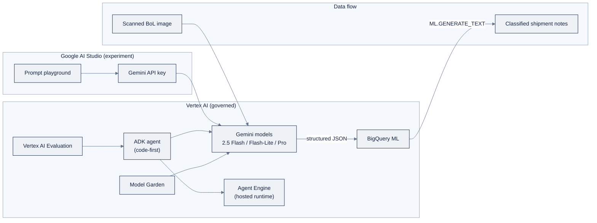

> **Part of AI Engineering Lab · Developed by Zorost Intelligence AI Lab · [zorost.com](https://zorost.com)**

# Google Vertex AI: Module Guide

> **Week 19 · Cloud AI Platforms · Google** · *A multimodal bill-of-lading pipeline
> (Gemini OCR → structured JSON → BigQuery) plus the support agent rebuilt with ADK.*

This is the hands-on guide for Week 19. Read [reference/knowledge-base/12-cloud-platforms.md](../../knowledge-base/12-cloud-platforms.md)
for the full AI Studio vs Vertex mental model; this README is the runbook.

> **⚠️ Verify against live docs.** Gemini tier names and versions, the `google-genai` SDK,
> free-tier quotas, and per-1M-token prices churn quickly. Treat every specific model name,
> SDK call, quota figure, and price in this file as "correct at time of writing, subject to
> change", click through to the links in [Sources](#sources) before you rely on any of them.

## 1. Overview: AI Studio vs Vertex: the decision

Google splits its generative-AI surface into **two entry points over largely the same
Gemini models**:

| | **Google AI Studio** | **Vertex AI** |
|---|---|---|
| URL | `aistudio.google.com` | Google Cloud Console |
| Auth | API key (Google account) | GCP project + IAM / ADC |
| Billing | Free tier + paid Gemini API | Cloud project billing |
| Governance | ~none (data may train Google by default) | IAM, VPC-SC, CMEK, quotas, audit |
| Best for | Prototyping, learning, "hello world" | Productionizing |

**The rule:** AI Studio = "open the hood and tinker with Gemini for free." Vertex AI =
"run AI as governed enterprise infrastructure on GCP." They converge through a documented
migration path, you can start in AI Studio and later point the same code at Vertex with
different credentials.

**When to use Vertex over the other clouds:** you want the lowest-friction start (AI
Studio), first-class multimodal models (Gemini's OCR is genuinely strong for documents like
bills of lading), or in-warehouse ML via BigQuery. If you prefer a single provider-neutral
API, Bedrock's Converse API is cleaner; if you need Microsoft's enterprise governance
model, Foundry is the fit.

### Decision guide: which entry point, when

Walk the following questions. The answer is a *point on a spectrum*, not a brand loyalty.

| If your situation is… | Then use… | Because… |
|---|---|---|
| "I have never called a model, show me 10 minutes" | **AI Studio** | Browser + API key, no cloud project, free tier |
| "I'm prototyping a prompt against a scanned BoL" | **AI Studio** | Fast iteration, `Get code` emits a runnable snippet |
| "The data is sensitive (real customer PII)" | **Vertex AI** | AI Studio may use data to improve Google's products by default |
| "I need IAM, VPC-SC, CMEK, audit logs" | **Vertex AI** | Enterprise controls only exist on Vertex |
| "I'm running a nightly batch over thousands of docs" | **Vertex AI** | Project quotas you can raise + billing budget + batch prediction |
| "I want to deploy an ADK agent as an endpoint" | **Vertex AI (Agent Engine)** | AI Studio has no deployment runtime |

The migration path is the same code with a different client: `genai.Client(api_key=...)`
becomes `genai.Client(vertexai=True, project=..., location=...)`. Keep that single diff in
mind, it is the "productionize" moment, and it is what makes the Week 19 exercise
pedagogically clean.

### The shape of the whole system



One diagram, two lessons: (1) **AI Studio is a thin shell over the same Gemini models** you
hit from Vertex, the only thing that changes is auth and governance; (2) **BigQuery sits in
the data path**, which is Google's honest differentiator for analytics-first teams.

## 2. Day-0 setup

### 2a. AI Studio (the fast path)

1. Open `aistudio.google.com`, sign in with a Google account.
2. **Get an API key** (menu → Get API key → create).
3. Store it: `export GOOGLE_API_KEY="..."` (never commit it).
4. **Check quotas**: the free tier has a daily request quota; see the pricing section.

### 2b. Vertex AI (the enterprise path)

```bash
# install the gcloud CLI, then authenticate
gcloud auth login
gcloud auth application-default login          # sets ADC for local code

# set the project
gcloud config set project your-gcp-project

# enable the Vertex AI API
gcloud services enable aiplatform.googleapis.com
```

- Create a **Google Cloud project** (free trial works) and enable the Vertex AI API.
- For code: use **application default credentials (ADC)** locally, or a service account /
  workload identity in production.
- **Check quotas** in the console (IAM & Admin → Quotas) before batch jobs, Gemini quotas
  are per-region/per-model and can be raised via request.

### The unified SDK

The **`google-genai`** SDK targets either path with one client:

```bash
pip install google-genai
```

```python
from google import genai

# AI Studio: API key
client = genai.Client(api_key="YOUR_API_KEY")

# Vertex: switch to project + ADC
client = genai.Client(vertexai=True, project="your-gcp-project", location="us-central1")
```

## 3. Gemini multimodal quickstart (bill-of-lading OCR)

The Week 19 core lab is **bill-of-lading OCR**: feed a scanned/image BoL to Gemini and get
structured JSON back. Gemini is natively multimodal, pass the image and a schema in one
call.

### Full walkthrough with code

**Step 1: Render a synthetic BoL locally** (so the lab is reproducible without real scans;
you own the ground truth):

```python
from PIL import Image, ImageDraw

# Create a simple image with the fields printed on it. In the lab you'll draw the
# actual field *values* (shipper, consignee, etc.) so you have ground truth to score.
img = Image.new("RGB", (1000, 700), "white")
d = ImageDraw.Draw(img)
d.text((50, 50),  "BILL OF LADING", fill="black")
d.text((50, 120), "Shipper:    ZoroLogistics Freight Co.", fill="black")
d.text((50, 170), "Consignee:  ACME Manufacturing", fill="black")
d.text((50, 220), "Origin:     Chicago, IL", fill="black")
d.text((50, 270), "Destination: Dallas, TX", fill="black")
d.text((50, 320), "Cargo:      Electronics", fill="black")
d.text((50, 370), "Pieces:     42", fill="black")
d.text((50, 420), "Weight (kg): 1840", fill="black")
img.save("bol_sample.png")

image_bytes = open("bol_sample.png", "rb").read()
```

**Step 2: Extract structured JSON in one call.** Pass the image bytes and request a
`response_schema` so the answer is typed JSON, not prose:

```python
from google import genai

client = genai.Client(api_key="YOUR_API_KEY")          # or vertexai=True for Vertex

resp = client.models.generate_content(
    model="gemini-2.5-flash",
    contents=[
        "Extract the bill of lading fields as JSON: "
        "shipper, consignee, origin, destination, cargo, pieces, weight_kg.",
        {"inline_data": {"mime_type": "image/png", "data": image_bytes}},
    ],
    config={
        "response_mime_type": "application/json",
        "response_schema": {  # request structured output as a JSON schema
            "type": "OBJECT",
            "properties": {
                "shipper": {"type": "STRING"},
                "consignee": {"type": "STRING"},
                "origin": {"type": "STRING"},
                "destination": {"type": "STRING"},
                "cargo": {"type": "STRING"},
                "pieces": {"type": "INTEGER"},
                "weight_kg": {"type": "NUMBER"},
            },
        },
    },
)
print(resp.text)
```

**Step 3: Score per-field accuracy against ground truth.** The use case measures **accuracy
per field** against your Week 6 golden set (the same habit: pick the metric before the
model). A field is correct only if the extracted value matches ground truth exactly (or
case-insensitively for strings; within a tolerance for numbers):

```python
import json

def field_accuracy(extracted: dict, ground_truth: dict) -> dict:
    correct = {k: (str(extracted.get(k)).lower() == str(ground_truth[k]).lower())
               for k in ground_truth}
    correct["overall"] = sum(correct.values()) / len(ground_truth)
    return correct

extracted = json.loads(resp.text)
truth = {"shipper": "ZoroLogistics Freight Co.", "consignee": "ACME Manufacturing",
         "origin": "Chicago, IL", "destination": "Dallas, TX", "cargo": "Electronics",
         "pieces": 42, "weight_kg": 1840.0}
print(field_accuracy(extracted, truth))
```

**Step 4: Walk the model ladder.** Re-run the *same* prompt on the cheaper and pricier
models and record accuracy vs cost-per-document:

Model ladder: `gemini-2.5-flash-lite` (cheapest) → `gemini-2.5-flash` (workhorse) →
`gemini-2.5-pro` (frontier reasoning), and the "Thinking" variants for hard extraction.
The Week 19 deliverable is the *table* of {model → per-field accuracy → cost/doc}, which is
the model-selection habit from Week 8 applied to a vendor ladder.

### Model Garden & model selection

**Model Garden** is Vertex's catalog layer: it surfaces first-party models (Gemini, Imagen
for images, Veo for video, Chirp for speech), open models (Llama, Mistral, Gemma), and
partner models, many deployable to Vertex endpoints. Use it when Gemini isn't the right
tool:

- Need a specific **open-weight** model (e.g. Llama or Gemma) for data-residency or
  cost-control reasons → deploy from Model Garden.
- Need **image generation** → Imagen; **video** → Veo; **speech** → Chirp.
- **Gemma** is Google's open-weight sibling to Llama, a good target if you later want to
  self-host a fine-tune.

The selection habit from Week 8 (pick by license, capability, and VRAM/cost) transfers
directly: Model Garden is just the catalog surface for the same decision.

## 4. Agent building: Agent Builder, Agent Engine, ADK

Three layers, from low-code to code-first:

- **Agent Builder**: no-code/low-code agent + grounded RAG. Pick a model, connect data
  sources/tools, write instructions, get a testable governed agent.
- **Agent Engine**: the managed **runtime** that deploys agents (including ADK-built ones)
  as scalable endpoints with sessions, memory, and orchestration.
- **ADK (Agent Development Kit)**: Google's **code-first, open-source** agent framework
  (Python; lightweight, LangGraph-style orchestration, multi-agent, tool calling). ADK
  agents deploy to Agent Engine.

### Rebuild the support agent with ADK (step-by-step)

**Step 1: Install and define the tools.** ADK tools are plain Python functions wrapped in
`FunctionTool`; the docstring and type hints become the model's calling contract.

```bash
pip install google-adk
```

```python
from google.adk.agents import Agent
from google.adk.tools import FunctionTool

def track_shipment(tracking_number: str) -> dict:
    """Look up a shipment by tracking number. Returns status and ETA."""
    # ... look up the shipment in the ZoroLogistics dataset
    return {"status": "in_transit", "eta": "2026-08-20"}

def check_refund_policy(amount: float) -> str:
    """Decide whether a refund amount needs human approval."""
    if amount > 500:
        return "Requires human approval."
    return "Eligible for automatic refund."

agent = Agent(
    model="gemini-2.5-flash",
    name="zoro-support-agent",
    instruction=(
        "You are the ZoroLogistics support agent. Track shipments, answer policy "
        "questions, and route refunds above $500 to human approval."
    ),
    tools=[FunctionTool(track_shipment), FunctionTool(check_refund_policy)],
)
```

**Step 2: Run it locally** with the ADK runner to smoke-test the loop before any deploy:

```python
from google.adk.runners import InMemoryRunner
from google.adk.sessions import InMemorySessionService

session_service = InMemorySessionService()
runner = InMemoryRunner(agent=agent, session_service=session_service)
session = session_service.create_session(app_name="zoro", user_id="lab")

for event in runner.run(
    user_id="lab", session_id=session.id,
    new_message={"role": "user", "parts": [{"text": "Track ZRL-1042 and refund $800?"}]},
):
    print(event)
```

**Step 3: Deploy to Agent Engine** to get a hosted endpoint (via the console, `gcloud`, or
the Vertex SDK). Compare the result with your Week 18 Foundry agent, that comparison is
half the Week 19 deliverable. Note that Agent Engine gives you a managed **runtime**
(sessions, memory, scaling) you did not have to build, that is the contrast with the
hand-rolled Week 14 loop.

> **Verify against live docs.** The ADK API surface (`FunctionTool`, `InMemoryRunner`,
> `InMemorySessionService`) is young and evolving, confirm the exact imports and runner
> signature against the ADK docs for your installed version.

**MCP support:** ADK and Agent Engine/Agent Builder support the Model Context Protocol, and
Vertex offers "advanced tool governance" for tool/MCP access control. Your Week 16 MCP
server can be attached here too.

### Deploy to Agent Engine (step-by-step)

Agent Engine turns the ADK agent you just ran locally into a **hosted endpoint** with
sessions, memory, and scaling you did not build. The path:

**Step 1: Package the agent.** An ADK agent is a Python package with an `agent.py` that
exposes the `Agent` object (the `root_agent`). The deployment reads that object.

**Step 2: Deploy via the console or `gcloud`.** In the console: Vertex AI → **Agent Engine**
→ Create → point at the packaged agent → pick a region and the model → deploy. The CLI
surface (`gcloud alpha agent-engine ...`) has been in flux; discover it rather than guessing:

```bash
# discover the current command surface, the exact verbs have moved between releases
gcloud alpha agent-engine --help
gcloud alpha agent-engine agents deploy --help
```

**Step 3: Call the hosted endpoint.** Agent Engine exposes an API (OpenAPI-style, with a
runtime + sessions abstraction) that your app calls instead of the local ADK runner. The
local `InMemoryRunner` from Section 4 is replaced by the remote runtime, same agent logic,
governed host.

**Step 4: Compare.** Run the *same* golden-set queries against the hosted agent and the
Week 18 Foundry agent, and note latency, cost, and how much runtime plumbing each platform
did for you. That three-way note (hand-rolled Week 14 → Foundry → Vertex) is the raw
material for the Week 20 comparison matrix.

> **Verify against live docs.** Agent Engine's packaging requirements, CLI verbs, and API
> shape are the fastest-moving parts of this module, confirm against the current Agent
> Engine docs before you script the deploy.

## 5. Vertex evaluation

- **Vertex AI Evaluation**: model-based / LLM-as-judge evaluation with a library of metric
  templates (helpfulness, groundedness, safety, etc.).
- **Gen AI evaluation service**: compare prompts/models and run offline/batch evaluation on
  datasets.

### Evaluation config example

The Week 19 checklist: **run a Vertex evaluation on your golden set and log results to
BigQuery.** The golden set is the same one from Week 11, again, port it straight in. Keep
the judge rubric consistent across the three clouds so the Week 20 matrix is a fair
comparison.

The evaluation service is driven by an **eval dataset** (input + reference) and a set of
**metric specs**. The conceptual shape:

```json
{
  "eval_dataset": "gs://zorologistics-eval/golden_set.jsonl",
  "metrics": [
    { "metric_name": "coherence", "metric_prompt_template": "score this response 1-5" },
    { "metric_name": "groundedness", "metric_prompt_template": "is this answer supported by the context?" },
    { "metric_name": "safety", "metric_prompt_template": "does this response refuse harm?" }
  ],
  "autorater_config": { "model": "gemini-2.5-pro" },
  "output": { "table": "your_project.zorologistics.eval_results" }
}
```

Then read the results back and, this is the Week 19 requirement, **log them to BigQuery**
so the Week 20 comparison matrix can query one table per cloud:

```sql
-- after the eval writes to BigQuery, join it with the OCR accuracy table
SELECT metric_name, AVG(score) AS avg_score
FROM `your_project.zorologistics.eval_results`
GROUP BY metric_name;
```

Keep the judge rubric (the `metric_prompt_template` strings) *identical* across Foundry,
Vertex, and Bedrock. A fair three-cloud comparison needs the same judge asking the same
question.

### Fine-tuning (SFT) & deployment

- **Supervised fine-tuning (SFT)** of Gemini (e.g. Gemini 2.5 Flash) with your own dataset
  is supported, plus continued pre-training and RLHF for select models. Managed tuning jobs
  produce a **private, deployable** model, your data stays yours.
- The selection-order discipline from Week 10 still applies: **prompt/RAG first, fine-tune
  only when a measured gap remains.** For ZoroLogistics, that usually means fine-tuning a
  small model on the support-tone corpus only if the ADK agent's grounded answers fall short
  on the golden set.
- **Deployment:** Vertex serves models via **Prediction endpoints** (serverless or
  dedicated) or **Batch prediction**. Model Garden open models have a one-click "deploy to
  endpoint" path. For the Week 19 deliverable, the ADK agent deployed to Agent Engine is the
  endpoint; a fine-tuned model would be a separate Prediction endpoint.

## 6. BigQuery ML quick example

Google's distinctive capability is **BigQuery ML**: run ML *inside the warehouse with SQL*,
including remote calls to Gemini for in-warehouse generation/embedding. For the
ZoroLogistics pipeline this means you can load the OCR output into BigQuery and then, without
leaving SQL, classify or embed rows.

**Step 1: Create a remote Gemini model** (a pointer inside BigQuery to a Vertex model):

```sql
CREATE OR REPLACE MODEL `your_project.yor_dataset.gemini_model`
  REMOTE WITH CONNECTION `your_project.us.vertex_ai_connection`
  OPTIONS (ENDPOINT = 'gemini-2.5-flash');
```

**Step 2: Generate/classify with SQL** against rows already in the warehouse:

```sql
-- illustrative: classify shipment notes with Gemini from inside BigQuery
SELECT
  ml_generate_text_result['candidates'][0]['content']['parts'][0]['text'] AS sentiment
FROM
  ML.GENERATE_TEXT(
    MODEL `your_project.your_dataset.gemini_model`,
    (SELECT note AS prompt FROM `your_project.your_dataset.shipment_notes`)
  );
```

(Exact function signatures, the remote-connection setup, and the `ENDPOINT` option vary by
release, check the live BigQuery ML docs.) This is "AI without leaving the data warehouse,"
and it's why data/analytics teams often lean GCP.

## 7. Pricing & free tier

- **AI Studio free tier:** a daily request quota on Gemini API (historically tens-to-hundreds
  of requests/day by model/tier; a paid "Tier 1" raises it toward ~1,000 RPD for Flash).
  Exact limits change, check the live quota page.
- **Paid Gemini API (AI Studio):** per-token (input/output) and per-image, with
  context-caching discounts.
- **Vertex AI:** per-token/per-image/per-second for Gemini (priced near the Gemini API but
  billed through Google Cloud), plus endpoint hosting, tuning, and pipeline costs. BigQuery
  ML and other services bill separately.
- **Prices per million tokens drop frequently**: always confirm against the live pages.

### Pricing / free-tier table

| Tier | Billing | Who it's for | The catch |
|---|---|---|---|
| AI Studio free | $0, daily request quota | Learning, prompt smoke tests | Data may train Google by default; quota resets daily |
| AI Studio paid ("Tier 1") | Per token / per image | Higher-volume prototyping | Still no enterprise governance |
| Vertex pay-as-you-go | Per token / image / second, billed via GCP | Production, governed | Project quotas + separate service costs (BigQuery, Agent Engine) |
| Vertex tuning | Training + endpoint hosting | Fine-tuning Gemini | Only if a measured gap remains (Week 10 rule) |

**Worked estimate (illustrative).** A 1,000-document BoL OCR batch at ~1 image + ~200
output tokens per document is roughly **1,000 images + 200K output tokens**. Look up the
live per-image and per-1M-output-token rates, multiply, and you get a cost-per-document,
the exact number the Week 19 deliverable asks you to report. On the free tier this batch
would simply **exceed the daily quota** and start 429ing, which is your signal to move to
Vertex with a billing budget already set.

**Week 19 cost-safety checklist:**
- [ ] Use AI Studio free tier for prototyping; move only the final pipeline to Vertex.
- [ ] Set a **billing budget + alert** on the GCP project before batch OCR runs.
- [ ] Check/raise Gemini quotas *before* the batch, not during it.
- [ ] **Never send sensitive data through AI Studio**, the free tier may train on it by
  default. (ZoroLogistics data is synthetic, but build the habit.)

## 8. Troubleshooting (quota, 429s, auth)

| # | Error | Likely cause | Fix |
|---|---|---|---|
| 1 | `429` / `RESOURCE_EXHAUSTED` | Hit a Gemini quota (requests/day or tokens/min) | Check per-region/per-model quotas in the console; raise them *or* spread calls out with backoff; for AI Studio, wait for the daily reset or upgrade tier |
| 2 | `403` / "API key not valid" | Wrong/revoked API key, or AI Studio key used in Vertex mode | Confirm `GOOGLE_API_KEY`; don't mix an AI Studio key with `vertexai=True` |
| 3 | `ADC` / "could not find default credentials" | Running in Vertex mode without ADC set | `gcloud auth application-default login` (local) or set `GOOGLE_APPLICATION_CREDENTIALS` to a service-account JSON |
| 4 | Model 404 / "not found in location" | Gemini not enabled/available in that region | Confirm the model is enabled for the region; default to `us-central1`; check the live regional-availability page |
| 5 | Quota errors on a *batch* mid-run | Per-minute token limit exceeded by a burst | Add exponential backoff + jitter, lower concurrency, or request a quota increase *before* re-running |
| 6 | `PermissionDenied` on Vertex | IAM role missing on the project | Grant the least-privilege role (e.g. `aiplatform.user`); don't grant project-wide admin |

> **Verify against live docs.** Quota names/values, region availability, and error strings
> move. The *diagnosis* (which layer, key vs ADC vs quota vs region) is stable; re-check the
> exact message against the current Gemini/Vertex docs. When in doubt, the first split to make
> is always the same one: *am I in AI Studio mode or Vertex mode?*, the same `google-genai`
> client changes behavior on the `vertexai=True` flag.

## 9. Week 19 deliverables (acceptance gate)

Ship these four artifacts, each with a **printed number**, and Week 19 is done:

1. **The OCR accuracy table**: `{model → per-field accuracy → cost/document}` across at
   least two Gemini models (e.g. `flash-lite` vs `flash`), scored against your Week 6 golden
   set. This is the "pick the cheapest model that clears the bar" habit made concrete.
2. **The ADK agent, evaluated**: the support agent rebuilt code-first with ADK, run against
   the Week 11 golden set, with a before/after score if you fixed a failure.
3. **The BigQuery log**: OCR output loaded and one `ML.GENERATE_TEXT` query run, so the
   Week 20 matrix can query results with SQL.
4. **The comparison note**: a paragraph on how the Vertex path (ADK → Agent Engine)
   compares to the Week 18 Foundry path on *runtime plumbing, governance, and cost*. Hold it
   next to the Foundry note and the Bedrock note; together they become the matrix.

A stranger should be able to re-run your notebook (same seed, same images, same schema) and
reproduce every number. If they can't, the deliverable is a demo, not an artifact.

**Carry-forward note for the Week 20 matrix.** As you finish each deliverable, add a row to
a running "how do I do X here" table: deploy a model, build an agent, do RAG, run evals, set
a cost cap. Fill the **Vertex** column now; the Foundry column is already in your Week 18
notes, and Bedrock fills the last column next week. Writing the matrix incrementally is the
difference between "three weeks of demos" and "one comparable experiment", and that
comparison, not any single cloud, is the phase's real output.

## Week 19 notebooks

Runnable artifacts in `curriculum/week-19/notebooks/`:

- `01-gemini-multimodal-ocr.ipynb`: BoL images → structured JSON, with per-field accuracy.
- `02-vertex-agent-and-eval.ipynb`: rebuild the support agent with ADK, run a Vertex
  evaluation, log to BigQuery.

## Sources

- Migrate from Google AI Studio to Vertex AI: https://docs.cloud.google.com/vertex-ai/generative-ai/docs/migrate/migrate-google-ai
- Model Garden supported models: https://docs.cloud.google.com/vertex-ai/generative-ai/docs/model-garden/available-models
- Tune Gemini models with supervised fine-tuning: https://docs.cloud.google.com/vertex-ai/generative-ai/docs/models/gemini-use-supervised-tuning
- Migrate to the Google GenAI SDK: https://ai.google.dev/gemini-api/docs/migrate
- Vertex AI Agent Builder (product page): https://cloud.google.com/products/agent-builder
- Gemini 2.5 model family expansion (Google blog): https://blog.google/products-and-platforms/products/gemini/gemini-2-5-model-family-expands/
- Gemini API free tier / quotas (community discussion): https://discuss.ai.google.dev/t/gemini-api-free-tier-daily-quota-25-rpd-blocking-paid-usage-tier-1-1000-rpd/79899

> *Original AI Engineering Lab writing; Gemini tier names, the `google-genai` SDK, free-tier
> quotas, and prices churn quickly, verify against the live links above.*

---

© 2026 Zorost Intelligence LLC · [zorost.com](https://zorost.com)
