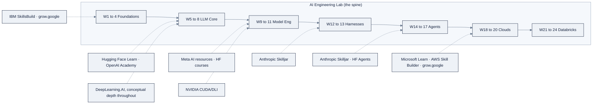

# Free AI Learning Resources: Curated by AI Engineering Lab

> The big AI companies all teach their own stacks for free. This page catalogs the
> ten major programs, tells you what each one is *actually good for*, and maps it to
> the weeks of this program, so you always know which external course complements
> the week you are in.
>
> **How to use this page:** this program is your spine; these resources are the
> cross-training. Do the Zorost week first, then dip into the mapped resource if you
> want a second explanation, a vendor's official voice, or a certificate to show.

**Part of AI Engineering Lab · Developed by [Zorost Intelligence AI Lab](https://zorost.com) · zorost.com**

---

## The ten company programs

| # | Provider | Link | What it is | Best for | Pairs with weeks |
|---|---|---|---|---|---|
| 1 | **Anthropic** | [anthropic.skilljar.com](https://anthropic.skilljar.com) | Anthropic's official courses: Claude API, prompt engineering, tool use, MCP, Claude Code | The vendor voice on prompting, agents, and MCP, straight from the team that builds Claude | W6, W12, W14, W16 |
| 2 | **Google** | [grow.google/ai](https://grow.google/ai) | Google's AI learning hub: essentials, Gemini, Vertex AI paths | Beginner-friendly AI literacy, then Google Cloud's GenAI stack | W1 to 5, W19 |
| 3 | **Meta** | [ai.meta.com/resources](https://ai.meta.com/resources/) | Meta AI's resource hub: Llama models, research papers, tooling docs | Understanding the Llama open-weight ecosystem from its source | W8 to 10 |
| 4 | **NVIDIA** | [developer.nvidia.com/cuda](https://developer.nvidia.com/cuda) | The CUDA platform docs and GPU programming resources (plus DLI courses) | What a GPU actually is, CUDA fundamentals, why VRAM math works the way it does | W8 to 9 |
| 5 | **Microsoft** | [learn.microsoft.com/training](https://learn.microsoft.com/en-us/training/) | Microsoft Learn: free structured paths for Azure, AI Foundry, Copilot | The official Azure AI Foundry training that Week 18 builds on; AZ/AI cert prep | W18 |
| 6 | **OpenAI** | [academy.openai.com](https://academy.openai.com) | OpenAI Academy: free courses and live sessions on OpenAI tools and AI fluency | API patterns, structured outputs, and a second vendor's framing of prompt engineering | W5 to 7 |
| 7 | **IBM** | [skillsbuild.org](https://skillsbuild.org) | IBM SkillsBuild: free tech career courses with credentials | Beginners who want a structured, credentialed on-ramp; also strong on AI ethics | W1 to 3 |
| 8 | **AWS** | [skillbuilder.aws](https://skillbuilder.aws) | AWS Skill Builder: the official AWS training platform, incl. Bedrock and ML paths | The official Bedrock/SageMaker training behind Week 20; AWS cert prep | W20 |
| 9 | **DeepLearning.AI** | [deeplearning.ai](https://www.deeplearning.ai) | Andrew Ng's course platform: short courses and specializations across GenAI, ML, agents | The conceptual depth behind this program's framework, short courses pair beautifully with hard weeks | W3 to 11, W14 to 16 |
| 10 | **Hugging Face** | [huggingface.co/learn](https://huggingface.co/learn) | HF's free courses: NLP/Transformers, smol models, agents, audio, ML for games | Hands-on transformers, tokenizers, and the HF Agents course, the closest free cousin to Weeks 5 to 10 | W5 to 10, W14 |

## Honorable mention: systems thinking

| Resource | Link | Why it is here |
|---|---|---|
| **Best System Design Resources** | [github.com/javabuddy/best-system-design-resources](https://github.com/javabuddy/best-system-design-resources) | A curated index of system-design material. AI engineering *is* system design with probabilistic components, cost, reliability, and scale tradeoffs (Skill 2 of the Skills Map) are learned here. Pairs with **W1 to 2, W13, W18 to 24**. |

## The mapping, by phase

## Rules for using external courses

1. **The spine wins.** If an external course conflicts with your week, finish the
   week first. Depth in one curriculum beats five half-finished ones.
2. **Vendor courses teach vendor tools.** Anthropic's prompt course is excellent,
   and it teaches Claude. The transfer skill (you, on a second vendor's model) is
   exactly what Weeks 18 to 20 drill.
3. **Certificates are byproducts.** If a course offers one, take it, but the
   artifact this program builds (your fork, your tracker, your capstone) is the
   credential that survives an interview.
4. **Found a better free resource?** Add it, see [.github/CONTRIBUTING.md](../../.github/CONTRIBUTING.md).
   Keep entries free-tier genuine, named, and mapped to a week.

---
© 2026 Zorost Intelligence LLC · [zorost.com](https://zorost.com)
