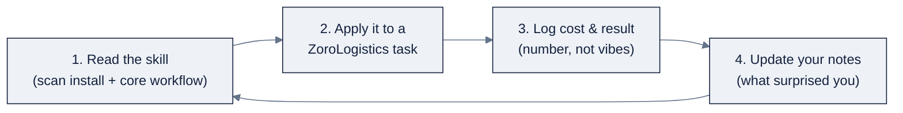

# AI Engineering Lab: Skills Library

> **Find the Signal. Act with Intelligence.** · Developed by [Zorost Intelligence AI Lab](https://zorost.com)
>
> Part of AI Engineering Lab · Developed by Zorost Intelligence AI Lab · zorost.com

The **skills library** is a set of focused, hands-on guides for the tools you run while
building in this program. Each one is a "how-to card" you keep beside you in a terminal,
not a textbook to read cover to cover, but a reference to glance at the moment you need the
exact install command, config key, or the fix for the failure you just hit.

---

## What a "skill" is in this program

A **skill** here is a *short, actionable guide to one tool*, structured so you can find the
answer in seconds while you work. It is deliberately narrow: one skill, one tool, one set
of commands. When you're staring at a new harness and thinking "how do I authenticate? what
goes in the rules file? why is this failing?", that's the skill's job.

A skill is **not**:

- a marketing page (no fluff, no upsell),
- a conceptual explainer (that lives in `reference/knowledge-base/`),
- a full API reference (we link the official docs for that).

It *is* the distilled, opinionated, ZoroLogistics-shaped path from "never used this tool"
to "productive this afternoon."

## The skill list

| Skill | One-liner |
|---|---|
| [claude-code](claude-code.md) | Anthropic's terminal coding agent, `CLAUDE.md`, subagents, hooks, MCP, headless CI. |
| [cursor](cursor.md) | Anysphere's AI-native editor, Tab + Agent, Rules, MCP, Cursor Router, team tiers. |
| [deepseek-harness](deepseek-harness.md) | DeepSeek's open-source plugin harness, skills, goals, subagents, workflows, web GUI. |
| [opencode](opencode.md) | SST's terminal-native, model-agnostic agent, `opencode.json`, `AGENTS.md`, TUI. |
| [openrouter](openrouter.md) | One API key routing to hundreds of models, `:free` variants, credits, fallbacks. |
| [ollama-llamacpp](ollama-llamacpp.md) | Local inference with Ollama and llama.cpp, pulls, Modelfiles, GGUF quants, VRAM picks. |

## Agent skills (the other kind of skill)

The guides above teach *you* to use a tool. **[`agent-skills/`](agent-skills/README.md)**
holds the other kind: reusable `SKILL.md` procedures you hand to an *AI agent* so it
follows a senior engineer's workflow, eval-first development, prompt versioning,
context budgeting, RAG checkups, agent loop safety, MCP tool design, error analysis,
deployment gates, and more.

They are original Zorost Intelligence skills in the open `SKILL.md` convention
(agentskills.io), installable into Claude Code, Cursor, OpenCode, and Hermes-class
agents, and they encode the same doctrines this program teaches you, so by Week 12
you can read your agent's playbook because you wrote it.

→ **[Zorost Agent Skills Catalog](agent-skills/README.md)**, 14 skills across the
Define → Build → Verify → Ship lifecycle, with the Zorost clarity standard
(STE-inspired: one action per step, warnings first, evidence at exit).

## Skill template

Every skill guide in this library follows the same eight sections. Keep this template in
mind when you read one, it is also the shape to copy if you write a new skill (see
`.github/CONTRIBUTING.md`).

| # | Section | What it answers |
|---|---|---|
| 1 | **What it is** | One paragraph: who builds it, what it does, where it fits. |
| 2 | **Install & auth** | Exact install command and how to authenticate (account vs API key). |
| 3 | **Core workflow** | The happy path: open → describe → review → verify, with commands. |
| 4 | **Config & rules files** | The memory/config file (CLAUDE.md, opencode.json, .cursor/rules) and a template. |
| 5 | **Power moves** | The 3 to 5 habits that separate effective use from flailing. |
| 6 | **Cost & safety** | Pricing tiers, cost levers, and the blast-radius/secret rules. |
| 7 | **Common failures** | The errors you will actually hit, and the fix for each. |
| 8 | **Sources** | Official docs links (everything above is synthesized from these). |

## How skills connect to the weeks

Skills are not their own module, they are the *operating manuals* you reach for during
specific weeks. The harness skills power **Weeks 12 to 13**; the local-stack skill powers
**Week 8**.

| Week | Week title | Skills you'll use |
|---|---|---|
| 8 | Open Models & Local Inference: GPUs, Ollama, llama.cpp | `ollama-llamacpp` (local inference) |
| 12 | Coding-Agent Harnesses: Claude Code, Cursor, OpenCode, DSH | `claude-code`, `cursor`, `deepseek-harness`, `opencode`, `openrouter` |
| 13 | Agentic Coding Loops & Spec-Driven Development | `claude-code` / `opencode` (rules, hooks, subagents), `openrouter` (model routing + cost) |
| 14 to 17 | Agents (multi-agent, MCP, OpenClaw) | `deepseek-harness` (subagents/workflows), `openrouter` (routing between models) |

**Typical rhythm.** During Week 12 you install two harnesses (Monday), write `SPEC.md`
(Tuesday), then drive each agent against the same task (Wednesday to Thursday) with the
matching skill open in a second pane. The skill supplies the command you forgot, not the
thinking, that part is yours.

## How to practice a skill (the deliberate-practice loop)

Reading a skill once is not learning it. A skill only becomes yours through the same
**deliberate-practice loop** the whole program runs on. It has four steps, and you repeat
them until the tool is boring:

1. **Read**: skim the skill's *Install & auth* and *Core workflow* sections only. You are
   not studying for a quiz; you are looking for the minimum to get one command running.
2. **Apply**: use the tool on a *real ZoroLogistics task*, not a toy. Concrete prompts that
   work: "route this shipment-lane query with `openrouter` and compare two models," or "run
   the Week 8 triage prompt through `ollama-llamacpp` at two quant sizes."
3. **Log cost & result**: write down the *outcome as a number*: tokens used, dollars spent,
   seconds elapsed, accuracy on the golden set, or the specific error you hit. "It worked" is
   not a log entry; "3 models, $0.02, best accuracy 0.91 on 50 cases" is.
4. **Update notes**: append one line to your running notes file (and, if the skill itself
   was wrong or stale, fix the skill, that's how the library stays honest). What surprised
   you? What did the skill get right or miss?

**The loop's metric is cost-per-lesson.** If a practice round costs nothing and teaches you
the one flag you'll use forever, it was a bargain. If it burned budget without a logged
result, it was noise. Run the loop three times on one skill before you move on; the third
round is where the tool stops fighting you.

## Skill combinations (which skills pair for which weeks)

Skills are rarely used alone. The combinations below are the pairings that actually happen
in the weeks, and *why* they pair.

| Week(s) | Skill pairing | Why they pair | The exercise |
|---|---|---|---|
| 8 | `ollama-llamacpp` + `openrouter` | Local vs hosted, same prompt, two bills | Run the triage prompt locally and via a `:free` model; compare latency, quality, and cost |
| 12 | `claude-code` + `cursor` | Terminal vs editor, two harnesses, one task | Drive both against the same spec and diff their output |
| 12 to 13 | `opencode` + `openrouter` | Model-agnostic harness + model router | Swap models mid-task (`/model`) to see quality/cost trade-offs live |
| 13 | `claude-code` + `deepseek-harness` | Rules/subagents in one, goals/workflows in the other | Port a spec-driven loop across both and compare the loops' shapes |
| 14 to 17 | `deepseek-harness` + `openrouter` | Orchestration + model routing for multi-agent work | Fan a triage team out to different models by role |

**The rule behind every pairing:** one skill supplies the *control surface* (harness,
orchestrator, local engine), the other supplies the *model access* (router, API, local
weights). Keep those two roles separate in your head and every pairing becomes obvious.

## Write your own skill (checklist)

The library grows when a tool you needed had no skill. If you hit a tool the program uses
and the library doesn't cover, write it, but earn the right first. Work the checklist in
order:

- [ ] **Use the tool on a real ZoroLogistics task first.** A skill you write before you've
      failed with the tool is a marketing page, not a how-to card.
- [ ] **Collect the exact commands you actually ran**, install, auth, the happy path, and
      the one failure you hit and fixed.
- [ ] **Follow the eight-section template** (table above): What it is → Install & auth →
      Core workflow → Config & rules → Power moves → Cost & safety → Common failures →
      Sources.
- [ ] **Keep it to one tool.** If you're describing two tools, you have two skills.
- [ ] **Write the "Common failures" table from experience, not guesses.** Every row should
      be an error you (or a teammate) actually hit and the fix that worked.
- [ ] **Add a Sources section** with the official docs links, everything above is
      synthesized from those, not from memory.
- [ ] **Tie it to a week and the ZoroLogistics case.** Say which week uses it and give one
      concrete prompt/command in the freight context.
- [ ] **Link it from the skill list** at the top of this file.
- [ ] **Run `scripts/check_links.py`** and fix any broken relative links you introduced.

**The bar:** a stranger who has never used the tool should be able to go from zero to
"productive this afternoon" with your skill open in one pane, *without* reading the full
upstream docs. If they can't, tighten the core workflow until they can.

---

© 2026 Zorost Intelligence LLC · https://zorost.com
